-------
# TOSCA Version 2.0
<!----
{"id": "0", "author": "Jordan,PM,Paul,TNK6 R", "date": "2020-11-09T17:56:00Z", "comment": "I have\nprovided a number of comments. Some of these are pure editorial, e.g\nspelling, wording and cut and paste error correction. Other comments\nfall into these themes:  \nYAML is the only language  \nFolded comment style and double quotes  \nPolicy definition in general and period in particular  \nNode states  \nNormative types in examples  \nEnvironment variables and artefact arguments  \nGet_node_type and node filters  \nDocumentation of optional and required\nelements", "target": "0"}-->

## Committee Specification Draft 06

## 20 March 2024

#### This stage:
https://docs.oasis-open.org/tosca/TOSCA/v2.0/csd06/TOSCA-v2.0-csd06.md (Authoritative) \
https://docs.oasis-open.org/tosca/TOSCA/v2.0/csd06/TOSCA-v2.0-csd06.html \
https://docs.oasis-open.org/tosca/TOSCA/v2.0/csd06/TOSCA-v2.0-csd06.pdf

#### Previous stage:
https://docs.oasis-open.org/tosca/TOSCA/v2.0/csd05/TOSCA-v2.0-csd05.docx (Authoritative) \
https://docs.oasis-open.org/tosca/TOSCA/v2.0/csd05/TOSCA-v2.0-csd05.html \
https://docs.oasis-open.org/tosca/TOSCA/v2.0/csd05/TOSCA-v2.0-csd05.pdf

#### Latest stage:
https://docs.oasis-open.org/tosca/TOSCA/v2.0/TOSCA-v2.0.md (Authoritative) \
https://docs.oasis-open.org/tosca/TOSCA/v2.0/TOSCA-v2.0.html \
https://docs.oasis-open.org/tosca/TOSCA/v2.0/TOSCA-v2.0.pdf

#### Technical Committee:
[OASIS Topology and Orchestration Specification for Cloud Applications (TOSCA) TC](https://www.oasis-open.org/committees/tosca/)

#### Chair:

Chris Lauwers (lauwers@ubicity.com), Individual Member

#### Editors:

Chris Lauwers (lauwers@ubicity.com), Individual Member \
Calin Curescu (calin.curescu@ericsson.com), [Ericsson](http://ericsson.com/)

#### Related work:
This specification replaces or supersedes:
* _Topology and Orchestration Specification for Cloud Applications Version 1.0._ Edited by Derek Palma and Thomas Spatzier. OASIS Standard. Latest version: http://docs.oasis-open.org/tosca/TOSCA/v1.0/TOSCA-v1.0.html.
* _TOSCA Simple Profile in YAML Version 1.3._ Edited by Matt Rutkowski, Chris Lauwers, Claude Noshpitz, and Calin Curescu. Latest stage: https://docs.oasis-open.org/tosca/TOSCA-Simple-Profile-YAML/v1.3/TOSCA-Simple-Profile-YAML-v1.3.html.

This specification is related to:
* _Introduction to TOSCA Version 2.0._ Edited by Chris Lauwers and Calin Curescu. Work in progress.

#### Declared XML namespace:
* http://docs.oasis-open.org/tosca/ns/2.0

#### Abstract:
The Topology and Orchestration Specification for Cloud Applications (TOSCA) provides a language for describing application components and their relationships by means of a service topology, and for specifying the lifecycle management procedures for creation or modification of services using orchestration processes. The combination of topology and orchestration enables not only the automation of deployment but also the automation of the complete service lifecycle management. The TOSCA specification promotes a model-driven approach, whereby information embedded in the model structure (the dependencies, connections, compositions) drives the automated processes.

#### Status:
This document was last revised or approved by the OASIS Topology and Orchestration Specification for Cloud Applications (TOSCA) TC on the above date. The level of approval is also listed above. Check the "Latest stage" location noted above for possible later revisions of this document. Any other numbered Versions and other technical work produced by the Technical Committee (TC) are listed at https://www.oasis-open.org/committees/tc_home.php?wg_abbrev=tosca#technical.

TC members should send comments on this specification to the TC's email list. Others should send comments to the TC's public comment list, after subscribing to it by following the instructions at the "[Send A Comment](https://www.oasis-open.org/committees/comments/index.php?wg_abbrev=tosca)" button on the TC's web page at https://www.oasis-open.org/committees/tosca/.

This specification is provided under the [RF on Limited Terms](https://www.oasis-open.org/policies-guidelines/ipr/#RF-on-Limited-Mode) of the [OASIS IPR Policy](https://www.oasis-open.org/policies-guidelines/ipr/), the mode chosen when the Technical Committee was established. For information on whether any patents have been disclosed that may be essential to implementing this specification, and any offers of patent licensing terms, please refer to the Intellectual Property Rights section of the TC's web page (https://www.oasis-open.org/committees/tosca/ipr.php).

Note that any machine-readable content ([Computer Language Definitions](https://www.oasis-open.org/policies-guidelines/tc-process-2017-05-26/#wpComponentsCompLang)) declared Normative for this Work Product is provided in separate plain text files. In the event of a discrepancy between any such plain text file and display content in the Work Product's prose narrative document(s), the content in the separate plain text file prevails.

#### Key words:
The key words "MUST", "MUST NOT", "REQUIRED", "SHALL", "SHALL NOT", "SHOULD", "SHOULD NOT", "RECOMMENDED", "NOT RECOMMENDED", "MAY", and "OPTIONAL" in this document are to be interpreted as described in BCP 14 [[RFC2119](#rfc2119)] and [[RFC8174](#rfc8174)] when, and only when, they appear in all capitals, as shown here.

#### Citation format:
When referencing this specification the following citation format should be used:

**[TOSCA-v2.0]**

_TOSCA Version 2.0_.
Edited by Chris Lauwers and Calin Curescu.
07 September 2022.
OASIS Committee Specification Draft 06.
https://docs.oasis-open.org/tosca/TOSCA/v2.0/csd06/TOSCA-v2.0-csd06.html.
Latest stage: https://docs.oasis-open.org/tosca/TOSCA/v2.0/TOSCA-v2.0.html.

#### Notices
Copyright &copy; OASIS Open 2023. All Rights Reserved.

Distributed under the terms of the OASIS [IPR Policy](https://www.oasis-open.org/policies-guidelines/ipr/).

The name "OASIS" is a trademark of [OASIS](https://www.oasis-open.org/), the owner and developer of this specification, and should be used only to refer to the organization and its official outputs.

For complete copyright information please see the full Notices section in an Appendix below.

-------

# Table of Contents
[[TOC will be inserted here]]

-------

# 1 Introduction

<!-- All text is normative unless otherwise labeled -->
*The content in this section is non-normative, except where it is marked
normative.*

## 1.1 Changes from earlier Versions

<!-- Optional section -->
<!-- Describe significant changes from previous differently-numbered Versions, not changes between stages of the current Version -->

## 1.2 Glossary

<!-- Optional section with suggested subsections -->

### 1.2.1 Definitions of terms

The following terms are used throughout this specification and have the
following definitions when used in context of this document.

|Term|Definition|
|---|---|
|Representation Model|A deployed service is a running instance of a Service Template. The instance is typically derived by running a declarative workflow that is automatically generated based on the node templates and relationship templates defined in the service template.|
|Node Template| A *Node Template* specifies the occurrence of a component node as part of a service template. Each Node Template refers to a Node Type that defines the semantics of the node (e.g., properties, attributes, requirements, capabilities, interfaces). Node Types are defined separately for reuse purposes.                                                          |
|Relationship Template| A *Relationship Template* specifies the occurrence of a relationship between nodes in a service template. Each Relationship Template refers to a Relationship Type that defines the semantics of the relationship (e.g., properties, attributes, interfaces, etc.). Relationship Types are defined separately for reuse purposes.                                           |
|Service Template| A *Service Template* is used to specify the *topology* (or structure) and *orchestration* (or invocation of management behavior) of services so that they can be provisioned and managed in accordance with constraints and policies.                                                                                                                   |
|Topology Model| A Topology Model defines the structure of a service in the context of a Service Template. A Topology model consists of a set of Node Template and Relationship Template definitions that together define the topology of a service as a (not necessarily connected) directed graph.                                                                                  |
|Abstract Node Template | An abstract node template is a node template that doesn’t define any implementations for the TOSCA lifecycle management operations. Service designers explicitly mark node templates as abstract using the substitute directive. TOSCA orchestrators provide implementations for abstract node templates by finding substituting templates for those node templates. |

### 1.2.2 Acronyms and abbreviations

### 1.2.3 Document conventions

- Naming conventions
- Font colors and styles
- Typographic conventions

-------

Overview
========

Objective
---------

Cloud computing
can become more valuable if the creation and lifecycle management of
application, infrastructure, and network services can be fully automated
and supported across a variety of deployment environments. The core
TOSCA specification provides a language for describing service
components and their relationships using a service topology, and it
provides for specifying the lifecycle management procedures that allow
for creation or modification of services using orchestration processes.
The combination of topology and orchestration in a Service Template
describes what is needed in different environments to enable automated
deployment of services and their management throughout the complete
service lifecycle (e.g. scaling, patching, monitoring,
etc.).
<!----
{"id": "45", "author": "Chris Lauwers", "date": "2020-05-31T00:44:00Z", "comment": "This prose has been copied from the TOSCA\nVersion 1.0 document and needs further editing.", "target": "Cloud computing\ncan become more valuable if the creation and lifecycle management of\napplication, infrastructure, and network services can be fully automated\nand supported across a variety of deployment environments. The core\nTOSCA specification provides a language for describing service\ncomponents and their relationships using a service topology, and it\nprovides for specifying the lifecycle management procedures that allow\nfor creation or modification of services using orchestration processes.\nThe combination of topology and orchestration in a Service Template\ndescribes what is needed in different environments to enable automated\ndeployment of services and their management throughout the complete\nservice lifecycle (e.g. scaling, patching, monitoring,\netc.)."}-->


TOSCA Scope
-----------
<!----
{"id": "47", "author": "Chris Lauwers", "date": "2021-06-28T23:04:00Z", "comment": "This section has been moved here from the Operational Model chapter in the previous draft. It may need to be consolidated with the \"Objective\" section to create a new \"What is TOSCA\" subsection.", "target": "Scope"}-->

TOSCA is a domain-specific language for designing services and for
defining the deployment and run-time management aspects of these
services with the goal of enabling fully automated service management.
As such, TOSCA is designed to support all three phases of the service
lifecycle:

1.  **Day 0—Service Design**: Service designers use TOSCA to model
    services as topology graphs that consist of nodes and relationships.
    Nodes model the components of which a service is composed, and
    relationships model dependencies between these service components.
2.  **Day 1—Service Deployment**: TOSCA can also be used to define
    mechanisms for deploying TOSCA service topologies on external
    platforms.
3.  **Day 2—Service Management**: TOSCA can enable run-time management
    of services by providing support for updating and/or upgrading
    deployed services and by providing service assurance functionality.

Note that it is not mandatory for compliant TOSCA implementations to
support all three service lifecycle phases. Some implementations may use
TOSCA only for service design and delegate orchestration and ongoing
lifecycle management functionality to external (non-TOSCA)
orchestrators. Other implementations may decide to use TOSCA for all
three phases of the service lifecycle.

Application Domains
-------------------

TOSCA can be used to specify automated lifecycle management of the
following:

- Infrastructure-as-a-Service Clouds: automate the deployment and
  management of workloads in IaaS clouds such as OpenStack, Amazon Web
  Services, Microsoft Azure, Google Cloud, and others.
- Cloud-Native Applications: deploy containerized applications,
  micro-services, and service meshes, for example by interfacing to
  orchestration platforms such as Kubernetes.
- Network Functions Virtualization: define the management of Virtual
  Network Functions and their composition into complex network services.
- Software Defined Networking: support on-demand creation of network
  services (for example SD-WAN).
- Functions-as-a-Service: define abstract software applications without
  any deployment or operational considerations.
- IoT and Edge computing: deploy services at the network edge with the
  goal of minimizing latency.
- Process Automation: support open and interoperable process control
  architectures.

This list is by no means intended to be exhaustive and only serves to
demonstrate the breadth of application domains that can benefit from
TOSCA’s automated lifecycle management capabilities.

Implementations
---------------
Many kinds of processors and artifacts qualify as implementations
of TOSCA. Those that this specification is explicitly mentioning or
referring to fall into the following categories:

- TOSCA processor (or “processor”): An engine or tool that is capable of
  parsing and interpreting a TOSCA service template for a particular
  purpose. For example, the purpose could be validation, translation or
  visual rendering.
- TOSCA orchestrator (also called orchestration engine): A TOSCA
  processor that interprets a TOSCA file or a TOSCA CSAR in order to
  instantiate, deploy, and manage the described application in a Cloud.
- TOSCA translator: A tool that translates TOSCA files into documents
  that use another language, such as Kubernetes Helm charts or Amazon
  CloudFormation templates.
- TOSCA template generator: A tool that generates a TOSCA file. An
  example of generator is a modeling tool capable of generating or
  editing a TOSCA file (often such a tool would also be a TOSCA
  processor).

The above list is not exclusive. The above definitions should be
understood as referring to and implementing TOSCA as described in this
document.

-------

TOSCA core concepts
===================

The TOSCA language introduces a YAML-based grammar for creating service
templates that define the lifecycle management of application,
infrastructure, and network services. The language defines a *metamodel*
for specifying both the structure of a service as well as its management
aspects. Within a TOSCA file, a *Service Template* defines the
*structure* of a service. *Interfaces, Operations, and Workflows* define
how service elements can be created and terminated as well as how they
can be managed during their whole lifetimes. Policies specify
operational behavior of the service such as quality-of-service
objectives, performance objectives, and security constraints, and allow
for closed-loop automation. The major elements defining a service are
depicted in Figure 1.

Service Templates, Node Templates, and Relationships
----------------------------------------------------

Within a TOSCA file, a Service Template defines the topology model of
a service as a directed graph. Each node in this graph is represented
by a *Node Template*. A Node Template specifies the presence of an
entity of a specific *Node Type* as a component of a service. A Node
Type defines the semantics of such a component, including the
properties of the component (via *Property Definitions*) and the
operations (via *Interface Definitions*) available to manipulate the
component. Node Types are defined separately for reuse purposes and
organized into profiles. In a service template a Node Template assigns
values to the properties defined in the Node Type.

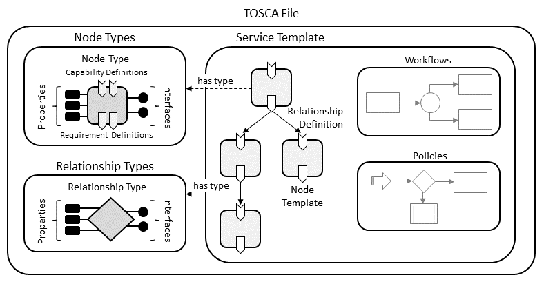

Figure : Structural Elements of a TOSCA File

<!----
{"id": "94", "author": "Jordan,PM,Paul,TNK6 R", "date": "2020-11-04T16:20:00Z", "comment": "A diagram of the example would help", "target": "\nexample"}-->
For example, consider a service
that consists of an application server, a process engine, and a process
model. A Service Template defining that service would include one Node
Template of Node Type “application server”, another Node Template of
Node Type “process engine”, and a third Node Template of Node Type
“process model”. The application server Node Type defines properties
like the IP address of an instance of this type, an operation for
installing the application server with the corresponding IP address, and
an operation for shutting down an instance of this application server. A
constraint in the Node Template can specify a range of IP addresses
available when making a concrete application server available.

Node templates may include one or more
<span class="comment-start" id="96" author="Chris Lauwers"
date="2021-01-18T18:20:00Z">Mike Rehder suggested to use the general
term “relations” to avoid reference to “relationship templates” or
types.</span>*relationships* 
<!----
{"id": "95", "author": "Calin Curescu", "date": "2020-06-22T17:58:00Z", "comment": "Will this be understood correctly, since\nthis is part of the node requirement and not relationship template as\nsuch.", "target": "Node templates may include one or more\n<span class=\"comment-start\" id=\"96\" author=\"Chris Lauwers\"\ndate=\"2021-01-18T18:20:00Z\">Mike Rehder suggested to use the general\nterm \u201crelations\u201d to avoid reference to \u201crelationship templates\u201d or\ntypes.</span>*relationships* "}-->
to
other node templates in the Service Template. Relationships represent
the edges in the service topology
graph.
<!----
{"id": "97", "author": "Michael Rehder", "date": "2020-12-15T08:49:00Z", "comment": "New term! It\u2019s\nconfusing to have \u201cService Template\u201d and \u201cService Topology Graph\u201d and\n\u201cTopology Template\u201d.", "target": "service topology\ngraph"}-->
<!----
{"id": "98", "author": "Chris Lauwers", "date": "2021-01-18T18:17:00Z", "comment": "Should we introduce \u201cservice topology graph\u201d\nwhen what we mean is really the \u201cinstance\nmodel\u201d.", "target": "The"}-->
The node template
that includes the relationship definition is implicitly defined as the
source node of the relationship and the target node is explicitly
specified as part of the relationship definition. Each relationship
definition refers to a Relationship Type that defines the semantics and
any properties of the relationship. Relationship Types can be defined
separately for reuse purposes and organized into profiles.

In the example above, a relationship can be established from the process
engine Node Template to the application server Node Template with the
meaning “hosted by”, and from the process model Node Template to the
process engine Node Template with meaning “deployed on”.

Interfaces, Operations, and Artifacts
-------------------------------------

Both node and relationship types may define lifecycle *operations* that
implement the behavior an orchestration engine can invoke when
instantiating a service template. For example, a node type for some
software product might provide a ‘create’ operation to handle the
creation of an instance of a component at runtime, or a ‘start’ or
‘stop’ operation to handle a start or stop event triggered by an
orchestration engine.

Operations that are related to the same management mission (e.g.
lifecycle management) are grouped together in *Interfaces* that are
defined by node and relationship types. Just like other TOSCA entities,
interfaces refer to their corresponding *Interface Type* that defines
the group of operations that are part of the interface. Interface Types
can also define *notifications* that represent external events that are
generated by the outside world and received by the orchestrator.

The implementations of interface operations can be provided as TOSCA
*artifacts*. An artifact represents the content needed to provide an
implementation for an interface operation. A TOSCA artifact could be an
executable (e.g. a script, an executable program, an image), a
configuration file or data file, or something that might be needed so
that another executable can run (e.g. a library). Artifacts can be of
different types, for example EJBs or python scripts. The content of an
artifact depends on its type. Typically, descriptive metadata (such as
properties) will also be provided along with the artifact. This metadata
might be needed to properly process the artifact, for example by
describing the appropriate execution environment.

Workflows
---------

<!----
{"id": "101", "author": "Michael Rehder", "date": "2020-12-15T08:46:00Z", "comment": "This isn\u2019t correct as this document says\nthat a \u201cService Template\u201d is merely a TOSCA document and so could just\nhave type definitions within it.", "target": ""}-->
A deployed service is an instance of a service
template. More precisely, the instance is created by
instantiating the Service Template of its TOSCA file by running
workflows that are most often automatically created by the orchestrator
and that invoke the interface operations of the Node Types or the Node
Templates. Orchestrators can automatically generate workflows by using
the relationship between components to derive the order of component
instantiation. For example, during the instantiation of a two-tier
application that includes a web application that depends on a database,
an orchestration engine would first invoke the ‘create’ operation on the
database component to install and configure the database, and it would
then invoke the ‘create’ operation of the web application to install and
configure the application (which includes configuration of the database
connection).

Interface operations invoked by workflows must use actual values for the
various properties of the various Node Templates and Relationship
Templates of the Service Template. These values can come from input
passed in by users as triggered by human interactions with the
orchestrator or the templates can specify default values for some
properties. For example, the application server Node Template will be
instantiated by installing an actual application server at a concrete IP
address considering the specified range of IP addresses. Next, the
process engine Node Template will be instantiated by installing a
concrete process engine on that application server (as indicated by the
“hosted by” relationship template). Finally, the process model Node
Template will be instantiated by deploying the process model on that
process engine (as indicated by the “deployed on” relationship
template).

Requirements and Capabilities
-----------------------------

<!----
{"id": "107", "author": "Michael Rehder", "date": "2020-12-15T09:11:00Z", "comment": "Confusing \u2013 \u201cservice topology\u201d is a new\nterm. It\u2019s a \u201ctopology template\u201d but not all \u201cservice template\u201d are a\n\u201ctopology template\u201d.", "target": "service topology within a single service\ntemplate"}-->
We discussed earlier how relationships are used to link node templates
together into a service topology graph. However, it may not always be
possible to define all node templates for a given
service topology within a single service
template. For example, modular
design practices may dictate that different service subcomponents be
modeled using separate service templates. This may result in
relationships that need to be established across multiple service
templates. Additionally, relationships may need to target components
that already exist and do not need to be instantiated by an
orchestrator. For example, relationships may reference physical
resources that are managed in a resource inventory. Service templates
may not include node templates for these resources.

TOSCA accommodates these scenarios using *requirements* and
*capabilities* of node templates. A requirement expresses that one
component depends on (requires) a feature provided by another component,
or that a component has certain requirements against the hosting
environment such as for the allocation of certain resources or the
enablement of a specific mode of operation. Capabilities represent
features exposed by components that can be used to fulfill requirements
of other components.

Relationships are the result of fulfilling a requirement in one node
template using a capability of a different node template. If both source
and target node templates are defined in the same service template,
service designers typically define the relationship between these node
templates explicitly. Requirements that do not explicitly specify a
target node must be fulfilled by the orchestrator at service deployment
time. Orchestrators can take multiple service templates into account
when fulfilling requirements, or they can attempt to use resources
managed in an inventory, which will result in relationships that are
established across service template boundaries.

Requirements and capabilities are modeled by annotating Node Types with
*Requirement Definitions* and *Capability Definitions*. *Capability
Types* are defined as reusable entities so that those definitions can be
used in the context of several Node Types. Requirement definitions can
specify the relationship type that will be used when creating the
relationship that fulfills the requirement.


Figure : Requirements and Capabilities

Node Templates which have corresponding Node Types with Requirement
Definitions or Capability Definitions will include representations of
the respective *Requirements* and *Capabilities* with content specific
to the respective Node Template.

Requirements can be matched in two ways as briefly indicated above: (1)
requirements of a Node Template can be matched by capabilities of
another Node Template in the same Service Template by connecting the
respective requirement-capability-pairs via relationships; (2)
requirements of a Node Template can be matched by the orchestrator, for
example by allocating needed resources for a Node Template during
instantiation.
<!----
{"id": "108", "author": "Michael Rehder", "date": "2020-12-15T16:33:00Z", "comment": "There should be some\ndiscussion about this issue \u2013 how are the relations defined in the\ntopology template related to the relations of the substituted node\ntype?", "target": ""}-->

Decomposition of Service Templates
----------------------------------

<!----
{"id": "114", "author": "Michael Rehder", "date": "2020-12-15T16:17:00Z", "comment": "Another\nplace where I find the use of the term \u201cService Template\u201d overly\nconfusing. It should say \u201cTopology Template\u201d as that is the construct in\nthe end that is supporting the substitution.  \nSection 4.5.1 says \u201ctopology template\u201d so I think this change is in line\nwith the practical definitions in the document.", "target": "Service Template\n"}-->
TOSCA provides support for decomposing service components using the
Substitution Mapping feature. For example, a Service Template
for a business application
that is hosted on an application server tier might focus on defining the
structure and manageability behavior of the business application itself.
The structure of the application server tier hosting the application can
be provided in a separate Service Template built by another vendor
specialized in deploying and managing application servers. This approach
enables separation of concerns and re-use of common infrastructure
templates.


Figure : Service Decomposition

From the point of view of a Service Template (e.g. the business
application Service Template from the example above) that uses another
Service Template, the other Service Template (e.g. the application
server tier) “looks” like just a Node Template. During deployment,
however, this Node Template can be substituted by the second Service
Template if it exposes the same external *façade* (i.e. properties,
capabilities, etc.) as the Node Template. Thus, a substitution with any
Service Template that has the same *facade* as a certain Node Template
in one Service Template becomes possible, allowing for a flexible
composition of different Service Templates. This concept also allows for
providing substitutable alternatives in the form of Service Templates.
For example, a Service Template for a single node application server
tier and a Service Template for a clustered application server tier
might exist, and the appropriate option can be selected per deployment.

Policies in TOSCA
-----------------

Non-functional behavior or quality-of-services are defined in TOSCA by
means of policies. A Policy can express such diverse things like
monitoring behavior, payment conditions, scalability, or continuous
availability, for example.

A Node Template can be associated with a set of Policies collectively
expressing the non-functional behavior or quality-of-services that each
instance of the Node Template will expose. Each Policy specifies the
actual properties of the non-functional behavior, like the concrete
payment information (payment period, currency, amount etc.) about the
individual instances of the Node Template.

These properties are defined by a Policy Type. Policy Types might be
defined in hierarchies to properly reflect the structure of
non-functional behavior or quality-of-services in particular domains.
Furthermore, a Policy Type might be associated with a set of Node Types
the non-functional behavior or quality-of-service it describes.

Policy Templates provide actual values of properties of the types
defined by Policy Types. For example, a Policy Template for monthly
payments for US customers will set the “payment period” property to
“monthly” and the “currency” property to “US\$”, leaving the “amount”
property open. The “amount” property will be set when the corresponding
Policy Template is used for a Policy within a Node Template. Thus, a
Policy Template defines the invariant properties of a Policy, while the
Policy sets the variant properties resulting from the actual usage of a
Policy Template in a Node Template.

Archive Format for Cloud Applications
-------------------------------------

In order to support in a certain environment for the execution and
management of the lifecycle of a cloud application, all corresponding
artifacts have to be available in that environment. This means that
beside the TOSCA file of the cloud application, the deployment
artifacts and implementation artifacts have to be available in that
environment. To ease the task of ensuring the availability of all of
these, this specification defines a corresponding archive format called
CSAR (Cloud Service ARchive).

A CSAR is a container file, i.e. it contains multiple files of possibly
different file types. These files are typically organized in several
subdirectories, each of which contains related files (and possibly other
subdirectories etc.). The organization into subdirectories and their
content is specific for a particular cloud application. CSARs are zip
files, typically compressed. A CSAR may contain a file called TOSCA.meta
that describes the organization of the CSAR.

TOSCA Entities
--------------

<!----
{"id": "129", "author": "Chris Lauwers", "date": "2021-06-28T23:14:00Z", "comment": "This subsection has been moved here from the Operational Model chapter. We need to revisit where exactly it belongs to make sure the document flows correctly.", "target": "<span class=\"comment-start\" id=\"130\" author=\"Chris Lauwers\" date=\"2021-06-28T23:14:00Z\">Alternatively, we could also move this section into Chapter 5</span>Entities"}-->

When defining services using TOSCA, we must distinguish between four
kinds of entities:

1.  **TOSCA Types**: TOSCA types define re-usable building blocks that
    can be used during service design. For example, TOSCA Node Types
    define reusable service components, including their configurable
    properties.
2.  **TOSCA Templates**: TOSCA templates define (typed) components of a
    service. For example, service templates include node templates that
    assign specific values (often using TOSCA intrinsic functions) to
    the configurable properties defined in the corresponding node types.
    It is not uncommon to have multiple node templates of the same node
    type in a service template.
3.  **Representations**: At deployment time, TOSCA implementations
    combine TOSCA service templates with deployment-specific input
    values to create run-time representations of the service that is to
    be deployed and managed. Note that TOSCA does not standardize an
    object model for representations. Instead, such models are
    implementation specific.
4.  **External Implementations**: These are the actual entities in the
    external world that correspond to the representations managed by the
    orchestrator. TOSCA implementations that provide runtime service
    management must keep their internal service representations in sync
    with the actual state of the external implementations.

TOSCA Operational Model
-----------------------

This section presents a TOSCA Functional Architecture and an associated
operational model that supports the three service lifecycle phases
outline above. Note that this functional architecture is not intended to
prescribe how TOSCA must be implemented. Instead, it aims to provide
users of TOSCA with a mental model of how TOSCA implementations are
expected to process TOSCA files.

While TOSCA does not mandate that compatible implementations must
support all three lifecycle phases, a complete architecture must
anticipate all three and must include support for all four kinds of
TOSCA entities. The TOSCA architecture defined here illustrates how the
various TOSCA entities are used and how they are related.

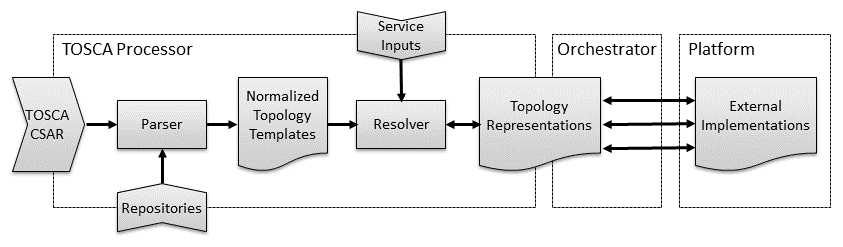

Figure : TOSCA Functional Architecture

The functional architecture defines the following three blocks:

1.  **TOSCA Processor**: This functional block defines functionality
    that must be provided by all TOSCA implementations. TOSCA processors
    convert TOSCA-based service definitions into service
    representations that can be processed by an Orchestrator.
<!----
{"id": "132", "author": "Chris Lauwers", "date": "2021-06-28T23:19:00Z", "comment": "We need to better define the concept of\n    \"representations\"", "target": "representations "}-->
2.  **Orchestrator**: This functional block creates external
    implementations on various resource platforms based on the service
    representations created by a TOSCA processor. The orchestration
    functionality can itself be defined using TOSCA or can be provided
    by external (non-TOSCA) orchestration platforms.
3.  **Platform**: In the context of a TOSCA architecture, platforms
    represent external cloud, networking, or other infrastructure
    resources on top of which service entities can be created.

The remainder of this section describes each of these functional blocks
in more detail.

### TOSCA Processor

At the core of a compliant TOSCA implementation is a TOSCA Processor
that can create service representations from TOSCA service templates. A
TOSCA Processor contains the following functional blocks:

#### Parser

- Accepts a single TOSCA file plus imported TOSCA files (files without a
  “service_template”)
- Can (optionally) import these units from one or more repositories,
  either individually or as complete profiles
- Outputs valid normalized node templates and <u>unresolved</u>
  requirements (one-to-one equivalency)

#### Resolver

A resolver performs the following functions

##### Creating Node Representations

- Converts normalized node templates to node representations.
    - Either one-to-one or one-to-many if multiplicity is involved.
    - Node templates with a "select" directive create a node in the
      local representation graph that is a reference to the selected
      node (from the local or a remote representation graph).
    - Node templates with a "substitute" directive create a node in
      the local representation graph that is associated to a remote
      representation graph created from the substitution template.
- Determines the values of the node properties and attributes
    - From inputs
    - By applying intrinsic functions (e.g. get_property, etc.)
    - Some property and attribute values cannot be initialized since
      they either depend on other uninitialized properties or attributes
      or need to access other node representations via relationships that
      have not been yet initialized.

##### Creating Relationships connecting Node Representations

- Relationships are created by Requirement Fulfillment
    - If a requirement uses a node_filter that refers to uninitialized properties
      or attributes, then the fulfillment of this requirement is postponed until
      all referred properties or attributes are initialized.
    - A circular dependency signifies a erroneous template and shall report an error
    - After a relationship is created, properties and attributes that depend on it
      to be initialized will be initialized. 
- In the end all requirements are satisfied and all relationships are added to the
  representation graph.
    - An unsatisfied non-optional requirement results in an error.

##### Substitution Mapping
- When substitution is directed for a node, the resolver creates a new representation
  according to the substitution template, basically creating a service that is
  represented by the substituted node.
- The substitution service is initialized from the properties of the substituted node
  and the workflows of the substitution service act as operations for the substituted
  node (that is, the behavior of the node is substituted by the substitution service).
    - This is defined via substitution mapping rules.

### Orchestrator

An orchestrator performs the following actions:

- (Continuously) turns node representations into zero or more node
  implementations (one-to-any)
- (Continuously) updates node representation attribute values (error if
  they do not adhere to TOSCA type validation clauses or property
  definition validation clauses) *\[we still don’t know how to handle
  multiplicity\]*
- (Continuously) reactivates the resolver: outputs and even satisfaction
  of requirements may change.
- (Optionally) changes the node representations themselves for day 2
  transformations.

#### Changes in the representation graph

During the lifetime of a service there can be several actions or events that 
change the representation graph of the running service.

We can identify the several situations that mandate the change of the 
representation graph, for example:
- Update:
    - The service input values have changed and need to be re-evaluated while
      the service is running.
- Upgrade:
    - The service template has changed and needs to be re-evaluated while the
      service is running.
- Runtime failures:
    - Nodes or relationships in the representation graph have failed and need
      to be recreated while the service is running.
- Change in dependencies
    - External nodes or relationships to external nodes have failed and new
      relationships to external nodes need to be created (i.e. external
      requirements need to be fulfilled again) while the service is running.
      
For the service to reach the new desired runtime state, operations that are 
associated with the creation, deletion, and modification of
nodes and relationships in the representation graph need to be performed.

We can visualize (and the orchestrator can preform) these restorative actions
via graph traversals on the "old" and "new" representation graph.

First let's categorize the nodes and relationships in the "old" and "new"
representation graphs in the following four categories:
- Unchanged: These are nodes and relationships that appear in both the
  "old" and "new" representation graphs and have the same property values.
  Given that a template can be upgrades, we correlate the same nodes and
  relationships via their symbolic node names and requirement names.
- Modified: These are nodes and relationships that appear in both the
  "old" and "new" representation graphs and have different property values.
- Obsolete: These are nodes and relationships that appear in the "old"
  representation graph but not in the "new" representation graph.
- Novel: These are nodes and relationships that do not appear in the "old"
  representation graph but appear in the "new" representation graph.

##### An example of graph-traversal changes performed with changes in the representation graph

For example we start by traversing the "old" representation graph in 
reverse dependency order:
- we start in parallel with all nodes that have no incoming dependency relationship
    - we perform operations associated with deleting on all adjacent relationships
      to this node that are in the "obsolete" category.
    - we perform operations associated with deleting on the node itself if it is
      in the "obsolete" category.
    - we move to nodes that have no incoming dependency relationship to nodes that
      have not been processed yet.

After we have processed the deletion of the obsolete elements we traverse the "new" 
representation graph in dependency order to preform the modifications and creations:
- we start in parallel with the nodes that have no outgoing dependency relationship
    - we perform operations associated with creation resp. modification on the node itself
      if it is in the "novel" resp. "modified" category
    - we perform operations associated with creation resp. modification on all adjacent
      relationships in the "novel" resp. "modified" category if the node on the other
      side of the relationship has been processed.
    - we move to nodes that have no outgoing dependency relationship to nodes that
      have not been processed yet.

After this we can consider the service to be in the new desired runtime state, and the
"old" representation graph can be discarded and the "new" representation graph becomes
the current representation graph of the service.

Note that this graph traversal behavior should be associated with the relevant
interface types that are defined in a TOSCA profile, where it should be specified 
which relationship types form the dependency relationships, which operation(s)
are associated with the deletion, modification, and creation of the nodes and 
relationships when the representation graph changes.

-------

# TOSCA Metamodel
<!----
{"id": "157", "author": "Chris Lauwers", "date": "2022-06-25T17:36:00Z", "comment": "Inconsistent capitalization", "target": "<span class=\"comment-start\" id=\"158\" author=\"Chris Lauwers\" date=\"2022-06-25T17:36:00Z\">This section should be moved into the previous chapter</span><span class=\"comment-start\" id=\"159\" author=\"Chris Lauwers\" date=\"2022-12-05T18:42:00Z\">What is a metamodel?</span>Metamodel"}-->

This section defines the models and the modeling goals that comprise the
TOSCA Version 2.0 specification.

## Modeling Concepts and Goals

> TBD. Here we should have selected core concepts of TOSCA 1.0 from
> section “[3   Core Concepts and Usage
> Pattern](http://docs.oasis-open.org/tosca/TOSCA/v1.0/os/TOSCA-v1.0-os.html#_Toc356403643)”
> and this section should be a more in-depth section than section 2.1
> in this document.

<!----
{"id": "161", "author": "Calin Curescu", "date": "2020-04-16T12:53:00Z", "comment": "This section needs completion before submitting the TOSCA 2.0.", "target": "Modeling concepts and goals\n\nTBD. Here we should have selected core concepts of TOSCA 1.0 from\nsection \u201c[3\u00a0\u00a0\u00a0Core Concepts and Usage\nPattern](http://docs.oasis-open.org/tosca/TOSCA/v1.0/os/TOSCA-v1.0-os.html#_Toc356403643)\u201d\nand this section should be a more in-depth section than section 2.1 in\nthis document."}-->

> Add a metamodel picture

> Explain separation of concerns and different roles. Refer to email
> from Peter.

## Modeling Definitions and Reuse

The TOSCA metamodel includes complex definitions used in types and
templates. Reuse concepts simplify the design of TOSCA templates by
allowing relevant TOSCA entities to use and/or modify definitions
already specified during entity type design. The following four concepts
are clarified next:

- **Definition**:

  - The TOSCA specification is based on defining modeling entities.
  - Entity definitions are based on different sets of keynames (with
    specific syntax and semantics) that are associated with values (of a
    specific format).

<!----
{"id": "163", "author": "Chris Lauwers", "date": "2021-01-17T00:51:00Z", "comment": "Alternative language proposed by PJ:\n  Entity definitions comprise pairs of keynames and values. Each entity\n  has it own syntax, semantics and set of\n  keynames.", "target": "format"}-->

- **Derivation**:

  - Specific TOSCA entities support a type definition.
  - When defining a type, it can be derived from a parent type and inherit
    all the definitions of the parent type.
  - The derivation rules describe what (keyname) definitions are inherited
    from the parent type and further if and how they can be expanded or modified. Note
    that some definitions (for example, “version”) and intrinsic to the
    type declaration and so are not inherited.
  - A parent type can in turn be derived from a parent type. There is no
    limit to the depth of a chain of derivations.
  
<!----
{"id": "164", "author": "Jordan,PM,Paul,TNK6 R", "date": "2020-11-04T16:42:00Z", "comment": "Expansion and modification is part of\n  Refinement not Derivation. This bullet point should be\n  removed", "target": ""}-->

- **Refinement**:

  - Definitions within a type definition consist of the definition of
    keynames and other TOSCA entities (e.g. properties, requirements,
    capabilities, etc.). 
    Definitions within a parent type can be refined (adjusted) to better
    suit the needs of the referencing type.
  - The refinement rules pertaining to an entity describe how such entity
    definitions that are inherited from the parent type during a type
    derivation can be expanded or modified.

<!----
{"id": "165", "author": "Jordan,PM,Paul,TNK6 R", "date": "2020-11-04T16:43:00Z", "comment": "Type\n  definition is part of Definition not\n  Refinement", "target": ""}-->

- **Augmentation**:

  - Definitions within a parent type can be expanded, which is the
    addition of properties, to better suit the requirements of the
    referencing type.
  - The augmentation rules pertaining to an entity describe how the
    inherited parent type during a type derivation can be added to.

<!----
{"id": "166", "author": "Mike Rehder", "date": "2020-04-30T11:10:00Z", "comment": "I think separating augmentation is helpful\n  (as YANG has done). I think it makes it easier to understand the rules\n  that apply for the refining or augmenting\n  scenario", "target": "**Augmentation**"}-->

- **Assignment**:

  - When creating a service template, we specify several entities that are
    part of the template (e.g., nodes, relationships, groups, etc.).
  - When adding such an entity in the service template, for some
    definitions that appear in the corresponding entity type (e.g.,
    properties, operations, requirements, etc.) we may (or must) assign a
    certain specification (or value).

## Goal of the Derivation and Refinement Rules

The main reason for derivation and refinement rules is to create a
framework useful for a consistent TOSCA type profile creation. The
intuitive idea is that a derived type follows to a large extent the
structure and behavior of a parent type, otherwise it would be better to
define a new "not derived" type.

The guideline regarding the derivation rules is that a node of a derived
type should be usable instead of a node of the parent type during the
selection and substitution mechanisms. These two mechanisms are used by
TOSCA templates to connect to TOSCA nodes and services defined by other
TOSCA templates:

- The selection mechanism allows a node instance created a-priori by
  another service template to be selected for usage (i.e., building
  relationships) to the current TOSCA template.

- The substitution mechanism allows a node instance to be represented by
  a service created simultaneously via a substitution template.

It is relevant to emphasize the cross-template usage, as only in this
case we deal with templates defined at different design time-points,
with potentially different editing and maintenance restrictions.

## Mandatory Keynames

The TOSCA metamodel includes complex definitions used in types (e.g.,
Node Types, Relationship Types, Capability Types, Data Types, etc.),
definitions and refinements (e.g., Requirement Definitions, Capability
Definitions, Property and Parameter Definitions, etc.) and templates
(e.g., Service Template, Node Template, etc.) all of which include their
own list of reserved keynames that are sometimes marked as
**mandatory**. If a keyname is marked as mandatory it **MUST** be
defined in that particular definition context. In some definitions,
certain keywords may be mandatory depending on the value of other
keywords in the definition. In that case, the keyword will be marked as
**conditional** and the condition will be explained in the description
column. Note that in the context of type definitions, types may be used
to derive other types, and keyname definitions **MAY** be inherited from
parent types (according to the derivation rules of that type entity). If
a keyname definition is inherited, the derived type does not have to
provide such definition.

# TOSCA File
<!----
{"id": "172", "author": "Calin Curescu", "date": "2020-04-20T18:49:00Z", "comment": "TBD. Here comes some intro and generic description of the different specification blocks that will build the following sections.", "target": "TOSCA Service"}-->
<!----
{"id": "173", "author": "Michael Rehder", "date": "2020-12-15T08:38:00Z", "comment": "This isn\u2019t true \u2013 if a \u201cService Template\u201d\ncan contain just supporting parts like type definitions then it won\u2019t\ncontain a \u201cTOSCA Service\u201d.  \nIn the end, I think that the term \u201cService Template\u201d is very confusing\nas it is never used as a \u201ctemplate\u201d, as an object. It\u2019s a collection of\ndefinitions, some of which are supporting and one of which is the\nworking code definition for the service to be realized.  \n\u201cService Definition\u201d is a more practical term.", "target": "A TOSCA Service is\nspecified by a TOSCA Service <span class=\"comment-start\" id=\"174\"\nauthor=\"Chris Lauwers\" date=\"2022-12-05T18:44:00Z\">We haven't defined\nservice template yet.</span>Template"}-->
<!----
{"id": "178", "author": "Chris Lauwers", "date": "2022-06-22T14:26:00Z", "comment": "Update to reflect new naming", "target": "TOSCA file definition"}-->

A TOSCA file contains reusable definitions of building blocks for use in cloud
applications or complete models of cloud applications or both. This section
describes the top-level TOSCA keynames—along with their grammars—that
are allowed to appear in a TOSCA file.

## TOSCA File Definition

### Keynames

The following is the list of recognized keynames for a TOSCA file:

|Keyname|Mandatory|Type|Description|
| :---- | :------ | :---- | :------ |
|tosca_definitions_version|yes|string|Defines the version of the TOSCA specification used in the TOSCA file |
|profile|no|string|The profile name that can be used by other TOSCA files to import the type definitions in this document.|
|metadata|no|map of YAML values|Defines a section used to declare additional metadata information.  Domain-specific TOSCA profile specifications may define keynames that are mandatory for their implementations. |
|description|no|string|Declares a description for this TOSCA file and its contents.|
|dsl_definitions|no |N/A|Defines reusable YAML macros (i.e., YAML alias anchors) for use throughout the TOSCA file.|
|repositories|no|map of Repository definitions|Declares the map of external repositories that contain artifacts that are referenced in the TOSCA file along with the addresses used to connect to them in order to retrieve the artifacts.|
|imports|no|list of Import definitions|Declares a list of import statements pointing to external TOSCA files or well-known profiles. For example, these may be file locations or URIs relative to the TOSCA file within the same TOSCA CSAR file.|
|artifact_types|no|map of Artifact Types|This section contains a map of artifact type definitions for use in the TOSCA file and/or external TOSCA files.|
|data_types|no|map of Data Types|Declares a map of TOSCA Data Type definitions for use in the TOSCA file and/or external TOSCA files.|
|capability_types|no|map of Capability Types|This section contains a map of capability type definitions for use in the TOSCA file and/or external TOSCA files.|
|interface_types|no|map of Interface Types|This section contains a map of interface type definitions for use in the TOSCA file and/or external TOSCA files.|
|relationship_types|no|map of Relationship Types|This section contains a map of relationship type definitions for use in the TOSCA file and/or external TOSCA files.|
|node_types|no|map of Node Types|This section contains a map of node type definitions for use in the TOSCA file and/or external TOSCA files.|
|group_types|no|map of Group Types|This section contains a map of group type definitions for use in the TOSCA file and/or external TOSCA files.|
|policy_types|no|map of Policy Types|This section contains a map of policy type definitions for use in the TOSCA file and/or external TOSCA files.|
|service_template|no|service template definition|Defines a template from which to create a mode/representation of an application or service. Service templates consist of node templates that represent the application's or service's components, as well as relationship templates representing relations between these components.|
|functions|no|map of function definitions|This section contains a map of function definitions for use in the TOSCA file and/or external TOSCA files.|

### Grammar

The overall structure of a TOSCA file and its top-level keynames is
shown below:
```
# Mandatory TOSCA version string
tosca_definitions_version: <value>  # Mandatory, see section 3.1 for usage
profile: <string>                   # Optional, see section 3.2 for usage

# Optional metadata keyname: value pairs
metadata:
  
  # map of YAML values

# Optional description of the definitions inside the file.
description: <template_ description>

dsl_definitions:
  # map of YAML alias anchors (or macros)

repositories:
  # map of external repository definitions which host TOSCA artifacts

imports:
  # ordered list of import definitions 

artifact_types:
  # map of artifact type definitions

data_types:
  # map of datatype definitions

capability_types:
  # map of capability type definitions

interface_types
  # map of interface type definitions

relationship_types:
  # map of relationship type definitions

node_types:
  # map of node type definitions

group_types:
  # map of group type definitions

policy_types:
  # map of policy type definitions

functions:
  # map of function definitions`

service_template:
  # service template definition of the cloud application or service

```

#### Requirements

- The key `tosca_definitions_version` MUST be the first line of each
  TOSCA file.

#### Notes
<!----
{"id": "194", "author": "Matt Rutkowski", "date": "2015-08-25T21:52:00Z", "comment": "**[TOSCA-246](../customXml/item1.xml): Comments captured**: Perhaps need an advanced concept to define \u201cfeatures\u201d that are not necessarily attached to a particular node. (like things you might include in a manifest). Like the requirement for a global time sync. How do we reference that feature, where is that feature attached to (some node?). perhaps add a new keyword like \u201ccloud\u201d that can hold all these Features that have no immediate Node to attach them to. Perhaps a syntax convention, where we might just list the names of the features (in some precedent order (sequence). Need to answer: -Who requires, it who fulfills it and how do u maintain the relationship? Luc: Environmental requirements. e.g., Python or something similar.", "target": "Notes"}-->

- TOSCA files do not have to contain a service_template and MAY contain
  simply type definitions (e.g., Artifact, Interface, Capability, Node,
  Relationship Types, etc.), repository definitions, function
  definitions, or other import statements and be imported for use in
  other TOSCA files.

### Top-level keyname definitions

#### tosca_definitions_version

This mandatory element provides a means to specify the TOSCA version
used within the TOSCA file. It is an indicator for the version of the
TOSCA grammar that should be used to parse the remainder of the TOSCA
file.

##### Keyname
```
tosca_definitions_version 
```
##### Grammar

```
tosca_definitions_version: <tosca_version> 
```

TOSCA uses the following version strings for the various revisions of
the TOSCA specification:

| Version String        | TOSCA Specification                      |
|-----------------------|------------------------------------------|
| tosca_2_0             | TOSCA Version 2.0                        |
| tosca_simple_yaml_1_3 | TOSCA Simple Profile in YAML Version 1.3 |
| tosca_simple_yaml_1_2 | TOSCA Simple Profile in YAML Version 1.2 |
| tosca_simple_yaml_1_1 | TOSCA Simple Profile in YAML Version 1.1 |
| tosca_simple_yaml_1_0 | TOSCA Simple Profile in YAML Version 1.0 |

The version for this specification is tosca_2_0.

Note that it is not mandatory for TOSCA Version 2.0 implementations to
support older versions of the TOSCA specifications.

##### Examples:

A TOSCA file designed using the TOSCA Version 2.0 specification:
```
tosca_definitions_version: tosca_2_0
```

#### profile
<!----
{"id": "207", "author": "Chris Lauwers", "date": "2020-09-01T02:02:00Z", "comment": "Perhaps this should be its own section?", "target": "<span class=\"comment-start\" id=\"208\" author=\"Chris Lauwers\" date=\"2020-09-01T16:52:00Z\">What happens if files imported by a \u201cprofile\u201d file also defines a profile?</span>profile"}-->

The profile keyword is used to assign a profile name to the collection
of types defined in this TOSCA file. TOSCA implementations use profile
names to register known profiles into an internal repository. These
profiles can then be imported by other TOSCA files using the profile
keyword in their import statement.

##### Keyname
```
profile
```

##### Grammar
```
profile: <string_value\> 
```

TOSCA does not place any restrictions on the value of the profile name
string. However, we encourage a Java-style reverse-domain notation with
version as a best-practice convention.

##### Examples

The following is an example of a TOSCA file that defines TOSCA Simple
Profile Version 2.0 types:
```
profile: org.oasis-open.tosca.simple:2.0 
```

The following defines a domain-specific profile for Kubernetes:
```
profile: io.kubernetes:1.18 
```

#### metadata

This keyname is used to associate domain-specific metadata with the
Service Template. The metadata keyname allows a declaration of a map of
keynames with values that can use all types supported by the [YAML 1.2.2
recommended
schemas](https://yaml.org/spec/1.2.2/#chapter-10-recommended-schemas)
\[Yaml-1.2\]. Specifically, the following types can be used for metadata
values: map, seq, str, null, bool, int, float.
<!----
{"id": "213", "author": "Chris Lauwers", "date": "2022-12-06T14:44:00Z", "comment": "Did we\ndecide to allow recursive metadata (i.e. maps of\nmaps?)", "target": "float"}-->

##### Keyname
```
metadata 
```

##### Grammar
```
metadata: 
  <map_of_yaml_values>
```

##### Example
```
metadata: 
  creation_date: 2015-04-14
  date_updated: 2015-05-01
  status: developmental  
```

#### description

This optional keyname provides a means to include single or multiline
descriptions within a TOSCA template as a scalar string value.

##### Keyname
```
description 
```

##### Grammar
```
description: <description>
```

##### Example

Single line example
```
description: A simple example service template 
```

Multi-line example
```
description: "A multiline description 
using a quoted string”
```

#### dsl_definitions

This optional keyname provides a section to define macros YAML-style
macros for use in the TOSCA file.

##### Keyname
```
dsl_definitions 
```

##### Grammar 
```
dsl_definitions:
   <dsl_definition_1>
   ...
   <dsl_definition_n>
```

##### Example
<!----
{"id": "236", "author": "Jordan,PM,Paul,TNK6 R", "date": "2020-11-05T11:18:00Z", "comment": "There should also be an example of how to use the macro once defined.", "target": "Example"}-->
```
dsl_definitions:
    ubuntu_image_props: &ubuntu_image_props
      architecture: x86_64
      type: linux
      distribution: ubuntu
      os_version: 14.04

    redhat_image_props: &redhat_image_props
      architecture: x86_64
      type: linux
      distribution: rhel
      os_version: 6.6
```

#### repositories

This optional keyname provides a section to define external repositories
that may contain artifacts or other TOSCA files that might be referenced
or imported by this TOSCA file.

##### Keyname
```
repositories 
```

##### Grammar 
```
repositories:
   <repository_definition_1>
   ...
   <repository_definition_n>
```

##### Example
```
repositories:
  my_project_artifact_repo:
    description: development repository for TAR archives and Bash scripts
    url: http://mycompany.com/repository/myproject/
  external_repo: https://foo.bar
```

#### imports

This optional keyname provides a way to import a one or more TOSCA
profiles or other TOSCA files that contain reusable TOSCA type
definitions (e.g., Node Types, Relationship Types, Artifact Types,
etc.), function definitions, repository definitions, or other imports
defined by other authors. This mechanism provides an effective way for
companies and organizations to define domain-specific types and/or
describe their software applications for reuse in other TOSCA files.

##### Keyname
```
imports 
```

##### Grammar 
```
imports:
   - <import_definition_1>
   - ...
   - <import_definition_n>
```

##### Example
```
# An example import of TOSCA files from a location relative to the 
# file location of the TOSCA file declaring the import.
imports:
  - relative_path/my_defns/my_typesdefs_1.yaml
  - url: my_defns/my_typesdefs_n.yaml    
    repository: my_company_repo
    namespace: mycompany
```

#### artifact_types

This optional keyname lists the Artifact Types that are defined by this
TOSCA file.

##### Keyname
```
artifact_types 
```

##### Grammar
```
artifact_types:
  <artifact_type_defn_1>
  ...
  <artifact type_defn_n>
```
##### Example
```
artifact_types:
  mycompany.artifacttypes.myFileType:
    derived_from: tosca.artifacts.File
```
#### data_types

This optional keyname provides a section to define new data types in
TOSCA.

##### Keyname
```
data_types 
```

##### Grammar 
```
data_types:
   <tosca_datatype_def_1>
   ...
   <tosca_datatype_def_n>
```

##### Example
```
data_types:
  # A complex datatype definition
  simple_contactinfo_type:
    properties:
      name:
        type: string
      email:
        type: string
      phone:
        type: string

  # datatype definition derived from an existing type
  full_contact_info:
    derived_from: simple_contact_info
    properties:
      street_address:
        type: string
      city: 
        type: string
      state:
        type: string
      postalcode:
        type: string
```
#### capability_types

This optional keyname lists the Capability Types that provide the
reusable type definitions that can be used to describe features of nodes
that can be used to fulfill requirements of other nodes.

##### Keyname
```
capability_types 
```

##### Grammar 
```
capability_types:
  <capability_type_defn_1>
  ...
  <capability type_defn_n>
```
##### Example
```
capability_types:
  mycompany.mytypes.myCustomEndpoint:
    derived_from: tosca.capabilities.Endpoint
    properties:
      # more details ...

  mycompany.mytypes.myCustomFeature:
    derived_from: tosca.capabilities.Feature
    properties:
      # more details ...
```
#### interface_types

This optional keyname lists the Interface Types that provide the
reusable type definitions that can be used to describe operations
exposed by TOSCA relationships and nodes.

##### Keyname
```
interface_types 
```

##### Grammar 
```
interface_types:
  <interface_type_defn_1>
  ...
  <interface type_defn_n>
```
##### Example
```
interface_types:
  mycompany.interfaces.service.Signal:
    operations:
      signal_begin_receive:
        description: Operation to signal start of some message processing.
      signal_end_receive:
        description: Operation to signal end of some message processed.
```
#### relationship_types

This optional keyname lists the Relationship Types that provide the
reusable type definitions that can be used to describe dependent
relationships between nodes.

##### Keyname
```
relationship_types 
```

##### Grammar 
```
relationship_types:
  <relationship_type_defn_1>
  ...
  <relationship type_defn_n>
```
##### Example
```
relationship_types:
  mycompany.mytypes.myCustomClientServerType:
    derived_from: tosca.relationships.HostedOn
    properties:
      # more details ...

  mycompany.mytypes.myCustomConnectionType:
    derived_from: tosca.relationships.ConnectsTo
    properties:
      # more details ...
```
#### node_types

This optional keyname lists the Node Types that provide the reusable
type definitions for nodes in a service.

##### Keyname
```
node_types
```

##### Grammar 
```
node_types:
  <node_type_defn_1>
  ...
  <node_type_defn_n>
```
##### Example
```
node_types:
  my_webapp_node_type:
    derived_from: WebApplication
    properties:
      my_port:
        type: integer

  my_database_node_type:
    derived_from: Database
    capabilities:
      mytypes.myfeatures.transactSQL
```
#### group_types

This optional keyname lists the Group Types that are defined by this
TOSCA file.

##### Keyname
```
group_types 
```

##### Grammar 
```
group_types:
  <group_type_defn_1>
  ...
  <group type_defn_n>

```
##### Example
```
group_types:
  mycompany.mytypes.myScalingGroup:
    derived_from: tosca.groups.Root
```

#### policy_types

This optional keyname lists the Policy Types that are defined by this
TOSCA file.

##### Keyname
```
policy_types 
```

##### Grammar 
```
policy_types:
  <policy_type_defn_1>
  ...
  <policy type_defn_n>
```
##### Example
<!----
{"id": "327", "author": "Jordan,PM,Paul,TNK6 R", "date": "2020-11-09T08:48:00Z", "comment": "There should be a second policy definition in the example or it is just a repeat of the policy type definition example", "target": "Example"}-->
```
policy_types:
  mycompany.mytypes.myScalingPolicy:
    derived_from: tosca.policies.Scaling
```
## Profiles

A profile is a named collection of TOSCA type definitions, artifacts,
and service templates that logically belong together. One can think of
TOSCA profiles as platform libraries exposed by the TOSCA orchestration
platform and made available to all services that use that platform.
Profiles in TOSCA are similar to libraries in traditional computer
programming languages.

Profiles contain a collection of pre-defined components that can be used
by service designers to compose complex service templates, Entities
defined in TOSCA profiles are used as follows:

- Types defined in a TOSCA profile provide reusable building blocks from
  which services can be composed.
- Artifacts and service templates defined in a TOSCA profile provide
  implementations for the TOSCA types defined in the profile. Whereas
  artifacts provide interface operation implementations for concrete
  nodes and relationships, service templates defined in TOSCA profiles
  are intended to implement abstract nodes through substitution mapping.

TOSCA implementations can organize supported profiles in a catalog to
allow other service templates to import those profiles by profile name.
This avoids the need for every service that use those profiles to
include the profile type definitions in their service definition
packages.

### Examples

Version 1.x of the TOSCA specification included a collection of
normative type definitions for building cloud applications. This
collection of type definitions was defined as the **TOSCA Simple
Profile**. Implementations of TOSCA Version 1.x were expected to include
implementations for the types defined in the TOSCA Simple Profile, and
service templates defined using TOSCA Version 1.x implicitly imported
the corresponding TOSCA Simple Profile version.

Starting with TOSCA Version 2.0, the TOSCA Simple Profile type
definitions are no longer part of the TOSCA standard and support for the
TOSCA Simple Profile is no longer mandatory. Instead, the definition of
the TOSCA Simple Profile has been moved to an OASIS Open Github
repository with the goal of being maintained by the TOSCA community and
governed as an open-source project. In addition, TOSCA Version 2.0
removes the implicit import of the TOSCA Simple Profile. Service
templates that want to continue to use the TOSCA Simple Profile type
definitions must explicitly import that profile.

Eliminating mandatory support for the TOSCA Simple Profile makes it
easier for TOSCA to be used for additional application domains. For
example, the European Telecommunications Standards Institute (ETSI) has
introduced a TOSCA profile for **Network Functions Virtualization**
defines Virtualized Network Function Descriptors (VNFDs), Network
Service Descriptors (NSDs) and a Physical Network Function Descriptors
(PNFDs).

> We should give a couple of additional examples.

### Defining Profiles

A TOSCA file defines a TOSCA Profile if the profile keyword is used in
that service template. The value of the profile keyword defines the name
for the profile, which allows other service templates to import the
profile by name.

TOSCA does not impose naming conventions for profile names, but as a
best practice we recommend a domain-name-like structure as used for Java
package naming. For example, the following profile statement is used to
define TOSCA Simple Profile Version 2.0 types:
```
profile: org.oasis-open.tosca.simple:2.0 
```
TOSCA parsers MUST process profile definitions according to the
following rules:

- TOSCA files that define a profile (i.e., that contain a profile
  keyname) MUST NOT also define a service template.
- If the parser encounters the profile keyname in a TOSCA file, then the
  corresponding profile name will be applied to all types defined in
  that file as well as to types defined in any imported TOSCA files.
- If one of those imported files also defines the profile keyname—and
  that profile name is different from the name of the importing
  profile—then that profile name overrides the profile name value from
  that point in the import tree onward, recursively.
- TOSCA service templates defined in profiles MUST advertise
  substitution mapping to allow them to be used as implementations for
  abstract nodes defined using profile types.

### Profile Versions

TOSCA Profiles are likely to evolve over time and profile designers will
release different versions of their profiles. For example, the TOSCA
Simple Profile has gone through minor revisions with each release of the
TOSCA Version 1 standard. It is expected that profile designers will use
a version qualifier to distinguish between different versions of their
profiles, and service template designers must use the proper string name
to make sure they import the desired versions of these profiles.

> Do we impose a structure on profile names that distinguishes the version
> qualifier from the base profile name? If so, is there a specific
> separator character or string (in which case the use of the separator
> must be escaped somehow (or disallowed) in profile names.

When multiple versions of the same profile exist, it is possibly that
service templates could mix and match different versions of a profile in
the same service definition. The following code snippets illustrate this
scenario:

Assume a profile designer creates version 1 of a base profile that
defines (among other things) a **Host** capability type and a
corresponding **HostedOn** relationship type as follows:
```
tosca_definitions_version: tosca_2_0
profile: org.base.v1
capability_types:
  Host:
    description: Hosting capability
relationship_types:
  HostedOn:
    valid_capability_types: [ Host ]
```
Now let’s assume a different profile designer creates a
platform-specific profile that defines (among other things) a
**Platform** node type. The Platform node type defines a capability of
type **Host**. Since the **Host** capability is defined in the
**org.base.v1** profile, that profile must be imported as shown in the
snippet below:
```
tosca_definitions_version: tosca_2_0
profile: org.platform
imports:
  - profile: org.base.v1
    namespace: p1
node_types:
  Platform:
    capabilities:
      host:
        type: p1:Host
```
At some later point of time, the original profile designer updates the
**org.base** profile to Version 2. The updated version of this profile
just adds a **Credential** data type (in addition to defining the
**Host** capability type and the **HostedOn** relationship type), as
follows:
```
tosca_definitions_version: tosca_2_0
profile: org.base.v2
capability_types:
  Host:
    description: Hosting capability
relationship_types:
  HostedOn:
    valid_capability_types: [ Host ]
data_types:
  Credential:
    properties:
      key:
        type: string
```
Finally, let’s assume a service designer creates a template for a
service that is to be hosted on the platform defined in the
**org.platform** profile. The template introduces a **Service** node
type that has a requirement for the platform’s **Host** capability. It
also has a credential property of type **Credential** as defined in
**org.base.v2**:
```
tosca_definitions_version: tosca_2_0
imports:
  - profile: org.base.v2
    namespace: p2
  - profile: org.platform
    namespace: pl
node_types:
  Service:
    properties:
      credential:
        type: p2:Credential
    requirements:
      - host:
          capability: p2:Host
          relationship: p2:HostedOn
service_template:
  node_templates:
    service:
      type: Service
      properties:
        credential:
          key: password
      requirements:
        - host: platform
    platform:
      type: pl:Platform
```
This service template is invalid, since the **platform** node template
does not define a capability of a type that is compatible with the
**valid_capability_types** specified by the **host** requirement in the
**service** node template. TOSCA grammar extensions are needed to
specify that the **Host** capability type defined in **org.base.v2** is
the same as the **Host** capability type defined in **org.base.v1**

The example in this section illustrates a general version compatibility
issue that exists when different versions of the same profile are used
in a TOSCA service.

> A number of suggestions for these extensions are currently being
> discussed. Grammar extensions will be included in this document one they
> are agreed upon.

## Imports
<!----
{"id": "346", "author": "Chris Lauwers", "date": "2020-09-01T00:20:00Z", "comment": "I don\u2019t know what is meant by \u201creferences\u201d.", "target": "Imports"}-->
 and Namespaces

### Import definition
<!----
{"id": "350", "author": "Calin Curescu", "date": "2019-01-30T15:54:00Z", "comment": "It would be good to allow also the import of specific types (via their fully qualified names) and also entire namespaces (i.e. types from entire namespaces) from a/the catalogue. That is, in addition to importing from a file: Globally well-known Local catalog File", "target": "Import definition"}-->

An import definition is used within a TOSCA file to locate and uniquely
name another TOSCA file or TOSCA profile that has type, repository, and
function 
<!----
{"id": "351", "author": "Chris Lauwers", "date": "2020-09-01T00:21:00Z", "comment": "I think it should be illegal to import a\nservice template that contains a topology\ntemplate.", "target": ""}-->
definitions to
be imported
<!----
{"id": "352", "author": "Matt Rutkowski", "date": "2016-09-06T09:49:00Z", "comment": "Nodejs has NPM that uses the following to\nimport new package modules:  \nA package is:  \na) a folder containing a program described by a\n[package.json](numbering.xml) file  \nb) a gzipped tarball containing (a)  \nc) a url that resolves to (b)  \nd) a \\<name\\>@\\<version\\> that is published on the registry (see\n[npm-registry](styles.xml)) with (c)  \ne) a \\<name\\>@\\<tag\\> (see [npm-dist-tag](settings.xml)) that points to\n(d)  \nf) a \\<name\\> that has a \"latest\" tag satisfying (e)  \ng) a \\<git remote url\\> that resolves to (a)  \nwe may want to adopt something similar if TOSCA references service\ntemplate (packages) from a\ncatalog)", "target": "imported"}-->
(included) into another TOSCA file.

#### Keynames

The following is the list of recognized keynames for a TOSCA import
definition:

| Keyname    | Mandatory   | Type                        | Description                                                                                                                                                             |
|------------|-------------|-----------------------------|-------------------------------------------------------------------------------------------------------------------------------------------------------------------------|
| url        | conditional | [string](#TYPE_YAML_STRING) | The url that references a service template to be imported. An import statement must include either a url or a profile, but not both.                                    |
| profile    | conditional | string                      | The profile name that references a named type profile to be imported. An import statement must include either a url or a profile, but not both.                         |
| repository | conditional | [string](#TYPE_YAML_STRING) | The optional symbolic name of the repository definition where the imported file can be found as a string. The repository name can only be used when a url is specified. |
| namespace  | no          | [string](#TYPE_YAML_STRING) | The optional name of the namespace into which to import the type definitions from the imported template or profile.                                                     |

#### Grammar

Import definitions have one the following grammars:

##### Single-line grammar:
When using the single-line grammar, the url keyword is assumed:
```
imports:
  - <URI_1>
  - <URI_2>
```
##### Multi-line grammar

The following multi-line grammar can be used for importing TOSCA files:
```
imports:  
  - url: <file_URI>   
    repository: <repository_name>
    namespace: <namespace_name>
```
The following multi-line grammar can be used for importing TOSCA
profiles:
```
imports:  
  - profile: <profile_name>   
    namespace: <namespace_name>
```
In the above grammars, the pseudo values that appear in angle brackets
have the following meaning:

- file_uri: contains the URL that references the service template file
  to be imported as a [string](#TYPE_YAML_STRING).

- repository_name: represents the optional symbolic name of the
  repository definition where the imported file can be found as a
  [string](#TYPE_YAML_STRING).

- profile_name: the name of the well-known profile to be imported.

- namespace_name: represents the optional name of the namespace into
  which type definitions will be imported. The namespace name can be
  used to form a namespace-qualified name that uniquely references type
  definitions from the imported file or profile. If no namespace name is
  specified, type definitions will be imported into the root namespace.

#### Import processing rules 

TOSCA Orchestrators, Processors and tooling SHOULD handle import
statements as follows:

##### Importing profiles

If the profile keyname is used in the import definition, then the TOSCA
orchestrator or processor SHOULD attempt to import the profile by name:

- If \<profile_name\> represents the name of a profile that is known to
  the TOSCA orchestrator or processor, then it SHOULD cause the Profile
  Type definitions to be imported.

- If \<profile_name\> is not known, the import SHOULD be considered a
  failure.

##### Importing service templates

If the url keyname is used, the TOSCA orchestrator or processor SHOULD
attempt to import the file referenced by \<file_URI\> as follows:

- If the \<file_URI\> includes a URL scheme (e.g. file: or https:)
  then\<file_URI\> is considered to be a network accessible resource. If
  the resource identified by \<file_URL\> represents a valid TOSCA file,
  then it SHOULD cause the remote Service Template to be imported.

  - Note that if in addition to a URL with a URL scheme, the import
    definition also specifies a \<repository_name\> (using the repository
    key), then that import definition SHOULD be considered invalid.

- If the \<file_URI\> does not include a URL scheme, it is a considered
  a relative path URL. The TOSCA orchestrator or processor SHOULD handle
  such a \<file_URI\> as follows:

  - If the import definition also specifies a \<repository_name\> (using
    the repository keyname), then \<file_URI\> refers to the path name of
    a file relative to the root of the named repository

  - If the import definition does not specify a \<profile_name\> then
    \<file_URI\> refers to a TOSCA file located in the repository that
    contains the Service Template file that includes the import
    definition. If the importing service template is located in a CSAR
    file, then that CSAR file should be treated as the repository in which
    to locate the service template file that must be imported.

    - If \<file_URI\> starts with a leading slash (‘/’) then \<file_URI\>
     specifies a path name starting at the root of the repository.

    - If \<file_URI\> does not start with a leading slash, then \<file_URI\>
     specifies a path that is relative to the importing document’s location
     within the repository. Double dot notation (‘../’) can be used to
     refer to parent directories in a file path name.

- If \<file_URI\> does not reference a valid TOSCA file file, then the
  import SHOULD be considered a failure.

#### Examples

The first example shows how to use an import definition import a
well-known profile by name:
```
# Importing a profile
imports:
- profile: org.oasis-open.tosca.simple:2.0
```
The next example shows an import definition used to import a
network-accessible resource using the https protocol:
```
# Absolute URL with scheme
imports:
- url: https://myorg.org/tosca/types/mytypes.yaml
```
The following shows an import definition used to import a
service template in the same repository as the importing template. The
template to be imported is referenced using a path name that is relative
to the location of the importing template. This example shows the short
notation:
```
# Short notation supported
imports:
- ../types/mytypes.yaml 
```
The following shows the same example but using the long notation:
```
# Long notation
imports:
- url: ../types/mytypes.yaml
```
The following example shows how to import service templates using
absolute path names (i.e. path names that start at the root of the
repository):
```
# Root file
imports:
- url: /base.yaml
```
And finally, the following shows how to import templates from a
repository that is different than the repository that contains the
importing template:
```
# External repository
imports:
- url: types/mytypes.yaml
  repository: my_repository
```
### Namespaces
<!----
{"id": "373", "author": "Chris Lauwers", "date": "2020-09-01T00:19:00Z", "comment": "I recommend removing this entire section and rewriting any parts that are still relevant inside the \u201cimports\u201d section.", "target": "Namespace"}-->

When importing TOSCA files or TOSCA profiles, there exists a possibility
for name collision. For example, an imported file may define a node type
with the same name as a node type defined in the importing file.

For example, let say we have two TOSCA files, A and B, both of which
contain a Node Type definition for “MyNode”:

**TOSCA File B**
```
tosca_definitions_version: tosca_2_0
description: TOSCA File B
  
node_types:
  MyNode:
    derived_from: SoftwareComponent
    properties:
      # omitted here for brevity 
    capabilities:
      # omitted here for brevity
```
**TOSCA File A**
```
tosca_definitions_version: tosca_2_0
description: TOSCA File A

imports:
  - url: /templates/ServiceTemplateB.yaml

node_types:
  MyNode:
    derived_from: Root
    properties:
      # omitted here for brevity 
    capabilities:
      # omitted here for brevity

service_template:
  node_templates:
    my_node:
      type: MyNode
```
As you can see, TOSCA file A imports TOSCA file B which results in
duplicate definitions of the MyNode node type. In this example, it is
not clear which type is intended to be used for the my_node node
template.

To address this issue, TOSCA uses the concept of namespaces:

- Each TOSCA file defines a root namespace for all type definitions
  defined in that template. Root namespaces are unnamed.

- When a TOSCA file imports other templates, it has two options:

  - It can import any type definitions from the imported templates into
    its root namespace

  - Or it can import type definitions from the imported templates into a
    separate named namespace. This is done using the namespace keyname in
    the associated import statement. When using types imported into a
    named namespace, those type names must be qualified using the
    namespace name.

The following snippets update the previous example using namespaces to
disambiguate between the two MyNode type definitions. This first snippet
shows the scenario where the MyNode definition from TOSCA file B is
intended to be used:
```
tosca_definitions_version: tosca_2_0
description: TOSCA file A

imports:
  - url: /templates/ServiceTemplateB.yaml
    namespace: templateB

node_types:
  MyNode:
    derived_from: Root
    properties:
      # omitted here for brevity 
    capabilities:
      # omitted here for brevity

service_template:
  node_templates:
    my_node:
      type: templateB:MyNode
```
The second snippet shows the scenario where the MyNode definition from
TOSCA file A is intended to be used:
```
tosca_definitions_version: tosca_2_0
description: TOSCA file A

imports:
  - url: /templates/ServiceTemplateB.yaml
    namespace: templateB

node_types:
  MyNode:
    derived_from: Root
    properties:
      # omitted here for brevity 
    capabilities:
      # omitted here for brevity

service_template:
  node_templates:
    my_node:
      type: MyNode
```
In many scenarios, imported TOSCA files may in turn import their own
TOSCA files, and introduce their own namespaces to avoid name
collisions. In those scenarios, nested namespace names are used to
uniquely identify type definitions in the import tree.

The following example shows a mytypes.yaml TOSCA file that imports a
Kubernetes profile into the k8s namespace. It defines a SuperPod node
type that derives from the Pod node type defined in that Kubernetes
profile:
```
tosca_definitions_version: tosca_2_0
description: mytypes.yaml

imports:
- profile: io.kubernetes:1.18
  namespace: k8s

node_types:
  MyNode: {}
  SuperPod:
    derived_from: k8s:Pod
```
The mytypes.yaml template is then imported into the main.yaml TOSCA
file, which defines both a node template of type SuperPod as well as a
node template of type Pod. Nested namespace names are used to identify
the Pod node type from the Kubernetes profile:
```
tosca_definitions_version: tosca_2_0
description: main.yaml

imports:
- url: mytypes.yaml
  namespace: my

service_template:
  node_templates:
    mynode:
      type: my:MyType
    pod:
      type: my:k8s:Pod
```
#### Additional Requirements

Within each namespace, names must be unique. This means the following:

- Duplicate local names (i.e., within the same TOSCA file SHALL be
  considered an error. These include, but are not limited to duplicate
  names found for the following definitions:

  - Repositories (repositories)

  - Data Types (data_types)

  - Node Types (node_types)

  - Relationship Types (relationship_types)

  - Capability Types (capability_types)

  - Artifact Types (artifact_types)

  - Interface Types (interface_types)

- Duplicate Template names within a Service Template SHALL be considered
  an error. These include, but are not limited to duplicate names found
  for the following template types:

  - Node Templates (node_templates)

  - Relationship Templates (relationship_templates)

  - Inputs (inputs)

  - Outputs (outputs)

- Duplicate names for the following keynames within Types or Templates
  SHALL be considered an error. These include, but are not limited to
  duplicate names found for the following keynames:

  - Properties (properties)

  - Attributes (attributes)

  - Artifacts (artifacts)

  - R<span class="comment-start" id="376"
    author="Matt Rutkowski" date="2015-08-25T21:52:00Z">MUSTFIX: Verify
    duplicates are NOT allowed!!</span>equirements
    (requirements)
<!----
{"id": "375", "author": "Calin Curescu", "date": "2020-06-08T18:24:00Z", "comment": "But requirements assignments support\n  duplicates!", "target": "R<span class=\"comment-start\" id=\"376\"\n  author=\"Matt Rutkowski\" date=\"2015-08-25T21:52:00Z\">MUSTFIX: Verify\n  duplicates are NOT allowed!!</span>equirements\n  (requirements)"}-->

  - Capabilities (capabilities)<span class="comment-end" id="376"></span>

  - Interfaces (interfaces)

  - Policies (policies)

  - Groups (groups)

### Repository definition

A repository definition defines an external repository which contains
deployment and implementation artifacts that are referenced within the
TOSCA file.

#### Keynames

The following is the list of recognized keynames for a TOSCA repository
definition:

| Keyname     | Mandatory | Type                        | Description                                                         |
|-------------|-----------|-----------------------------|---------------------------------------------------------------------|
| description | no        | [string](#TYPE_YAML_STRING) | The optional description for the repository.                        |
| url         | yes       | [string](#TYPE_YAML_STRING) | The mandatory URL or network address used to access the repository. |

### Grammar

Repository definitions have one the following grammars:

#### Single-line grammar:
```
<repository_name>: <repository_address>
```
##### Multi-line grammar
```
<repository_name>:
  description: <repository_description>
  url: <repository_address>
```
In the above grammar, the pseudo values that appear in angle brackets
have the following meaning:

- repository_name: represents the mandatory symbolic name of the
  repository as a [string](#TYPE_YAML_STRING).

- repository_description: contains an optional description of the
  repository.

- repository_address: represents the mandatory URL of the repository as
  a string.

#### Example

The following represents a repository definition:
```
repositories:
  my_code_repo:
    description: My project’s code repository in GitHub
    url: https://github.com/my-project/
```
## Additional information definitions

### Description definition
<!----
{"id": "394", "author": "Jordan,PM,Paul,TNK6 R", "date": "2020-11-05T11:16:00Z", "comment": "Description is already described in 4.2.1.3.6", "target": "Description definition"}-->

This optional element provides a means include single or multiline
descriptions within a TOSCA template as a scalar string value.

#### Keyname

The following keyname is used to provide a description within the TOSCA
specification:
```
description 
```
#### Grammar

Description definitions have the following grammar:
```
description: <[description_string](#TYPE_YAML_STRING)> 
```

#### Examples

Simple descriptions are treated as a single literal that includes the
entire contents of the line that immediately follows the description
key:
```
description: This is an example of a single line description (no folding). 
```
The YAML “folded” style may also be used for multi-line descriptions
which “folds” line breaks as space characters.
```
description: >
  This is an example of a multi-line description using YAML. It permits for line        
  breaks for easier readability...

  if needed.  However, (multiple) line breaks are folded into a single space   
  character when processed into a single string value.
```
#### Notes

- Use of “folded” style is discouraged for the YAML string type apart
  from when used with the description keyname.

<!----
{"id": "403", "author": "Jordan,PM,Paul,TNK6 R", "date": "2020-11-05T11:13:00Z", "comment": "Can\u2019t I just use a double quoted string\n  for multi-line ?", "target": ""}-->

### Metadata
<!----
{"id": "409", "author": "Jordan,PM,Paul,TNK6 R", "date": "2020-11-05T11:17:00Z", "comment": "Also covered by 4.2.1.3.2", "target": "Metadata"}-->

This optional element provides a means to include optional metadata as a
map of strings.

#### Keyname

The following keyname is used to provide metadata within the TOSCA
specification:
```
metadata 
```
#### Grammar

Metadata definitions have the following grammar:
```
metadata: 
  map of <string>
```
#### Examples
```
metadata:
  foo1: bar1
  foo2: bar2
  ...
```
#### Notes

- Data provided within metadata, wherever it appears, MAY be ignored by
  TOSCA Orchestrators and SHOULD NOT affect runtime behavior.

### DSL Definitions

TBD.

## Type definitions

TOSCA provides a type system to describe possible building blocks to
construct a service template (i.e. for the nodes, relationship, group
and policy templates, and the data, capabilities, interfaces, and
artifacts used in the node and relationship templates). TOSCA types are
reusable TOSCA entities and are defined in their specific sections in
the service template, see Section 4.2.1 Service Template definition.

Next, in Section 4.2.5.2 Common keynames in type definitions we present
the definitions of common keynames that are used by all TOSCA types.
Type-specific definitions for the different TOSCA type entities are
presented further in the document:

- Node Type in Section 4.3.1 Node Type.

- Relationship Type in Section 4.3.3 Relationship Type.

- Interface Type in Section 4.3.6.1 Interface Type.

- Capability Type in Section 4.3.5.1 Capability Type.

- Requirement Type in Section 4.3.5.4 Requirement Type.

- Data Type in Section 4.4.4 Data Type.

- Artifact Type in Section 4.3.7.1 Artifact Type.

- Group Type in Section 4.6.1 Group Type.

- Policy Type in Section 4.6.3 Policy Type.

### General derivation and refinement rules

To simplify type creation and to promote type extensibility TOSCA allows
the definition of a new type (the derived type) based on another type
(the parent type). The derivation process can be applied recursively,
where a type may be derived from a long list of ancestor types (the
parent, the parent of the parent, etc).

Unless specifically stated in the derivation rules, when deriving new
types from parent types the keyname definitions are inherited from the
parent type. Moreover, the inherited definitions may be refined
according to the derivation rules of that particular type entity.

For definitions that are not inherited, a new definition **MUST** be
provided (if the keyname is mandatory) or **MAY** be provided (if the
keyname is not mandatory). If not provided, the keyname remains
undefined. For definitions that are inherited, a refinement of the
inherited definition is not mandatory even for mandatory keynames (since
it has been inherited). A definition refinement that is exactly the same
as the definition in the parent type does not change in any way the
inherited definition. While unnecessary, it is not wrong.

The following are some generic derivation rules used during type
derivation (the specific rules of each TOSCA type entity are presented
in their respective sections):

- If not refined, usually a keyname/entity definition, is inherited
  unchanged from the parent type, unless explicitly specified in the
  rules that it is “not inherited”.

- New entities (such as properties, attributes, capabilities,
  requirements, interfaces, operations, notification, parameters) may be
  added during derivation.

- Already defined entities that have a type may be
  redefined
  
<!----
{"id": "427", "author": "Mike Rehder", "date": "2020-12-14T14:25:00Z", "comment": "New term \u201credefined\u201d. The sentence is\n  confusing \u2013 what is it trying to say? Is it saying that you can change\n  the type of a derived_from type (how?)?", "target": "redefined\n  "}-->
to have a type derived from
  the original type.

- New validation clauses are added to already defined keynames/entities
  (i.e. the defined validation clauses do not replace the validation
  clause defined in the parent type but are added to it).

- Some definitions must be totally
  flexible
<!----
{"id": "428", "author": "Mike Rehder", "date": "2020-12-14T14:29:00Z", "comment": "Why \u201cshould\u201d? Isn\u2019t\n  this \u201care treated as a new declaration and\u201d?", "target": "must be totally\n  flexible"}-->
, so they will
  overwrite the definition in the parent type.

- Some definitions must 
<!----
{"id": "429", "author": "Mike Rehder", "date": "2020-12-14T14:28:00Z", "comment": "Why \u201cshould\u201d? Isn\u2019t\n  this \u201ccannot\u201d?", "target": "must "}-->
not be changed at all once defined (i.e. they
  represent some sort of “signature” fundamental to the type).

### Common keynames in type definitions

The following keynames are used by all TOSCA type entities in the same
way. This section serves to define them at once.

#### Keynames

The following is the list of recognized keynames used by all TOSCA type
definitions:

| Keyname      | Mandatory | Type                                                                               | Description                                                        |
|--------------|-----------|------------------------------------------------------------------------------------|--------------------------------------------------------------------|
| derived_from | no        | [string](#TYPE_YAML_STRING)                                                        | An optional parent type name from which this type derives.         |
| version      | no        | [version](#tosca-tal-suggests-removing-this.version)                               | An optional version for the type definition.                       |
| metadata     | no        | [map](\l) of [string](#TYPE_YAML_STRING)<span class="comment-end" id="435"></span> | Defines a section used to declare additional metadata information. |
| description  | no        | [string](#TYPE_YAML_STRING)                                                        | An optional description for the type.                              |

#### Grammar

The common keynames in type definitions have the following grammar:
```
<type_name>:
  derived_from: <parent_type_name>
  version: <version_number>
  metadata: 
    <metadata_map>
  description: <type_description>
```
In the above grammar, the pseudo values that appear in angle brackets
have the following meaning:

- parent_type_name: represents the optional parent type name.

- version_number: represents the optional TOSCA version number for the
  type.

- entity_description: represents the optional description string for the
  type.

- metadata_map: represents the optional metadata map of string.

#### Derivation rules

During type derivation the common keyname definitions use the following
rules:

- derived_from: obviously, the definition is not inherited from the
  parent type. If not defined, it remains undefined and this type does
  not derive from another type. If defined, then this type derives from
  another type, and all its keyname definitions must respect the
  derivation rules of the type entity.

- version: the definition is not inherited from the parent type. If
  undefined, it remains undefined.

- metadata: the definition is not inherited from the parent type. If
  undefined, it remains undefined.

- description: the definition is not inherited from the parent type. If
  undefined, it remains undefined.

## Service template definition

This section defines the service template of a TOSCA file. The main
ingredients of the service template are node templates representing
components of the application and relationship templates representing
links between the components. These elements are defined in the nested
node_templates section and the nested relationship_templates sections,
respectively. Furthermore, a service template allows for defining input
parameters, output parameters as well as grouping of node templates.

### Keynames

The following is the list of recognized keynames for a TOSCA service
template:

|Keyname|Mandatory|Type|Description|
| :---- | :------ | :---- | :------ |
|tosca_definitions_version|yes|string|Defines the version of the TOSCA specification used in the TOSCA file |
|profile|no|string|The profile name that can be used by other TOSCA files to import the type definitions in this document.|
|metadata|no|map of YAML values|Defines a section used to declare additional metadata information.  Domain-specific TOSCA profile specifications may define keynames that are mandatory for their implementations. |
|description|no|string|Declares a description for this TOSCA file and its contents.|
|dsl_definitions|no |N/A|Defines reusable YAML macros (i.e., YAML alias anchors) for use throughout the TOSCA file.|
|repositories|no|map of Repository definitions|Declares the map of external repositories that contain artifacts that are referenced in the TOSCA file along with the addresses used to connect to them in order to retrieve the artifacts.|
|imports|no|list of Import definitions|Declares a list of import statements pointing to external TOSCA files or well-known profiles. For example, these may be file locations or URIs relative to the TOSCA file within the same TOSCA CSAR file.|
|artifact_types|no|map of Artifact Types|This section contains a map of artifact type definitions for use in the TOSCA file and/or external TOSCA files.|
|data_types|no|map of Data Types|Declares a map of TOSCA Data Type definitions for use in the TOSCA file and/or external TOSCA files.|
|capability_types|no|map of Capability Types|This section contains a map of capability type definitions for use in the TOSCA file and/or external TOSCA files.|
|interface_types|no|map of Interface Types|This section contains a map of interface type definitions for use in the TOSCA file and/or external TOSCA files.|
|relationship_types|no|map of Relationship Types|This section contains a map of relationship type definitions for use in the TOSCA file and/or external TOSCA files.|
|node_types|no|map of Node Types|This section contains a map of node type definitions for use in the TOSCA file and/or external TOSCA files.|
|group_types|no|map of Group Types|This section contains a map of group type definitions for use in the TOSCA file and/or external TOSCA files.|
|policy_types|no|map of Policy Types|This section contains a map of policy type definitions for use in the TOSCA file and/or external TOSCA files.|
|service_template|no|service template definition|Defines a template from which to create a mode/representation of an application or service. Service templates consist of node templates that represent the application’s or service’s components, as well as relationship templates representing relations between these components.|
|Functions|no|map of function definitions|This section contains a map of function definitions for use in the TOSCA file and/or external TOSCA files.|

### Grammar

The overall grammar of the service_template section is shown
below. Detailed grammar definitions are provided in subsequent
subsections.
```
service_template:
  description: <template_description>
  inputs: <input_parameters>
  outputs: <output_parameters>
  node_templates: <node_templates>
  relationship_templates: <relationship_templates>
  groups: <group_definitions>
  policies: 
    - <policy_definition_list>
  workflows: <workflows>
  # Optional declaration that exports the service template 
  # as an implementation of a Node Type.
  substitution_mappings:
    <substitution_mappings>
```
In the above grammar, the pseudo values that appear in angle brackets
have the following meaning:

- template_description: represents the optional
  [description](#TYPE_YAML_STRING) string for service template.

- input_parameters: represents the optional map of input parameter
  definitions for the service template.

- output_parameters: represents the optional map of output parameter
  definitions for the service template.

- group_definitions: represents the optional map of [group
  definitions](#group-definition) whose members are node templates that
  also are defined within this service template.

- policy_definition_list: represents the optional list of sequenced
  policy definitions for the service template.

- workflows: represents the optional map of imperative workflow
  definitions for the service template.

- node_templates: represents the mandatory map of [node
  template](#node-template) definitions for the service template.

- relationship_templates: represents the optional map of [relationship
  templates](#relationship-template) for the service template.

- node_type_name: represents the optional name of a [Node
  Type](#node-type) that the service template implements as part of the
  substitution_mappings.

- map_of_capability_mappings_to_expose: represents the mappings that
  expose internal capabilities from node templates (within the service
  template) as capabilities of the Node Type definition that is declared
  as part of the substitution_mappings.

- map_of_requirement_mappings_to_expose: represents the mappings of link
  requirements of the Node Type definition that is declared as part of
  the substitution_mappings to internal requirements implementations
  within node templates (declared within the service template).

More detailed explanations for each of the service template grammar’s
keynames appears in the sections below.

#### inputs

The inputs section provides a means to define parameters using TOSCA
parameter definitions, their allowed values via validation clauses and
default values within a TOSCA template. Input parameters defined in the
inputs section of a service template can be mapped to properties of node
templates or relationship templates within the same service template and
can thus be used for parameterizing the instantiation of the service
template.

When deploying a service from the service template, values must be
provided for all mandatory input parameters that have no default value
defined. If no input is provided, then the default value is used.

##### Grammar

The grammar of the inputs section is as follows:
```
inputs:
  <parameter_definitions>
```
##### Examples

This section provides a set of examples for the single elements of a
service template.

Simple inputs example without any validation clauses:
```
inputs:
  fooName:
    type: string
    description: Simple string parameter without a validation clause.
    default: bar
```
Example of inputs with a validation clause:
```
inputs:
  SiteName:
    type: string
    description: String parameter with validation clause.
    default: My Site
    validation: { $min_length: [ $value, 9 ] }
```
#### node_templates

The node_templates section lists the Node Templates that describe the
(software) components that are used to compose cloud applications.

##### grammar

The grammar of the node_templates section is a follows:
```
node_templates:
  <node_template_defn_1>
  ...
  <node_template_defn_n>
```
##### Example

Example of node_templates section:
```
node_templates:
  my_webapp_node_template:
    type: WebApplication

  my_database_node_template:
    type: Database
```
#### relationship_templates

The relationship_templates section lists the Relationship Templates that
describe the relations between components that are used to compose cloud
applications.

Note that in TOSCA, the explicit definition of relationship templates as
it was required in TOSCA v1.0 is optional, since relationships between
nodes get implicitly defined by referencing other node templates in the
requirements sections of node templates.

##### Grammar

The grammar of the relationship_templates section is as follows:
```
relationship_templates:
  <relationship_template_defn_1>
  ...
  <relationship_template_defn_n>
```
##### Example

Example of relationship_templates section:
```
relationship_templates:
  my_connectsto_relationship:
    type: tosca.relationships.ConnectsTo
    interfaces:
      Configure:
        inputs:
          speed: { $$get_attribute: [ SELF, SOURCE, connect_speed ] }      
```
#### outputs

The outputs section provides a means to define the output parameters
that are available from a TOSCA service template. It allows for exposing
attributes of node templates or relationship templates within the
containing service_template to users of a service.

##### Grammar

The grammar of the outputs section is as follows:
```
outputs:
  <parameter_definitions>
```
##### Example

Example of the outputs section:
```
outputs:
  server_address:
    description: The first private IP address for the provisioned server.
    value: { $get_attribute: [ node5, networks, private, addresses, 0 ] }
```
#### groups

The groups section allows for grouping one or more node templates within
a TOSCA Service Template and for assigning special attributes like
policies to the group.

##### Grammar

The grammar of the groups section is as follows:
```
groups:
  <group_defn_1>
  ...
  <group_defn_n>
```
##### Example

The following example shows the definition of three Compute nodes in the
node_templates section of a service_template as well as the grouping of
two of the Compute nodes in a group server_group_1.
```
node_templates:
  server1:
    type: tosca.nodes.Compute
    # more details ...

  server2:
    type: tosca.nodes.Compute
    # more details ...

  server3:
    type: tosca.nodes.Compute
    # more details ...

groups:
  # server2 and server3 are part of the same group
  server_group_1:
    type: tosca.groups.Root
    members: [ server2, server3 ]
```
#### policies

The policies section allows for declaring policies that can be applied
to entities in the service template.

##### Grammar

The grammar of the policies section is as follows:
```
policies:
  - <policy_defn_1>
  - ...
  - <policy_defn_n>
```
##### Example

The following example shows the definition of a placement policy.
```
policies:
  - my_placement_policy:
      type: mycompany.mytypes.policy.placement
```
#### substitution_mapping

##### requirement_mapping

The grammar of a requirement_mapping is as follows:
```
<requirement_name>: [ <node_template_name>, <node_template_requirement_name> ]
```
The multi-line grammar is as follows :
```
<requirement_name>: 
  mapping: [ <node_template_name>, <node_template_capability_name> ]
  properties:
    <property_name>: <property_value>
```
- requirement_name: represents the name of the requirement as it appears
  in the Node Type definition for the Node Type (name) that is declared
  as the value for on the substitution_mappings’ “node_type” key.

- node_template_name: represents a valid name of a Node Template
  definition (within the same service_template declaration as the
  substitution_mapping is declared).

- node_template_requirement_name: represents a valid name of a
  requirement definition within the \<node_template_name\> declared in
  this mapping.

##### Example
<!----
{"id": "489", "author": "Calin Curescu", "date": "2020-06-17T18:23:00Z", "comment": "\\### need to revisit this. Example is wrong !!!", "target": "Example"}-->

The following example shows a substitution mapping.
```
service_template:
inputs:
   cpus: 
     type: integer
     validation: { $less_than: [ $value, 2 ] } # OR use “defaults” key

substitution_mappings:
    node_type: MyService
    properties:  # Do not care if running or matching (e.g., Compute node)
      # get from outside?  Get from contsraint?
      num_cpus: cpus # Implied “PUSH”
      # get from some node in the topology…
      num_cpus: [ <node>, <cap>, <property> ]
      # 1) Running 
      architecture: 
        # a) Explicit
        value: { $get_property: [some_service, architecture] }
        # b) implicit
        value: [ some_service, <req | cap name>, <property name> architecture ] 
        default: “amd”
        # c) INPUT mapping?
        ???
      # 2) Catalog (Matching)
      architecture: 
         contraints: equals: “x86”
 
    capabilities:
      bar: [ some_service, bar ]
    requirements:
      foo: [ some_service, foo ]

  node_templates:
    some_service:
      type: MyService
      properties: 
        rate: 100
      capabilities:
        bar:
          ...
      requirements:
        - foo: 
            ...
```
# Nodes and Relationships

## Node Type

A Node Type is a reusable entity that defines the type of one or more
Node Templates. As such, a Node Type defines the structure of observable
properties and attributes, the capabilities and requirements of the node
as well as its supported interfaces and the artifacts it uses.

### Keynames

The Node Type is a TOSCA type entity and has the common keynames listed
in Section 4.2.5.2 Common keynames in type definitions. In addition, the
Node Type has the following recognized keynames:

|Keyname|Mandatory|Type|Description|
| :---- | :------ | :---- | :------ |
|properties|no|map of property definitions|An optional map of property definitions for the Node Type.|
|attributes|no|map of attribute definitions|An optional map of attribute definitions for the Node Type.|
|capabilities|no|map of capability definitions|An optional map of capability definitions for the Node Type.|
|requirements|no|list of requirement definitions|An optional list of requirement definitions for the Node Type.|
|interfaces|no|map of interface definitions|An optional map of interface definitions supported by the Node Type.|
|artifacts|no|map of artifact definitions|An optional map of artifact definitions for the Node Type.|

### Grammar 

Node Types have following grammar:
```
<node_type_name>:  
  derived_from: <parent_node_type_name> 
  version: <version_number>
  metadata: 
    <map of string>
  description: <node_type_description>
  properties:
    <property_definitions>
  attributes:
    <attribute_definitions>
  capabilities:
    <capability_definitions>
  requirements: 
    - <requirement_definitions>
  interfaces: 
    <interface_definitions> 
  artifacts:
    <artifact_definitions>
```
In the above grammar, the pseudo values that appear in angle brackets
have the following meaning:

- node_type_name: represents the mandatory symbolic name of the Node
  Type being declared.

- parent_node_type_name: represents the name (string) of the Node Type
  this Node Type definition derives from (i.e. its parent type).

- version_number: represents the optional TOSCA version number for the
  Node Type.

- node_type_description: represents the optional description string for
  the corresponding node_type_name.

- property_definitions: represents the optional map of property
  definitions for the Node Type.

- attribute_definitions: represents the optional map of attribute
  definitions for the Node Type.

- capability_definitions: represents the optional map of capability
  definitions for the Node Type.

- requirement_definitions: represents the optional list of requirement
  definitions for the Node Type.

- interface_definitions: represents the optional map of one or more
  interface definitions supported by the Node Type.

- artifact_definitions: represents the optional map of artifact
  definitions for the Node Type

### Derivation rules

During Node Type derivation the keyname definitions follow these rules:

- properties: existing property definitions may be refined; new property
  definitions may be added.

- attributes: existing attribute definitions may be refined; new
  attribute definitions may be added.

- capabilities: existing capability definitions may be refined; new
  capability definitions may be added.

- requirements: existing requirement definitions may be refined; new
  requirement definitions may be added.

- interfaces: existing interface definitions may be refined; new
  interface definitions may be added.

- artifacts: existing artifact definitions (identified by their symbolic
  name) may be redefined; new artifact definitions may be added.

  - note that an artifact is created for a specific purpose and
    corresponds to a specific file (with e.g. a path name and checksum);
    if it cannot meet its purpose in a derived type then a new artifact
    should be defined and used.

  - thus, if an artifact defined in a parent node type does not correspond
    anymore with the needs in the child node type, its definition may be
    completely redefined; thus, an existing artifact definition is not
    refined, but completely overwritten.

### Additional Requirements

- Requirements are intentionally expressed as a list of TOSCA
  [Requirement definitions](#requirement-definition) which **SHOULD** be
  resolved (processed) in sequence by TOSCA Orchestrators.

### Example
```
my_company.my_types.my_app_node_type:
  derived_from: tosca.nodes.SoftwareComponent
  description: My company’s custom applicaton
  properties:
    my_app_password:
      type: string
      description: application password
      validation:
        $and: 
          - { $min_length: [ $value, 6 ] }
          - { $max_length: [ $value, 10 ] }
  attributes:
    my_app_port:
      type: integer
      description: application port number
  requirements:
    - some_database:
        capability: EndPoint.Database
        node: Database    
        relationship: ConnectsTo
```
## Node Template

A Node Template specifies the occurrence of a manageable component as
part of an application’s topology model which is defined in a TOSCA
Service Template. A Node Template is an instance of a specified Node
Type and can provide customized properties, relationships, or interfaces
that complement and change the defaults provided by its Node Type.

### Keynames

The following is the list of recognized keynames for a TOSCA Node
Template definition:

|Keyname|Mandatory|Type|Description|
| :---- | :------ | :---- | :------ |
|type|yes|string|The mandatory name of the Node Type the Node Template is based upon.|
|description|no|string|An optional description for the Node Template.|
|metadata|no|map of string|Defines a section used to declare additional metadata information. |
|directives|no|list of string|An optional list of directive values to provide processing instructions to orchestrators and tooling.|
|properties|no|map of property assignments|An optional map of property value assignments for the Node Template.|
|attributes|no|map of attribute assignments|An optional map of attribute value assignments for the Node Template.|
|requirements|no|list of requirement assignments|An optional list of requirement assignments for the Node Template.|
|capabilities|no|map of capability assignments|An optional map of capability assignments for the Node Template.|
|interfaces|no|map of interface assignments|An optional map of interface assignments for the Node Template.|
|artifacts|no|map of  artifact definitions|An optional map of artifact definitions for the Node Template.|
|node_filter|no|node filter|The optional filter definition that TOSCA orchestrators will use to select the correct target node.  |
|copy|no|string|The optional (symbolic) name of another node template to copy into (all keynames and values) and use as a basis for this node template.|

### Grammar 
```
<node_template_name>: 
  type: <node_type_name>
  description: <node_template_description>
  directives: [<directives>]
  metadata: 
    <map of string>
  properties:
    <property_assignments>
  attributes:
    <attribute_assignments>
  requirements: 
    - <requirement_assignments>
  capabilities:
    <capability_assignments>
  interfaces:
    <interface_assignments>
  artifacts:
    <artifact_definitions>
  node_filter:
    <node_filter_definition>
  copy: <source_node_template_name>
```
In the above grammar, the pseudo values that appear in angle brackets
have the following meaning:

- node_template_name: represents the mandatory symbolic name of the Node
  Template being declared.

- node_type_name: represents the name of the Node Type the Node Template
  is based upon.

- node_template_description: represents the optional description string
  for Node Template.

- directives: represents the optional list of processing instruction
  keywords (as strings) for use by tooling and orchestrators.

- property_assignments: represents the optional map of property
  assignments for the Node Template that provide values for properties
  defined in its declared Node Type.

- attribute_assignments: represents the optional map of attribute
  assignments for the Node Template that provide values for attributes
  defined in its declared Node Type.

- requirement_assignments: represents the optional list of requirement
  assignments for the Node Template for requirement definitions provided
  in its declared Node Type.

- capability_assignments: represents the optional map of capability
  assignments for the Node Template for capability definitions provided
  in its declared Node Type.

- interface_assignments: represents the optional map of interface
  assignments for the Node Template interface definitions provided in
  its declared Node Type.

- artifact_definitions: represents the optional map of artifact
  definitions for the Node Template that augment those provided by its
  declared Node Type.

- node_filter_definition: represents the optional node filter TOSCA
  orchestrators will use for selecting a matching node template.

- source_node_template_name: represents the optional (symbolic) name of
  another node template to copy into (all keynames and values) and use
  as a basis for this node template.

### Additional requirements

- The source node template provided as a value on the copy keyname
  **MUST** **NOT** itself use the copy keyname (i.e., it must itself be
  a complete node template description and not copied from another node
  template).

### Example
```
node_templates:
  mysql:
    type: tosca.nodes.DBMS.MySQL
    properties:
      root_password: { $get_input: my_mysql_rootpw }
      port: { $get_input: my_mysql_port }
    requirements:
      - host: db_server
    interfaces:
      Standard:
        operations:
          configure: scripts/my_own_configure.sh
```
## Relationship Type
<!----
{"id": "520", "author": "Michael Rehder", "date": "2020-12-15T13:33:00Z", "comment": "I still think this is simply a Requirement Type \u2013 I can\u2019t see why it isn\u2019t and what advantage there is in calling it something else.", "target": "Relationship Type"}-->

A Relationship Type is a reusable entity that defines the type of one or
more relationships between Node Types or Node Templates
<!----
{"id": "521", "author": "Michael Rehder", "date": "2020-12-15T12:12:00Z", "comment": "There is no\nrelationship type in a node template so why is this stated\nhere?", "target": "Node Templates"}-->

### Keynames

The Relationship Type is a TOSCA type entity and has the common keynames
listed in Section 4.2.5.2 Common keynames in type definitions. In
addition, the Relationship Type has the following recognized keynames:

|Keyname|Mandatory|Definition/Type|Description|
| :---- | :------ | :---- | :------ |
|properties|no|map of property definitions|An optional map of property definitions for the Relationship Type.|
|attributes|no|map of attribute definitions|An optional map of attribute definitions for the Relationship Type.|
|interfaces|no|map of interface definitions|An optional map of interface definitions supported by the Relationship Type.|
|valid_capability_types|no|list of string|An optional list of one or more names of Capability Types that are valid targets for this relationship. If undefined, all Capability Types are valid.|
|valid_target_node_types|no|list of string|An optional list of one or more names of Node Types that are valid targets for this relationship. If undefined, all Node Types are valid targets.|
|valid_source_node_types|no|list of string|An optional list of one or more names of Node Types that are valid sources for this relationship. If undefined, all Node Types are valid sources.|

### Grammar

Relationship Types have following grammar:
```
<relationship_type_name>:
  derived_from: <parent_relationship_type_name>
  version: <version_number>
  metadata: 
    <map of string>
  description: <relationship_description>
  properties: 
    <property_definitions>
  attributes:
    <attribute_definitions>
  interfaces: 
    <interface_definitions>
  valid_capability_types: [ <capability_type_names> ]
  valid_target_node_types: [ <target_node_type_names> ]
  valid_source_node_types: [ <source_node_type_names> ]
```
In the above grammar, the pseudo values that appear in angle brackets
have the following meaning:

- relationship_type_name: represents the mandatory symbolic name of the
  Relationship Type being declared as a string.

- parent_relationship_type_name: represents the name (string) of the
  Relationship Type this Relationship Type definition derives from
  (i.e., its “parent” type).

- relationship_description: represents the optional description string
  for the corresponding relationship_type_name.

- version_number: represents the optional TOSCA version number for the
  Relationship Type.

- property_definitions: represents the optional map of property
  definitions for the Relationship Type.

- attribute_definitions: represents the optional map of attribute
  definitions for the Relationship Type.

- interface_definitions: represents the optional map of interface
  definitions supported by the Relationship Type.

- capability_type_names: represents the optional list of valid target
  Capability Types for the relationship; if undefined, the valid target
  types are not restricted at all (i.e., all Capability Types are
  valid).

- target_node_type_names: represents the optional list of valid target
  Node Types for the relationship; if undefined, the valid types are not
  restricted at all (i.e., all Node Types are valid).

- source_node_type_names: represents the optional list of valid source
  Node Types for the relationship; if undefined, the valid types are not
  restricted at all (i.e., all Node Types are valid).

### Derivation rules

During Relationship Type derivation the keyname definitions follow these
rules:

- properties: existing property definitions may be refined; new property
  definitions may be added.

- attributes: existing attribute definitions may be refined; new
  attribute definitions may be added.

- interfaces: existing interface definitions may be refined; new
  interface definitions may be added.

- valid_capability_types: if valid_capability_types is defined in the
  parent type, each element in this list must either be in the parent
  type list or derived from an element in the parent type list; if
  valid_target_types is not defined in the parent type then no
  restrictions are applied.

- valid_target_node_types: same derivation rules as for
  valid_capability_types

- valid_source_node_types: same derivation rules as for
  valid_capability_types

### Examples
```
mycompanytypes.myrelationships.AppDependency:
  derived_from: tosca.relationships.DependsOn
  valid_capability_types: [ mycompanytypes.mycapabilities.SomeAppCapability ]
```
## Relationship Template

A Relationship Template
specifies the occurrence of a manageable relationship between node
templates as part of an application’s topology model that is defined in
a TOSCA Service Template. A Relationship template is an instance of a
specified Relationship Type and can provide customized properties, or
operations that complement and change the defaults provided by its
Relationship Type and its implementations.
<!----
{"id": "532", "author": "Michael Rehder", "date": "2020-12-15T13:23:00Z", "comment": "My understanding is that this is an\nalternative to relations defined within node templates.  \nIt\u2019s not clear why this option would be chosen over the node-template\noption.  \nIf both relations in node-templates and Relationship Templates are used,\nhow are they combined together?  \nOr is this not recommended?  \nI can imagine that combination rules would be very difficult to define\nbut if it is possible, it must be defined", "target": "A Relationship Template\nspecifies the occurrence of a manageable relationship between node\ntemplates as part of an application\u2019s topology model that is defined in\na TOSCA Service Template. A Relationship template is an instance of a\nspecified Relationship Type and can provide customized properties, or\noperations that complement and change the defaults provided by its\nRelationship Type and its implementations."}-->

Relations between Node Templates can be defined either using
Relationship Templates or Requirements and Capability definitions within
Node Types. Use of Relationship Templates decouples relationship
definitions from Node Type definitions, allowing Node Type definitions
to be more “generic” for use in a wider set of service templates which
have varying relation definition requirements. The Relationship
Templates are local within a service template and so have a limited
scope. Requirements and Capabilities defined in Node Types have a wider
scope, exposed within any service template which contains a Node
Template of the Node Type.

Note that using the relationship templates is underspecified currently
and can be used only as a further template for relationships in
requirements definition. This topic needs further work.

### Keynames

The following is the list of recognized keynames for a TOSCA
Relationship Template definition:

|Keyname|Mandatory|Type|Description|
| :---- | :------ | :---- | :------ |
|type|yes|string|The mandatory name of the Relationship Type the Relationship Template is based upon.|
|description|no|string|An optional description for the Relationship Template.|
|metadata|no|map of string|Defines a section used to declare additional metadata information. |
|properties|no|map of property assignments|An optional map of property assignments for the Relationship Template.|
|attributes|no|map of attribute assignments|An optional map of attribute assignments for the Relationship Template.|
|interfaces|no|map of interface assignments|An optional map of interface assignments for the relationship template.|
|copy|no|string|The optional (symbolic) name of another relationship template to copy into (all keynames and values) and use as a basis for this relationship template.|

### Grammar
```
<relationship_template_name>: 
  type: <relationship_type_name>
  description: <relationship_type_description>
  metadata: 
    <map of string>
  properties:
    <property_assignments>
  attributes:
    <attribute_assignments>
  interfaces:
    <interface_assignments>
  copy:
    <source_relationship_template_name>
```
In the above grammar, the pseudo values that appear in angle brackets
have the following meaning:

- relationship_template_name: represents the mandatory symbolic name of
  the Relationship Template being declared.

- relationship_type_name: represents the name of the Relationship Type
  the Relationship Template is based upon.

- relationship_template_description: represents the optional description
  string for the Relationship Template.

- property_assignments: represents the optional map of property
  assignments for the Relationship Template that provide values for
  properties defined in its declared Relationship Type.

- attribute_assignments: represents the optional map of attribute
  assignments for the Relationship Template that provide values for
  attributes defined in its declared Relationship Type.

- interface_assignments: represents the optional map of interface
  assignments for the Relationship Template for interface definitions
  provided by its declared Relationship Type.

- source_relationship_template_name: represents the optional (symbolic)
  name of another relationship template to copy into (all keynames and
  values) and use as a basis for this relationship template.

### Additional requirements

- The source relationship template provided as a value on the copy
  keyname MUST NOT itself use the copy keyname (i.e., it must itself be
  a complete relationship template description and not copied from
  another relationship template).

### Example
```
relationship_templates:
  storage_attachment:
    type: AttachesTo
    properties:
      location: /my_mount_point
```
## Capabilities and Requirements

### Capability Type

A Capability Type is a reusable entity that describes a kind of
capability that a Node Type can declare to expose. Requirements
(implicit or explicit) that are declared as part of one node can be
matched to (i.e., fulfilled by) the Capabilities declared by another
node.

#### Keynames

The Capability Type is a TOSCA type entity and has the common keynames
listed in Section 4.2.5.2 Common keynames in type definitions. In
addition, the Capability Type has the following recognized keynames:

|Keyname|Mandatory|Type|Description|
| :---- | :------ | :---- | :------ |
|properties|no|map of property definitions|An optional map of property definitions for the Capability Type.|
|attributes|no|map of attribute definitions|An optional map of attribute definitions for the Capability Type.|
|valid_source_node_types|no|list of string|An optional list of one or more valid names of Node Types that are supported as valid sources of any relationship established to the declared Capability Type. If undefined, all Node Types are valid sources.|
|valid_relationship_types|no|list of string|An optional list of one or more valid names of Relationship Types that are supported as valid types of any relationship established to the declared Capability Type. If undefined, all Relationship Types are valid.|

#### Grammar

Capability Types have following grammar:
```
<capability_type_name>:
  derived_from: <parent_capability_type_name>
  version: <version_number>
  description: <capability_description>
  properties:
    <property_definitions>
  attributes:
    <attribute_definitions>
  valid_source_node_types: [ <node_type_names> ]
  valid_relationship_types: [ <relationship_type_names> ]
```
In the above grammar, the pseudo values that appear in angle brackets
have the following meaning:

- capability_type_name: represents the mandatory name of the Capability
  Type being declared as a string.

- parent_capability_type_name: represents the name of the Capability
  Type this Capability Type definition derives from (i.e., its “parent”
  type).

- version_number: represents the optional TOSCA version number for the
  Capability Type.

- capability_description: represents the optional description string for
  the Capability Type.

- property_definitions: represents the optional map of property
  definitions for the Capability Type.

- attribute_definitions: represents the optional map of attribute
  definitions for the Capability Type.

- node_type_names: represents the optional list of one or more names of
  Node Types that the Capability Type supports as valid sources for a
  successful relationship to be established to a capability of this
  Capability Type; if undefined, the valid source types are not
  restricted at all (i.e. all Node Types are valid).

- relationship_type_names: represents the optional list of one or more
  names of Relationship Types that the Capability Type supports as valid
  types for a successful relationship to be established to a capability
  of this Capability Type; if undefined, the valid types are not
  restricted at all (i.e. all Relationship Types are valid).

#### Derivation rules

During Capability Type derivation the keyname definitions follow these
rules:

- properties: existing property definitions may be refined; new property
  definitions may be added.

- attributes: existing attribute definitions may be refined; new
  attribute definitions may be added.

- valid_source_node_types: if valid_source_types is defined in the
  parent type, each element in this list must either be in the parent
  type list or derived from an element in the parent type list; if
  valid_source_types is not defined in the parent type then no
  restrictions are applied.

- valid_relationship_types: same derivations rules as for
  valid_source_node_types.

#### Example
```
mycompany.mytypes.myapplication.MyFeature:
  derived_from: tosca.capabilities.Root
  description: a custom feature of my company’s application
  properties:
    my_feature_setting:
      type: string
    my_feature_value:
      type: integer
```
### Capability definition

A Capability definition defines a typed set of data that a node can
expose and is used to describe a relevant feature of the component
described by the node. A Capability is defined part of a Node Type
definition and may be refined during Node Type derivation.

#### Keynames

The following is the list of recognized keynames for a TOSCA capability
definition:

|Keyname|Mandatory|Type|Description|
| :---- | :------ | :---- | :------ |
|type|yes|string|The mandatory name of the Capability Type this capability definition is based upon.|
|description|no|string|The optional description of the Capability definition.|
|properties|no|map of property refinements|An optional map of property refinements for the Capability definition. The referred properties must have been defined in the Capability Type definition referred by the type keyword. New properties may not be added.|
|attributes|no|map of attribute refinements|An optional map of attribute refinements for the Capability definition. The referred attributes must have been defined in the Capability Type definition referred by the type keyword. New attributes may not be added.|
|valid_source_node_types|no|list of string|An optional list of one or more valid names of Node Types that are supported as valid sources of any relationship established to the declared Capability Type. If undefined, all node types are valid sources. If valid_source_node_types is defined in the Capability Type, each element in this list must either be or derived from an element in the list defined in the type.|
|valid_relationship_types|no|list of string|An optional list of one or more valid names of Relationship Types that are supported as valid types of any relationship established to the declared Capability Type. If undefined, all Relationship Types are valid. If valid_relationship_types is defined in the Capability Type, each element in this list must either be or derived from an element in the list defined in the type.|

#### Grammar

Capability definitions have one of the following grammars:

##### Short notation

The following single-line grammar may be used when only the capability
type needs to be declared, without further refinement of the definitions
in the capability type:
```
<[capability_definition_name](#TYPE_YAML_STRING)>: <[capability_type](#capability-type)> 
```
##### Extended notation

The following multi-line grammar may be used when additional information
on the capability definition is needed:
```
<capability_definition_name>:
  type: <capability_type>
  description: <capability_description>
  properties:
    <property_refinements>
  attributes:
    <attribute_refinements>
  valid_source_node_types: [ <node_type_names> ]
  valid_relationship_types: [ <relationship_type_names> ]
```
In the above grammars, the pseudo values that appear in angle brackets
have the following meaning:

- capability_definition_name**:** represents the symbolic name of the
  capability as a string.

- capability_type: represents the mandatory name of a capability type
  the capability definition is based upon.

- capability_description: represents the optional description of the
  capability definition.

- property_refinements: represents the optional map of property
  definitions refinements for properties already defined in the
  capability type; new properties may not be added.

- attribute_refinements: represents the optional map of attribute
  definitions refinements for attributes already defined in the
  capability type; new attributes may not be added.

- node_type_names: represents the optional list of one or more names of
  node types that the capability definition supports as valid sources
  for a successful relationship to be established to said capability

  - if valid_source_node_types is defined in the capability type, each
    element in this list MUST either be in that list or derived from an
    element in that list; if valid_source_types is not defined in the
    capability type then no restrictions are applied.

- relationship_type_names: represents the optional list of one or more
  names of relationship types that the capability definition supports as
  valid type for a successful relationship to be established to said
  capability

  - if valid_relationship_types is defined in the capability type, each
    element in this list MUST either be in that list or derived from an
    element in that list; if valid_source_types is not defined in the
    capability type then no restrictions are applied.

#### Refinement rules

A capability definition within a node type uses the following definition
refinement rules when the containing node type is derived:

- type: must be derived from (or the same as) the type in the capability
  definition in the parent node type definition.

- description: a new definition is unrestricted and will overwrite the
  one inherited from the capability definition in the parent node type
  definition.

- properties: not applicable to the definitions in the parent node type
  but to the definitions in the capability type referred by the type
  keyname (see grammar above for the rules).

- attributes: not applicable to the definitions in the parent node type
  but to the definitions in the capability type referred by the type
  keyname (see grammar above for the rules).

- valid_source_node_types: not applicable to the definitions in the
  parent node type but to the definitions in the capability type
  referred by the type keyname (see grammar above for the rules).

- valid_relationship_types: not applicable to the definitions in the
  parent node type but to the definitions in the capability type
  referred by the type keyname (see grammar above for the rules).

#### Examples

The following examples show capability definitions in both simple and
full forms:

##### Simple notation example
```
# Simple notation, no properties need to be refined
some_capability: mytypes.mycapabilities.MyCapabilityTypeName
```
##### Full notation example
```
# Full notation, refining properties
some_capability: 
  type: mytypes.mycapabilities.MyCapabilityTypeName
  properties:
    limit: 
      default: 100
```
#### Additional requirements

- Capability symbolic names SHALL be unique; it is an error if a
  capability name is found to occur more than once.

#### Note

- The occurrences keyname is deprecated in TOSCA 2.0. By default, the
  number of “occurrences” is UNBOUNDED, i.e. any number of relationships
  can be created with a certain capability as a target. To constrain the
  creation of a relationship to a target capability, the new
  “allocation” keyname is used within a requirement assignment.

### Capability assignment

A capability assignment allows node template authors to assign values to
properties and attributes for a capability definition that is part of
the node templates’ respective type definition, and also to set the
capability occurrences.

#### Keynames

The following is the list of recognized keynames for a TOSCA capability
assignment:

|Keyname|Mandatory|Type|Description|
| :---- | :------ | :---- | :------ |
|properties|no|map of  property assignments|An optional map of property assignments for the Capability definition.|
|attributes|no|map of attribute assignments|An optional map of attribute assignments for the Capability definition.|
|directives|no default: [internal, external] |list of string valid string values: “internal”, “external”|"Describes if the fulfillment of this capability assignment should use relationships with source nodes created within this template (“internal”) or should use source nodes created outside this template as available to the TOSCA environment (""external”) or if it should use a combination of the above. If so, the order of the strings in the list defines which scope should be attempted first. If no scope is defined, the default value is [internal, external]. If no directives are defined, the default value is left to the particular implementation."|

#### Grammar

Capability assignments have one of the following grammars:
```
<capability_definition_name>:
  properties:
    <property_assignments>
  attributes:
    <attribute_assignments>
  directives: <directives_list>
```
In the above grammars, the pseudo values that appear in angle brackets
have the following meaning:

- capability_definition_name: represents the symbolic name of the
  capability as a string.

- property_assignments: represents the optional map of property
  assignments that provide values for properties defined in the
  Capability definition.

- attribute_assignments: represents the optional map of attribute
  assignments that provide values for attributes defined in the
  Capability definition.

- directives_list: represents the optional list of strings that defines
  directives for this capability:

  - valid values for the strings:

    - “internal” – relationships to this capability can be created from
      source nodes created within this template.

    - “external” – relationships to this capability can be created from
      source nodes created outside this template as available to the TOSCA
      environment.

  - the order of the strings in the list defines which scope should be
    attempted first when fulfilling the assignment.

  - If no directives are defined, the default value is left to the
    particular implementation.

#### Example

The following example shows a capability assignment:

##### Notation example
```
node_templates:
  some_node_template:
    capabilities:
      some_capability: 
        properties:
          limit: 100
```
#### Note

- The occurrences keyname is deprecated in TOSCA 2.0. By default, the
  number of “occurrences” is UNBOUNDED, i.e. any number of relationships
  can be created with a certain capability as a target. To constrain the
  creation of a relationship to a target capability, the new
  “allocation” keyname is used within a requirement assignment.

### Requirement Type 
<!----
{"id": "591", "author": "Chris Lauwers", "date": "2022-06-22T20:47:00Z", "comment": "It seems to me that the only reason this section is here is to point out a difference with the XML spec. I recommend removing it.", "target": "Requirement"}-->
Requirement types are not defined in TOSCA. TOSCA seeks to simplify the
modeling by not declaring specific Requirement Types with nodes
declaring their features sets using TOSCA Capability Types. So, it
suffices that capabilities are advertised a-priory by Capability Types,
while requirement definitions can be directly created during Node Type
design.

### Requirement definition

The Requirement definition describes a requirement (dependency) of a
TOSCA node which needs to be fulfilled by a matching Capability
definition declared by another TOSCA node. A Requirement is defined as
part of a Node Type definition and may be refined during Node Type
derivation.

#### Keynames

The following is the list of recognized keynames for a TOSCA requirement
definition:

|Keyname|Mandatory|Type|Description|
| :---- | :------ | :---- | :------ |
|description|no|string|The optional description of the Requirement definition.|
|capability|yes|string|The mandatory keyname used to provide either the: ·         symbolic name of a Capability definition within a target Node Type that can fulfill the requirement. ·         name of a Capability Type that the TOSCA orchestrator will use to select a type-compatible target node to fulfill the requirement at runtime. |
|node|conditional|string|The optional keyname used to provide the name of a valid Node Type that contains the capability definition that can be used to fulfill the requirement.  If a symbolic name of a Capability definition has been used for the capability keyname, then the node keyname is mandatory.|
|relationship|conditional|string|The optional keyname used to provide the name of a valid Relationship Type to construct a relationship when fulfilling the requirement.  The relationship definition is mandatory either in the requirement definition of in the requirement assignment.|
|node_filter|no|node filter|The optional filter definition that TOSCA orchestrators will use to select a type-compatible target node that can fulfill the associated abstract requirement at runtime.|
|count_range|no|range of integer|The optional minimum required and maximum allowed number of relationships created by the requirement. If this key is not specified, the implied default of [0, UNBOUNDED] will be used. Note: the keyword UNBOUNDED is also supported to represent any positive integer.|

##### Additional keynames for multi-line relationship grammar

The Requirement definition contains the Relationship Type information
needed by TOSCA Orchestrators to construct relationships to other TOSCA
nodes with matching capabilities; however, it is sometimes recognized
that additional parameters may need to be passed to the relationship
(perhaps for configuration). In these cases, additional grammar is
provided so that the requirement definition may declare interface
refinements (e.g. changing the implementation definition or declaring
additional parameter definitions to be used as inputs/outputs).

| Keyname    | Mandatory | Type                                                  | Description                                                                                                                  |
|------------|-----------|-------------------------------------------------------|------------------------------------------------------------------------------------------------------------------------------|
| type       | yes       | [string](#TYPE_YAML_STRING)                           | The optional keyname used to provide the name of the Relationship Type as part of the relationship keyname definition.       |
| interfaces | no        | map of [interface refinements](#interface-definition) | The optional keyname used to reference declared interface definitions on the corresponding Relationship Type for refinement. |

#### Grammar

Requirement definitions have one of the following grammars:

##### Simple grammar (Capability Type only)
```
<[requirement_definition_name](#TYPE_YAML_STRING)>: <[capability_type_name](#TYPE_YAML_STRING)> 
```

##### Extended grammar (with Node and Relationship Types)
```
<requirement_definition_name>: 
  description: <requirement_description>
  capability: <capability_symbolic_name> | <capability_type_name>
  node: <node_type_name>
  relationship: <relationship_type_name>
  node_filter: <node_filter_definition>
  count_range: [ <min_count>, <max_count> ]
```
##### Extended grammar for declaring Parameter Definitions on the relationship’s Interfaces

The following additional multi-line grammar is provided for the
relationship keyname in order to declare new parameter definitions for
inputs/outputs of known Interface definitions of the declared
Relationship Type.
```
<requirement_definition_name>: 
  # Other keynames omitted for brevity
  relationship:
    type: <relationship_type_name>
    interfaces: <interface_refinements>
```
In the above grammars, the pseudo values that appear in angle brackets
have the following meaning:

- requirement_definition_name: represents the mandatory symbolic name of
  the requirement definition as a string.

- requirement_description: represents the optional description of the
  requirement definition.

- capability_symbolic_name: represents the mandatory symbolic name of
  the Capability definition within the target Node Type.

- capability_type_name: represents the mandatory name of a Capability
  Type that can be used to fulfill the requirement.

- node_type_name: represents the name of a Node Type that contains
  either the Capability Type or the Capability definition the
  requirement can be fulfilled by; the node_type_name is mandatory if
  the capability_symbolic_name was used, and is optional if the
  capability_type_name was used.

- relationship_type_name: represents the optional name of a Relationship
  Type to be used to construct a relationship between this requirement
  definition (i.e. in the source node) to a matching capability
  definition (in a target node).

- node_filter_definition: represents the optional node filter TOSCA
  orchestrators will use to fulfill the requirement when selecting a
  target node, or to verify that the specified node template fulfills
  the requirement (if a node template was specified during requirement
  assignment).

- min_count, max_count: represents the optional range between a minimum
  required and maximum allowed count of the requirement

  - this range constrains how many relationships from this requirement
    towards target capabilities (in target nodes) are created, and that
    number MUST be within the range specified here.

  - by default (i.e. if count_range is undefined here), a requirement
    shall form exactly one relationship ( \[1, 1\] i.e. allowed at least
    one, and at most one).

- interface_refinements: represents refinements for one or more already
  declared interface definitions in the Relationship Type (as declared
  on the type keyname)

  - allowing for the declaration of new parameter definitions for these
    interfaces or for specific operation or notification definitions of
    these interfaces or for the change of the description or
    implementation definitions.

#### Refinement rules

A requirement definition within a node type uses the following
definition refinement rules when the containing node type is derived:

- description: a new definition is unrestricted and will overwrite the
  one inherited from the requirement definition in the parent node type
  definition.

- capability: the type of the capability must be derived from (or the
  same as) the capability type in the requirement definition in the
  parent node type definition.

  - if the capability was specified using the symbolic name of a
    capability definition in the target node type, then the capability
    keyname definition MUST remain unchanged in any subsequent
    refinements or during assignment.

- node: must be derived from (or the same as) the node type in the
  requirement definition in the parent node type definition; if node is
  not defined in the parent type then no restrictions are applied;

  - the node type specified by the node keyname must also contain a
    capability definition that fulfills the requirement set via the
    capability keyname above.

- relationship: must be derived from (or the same as) the relationship
  type in the requirement definition in the parent node type definition;
  if relationship is not defined in the parent type then no restrictions
  are applied.

- node_filter: a new definition is unrestricted and will be considered
  in addition (i.e. logical and) to the node_filter definition in the
  parent node type definition; further refinements may add further node
  filters.

- count_range: the new range MUST be within the range defined in the
  requirement definition in the parent node type definition.

#### Additional requirements

- Requirement symbolic names SHALL be unique; it is an error if a
  requirement name is found to occur more than once.

- If the count_range keyname is not present, then a default declaration
  as follows will be assumed:

  count_range: \[0, UNBOUNDED\]

#### Notes

- The requirement symbolic name is used for identification of the
  requirement definition only and not relied upon for establishing any
  relationships in the topology.

#### Requirement definition is a tuple with a filter 

A requirement definition allows type designers to govern which types are
allowed (valid) for fulfillment using three levels of specificity with
only the Capability definition or Capability Type being mandatory.

1.  Node Type (mandatory/optional)
2.  Relationship Type (optional)
3.  Capability definition or Capability Type (mandatory)

The first level allows selection, as shown in both the simple or complex
grammar, simply providing the node’s type using the node keyname. The
second level allows specification of the relationship type to use when
connecting the requirement to the capability using the relationship
keyname. Finally, the specific Capability definition or Capability Type
on the target node is provided using the capability keyname. Note that
if a Capability definition is used, the Node Type definition is
mandatory (as it refers to a Capability definition in that Node Type).

In addition to the node, relationship and capability types, a filter,
with the keyname node_filter, may be provided to constrain the allowed
set of potential target nodes based upon their properties and their
capabilities’ properties. This allows TOSCA orchestrators to help find
the “best fit” when selecting among multiple potential target nodes for
the expressed requirements. Also, if a Node Template was specified
during requirement assignment it allows TOSCA orchestrators to verify
that the specified node template fulfills the requirement.

### Requirement assignment

A Requirement assignment allows Node Template authors to provide
assignments for the corresponding Requirement definition (i.e. having
the same symbolic name) in the Node Type definition.

A Requirement assignment provides either names of Node Templates or
selection criteria for TOSCA orchestrators to find matching TOSCA nodes
that are used to fulfill the requirement’s declared Capability Type
and/or Node Type. A Requirement assignment also provides either names of
Relationship Templates (to use) or the name of Relationship Types (to
create relationships) for relating the source node (containing the
Requirement) to the target node (containing the Capability).

Note that several Requirement assignments in the Node Template
definition can have the same symbolic name, each referring to different
counts of the Requirement definition. To how many counts a particular
assignment allows is set via the count_range keyname. Nevertheless, the
sum of the count values for all of the Requirement assignments with the
same symbolic name MUST be within the range of count_range specified by
the corresponding Requirement definition.

#### Keynames

The following is the list of recognized keynames for a TOSCA requirement
assignment:

|Keyname|Mandatory|Type|Description|
| :---- | :------ | :---- | :------ |
|capability|no|string|The optional keyname used to provide either the: ·         symbolic name of a Capability definition within a target node that can fulfill the requirement. ·         name of a Capability Type that the TOSCA orchestrator will use to select a type-compatible target node to fulfill the requirement at runtime. |
|node|no|string|The optional keyname used to identify the target node of a relationship; specifically, it is used to provide either the: ·         name of a Node Template that can fulfill the target node requirement. ·         name of a Node Type that the TOSCA orchestrator will use to select a type-compatible target node to fulfill the requirement at runtime.|
|relationship|conditional|string|The conditional keyname used to provide either the: ·         name of a Relationship Template to use to relate this node to the target node when fulfilling the requirement. ·         name of a Relationship Type that the TOSCA orchestrator will use to create a relationship to relate this node to the target node when fulfilling the requirement. ·         Details of a Relationship Type and its property and interface assignments that the TOSCA orchestrator will use to create a relationship to relate this node to the target node when fulfilling the requirement. The relationship definition is mandatory either in the requirement definition of in the requirement assignment.|
|allocation|no|allocation block|The optional keyname that allows the inclusion of an allocation block. The allocation block contains a map of property assignments that semantically represent “allocations” from the property with the same name in the target capability.  ·         The allocation acts as a “capacity filter” for the target capability in the target node. When the requirement is resolved, a capability in a node is a valid target for the requirement relationship if for each property of the target capability, the sum of all existing allocations plus the current allocation is less_or_equal to the property value.|
|node_filter|no|node filter|The optional filter definition that TOSCA orchestrators will use to select a type-compatible target node that can fulfill the requirement at runtime.|
|count|no|non-negative integer|An optional keyname that sets the cardinality of the requirement assignment, that is how many relationships to be established from this requirement assignment specification. If not defined, the assumed count for an assignment is 1. Note that there can be multiple requirement assignments for a requirement with a specific symbolic name.  ·         The sum of all count values of assignments for a requirement with a specific symbolic name must be within the count_range defined in the requirement definition. ·         Moreover, the sum of all count values of non-optional assignments for a requirement with a specific symbolic name must also be within the count_range defined in the requirement definition.|
|directives|no|list of string valid string values: “internal”, “external”|"Describes if the fulfillment of this requirement assignment should use relationships with target nodes created within this template (“internal”) or should use target nodes created outside this template as available to the TOSCA environment (""external”) or if it should use a combination of the above. If so, the order of the strings in the list defines which directive should be attempted first. If no directives are defined, the default value is left to the particular implementation."|
|optional|no. default: FALSE|boolean|Describes if the fulfillment of this requirement assignment is optional (true) or not (false).  If not specified, the requirement assignment must be fulfilled, i.e. the default value is false.  Note also, that non-optional requirements have precedence, thus during a service deployment, the optional requirements for all nodes should be resolved only after the non-optional requirements for all nodes have been resolved.|

The following is the list of recognized keynames for a TOSCA requirement
assignment’s relationship keyname which is used when property
assignments or interface assignments (for e.g. changing the
implementation keyname or declare additional parameter definitions to be
used as inputs/outputs) need to be provided:

|Keyname|Mandatory|Type|Description|
| :---- | :------ | :---- | :------ |
|type|no|string|The optional keyname used to provide the name of the Relationship Type for the Requirement assignment’s relationship.|
|properties|no|map of property assignments|An optional keyname providing property assignments for the relationship.|
|interfaces|no|map of interface assignments|The optional keyname providing Interface assignments for the corresponding Interface definitions in the Relationship Type.|

#### Grammar

Requirement assignments have one of the following grammars:

##### Short notation:

The following single-line grammar may be used if only a concrete Node
Template for the target node needs to be declared in the requirement:
```
<[requirement_name](#TYPE_YAML_STRING)>: <[node_template_name](#TYPE_YAML_STRING)> 
```
##### Extended notation:

The following grammar should be used if the requirement assignment needs
to provide more information than just the Node Template name:
```
<requirement_name>:
  capability: <capability_symbolic_name> | <capability_type_name>
  node: <node_template_name> | <node_type_name>
  relationship: <relationship_template_name> | <relationship_type_name>
  node_filter: <node_filter_definition>
  count: <count_value>
  directives: <directives_list>
  optional: <is_optional>
```
##### Extended grammar with Property Assignments and Interface Assignments for the relationship

The following additional multi-line grammar is provided for the
relationship keyname in order to provide new Property assignments and
Interface assignments for the created relationship of the declared
Relationship.
```
<requirement_name>:
  # Other keynames omitted for brevity
  relationship: 
    type: <relationship_template_name> | <relationship_type_name>
    properties: <property_assignments>
    interfaces: <interface_assignments>
```
##### Extended grammar with capacity allocation 

The following additional multi-line grammar is provided for capacity
allocation in the target capability. The property assignments under the
allocation keyname represent “allocations” from the property with the
same name in the target capability.

- The sum of all the allocations for all requirements assignments for a
  property in a target capability cannot exceed the value of that
  property.

- This means that during the deployment time of a certain service
  template – as a certain requirement assignment is resolved – a
  capability in a node is a valid target if

- for each property of the target capability

- the sum of all existing allocations plus the current allocation is
  less_or_equal to the property value

- Of course, allocations can be defined only for integer, float, or
  scalar property types.
```
<requirement_name>:
  # Other keynames omitted for brevity
  allocation: 
    properties: <allocation_property_assignments>
```
In the above grammars, the pseudo values that appear in angle brackets
have the following meaning:

- requirement_name: represents the symbolic name of a requirement
  assignment as a string.

- capability_symbolic_name: represents the optional name of the
  Capability definition within the target Node Type or Node Template;

  - if the capability in the Requirement definition was specified using
    the symbolic name of a capability definition in a target node type,
    then the capability keyname definition

  - MUST remain unchanged in any subsequent refinements or during
    assignment.

  - if the capability in the Requirement definition was specified using
    the name of a Capability Type, then the Capability definition
    referred here by the capability_symbolic_name must be of a type that
    is the same as or derived from the said Capability Type in the
    Requirement definition.

- capability_type_name: represents the optional name of a Capability
  Type definition within the target Node Type or Node Template this
  requirement needs to form a relationship with;

  - may not be used if the capability in the Requirement definition was
    specified using the symbolic name of a capability definition in a
    target node type.

  - otherwise the capability_type_name must be of a type that is the same
    as or derived from the type defined by the capability keyname in the
    Requirement definition.

- node_template_name: represents the optional name of a Node Template
  that contains the capability this requirement will be fulfilled by;

  - in addition, the Node Type of the Node Template must be of a type that
    is the same as or derived from the type defined by the node keyname
    (if the node keyname is defined) in the Requirement definition,

  - in addition, the Node Template must fulfill the node filter
    requirements of the node_filter (if a node_filter is defined) in the
    Requirement definition.

- node_type_name: represents the optional name of a Node Type that
  contains the capability this Requirement will be fulfilled by;

  - in addition, the node_type_name must be of a type that is the same as
    or derived from the type defined by the node keyname (if the node
    keyname is defined) in the Requirement definition.

- relationship_template_name: represents the optional name of a
  Relationship Template to be used when relating the Requirement to the
  Capability in the target node.

  - in addition, the Relationship Type of the Relationship Template must
    be of a type that is the same as or derived from the type defined by
    the relationship keyname (if the relationship keyname is defined) in
    the Requirement definition.

- relationship_type_name: represents the optional name of a Relationship
  Type that is compatible with the Capability Type in the target node;
  the TOSCA orchestrator will create a relationship of the Relationship
  Type when relating the Requirement to the Capability in the target
  node.

  - in addition, the relationship_type_name must be of a type that is the
    same as or derived from the type defined by the relationship keyname
    (if the relationship keyname is defined) in the Requirement
    definition.

- property_assignments: within the relationship declaration, it
  represents the optional map of property assignments for the declared
  relationship.

- interface_assignments: represents the optional map of interface
  assignments for the declared relationship used to provide parameter
  assignments on inputs and outputs of interfaces, operations and
  notifications or changing the implementation definition.

- allocation_property_assignments: within the allocation declaration, it
  represents the optional map of property assignments that semantically
  represent “allocations” from the property with the same name in the
  target capability. Syntactically their form is the same as for a
  normal property assignments.

  - The allocation acts as a “capacity filter” for the target capability
    in the target node. When the requirement is resolved, a capability
    in a node is a valid target for the requirement relationship if for
    each property of the target capability, the sum of all existing
    allocations plus the current allocation is less_or_equal to the
    property value.

    - Intuitively, the sum of “allocations” from all the incoming
      relationships for a certain capability property cannot exceed the
      value of the property.

    - If the “allocation” refers (via its name) to a property that does not
      exist in a capability, then that capability cannot be a valid
      target.

    - Of course, allocations can be defined only for integer, float, or
      scalar property types.

- node_filter_definition: represents the optional node filter TOSCA
  orchestrators will use to fulfill the requirement for selecting a
  target node; if a node template was specified during requirement
  assignment, the TOSCA orchestrator verifies that the specified node
  template fulfills the node filter.

  - this node_filter does not replace the node_filter definition in the
    Requirement definition, it is applied in addition to that.

- count_value: represents the optional cardinality of this requirement
  assignment, that is how many relationships are to be established from
  this requirement assignment specification.

  - If count is not defined, the assumed count_value for an assignment is
    1.

  - Note that there can be multiple requirement assignments for a
    requirement with a specific symbolic name.

  - The sum of all count values of assignments for a requirement with a
    specific symbolic name must be within the count_range defined in the
    requirement definition.

  - Moreover, the sum of all count values of non-optional assignments for
    a requirement with a specific symbolic name must also be within the
    count_range defined in the requirement definition.

- directives: represents the optional list of strings that defines
  directives for this requirement assignment:

  - valid values for the strings:

    - “internal” – relationship created by this requirement assignment use
       target nodes created within this template.

    - “external” – relationship created by this requirement assignment use
       target nodes created outside this template as available to the TOSCA
       environment.

  - the order of the strings in the list defines which directive should be
    attempted first when fulfilling the assignment.

  - If no directives are defined, the default value is left to the
    particular implementation.

- is_optional: represents the optional boolean value specifying if this
  requirement assignment is optional or not.

  - If is_optional is false, the assignment MUST be fulfilled.

  - If is_optional is true, the assignment SHOULD be fulfilled, but if not
    possible the service deployment is still considered valid.

  - The default value for is_optional is false.

#### Notes

- If no explicit requirement assignment for a requirement with symbolic
  name is defined, a default requirement assignment with keynames:
  capability, node, relationship, node_filter having the same values as
  in the requirement definition in the corresponding node type is
  assumed.

  - Additionally, the count_value is assumed to be equal to the min_count
    value of the requirement definition in the corresponding node type.

- For all explicit requirement assignments with the same symbolic name:

  - the sum of the count_value must be within the count_range specified in
    the corresponding requirement definition.

  - the sum of the count_value for all non-optional requirements
    assignments must be within the count_range specified in the
    corresponding requirement definition.

- Non-optional requirements have precedence, thus during a service
  deployment, the optional requirements for all nodes should be resolved
  only after the non-optional requirements for all nodes have been
  resolved.

#### Examples

Examples of uses for the extended requirement assignment grammar
include:

- The need to allow runtime selection of the target node a Node Type
  rather than a Node Template. This may include use of the node_filter
  keyname to provide node and capability filtering information to find
  the “best match” of a node at runtime.

- The need to further specify the Relationship Template or Relationship
  Type to use when relating the source node’s requirement to the target
  node’s capability.

- The need to further specify the capability (symbolic) name or
  Capability Type in the target node to form a relationship between.

- The need to specify the number of counts the requirement assigns (when
  greater than 1).

##### Example 1 – Hosting requirement on a Node Type

A web application node template named ‘my_application_node_template’ of
type WebApplication declares a requirement named ‘host’ that needs to be
fulfilled by any node that derives from the node type WebServer.
```
# Example of a requirement fulfilled by a specific web server node template
node_templates:
  my_application_node_template:
    type: tosca.nodes.WebApplication
    ...
    requirements:
      - host: 
          node: tosca.nodes.WebServer
```
In this case, the node template’s type is WebApplication which already
declares the Relationship Type HostedOn to use to relate to the target
node and the Capability Type of Container to be the specific target of
the requirement in the target node.

##### Example 2 - Requirement with Node Template and a custom Relationship Type

This example is similar to the previous example; however, the
requirement named ‘database’ describes a requirement for a connection to
a database endpoint (Endpoint.Database) Capability Type in a node
template (my_database). However, the connection requires a custom
Relationship Type (my.types.CustomDbConnection’) declared on the keyname
‘relationship’.
```
# Example of a (database) requirement that is fulfilled by a node template named 
# “my_database”, but also requires a custom database connection relationship
my_application_node_template:
  requirements:
    - database: 
        node: my_database
        capability: Endpoint.Database
        relationship: my.types.CustomDbConnection
```
##### Example 3 - Requirement for a Compute node with additional selection criteria (filter) 

This example shows how to extend an abstract ‘host’ requirement for a
Compute node with a filter definition that further constrains TOSCA
orchestrators to include additional properties and capabilities on the
target node when fulfilling the requirement.
```
node_templates:
  mysql:
   type: tosca.nodes.DBMS.MySQL
    properties:
      # omitted here for brevity
    requirements:
      - host:
          node: tosca.nodes.Compute
          node_filter:
            capabilities:
              - host:
                  properties:
                    - num_cpus: { in_range: [ 1, 4 ] }
                    - mem_size: { greater_or_equal: 512 MB }
              - os:
                  properties:
                    - architecture: { equal: x86_64 }
                    - type: { equal: linux }
                    - distribution: { equal: ubuntu }
              - mytypes.capabilities.compute.encryption:
                  properties:
                    - algorithm: { equal: aes }
                    - keylength: { valid_values: [ 128, 256 ] }
```
##### Example 4 - Requirement assignment for definition with count_range: \[2,2\]

This example shows how the assignments can look if the Requirement
definition has the count_range different from the default \[1,1\]. In
this case the redundant_database requirement has count_range: \[2,2\].
The Requirement definition is not presented here for brevity. In the
Requirement assignment we use the short notation. Note that the count
keyname for each assignment is not declared (i.e. the default value of 1
is used) and that the sum of the count values of both assignments is 2
which is in the range of \[2,2\] as specified in the Requirement
definition.
```
# Example of a (redundant_database) requirement that is fulfilled by 
# two node templates named “database1” and “database1
my_critical_application_node_template:
  requirements:
    - redundant_database: database1
    - redundant_database: database2
```
##### Example 5 - Requirement assignment for definition with capacity allocation

This example shows how the assignment can look if the requirement is
assuming a “capacity allocation” on the properties of the target
capability (in this case a capability of type
“tosca.capabilities.Compute”). When this requirement is resolved, a node
is a valid target and a relationship is created only if both the
capacity allocations for num_cpu and mem_size are fulfilled, that is the
sum of the capacity allocations from all established relationships +
current allocation is less or equal to the value of each respective
property in the target capability.

So assuming that num_cpu property in the target capability of a
candidate node has value 4 and the sum of capacity allocations of the
other resolved requirements to that capability for num_cpu is 1 then
then there is enough “remaining capacity” (4 – 1 = 3) to fulfill the
current allocation (2), and a relationship to that node is established.
Another node with num_cpu with value 2 could not be a valid target since
1 (existing) + 2 (current) = 3, and that is larger than the property
value which is 2. Of course, similar calculations must be done for the
mem_size allocation.
```
# Example of a (redundant_database) requirement that is fulfilled by 
# two node templates named “database1” and “database1
my_critical_application_node_template:
  requirements:
    - host:
        node: tosca.nodes.Compute
        allocation:
          properties:
            num_cpu: 2
            mem_size: 128 MB
```
### Node Filter definition

#### Grammar

Node filters are defines using condition clauses as shown in the
following grammar:
```
node_filter: <condition_clause> 
```
In the above grammar, the condition_clause represents a Boolean
expression that will be used to select (filter) TOSCA nodes that are
valid candidates for fulfilling the requirement that defines the node
filter. TOSCA orchestrators use node filters are follows:

- Orchestrators select an initial set of target node candidates based on
  the target capability type and/or the target node type specified in
  the requirement definition.

- A node in this initial set is a valid target node candidate if—when
  that node is used as the target node for the requirement—the node
  filter condition clause evaluates to True.

- Note that the context within which the node filter must be evaluated
  is the relationship that is established to the target node as a result
  of fulfilling the requirement. Specifically, this means that the SELF
  keyword in any TOSCA Path expressions refer to that relationship.

#### Example

The following example is a filter that will be used to select a Compute
node based upon the values of its defined capabilities. Specifically,
this filter will select Compute nodes that support a specific range of
CPUs (i.e., num_cpus value between 1 and 4) and memory size (i.e.,
mem_size of 2 or greater) from its declared “host” capability.
```
my_node_template:
  # other details omitted for brevity
  requirements:
    - host:
        node_filter:
          $and:
            - $in_range:
              - $get_property: [ SELF, CAPABILITY, num_cpus ]
              - [ 1, 4 ]
            - $greater_or_equal:
              - $get_property: [ SELF, CAPABILITY, mem_size ]
              - 512 MB 
```
## Creating Multiple Node Representations from the Same Node Template

TOSCA service templates specify a set of nodes that need to be
*instantiated* at service deployment time. Some service templates may
include multiple nodes that perform the same role. For example, a
template that models an SD-WAN service might contain multiple VPN Site
nodes, one for each location that connects to the SD-WAN. Rather than
having to create a separate service template for each possible number
of VPN sites, it is preferable to create a single service template
that allows the number of VPN sites to be specified at deployment time
as an input to the template. This section documents TOSCA language
support for this functionality.

The discussion in this section uses an example SD-WAN with three sites
as shown in the following figure:

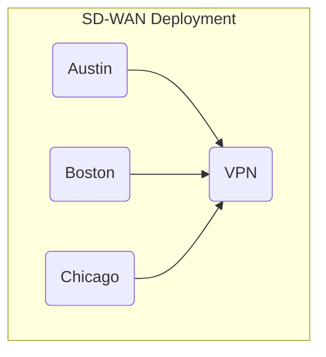
The following code snippet shows a TOSCA service template from which
this service can be deployed:

```yaml
tosca_definitions_version: tosca_2_0

description: Template for deploying SD-WAN with three sites.

service_template:
  inputs:
    location1:
      type: Location
    location2:
      type: Location
    location3:
      type: Location
  node_templates:
    sdwan:
      type: VPN
    site1:
      type: VPNSite
      properties:
        location: { $get_input: location1 }
      requirements:
        - vpn: sdwan
    site2:
      type: VPNSite
      properties:
        location: { $get_input: location2 }
      requirements:
        - vpn: sdwan
    site3:
      type: VPNSite
      properties:
        location: { $get_input: location3 }
      requirements:
        - vpn: sdwan
```

As defined here, this template can only be used to deploy an SD-WAN
with three sites. To deploy a different number of sites, additional
service templates must be created, one for each possible number of
SD-WAN sites. This leads to undesirable template proliferation. The
next section presents an alternative.

### Specifying Number of Node Representations

To avoid the need for multiple service templates, TOSCA allows all VPN
Site nodes to be created from the same Site node template in the
service template. The TOSCA node template definition grammar uses a
`count` keyword that specifies the requested number of runtime
representations for this node template. This `count` keyword is
similar to the `count` keyword in requirement definitions.

The grammar for the `count` keyword is as follows:

| Keyname     | Required | Type    | Constraints                       | Description                                                                                                                           |
|-------------|----------|---------|-----------------------------------|---------------------------------------------------------------------------------------------------------------------------------------|
| count       | no       | integer | when not specified, defaults to 1 | The optional number of nodes in the representation graph that will be created from this node template. If not specified,  one single node is created. |

It is expected that the value of the `count` is provided as an input
to the service template. This enables the creation of a simplified
SD-WAN service template that contains only one single VPN Site node as
shown in the following figure:

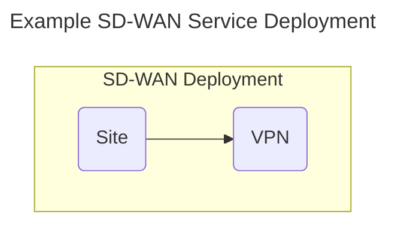

An implementation of such a service template is shown in the following
code snippet:

```yaml
tosca_definitions_version: tosca_2_0

description: Template for deploying SD-WAN with a variable number of sites.

service_template:
  inputs:
    number_of_sites:
      type: integer
  
  node_templates:
    sdwan:
      type: VPN
    site:
      type: VPNSite
      count: { $get_input: number_of_sites }
      requirements:
        - vpn: sdwan
```

### Node-Specific Input Values

The service template in the previous section conveniently ignores the
location property of the Site node. As shown earlier, the location
property is expected to be provided as an input value. If Site node
templates can be instantiated multiple times, then it follows that
multiple input values are required to initialize the location property
for each of the Site node representations.

To allow specific input values to be matched with specific node
template representations, each node is assigned a unique index to
differentiate it from other nodes created from the same node
template. This index is accessed using the `NODE_INDEX` reserved
keyword that references the index of the node in the context of which
the `NODE_INDEX` keyword is used. This keyword can then can be used to
index the list of input values. The grammar for the `NODE_INDEX`
keyword is as follows:

| Keyword     | Valid Contexts | Description                                                                                                                                |
|-------------|----------------|--------------------------------------------------------------------------------------------------------------------------------------------|
| NODE_INDEX | Node Representation | A TOSCA orchestrator will interpret this keyword as the runtime index in the list of node representations created from a single Node Template. |

The `NODE_INDEX` for a node representation is immutable: it never
changes during the lifetime of that node representation, even if node
representations are added or deleted after the service has been
deployed.

The following service template shows how the NODE_INDEX keyword is
used to retrieve specific values from a list of input values in a
service template:

```yaml
tosca_definitions_version: tosca_2_0

description: Template for deploying SD-WAN with a variable number of sites.

service_template:
  inputs:
    number_of_sites:
      type: integer
    location:
      type: list
      entry_schema: Location
  
  node_templates:
    sdwan:
      type: VPN
    site:
      type: VPNSite
      count: { $get_input: number_of_sites }
      properties:
        location: { $get_input: [ location, NODE_INDEX ] }
      requirements:
        - vpn: sdwan
```

> This approach requires that inputs are provided as lists, even if
> only one representation will be created. Should we allow a single value as
> well as a list of values?

> \[Calin\] This is as we see fit, not a problem. If a node is
> supposed to have one “occurrence” in a topology template (which for
> the majority will do), then we use the single value input. If the
> occurrences are more, then we use lists.

### Cardinality of Relationships

We may also need to accommodate scenarios where a node template with
multiple representations defines a requirement to another node
template that also has multiple representations. This section
introduces grammar for specifying the cardinality of such
requirements. Specific mechanisms depend on the type of the
relationships to be established.

#### Many-to-One Relationships

In the SD-WAN service template above, each of the site node
representations has a relationship to a VPN node that can only be
instantiated once.  This is an example of a *many-to-one* relationship
which is shown in the following figure:

This scenario is supported using existing relationship syntax as
shown in the following code snippet:
```yaml
service_template:
  inputs:
    number_of_left:
      type: integer
  node_templates:
    right:
      type: Right
    left:
      type: Left
      count: {$get_input: number_of_left}
      requirements:
        - uses: right
```
This template specifies that all four node representations created
from the `left` node template must use the one node representation
created from the`right` node template as their target node.

#### One-to-Many Relationships

An example of a *one-to-many* relationship is shown in the following
figure:

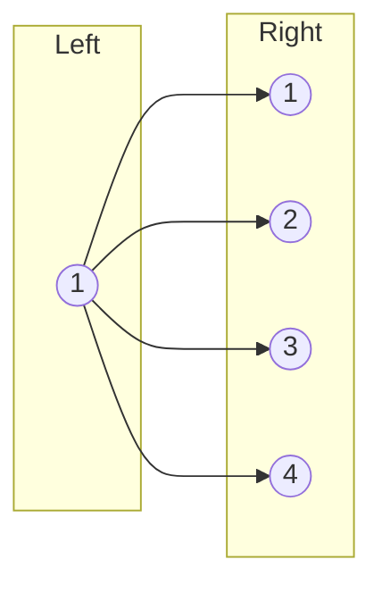

*One-to-many* relationships are less common, but they can just as
easily be accommodated using existing TOSCA grammar, as long as the
requirement in the single node specifies the appropriate `count`
value. This is shown in the following code snippet:
```yaml
service_template:
  inputs:
    number_of_right:
      type: integer
  node_templates:
    right:
      type: Right
      count: {$get_input: number_of_right}
    left:
      type: Left
      requirements:
        - uses:
            node: right
            count: {$get_input: number_of_right}
```
In this example, a total number of `count` relationships will be
created from the single `left` node to the group of `right` nodes. The
orchestrator must select a different `right` node for each
relationship.  If the `count` value is not be specified in the `uses`
requirement, it defaults to 1 and the orchestrator will only establish
one single relationship to one of the `right` nodes. Which one of the
`right` nodes is selected is implementation-specific.

#### Full mesh

In a *full mesh* scenario, all nodes on the left establish
relationships to all of the nodes on the right as shown in the
following figure:

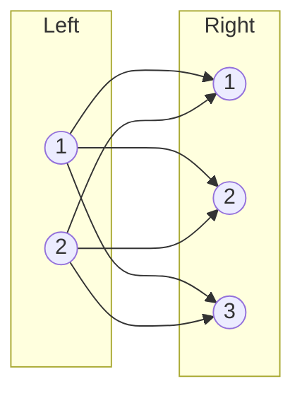
Note that the many-to-one and one to-many pattern are just special
cases of a full-mesh when either the number of nodes on the left or
the number of nodes on the right side is 1.

As before, the full mesh scenario can easily be defined using existing
requirement syntax as shown in the following code snippet:

```yaml
service_template:
  inputs:
    number_of_left:
      type: integer
    number_of_right:
      type: integer
  node_templates:
    right:
      type: Right
      count: {$get_input: number_of_right}
    left:
      type: Left
      count: {$get_input: number_of_left}
      requirements:
        - uses:
            node: right
            count: {$get_input: number_of_right}
```

#### Matched Pairs

For some services, representations created from different node
templates must remain matched up in pairs. For example, let’s extend
the SD-WAN service above with a third node template that represents a
virtual PE router that must be used at each site to establish VPN
connections over an underlay. Let’s assume that Site nodes establish a
HostedOn relationship to the vPE nodes. The extended service topology
is shown in the following figure:
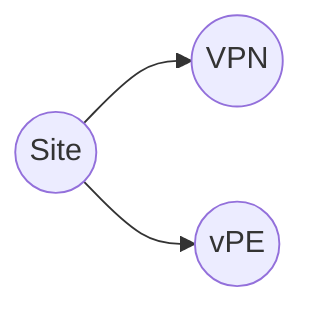
In this example, the intent is for each site node to remain paired
with its own vPE node for that site. A generic illustration of the
*matched pairs* scenario is shown in the following figure:


To create matched pairs, the service template designer must first make
sure that the number of nodes on the left matches the number of nodes
on the right by using the same input value for the `count` keynames in
both the `left` and `right` node templates. In addition, each
requirement must correctly match source nodes and target nodes are
matched correctly, which can be accomplished by making sure that a
target node of each relationship has the same `NODE_INDEX` value as
its source node. This following code snippet shows requirement
definition grammar that uses `NODE_INDEX` values to uniquely identify
target nodes:

```yaml
service_template:
  inputs:
    number_of_nodes:
      type: integer
  node_templates:
    right:
      type: Right
      count: {$get_input: number_of_nodes}
    left:
      type: Left
      count: {$get_input: number_of_nodes}
      requirements:
        - uses: [right, NODE_INDEX]
```

#### Random Pairs

Some scenarios require nodes to be organized in pairs, but the
ordering of the nodes is not important. The following figure shows and
such a *random pairs* example:

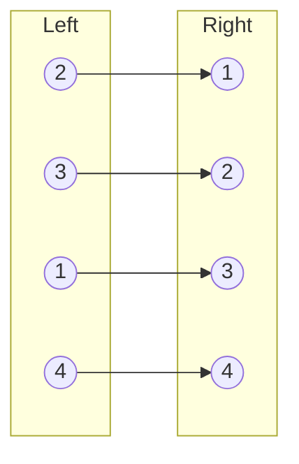

In this scenario, it is not important how target nodes are paired with
source nodes, as long as each target node is only used once. To make
sure each target node is only used once, the `allocations` keyword in
the requirement can be used as shown in the following code snippet:

```yaml
service_template:
  inputs:
    number_of_nodes:
      type: integer
  node_templates:
    right:
      type: Right
      count: {$get_input: number_of_nodes}
      capabilities:
        feature:
          properties:
            target_count: 1
    left:
      type: Left
      count: {$get_input: number_of_nodes}
      requirements:
        - uses:
            node: right
            allocations:
              target_count: 1
```
This scenario works as follows:

- The target capability in each target node defines a property that is
  intended to restrict how many times that capability can be
  targeted. In the example above, the `right` nodes are the target
  nodes. These nodes define a `feature` capability that in turn
  defines a `target_count` property. The value of this property is set
  to 1 to only allow one single incoming relationship.
- The requirement in each source node includes an `allocations`
  section that allocates a single unit from the target capability. In
  the example above, the `left` nodes define a `uses` requirement that
  allocates a single unit from the `target_count` property in the
  target capability.
- When a relationship is established to a target node, that target
  node's `target_count` property is exhausted and no additional
  incoming relationships will be established. This ensures that each
  target node is only allocated once.

#### Many-to-Many Relationships

The mechanisms introduced above can also be used to define more
complex *many-to-many* scenarios. For example, a 1:2 pattern is shown
in the following figure:

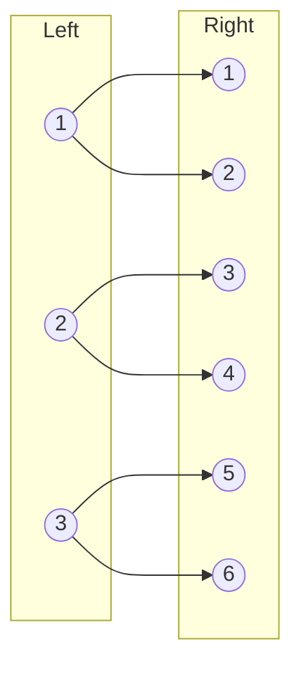
This pattern can be accomplished using the following code snippet:
```yaml
service_template:
  node_templates:
    right:
      type: Right
      count: 6
      capabilities:
        feature:
          properties:
            target_count: 1
    left:
      type: Left
      count: 6
      requirements:
        - uses:
            node: right
            count: 2
            allocations:
              target_count: 1
```
The following figure shows a 3:2 pattern:
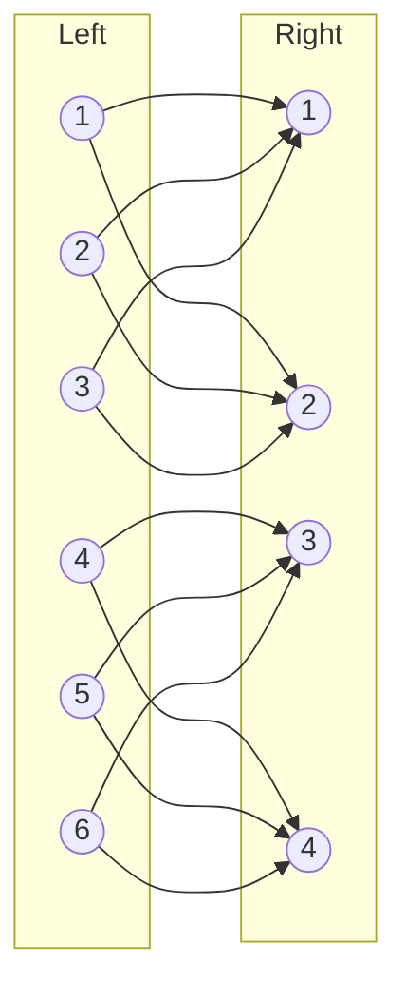
This pattern can be implemented using the following code snippet:
```yaml
service_template:
  node_templates:
    right:
      type: Right
      count: 6
      capabilities:
        feature:
          properties:
            target_count: 3
    left:
      type: Left
      count: 6
      requirements:
        - uses:
            node: right
            count: 2
            allocations:
              target_count: 1
```

Finally, there may be scenarios where the multiplicity of the left
nodes and the multiplicity of the right nodes do not allow clean
pairing scenarios. In that case, more complicated expressions might be
needed to specify target node indices or to restrict capacity.  For
example, if nodes are expected to be paired but there are more nodes
on the left that on the right, some nodes The following code snippet
shows a *mismatched pairs* example where the orchestrator may have to
cycle through the target nodes multiple times:

```yaml
service_template:
  inputs:
    number_of_right:
      type: integer
    number_of_left:
      type: integer
  node_templates:
    right:
      type: Right
      count: {$get_input: number_of_right}
    left:
      type: Left
      count: {$get_input: number_of_left}
      requirements:
        - uses: [right, {$remainder: [NODE_INDEX, {$get_input: number_of_right}]
```

## Interfaces

### Interface Type

An Interface Type is a reusable entity that describes a set of
operations that can be used to interact with or to manage a node or
relationship in a TOSCA topology.

#### Keynames

The Interface Type is a TOSCA type entity and has the common keynames
listed in Section 4.2.5.2 Common keynames in type definitions. In
addition, the Interface Type has the following recognized keynames:

| Keyname       | Mandatory | Type                                                        | Description                                                                                             |
|---------------|-----------|-------------------------------------------------------------|---------------------------------------------------------------------------------------------------------|
| inputs        | no        | map of [parameter definitions](#parameter-definition)       | The optional map of input parameter definitions available to all operations defined for this interface. |
| operations    | no        | map of [operation definitions](#operation-definition)       | The optional map of operations defined for this interface.                                              |
| notifications | no        | map of [notification definitions](#notification-definition) | The optional map of notifications defined for this interface.                                           |

#### Grammar

Interface Types have following grammar:
```
<interface_type_name>:
  derived_from: <parent_interface_type_name>
  version: <version_number>
  metadata: 
    <map of string>
  description: <interface_description>
  inputs: 
    <parameter_definitions>
  operations:
    <operation_definitions>
  notifications:
    <Notification definition>
```
In the above grammar, the pseudo values that appear in angle brackets
have the following meaning:

- interface_type_name: represents the mandatory name of the interface as
  a string.

- parent_interface_type_name: represents the name of the Interface Type
  this Interface Type definition derives from (i.e. its “parent” type).

- version_number: represents the optional TOSCA version number for the
  Interface Type.

- interface_description: represents the optional description for the
  Interface Type.

- parameter_definitions: represents the optional map of parameter
  definitions which the TOSCA orchestrator will make available (i.e., or
  pass) to all implementation artifacts for operations declared on the
  interface during their execution.

- operation_definitions: represents the optional map of one or more
  operation definitions.

- notification_definitions: represents the optional map of one or more
  notification definitions.

#### Derivation rules

During Interface Type derivation the keyname definitions follow these
rules:

- inputs: existing parameter definitions may be refined; new parameter
  definitions may be added.

- operations: existing operation definitions may be refined; new
  operation definitions may be added.

- notifications: existing notification definitions may be refined; new
  notification definitions may be added.

#### Example

The following example shows a custom interface used to define multiple
configure operations.
```
mycompany.mytypes.myinterfaces.MyConfigure:
  derived_from: tosca.interfaces.relationship.Root
  description: My custom configure Interface Type
  inputs:
    mode:
      type: string
  operations:
    pre_configure_service:
      description: pre-configure operation for my service
    post_configure_service:
      description: post-configure operation for my service
```
#### Additional Requirements

- Interface Types **MUST NOT** include any implementations for defined
  operations or notifications; that is, the implementation keyname is
  invalid in this context.

### Interface definition

An Interface definition defines an interface (containing operations and
notifications definitions) that can be associated with (i.e. defined
within) a Node or Relationship Type definition (including Interface
definitions in Requirements definitions). An Interface definition may be
refined in subsequent Node or Relationship Type derivations.

#### Keynames

The following is the list of recognized keynames for a TOSCA interface
definition:

|Keyname|Mandatory|Type|Description|
| ----- | ------- | ----- | ------- |
|type|yes|string|The mandatory name of the Interface Type this interface definition is based upon.|
|description|no|string|The optional description for this interface definition.|
|inputs|no|map of parameter definitions and refinements|The optional map of input parameter refinements and new input parameter definitions available to all operations defined for this interface (the input parameters to be refined have been defined in the Interface Type definition).|
|operations|no|map of operation refinements|The optional map of operations refinements for this interface. The referred operations must have been defined in the Interface Type definition.|
|notifications|no|map of notification refinements|The optional map of notifications refinements for this interface. The referred operations must have been defined in the Interface Type definition.|

#### Grammar

Interface definitions in Node or Relationship Type definitions have the
following grammar:
```
<interface_definition_name>:
  type: <interface_type_name>
  description: <interface_description>
  inputs: 
    <parameter_definitions_and_refinements>
  operations:
    <operation_refinements>
  notifications:
    <notification definition>
```
In the above grammar, the pseudo values that appear in angle brackets
have the following meaning:

- interface_definition_name: represents the mandatory symbolic name of
  the interface as a string.

- interface_type_name: represents the mandatory name of the Interface
  Type for the interface definition.

- interface_description: represents the optional description string for
  the interface.

- parameter_definitions_and_refinements: represents the optional map of
  input parameters which the TOSCA orchestrator will make available
  (i.e. pass) to all defined operations. This means these parameters and
  their values will be accessible to the implementation artifacts (e.g.,
  scripts) associated to each operation during their execution

  - the map represents a mix of parameter refinements (for parameters
    already defined in the Interface Type) and new parameter
    definitions.

  - with the new parameter definitions, we can flexibly add new parameters
    when changing the implementation of operations and notifications
    during refinements or assignments.

- operation_refinements: represents the optional map of operation
  definition refinements for this interface; the referred operations
  must have been previously defined in the Interface Type.

- notification_refinements: represents the optional map of notification
  definition refinements for this interface; the referred notifications
  must have been previously defined in the Interface Type.

#### Refinement rules

An interface definition within a node or relationship type (including
interface definitions in requirements definitions) uses the following
definition refinement rules when the containing entity type is derived:

- type: must be derived from (or the same as) the type in the interface
  definition in the parent entity type definition.

- description: a new definition is unrestricted and will overwrite the
  one inherited from the interface definition in the parent entity type
  definition.

- inputs: not applicable to the definitions in the parent entity type
  but to the definitions in the interface type referred by the type
  keyname (see grammar above for the rules).

- operations: not applicable to the definitions in the parent entity
  type but to the definitions in the interface type referred by the type
  keyname (see grammar above for the rules).

- notifications: not applicable to the definitions in the parent entity
  type but to the definitions in the interface type referred by the type
  keyname (see grammar above for the rules).

### Interface assignment

An Interface assignment is used to specify assignments for the inputs,
operations and notifications defined in the Interface. Interface
assignments may be used within a Node or Relationship Template
definition (including when Interface assignments are referenced as part
of a Requirement assignment in a Node Template).

#### Keynames

The following is the list of recognized keynames for a TOSCA interface
assignment:

| Keyname       | Mandatory | Type                                                              | Description                                                                                                                                                                          |
|---------------|-----------|-------------------------------------------------------------------|--------------------------------------------------------------------------------------------------------------------------------------------------------------------------------------|
| inputs        | no        | map of [parameter value assignments](#parameter-value-assignment) | The optional map of input parameter assignments. Template authors MAY provide parameter assignments for interface inputs that are not defined in their corresponding Interface Type. |
| operations    | no        | map of [operation assignme](#operation-definition)nts             | The optional map of operations assignments specified for this interface.                                                                                                             |
| notifications | no        | map of [notification assignments](#notification-definition)       | The optional map of notifications assignments specified for this interface.                                                                                                          |

#### Grammar

Interface assignments have the following grammar:
```
<interface_definition_name>:
  inputs: 
    <parameter_value_assignments>
  operations:
    <operation_assignments>
  notifications:
    <notification_assignments>
```
In the above grammar, the pseudo values that appear in angle brackets
have the following meaning:

- interface_definition_name: represents the mandatory symbolic name of
  the interface as a string.

- parameter_value_assignments: represents the optional map of parameter
  value assignments for passing input parameter values to all interface
  operations

  - template authors MAY provide new parameter assignments for interface
    inputs that are not defined in the Interface definition.

- operation_assignments: represents the optional map of operation
  assignments for operations defined in the Interface definition.

- notification_assignments: represents the optional map of notification
  assignments for notifications defined in the Interface definition.

### Operation definition

An operation definition defines a function or procedure to which an
operation implementation can be bound.

A new operation definition may be declared only inside interface type
definitions (this is the only place where new operations can be
defined). In interface type, node type, or relationship type definitions
(including operation definitions as part of a requirement definition) we
may further refine operations already defined in an interface type.

An operation definition or refinement inside an interface type
definition may not contain an operation implementation definition and it
may not contain an attribute mapping as part of its output definition
(as both these keynames are node/relationship specific).

#### Keynames

The following is the list of recognized keynames for a TOSCA operation
definition (including definition refinement)

|Keyname|Mandatory|Type|Description|
| ----- | ------- | ----- | ------- |
|description|no|string|The optional description string for the associated operation.|
|implementation|no|operation implementation definition|The optional definition of the operation implementation. May not be used in an interface type definition (i.e. where an operation is initially defined), but only during refinements. |
|inputs|no|map of parameter definitions|The optional map of parameter definitions for operation input values.|
|outputs|no|map of parameter definitions|The optional map of parameter definitions for operation output values. Only as part of node and relationship type definitions, the output definitions may include mappings onto attributes of the node or relationship type that contains the definition.|

#### Grammar

Operation definitions have the following grammar:

##### Short notation

The following single-line grammar may be used when the operation’s
implementation definition is the only keyname that is needed, and when
the operation implementation definition itself can be specified using a
single line grammar:
```
<[operation_name](#TYPE_YAML_STRING)>: <[operation_implementation_definition](# BKM_Implementation_Oper_Notif_Def)>
```
##### Extended notation 

The following multi-line grammar may be used when additional information
about the operation is needed:
```
<operation_name>:
   description: <operation_description>
   implementation: <operation_implementation_definition>
   inputs: 
     <parameter_definitions>
   outputs:
     <parameter_definitions>
```
In the above grammars, the pseudo values that appear in angle brackets
have the following meaning:

- operation_name: represents the mandatory symbolic name of the
  operation as a string.

- operation_description: represents the optional description string for
  the operation.

- operation_implementation_definition: represents the optional
  specification of the operation’s implementation).

- parameter_definitions: represents the optional map of parameter
  definitions which the TOSCA orchestrator will make available as inputs
  to or receive as outputs from the corresponding implementation
  artifact during its execution.

#### Refinement rules

An operation definition within an interface, node, or relationship type
(including interface definitions in requirements definitions) uses the
following refinement rules when the containing entity type is derived:

- description: a new definition is unrestricted and will overwrite the
  one inherited from the operation definition in the parent entity type
  definition.

- implementation: a new definition is unrestricted and will overwrite
  the one inherited from the operation definition in the parent entity
  type definition.

- inputs: parameter definitions inherited from the parent entity type
  may be refined; new parameter definitions may be added.

- outputs: parameter definitions inherited from the parent entity type
  may be refined; new parameter definitions may be added.

#### Additional requirements

- The definition of implementation is not allowed in interface type
  definitions (as a node or node type context is missing at that point).
  Thus, it can be part only of an operation refinement and not of the
  original operation definition.

- The default refinement behavior for implementations SHALL be
  overwrite. That is, implementation definitions in a derived type
  overwrite any defined in its parent type.

- Defining a fixed value for an input parameter (as part of its
  definition) may only use a parameter_value_expression that is
  meaningful in the scope of the context. For example, within the
  context of an Interface Type definition functions such as get_propery
  or get_attribute cannot be used. Within the context of Node or
  Relationship Type definitions, these functions may only reference
  properties and attributes accessible starting from SELF (i.e.
  accessing a node by symbolic name is not meaningful).

- Defining attribute mapping as part of the output parameter definition
  is not allowed in interface type definitions (i.e. as part of
  operation definitions). It is allowed only in node and relationship
  type definitions (as part of operation refinements) and has to be
  meaningful in the scope of the context (e.g. SELF).

- Implementation artifact file names (e.g., script filenames) may
  include file directory path names that are relative to the TOSCA file
  file itself when packaged within a TOSCA Cloud Service Archive (CSAR)
  file.

#### Examples

##### Single-line example
```
interfaces:
  Standard:
    start: scripts/start_server.sh
```
##### Multi-line example with shorthand implementation definitions
```
interfaces:
  Configure:
    pre_configure_source:
      implementation: 
        primary: scripts/pre_configure_source.sh
        dependencies: 
          - scripts/setup.sh
          - binaries/library.rpm
          - scripts/register.py
```
##### Multi-line example with extended implementation definitions
```
interfaces:
  Configure:
    pre_configure_source:
      implementation: 
        primary: 
          file: scripts/pre_configure_source.sh
          type: tosca.artifacts.Implementation.Bash
          repository: my_service_catalog
        dependencies:
           - file : scripts/setup.sh
             type : tosca.artifacts.Implementation.Bash
             repository : my_service_catalog
```
### Operation assignment

An operation assignment may be used to assign values for input
parameters, specify attribute mappings for output parameters, and
define/redefine the implementation definition of an already defined
operation in the interface definition. An operation assignment may be
used inside interface assignments inside node template or relationship
template definitions (this includes when operation assignments are part
of a requirement assignment in a node template).

An operation assignment may add or change the implementation and
description definition of the operation. Assigning a value to an input
parameter that had a fixed value specified during operation definition
or refinement is not allowed. Providing an attribute mapping for an
output parameter that was mapped during an operation refinement is also
not allowed.

Note also that in the operation assignment we can use inputs and outputs
that have not been previously defined in the operation definition. This
is equivalent to an ad-hoc definition of a parameter, where the type is
inferred from the assigned value (for input parameters) or from the
attribute to map to (for output parameters).

#### Keynames

The following is the list of recognized keynames for an operation
assignment:

|Keyname|Mandatory|Type|Description|
| ----- | ------- | ----- | ------- |
|implementation|no|operation implementation definition|The optional definition of the operation implementation. Overrides implementation provided at operation definition.|
|inputs|no|map of parameter value assignments|The optional map of parameter value assignments for assigning values to operation inputs. |
|outputs|no|map of parameter mapping assignments|The optional map of parameter mapping assignments that specify how operation outputs are mapped onto attributes of the node or relationship that contains the operation definition. |

#### Grammar

Operation assignments have the following grammar:

##### Short notation

The following single-line grammar may be used when the operation’s
implementation definition is the only keyname that is needed, and when
the operation implementation definition itself can be specified using a
single line grammar:
```
<[operation_name](#TYPE_YAML_STRING)>: <[operation_implementation_definition](#operation-and-notification-implementation-definition)> 
```
##### Extended notation

The following multi-line grammar may be used in Node or Relationship
Template definitions when additional information about the operation is
needed:
```
<operation_name>:
   implementation: <operation_implementation_definition>
   inputs: 
     <parameter_value_assignments>
   outputs:
     <parameter_mapping_assignments>
```
In the above grammar, the pseudo values that appear in angle brackets
have the following meaning:

- operation_name: represents the mandatory symbolic name of the
  operation as a [string](#TYPE_YAML_STRING).

- operation_implementation_definition: represents the optional
  specification of the operation’s implementation

  - the implementation declared here overrides the implementation provided
    at operation definition.

- parameter_value_assignments: represents the optional map of parameter
  value assignments for passing input parameter values to operations.

  - assignments for operation inputs that are not defined in the operation
    definition may be provided

- parameter_mapping_assignments: represents the optional map of
  parameter mapping assignments that consists of named output values
  returned by operation implementations (i.e. artifacts) and associated
  attributes into which this output value must be stored

  - assignments for operation outputs that are not defined in the
    operation definition may be provided.

#### Additional requirements

- The behavior for implementation of operations SHALL be override. That
  is, implementation definitions assigned in an operation assignment
  override any defined in the operation definition.

- Template authors MAY provide parameter assignments for operation
  inputs that are not defined in the operation definition.

- Template authors MAY provide attribute mappings for operation outputs
  that are not defined in the operation definition.

- Implementation artifact file names (e.g., script filenames) may
  include file directory path names that are relative to the TOSCA file
  file itself when packaged within a TOSCA Cloud Service Archive (CSAR)
  file.

#### Examples

TBD

### Notification definition

A notification definition defines an asynchronous notification or
incoming message that can be associated with an interface. The
notification is a way for an external event to be transmitted to the
TOSCA orchestrator. Values can be sent with a notification as
notification outputs and we can map them to node/relationship attributes
similarly to the way operation outputs are mapped to attributes. The
artifact that the orchestrator is registering with in order to receive
the notification is specified using the implementation keyname in a
similar way to operations. As opposed to an operation definition, a
notification definition does not include an inputs keyname since
notifications are not invoked from the orchestrator.

When the notification is received an event is generated within the
orchestrator that can be associated to triggers in policies to call
other internal operations and workflows. The notification name (using
the \<interface_name\>.\<notification_name\> notation) itself identifies
the event type that is generated and can be textually used when defining
the associated triggers.

A notification definition may be used only inside interface type
definitions (this is the only place where new notifications can be
defined). Inside interface type, node type, or relationship type
definitions (including notifications definitions as part of a
requirement definition) we may further refine a notification already
defined in the interface type.

A notification definition or refinement inside an interface type
definition may not contain a notification implementation definition and
it may not contain an attribute mapping as part of its output definition
(as both these keynames are node/relationship specific).

#### Keynames

The following is the list of recognized keynames for a TOSCA
notification definition:

|Keyname|Mandatory|Type|Description|
| ----- | ------- | ----- | ------- |
|description|no|string|The optional description string for the associated notification.|
|implementation|no|notification implementation definition|The optional definition of the notification implementation.|
|outputs|no|map of parameter definitions|The optional map of parameter definitions that specify notification output values.  Only as part of node and relationship type definitions, the output definitions may include their mappings onto attributes of the node type or relationship type that contains the definition. |

#### Grammar

Notification definitions have the following grammar:

##### Short notation

The following single-line grammar may be used when the notification’s
implementation definition is the only keyname that is needed and when
the notification implementation definition itself can be specified using
a single line grammar:
```
<[notification_name](#TYPE_YAML_STRING)>: <[notification_implementation_definition](#operation-and-notification-implementation-definition)> 
```
##### Extended notation 

The following multi-line grammar may be used when additional information
about the notification is needed:
```
<notification_name>:
  description: <notification_description>
  implementation: <notification_implementation_definition>
  outputs: 
    <parameter_definitions>
```
In the above grammar, the pseudo values that appear in angle brackets
have the following meaning:

- notification_name: represents the mandatory symbolic name of the
  notification as a string.

- notification_description: represents the optional description string
  for the notification.

- notification_implementation_definition: represents the optional
  specification of the notification implementation (i.e. the external
  artifact that may send notifications)

- parameter_definitions: represents the optional map of parameter
  definitions for parameters that the orchestrator will receive as
  outputs from the corresponding implementation artifact during its
  execution.

#### Refinement rules

A notification definition within an interface, node, or relationship
type (including interface definitions in requirements definitions) uses
the following refinement rules when the containing entity type is
derived:

- description: a new definition is unrestricted and will overwrite the
  one inherited from the notification definition in the parent entity
  type definition.

- implementation: a new definition is unrestricted and will overwrite
  the one inherited from the notification definition in the parent
  entity type definition.

- outputs: parameter definitions inherited from the parent entity type
  may be refined; new parameter definitions may be added.

#### Additional requirements

- The definition of implementation is not allowed in interface type
  definitions (as a node or node type context is missing at that point).
  Thus, it can be part only of a notification refinement and not of the
  original notification definition.

- The default sub-classing (i.e. refinement) behavior for
  implementations of notifications SHALL be overwrite. That is,
  implementation artifacts definitions in a derived type overwrite any
  defined in its parent type.

- Defining attribute mapping as part of the output parameter definition
  is not allowed in interface type definitions (i.e. as part of
  operation definitions). It is allowed only in node and relationship
  type definitions (as part of operation refinements).

- Defining a mapping in an output parameter definition may use an
  attribute target that is meaningful in the scope of the context.
  Within the context of Node or Relationship Type definitions these
  functions may only reference attributes starting from the same node
  (i.e. SELF).

- Implementation artifact file names (e.g., script filenames) may
  include file directory path names that are relative to the TOSCA file
  file itself when packaged within a TOSCA Cloud Service Archive (CSAR)
  file.

#### Examples

TBD

### Notification assignment

A notification assignment may be used to specify attribute mappings for
output parameters and to define/redefine the implementation definition
and description definition of an already defined notification in the
interface definition. A notification assignment may be used inside
interface assignments inside node or relationship template definitions
(this includes when notification assignments are part of a requirement
assignment in a node template).

Providing an attribute mapping for an output parameter that was mapped
during a previous refinement is not allowed. Note also that in the
notification assignment we can use outputs that have not been previously
defined in the operation definition. This is equivalent to an ad-hoc
definition of an output parameter, where the type is inferred from the
attribute to map to.

#### Keynames

The following is the list of recognized keynames for a TOSCA
notification assignment:

|Keyname|Mandatory|Type|Description|
| ----- | ------- | ----- | ------- |
|implementation|no|notification implementation definition|The optional definition of the notification implementation. Overrides implementation provided at notification definition.|
|outputs|no|map of parameter mapping assignments|The optional map of parameter mapping assignments that specify how notification outputs values are mapped onto attributes of the node or relationship type that contains the notification definition.|

#### Grammar

Notification assignments have the following grammar:

##### Short notation

The following single-line grammar may be used when the notification’s
implementation definition is the only keyname that is needed, and when
the notification implementation definition itself can be specified using
a single line grammar:
```
<[notification_name](#TYPE_YAML_STRING)>: <[notification_implementation_definition](#operation-and-notification-implementation-definition)> 
```
##### Extended notation

The following multi-line grammar may be used in Node or Relationship
Template definitions when additional information about the notification
is needed:
```
<notification_name>:
  implementation: <notification_implementation_definition>
  outputs: 
    <parameter_mapping_assignments>
```
In the above grammar, the pseudo values that appear in angle brackets
have the following meaning:

- notification_name: represents the mandatory symbolic name of the
  notification as a string.

- notification_implementation_definition: represents the optional
  specification of the notification implementation (i.e. the external
  artifact that is may send notifications)

  - the implementation declared here overrides the implementation provided
    at notification definition.

- parameter_mapping_assignments: represents the optional map of
  parameter_mapping_assignments that consists of named output values
  returned by operation implementations (i.e. artifacts) and associated
  attributes into which this output value must be stored

  - assignments for notification outputs that are not defined in the
    operation definition may be provided.

#### Additional requirements

- The behavior for implementation of notifications SHALL be override.
  That is, implementation definitions assigned in a notification
  assignment override any defined in the notification definition.

- Template authors MAY provide attribute mappings for notification
  outputs that are not defined in the corresponding notification
  definition.

- Implementation artifact file names (e.g., script filenames) may
  include file directory path names that are relative to the TOSCA file
  file itself when packaged within a TOSCA Cloud Service Archive (CSAR)
  file.

#### Examples

TBD

### Operation and notification implementation definition

An operation implementation definition specifies one or more artifacts
(e.g. scripts) to be used as the implementation for an operation in an
interface.

A notification implementation definition specifies one or more artifacts
to be used by the orchestrator to subscribe and receive a particular
notification (i.e. the artifact implements the notification).

The operation implementation definition and the notification
implementation definition share the same keynames and grammar, with the
exception of the timeout keyname that has no meaning in the context of a
notification implementation definition and should not be used in such.

#### Keynames

The following is the list of recognized keynames for an operation
implementation definition or a notification implementation definition:

|Keyname|Mandatory|Type|Description|
| ----- | ------- | ----- | ------- |
|primary|no|artifact definition|The optional implementation artifact (i.e., the primary script file within a TOSCA CSAR file).  |
|dependencies|no|list of  artifact definition|The optional list of one or more dependent or secondary implementation artifacts which are referenced by the primary implementation artifact (e.g., a library the script installs or a secondary script).  |
|timeout|no|integer|Timeout value in seconds. Has no meaning and should not be used within a notification implementation definition.|

#### Grammar

Operation implementation definitions and notification implementation
definitions have the following grammar:

##### Short notation for use with single artifact

The following single-line grammar may be used when only a primary
implementation artifact name is needed:
```
[implementation](#TYPE_YAML_STRING): <[primary_artifact_name](#TYPE_YAML_STRING)> 
```
This notation can be used when the primary artifact name uniquely
identifies the artifact, either because it refers to an artifact
specified in the artifacts section of a type or template, or because it
represents the name of a script in the CSAR file that contains the
definition.

##### Short notation for use with multiple artifacts

The following multi-line short-hand grammar may be used when multiple
artifacts are needed, but each of the artifacts can be uniquely
identified by name as before:
```
  primary: <primary_artifact_name>
  dependencies:
    - <list_of_dependent_artifact_names>
  timeout: 60
```
##### Extended notation for use with single artifact

The following multi-line grammar may be used in Node or Relationship
Type or Template definitions when only a single artifact is used but
additional information about the primary artifact is needed (e.g. to
specify the repository from which to obtain the artifact, or to specify
the artifact type when it cannot be derived from the artifact file
extension):
```
implementation: 
  primary:
    <primary_artifact_definition>
  timeout: 100
```
##### Extended notation for use with multiple artifacts

The following multi-line grammar may be used in Node or Relationship
Type or Template definitions when there are multiple artifacts that may
be needed for the operation to be implemented and additional information
about each of the artifacts is required:
```
implementation: 
  primary: 
    <primary_artifact_definition>   
  dependencies: 
    - <list_of_dependent_artifact definitions>
  timeout: 120
```
In the above grammars, the pseudo values that appear in angle brackets
have the following meaning:

- primary_artifact_name: represents the optional name
  ([string](#TYPE_YAML_STRING)) of an implementation artifact definition
  (defined elsewhere), or the direct name of an implementation
  artifact’s relative filename (e.g., a service template-relative,
  path-inclusive filename or absolute file location using a URL).

- primary_artifact_definition: represents a full inline definition of an
  implementation artifact.

- list_of_dependent_artifact_names: represents the optional ordered list
  of one or more dependent or secondary implementation artifact names
  (as strings) which are referenced by the primary implementation
  artifact. TOSCA orchestrators will copy these files to the same
  location as the primary artifact on the target node so as to make them
  accessible to the primary implementation artifact when it is executed.

- list_of_dependent_artifact_definitions: represents the ordered list of
  one or more inline definitions of dependent or secondary
  implementation artifacts. TOSCA orchestrators will copy these
  artifacts to the same location as the primary artifact on the target
  node so as to make them accessible to the primary implementation
  artifact when it is executed.

## Artifacts

### Artifact Type

An Artifact Type is a reusable entity that defines the type of one or
more files that are used to define implementation or deployment
artifacts that are referenced by nodes or relationships.

#### Keynames

The Artifact Type is a TOSCA type entity and has the common keynames
listed in Section 4.2.5.2 Common keynames in type definitions. In
addition, the Artifact Type has the following recognized keynames:

|Keyname|Mandatory|Type|Description|
| ----- | ------- | ----- | ------- |
|mime_type|no|string|The optional mime type property for the Artifact Type.|
|file_ext|no|list of string|The optional file extension property for the Artifact Type.|
|properties|no|map of property definitions|An optional map of property definitions for the Artifact Type.|

#### Grammar

Artifact Types have following grammar:
```
<artifact_type_name>:
  derived_from: <parent_artifact_type_name>
  version: <version_number>
  metadata: 
    <map of string>
  description: <artifact_description>
  mime_type: <mime_type_string>
  file_ext: [ <file_extensions> ]
  properties:     
    <property_definitions>
```
In the above grammar, the pseudo values that appear in angle brackets
have the following meaning:

- artifact_type_name: represents the name of the Artifact Type being
  declared as a string.

- parent_artifact_type_name: represents the name of the Artifact Type
  this Artifact Type definition derives from (i.e., its “parent” type).

- version_number: represents the optional TOSCA version number for the
  Artifact Type.

- artifact_description: represents the optional description string for
  the Artifact Type.

- mime_type_string: represents the optional Multipurpose Internet Mail
  Extensions (MIME) standard string value that describes the file
  contents for this type of Artifact Type as a string.

- file_extensions: represents the optional list of one or more
  recognized file extensions for this type of artifact type as strings.

- property_definitions: represents the optional map of property
  definitions for the artifact type.

#### Derivation rules

During Artifact Type derivation the keyname definitions follow these
rules:

- mime_type: a new definition is unrestricted and will overwrite the one
  inherited from the parent type.

- file_ext: a new definition is unrestricted and will overwrite the one
  inherited from the parent type.

- properties: existing property definitions may be refined; new property
  definitions may be added.

#### Examples
```
my_artifact_type:
  description: Java Archive artifact type
  derived_from: tosca.artifact.Root
  mime_type: application/java-archive
  file_ext: [ jar ]
  properties:
    id: 
      description: Identifier of the jar
      type: string
      required: true
    creator:
      description: Vendor of the java implementation on which the jar is based
      type: string
      required: false
```
#### Additional Requirements

- The ‘mime_type’ keyname is meant to have values that are Apache mime
  types such as those defined here:
  <http://svn.apache.org/repos/asf/httpd/httpd/trunk/docs/conf/mime.types>

#### Notes

Information about artifacts can be broadly classified in two categories
that serve different purposes:

- Selection of artifact processor. This category includes informational
  elements such as artifact version, checksum, checksum algorithm etc.
  and s used by TOSCA Orchestrator to select the correct artifact
  processor for the artifact. These informational elements are captured
  in TOSCA as keywords for the artifact.

- Properties processed by artifact processor. Some properties are not
  processed by the Orchestrator but passed on to the artifact processor
  to assist with proper processing of the artifact. These informational
  elements are described through artifact properties.

### Artifact definition

An artifact definition defines a named, typed file that can be
associated with Node Type or Node Template and used by orchestration
engine to facilitate deployment and implementation of interface
operations.

#### Keynames

The following is the list of recognized keynames for a TOSCA artifact
definition when using the extended notation:

|Keyname|Mandatory|Type|Description|
| ----- | ------- | ----- | ------- |
|type|yes|string|The mandatory artifact type for the artifact definition.|
|file|yes|string|The mandatory URI string (relative or absolute) which can be used to locate the artifact’s file.|
|repository|no|string|The optional name of the repository definition which contains the location of the external repository that contains the artifact.  The artifact is expected to be referenceable by its file URI within the repository.|
|description|no|string|The optional description for the artifact definition.|
|deploy_path|no|string|The file path the associated file will be deployed on within the target node’s container. |
|artifact_version|no|string|The version of this artifact. One use of this artifact_version is to declare the particular version of this artifact type, in addition to its mime_type (that is declared in the artifact type definition). Together with the mime_type it may be used to select a particular artifact processor for this artifact. For example, a python interpreter that can interpret python version 2.7.0.|
|checksum|no|string|The checksum used to validate the integrity of the artifact.|
|checksum_algorithm|no|string|Algorithm used to calculate the artifact checksum (e.g. MD5, SHA [Ref]). Shall be specified if checksum is specified for an artifact.|
|properties|no|map of property assignments|The optional map of property assignments associated with the artifact.|

#### Grammar

Artifact definitions have one of the following grammars:

##### Short notation

The following single-line grammar may be used when the artifact’s type
and mime type can be inferred from the file URI:
```
<[artifact_name](#TYPE_YAML_STRING)>: <[artifact_file_URI](#TYPE_YAML_STRING)> 
```
##### Extended notation:

The following multi-line grammar may be used when the artifact’s
definition’s type and mime type need to be explicitly declared:
```
<artifact_name>: 
  description: <artifact_description>
  type: <artifact_type_name>
  file: <artifact_file_URI>
  repository: <artifact_repository_name>
  deploy_path: <file_deployment_path>
  version: <artifact _version>
  checksum: <artifact_checksum>
  checksum_algorithm: <artifact_checksum_algorithm>
  properties: <property assignments>
```
In the above grammars, the pseudo values that appear in angle brackets
have the following meaning:

- artifact_name: represents the mandatory symbolic name of the artifact
  as a string.

- artifact_description: represents the optional description for the
  artifact.

- artifact_type_name: represents the mandatory artifact type the
  artifact definition is based upon.

- artifact_file_URI: represents the mandatory URI string (relative or
  absolute) which can be used to locate the artifact’s file.

- artifact_repository_name: represents the optional name of the
  repository definition to use to retrieve the associated artifact
  (file) from.

- file_deployement_path: represents the optional path the
  artifact_file_URI will be copied into within the target node’s
  container.

- artifact_version: represents the version of artifact

- artifact_checksum: represents the checksum of the Artifact

- artifact_checksum_algorithm:represents the algorithm for verifying the
  checksum. Shall be specified if checksum is specified

- properties: represents an optional map of property assignments
  associated with the artifact

#### Refinement rules

Artifact definitions represent specific external entities. If a certain
artifact definition cannot be reused as is, then it may be completely
redefined.

- If an artifact is redefined, the symbolic name from the definition in
  the parent node type is reused, but no keyname definitions are
  inherited from the definition in the parent node type, and the new
  definition completely overwrites the definition in the parent.

- If the artifact is not redefined the complete definition is inherited
  from the parent node type.

#### Examples

The following represents an artifact definition:
```
my_file_artifact: ../my_apps_files/operation_artifact.txt 
```
The following example represents an artifact definition with property
assignments:
```
artifacts:
  sw_image:
    description: Image for virtual machine
    type: tosca.artifacts.Deployment.Image.VM
    file: http://10.10.86.141/images/Juniper_vSRX_15.1x49_D80_preconfigured.qcow2
    checksum: ba411cafee2f0f702572369da0b765e2
    version: 3.2
    checksum_algorithm: MD5
    properties:
      name: vSRX
      container_format: BARE
      disk_format: QCOW2
      min_disk: 1 GB
      size: 649 MB
```
# Properties, Attributes, and Parameters

This section presents handling data in TOSCA via properties, attributes,
and parameters.

The type of the values they contain can be divided into built-in
primitive types, special types that are extensions of the primitive
types, and collection types, as well as user-defined refinements of
these and complex data types that can themselves be defined in TOSCA
profiles and the TOSCA file.

Values can also be evaluated from expressions based on TOSCA functions.
\[See XXX\]

The following table summarizes the built-in types. All of these type
names are reserved and cannot be used for custom data types. Note,
however, that it is possible to derive a custom data type from a
primitive type in order to add validation clauses.

Primitive Types: (section 4.4.1)

- string
- integer
- float
- boolean
- bytes
- nil

Special Types: (section 4.4.2)

- timestamp
- scalar-unit.size
- scalar-unit.time
- scalar-unit.frequency
- scalar-unit.bitrate

Collection Types: (section 4.4.3)

- list
- map

> Notes that were originally in the metadata section:

> Important notes:

> YAML map keys can be any value, not just strings. TOSCA metadata grammar
> allows that full YAML expressiveness and does not add additional
> restrictions beyond requiring correct YAM syntax.

> YAML does not specify the bit width of integers and floats but suggests
> that 32 bits should be acceptable.
> 
> Users should be careful about the difference between parsing floats and
> integers. If they explicitly want a float, they should add ".0".

> Users should be careful with version strings being parsed as floats.
> E.g., "3.2" is a float but "3.2.1" is a string,

## Primitive Types

The TOSCA primitive types have been specified to allow for the broadest
possible support for implementations.

Guiding principles:

1.  Because TOSCA files are written in YAML they must support all the
    literal primitives in YAML. However, it is important to also allow
    for consistency of representation of external data, e.g. service
    template inputs and outputs, property and attribute values stored in
    a database, etc.

2.  Adherence to 64-bit precision to ensure portability of numeric data.

3.  TOSCA parsers *shall not* automatically convert between primitive
    types. Thus, care should be taken to use the correct YAML notation
    for that type. Details will be provided below.

### string

An array of Unicode runes. (For storing an arbitrary array of bytes see
the “bytes” type, below.)

Because we adhere to 64-bit precision, the minimum length of strings is
0 and the maximum length of strings is 4,294,967,295.

TOSCA *does not* specify a character encoding. For example, a string
could be encoded as UTF-8 or UTF-16. The exact encoding used depends on
the implementation.

Be aware that YAML parsers will attempt to parse unquoted character
sequences as other types (booleans, integers, floats, etc.) *before*
falling back to the !!string type. For example, the unquoted sequence
“0.1” would be interpreted as a YAML !!float. Likewise, the unquoted
sequence “nan” would become the !!float value of not-a-number. However,
in TOSCA a string value *must* be specified in YAML as a !!string.

A TOSCA parser *shall not* attempt to convert other primitive types to
strings if a string type is required. This requirement is necessary for
ensuring portability, because there is no single, standard
representation for the other types, e.g. scientific notations for
decimals, the words “true” vs. “True” for booleans, etc. In YAML users
should thus add quotation marks around literal strings that YAML would
otherwise interpret as other types.

This following example would be invalid if there were no quotation marks
around “0.1”:
```
node_types:
  Node:
  properties:
    name:
    type: string

service_template:
  node_templates:
    node:
      type: Node
      properties:
        name: "0.1"
```
#### Notes
<!----
{"id": "807", "author": "Chris Lauwers", "date": "2020-08-18T23:01:00Z", "comment": "(From Tal): Do we want the comparison constraints to work for strings? E.g. should \"greater_than\" do a sorting-based comparison? I'll just point that it is non-trivial to sort Unicode strings. The most common way is to use the Unicode Collation Algorithm, which involves a database of information. There is a reference implementation in [ICU](webSettings.xml). Good and proper Unicode libraries will support it (e.g. [here is Go's](footnotes.xml)), but I do imagine it may be a burden for some implementations. I suggest we discuss this in the ad hoc and consider the pros and cons.", "target": "Notes"}-->

1.  There are various ways to specify literal !!string data in YAML for
    handling indentation, newlines, as well as convenient support for
    line folding for multiline strings. All may be used in TOSCA. A
    TOSCA parser shall not modify the YAML string in any way, e.g. no
    trimming of whitespace or newlines. [\[YAML 1.2 chapter
    6\]](https://yaml.org/spec/1.2/spec.html#Basic)

2.  The TOSCA functions “concat”, “join”, “token”, “length”,
    “min_length”, “max_length”, and “pattern” are all Unicode-aware.
    Specifically, the length of a string is a count of its runes, not
    the length of the byte array, which may differ according to the
    encoding. \[See XXX\]

3.  The TOSCA functions that check for equality, “equal” and
    “valid_values”, should work regardless of the Unicode encoding. For
    example, comparing two strings that are “!”, one of which is in
    UTF-8 and is encoded as “0x21”, the other which is in UTF-16 and is
    encoded as “0x0021”, would result in equality.  For simplicity,
    implementations may standardize on a single encoding, e.g., UTF-8,
    and convert all other encodings to it. \[See XXX\]

4.  Relatedly, although in YAML 1.2 a !!string is already defined as a
    Unicode sequence [\[YAML 1.2 section
    10.1.1.3\]](https://yaml.org/spec/1.2/spec.html#id2802842), this
    sequence can be variously encoded according to the character set and
    encoding of the YAML stream [\[YAML 1.2 chapter
    5\]](https://yaml.org/spec/1.2/spec.html#Characters). The
    consequence is that a TOSCA string specified in literal YAML may
    inherit the encoding of the YAML document. Again, implementations
    may prefer to convert all strings to a single encoding.

5.  TOSCA strings *cannot* be the null value but *can* be empty strings
    (a string with length zero). \[See “nil”, below\]

6.  YAML is a streaming format, but TOSCA strings are explicitly *not*
    streams and thus do have a size limit. Thus, TOSCA implementations
    should check against the size limit.

> Tal’s comment: for functions we should specify their exact behavior
> for various primitive types. Some won’t work on all types, e.g. “length”
> should not work on integers.

### integer

A 64-bit signed integer.

For simplicity, TOSCA does not have integers of other bit widths, nor
does it have an unsigned integer type. However, it is possible to
enforce most of these variations using data type validation clauses
\[see XXX\].

For example, this would be a custom data type for unsigned 16-bit
integers:
```
data_types:
  UInt16:
    derived_from: integer
    validation: { $in_range: [ $value, [ 0, 0xFFFF ] ] }
```
#### Notes

YAML allows for the standard decimal notation as well as hexadecimal and
octal notations \[[YAML 1.2 example
2.19](https://yaml.org/spec/1.2/spec.html#id2761509)\]. In the above
example we indeed used the hexadecimal notation.

1.  The JSON schema for YAML 1.2 [\[YAML 1.2 chapter
    10.2\]](https://yaml.org/spec/1.2/spec.html#id2803231) allows for
    compatibility with JSON, such that YAML would be a superset of JSON.
    However, note that the JSON format does not distinguish between
    integers and floats, and thus many JSON implementations use floats
    instead of integers.

2.  TOSCA does not specify the endianness of integers and indeed makes
    no requirements for data representation.

### float

A 64-bit (double-precision) floating-point number \[IEEE 754\],
including the standard values for negative infinity, positive infinity,
and not-a-number.

Be aware that YAML parsers will parse numbers with a decimal point as
!!float even if they *could* be represented as !!int, and likewise
numbers without a decimal point would *always* be parsed as !!int.

A TOSCA parser *shall not* attempt to convert a YAML !!int to a float.
This requirement is necessary for avoiding rounding errors and ensuring
portability. Users should thus add a “.0” suffix to literal integers
that must be floats. Note that this even includes zero, i.e. users must
specify “0” for a zero integer and “0.0” for a zero float.

This following example would be invalid if there were no “.0” suffix
added to “10”:
```
node_types:
  Node:
    properties:
      velocity:
        type: float

service_template:
  node_templates:
    node:
      type: Node
      properties:
        velocity: 10.0
```
#### Notes

1.  In addition to decimal, YAML also allows for specifying floats using
    scientific notation as well as special unquoted words for negative
    infinity, positive infinity, and not-a-number [\[YAML 1.2 example
    2.20\]](https://yaml.org/spec/1.2/spec.html#id2761530).

2.  TOSCA does not specify how to convert to other precisions nor to
    other formats, e.g. Bfloat16 and TensorFloat-32.

3.  TOSCA does not specify the endianness of floats and indeed makes no
    requirements for data representation.

### boolean

A single bit.

Note that in YAML literal booleans can be *only* either the unquoted
all-lowercase words “true” or “false”.

A TOSCA parser *shall not* attempt to convert these values, nor
variations such as “yes” or “True”, as quoted strings to booleans, nor
shall it attempt to convert integer values (such as 1 and 0) to
booleans. This requirement is necessary for ensuring portability as well
as clarity.

### bytes

An array of arbitrary bytes. Because we adhere to 64-bit precision, the
minimum length of bytes is 0 and the maximum length of bytes is
4,294,967,295.

To specify literal bytes in YAML you *must* use a Base64-encoded
!!string \[RFC 2045 section 6.8\]. There exist many free tools to help
you convert arbitrary data to Base64.

Example:
```
ode_types:
  Node:
    properties:
      preamble:
        type: bytes

service_template:
  node_templates:
    node:
      type: Node
        properties:
          preamble: "\
R0lGODlhDAAMAIQAAP//9/X17unp5WZmZgAAAOfn515eXvPz7Y6OjuDg4J+fn5\
OTk6enp56enmlpaWNjY6Ojo4SEhP/++f/++f/++f/++f/++f/++f/++f/++f/+\
+f/++f/++f/++f/++f/++SH+Dk1hZGUgd2l0aCBHSU1QACwAAAAADAAMAAAFLC\
AgjoEwnuNAFOhpEMTRiggcz4BNJHrv/zCFcLiwMWYNG84BwwEeECcgggoBADs="
```
#### Notes

1.  There is no standard way to represent literal bytes in YAML 1.2.
    Though some YAML implementations may support the [!!binary type
    working draft](https://yaml.org/type/binary.html), to ensure
    portability TOSCA implementations *shall not* accept this YAML type.

2.  The TOSCA functions “length”, “min_length”, and “max_length” work
    differently for the bytes type vs. the string type. For the latter
    the length is the count of Unicode runes, not the count of bytes.

3.  TOSCA bytes values *cannot* be the null value but *can* be empty
    arrays (a bytes value with length zero). \[See “nil”, below\]

### nil

The nil type always has the same singleton value. No other type can have
this value.

This value is provided literally in YAML via the unquoted all-lowercase
word “null”.

Example:
```
node_types:
  Node:
    properties:
      nothing:
        type: nil
        required: true

service_template:
  node_templates:
    node:
      type: Node
      properties:
        nothing: null
```
Note that a nil-typed value is *distinct* from an unassigned value. For
consistency TOSCA *requires* you to assign nil values even though their
value is obvious. Thus, the above example would be invalid if we did not
specify the null value for the property at the node template.

Following is a valid example of *not* assigning a value:
```
node_types:
  Node:
    properties:
      nothing:
        type: nil
        required: false

service_template:
  node_templates:
    node:
      type: Node
```
## Special Types
<!----
{"id": "817", "author": "Chris Lauwers", "date": "2020-08-04T16:22:00Z", "comment": "Need to add timestamp type", "target": "Special"}-->

### TOSCA version
<!----
{"id": "821", "author": "Chris Lauwers", "date": "2020-08-18T23:03:00Z", "comment": "Tal suggests removing this.", "target": "version"}-->
A TOSCA version string.

TOSCA supports the concept of “reuse” of type definitions, as well as
template definitions which could be versioned and change over time. It
is important to provide a reliable, normative means to represent a
version string which enables the comparison and management of types and
templates over time.

#### Grammar

TOSCA version strings have the following grammar:
```
<major_version>.<minor_version>[.<fix_version>[.<qualifier>[-<build_version>] ] ] 
```
In the above grammar, the pseudo values that appear in angle brackets
have the following meaning:

- major_version: is a mandatory integer value greater than or equal to 0
  (zero)

- minor_version: is a mandatory integer value greater than or equal to 0
  (zero).

- fix_version: is an optional integer value greater than or equal to 0
  (zero).

- qualifier: is an optional string that indicates a named, pre-release
  version of the associated code that has been derived from the version
  of the code identified by the combination major_version, minor_version
  and fix_version numbers.

- build_version: is an optional integer value greater than or equal to 0
  (zero) that can be used to further qualify different build versions of
  the code that has the same qualifer_string.

#### Version Comparison

- When specifying a version string that contains just a major and a
  minor version number, the version string must be enclosed in quotes to
  prevent the YAML parser from treating the version as a floating point
  value.

- When comparing TOSCA versions, all component versions (i.e., *major*,
  *minor* and *fix*) are compared in sequence from left to right.

- TOSCA versions that include the optional qualifier are considered
  older than those without a qualifier.

- TOSCA versions with the same major, minor, and fix versions and have
  the same qualifier string, but with different build versions can be
  compared based upon the build version.

- Qualifier strings are considered domain-specific. Therefore, this
  specification makes no recommendation on how to compare TOSCA versions
  with the same major, minor and fix versions, but with different
  qualifiers strings and simply considers them different branches
  derived from the same code.

#### Examples

Examples of valid TOSCA version strings:
```
# basic version strings
‘6.1’
2.0.1

# version string with optional qualifier
3.1.0.beta

# version string with optional qualifier and build version
1.0.0.alpha-10
```
#### Notes

- \[[Maven-Version](#CIT_MAVEN_VERSION)\] The TOSCA version type is
  compatible with the Apache Maven versioning policy.

#### Additional Requirements

- A version value of zero (i.e., ‘0.0’, or ‘0.0.0’) SHALL indicate there
  no version provided.

- A version value of zero used with any qualifiers SHALL NOT be valid.

### TOSCA timestamp type

A local instant in time containing two elements: the local notation plus
the time zone offset.

TOSCA timestamps are represented as strings following \[[RFC
3339](https://tools.ietf.org/html/rfc3339)\], which in turn uses a
simplified profile of \[[ISO
8601](https://www.iso.org/iso-8601-date-and-time-format.html)\]. TOSCA
adds an exception to RFC 3339: though RFC 3339 supports timestamps with
[unknown local
offsets](https://tools.ietf.org/html/rfc3339#section-4.3), represented
as the "-0" timezone, TOSCA *does not* support this feature and will
treat the unknown time zone as UTC. There are two reasons for this
exception: the first is that many systems do not support this
distinction and TOSCA aims for interoperability, and the second is that
timestamps with unknown time zones cannot be converted to UTC, making it
impossible to apply comparison functions. If this feature is required,
it can be supported via a custom data type (see XXX).

#### Notes

- It is strongly recommended that all literal YAML timestamps be
  enclosed in quotation marks to ensure that they are parsed as strings.
  Otherwise, some YAML parsers might interpret them as the YAML
  !!timestamp type, which is rejected by TOSCA (see below).

- The TOSCA functions "equal", "greater_than", "greater_or_equal",
  "less_than", and "less_or_equal" all use the *universal* instant, i.e.
  as the local instant is converted to UTC by applying the timezone
  offset.

- Some YAML implementations may support the [!!timestamp type working
  draft](https://yaml.org/type/timestamp.html), but to ensure
  portability TOSCA implementations *shall not* accept this YAML type.
  Also note that the YAML !!timestamp supports a relaxed notation with
  whitespace, which *does not* conform to RFC 3339.

- RFC 3339 is based on the Gregorian calendar, including leap years and
  leap seconds, and is thus explicitly culturally biased. It cannot be
  used for non-Gregorian locales. Other calendar representations can be
  supported via custom data types (see XXX).

- Time zone information is expressed and stored numerically as an offset
  from UTC, thus daylight savings and other local changes are not
  included.

- TOSCA does not specify a canonical representation for timestamps. The
  only requirement is that representations adhere to RFC 3339.

### TOSCA scalar-unit type

The scalar-unit type can be used to define scalar values along with a
unit from the list of recognized units provided below.

#### Grammar

TOSCA scalar-unit typed values have the following grammar:
```
<scalar> <unit> 
```
In the above grammar, the pseudo values that appear in angle brackets
have the following meaning:

- scalar: is a mandatory scalar value.

- unit: is a mandatory unit value. The unit value MUST be
  type-compatible with the scalar.

#### Additional requirements

- **Whitespace**: any number of spaces (including zero or none)
  SHALL be allowed between the scalar value and the unit value.

- It SHALL be considered an error if either the scalar or unit portion
  is missing on a property or attribute declaration derived from any
  scalar-unit type.

- When performing validation clause evaluation on values of the
  scalar-unit type, both the scalar value portion and unit value portion
  **SHALL** be compared together (i.e., both are treated as a single
  value). For example, if we have a property called storage_size (which
  is of type scalar-unit) a valid range constraint would appear as
  follows:

- storage_size: in_range \[ 4 GB, 20 GB \]

where storage_size’s range will be evaluated using both the numeric and
unit values (combined together), in this case ‘4 GB’ and ’20 GB’.

#### Concrete Types

The scalar-unit type grammar is abstract and has four recognized
concrete types in TOSCA:

- **scalar-unit.size** – used to define properties that have scalar
  values measured in size units.

- **scalar-unit.time** – used to define properties that have scalar
  values measured in size units.

- **scalar-unit.frequency** – used to define properties that have scalar
  values measured in units per second.

- **scalar**-**unit.bitrate** – used to define properties that have
  scalar values measured in bits or bytes per second

These types and their allowed unit values are defined below.

#### scalar-unit.size
<!----
{"id": "839", "author": "Chris Lauwers", "date": "2020-07-27T18:39:00Z", "comment": "What don\u2019t we allow multiples of bits", "target": "size"}-->


##### Recognized Units

| Unit | Usage | Description                    |
|------|-------|--------------------------------|
| B    | size  | byte                           |
| kB   | size  | kilobyte (1000 bytes)          |
| KiB  | size  | kibibytes (1024 bytes)         |
| MB   | size  | megabyte (1000000 bytes)       |
| MiB  | size  | mebibyte (1048576 bytes)       |
| GB   | size  | gigabyte (1000000000 bytes)    |
| GiB  | size  | gibibytes (1073741824 bytes)   |
| TB   | size  | terabyte (1000000000000 bytes) |
| TiB  | size  | tebibyte (1099511627776 bytes) |

##### Examples
```
# Storage size in Gigabytes
properties:
  storage_size: 10 GB
```
##### Notes

- The unit values recognized by TOSCA for size-type units are based upon
  a subset of those defined by GNU at
  <http://www.gnu.org/software/parted/manual/html_node/unit.html>, which
  is a non-normative reference to this specification.

- TOSCA treats these unit values as case-insensitive (e.g., a value of
  ‘kB’, ‘KB’ or ‘kb’ is equivalent), but it is considered best practice
  to use the case of these units as prescribed by
  GNU.
<!----
{"id": "843", "author": "Chris Lauwers", "date": "2020-07-20T18:40:00Z", "comment": "Bitrate units are case sensitive. We\n  should make this consistent.", "target": "GNU"}-->

- Some cloud providers may not support byte-level granularity for
  storage size allocations. In those cases, these values could be
  treated as desired sizes and actual allocations will be based upon
  individual provider capabilities.

#### scalar-unit.time

##### Recognized Units

| Unit | Usage | Description  |
|------|-------|--------------|
| d    | time  | days         |
| h    | time  | hours        |
| m    | time  | minutes      |
| s    | time  | seconds      |
| ms   | time  | milliseconds |
| us   | time  | microseconds |
| ns   | time  | nanoseconds  |

##### Examples
```
# Response time in milliseconds
properties:
  respone_time: 10 ms
```
##### Notes

- The unit values recognized by TOSCA for time-type units are based upon
  a subset of those defined by International System of Units whose
  recognized abbreviations are defined within the following reference:

  - <http://www.ewh.ieee.org/soc/ias/pub-dept/abbreviation.pdf>

  - This document is a non-normative reference to this specification and
    intended for publications or grammars enabled for Latin characters
    which are not accessible in typical programming languages

#### scalar-unit.frequency

##### Recognized Units

| Unit | Usage     | Description                                                                       |
|------|-----------|-----------------------------------------------------------------------------------|
| Hz   | frequency | Hertz, or Hz. equals one cycle per second.                                        |
| kHz  | frequency | Kilohertz, or kHz, equals to 1,000 Hertz                                          |
| MHz  | frequency | Megahertz, or MHz, equals to 1,000,000 Hertz or 1,000 kHz                         |
| GHz  | frequency | Gigahertz, or GHz, equals to 1,000,000,000 Hertz, or 1,000,000 kHz, or 1,000 MHz. |

##### Examples
```
# Processor raw clock rate
properties:
  clock_rate: 2.4 GHz
```

##### Notes

- The value for Hertz (Hz) is the International Standard Unit (ISU) as
  described by the Bureau International des Poids et Mesures (BIPM) in
  the “*SI Brochure: The International System of Units (SI) \[8th
  edition, 2006; updated in 2014\]*”,
  <http://www.bipm.org/en/publications/si-brochure/>

#### scalar-unit.bitrate

##### Recognized Units

| Unit  | Usage   | Description                              |
|-------|---------|------------------------------------------|
| bps   | bitrate | bit per second                           |
| Kbps  | bitrate | kilobit (1000 bits) per second           |
| Kibps | bitrate | kibibits (1024 bits) per second          |
| Mbps  | bitrate | megabit (1000000 bits) per second        |
| Mibps | bitrate | mebibit (1048576 bits) per second        |
| Gbps  | bitrate | gigabit (1000000000 bits) per second     |
| Gibps | bitrate | gibibits (1073741824 bits) per second    |
| Tbps  | bitrate | terabit (1000000000000 bits) per second  |
| Tibps | bitrate | tebibits (1099511627776 bits) per second |

##### Examples
```
# Somewhere in a node template definition
requirements:
  - link:
      node_filter:
        capabilities: 
          - myLinkable
              properties:
                bitrate:
                 - greater_or_equal: 10 Kbps # 10 * 1000 bits per second at least
```
## Collection Types

### TOSCA list type

The list type allows for specifying multiple values for a
a parameter of
property
<!----
{"id": "859", "author": "Mike Rehder", "date": "2020-12-14T14:56:00Z", "comment": "What is a \u201cparameter of property\u201d?  \nShould just say \u201cfor a property\u201d.", "target": "a parameter of\nproperty"}-->
. For example, if an
application allows for being configured to listen on multiple ports, a
list of ports could be configured using the list data type.

Note that entries in a list must be of the same type. The type (for
simple entries) or schema (for complex entries) is defined by the
mandatory entry_schema attribute of the respective [property
definition](#_Schema_Definition), [attribute
definitions](#to-implement-this-throughout-the-specification.-default-can-have-also-value_expression-i-think-we-might-need-also-an-attribute-value_expresssion-keyname-that-allows-to-define-an-attribute-as-a-function-of-a-different-attribute-of-the-same-entity-that-we-can-define-when-creating-noderelationship-types-even-before-template-design-time.attribute-definition),
or input or output [parameter definitions](#parameter-definition).
Schema definitions can be arbitrarily complex (they may themselves
define a list).

#### Grammar

TOSCA lists are essentially normal YAML lists with the following
grammars:

#####  Square bracket notation
```
[ <list_entry_1>, <list_entry_2>, ... ] 
```
##### Bulleted list notation
```
- <list_entry_1>
- ...
- <list_entry_n>
```
In the above grammars, the pseudo values that appear in angle brackets
have the following meaning:

- \<list_entry\_\*\>: represents one entry of the list.

#### Declaration Examples

##### List declaration using a simple type

The following example shows a list declaration with an entry schema
based upon a simple integer type (which has an additional validation
clause):
```
<some_entity>:
  ...
  properties:  
    listen_ports:
      type: list
      entry_schema:
        description: listen port entry (simple integer type)
        type: integer
        validation: { $max_length: [ $value, 128 ] }
```

##### List declaration using a complex type

The following example shows a list declaration with an entry schema
based upon a complex type:
```
<some_entity>:
  ...
  properties:  
    products:
      type: list
      entry_schema:
        description: Product information entry (complex type) defined elsewhere
        type: ProductInfo
```

#### Definition Examples

These examples show two notation options for defining lists:

- A single-line option which is useful for only short lists with simple
  entries.

- A multi-line option where each list entry is on a separate line; this
  option is typically useful or more readable if there is a large number
  of entries, or if the entries are complex.

##### Square bracket notation
```
  listen_ports: [ 80, 8080 ]
```
##### Bulleted list notation
```
listen_ports:
  - 80
  - 8080
```
### TOSCA map type

The map type allows for specifying multiple values for a parameter of
property as a map. In contrast to the list type, where each entry can
only be addressed by its index in the list, entries in a map are named
elements that can be addressed by their keys.

Note that entries in a map for one property or parameter must be of the
same type. The type (for simple entries) or schema (for complex entries)
is defined by the entry_schema attribute of the respective [property
definition](#_Schema_Definition), [attribute
definition](#to-implement-this-throughout-the-specification.-default-can-have-also-value_expression-i-think-we-might-need-also-an-attribute-value_expresssion-keyname-that-allows-to-define-an-attribute-as-a-function-of-a-different-attribute-of-the-same-entity-that-we-can-define-when-creating-noderelationship-types-even-before-template-design-time.attribute-definition),
or input or output [parameter definition](#parameter-definition). In
addition, the keys that identify entries in a map must be of the same
type as well. The type of these keys is defined by the key_schema
attribute of the respective property_definition, attribute_definition,
or input or output parameter_definition. If the key_schema is not
specified, keys are assumed to be of type string.

#### Grammar

TOSCA maps are normal YAML dictionaries with following grammar:

##### Single-line grammar
```
{ <entry_key_1>: <entry_value_1>, ..., <entry_key_n>: <entry_value_n> }
```
##### Multi-line grammar
```
<entry_key_1>: <entry_value_1>
...
<entry_key_n>: <entry_value_n>
```
In the above grammars, the pseudo values that appear in angle brackets
have the following meaning:

- entry_key\_\*: is the mandatory key for an entry in the map

- entry_value\_\*: is the value of the respective entry in the map

#### Declaration Examples

##### Map declaration using a simple type

The following example shows a map with an entry schema definition based
upon an existing string type (which has an additional validation
clause):
```
<some_entity>:
  ...
  properties:  
    emails:
      type: map
      entry_schema:
        description: basic email address
        type: string
        validation: { $max_length: [ $value, 128 ] }
```
##### Map declaration using a complex type

The following example shows a map with an entry schema definition for
contact information:
```
<some_entity>:
  ...
  properties:  
    contacts:
      type: map
      entry_schema:
        description: simple contact information
        type: ContactInfo
```
#### Definition Examples

These examples show two notation options for defining maps:

- A single-line option which is useful for only short maps with simple
  entries.

- A multi-line option where each map entry is on a separate line; this
  option is typically useful or more readable if there is a large number
  of entries, or if the entries are complex.

##### Single-line notation
```
# notation option for shorter maps
user_name_to_id_map: { user1: 1001, user2: 1002 }
```
##### Multi-line notation
```
# notation for longer maps
user_name_to_id_map:
  user1: 1001
  user2: 1002
```
## Data Type

A Data Type definition defines the schema for new datatypes in TOSCA.

### Keynames

The Data Type is a TOSCA type entity and has the common keynames listed
in Section 4.2.5.2 Common keynames in type definitions. In addition, the
Data Type has the following recognized keynames:

<!----
{"id": "904", "author": "Chris Lauwers", "date": "2021-01-26T03:12:00Z", "comment": "Edit suggested by Mike Rehder: Not valid for a type derived from a complex type (parent has property definitions) or a type with property, key_schema or entry_schema definitions.", "target": "Type"}-->
<!----
{"id": "905", "author": "Chris Lauwers", "date": "2021-01-26T03:13:00Z", "comment": "Edit suggested by Mike Rehder: Not valid for a type derived from a simple type (parent has no property definitions) or a type with constraint definitions.", "target": "TOSCA"}-->

| Keyname      | Mandatory                     | Type                                                                                                                                                                                                                     | Description                                                                                                                                                                                                                                                                                                                                                                                                                    |
|--------------|-------------------------------|--------------------------------------------------------------------------------------------------------------------------------------------------------------------------------------------------------------------------|--------------------------------------------------------------------------------------------------------------------------------------------------------------------------------------------------------------------------------------------------------------------------------------------------------------------------------------------------------------------------------------------------------------------------------|
| validation   | no                            | [validation clause](#this-should-have-its-own-refinement-rule-section-to-explain-how-conflicts-are-resolved-if-at-all.-for-example-if-there-is-range-0..10-and-greated_than-15-what-happensvalidation-clause-definition) | The optional validation clause that must evaluate to True for values of this Data Type to be valid. |
| properties   | no                            | map of [property definitions](#_Schema_Definition)                                                                                                                                                                       | The optional map property definitions that comprise the schema for a complex Data Type in TOSCA.                            |
| key_schema   | conditional (default: string) | [schema definition](#schema-definition)                                                                                                                                                                                  | For data types that derive from the TOSCA map data type, the optional schema definition for the keys used to identify entries in properties of this data type. If not specified, the key_schema defaults to string. For data types that do not derive from the TOSCA map data type, the key_schema is not allowed.                                                                                                             |
| entry_schema | conditional                   | [schema definition](#schema-definition)                                                                                                                                                                                  | For data types that derive from the TOSCA map or list data types, the mandatory schema definition for the entries in properties of this data type. For data types that do not derive from the TOSCA list or map data type, the entry_schema is not allowed.                                                                                                                                                                    |

### Grammar

Data Types have the following grammar:
```
<data_type_name>: 
  derived_from: <existing_type_name>
  version: <version_number>
  metadata: 
    <map of string>
  description: <datatype_description>
  validation: <validation_clause>
  properties:
    <property_definitions>
  key_schema: <key_schema_definition>
  entry_schema: <entry_schema_definition>
```
In the above grammar, the pseudo values that appear in angle brackets
have the following meaning:

- data_type_name: represents the mandatory symbolic name of the data
  type as a string.

- version_number: represents the optional TOSCA version number for the
  data type.

- datatype_description: represents the optional description for the data
  type.

- existing_type_name: represents the optional name of a valid TOSCA
  primitive type or data type this new data type derives from.

- validation_clause: represents the optional validation clause that must
  evaluate to True for values of this data type to be valid.

- property_definitions: represents the optional map of one or more
  property definitions that provide the schema for the data type

  - property_definitions may not be added to data types derived_from TOSCA
    primitive types.

- key_schema_definition: if the data type derives from the TOSCA map
  type (i.e existing_type_name is a map or derives from a map), it
  represents the optional schema definition for the keys used to
  identify entry properties of this type.

- entry_schema_definition: if the data type derives from the TOSCA map
  or list types (i.e. existing_type name is a map or list or derives
  from a map or list), it represents the mandatory schema definition for
  the entries in properties of this type.

### Derivation rules

During Data Type derivation the keyname definitions follow these rules:

- validation: a new validation clause may be defined; this validation
  clause does not replace the validation clause defined in the parent
  type but is considered in addition to it.

- properties: existing property definitions may be refined; new property
  definitions may be added.

- key_schema: the key_schema definition may be refined according to
  schema refinement rules.

- entry_schema: the entry_schema definition may be refined according to
  schema refinement rules.

### Additional Requirements

- A valid datatype
  definition **MUST** have either a valid derived_from declaration or at
  least one valid property definition.
<!----
{"id": "910", "author": "Mike Rehder", "date": "2020-12-14T15:10:00Z", "comment": "This implies that type is optional.\n  However it is listed as required \u2013 which is it?", "target": "A valid datatype\n  definition **MUST** have either a valid derived_from declaration or at\n  least one valid property definition."}-->

- Any validation clauses **SHALL** be type-compatible with the type
  declared by the derived_from keyname.

- If a properties keyname is provided, it **SHALL** contain one or more
  valid property definitions.

- Property definitions may not be added to data types derived from TOSCA
  primitive types.

### Examples

The following example represents a Data Type definition based upon an
existing string type:

#### Defining a complex datatype
```
# define a new complex datatype
mytypes.phonenumber:
  description: my phone number datatype
  properties:
    countrycode:
      type: integer
    areacode:
      type: integer
    number:
      type: integer
```
#### Defining a datatype derived from an existing datatype
```
# define a new datatype that derives from existing type and extends it
mytypes.phonenumber.extended:
  derived_from: mytypes.phonenumber
  description: custom phone number type that extends the basic phonenumber type
  properties:
    phone_description:
      type: string
      validation: { $max_length: [ $value, 128 ] }
```
## Schema definition

All entries in a map or list for one property or
parameter must be of the same type. Similarly, all keys for map entries
for one property or parameter must be of the same type as well.

<!----
{"id": "920", "author": "Mike Rehder", "date": "2020-12-14T15:12:00Z", "comment": "Repeats from the map and list primitive\nsection.", "target": "All entries in a map or list for one property or\nparameter must be of the same type. Similarly, all keys for map entries\nfor one property or parameter must be of the same type as well.\n"}-->
A TOSCA schema definition
specifies the type (for simple entries) or schema (for complex entries)
for keys and entries in TOSCA set types such as the TOSCA list or map.

If the schema definition specifies a map key, the type of the key schema
must be derived originally from the string type (which basically ensures
that the schema type is a string with additional validation clauses). As
there is little need for complex keys this caters to more
straight-forward and clear specifications. If the key schema is not
defined it is assumed to be string by default.

Schema definitions appear in data type definitions when derived_from a
map or list type or in parameter, property, or attribute definitions of
a map or list type.

### Keynames

The following is the list of recognized keynames for a TOSCA schema
definition:

|Keyname|Mandatory|Type|Description|
| ----- | ------- | ----- | ------- |
|type|yes|string|The mandatory data type for the key or entry. If this schema definition is for a map key, then the referred type must be derived originally from string.|
|description|no|string|The optional description for the schema.|
|validation|no|validation clauses|The optional validation clause that must evaluate to True for the property.|
|key_schema|no (default: string)|schema definition|When the schema itself is of type map, the optional schema definition that is used to specify the type of the keys of that map’s entries (if key_schema is not defined it is assumed to be “string” by default). For other schema types, the key_schema must not be defined.|
|entry_schema|conditional|schema definition|When the schema itself is of type map or list, the schema definition is mandatory and is used to specify the type of the entries in that map or list. For other schema types, the entry_schema must not be defined.|

### Grammar

#### Short notation

The following single-line grammar may be used when only the schema type
needs to be declared:
```
<schema_definition>: <schema_type>
```
#### Extended Notation

The following multi-line grammar may be used when additional information
on the schema definition is needed:
```
<schema_definition>:
  type: <schema_type> 
  description: <schema_description>
  validation: <schema_validation_clause>
  key_schema: <key_schema_definition>
  entry_schema: <entry_schema_definition>
```
In the above grammar, the pseudo values that appear in angle brackets
have the following meaning:

- schema_type: represents the mandatory type name for entries of the
  specified schema

  - if this schema definition is for a map key, then the schema_type must
    be derived originally from string.

- schema_description: represents the optional description of the schema
  definition

- schema_validation_clause: represents the optional validation clause
  for entries of the specified schema.

- key_schema_definition: if the schema_type is map, it represents the
  optional schema definition for the keys of that map’s entries.

- entry_schema_definition: if the schema_type is map or list, it
  represents the mandatory schema definition for the entries in that map
  or list.

### Refinement rules

A schema definition uses the following definition refinement rules when
the containing entity type is derived:

- type: must be derived from (or the same as) the type in the schema
  definition in the parent entity type definition.

- description: a new definition is unrestricted and will overwrite the
  one inherited from the schema definition in the parent entity type
  definition.

- validation: a new definition is unrestricted; this validation clause
  does not replace the validation clause defined in the schema
  definition in the parent entity type but is considered in addition to
  it.

- key_schema: may be refined (recursively) according to schema
  refinement rules.

- entry_schema: may be refined (recursively) according
  to schema refinement rules.
<!----
{"id": "930", "author": "Mike Rehder", "date": "2020-12-14T14:45:00Z", "comment": "What if the derived_from type is a list\n  with a complex data type entry_schema? What are the rules about\n  refinement/augmentation of that complex\n  definition?", "target": "entry_schema: may be refined (recursively) according\n  to schema refinement rules."}-->


## Validation clause definition
<!----
{"id": "939", "author": "Mike Rehder", "date": "2020-12-14T14:40:00Z", "comment": "This should have its own refinement rule section to explain how conflicts are resolved, if at all. For example, if there is \u201crange 0..10\u201d and \u201cgreated_than 15\u201d what happens?", "target": "Validation clause definition"}-->

A validation clause that must evaluate to True if the value for the
entity it references is considered valid.

### Grammar

Validation clauses have the following grammar:
```
validation: < validation_clause>
```
In the above grammar, the pseudo values that appear in angle brackets
have the following meaning:

- validation_clause: represents a Boolean expression that must evaluate
  to True in order for values to be valid. Any Boolean expression can be
  used with any function with any degree of nesting.

### The \$value Function

The Boolean expression used as a validation clause must have a mechanism
for referencing the value to which the expression applies. A
special-purpose function is introduced for this purpose. This function
is named **\$value** and refers to the value used for the data type or
the parameter definition that contains the validation clause.

### Examples

The following shows an example of validation clauses used in data type
definitions:
```
data_types:

  # Full function syntax for the $value function
  Count1:
    derived_from: integer
    validation: { $greater_or_equal: [ { $value: [] }, 0 ] }

  # Simple function syntax for the $value function
  Count2:
    derived_from: integer
    validation: { $greater_or_equal: [ $value, 0 ] }

  # Full function syntax with arguments
  FrequencyRange:
    properties:
      low:
        type: scalar-unit.frequency
      high:
        type: scalar-unit.frequency
    validation:
      $greater_or_equal: [ { $value: [ high ] }, { $value: [ low ] } ]
```
<span id="_Schema_Definition" class="anchor"></span>The following shows
an example of validation clauses used in property definitions:
```
node_types:

  Scalable:
    properties:
      minimum_instances:
        type: integer
        validation: { $greater_or_equal: [ $value,  0 ] }  # positive integer
      maximum_instances:
        type: integer
        validation: 
          $greater_or_equal:
            - $value
            - $get_property: [ SELF, minimum_instances ]
      default_instances:
        type: integer
        validation:
          $and:
            - $greater_or_equal: 
              - $value
              - $get_property: [ SELF, minimum_instances ]
            - $less_or_equal: 
              - $value
              - $get_property: [ SELF, maximum_instances ]
        required: false
```
## Property definition

A property definition defines a named, typed value and related data that
can be associated with an entity defined in this specification (e.g.,
Node Types, Relationship Types, Capability Types, etc.). Properties are
used by template authors to provide input values to TOSCA entities which
indicate their “desired state” when they are instantiated. The value of
a property can be retrieved using the get_property function within TOSCA
Service Templates.

### Attribute and Property reflection 

The actual state of the entity, at any point in its lifecycle once
instantiated, is reflected by an attribute. TOSCA orchestrators
automatically create an attribute for every declared property (with the
same symbolic name) to allow introspection of both the desired state
(property) and actual state (attribute). If an attribute is reflected
from a property, its initial value is the value of the reflected
property.

### Keynames

The following is the list of recognized keynames for a TOSCA property
definition:

|Keyname|Mandatory|Type|Description|
| ----- | ------- | ----- | ------- |
|type|yes|string|The mandatory data type for the property.|
|description|no|string|The optional description for the property.|
|required|No (default: true)|boolean|An optional key that declares a property as required (true) or not (false). Defaults to true.|
|default|no|\<must match property type\>|An optional key that may provide a value to be used as a default if not provided by another means.  The default keyname SHALL NOT be defined when property is not required (i.e. the value of the required keyname is false).|
|value|no|\<see below\>|An optional key that may provide a fixed value to be used. A property that has a fixed value provided (as part of a definition or refinement) cannot be subject to a further refinement or assignment. That is, a fixed value cannot be changed.|
|status|No (default: supported)|string|The optional status of the property relative to the specification or implementation. See table below for valid values. Defaults to supported.|
|validation|no|validation clause|The optional validation clause for the property.|
|key_schema|conditional (default: string)|schema definition|The schema definition for the keys used to identify entries in properties of type TOSCA map (or types that derive from map). If not specified, the key_schema defaults to string. For properties of type other than map, the key_schema is not allowed. |
|entry_schema|conditional|schema definition|The schema definition for the entries in properties of TOSCA collection types such as list, map, or types that derive from list or map) If the property type is a collection type, the entry schema is mandatory. For other types, the entry_schema is not allowed.|
|external-schema|no|string|The optional key that contains a schema definition that TOSCA Orchestrators MAY use for validation when the “type” key’s value indicates an External schema (e.g., “json”). See section “External schema” below for further explanation and usage.|
|metadata|no|map of string|Defines a section used to declare additional metadata information. |

### Status values

The following property status values are supported:

| Value            | Description                                                                                      |
|------------------|--------------------------------------------------------------------------------------------------|
| **supported**    | Indicates the property is supported. This is the **default** value for all property definitions. |
| **unsupported**  | Indicates the property is not supported.                                                         |
| **experimental** | Indicates the property is experimental and has no official standing.                             |
| **deprecated**   | Indicates the property has been deprecated by a new specification version.                       |

### Grammar

Property definitions have the following grammar:
```
<property_name>:
  type: <property_type> 
  description: <property_description>
  required: <property_required>
  default: <default_value>
  value: <property_value> | { <property_value_expression> }
  status: <status_value>
  validation: <validation_clause>
  key_schema: <key_schema_definition>
  entry_schema: <entry_schema_definition>
  metadata:
    <metadata_map>
```
The following single-line grammar is supported when only a fixed value
or fixed value expression needs to be provided to a property:
```
<property_name>: <property_value> | { <property_value_expression> }
```
This single-line grammar is equivalent to the following:
```
<property_name>:
    value: <property_value> | { <property_value_expression> }
```
Note that the short form can be used only during a refinement (i.e. the
property has been previously defined).

In the above grammar, the pseudo values that appear in angle brackets
have the following meaning:

- property_name: represents the mandatory symbolic name of the property
  as a string.

- property_description: represents the optional description of the
  property.

- property_type: represents the mandatory data type of the property.

- property_required: represents an optional boolean value (true or
  false) indicating whether or not the property is required. If this
  keyname is not present on a property definition, then the property
  SHALL be considered required (i.e., true) by default.

- default_value: contains a type-compatible value that is used as a
  default value if a value is not provided by another means (via the
  fixed_value definition or via property assignment);

  - the default_value shall not be defined for properties that are not
    required (i.e. property_required is “false”) as they will stay
    undefined.

- \<property_value\> \| { \<property_value_expression\> }: contains a
  type-compatible value or value expression that may be defined during
  property definition or refinement to set and fix the value definition
  of the property

  - note that a value definition cannot be changed; once defined, the
    property cannot be further refined or assigned. Thus, value
    definitions should be avoided in data_type definitions.

- status_value: a string that contains a keyword that indicates the
  status of the property relative to the specification or
  implementation.

- validation_clause: represents the optional Boolean expression that
  must evaluate to true for a value of this property to be valid.

- key_schema_definition: if the property_type is map, represents the
  optional schema definition for the keys used to identify entries in
  that map.

- entry_schema_definition: if the property_type is map or list,
  represents the mandatory schema definition for the entries in that map
  or list.

- metadata_map: represents the optional map of string.

### Refinement rules

A property definition within data, capability, node, relationship,
group, policy, and artifact types (including capability definitions in
node types) matching the name of a property in the derived entity type
uses the following refinement rules to combine the two property
definitions together:

- type: must be derived from (or the same as) the type in the property
  definition in the parent entity type definition.

- description: a new definition is unrestricted
  and will overwrite the one inherited from the property definition in
  the parent entity type definition.
<!----
{"id": "966", "author": "Mike Rehder", "date": "2020-12-14T14:49:00Z", "comment": "Section 4.2.5.2.3 says that description\n  isn\u2019t inherited", "target": "description: a new definition is unrestricted\n  and will overwrite the one inherited from the property definition in\n  the parent entity type definition."}-->

- required: if defined to “false” in the property definition parent
  entity type it may be redefined to “true”; note that if undefined it
  is automatically considered as being defined to “true”.

- default: a new definition is unrestricted and will overwrite the one
  inherited from the property definition in the parent entity type
  definition (note that the definition of a default value is only
  allowed if the required keyname is (re)defined as “true”).

- value: if undefined in the property definition in the parent entity
  type, it may be defined to any type-compatible value; once defined,
  the property cannot be further refined or assigned.

- status: a new definition is unrestricted and will overwrite
  the one inherited from the property definition in the parent entity
  type definition.
<!----
{"id": "967", "author": "Mike Rehder", "date": "2020-12-14T14:50:00Z", "comment": "I don\u2019t see how this is feasible. If\n  deprecated in the parent, how can a child make it active?  \n  I don\u2019t think this should be allowed to be refined at\n  all.", "target": "status: a new definition is unrestricted and will overwrite\n  the one inherited from the property definition in the parent entity\n  type definition."}-->

- validation: a new definition is unrestricted; this validation clause
  does not replace the validation clause defined in the property
  definition in the parent entity type but is considered in addition to
  it.

- key_schema: if defined in the property definition in the parent entity
  type it may be refined according to schema refinement rules.

- entry_schema: if defined in the property definition in the parent
  entity type it may be refined according to schema refinement rules.

- metadata: a new definition is unrestricted and will overwrite the one
  inherited from the property definition in the parent entity type
  definition.

### Additional Requirements

- Implementations of TOSCA **SHALL** automatically reflect (i.e., make
  available) any property defined on an entity as an attribute of the
  entity with the same name as the property.

- A property **SHALL** be considered <u>required by default</u> (i.e.,
  as if the required keyname on the definition is set to true) unless
  the definition’s required keyname is explicitly set to false.

- The value provided on a property definition’s default keyname SHALL be
  type compatible with the type declared on the definition’s type
  keyname.

- If a key_schema or entry_schema keyname is provided, its value
  (string) MUST represent a valid schema definition that matches the
  property type (i.e. the property type as defined by the type keyword
  must be the same as or derived originally from map (for key_schema) or
  map or list (for entry_schema).

- TOSCA Orchestrators MAY choose to validate the value of the ‘schema’
  keyname in accordance with the corresponding schema specification for
  any recognized external types.

### Examples

The following represents an example of a property definition with a
validation clause:
```
properties:
  num_cpus:
    type: integer
    description: Number of CPUs requested for a software node instance.
    default: 1
    required: true
    validation; { $valid_values: [ $value, [ 1, 2, 4, 8 ] ] }
```
The following shows an example of a property refinement. Consider the
definition of an Endpoint capability type:
```
tosca.capabilities.Endpoint:
  derived_from: tosca.capabilities.Root
  properties:
    protocol:
      type: string
      required: true
      default: tcp
    port:
      type: PortDef
      required: false
    secure:
      type: boolean
      required: false
      default: false
    # Other property definitions omitted for brevity
```
The Endpoint.Admin capability type refines the secure property of the
Endpoint capability type from which it derives by forcing its value to
always be true:
```
tosca.capabilities.Endpoint.Admin:
  derived_from: tosca.capabilities.Endpoint
  # Change Endpoint secure indicator to true from its default of false
  properties:
    secure: true
```

## Property assignment

This section defines the grammar for assigning values to properties
within TOSCA templates.

### Keynames

The TOSCA property assignment has no keynames.

### Grammar

Property assignments have the following grammar:

#### Short notation:

The following single-line grammar may be used when a simple value
assignment is needed:
```
<property_name>: <property_value> | { <property_value_expression> }
```
In the above grammar, the pseudo values that appear in angle brackets
have the following meaning:

- property_name: represents the name of a property that will be used to
  select a property definition with the same name within on a TOSCA
  entity (e.g., Node Template, Relationship Template, etc.) which is
  declared in its declared type (e.g., a Node Type, Node Template,
  Capability Type, etc.).

- property_value, property_value_expression: represent the
  type-compatible value to assign to the property. Property values may
  be provided as the result of the evaluation of
  an expression or a
  function.
<!----
{"id": "983", "author": "Chris Lauwers", "date": "2022-11-21T11:36:00Z", "comment": "What is the difference between an\n  expression and a function", "target": "an expression or a\n  function"}-->

### Additional Requirements

- Properties that have a (fixed) value defined during their definition
  or during a subsequent refinement may not be assigned (as their value
  is already set).

- If a required property has no value defined or assigned, its default
  value is assigned

- A non-required property that is not assigned it stays undefined, thus
  the default keyname is irrelevant for a non-required property.

## Attribute definition
<!----
{"id": "990", "author": "Calin Curescu", "date": "2020-05-07T23:14:00Z", "comment": "%%% !!! To implement this, throughout the specification. Default can have also value_expression! I think we might need also an attribute \u201cvalue_expresssion\u201d keyname that allows to define an attribute as a function of a different attribute (of the same entity), that we can define when creating node/relationship types, even before template design time.", "target": "Attribute definition"}-->


An attribute definition defines a named, typed value that can be
associated with an entity defined in this specification (e.g., a Node,
Relationship or Capability Type). Specifically, it is used to expose the
“actual state” of some property of a TOSCA entity after it has been
deployed and instantiated (as set by the TOSCA orchestrator). Attribute
values can be retrieved via the get_attribute function from the instance
model and used as values to other entities within TOSCA Service
Templates.
<!----
{"id": "991", "author": "Chris Lauwers", "date": "2022-11-21T11:36:00Z", "comment": "Can also be set using operation\noutputs", "target": "Templates"}-->

### Attribute and Property reflection 

The actual state of the entity, at any point in its lifecycle once
instantiated, is reflected by an attribute. TOSCA orchestrators
automatically create an attribute for every declared property (with the
same symbolic name) to allow introspection of both the desired state
(property) and actual state (attribute). If an attribute is reflected
from a property, its initial value is the value of the reflected
property.

### Keynames

The following is the list of recognized keynames for a TOSCA attribute
definition:

|Keyname|Mandatory|Type|Description|
| ----- | ------- | ----- | ------- |
|type|yes|string|The mandatory data type for the attribute.|
|description|no|string|The optional description for the attribute.|
|default|no|\<any\>|An optional key that may provide a value to be used as a default if not provided by another means.  This value SHALL be type compatible with the type declared by the attribute definition’s type keyname.|
|status|no|string|The optional status of the attribute relative to the specification or implementation.  See supported status values . Defaults to supported.|
|validation|no|validation clause|The optional validation clause for the attribute.|
|key_schema|conditional (default: string)|schema definition|The schema definition for the keys used to identify entries in attributes of type TOSCA map (or types that derive from map). If not specified, the key_schema defaults to string. For attributes of type other than map, the key_schema is not allowed. |
|entry_schema|conditional|schema definition|The schema definition for the entries in attributes of TOSCA collection types such as list, map, or types that derive from list or map) If the attribute type is a collection type, the entry schema is mandatory. For other types, the entry_schema is not allowed.|
|metadata|no|map of string|Defines a section used to declare additional metadata information. |

### Grammar

Attribute definitions have the following grammar:
```
attributes:
  <attribute_name>:
    type: <attribute_type>
    description: <attribute_description>
    default: <default_value> 
    status: <status_value>
    validation: <attribute_validation_clause>
    key_schema: <key_schema_definition>
    entry_schema: <entry_schema_definition>
    metadata:
      <metadata_map>
```
In the above grammar, the pseudo values that appear in angle brackets
have the following meaning:

- attribute_name: represents the mandatory symbolic name of the
  attribute as a string.

- attribute_type: represents the mandatory data type of the attribute.

- attribute_description: represents the optional description of the
  attribute.

- default_value: contains a type-compatible value that may be used as a
  default if not provided by another means.

- status_value: contains a value indicating the attribute’s status
  relative to the specification version (e.g., supported, deprecated,
  etc.); supported status values for this keyname are defined in the
  property definition section.

- attribute_validation_clause: represents the optional [validation
  clause](#validation-clause-definition) that must evaluate to True for
  values for the defined attribute to be valid.

- key_schema_definition: if the attribute_type is map, represents the
  optional schema definition for the keys used to identify entries in
  that map.

- entry_schema_definition: if the attribute_type is map or list,
  represents the mandatory schema definition for the entries in that map
  or list.

- metadata_map: represents the optional map of string.

### Refinement rules

An attribute definition within data, capability, node, relationship, and
group types (including capability definitions in node types) uses the
following refinement rules when the containing entity type is derived:

- type: must be derived from (or the same as) the type in the attribute
  definition in the parent entity type definition.

- description: a new definition is unrestricted and will overwrite the
  one inherited from the attribute definition in the parent entity type
  definition.

- default: a new definition is unrestricted and will overwrite the one
  inherited from the attribute definition in the parent entity type
  definition.

- status: a new definition is unrestricted and will overwrite the one
  inherited from the attribute definition in the parent entity type
  definition.

- validation: a new definition is unrestricted; this validation clause
  does not replace the validation clause defined in the attribute
  definition in the parent entity type but is considered in addition to
  it.

- key_schema: if defined in the attribute definition in the parent
  entity type it may be refined according to schema refinement rules.

- entry_schema: if defined in the attribute definition in the parent
  entity type it may be refined according to schema refinement rules.

- metadata: a new definition is unrestricted and will overwrite the one
  inherited from the attribute definition in the parent entity type
  definition

### Additional Requirements

- In addition to any explicitly defined attributes on a TOSCA entity
  (e.g., Node Type, Relationship Type, etc.), implementations of TOSCA
  **MUST** automatically reflect (i.e., make available) any property
  defined on an entity as an attribute of the entity with the same name
  as the property.

- Values for the default keyname **MUST** be derived or calculated from
  other attribute or operation output values (that reflect the actual
  state of the instance of the corresponding resource) and not
  hard-coded or derived from a property settings or inputs (i.e.,
  desired state).

### Notes

- Attribute definitions are very similar to [Property
  definitions](#_Schema_Definition); however, properties of entities
  reflect an input that carries the template author’s requested or
  desired value (i.e., desired state) which the orchestrator (attempts
  to) use when instantiating the entity whereas attributes reflect the
  actual value (i.e., actual state) that provides the actual
  instantiated value.

  - For example, a property can be used to request the IP address of a
    node using a property (setting); however, the actual IP address after
    the node is instantiated may by different and made available by an
    attribute.

### Example

The following represents a mandatory attribute definition:
```
actual_cpus:
  type: integer
  description: Actual number of CPUs allocated to the node instance.
```
## Attribute assignment

This section defines the grammar for assigning values to attributes
within TOSCA templates.

### Keynames

The TOSCA attribute assignment has no keynames.

### Grammar

Attribute assignments have the following grammar:

#### Short notation:

The following single-line grammar may be used when a simple value
assignment is needed:
```
<attribute_name>: <attribute_value> | { <attribute_value_expression> }
```
In the above grammar, the pseudo values that appear in angle brackets
have the following meaning:

- attribute_name: represents the name of an attribute that will be used
  to select an attribute definition with the same name within on a TOSCA
  entity (e.g., Node Template, Relationship Template, etc.) which is
  declared (or reflected from a Property definition) in its declared
  type (e.g., a Node Type, Node Template, Capability Type, etc.).

- attribute_value, attribute_value_expresssion: represent the
  type-compatible value to assign to the attribute. Attribute values may
  be provided as the result from the evaluation of an expression or a
  function.

### Additional requirements

- Attributes that are the target of a parameter mapping assignment
  cannot also be assigned a value using an attribute assignment.

## Parameter definition

A parameter definition defines a named, typed value and related data and
may be used to exchange values between the TOSCA orchestrator and the
external world. Such values may be

- inputs and outputs of interface operations and notifications

- inputs and outputs of workflows

- inputs and outputs of service templates

From the perspective of the TOSCA orchestrator such parameters are
either “incoming” (i.e. transferring a value from the external world to
the orchestrator) or “outgoing” (transferring a value from the
orchestrator to the external world). Thus:

- outgoing parameters are:

  - template outputs

  - internal workflow outputs

  - external workflow inputs

  - operation inputs

- incoming parameters are:

  - template inputs

  - internal workflow inputs

  - external workflow outputs

  - operation outputs

  - notification outputs

An “outgoing” parameter definition is essentially the same as a TOSCA
property definition, however it may optionally inherit the data type of
the value assigned to it rather than have an explicit data type defined.

An “incoming” parameter definition may define an attribute mapping of
the parameter value to an attribute of a node. Optionally, it may
inherit the data type of the attribute it is mapped to, rather than have
an explicit data type defined for it.

### Keynames

The TOSCA parameter definition has all the keynames of a TOSCA property
definition with the following additional or changed keynames:

|Keyname|Mandatory|Type|Description|
| ----- | ------- | ----- | ------- |
|type|no|string|The data type of the parameter. Note: This keyname is mandatory for a TOSCA Property definition but is not mandatory for a TOSCA Parameter definition.|
|value|no|\<any\>|The type-compatible value to assign to the parameter.  Parameter values may be provided as the result from the evaluation of an expression or a function. May only be defined for outgoing parameters. Mutually exclusive with the “mapping” keyname.|
|mapping|no|attribute selection format|A mapping that specifies the node or relationship attribute into which the returned output value must be stored. May only be defined for incoming parameters. Mutually exclusive with the “value” keyname.|

### Grammar

Parameter definitions have the following grammar:
```
<parameter_name>:
  type: <parameter_type> 
  description: <parameter_description>
  value: <parameter_value> | { <parameter_value_expression> }
  required: <parameter_required>
  default: <parameter_default_value>
  status: <status_value>
  validation: <parameter_validation_clause>
  key_schema: <key_schema_definition>
  entry_schema: <entry_schema_definition>
  mapping: <attribute_selection_form>
```

The following single-line grammar is supported when only a fixed value
needs to be provided provided to an outgoing parameter:
```
<parameter_name>: <parameter_value> | { <parameter_value_expression> }
```
This single-line grammar is equivalent to the following:
```
<parameter_name>:
    value: <parameter_value> | { <parameter_value_expression> }
```
The following single-line grammar is supported when only a parameter to
attribute mapping needs to be provided to an incoming parameter:
```
<parameter_name>: <attribute_selection_form>
```
This single-line grammar is equivalent to the following:
```
<parameter_name>:
    mapping: <attribute_selection_form>
```
Note that the context of the parameter definition unambiguously
determines if the parameter is an incoming or an outgoing parameter.

In the above grammar, the pseudo values that appear in angle brackets
have the following meaning:

- parameter_name: represents the mandatory symbolic name of the
  parameter as a [string](#TYPE_YAML_STRING).

- parameter_description: represents the optional
  [description](#TYPE_YAML_STRING) of the parameter.

- parameter_type: represents the optional data type of the parameter.
  Note, this keyname is mandatory for a TOSCA Property definition, but
  is not for a TOSCA Parameter definition.

- parameter_value, parameter_value_expresssion: represent the
  type-compatible value to assign to the parameter. Parameter values may
  be provided as the result from the evaluation of an expression or a
  function.

  - once the value keyname is defined, the parameter cannot be further
    refined or assigned.

  - the value keyname is relevant only for “outgoing” parameter
    definitions and SHOULD NOT be defined in “incoming” parameter
    definitions.

- parameter_required: represents an optional
  [boolean](#TYPE_YAML_BOOLEAN) value (true or false) indicating whether
  or not the parameter is required. If this keyname is not present on a
  parameter definition, then the parameter SHALL be considered required
  (i.e., true) by default.

- default_value: contains a type-compatible value that may be used as a
  default if not provided by other means.

  - the default keyname SHALL NOT be defined for parameters that are not
    required (i.e. parameter_required is “false”) as they will stay
    undefined.

- status_value: a [string](#TYPE_YAML_STRING) that contains a keyword
  that indicates the status of the parameter relative to the
  specification or implementation.

- parameter_validation_clause: represents the optional [validation
  clause](#validation-clause-definition) on the parameter definition.

- key_schema_definition: if the parameter_type is map, represents the
  optional schema definition for the keys used to identify entries in
  that map. Note that if the key_schema is not defined, the key_schema
  defaults to string.

- entry_schema_definition: if the parameter_type is map or list,
  represents the mandatory schema definition for the entries in that map
  or list.

- attribute_selection_form: a list that corresponds to a valid
  attribute_selection_format; the parameter is mapped onto an attribute
  of the containing entity

  - the mapping keyname is relevant only for “incoming” parameter
    definitions and SHOULD NOT be defined in “outgoing” parameter
    definitions.

### Refinement rules

A parameter definition within interface types, interface definitions in
node and relationship types, uses the following refinement rules when
the containing entity type is derived:

- type: must be derived from (or the same as) the type in the parameter
  definition in the parent entity type definition.

- description: a new definition is unrestricted and will overwrite the
  one inherited from the parameter definition in the parent entity type
  definition.

- required: if defined to “false” in the parameter definition parent
  entity type it may be redefined to “true”; note that if undefined it
  is automatically considered as being defined to “true”.

- default: a new definition is unrestricted and will overwrite the one
  inherited from the parameter definition in the parent entity type
  definition (note that the definition of a default value is only
  allowed if the required keyname is (re)defined as “true”).

- value: if undefined in the parameter definition in the parent entity
  type, it may be defined to any type-compatible value; once defined,
  the parameter cannot be further refined or assigned

  - the value keyname should be defined only for “outgoing” parameters.

- mapping: if undefined in the parameter definition in the parent entity
  type, it may be defined to any type-compatible attribute mapping; once
  defined, the parameter cannot be further refined or mapped

  - the mapping keyname should be defined only for “incoming” parameters.

  - status: a new definition is unrestricted and will overwrite the one
    inherited from the parameter definition in the parent entity type
    definition.

- validation: a new definition is unrestricted; this validation clause
  does not replace the validation clause defined in the parameter
  definition in the parent entity type but is considered in addition to
  it.

- key_schema: if defined in the parameter definition in the parent
  entity type it may be refined according to schema refinement rules.

- entry_schema: if defined in the parameter definition in the parent
  entity type it may be refined according to schema refinement rules.

- metadata: a new definition is unrestricted and will overwrite the one
  inherited from the parameter definition in the parent entity type
  definition.

### Additional requirements

- A parameter **SHALL** be considered <u>required by default</u> (i.e.,
  as if the required keyname on the definition is set to true) unless
  the definition’s required keyname is explicitly set to false.

- The value provided on a parameter definition’s default keyname
  **SHALL** be type compatible with the type declared on the
  definition’s type keyname.

### Example

The following represents an example of an input parameter definition
with a validation clause:
```
inputs:
  cpus:
    type: integer
    description: Number of CPUs for the server.
    validation: { $valid_values: [ $value, [ 1, 2, 4, 8 ] ] }
```
The following represents an example of an (untyped) output parameter
definition:
```
outputs:
  server_ip:
    description: The private IP address of the provisioned server.
    value: { $get_attribute: [ my_server, private_address ] }
```

## Parameter value assignment

This section defines the grammar for assigning values to “outgoing”
parameters in TOSCA templates.

### Keynames

The TOSCA parameter value assignment has no keynames.

### Grammar

Parameter value assignments have the following grammar:
```
<parameter_name>: <parameter_value> | { <parameter_value_expression> }
```
In the above grammar, the pseudo values that appear in angle brackets
have the following meaning:

- parameter_name: represents the symbolic name of the parameter to
  assign; note that in some cases, even parameters that do not have a
  corresponding definition in the entity type of the entity containing
  them may be assigned (see e.g. inputs and outputs in interfaces).

- parameter_value, parameter_value_expression: represent the
  type-compatible value to assign to the parameter. Parameter values may
  be provided as the result from the evaluation of an expression or a
  function.

### Additional requirements

- Parameters that have a (fixed) value defined during their definition
  or during a subsequent refinement may not be assigned (as their value
  is already set).

- If a required parameter has no value defined or assigned, its default
  value is assigned.

- A non-required parameter that has no value assigned it stays
  undefined, thus the default keyname is irrelevant for a non-required
  parameter.

## Parameter mapping assignment

A parameter to attribute mapping defines an “incoming” parameter value
(e.g. an output value that is expected to be returned by an operation
implementation) and a mapping that specifies the node or relationship
attribute into which the returned “incoming” parameter value must be
stored.

### Keynames

The TOSCA parameter mapping assignment has no keynames.

### Grammar

Parameter mapping assignments have the following grammar:
```
<parameter_name>: <attribute_selection_format>
```
In the above grammar, the pseudo values that appear in angle brackets
have the following meaning:

- parameter_name: represents the symbolic name of the parameter to
  assign; note that in some cases, even parameters that do not have a
  corresponding definition in the entity type of the entity containing
  them may be assigned (see e.g. inputs and outputs in interfaces).

- attribute_selection_format: represents a format that is used to select
  an attribute or a nested attribute on which to map the parameter value
  of the incoming parameter referred by parameter_name.

### Attribute selection format

The attribute_selection_format is a list of the following format:
```
[<tosca_traversal_path>, <attribute_name>, <nested_attribute_name_or_index_1>, ..., <nested_attribute_name_or_index_n> ]
```
The various entities in this grammar are defined as follows:

|Parameter|Mandatory|Description|
| ----- | ------- | ----- | 
|\<tosca_traversal_path\>|yes|Using the \<tosca_traversal_path\> we can traverse the representation graph to reach the attribute we need to store the output value into. The specification of the \<tosca_traversal_path\> is explicated in section 6.1.2 get_property. Note that while the \<tosca_traversal_path\> is very powerful, its usage should normally be restricted to reach attributes in the local node ore relationship (i.e. SELF) or in a local capability definition.|
|\<attribute_name\> |yes|The name of the attribute into which the output value must be stored.|
|\<nested_attribute_name_or_index_or_key_*\> |no|Some TOSCA attributes are complex (i.e., composed as nested structures).  These parameters are used to dereference into the names of these nested structures when needed.   Some attributes represent list or map types. In these cases, an index or key may be provided to reference a specific entry in the list or map (identified by the previous parameter). |

Note that it is possible for multiple operations to define outputs that
map onto the same attribute value. For example, a *create* operation
could include an output value that sets an attribute to an initial
value, and the subsequence *configure* operation could then update that
same attribute to a new value.

It is also possible that a node template assigns a value to an attribute
that has an operation output mapped to it (including a value that is the
result of calling an intrinsic function). Orchestrators could use the
assigned value for the attribute as its initial value. After the
operation runs that maps an output value onto that attribute, the
orchestrator must then use the updated value, and the value specified in
the node template will no longer be used.

### Additional requirements

- Parameters that have a mapping defined during their definition or
  during a subsequent refinement may not be assigned (as their mapping
  is already set).

## Function syntax

TOSCA supports the use of functions for providing dynamic service data
values at runtime. The syntax of

a function has two representations:

- Any function can be represented by a YAML map with a single key, where
  the key is a string starting with a \$ (dollar sign) character and
  where the remainder of the string represents the function name. If
  present, the value in the key-value pair represents the function
  arguments.

- A function without arguments can alternatively be represented by a
  YAML string value, where the string starts with a \$ (dollar sign)
  character and where the remainder of the string represents the
  function name. This representation cannot be used in map keys.

- Function names may not contain the \$ character as it will conflict
  with the escape mechanisms described below.

Therefore, any string starting with a \$ (dollar sign) character will be
interpreted as a function call. To allow for strings starting with \$
character to be specified, the \$ character at the start of the string
needs to be escaped by using \$\$ (two dollar signs) characters instead.
For example:

- \$\$name will represent the literal string \$name

- \$\$\$item will represent the literal string \$\$item, as only the
  first \$ character is escaped.

As we could have function calls that return values to be used as keys in
a map, hypothetically it is possible that we use the same function call
as a YAML key more than once. Because YAML does not allow for duplicate
map keys, in such cases we must allow for key variation. This is
achieved by adding suffixes after the function name starting with a
second \$ character. For example, the following is a valid map where the
function “keygen” is called three times and the returned values are used
as keys in the hint map:
```
hint:
  { $keygen: [ UUID ] }: 34
  { $keygen$1: [ UUID ] }: 56
  { $keygen$2: [ UUID ] }: 78
```
TOSCA functions may be used wherever a value is expected, such as:

- a value for a TOSCA keyname

- a value for a parameter or property or attribute, including a value
  within a complex datatype

- a value for the arguments of another function

- other places such as in validation clauses, conditions, etc.

TOSCA parsers are expected to evaluate function values at runtime based
on the provided function arguments.

The following snippet shows an example of a node template that uses a
function to retrieve a security context at runtime:
```
properties:
  context: { $get_security_context: { env: staging, role: admin } }
```
Nested functions are supported, that is, functions can be used in the
arguments of another function. The result of the internal function will
be passed as an argument to the outer function:
```
properties:
  nested: {$outer_func: [{$inner_func: [iarg1, iarg2]}, oarg2]}
```
To allow for strings that are not function names to start with \$, the
dollar sign can be escaped by using \$\$ (two consecutive dollar
characters). The following snippet shows escaped strings in a map that
do not represent function calls:
```
properties:
  prop1:
   $$myid1: myval1
   myid2: $$myval2
   $$myid3: $$myval3
```
The arguments to the functions can be arbitrary TOSCA data, although
TOSCA defines a number of built-in functions that define
function-specific syntax for providing arguments. In addition, service
designers can optionally define custom function signatures definitions
for function arguments and function return values as specified in
section 5.4.15.

### Parsing rule

When parsing TOSCA files, TOSCA parsers MUST identify functions wherever
values are specified using the following algorithm:

- Does the YAML string start with \$?

  - If yes, is the second character \$?

    - If yes, discard the first \$ and stop here (escape).

    - If no, is this a key in a YAML map?

      - If yes, is this the only key in a YAML map?

        - If yes, this is a function call.

        - If no, emit a parsing syntax error ("malformed function").

      - If no, this is a function call without arguments.

## Function definitions

TOSCA includes grammar for defining function signatures and associated
implementation artifacts in TOSCA profiles or in TOSCA service
templates. This allows for validation of function return values and
function arguments at design time, and the possibility to provide
function implementation artifacts within CSARs. Note that the use of
custom function definitions is entirely optional, service designers can
use custom functions without defining associated function signatures and
instead rely on support for those functions directly in the TOSCA
orchestrator that will be used to process the TOSCA files. Of course,
TOSCA processors may support custom functions that are not user-defined.

### Keynames

The following is the list of recognized keynames for TOSCA function
definition:

| Keyname     | Mandatory | Type                                             | Description                              |
|-------------|-----------|--------------------------------------------------|------------------------------------------|
| signatures  | yes       | map of signature definitions                     | The map of signature definitions.        |
| description | no        | [[string](#TYPE_YAML_STRING)](#TYPE_YAML_STRING) | The description of the function.         |
| metadata    | no        | [map](#tosca-map-type) of metadata               | Defines additional metadata information. |

The following is the list of recognized keynames for TOSCA function
signature definition:

| Keyname            | Mandatory           | Type                       | Description                                                                                                                                                                                                                                                |
|--------------------|---------------------|----------------------------|------------------------------------------------------------------------------------------------------------------------------------------------------------------------------------------------------------------------------------------------------------|
| arguments          | no                  | list of schema definitions | All defined arguments must be used in the function invocation (and in the order defined here). If no arguments are defined, the signature either accepts no argumats or any arguments of any form (depending on if the variadic keyname is false or true). |
| optional_arguments | no                  | list of schema definitions | Optional arguments may be used in the function invocation after the regular arguments. Still the order defined here must be respected.                                                                                                                     |
| variadic           | no (default: false) | boolean                    | Specifies if the last defined argument (or optional_argument if defined) may be repeated any number of times in the function invocation                                                                                                                    |
| result             | no                  | schema definition          | Defines the type of the function result. If no result keyname is defined, then the function may return any result                                                                                                                                          |
| implementation     | no                  | implementation definition  | Defines the implementation (e.g., artifact) for the function. The same definition as for operation/notification implementation is used.                                                                                                                    |

### Grammar

Function signatures can be defined in TOSCA profiles or TOSCA service
templates using a YAML map under the functions keyname as follows. Note
that this grammar allows the definition of functions that have arguments
expressed within a YAML seq, however intrinsic functions may accept
other argument definition syntaxes.
```
functions:
  <function_def>
  <function_def>
  ...
  <function_def>
```
Each \<function_def\> defines the name of a function with an associated
list of signature definitions as follows:
```
  <function_name>:
    signatures:
      - <signature_def>
      - <signature_def>
      - <signature_def>
      ...
      - <signature_def>
    description: <string>
    metadata: <map_of_metadata>
```
Only the signatures keyname is mandatory and must provide at least one
signature
definition
<!----
{"id": "1055", "author": "Calin Curescu", "date": "2022-09-20T16:21:00Z", "comment": "Put an example of an empty signature that\nmeans the function takes no parameters and my return any result. Put\nalso of this example with variadic: true.", "target": "signature\ndefinition"}-->
. Note that the
signatures are tested in the order of their definition. The first
matching implementation is used.

Each \<signature_def\> is a map of following keywords definitions:
```
arguments:
  - <schema_def>
  - <schema_def>
  ...
  - <schema_def>
optional_arguments:
  - <schema_def>
  - <schema_def>
  ...
  - <schema_def>
variadic: <boolean>
result: <schema_def>
implementation: <implementation_def>
```
None of the keynames in the signature definition are mandatory.

The keynames have the following meaning:

- The arguments keyname defines the type and the position of the
  function arguments. All defined arguments must be used in the function
  invocation (and in the order defined here).

  - The full flexibility of the schema definition for types can be used.

- The optional_arguments keyname defines the type and the position of
  the function arguments. Optional arguments may be used in the function
  invocation after the regular arguments. Still the order defined here
  must be respected (that is, if m out of n of the optional arguments
  are used, they will correspond to the first m \<schema_def\>).

  - The full flexibility of the schema definition for types can be used.

- The result keyname defines the type of the function result.

  - Again, the full flexibility of the schema definition for types can
    be used.

  - If no result keyname is defined, then the function may return any
    result.

- The variadic keyname defines if the last defined argument may be
  repeated any number of times in the function invocation.

  - If variadic is true, the last defined argument may be repeated any
    number of times in the function invocation (on the last positions).

    - If optional_arguments is defined, then the last defined argument
      is the last defined optional_argument. Note that in this case we
      have a 0+ usage of the last argument.

    - If optional_arguments is not defined, then the last defined
      argument is the last defined regular argument. Note that in this
      case we have a 1+ usage of the last argument.

  - If variadic is false, the last argument definition has no special
    semantics.

  - If the arguments list is empty or not defined:

    - If variadic is false, the function is not accepting any arguments.

    - If variadic is true, the function is considered to accept any
      numbers of arguments of any type or form.

  - Default value of variadic is false.

- The implementation keyname defines the implementation (e.g., artifact)
  for the function.

  - The same definition as for operation/notification implementation is
    used.

  - If no implementation is specified, then it's assumed that the TOSCA
    processor is preconfigured to handle the function call.

  - Note that several signatures of a function (or even of several
    functions) may refer to the same implementation in the
    implementation definition.

The functions section can be defined both outside and/or inside a
service_template section:

- Function definitions outside a service_template can be within a
  profile TOSCA file or imported TOSCA file

  - Namespacing works as for types. Overlapping definitions under the
    same \<function_name\> are not allowed.

  - Note that in that case the \$ (dollar sign) character will be put in
    front of the namespace name. For example:
```
properties:
  rnd_nr: { $namespace1:random_generator: [ seed ] }
```
- Function definitions inside a service_template that are having the
  same \<function_name\> are considered a refinement of the homonymous
  definition outside the service_template, see refinement rules below.

- For example, this would allow for two separated design moments in
  function design:

  - At profile design time (outside the service_template), when e.g. the
    arguments and the result is defined and thus the function can be
    correctly used in the node type definitions.

  - At service template design time (inside the service_template), when
    function implementation references within a current CSAR can be
    decided, and thus the implementation or the description may be added
    or changed.

  - Note also that we could have the whole definition in the service
    template or outside the service template, in the latter case
    defining a global implementation.

### Refinement rules

Function definitions inside a service_template that are having the same
\<function_name\> are considered a refinement of the homonymous
definition outside the service_template.

- signatures: as a general function refinement rule, for an already
  defined signature only the implementation may be changed.

  - New function signatures may be added to the signatures list, but
    only after the refinements of the existing signatures.

  - If an existing signature is not refined, an empty element must be
    used at the relevant location in the list.

- description: a new definition is unrestricted and will overwrite the
  one inherited from the function definition outside the
  service_template.

- metadata: a new definition is unrestricted and will overwrite the one
  inherited from the function definition outside the service_template.

### Examples

#### Square root function with several signatures

The following example shows the definition of a square root function:
```
functions:
  sqrt:
    signatures:
      - arguments:
        - type: integer
          validation: { $greater_or_equal: [ $value, 0 ] }
        result:
          type: float
        implementation: scripts/sqrt.py
      - arguments:
        - type: float
          validation: { $greater_or_equal: [ $value, 0.0 ] }
        result:
          type: float
        implementation: scripts/sqrt.py
    description: >
      This is a square root function that defines two signatures:
      the argument is either integer or float and the function
      returns the suare root as a float.
```
The next sqrt is similar to above, but uses a simplified type notation
(in this short form no validation clause can be expressed):
```
functions:
  sqrt:
    signatures:
      - arguments: [ integer ]
        result: float
        implementation: scripts/sqrt.py
      - arguments: [ float ]
        result: float
        implementation: scripts/sqrt.py
    description: >
      This is a square root function that defines two signatures:
      the argument is either integer or float and the function
      returns the suare root as a float.
```
#### Function with list of arguments

The following example shows a function that takes a list of arguments
with different types:
```
  my_func_with_different_argument_types:
    signatures:
      - arguments:
        - type: MyType1
          description: "this is the first argument ..."
        - type: string
          description: "this is the second argument ..."
        - type: string
          description: "this is the third argument ..."
        - type: MyType2
          description: "this is the argument that can be repeated ..."
        variadic: true
        result: 
          type: MyTypeRez
        implementation: scripts/my.py
```
Same as the above, but in compact notation:
```
functions:
  my_func_with_different_argument_types:
    signatures:
      - arguments: [MyType1, string, string, MyType2]
        variadic: true
        result: MyTypeRez
      implementation: scripts/my.py
```
#### Function with no arguments

The arguments list can be empty or completely missing. In such a case,
when using the function the arguments will be an empty list:
```
  get_random_nr:
    signatures:
      - result: float
        implementation: scripts/myrnd.py
```
#### Function with polymorphic arguments/result inside of lists

Function signatures with different types within the arguments and result
lists:
```
functions:
  union:
    signatures:
      - arguments:
        - type: list
          entry_schema: integer
        variadic: true
        result:
          type: list
          entry_schema: integer
        implementation: scripts/libpi.py
      - arguments:
        - type: list
          entry_schema: float
        variadic: true
        result:
          type: list
          entry_schema: float
        implementation: scripts/libpi.py
```
#### Defining a list in a map argument

The following shows the use of a argument that is a map of lists of
MyType:
```
functions:
  complex_arg_function:
    signatures:
      - arguments: 
        - type: map
          key_schema: string
          entry_schema:
            type: list
            entry_schema: MyType
        result: string
        implementation: scripts/complex.py
```
#### User-defined function usage

The following shows more examples of function usage. Note that in the
usage of the polymorphic union function, the TOSCA parser knows to
identify the right signature via the types of the function arguments.
Also note the usage of a user-defined function with no parameters; an
empty list is used for the arguments.
```
properties:
  integer_union: {$union: [[1, 7], [3, 4, 9], [15, 16]]}
  float_union: {$union: [[3.5, 8.8], [1.3]]}
  rnd: {$get_random_nr: []}
```
# Substitution

The TOSCA *substitution* feature allows nodes in a service topology to
be *decomposed* using *substituting services* that describe the
internals of those nodes. Substitution provides a *declarative*
mechanism for implementing TOSCA nodes that can be used as an
alternative to *implementation artifacts*. Substitution allows for
simplified representations of complex systems that *abstract away*
technology or vendor-specific implementation details. Abstract nodes
that expect to be *substituted* are based on node templates that are
annotated with the `substitute` directive. Service templates advertize
their ability to provide substituting implementations using the
`substitution_mapping` section in the service template definition.

## Substitution mapping

The `substitution_mapping` section in a service template serves four
purposes:
1. It identifies the nodes for which the service template is a
   substitution candidate by specifying a node type and an associated
   substitution filter.
2. It defines how configuration and state values flow between the
   substituted node and the substituting template: property mappings
   specify how configuration values are propagated from the
   substituted node to the substituting service, and attribute
   mappings specify how runtime values are propagated back from the
   substituting service to the substituted node.
3. It dictates how the topology graph of the substituting service is
   *stitched in* to the top-level topology graph that contains the
   substituted node (using requirement and capability mappings).
4. It specifies how interface operations called on the substituted
   node are implemented using workflows on the substituting service,
   and how events generated in the substituting service are escalated
   to notifications on the substituted node.

Note that while capabilities and relationships may define properties
and attributes, capability mappings and requirement mappings do not
propagate these values. Capability and requirement mappings are used
exclusively to control service topology. If capability or relationship
values must be passed between an abstract node and its substituting
service, property and attribute mappings must be used to define how
these values are mapped.

> This *event escalation* mechanism needs to be better defined.

### Keynames

|Keyname|Mandatory|Type|Description|
|---|---|---|---|
|node_type|yes|string|The name of the Node Type of the nodes for which the service template can provide an implementation.|
|substitution_filter|no|condition clause|The filter that further constrains the abstract nodes for which this service template can provide an implementation. For an abstract node that needs to be substituted, the condition clause specified by the substitution filter must evaluate to `True` for this template to be a valid substitution candidate.|
|properties|no|map of property mappings|The map of property mappings that map properties of the substituted node to inputs of the service template.|
|attributes|no|map of attribute mappings|The map of attribute mappings that map outputs from the service template to attributes of the substituted node.|
|capabilities|no|map of capability mappings|The map of capability mappings.|
|requirements|no|list of requirement mappings|The list of requirement mappings.|
|interfaces|no|map of interfaces mappings|The map of interface mappings that map interface operations called on the substituted node to implementations workflows on the substituting service.|

### Grammar

The grammar of the substitution_mapping section is as follows:
```
node_type: <node_type_name>
substitution_filter : <substitution_filter>
properties:
  <property_mappings>
attributes:
  <attribute_mappings>
capabilities:
  <capability_mappings>
requirements:
  <requirement_mappings>
interfaces:
  <interface_mappings>
```
In the above grammar, the pseudo values that appear in angle brackets
have the following meaning:
- **node_type_name**: represents the Node Type name for which the
  Service Template can offer an implementation.
- **substitution_filter**: represents a filter that reduces the set of
  abstract nodes for which this service template is an implementation
  by only substituting for those nodes whose properties and
  capabilities satisfy the condition clause specified in the filter.
- **properties**: represents the map of *property to input* mappings.
- **attributes**: represents the map of *output to attribute*
  mappings.
- **capability_mappings**: represents the map of capability mappings.
- **requirement_mappings**: represents the list of requirement
  mappings.
- **interfaces:** represents the map of interface mappings.

### Examples

> To be provided

### Notes

- The `node_type` specified in the substitution mapping SHOULD not
  provide implementations for interface operations defined in the
  type.
- A substituting service template MUST be a valid TOSCA template in
  its own right (i.e., when not used as a substituting
  implementation). Specifically, all the required properties of all
  its node templates must have valid property assignments.

## Property mapping
A property mapping allows a property value of a substituted node to be
mapped to an input value of the substituting service template.

### Grammar
The grammar of a property_mapping is as follows:
```
<property_name>: <input_name> 
<property_path>: <input_name>
```
In the above grammar, the pseudo values that appear in angle brackets
have the following meaning:
- **input_name**: represents the name of an input defined for the
  substituting service template.
- **property_name**: represents the name of a property of the
  substituted node (defined using a corresponding property definition
  in the specified Node Type)
- **property_path**: represents a *TOSCA Path* expression that
  references a property of a capability or requirement of the
  substituted node.

### Additional requirements
- Mappings must be type-compatible (i.e., properties mapped to input
  must have the type specified in the corresponding input definition).
- Property mappings must be defined for all *mandatory* service
  template inputs that do not define a `default` value.

## Attribute mapping
An attribute mapping allows an output value of the substituting
service template to be mapped to an attribute of the substituted node.

### Grammar
The grammar of an attribute_mapping is as follows:
```
<attribute_name>: <output_name> 
<attribute_path>: <output_name> 
```
In the above grammar, the pseudo values that appear in angle brackets
have the following meaning:
- **output_name**: represents the name of an output defined in the
  substituting service template.
- **attribute_name**: represents the name of an attribute of the
  substituted node (defined using a corresponding attribute definition
  in the specified Node Type)
- **attribute_path**: represents a *TOSCA Path* expression that
  references an attribute of a capability or requirement of the
  substituted node.

### Additional requirements
- Mappings must be type-compatible (i.e., outputs mapped to attributes
  must have the type specified in the corresponding attribute
  definition).

## Capability mapping
A capability mapping allows a capability of one of the nodes in the
substituting service template to be mapped to a capability of the
substituted node.

### Grammar
The grammar of a capability_mapping is as follows:
```
<capability_name>: [ <node_template_name>, <node_template_capability_name> ]
```
In the above grammar, the pseudo values that appear in angle brackets
have the following meaning:
- capability_name: represents the name of the capability as it appears
  in the Node Type definition for the substituted node.
- node_template_name: represents a valid name of a Node Template
  definition within the substituting service template.
- node_template_capability_name: represents a valid name of a
  [capability definition](#capability-definition) within the
  \<node_template_name\> declared in this mapping.

## Requirement mapping

A requirement mapping defines how requirements of the substituted node
are mapped to one or more requirements of nodes in the substituting
service. The term *requirement mapping* is somewhat of a misnomer,
since mapping a requirement results in the target node of that
requirement also being used as the target node for the *mapped*
requirement. As a result, requirement mappings are a mechanism for
passing nodes between templates.

The grammar for requirement mapping differs slightly from other
substitution mapping grammars for the following two reasons:
1. It is possible for a substituted node to have multiple requirements
   with the same name, each of which may need to be mapped
   separately.
2. It is possible for the same requirement in a substituted node to be
   mapped multiple times.

To accommodate these use cases, requirement mappings are defined using
YAML *lists* rather than *maps*. In addition, each of the mappings in
the list may in turn identify a *list* of requirements.

### Mapping Multiple Requirements with the Same Name
The following example shows a `Client` node type that defines a
`service` requirement with a `count_range` of `[2, 2]`, which means
that nodes of type `Client` need exactly two `service` relationships
to nodes of type `Server`.

```yaml
tosca_definitions_version: tosca_2_0
capability_types:
  Service:
    description: >-
      Ability to provide service.
relationship_types:
  ServedBy:
    description: >-
      Connection to a service.
node_types:
  Client:
    requirements:
      - service:
          capability: Service
          relationship: ServedBy
          node: Server
          count_range: [ 2, 2]
  Server:
    capabilities:
      service:
        type: Service
```
This following figure shows a service that consists of one such client
nodes connected to two server nodes.
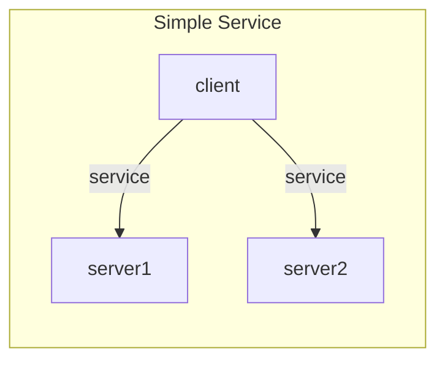
This service can be implemented using the following TOSCA service
template:
```yaml
tosca_definitions_version: tosca_2_0
imports:
  - types.yaml
service_template:
  node_templates:
    server1:
      type: Server
    server2:
      type: Server
    client:
      type: Client
      directives: [ substitute ]
      requirements:
        - service: server1
        - service: server2
```
In this template, the `client` node is annotated with the
`substitute` directive, which means that a substituting template must
be found to instantiate this node. The following figure shows one
possible substitution.
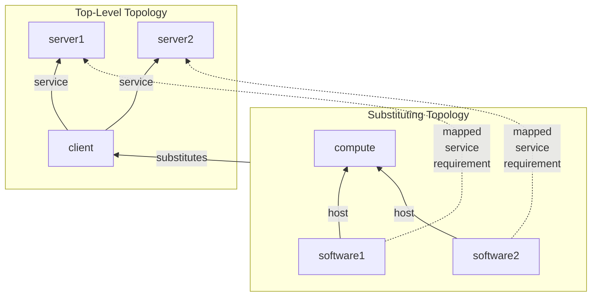
This substitution decomposes the `client` node into two different
`software` nodes, each with exactly one `service` requirement. The
requirement mapping syntax must *distribute* the two `service`
requirements from the substituted `client` node between the `service`
requirements of the two software nodes in the substituting
template. The substitution mapping code in the following substituting
service template shows how this is accomplished:
```yaml
tosca_definitions_version: tosca_2_0
imports:
  - types.yaml
capability_types:
  Host:
    description: >-
      Ability to host software.
relationship_types:
  HostedOn:
    description: >-
      Relationship to a host.
node_types:
  ClientSoftware:
    requirements:
      - host:
          capability: Host
          relationship: HostedOn
      - service:
          capability: Service
          relationship: ServedBy
          count_range: [ 1, 1 ]
  Compute:
    capabilities:
      host:
        type: Host
service_template:
  substitution_mappings:
    node_type: Client
    requirements:
      - service: [ software1, service ]
      - service: [ software2, service ]
  node_templates:
    software1:
      type: ClientSoftware
      requirements:
        - host: compute1
    software2:
      type: ClientSoftware
      requirements:
        - host: compute2
    compute1:
      type: Compute
    compute2:
      type: Compute
```
The following figure shows an alternative substitution where both
`service` requirements of the substituted `client` node are mapped to
corresponding requirements of a single `software` node in the
substituting topology:
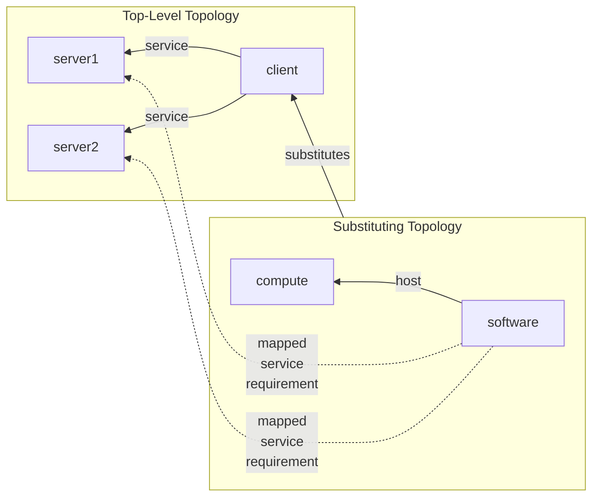
The requirement mapping syntax for this template distributes the two
`service` requirements from the substituted `client` node to *the
same* software node in the substituting template using two identical
mappings for the two `service` requirements as follows:
```yaml
tosca_definitions_version: tosca_2_0
imports:
  - types.yaml
capability_types:
  Host:
    description: >-
      Ability to host software.
relationship_types:
  HostedOn:
    description: >-
      Relationship to a host.
node_types:
  ClientSoftware:
    requirements:
      - host:
          capability: Host
          relationship: HostedOn
      - service:
          capability: Service
          relationship: ServedBy
          count_range: [ 2, 2 ]
  Compute:
    capabilities:
      host:
        type: Host
service_template:
  substitution_mappings:
    node_type: Client
    requirements:
      - service: [ software, service ]
      - service: [ software, service ]
  node_templates:
    software:
      type: ClientSoftware
      requirements:
        - host: compute
    compute:
      type: Compute
```
As a convience feature, it is possible to *group* identical mapping
statements using the syntax in the following example. This syntax
states that two `service` requirements of the substituted node are
mapped to two corresponding `service` requirements of the `software`
node in the substituting template.
```yaml
tosca_definitions_version: tosca_2_0

imports:
  - types.yaml
capability_types:
  Host:
    description: >-
      Ability to host software.
relationship_types:
  HostedOn:
    description: >-
      Relationship to a host.
node_types:
  ClientSoftware:
    requirements:
      - host:
          capability: Host
          relationship: HostedOn
      - service:
          capability: Service
          relationship: ServedBy
          count_range: [ 2, 2 ]
  Compute:
    capabilities:
      host:
        type: Host
service_template:
  substitution_mappings:
    node_type: Client
    requirements:
      - [service, 2 ]: [ software, service ]
  node_templates:
    software:
      type: ClientSoftware
      requirements:
        - host: compute
    compute:
      type: Compute
```
### Mapping Requirements Multiple Times
Imagine a scenario where nodes of type `Client` need to be hosted on
nodes of type `Compute` as shown by the following type definitions:
```yaml
tosca_definitions_version: tosca_2_0

capability_types:
  Host:
    description: >-
      Ability to host software.
relationship_types:
  HostedOn:
    description: >-
      Relationship to a host.
node_types:
  Client:
    requirements:
      - host:
          capability: Host
          relationship: HostedOn
          node: Compute
          count_range: [1, 1]
  Compute:
    capabilities:
      host:
        type: Host
```
The following figure shows a service that contains one node of type
`Client`, one node of type `Compute`, and the `host` relationship
between them:
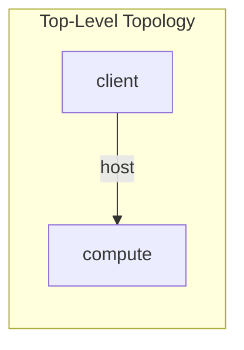
This example can be implemented using the following service template:
```yaml
tosca_definitions_version: tosca_2_0
imports:
  - types.yaml
service_template:
  node_templates:
    compute:
      type: Compute
    client:
      type: Client
      directives: [ substitute ]
      requirements:
        - host: compute
```
The following figure shows a substituting topology that *decomposes*
the node of type `Client` into two software components, each of which
needs to be hosted on the same `compute` node defined in the top-level
template that defines the `client` node.
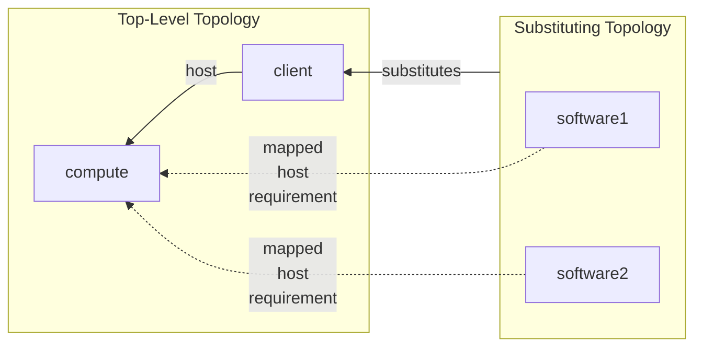
The requirement mapping syntax must *replicate* the single `host`
requirements from the substituted `client` node to the two software
nodes in the subsituting template. The substitution mapping code in
the following substituting service template shows how this is
accomplished by mapping the `host` requirement of the `client` node
twice, once to the `host` requirement of the `software1` node and once
to the `host` requirement of the `software2` node.
```yaml
tosca_definitions_version: tosca_2_0

imports:
  - types.yaml

node_types:
  ClientSoftware:
    requirements:
      - host:
          capability: Host
          relationship: HostedOn
          count_range: [ 1, 1 ]
service_template:
  substitution_mappings:
    node_type: Client
    requirements:
      - host:
          - [ software1, host ]
          - [ software2, host ]
  node_templates:
    software1:
      type: ClientSoftware
    software2:
      type: ClientSoftware
```
Using this syntax, the target of the requirement mapping is a *list*
of target requirements rather than a single requirement.

### Requirement Mapping Rules
This section documents the rules for requirement mapping. The types
defined in the following code snippet are used to illustrate the
rules:
```yaml
tosca_definitions_version: tosca_2_0
capability_types:
  Service:
    description: >-
      Ability to provide service.
relationship_types:
  ServedBy:
    description: >-
      Connection to a service.
node_types:
  Client:
    requirements:
      - service:
          capability: Service
          relationship: ServedBy
          node: Server
          count_range: [ 1, 4 ]
  Server:
    capabilities:
      service:
        type: Service
```
In this example, the `Client` node type defines a `service`
requirement with a `count_range` of `[1, 4]`. This means that a client
can have up to four `service` connections to a `Server` node, but only
one of those is mandatory.

### Requirement Assignments

Any service template that uses the `Client` node type must specify the
correct number of requirement assignments, i.e, the number of
mandatory requirements must be greater than or equal to the lower
bound of the `count_range` and he total number of requirement
assignments (optional as well as mandatory) must be less than or equal
to the upper bound of the count range.

The following shows a valid service template that uses `Client` and
`Server` nodes.
```yaml
tosca_definitions_version: tosca_2_0
imports:
  - types.yaml
service_template:
  node_templates:
    server1:
      type: Server
    server2:
      type: Server
    server3:
      type: Server
    client:
      type: Client
      directives: [ substitute ]
      requirements:
        - service: server1
        - service: server2
        - service: server3
```
In this example, the requirement assignments specify the target nodes
directly, but it is also valid to leave requirements dangling as in
the following example:
```yaml
tosca_definitions_version: tosca_2_0
imports:
  - types.yaml
service_template:
  node_templates:
    server1:
      type: Server
    server2:
      type: Server
    server3:
      type: Server
    client:
      type: Client
      directives: [ substitute ]
      requirements:
        - service: server1
        - service:
            optional: True
        - service:
            optional: True
```
In this example, only the first `service` assignment is mandatory. The
next two are optional. However, after the orchestrator *fulfills* the
dangling (optional) requirements, the resulting service topology for
this second example will likely be identical to the service topology
in the first example, since the orchestrator is able to fulfill both
of the optional requirements using `server` nodes in this topology.

Note that after requirements have been fulfilled, it no longer matters
whether the requirement were mandatory or optional. All that matters
is that if the service topology is valid, the number of established
relationships is guaranteed to fall within the `count_range` specified
in the corresponding requirement definition.

### Mapping Requirements
This section introduces the rules for requirement mappings:

1. As in earlier versions of the spec, requirements from a
   *substituted* node can only be mapped onto *dangling* requirements
   in the substituting template.
2. The total number of requirements mapped onto *mandatory*
   requirements in the substituting template must not exceed the lower
   bound of the `count_range` in the corresponding requirement
   definition in the substituted node's type.
3. The total number of requirement mappings must not exceed the upper
   bound of the `count_range` in the corresponding requirement
   definition in the substituted node's type. Note that this is a
   convenience rule only, since according to rule 2, any *excess*
   mappings would have to map onto optional requirements, and as a
   result can safely be ignored.

Note that there are no constraints on the minimum number of
requirement mappings. More specifically, the total number of
requirement mappings is allowed to be smaller than the lower bound of
the `count_range` in the corresponding requirement definition.

The following code snippet shows a valid substituting template for the
`client` node in the template shown above:
```yaml
tosca_definitions_version: tosca_2_0
imports:
  - types.yaml
capability_types:
  Host:
    description: >-
      Ability to host software.
relationship_types:
  HostedOn:
    description: >-
      Relationship to a host.
node_types:
  ClientSoftware:
    requirements:
      - host:
          capability: Host
          relationship: HostedOn
      - service:
          capability: Service
          relationship: ServedBy
          count_range: [ 1, 1 ]
  Compute:
    capabilities:
      host:
        type: Host
service_template:
  substitution_mappings:
    node_type: Client
    requirements:
      - service: [ software, service ]
  node_templates:
    software:
      type: ClientSoftware
      requirements:
        - host: compute
    compute:
      type: Compute
```
While the substituted `client` node in the template above has three
requirement assigments with target nodes, only one of those
requirements is mapped to a requirement in the substituting template.

The next code snippet shows a slightly different substituting template
for the `client` node in the template shown above. This template
*decomposes* the `client` node into three different software nodes,
each with a single `service` requirement to its own server. The
substitution mapping defines three requirement mappings for the
`service` requirement of the `client` node, one to each of the
`service` requirements of the `software` nodes in the substituting
template.
```yaml
tosca_definitions_version: tosca_2_0
imports:
  - types.yaml
capability_types:
  Host:
    description: >-
      Ability to host software.
relationship_types:
  HostedOn:
    description: >-
      Relationship to a host.
node_types:
  ClientSoftware:
    requirements:
      - host:
          capability: Host
          relationship: HostedOn
      - service:
          capability: Service
          relationship: ServedBy
          count_range: [ 1, 1 ]
  Compute:
    capabilities:
      host:
        type: Host
service_template:
  substitution_mappings:
    node_type: Client
    requirements:
      - service: [ software1, service ]
      - service: [ software2, service ]
      - service: [ software3, service ]
  node_templates:
    software1:
      type: ClientSoftware
      requirements:
        - host: compute1
    software2:
      type: ClientSoftware
      requirements:
        - host: compute2
    software3:
      type: ClientSoftware
      requirements:
        - host: compute3
    compute1:
      type: Compute
    compute2:
      type: Compute
    compute3:
      type: Compute
```
Unfortunately, this substituting template is invalid. Since the
`service` requirement of each `software` node is mandatory, this
template needs three different `service` requirements in any node of
type `Client` for which it is a substitution. This cannot be
guaranteed, since the `service` requirement definition in the `Client`
node type specifies a `count_range` with a lower bound of one, which
means that only such requirement is guaranteed to exist.

The following shows a corrected version of this substituting template:
```yaml
tosca_definitions_version: tosca_2_0
imports:
  - types.yaml
capability_types:
  Host:
    description: >-
      Ability to host software.
relationship_types:
  HostedOn:
    description: >-
      Relationship to a host.
node_types:
  ClientSoftware:
    requirements:
      - host:
          capability: Host
          relationship: HostedOn
      - service:
          capability: Service
          relationship: ServedBy
          count_range: [ 0, 1 ]
  Compute:
    capabilities:
      host:
        type: Host
service_template:
  substitution_mappings:
    node_type: Client
    requirements:
      - service: [ software1, service ]
      - service: [ software2, service ]
      - service: [ software3, service ]
  node_templates:
    software1:
      type: ClientSoftware
      requirements:
        - host: compute1
        - service:
            optional: False
    software2:
      type: ClientSoftware
      requirements:
        - host: compute2
    software3:
      type: ClientSoftware
      requirements:
        - host: compute3
    compute1:
      type: Compute
    compute2:
      type: Compute
    compute3:
      type: Compute
```
In this template, the `service` requirement of the `ClientSoftware`
node type is defined with a `count_range` of `[0, 1]`, which means the
requirement is no longer mandatory. Only the `software1` node template
annotates its `service` requirement as mandatory (using the `optional:
False` statement). The other two software nodes leave their `service`
requirement optional. As a result, this is now a valid substituting
template for nodes of type `Client` that define a `service`
requirement with `count_range` equal to `[1, 4]`.

Requirement mapping must take one more rule into account: if the
number of requirement mappings is greater than the lower bound of the
`count_range`, the orchestrator must first perform those mappings that
map requirements onto **mandatory** requirements in the substituting
template, and then it will perform the remaining mappings (which
presumably will map onto optional requirements in the substituting
template). This is done independent of the order in which the
requirement mappings are specified.

### Handling `UNBOUNDED` Count Ranges
*To be provided*

### Requirement Mappoing Grammar
The one-to-one mapping grammar of a requirement_mapping is as follows:
```
<requirement_name>: [ <node_template_name>, <node_template_requirement_name> ]
```
The one-to-many mapping grammar of a requirement_mapping is as follows:
```
<requirement_name>:
  - [ <node_template_name_1>, <node_template_requirement_name_1> ]
  - ...
  - [ <node_template_name_n>, <node_template_requirement_name_n> ]
```
In the above grammar, the pseudo values that appear in angle brackets
have the following meaning:

- requirement_name: represents the name of the requirement as it
  appears in the type definition for the Node Type name that is
  declared as the value for on the substitution_mappings’ `node_type`
  key.
- node_template_name: represents a valid name of a Node Template
  definition within the same substituting service template
- node_template_requirement_name: represents a valid name of a
  requirement definition within the \<node_template_name\> declared in
  this mapping.

## Interface mapping
An interface mapping allows an interface operation on the substituted
node to be mapped to workflow in the substituting service template.

### Grammar
<!----
{"id": "1110", "author": "Calin Curescu [2]", "date": "2018-08-23T08:33:00Z", "comment": "This could change if we introduce the operations keyname in the interface definitions", "target": "Grammar"}-->
<!----
{"id": "1111", "author": "Chris Lauwers", "date": "2020-08-03T18:40:00Z", "comment": "What about\nnotification mappings?", "target": "follows"}-->
The grammar of an interface_mapping is as follows:
```
<interface_name>:
  <operation_name>: <workflow_name>
```
In the above grammar, the pseudo values that appear in angle brackets
have the following meaning:
- **interface_name:** represents the name of the interface as it appears
  in the Node Type definition for the Node Type (name) that is declared
  as the value for on the substitution_mappings’ `node_type` key.
- **operation_name:** represents the name of the operation as it appears
  in the interface type definition for <interface_name>.
- **workflow_name:** represents the name of a workflow defined in the
  substituting service template to which to map the specified
  interface operation.

# Groups and Policies

## Group Type

A Group Type defines logical grouping types for nodes, typically for
different management purposes. Conceptually, group definitions allow the
creation of logical
“membership” relationships 
<!----
{"id": "1121", "author": "Chris Lauwers", "date": "2020-08-03T18:44:00Z", "comment": "Edit to remove the implication that these\nare similar to \u201cTOSCA relationships\u201d", "target": "creation of logical\n\u201cmembership\u201d relationships "}-->
to
nodes in a service template that are not a part of the application’s
explicit requirement dependencies in the service template (i.e. those
required to actually get the application deployed and running). Instead,
such logical membership allows for the introduction of things such as
group management and uniform application of policies (i.e. requirements
that are also not bound to the application itself) to the group’s
members
<!----
{"id": "1122", "author": "Chris Lauwers", "date": "2021-01-17T02:47:00Z", "comment": "Alternative language suggested by PJ: A\nGroup Type defines logical grouping types for nodes for purposes of\nuniform application of policies to collections of nodes. Conceptually,\ngroup definitions allow the creation of logical \u201cmembership\u201d\nrelationships to nodes in a service template that are not a part of the\napplication\u2019s explicit requirement dependencies in the topology template\n(i.e. those required to actually get the application deployed and\nrunning). Instead, such logical membership allows for the introduction\nof things such as group management and uniform application of policies\n(i.e. requirements that are also not bound to the application itself) to\nthe group\u2019s members.", "target": "members"}-->
. .
<!----
{"id": "1123", "author": "Jordan,PM,Paul,TNK6 R", "date": "2020-11-09T08:56:00Z", "comment": "I don\u2019t think\nthe text definitions of group and group type are sufficiently different.\nSo I\u2019ve added some suggested new text but will leave it to the editors\nto consider how much of the existing text can be\nremoved.", "target": ""}-->


### Keynames

The Group Type is a TOSCA type entity and has the common keynames listed
in Section 4.2.5.2 Common keynames in type definitions. In addition, the
Group Type has the following recognized keynames:

|Keyname|Mandatory|Type|Description|
| ----- | ------- | ----- | ------- |
|properties|no|map of property definitions|An optional map of property definitions for the Group Type.|
|attributes|no|map of attribute definitions|An optional map of attribute definitions for the Group Type.|
|members |no|list of string|An optional list of one or more names of Node Types that are valid (allowed) as members of the Group Type.|

### Grammar

Group Types have the following grammar:
```
<group_type_name>:
  derived_from: <parent_group_type_name>
  version: <version_number>
  metadata: 
    <map of string>
  description: <group_description>
  properties:
    <property_definitions>
  attributes:
    <attribute_definitions>
  members: [ <list_of_valid_member_types> ]
```
In the above grammar, the pseudo values that appear in angle brackets
have the following meaning:

- group_type_name: represents the mandatory symbolic name of the Group
  Type being declared as a string.

- parent_group_type_name: represents the name (string) of the Group Type
  this Group Type definition derives from (i.e. its “parent” type).

- version_number: represents the optional TOSCA version number for the
  Group Type.

- group_description: represents the optional description string for the
  corresponding group_type_name.

- attribute_definitions: represents the optional map of attribute
  definitions for the Group Type.

- property_definitions: represents the optional map of property
  definitions for the Group Type.

- list_of_valid_member_types: represents the optional list of TOSCA Node
  Types that are valid member types for being added to (i.e. members of)
  the Group Type; if the members keyname is not defined then there are
  no restrictions to the member types;

  - note that the members of a group ultimately resolve to nodes, the
    types here just restrict which nodes can be defined as members in a
    group definition.

  - A node type is matched if it is the specified type or is derived from
    the node type

### Derivation rules

During Group Type derivation the keyname definitions follow these rules:

- properties: existing property definitions may be refined; new property
  definitions may be added.

- attributes: existing attribute definitions may be refined; new
  attribute definitions may be added.

- members: if the members keyname is defined in the parent type, each
  element in this list must either be in the parent type list or derived
  from an element in the parent type list; if the members keyname is not
  defined in the parent type then no restrictions are applied to the
  definition.

### Example

The following represents a Group Type definition:
```
group_types:
  mycompany.mytypes.groups.placement:
    description: My company’s group type for placing nodes of type Compute
    members: [ tosca.nodes.Compute ]
```
## Group definition

Collections of Nodes may be defined using a Group. A group definition
defines a logical grouping of node templates, typically for management
purposes, but is separate from the application’s service template.

### Keynames

The following is the list of recognized keynames for a TOSCA group
definition:

|Keyname|Mandatory|Type|Description|
| ----- | ------- | ----- | ------- |
|type|yes|string|The mandatory name of the group type the group definition is based upon.|
|description|no|string|The optional description for the group definition.|
|metadata|no|map of string|Defines a section used to declare additional metadata information. |
|properties|no|map of property assignments|An optional map of property value assignments for the group definition.|
|attributes|no|map of attribute assignments|An optional map of attribute value assignments for the group definition.|
|members|no|list of string|The optional list of one or more node template names that are members of this group definition.|

### Grammar

Group definitions have one the following grammars:
```
<group_name>:
  type: <group_type_name>
  description: <group_description>
  metadata: 
    <map of string>
  properties:
    <property_assignments>
  attributes:
    <attribute_assignments>
  members: [ <list_of_node_templates> ]
```
In the above grammar, the pseudo values that appear in angle brackets
have the following meaning:

- group_name: represents the mandatory symbolic name of the group as a
  string.

- group_type_name: represents the name of the Group Type the definition
  is based upon.

- group_description: contains an optional description of the group.

- property_assignments: represents the optional map of property
  assignments for the group definition that provide values for
  properties defined in its declared Group Type.

- attribute_assigments: represents the optional map of attribute
  assignments for the group definition that provide values for
  attributes defined in its declared Group Type.

- list_of_node_templates: contains the mandatory list of one or more
  node template names or group symbolic names (within the same service
  template) that are members of this logical group

  - if the members keyname was defined (by specifying a
    list_of_valid_member_types) in the group type of this group then the
    nodes listed here must be compatible (i.e. be of that type or of type
    that is derived from) with the node types in the
    list_of_valid_member_types

### Example

The following represents a group definition:
```
groups:
  my_app_placement_group:
    type: tosca.groups.Root
    description: My application’s logical component grouping for placement
    members: [ my_web_server, my_sql_database ]
```
## Policy Type

A Policy Type defines a type of a policy that affects or governs an
application or service’s topology at some stage of its lifecycle but is
not explicitly part of the topology itself (i.e., it does not prevent
the application or service from being deployed or run if it did not
exist).

### Keynames

The Policy Type is a TOSCA type entity and has the common keynames
listed in Section 4.2.5.2 Common keynames in type definitions. In
addition, the Policy Type has the following recognized keynames:

|Keyname|Mandatory|Type|Description|
| ----- | ------- | ----- | ------- |
|properties|no|map of property definitions|An optional map of property definitions for the Policy Type.|
|targets|no|list of string|An optional list of valid Node Types or Group Types the Policy Type can be applied to.|
|triggers|no|map of trigger definitions |An optional map of policy triggers for the Policy Type.|


### Grammar

Policy Types have the following grammar:
```
<policy_type_name>:
  derived_from: <parent_policy_type_name>
  version: <version_number>
  metadata: 
    <map of string>
  description: <policy_description>
  properties:
    <property_definitions> 
  targets: [ <list_of_valid_target_types> ]
  triggers:
    <trigger_definitions>
```
In the above grammar, the pseudo values that appear in angle brackets
have the following meaning:

- policy_type_name: represents the mandatory symbolic name of the Policy
  Type being declared as a string.

- parent_policy_type_name: represents the name (string) of the Policy
  Type this Policy Type definition derives from (i.e., its “parent”
  type).

- version_number: represents the optional TOSCA version number for the
  Policy Type.

- policy_description: represents the optional description string for the
  corresponding policy_type_name.

- property_definitions: represents the optional map of property
  definitions for the Policy Type.

- list_of_valid_target_types: represents the optional list of TOSCA
  types (i.e. Group or Node Types) that are valid targets for this
  Policy Type; if the targets keyname is not defined then there are no
  restrictions to the targets’ types.

- trigger_definitions: represents the optional map of trigger
  definitions for the policy.

### Derivation rules

During Policy Type derivation the keyname definitions follow these
rules:

- properties: existing property definitions may be refined; new property
  definitions may be added.

- targets: if the targets keyname is defined in the parent type, each
  element in this list must either be in the parent type list or derived
  from an element in the parent type list; if the targets keyname is not
  defined in the parent type then no restrictions are applied to this
  definition.

- triggers: existing trigger definitions may not be changed; new trigger
  definitions may be added.

### Example

The following represents a Policy Type definition:
```
policy_types:
  mycompany.mytypes.policies.placement.Container.Linux:
    description: My company’s placement policy for linux 
    derived_from: tosca.policies.Root
```
## Policy definition

A policy definition defines a policy that can be associated with a TOSCA
service or top-level entity definition (e.g., group definition, node
template, etc.).

### Keynames

The following is the list of recognized keynames for a TOSCA policy
definition:
<!----
{"id": "1167", "author": "Chris Lauwers", "date": "2022-10-03T19:59:00Z", "comment": "Policies apply to entire service templates,\nnot to individual node templates. What was the intended use of targets\nin policy definitions?", "target": "definition"}-->

|Keyname|Mandatory|Type|Description|
| ----- | ------- | ----- | ------- |
|type|yes|string|The mandatory name of the policy type the policy definition is based upon.|
|description|no|string|The optional description for the policy definition.|
|metadata|no|map of string|Defines a section used to declare additional metadata information. |
|properties|no|map of property assignments|An optional map of property value assignments for the policy definition.|
|targets|no|list of string|An optional list of valid Node Templates or Groups the Policy can be applied to.|
|triggers|no|map of trigger definitions|An optional map of trigger definitions to invoke when the policy is applied by an orchestrator against the associated TOSCA entity. These triggers apply in addition to the triggers defined in the policy type.|

### Grammar

Policy definitions have one the following grammars:
```
<policy_name>:
  type: <policy_type_name>
  description: <policy_description>
  metadata: 
    <map of string>
  properties:
    <property_assignments>
  targets: [<list_of_policy_targets>]
  triggers:
    <trigger_definitions>
```
In the above grammar, the pseudo values that appear in angle brackets
have the following meaning:

- policy_name: represents the mandatory symbolic name of the policy as a
  [string](#TYPE_YAML_STRING).

- policy_type_name: represents the name of the policy the definition is
  based upon.

- policy_description: contains an optional description of the policy.

- property_assignments: represents the optional map of [property
  assignments](#property-assignment) for the policy definition that
  provide values for properties defined in its declared Policy Type.

- list_of_policy_targets: represents the optional list of names of node
  templates or groups that the policy is to applied to.

  - if the targets keyname was defined (by specifying a
    list_of_valid_target_types) in the policy type of this policy then the
    targets listed here must be compatible (i.e. be of that type or of
    type that is derived from) with the types (of nodes or groups) in the
    list_of_valid_target_types.

- trigger_definitions: represents the optional map
  of [trigger definitions](#trigger-definition) for the policy; these
  triggers apply in addition to the triggers defined in the policy
  type.
<!----
{"id": "1173", "author": "Calin Curescu", "date": "2020-05-06T10:56:00Z", "comment": "!!! What is the meaning of these triggers\n  here w.r.t. the triggers defined in the policy type?  \n  I assume we should allow the definition of new triggers, that are used\n  in addition to the triggers defined in the policy type.  \n  But, in interface we did not allow to add new operations or\n  notifications.", "target": "trigger_definitions: represents the optional map\n  of [trigger definitions](#trigger-definition) for the policy; these\n  triggers apply in addition to the triggers defined in the policy\n  type."}-->


### Example

The following represents a policy definition:
```
  - my_compute_placement_policy:
      type: tosca.policies.placement
      description: Apply my placement policy to my application’s servers
      targets: [ my_server_1, my_server_2 ]
      # remainder of policy definition left off for brevity
```
## Trigger definition

A trigger definition defines the event, condition and action that is
used to “trigger” a policy with which it is associated.

### Keynames
<!----
{"id": "1181", "author": "Matt Rutkowski", "date": "2017-09-26T11:38:00Z", "comment": "RECALL; Policy type defn were to be consumed by a \u201cPolicy Engine\u201d that would create events on a known event monitoring service. We need to create diagram and explain the event-condition-action flow of policy (defn.)", "target": "Keynames"}-->

The following is the list of recognized keynames for a TOSCA trigger
definition:

|Keyname|Mandatory|Type|Description|
|---|---|---|---|
|description | no|[string](#TYPE_YAML_STRING)| The optional description string for the trigger.|
|event    | yes    | [string](#TYPE_YAML_STRING)| The mandatory name of the event that activates the trigger’s action. |
|condition  | no    | [condition clause](#BKM_Condition_Clause_Def)| The optional condition that must evaluate to true in order for the trigger’s action to be performed. Note: this is optional since sometimes the event occurrence itself is enough to trigger the action.|
|action|yes|list of [activity definition](#activity-definitions)|The list of sequential activities to be performed when the event is triggered, and the condition is met (i.e., evaluates to true).|
<!----
{"id": "1182", "author": "Chris Lauwers", "date": "2022-10-03T20:01:00Z", "comment": "We need to clarify the context in which event names can be interpreted. Are they globally scoped?", "target": "name"}-->

### Grammar
<!----
{"id": "1185", "author": "Calin Curescu", "date": "2020-05-06T11:29:00Z", "comment": "This does not make any sense. Needs to be deleted.", "target": ""}-->

Trigger definitions have the following grammars:
```
<trigger_name>:
  description: <trigger_description>
  event: <event_name>
  condition: <condition_clause>
  action: 
    - <list_of_activity_definition>
```
In the above grammar, the pseudo values that appear in angle brackets
have the following meaning:

- trigger_name: represents the mandatory symbolic name of the trigger as
  a [string](#TYPE_YAML_STRING).

- trigger_description: represents the optional
  [description](#TYPE_YAML_STRING) string for the corresponding
  trigger_name.

- event_name: represents the mandatory name of an event associated with
  an interface notification on the identified resource (node). .

- condition_clause: an optional Boolean expression that can be evaluated
  within the context of the service with which the policy is associated
  and that must evaluate to true in order for the trigger’s action to be
  performed. Note that the arguments to the condition clause function
  can in turn be other TOSCA functions. If no condition clause is
  specified, the trigger event will always result in the trigger’s
  action being taken.

- list_of_activity_definition: represents the list of activities that
  are performed in response to the event if the (optional) condition is
  met.

## Activity definitions

An activity defines an operation to be performed in a TOSCA workflow
step or in an action body of a policy trigger. Activity definitions can
be of the following types:

- Delegate workflow activity definition:

  - Defines the name of the delegate workflow and optional input
    assignments. This activity requires the target to be provided by the
    orchestrator (no-op node or relationship).

- Set state activity definition:

  - Sets the state of a node.

- Call operation activity definition:

  - Calls an operation defined on a TOSCA interface of a node,
    relationship or group. The operation name uses the
    \<interface_name\>.\<operation_name\> notation. Optionally,
    assignments for the operation inputs can also be provided. If
    provided, they will override for this operation call the operation
    inputs assignment in the node template.

- Inline workflow activity definition:

  - Inlines another workflow defined in the service (allowing
    reusability). The definition includes the name of a workflow to be
    inlined and optional workflow input assignments.

### Delegate workflow activity definition

#### Keynames

The following is a list of recognized keynames for a delegate activity
definition.

|Keyname|Mandatory|Type|Description|
| ----- | ------- | ----- | ------- |
|delegate|yes|string or empty  (see grammar below)|Defines the name of the delegate workflow and optional input assignments. This activity requires the target to be provided by the orchestrator (no-op node or relationship).|
|workflow|no|string|The name of the delegate workflow. Mandatory in the extended notation.|
|inputs|no|map of parameter assignments|The optional map of input parameter assignments for the delegate workflow.|

#### Grammar

A delegate activity definition has the following grammar. The short
notation can be used if no input assignments are provided.

####  Short notation
```
- delegate: <delegate_workflow_name>
```
####  Extended notation
```
- delegate: 
   workflow: <delegate_workflow_name>
   inputs:
     <parameter_assignments>
```

In the above grammar, the pseudo values that appear in angle brackets
have the following meaning:

- **delegate_workflow_name**: represents the name of the workflow of the
  node provided by the TOSCA orchestrator.

- **parameter_assignments**: represents the optional map of parameter
  assignments for passing parameters as inputs to this workflow
  delegation.

### Set state activity definition

Sets the state of the target node.

#### Keynames

The following is a list of recognized keynames for a set state activity
definition.

| **Keyname** | **Mandatory** | **Type**      | **Description**          |
|-------------|---------------|---------------|--------------------------|
| set_state   | yes           | <u>string</u> | Value of the node state. |

#### Grammar

A set state activity definition has the following grammar.
```
- set_state: <new_node_state>
```
In the above grammar, the pseudo values that appear in angle brackets
have the following meaning:

- new_node_state: represents the state that will be affected to the node
  once the activity is performed.

### Call operation activity definition

This activity is used to call an operation on the target node. Operation
input assignments can be optionally provided.

#### Keynames

The following is a list of recognized keynames for a call operation
activity definition.

|Keyname|Mandatory|Type|Description|
| ----- | ------- | ----- | ------- |
|call_operation|yes|string or empty (see grammar below)|Defines the opration call. The operation name uses the \<interface_name\>.\<operation_name\> notation. Optionally, assignments for the operation inputs can also be provided. If provided, they will override for this operation call the operation inputs assignment in the node template.|
|operation|no|string|The name of the operation to call, using the \<interface_name\>.\<operation_name\> notation.  Mandatory in the extended notation.|
|inputs|no|map of parameter assignments|The optional map of input parameter assignments for the called operation. Any provided input assignments will override the operation input assignment in the target node template for this operation call.|

#### Grammar

A call operation activity definition has the following grammar. The
short notation can be used if no input assignments are provided.

####  Short notation
```
- call_operation: <operation_name>
```
####  Extended notation
```
- call_operation: 
   operation: <operation_name>
   inputs:
     <parameter_assignments>
```
In the above grammar, the pseudo values that appear in angle brackets
have the following meaning:

- operation_name: represents the name of the operation that will be
  called during the workflow execution. The notation used is
  \<interface_sub_name\>.\<operation_sub_name\>, where
  interface_sub_name is the interface name and the operation_sub_name is
  the name of the operation within this interface.

- **parameter_assignments**: represents the optional map of parameter
  assignments for passing parameters as inputs to this workflow
  delegation.

### Inline workflow activity definition

This activity is used to inline a workflow in the activities sequence.
The definition includes the name of the inlined workflow and optional
input assignments.

#### Keynames

The following is a list of recognized keynames for an inline workflow
activity definition.

|Keyname|Mandatory|Type|Description|
| ----- | ------- | ----- | ------- |
|inline|yes|string or empty (see grammar below)|The definition includes the name of a workflow to be inlined and optional workflow input assignments.|
|workflow|no|string|The name of the inlined workflow. Mandatory in the extended notation.|
|inputs|no|map of parameter assignments|The optional map of input parameter assignments for the inlined workflow.|

#### Grammar

An inline workflow activity definition has the following grammar. The
short notation can be used if no input assignments are provided.

####  Short notation
```
- inline: <inlined_workflow_name>
```
####  Extended notation
```
- inline: 
   workflow: <inlined_workflow_name>
   inputs:
     <parameter_assignments>
```
In the above grammar, the pseudo values that appear in angle brackets
have the following meaning:

- inlined_workflow_name: represents the name of the workflow to inline.

- **parameter_assignments**: represents the optional map of parameter
  assignments for passing parameters as inputs to this workflow
  delegation.

### Example

The following represents a list of activity definitions (using the short
notation):
```
 - delegate: deploy
 - set_state: started
 - call_operation: tosca.interfaces.node.lifecycle.Standard.start
 - inline: my_workflow
```
# Workflows

## Imperative Workflow definition

A workflow definition defines an imperative workflow that is associated
with a TOSCA service. A workflow definition can either include the steps
that make up the workflow, or it can refer to an artifact that expresses
the workflow using an external workflow language.

### Keynames

The following is the list of recognized keynames for a TOSCA workflow
definition:

|Keyname|Mandatory|Type|Description|
| ----- | ------- | ----- | ------- |
|description|no|string|The optional description for the workflow definition.|
|metadata|no|map of string|Defines a section used to declare additional metadata information. |
|inputs|no|map of parameter definitions|The optional map of input parameter definitions.|
|precondition|no|condition clause|Condition clause that must evaluate to true before the workflow can be processed.|
|steps|no|map of step definitions|An optional map of valid imperative workflow step definitions.|
|implementation|no|operation implementation definition|The optional definition of an external workflow definition. This keyname is mutually exclusive with the steps keyname above.|
|outputs|no|map of attribute mappings|The optional map of attribute mappings that specify workflow  output values and their mappings onto attributes of a node or relationship defined in the service.|

### Grammar

Imperative workflow definitions have the following grammar:
```
<workflow_name>:
  description: <workflow_description>
  metadata: 
    <map of string>
  inputs:
    <parameter_definitions>
  precondition:
    <condition_clause>
  steps:
    <workflow_steps>
  implementation:
    <operation_implementation_definitions>
  outputs:
    <attribute_mappings>
```
In the above grammar, the pseudo values that appear in angle brackets
have the following meaning:

- workflow_name:

- workflow_description:

- parameter_definitions:

- condition_clause:

- workflow_steps:

- operation_implementation_definition: represents a full inline
  definition of an implementation artifact

- attribute_mappings: represents the optional map of attribute_mappings
  that consists of named output values returned by operation
  implementations (i.e. artifacts) and associated mappings that specify
  the attribute into which this output value must be stored.

## Workflow precondition definition

A workflow precondition defines a condition clause that checks if a
workflow can be processed or not based on the state of the instances of
a TOSCA service deployment. If the condition is not met, the workflow
will not be triggered.

### Examples

\<\<TO BE PROVIDED\>\>

## Workflow step definition

A workflow step allows to define one or multiple sequenced activities in
a workflow and how they are connected to other steps in the workflow.
They are the building blocks of a declarative workflow.

### Keynames

The following is the list of recognized keynames for a TOSCA workflow
step definition:

|Keyname|Mandatory|Type|Description|
| ----- | ------- | ----- | ------- |
|target|yes|string|The target of the step (this can be a node template name, a group name)|
|target_relationship|no|string|The optional name of a requirement of the target in case the step refers to a relationship rather than a node or group. Note that this is applicable only if the target is a node.|
|operation_host|no|string|The node on which operations should be executed (for TOSCA call_operation activities). This element is mandatory only for relationships and groups target. If target is a relationship then operation_host is mandatory and valid_values are SOURCE or TARGET – referring to the relationship source or target node. If target is a group then operation_host is optional. If not specified the operation will be triggered on every node of the group. If specified the valid_value is a node_type or the name of a node template.|
|filter|no|list of validation clauses|Filter is a list of validation clauses that allows to provide a filtering logic.|
|activities|yes|list of activity definition|The list of sequential activities to be performed in this step.|
|on_success|no|list of string|The optional list of step names to be performed after this one has been completed with success (all activities has been correctly processed).|
|on_failure|no|list of string|The optional list of step names to be called after this one in case one of the step activity failed.|

### Grammar

Workflow step definitions have the following grammars:
```
steps:
  <step_name>
    target: <target_name>
    target_relationship: <target_requirement_name>
    operation_host: <operation_host_name>
    filter:
      - <list_of_condition_clause_definition>
    activities:
      - <list_of_activity_definition>
    on_success:
      - <target_step_name>
    on_failure:
      - <target_step_name>
```
In the above grammar, the pseudo values that appear in angle brackets
have the following meaning:

- target_name: represents the name of a node template or group in the
  service.

- target_requirement_name: represents the name of a requirement of the
  node template (in case target_name refers to a node template.

- **operation_host:** the node on which the operation should be executed

- **list_of_condition_clause_definition:** represents a list of
  condition clause definition.

- **list_of_activity_definition**: represents a list of activity
  definition

- **target_step_name**: represents the name of another step of the
  workflow.

TOSCA built-in functions
========================

## Representation graph query functions
<!----
{"id": "1316", "author": "Matt Rutkowski", "date": "2015-08-25T21:52:00Z", "comment": "[TOSCA-146](media/image1.png): WD02: Need to include grammar and examples for each function.", "target": "Representation graph query functions"}-->

### get_input 

The get_input function is used to retrieve the values of parameters
declared within the inputs section of a TOSCA Service Template.

#### Grammar 
```
$get_input: <input_parameter_name>
```
or
```
$get_input: [ <input_parameter_name>, <nested_input_parameter_name_or_index_1>, ..., <nested_input_parameter_name_or_index_n> ]
```
Note that the first signature does not conform to the custom function
definition, but it does not have to as it is a TOSCA built-in function.

#### Arguments

|Argument|Mandatory|Type|Description|
| ----- | ------- | ----- | ------- |
|\<input_parameter_name\>|yes|string|The name of the parameter as defined in the inputs section of the service template.|
|\<nested_input_parameter_name_or_index_*\>|no|string \| integer|Some TOSCA input parameters are complex (i.e., composed as nested structures).  These parameters are used to dereference into the names of these nested structures when needed.  Some parameters represent list types. In these cases, an index may be provided to reference a specific entry in the list (as identified by the previous parameter) to return. |

#### Examples

The following snippet shows an example of the simple get_input grammar:
```
inputs:
  cpus:
    type: integer

node_templates:
  my_server:
    type: tosca.nodes.Compute
    capabilities:
      host:
        properties:
          num_cpus: { $get_input: cpus }
```
The following template shows an example of the nested get_input grammar.
The template expects two input values, each of which has a complex data
type. The get_input function is used to retrieve individual fields from
the complex input data.
```
data_types:
  NetworkInfo:
    derived_from: tosca.Data.Root
    properties:
      name:
        type: string
      gateway:
        type: string
        
  RouterInfo:
    derived_from: tosca.Data.Root
    properties:
      ip:
        type: string
      external:
        type: string

service_template:
  inputs:
    management_network:
      type: NetworkInfo
    router:
      type: RouterInfo
      
  node_templates:
    Bono_Main:
      type: vRouter.Cisco
      directives: [ substitutable ]
      properties:
        mgmt_net_name: { $get_input: [management_network, name]}
        mgmt_cp_v4_fixed_ip: { $get_input: [router, ip]}
        mgmt_cp_gateway_ip: { $get_input: [management_network, gateway]}
        mgmt_cp_external_ip: { $get_input: [router, external]}
      requirements:
        - lan_port: 
            node: host_with_net
            capability: virtualBind
        - mgmt_net: mgmt_net
```
### get_property

The get_property function is used to retrieve property values of
modelable entities in the representation graph. Note that the
get_property function may only retrieve the static values of parameter
or property definitions of a TOSCA application as defined in the TOSCA
Service Template. The get_attribute function
should be used to retrieve values for attribute definitions (or property
definitions reflected as attribute definitions) from the representation
graph of the TOSCA application (as realized by the TOSCA orchestrator).

#### Grammar 
<!----
{"id": "1321", "author": "Matt Rutkowski", "date": "2015-08-25T21:52:00Z", "comment": "[TOSCA-169](comments.xml): is this always a separate service template? Can have local refs? TODO: See what remains of this JIRA issue that is not addressed by this new method.", "target": "Grammar "}-->
```
$get_property: [ <tosca_traversal_path>, <property_name>, <nested_property_name_or_index_1>, ..., <nested_property_name_or_index_n> ]
```
#### Arguments

|Argument|Mandatory|Description|
| ----- | ------- | ----- | 
|\< tosca_traversal_path \>|yes|Using the \<tosca_traversal_path\> we can traverse the representation graph to extract information from a certain node or relationship. We start from a specific node or relationship identified by its symbolic name (or by the SELF keyword representing the node or relationship containing the definition) and then we may further traverse the relationships and nodes of the representation graph (using a variable number of steps) until reaching the desired node or relationship. In the following subsection the specification of the \<tosca_traversal_path\> is explicated.|
|\<property_name\>|yes|The name of the property definition the function will return the value from.|
|\<nested_property_name_or_index_*\> |no|Some TOSCA properties are complex (i.e., composed as nested structures).  These parameters are used to dereference into the names of these nested structures when needed.  Some properties represent list types. In these cases, an index may be provided to reference a specific entry in the list (as identified by the previous parameter) to return. |

##### The simplified TOSCA_PATH definition in BNF format
```
<tosca_path> ::=         <initial_context>, <node_context> |
                         <initial_context>, <rel_context>
<initial_context> ::=    <node_symbolic_name> | 
                         <relationship_symbolic_name> |
                         SELF 
<rel_context> ::=        SOURCE, <node_context> | 
                         TARGET, <node_context> | 
                         CAPABILITY |
                         <empty>
<node_context> ::=       RELATIONSHIP, <requirement_name>, <id_of_outgoing_rel>, <rel_context> |
                         CAPABILITY, <capability_name>, RELATIONSHIP, <id_of_incoming_rel>, <rel_context> |
                         CAPABILITY, <capability_name> |
                         <empty>
<id_of_outgoing_rel> ::= <integer_index> | 
                         ALL | 
                         <empty>
<id_of_incoming_rel> ::= <integer_index> |
                         ALL | 
                         <empty>
```
The initial context (if we refer to a node or relationship) determines
if the next context is a relationship context or a node context. Then,
each *\<node_context\>* can further resolve to a *\<rel_context\>* and
vice versa, thus building additional traversal steps. In the end we
reach either a node context, a relationship context, or a capability
context as presented above.

A *\<rel_context\>* can

- further lead to the source node of the current relationship

- further lead to the target node of the current relationship

- end within the target capability of the current relationship

- end within the current relationship via the \<empty\> resolution

A *\<node_context\>* can

- further lead to the relationship with index \<idx_of_out_rel_in_req\>
  defined by requirement with symbolic name \<requirement_name\> of the
  current node

- further lead to the relationship with index \<idx_of_incoming_rel\>
  that has as target the capability with symbolic name
  \<capability_name\> of the current node

- end within the capability with symbolic name \<capability_name\> in
  the current node

- end within the current node via the \<empty\> resolution

Note that both the indexes can either be a non-negative integer, the
keyword ALL, or missing. If it is a non-negative integer, 0 represents
the first index and so on incrementally. If the index is missing, the
semantic meaning is that the first index (index with value 0) is used.
If it is the keyword ALL, then we return the result for all possible
indices (further resolved separately) as a list. If the there are
multiple ALL keywords in the definition, then all the results shall be
merged into a single list.

#### Note

We further list the changes from the get_property and get_attribute
expression from v1.3 to v2.0:

- Added multi-step traversal of the representation graph

- Added the backward traversal from capabilities to incoming
  relationships

- Added the target capability of a relationship as a possible traversal

- Added the specification of indexes and allowing traversal of
  multi-count requirements

- Changed the following syntax to work better in multi-step traversal:

  - The initial SOURCE, … becomes SELF, SOURCE, …

  - The initial TARGET, … becomes SELF, TARGET, …

#### Examples
<!----
{"id": "1322", "author": "Matt Rutkowski", "date": "2015-08-25T21:52:00Z", "comment": "WD03: TODO: Need examples for returning simple types and complex/nested structures (e.g., Maps of Maps)", "target": "Examples"}-->

The following example shows how to use the get_property function with an
actual Node Template name:
```
node_templates:

  mysql_database:
    type: tosca.nodes.Database
    properties:
      name: sql_database1

  wordpress:
    type: tosca.nodes.WebApplication.WordPress
    ...
    interfaces:
      Standard:
        configure: 
          inputs:
            wp_db_name: { $get_property: [ mysql_database, name ] }
```
The following example shows how to use the get_property function
traversing from the relationship to its target node:
```
relationship_templates:
    my_connection:
      type: ConnectsTo
      interfaces:
        Configure:
          inputs: 
            targets_value: { $get_property: [ SELF, TARGET, value ] }
```
The following example shows how to use the get_property function using
the SELF keyword, and traversing from a wordpress node (via the first
relationship of the database_endpoint requirement to the target
capability in the target node) and accessing the port property of that
capability:
```
node_templates:  

  mysql_database:
    type: tosca.nodes.Database
    ...
    capabilities:
      database_endpoint:
        properties:
          port: 3306

  wordpress:
    type: tosca.nodes.WebApplication.WordPress
    requirements:
      ...
      - database_endpoint: mysql_database
    interfaces:
      Standard:
        create: wordpress_install.sh
        configure: 
          implementation: wordpress_configure.sh            
          inputs:
            ...
            wp_db_port:
              $get_property:
               - SELF
               - RELATIONSHIP
               - database_endpoint
               - 0
               - CAPABILITY
               - port
```
NOTE that in the above example the index 0 is used but can also be
omitted with the same semantic meaning.

The following example shows how to use the get_property function to
traverse over two requirement relationships, from the wordpress node to
its database node and further to its DBMS host to get its
admin_credential property:
```
node_templates:  

  mysql_database:
    type: tosca.nodes.Database
    ...
    capabilities:
      database_endpoint:
        properties:
          port: 3306

  wordpress:
    type: tosca.nodes.WebApplication.WordPress
    requirements:
      ...
      - database_endpoint: mysql_database
    interfaces:
      Standard:
        create: wordpress_install.sh
        configure: 
          implementation: wordpress_configure.sh            
          inputs:
            ...
            host_dbms_admin_credential:
              $get_property:
               - SELF
               - RELATIONSHIP
               - database_endpoint
               - TARGET
               - RELATIONSHIP
               - host
               - TARGET
               - admin_credential
```
> TODO: An example of second index (i.e. 1) and index ALL !!!

### get_attribute

The **get_attribute** function is used within a representation graph to
obtain attribute values from nodes and relationships that have been
created from an application model described in a service template. The
nodes or relationships can be referenced by their name as assigned in
the service template or relative to the context where they are being
invoked.

#### Grammar 
<!----
{"id": "1326", "author": "Matt Rutkowski", "date": "2015-08-25T21:52:00Z", "comment": "[TOSCA-169](commentsExtended.xml): is this always a separate service template? Can have local refs? TODO: See what remains of this JIRA issue that is not addressed by this new method.", "target": "Grammar "}-->
```
$get_attribute: [<tosca_traversal_path>, <attribute_name>, <nested_attribute_name_or_index_1>, ..., <nested_attribute_name_or_index_n> ]
```
#### Arguments

|Argument|Mandatory|Description|
| ----- | ------- | ----- | 
|\<tosca_traversal_path\>|yes|Using the \<tosca_traversal_path\> we can traverse the representation graph to extract information from a certain node or relationship. We start from a specific node or relationship identified by its symbolic name (or by the SELF keyword representing the node or relationship containing the definition) and then we may further traverse the relationships and nodes of the representation graph (using a variable number of steps) until reaching the desired node or relationship. The specification of the \<tosca_traversal_path\> is explicated in the get_property section.|
|\<attribute_name\> |yes|The name of the attribute definition the function will return the value from.|
|\<nested_attribute_name_or_index_*\> |no|Some TOSCA attributes are complex (i.e., composed as nested structures).  These parameters are used to dereference into the names of these nested structures when needed.    Some attributes represent list types. In these cases, an index may be provided to reference a specific entry in the list (as identified by the previous parameter) to return. |

#### Examples:

The attribute
functions are used in the same way as the equivalent Property functions
described above. Please see their examples and replace “get_property”
with “get_attribute” function name.
<!----
{"id": "1327", "author": "Matt Rutkowski", "date": "2015-08-25T21:52:00Z", "comment": "Is this always true?", "target": "The attribute\nfunctions are used in the same way as the equivalent Property functions\ndescribed above. Please see their examples and replace \u201cget_property\u201d\nwith \u201cget_attribute\u201d function name."}-->


### get_artifact

The get_artifact function is used to retrieve artifact location between modelable entities defined in the same service template.

#### Grammar 
```
$get_artifact: [ <modelable_entity_name>, <artifact_name>, <location>, <remove> ]
```
#### Arguments

|Argument|Mandatory|Type|Description|
| ----- | ------- | ----- | ----- |
|\<modelable entity name\> \| SELF \| SOURCE \| TARGET \| HOST|yes|string|The mandatory name of a modelable entity (e.g., Node Template or Relationship Template name) as declared in the service template that contains the property definition the function will return the value from. See section B.1 for valid keywords.|
|<artifact_name\>|yes|string|The name of the artifact definition the function will return the value from.|
|\<location\> \| LOCAL_FILE|no|string|Location value must be either a valid path e.g. ‘/etc/var/my_file’ or ‘LOCAL_FILE’. If the value is LOCAL_FILE the orchestrator is responsible for providing a path as the result of the get_artifact call where the artifact file can be accessed. The orchestrator will also remove the artifact from this location at the end of the operation. If the location is a path specified by the user the orchestrator is responsible to copy the artifact to the specified location. The orchestrator will return the path as the value of the get_artifact function and leave the file here after the execution of the operation.|
|remove|no|boolean|Boolean flag to override the orchestrator default behavior so it will remove or not the artifact at the end of the operation execution. If not specified the removal will depends of the location e.g. removes it in case of ‘LOCAL_FILE’ and keeps it in case of a path. If true the artifact will be removed by the orchestrator at the end of the operation execution, if false it will not be removed.|

#### Examples

The following example uses a snippet of a WordPress
\[[WordPress](#CIT_WORDPRESS)\] web application to show how to use the
get_artifact function with an actual Node Template name:

##### Example: Retrieving artifact without specified location
```
node_templates:

  wordpress:
    type: tosca.nodes.WebApplication.WordPress
    ...
    interfaces:
      Standard:
        configure: 
          create:
            implementation: wordpress_install.sh
            inputs
              wp_zip: { $get_artifact: [ SELF, zip ] }
    artifacts:
      zip: /data/wordpress.zip
```
In such implementation the TOSCA orchestrator may provide the
wordpress.zip archive as

- a local URL (example:
  [file://home/user/wordpress.zip](file:///\\home\user\wordpress.zip))
  or

- a remote one (example: <http://cloudrepo:80/files/wordpress.zip>)
  where some orchestrator may indeed provide some global artifact
  repository management features.

##### Example: Retrieving artifact as a local path

The following example explains how to force the orchestrator to copy the
file locally before calling the operation’s implementation script:
```
node_templates:

  wordpress:
    type: tosca.nodes.WebApplication.WordPress
    ...
    interfaces:
      Standard:
        configure: 
          create:
            implementation: wordpress_install.sh
            inputs
              wp_zip: { $get_artifact: [ SELF, zip, LOCAL_FILE] }
    artifacts:
      zip: /data/wordpress.zip
```
In such implementation the TOSCA orchestrator must provide the
wordpress.zip archive as a local path (example:
[/tmp/wordpress.zip](file:///\\home\user\wordpress.zip)) and **will
remove it** after the operation is completed.

##### Example: Retrieving artifact in a specified location

The following example explains how to force the orchestrator to copy the
file locally to a specific location before calling the operation’s
implementation script:
```
node_templates:

  wordpress:
    type: tosca.nodes.WebApplication.WordPress
    ...
    interfaces:
      Standard:
        configure: 
          create:
            implementation: wordpress_install.sh
            inputs
              wp_zip: { $get_artifact: [ SELF, zip, C:/wpdata/wp.zip ] }
    artifacts:
      zip: /data/wordpress.zip
```
In such implementation the TOSCA orchestrator must provide the
wordpress.zip archive as a local path (example: C:/wpdata/wp.zip ) and
**will let it** after the operation is completed.

### value

This function is used as an argument inside validation functions. It
returns the value of the property, attribute, or parameter for which the
validation clause is defined.

#### Grammar 
```
$value: [<nested_value_name_or_index>, ... ]
```
#### Arguments

|Argument|Mandatory|Description|
| ----- | ------- | ----- | 
|<nested_value_name_or_index\> |no|Some TOSCA data are complex (i.e., composed as nested structures).  These parameters are used to dereference into the names of these nested structures when needed.    Some data represent lists. In these cases, an index may be provided to reference a specific entry in the list (as identified by the previous parameter) to return. |

Boolean Functions
-----------------
<!----
{"id": "1332", "author": "Calin Curescu", "date": "2022-12-06T16:00:00Z", "comment": "I would not call them condition functions since they can appear also outside conditions.", "target": " Functions"}-->

TOSCA includes a number of functions that return Boolean values. These
functions are used in validation expressions and in condition clauses in
workflow definitions and policy definitions. They are also used as node
filters in requirement definitions and requirement templates and as
substitution filters in substitution mappings.

### Boolean Logic Functions

#### and

The \$and function takes two or more Boolean arguments. It evaluates to
true if all its arguments evaluate to true. It evaluates to false in all
other cases.

##### Grammar 
```
$and: [ <boolean_arg1>, <boolean_arg2>, ... <boolean_argn>]
```
#####  Note

Note that the evaluation of the arguments in the \$and function may stop
as soon as a false argument is encountered, and the function may return
immediately without evaluating the rest of the arguments.

#### or

The \$or function takes two or more Boolean arguments. It evaluates to
false if all of its arguments evaluate to false. It evaluates to true in
all other cases.

##### Grammar 
```
$or: [ <boolean_arg1>, <boolean_arg2>, ... <boolean_argn>]
```
##### Note

Note that the evaluation of the arguments in the \$or function may stop
as soon as a true argument is encountered, and the function may return
immediately without evaluating the rest of the arguments.

#### not

The \$not function takes one Boolean argument. It evaluates to true if
its argument evaluates to false and evaluates to false if its argument
evaluates to true.

##### Grammar 
```
$not: [ <boolean_arg> ]
```
#### xor

The \$xor function takes two Boolean arguments. It evaluates to false if
both arguments either evaluate to true or both arguments evaluate to
false, and evaluates to true otherwise.

##### Grammar 
```
$xor: [ <boolean_arg1>, <boolean_arg2> ]
```
### Comparison Functions

The following is the list of recognized comparison functions.

- Note that some implementations may fail the evaluation if the
  arguments are not of the same type.

- Also note that Unicode string comparisons are implementation specific.

- TODO explanation on how versions are
  compared!!\!
<!----
{"id": "1333", "author": "Calin Curescu", "date": "2023-01-04T16:19:00Z", "comment": "TODO explanation on how versions are\n  compared!!!", "target": "TODO explanation on how versions are\n  compared!!\\!"}-->

#### equal

The function takes two arguments of any type. It evaluates to true if
the arguments are equal (that is in both type and value) and evaluates
to false otherwise.

##### Grammar 
```
$equal: [ <any_type_arg1>, <any_type_arg2> ]
```
#### greater_than

The function takes two arguments of integer, float, string, timestamp,
version, any scalar type, or their derivations. It evaluates to true if
both arguments are of the same type, and if the first argument is
greater than the second argument and evaluates to false otherwise.

##### Grammar 
```
$greater_than: [ <comparable_type_arg1>, <comparable_type_arg2> ]
```
#### greater_or_equal

The function takes two arguments of integer, float, string, timestamp,
version, any scalar type, or their derivations. It evaluates to true if
both arguments are of the same type, and if the first argument is
greater than or equal to the second argument and evaluates to false
otherwise.

##### Grammar 
```
$greater_or_equal: [ <comparable_type_arg1>, <comparable_type_arg2> ]
```
#### less_than

The function takes two arguments of integer, float, string, timestamp,
version, any scalar type, or their derivations. It evaluates to true if
both arguments are of the same type, and if the first argument is less
than the second argument and evaluates to false otherwise.

##### Grammar 
```
$less_than: [ <comparable_type_arg1>, <comparable_type_arg2> ]
```
#### less_or_equal

The function takes two arguments of integer, float, string, timestamp,
version, any scalar type, or their derivations. It evaluates to true if
both arguments are of the same type, and if the first argument is less
than or equal to the second argument and evaluates to false otherwise.

##### Grammar 
```
$less_or_equal: [ <comparable_type_arg1>, <comparable_type_arg2> ]
```
#### valid_values

The function takes two arguments. The first argument is of any type and
the second argument is a list with any number of values of any type. It
evaluates to true if the first argument is equal to a value in the
second argument list and false otherwise.

!!! This function is equivalent to the has_entry function (with reversed
arguments). A good candidate to remove!

#####  Grammar 
```
$valid_values: [ <any_type_arg1>, <any_type_list_arg2> ]
```
#### matches
```
$matches: [ <string_type_arg1>, <regex_pattern_arg2> ]
```
The function takes two arguments. The first argument is a general
string, and the second argument is a string that encodes a regular
expression pattern. It evaluates to true if the first argument matches
the regular expression pattern represented by the second argument and
false otherwise.

#####  Grammar 

#####  Note

Future drafts of this specification will detail the use of regular
expressions and reference an appropriate standardized grammar.

Note also that if ones means that the whole string is to be matched, the
regular expression must start with a caret ^ and end with a \$.

!!! Check for new lines and maybe add a third argument – e.g. as in
<https://www.pcre.org/> !!!

### Boolean list, map and string functions

#### has_suffix

The function takes two arguments. Both arguments are either of type
string or list. It evaluates to true if the second argument is a suffix
of the first argument. For lists this means that the values of the
second list are the last values of the first list in the same order.

#####  Grammar 
```
$has_suffix: [ <string_or_list_type_arg1>, <string_or_list_type_arg2> ]
```
#### has_prefix

The function takes two arguments. Both arguments are either of type
string or list. It evaluates to true if the second argument is a prefix
of the first argument. For lists this means that the values of the
second list are the first values of the first list in the same order.

#####  Grammar 
```
$has_prefix: [ <string_or_list_type_arg1>, <string_or_list_type_arg2> ]
```
#### contains

The function takes two arguments. Both arguments are either of type
string or list. It evaluates to true if the second argument is contained
in the first argument. For strings that means that the second argument
is a substring of the first argument. For lists this means that the
values of the second list are contained in the first list in an
uninterrupted sequence and in the same order.

#####  Grammar 
```
$contains: [ <string_or_list_type_arg1>, <string_or_list_type_arg2> ]
```
#### has_entry

The function takes two arguments. The first argument is a list or a map.
The second argument is of the type matching the entry_schema of the
first argument. It evaluates to true if the second argument is an entry
in the first argument. For lists this means that the second argument is
a value in the first argument list. For maps this means that the second
argument is a value in any of the key-value pairs in the first argument
map.

#####  Grammar 
```
$has_entry: [ <list_or_map_type_arg1>, <any_type_arg2> ]
```
#### has_key

The function takes two arguments. The first argument is a map. The
second argument is of the type matching the key_schema of the first
argument. It evaluates to true if the second argument is a key in any of
the key-value pairs in the first argument map.

#####  Grammar 
```
$has_key: [ <map_type_arg1>, <any_type_arg2> ]
```
#### has_all_entries

The function takes two arguments. The first argument is a list or a map.
The second argument is a list with the entry_schema matching the
entry_schema of the first argument. It evaluates to true if for all
entries in the second argument there is an equal value entry in the
first argument.

#####  Grammar 
```
$has_all_entries: [ <list_or_map_type_arg1>, <list_type_arg2> ]
```
#### has_all_keys

The function takes two arguments. The first argument is a map. The
second argument is a list with the entry_schema matching the key_schema
of the first argument. It evaluates to true if for all entries in the
second argument there is an equal value key in the first argument.

#####  Grammar 
```
$has_all_keys: [ <map_type_arg1>, <list_type_arg2> ]
```
#### has_any_entry

The function takes two arguments. The first argument is a list or a map.
The second argument is a list with the entry_schema matching the
entry_schema of the first argument. It evaluates to true if there is an
entry in the second argument that is equal to an entry in the first
argument.

#####  Grammar 
```
$has_any_entry: [ <list_or_map_type_arg1>, <list_type_arg2> ]
```
#### has_any_key

The function takes two arguments. The first argument is a map. The
second argument is a list with the entry_schema matching the key_schema
of the first argument. It evaluates to true if there is an entry in the
second argument which is equal to a key in the first argument.

#####  Grammar 
```
$has_any_key: [ <map_type_arg1>, <list_type_arg2> ]
```
## String, list, and map functions
<!----
{"id": "1334", "author": "Matt Rutkowski", "date": "2015-08-25T21:52:00Z", "comment": "[TOSCA-212](commentsIds.xml) \u2013 Concat intrinsic function", "target": ""}-->
<span class="comment-start" id="1335" author="Chris Lauwers" date="2022-10-10T20:39:00Z">We should rename this section to String Manipulation Functions</span><span class="comment-end" id="1335"></span>
--------------------------------------------------------------------------------------------------------------------------------------------------------------------------------------------------------------------------------------------------------------------------------------------------------------------------------------------------------------------------------------------------------------------------------------------

### length

The function takes an argument of type string, list, or map. It returns
the number of nicode characters in the string, or the numbers of values
in the list, or the number of key-values pairs in the map.

####  Grammar 
```
$length: [ <string_list_or_map_type_arg> ]
```
### concat

The concat function takes one or more arguments of either the type
string or the type list with the same type of their entry_schema. In the
case of strings, it returns a string which is the concatenation of the
argument strings. In the case of lists, it returns a list that contains
all the entries of all the argument lists. Order is preserved both for
strings and lists. This function does not recurse into the entries of
the lists.

#### Grammar 
```
$concat: [<string_or_list_type_arg1>, … ]
```
#### Examples
```
outputs:
  description: Concatenate the URL for a server from other template values
  server_url:
  value: { $concat: [ 'http://', 
                     $get_attribute: [ server, public_address ],
                     ':', 
                     $get_attribute: [ server, port ] ] }
```
### join

The join function takes either one or two arguments where the first one
is of type list of strings and the second (optional) argument is of type
string. It returns a string that is the joining of the entries in the
first argument while adding an optional delimiter between the strings.

!!! Make an
example for concat and join where the differences are
clear!!\!
<!----
{"id": "1336", "author": "Calin Curescu", "date": "2023-01-17T17:54:00Z", "comment": "Make a better example.", "target": "!!! Make an\nexample for concat and join where the differences are\nclear!!\\!"}-->

#### Grammar 
```
$join: [<list_of_strings> ]
$join: [<list of strings>, <delimiter> ]
```
#### Arguments

Argument|Mandatory|Type|Description
| ----- | ------- | ----- | ----- |
|\<list of strings\>|yes|list of string or string value expressions|A list of one or more strings (or expressions that result in a list of string values) which can be joined together into a single string.|
|\<delimiter\>|no|string|An optional delimiter used to join the string in the provided list.|

#### Examples
```
outputs:
   example1:
       # Result: prefix_1111_suffix
       value: { $join: [ ["prefix", 1111, "suffix" ], "_" ] }
   example2:
       # Result: 9.12.1.10,9.12.1.20
       value: { $join: [ { $get_input: my_IPs }, “,” ] } 
```
### token

The token function is used within a TOSCA service template on a string
to parse out (tokenize) substrings separated by one or more token
characters within a larger string.

#### Grammar 
```
$token: [ <string_with_tokens>, <string_of_token_chars>, <substring_index> ]
```
#### Arguments

| Argument              | Mandatory | Type                          | Description                                                                                                                                                           |
|-----------------------|-----------|-------------------------------|-----------------------------------------------------------------------------------------------------------------------------------------------------------------------|
| string_with_tokens    | yes       | [string](#TYPE_YAML_STRING)   | The composite string that contains one or more substrings separated by token characters.                                                                              |
| string_of_token_chars | yes       | [string](#TYPE_YAML_STRING)   | The string that contains one or more token characters that separate substrings within the composite string.                                                           |
| substring_index       | yes       | [integer](#TYPE_YAML_INTEGER) | The integer indicates the index of the substring to return from the composite string. Note that the first substring is denoted by using the ‘0’ (zero) integer value. |

#### Examples
```
outputs:
   webserver_port:
     description: the port provided at the end of my server’s endpoint’s IP address
     value: { token: [ $get_attribute: [ my_server, data_endpoint, ip_address ], 
                       ‘:’,
                       1 ] }
```
Set functions
-------------

!!!Note: We should discuss order!!!!

### union

The function takes one or more list arguments, all having the entry
schema of the same type. The result is a list that contains all
non-duplicate entries from all the argument lists. By non-duplicate is
meant that no two entries in the result list are equal.

#### Grammar 
```
$union: [ <list_arg1>, … ]
```
<!----
{"id": "1342", "author": "Chris Lauwers", "date": "2022-10-10T20:39:00Z", "comment": "We should rename this section to String\nManipulation Functions", "target": ""}-->

#### Note 

The union applied to only one list will return a result where all the
duplicate entries of the argument list are eliminated. Note also that
the order of the elements in the result list is not specified.

### intersection

The function takes one or more list arguments, all having the entry
schema of the same type. The result is a list that contains all entries
that can be found in each of the argument lists.

#### Grammar 
```
$intersection: [ <list_arg1>, … ]
```
#### Note 

The intersection applied to only one list will return a result where all
the duplicate entries of the argument list are eliminated. Note also
that the order of the elements in the result list is not specified.

## Arithmetic functions
------------------------
<!----
{"id": "1343", "author": "Matt Rutkowski", "date": "2015-08-25T21:52:00Z", "comment": "[TOSCA-212](https://www.oasis-open.org/committees/tosca/) \u2013 Concat intrinsic function", "target": ""}-->

### sum

The function takes one or more arguments of either integer, float, or
scalar type. The result is of the same type as the arguments and its
value is the arithmetic sum of the arguments’ values.

#### Grammar 
```
$sum: [ <int_float_or_scalar_type_arg1>, < int_float_or_scalar_type_arg2>, … ]
```
### difference

The function takes two arguments of either integer, float, or scalar
type. The result is of the same type as the arguments and its value is
the arithmetic subtraction of the second argument value from the first
argument value.

#### Grammar 
```
$difference: [ <int_float_scalar_type_arg1>, < int_float_scalar_type_arg2> ]
```
### product

The function takes either:

- Two arguments where the first argument is of a scalar type and the
  second argument is of an integer or float type. The result is of the
  same type as the first argument and its value is the arithmetic
  product of the first argument value and the second argument value.

- Any number of arguments of type integer or float. If all inputs are of
  type integer, then the result is of type integer, otherwise it is of
  type float. The result value is the arithmetic product of all the
  arguments values.

#### Grammar 
```
$product: [ <scalar_type_arg1>, < int_or_float_type_arg2> ]
$product: [ <int_or_float_type_arg1>, < int_or_float_type_arg2>, … ]
```
### quotient

The function takes two arguments where the first argument is of an
integer, float, or scalar type and the second argument is of an integer
or float type. The result is of

- A scalar type if the first argument is a scalar, and its value is the
  arithmetic division of the first argument value by the second argument
  value. If necessary, the result might be truncated, as decided by the
  implementation.

- A float if the first argument is an integer or a float. Note that to
  transform the float to an integer a round or ceil or floor function
  must be used.

#### Grammar 
```
$quotient: [ <int_float_or_scalar_type_arg1>, < int_or_float_type_arg2> ]
```
### remainder

The function takes two arguments where the first argument is of an
integer, or scalar type and the second argument is of an integer. The
result is of the same type as the first argument and its value is the
remainder of the division to the second argument.

#### Grammar 
```
$remainder: [ <int_or_scalar_type_arg1>, < int_type_arg2> ]
```
### round

The function takes a float argument. The result is an integer with the
closest value to the float argument. Equal value distance is rounded
down (e.g. 3.5 is rounded down to 3, while 3.53 is rounded up to 4).

#### Grammar 
```
$round: [ <float_type_arg> ]
```
### floor

The function takes a float argument. The result is an integer with the
closest value that is less or equal to the value of the float argument.

#### Grammar 
```
$floor: [ <float_type_arg> ]
```
### ceil

The function takes a float argument. The result is an integer with the
closest value that is greater or equal to the value of the float
argument.

#### Grammar 
```
$ceil: [ <float_type_arg> ]
```
TOSCA Cloud Service Archive (CSAR) format
=========================================

This section defines the metadata of a cloud service archive as well as
its overall structure. Except for the examples, this section is
**normative.**

Overall Structure of a CSAR
---------------------------

A CSAR is a
zip file 
<!----
{"id": "1367", "author": "Calin Curescu", "date": "2020-06-09T17:00:00Z", "comment": "Thinh would like to have this resolved\nbefore publishing TOSCA v2.0. What is zip? We need to give a clearer\ndefinition of the zip format. What version. Thinh will get back with a\nmore specific definition.  \nTal: look at java **jar specification**? It is zip...", "target": "A CSAR is a\nzip file "}-->
where TOSCA
definitions along with all accompanying artifacts (e.g. scripts,
binaries, configuration files) can be packaged together. The zip file
format shall conform to the Document Container File format as defined in
the ISO/IEC 21320-1 "Document Container File — Part 1: Core" standard
\[[ISO-IEC-21320-1](#CIT_ISO_IEC_21320_1)\]. A CSAR zip file MUST
contain one of the following:

- A
  **TOSCA.meta** metadata file that provides entry information for a
  TOSCA orchestrator processing the CSAR file.
<!----
{"id": "1368", "author": "Calin Curescu", "date": "2019-01-30T15:18:00Z", "comment": "Why keep a mandatory directory for only\n  one file. I think we should allow to have the TOSCA.meta file also in\n  the root of the archive.  \n  Then the processor should do the following:  \n  Look for the TOSCA-Metadata directory. If found, look for the\n  TOSCA.meta inside. If latter not found give an error.  \n  Else look for the TOSCA.meta file in the root of the archive  \n  Look for the a .yml or . yaml file in the root directory", "target": "\n  **TOSCA.meta** metadata file that provides entry information for a\n  TOSCA orchestrator processing the CSAR file."}-->
 The **TOSCA.meta** file may be located either at the
  root of the archive or inside a **TOSCA-Metadata** directory (the
  directory being at the root of the archive). The CSAR may contain only
  one **TOSCA.meta** file.

- a yaml (.yml or .yaml) file at the root of the archive, the yaml file
  being a valid tosca definition template.

The CSAR file MAY contain other directories and files with arbitrary
names and contents.

TOSCA Meta File
---------------

A TOSCA meta file consists of name/value pairs. The name-part of a
name/value pair is followed by a colon, followed by a blank, followed by
the value-part of the name/value pair. The name MUST NOT contain a
colon. Values that represent binary data MUST be base64 encoded. Values
that extend beyond one line can be spread over multiple lines if each
subsequent line starts with at least one space. Such spaces are then
collapsed when the value string is read.
```
<name>: <value>
```
Each name/value pair is in a separate line. A list of related name/value
pairs, i.e. a list of consecutive name/value pairs is called a block.
Blocks are separated by an empty line. The first block, called block_0,
contains metadata about the CSAR itself and is further defined below.
Other blocks may be used to represent custom generic metadata or
metadata pertaining to files in the CSAR. A **TOSCA.meta** file is only
required to include block_0. The structure of block_0 in the TOSCA meta
file is as follows:
```
CSAR-Version: digit.digit
Created-By: string
Entry-Definitions: string
Other-Definitions: string
```
The name/value pairs are as follows:

- **CSAR-Version**: This is the version number of the CSAR
  specification. It defines the structure of the CSAR and the format of
  the **TOSCA.meta** file. The value MUST be “2.0” for this version of
  the CSAR specification.

- **Created-By**: The person or organization that created the CSAR.

- **Entry-Definitions**: This references the TOSCA definitions file that
  SHOULD be used as entry point for processing the contents of the CSAR
  (e.g. the main TOSCA service template).

- **Other-Definitions**: This references an unambiguous set of files
  containing substitution templates that can be used to implement nodes
  defined in the main template (i.e. the file declared in
  **Entry-Definitions**). Thus, all the service templates defined in
  files listed under the **Other-Definitions** key are to be used only
  as substitution templates, and not as standalone services. If such a
  service template cannot act as a substitution template, it will be
  ignored by the orchestrator. The value of the **Other-Definitions**
  key is a string containing a list of filenames (relative to the root
  of the CSAR archive) delimited by a blank space. If the filenames
  contain blank spaces, the filename should be enclosed by double
  quotation marks (“)

Note that any further TOSCA definitions files required by the
definitions specified by **Entry-Definitions** or **Other-Definitions**
can be found by a TOSCA orchestrator by processing respective
**imports** statements. Note also that artifact files (e.g. scripts,
binaries, configuration files) used by the TOSCA definitions and
included in the CSAR are fully described and referred via relative path
names in artifact definitions in the respective TOSCA definitions files
contained in the CSAR.
<!----
{"id": "1382", "author": "Calin Curescu", "date": "2019-01-30T16:36:00Z", "comment": "MustFix.  \nIn version 1.0 (pre YAML) the subsequent blocks that contained\ndefinitions were used to provide definitions for types imported in the\nservice template, that is these files were parsed instead of taking the\ndefinitions from external repositoris.  \nSince 1.0 yaml, the files are specified explicitly in the imports\nstatements.  \nNevertheless, by allowing the other definition blocks (as per this\nparagraph formulation) we allow also the old style of imports by the\ndefinitions in the other blocks.  \nI think this puts a burden on the implementation of orchestrators and\nquite confusing. So we should deprecate the usage of definitions in the\nother blocks.  \nMoreover, the other blocks can contain other file type decriptions (for\nartifacts) in the other blocks. E.g:  \nName: Plans/AddUser.bpmn  \nContent-Type: application/vnd.oasis.bpmn  \nThese also seem obsolete and useless.  \nI think we should deprecate the other blocks in the TOSCA.meta\nfile", "target": "Note that any further TOSCA definitions files required by the\ndefinitions specified by **Entry-Definitions** or **Other-Definitions**\ncan be found by a TOSCA orchestrator by processing respective\n**imports** statements. Note also that artifact files (e.g. scripts,\nbinaries, configuration files) used by the TOSCA definitions and\nincluded in the CSAR are fully described and referred via relative path\nnames in artifact definitions in the respective TOSCA definitions files\ncontained in the CSAR."}-->

### Custom keynames in the TOSCA.meta file

Users can populate other blocks than block_0 in the TOSCA.meta file with
custom name/value pairs that follow the entry syntax defined above and
have names that are different from the normative keynames (e.g.
CSAR-Version, Created-By, Entry-Definitions, Other-Definitions). These
custom name/value pairs are outside the scope of the TOSCA
specification.Nevertheless, future versions of the TOSCA specification
may add definitions of new keynames to be used in the **TOSCA.meta**
file. In case of a keyname collision (with a custom keyname) the TOSCA
specification definitions take precedence.

To minimize such keyname collisions the specification reserves the use
of keynames starting with TOSCA and tosca. It is recommended as a good
practice to use a specific prefix (e.g. identifying the organization,
scope, etc.) when using custom keynames.

### Example

The following listing represents a valid **TOSCA.meta** file according
to this TOSCA specification.
```
CSAR-Version: 2.0
Created-By: OASIS TOSCA TC
Entry-Definitions: tosca_elk.yaml 
Other-Definitions: definitions/tosca_moose.yaml definitions/tosca_deer.yaml
```
This **TOSCA.meta** file indicates its structure (as well as the overall
CSAR structure) by means of the **CSAR-Version** keyname with value
**2.0**. The **Entry-Definitions** keyname points to a TOSCA definitions
YAML file with the name **tosca_elk.yaml** which is contained in the
root of the CSAR file. Additionally, it specifies that substitution
templates can be found in the files **tosca_moose.yaml** and
**tosca_deer.yaml** found in the directory called **definitions** in the
root of the CSAR file.

Archive without TOSCA-Metadata
------------------------------

In case the archive doesn’t contains a **TOSCA.meta** file the archive
is required to contains a single YAML file at the root of the archive
(other templates may exist in sub-directories).

TOSCA processors should recognize this file as being the CSAR
Entry-Definitions file. The CSAR-Version is inferred from the
tosca_definitions_version keyname in the Entry-Definitions file. For
tosca_definitions_version: tosca_2_0 and onwards, the corresponding
CSAR-version is 2.0 unless further defined.

Note that in a CSAR without TOSCA-metadata it is not possible to
unambiguously include definitions for substitution templates as we can
have only one service template defined in a yaml file.

### Example

The following represents a valid TOSCA template file acting as the CSAR
Entry-Definitions file in an archive without TOSCA-Metadata directory.
```
tosca_definitions_version: tosca_2_0

metadata:
  template_name: my_template
  template_author: OASIS TOSCA TC
  template_version: 1.0
```

-------
# Conformance
<!-- Required section -->

> (Note: The [OASIS TC
> Process](https://www.oasis-open.org/policies-guidelines/tc-process-2017-05-26/#wpComponentsConfClause)
> requires that a specification approved by the TC at the Committee
> Specification Public Review Draft, Committee Specification or OASIS
> Standard level must include a separate section, listing a set of
> numbered conformance clauses, to which any implementation of the
> specification must adhere in order to claim conformance to the
> specification (or any optional portion thereof). This is done by
> listing the conformance clauses here.  For the definition of
> "conformance clause," see [OASIS Defined
> Terms](https://www.oasis-open.org/policies-guidelines/oasis-defined-terms-2018-05-22/#dConformanceClause).

> See "Guidelines to Writing Conformance Clauses":
> https://docs.oasis-open.org/templates/TCHandbook/ConformanceGuidelines.html.

> Remove this note before submitting for publication.)

Conformance Targets
-------------------

The implementations subject to conformance are those introduced in
Section 11.3 “Implementations”. They are listed here for convenience:

- TOSCA YAML service template

- TOSCA processor

- TOSCA orchestrator (also called orchestration engine)

- TOSCA generator

- TOSCA archive

Conformance Clause 1: TOSCA YAML service template
-------------------------------------------------

A document conforms to this specification as TOSCA YAML service template
if it satisfies all the statements below:

1.  It is valid according to the grammar, rules and requirements defined
    in section 3 “TOSCA definitions in YAML”.

2.  When using functions defined in section 4 “TOSCA functions”, it is
    valid according to the grammar specified for these functions.

3.  When using or referring to data types, artifact types, capability
    types, interface types, node types, relationship types, group types,
    policy types defined in section 5 “TOSCA normative type
    definitions”, it is valid according to the definitions given in
    section 5.

Conformance Clause 2: TOSCA processor
-------------------------------------

A processor or program conforms to this specification as TOSCA processor
if it satisfies all the statements below:

1.  It can parse and recognize the elements of any conforming TOSCA YAML
    service template, and generates errors for those documents that fail
    to conform as TOSCA YAML service template while clearly intending
    to.

2.  It implements the requirements and semantics associated with the
    definitions and grammar in section 3 “TOSCA definitions in YAML”,
    including those listed in the “additional requirements” subsections.

3.  It resolves the imports, either explicit or implicit, as described
    in section 3 “TOSCA definitions in YAML”.

4.  It generates errors as required in error cases described in sections
    3.1 (TOSCA Namespace URI and alias), 3.2 (Parameter and property
    type) and 3.6 (Type-specific definitions).

5.  It normalizes string values as described in section 5.4.9.3
    (Additional Requirements)

Conformance Clause 3: TOSCA orchestrator
----------------------------------------

A processor or program conforms to this specification as TOSCA
orchestrator if it satisfies all the statements below:

1.  It is conforming as a TOSCA Processor as defined in conformance
    clause 2: TOSCA Processor.

2.  It can process all types of artifact described in section 5.3
    “Artifact types” according to the rules and grammars in this
    section.

3.  It can process TOSCA archives as intended in section 6 “TOSCA Cloud
    Service Archive (CSAR) format” and other related normative sections.

4. It can understand and process the functions defined in section 4
    “TOSCA functions” according to their rules and semantics.

5. It can understand and process the normative type definitions
    according to their semantics and requirements as described in
    section 5 “TOSCA normative type definitions”.

6.  It can understand and process the networking types and semantics
    defined in section 7 “TOSCA Networking”.

7.  It generates errors as required in error cases described in sections
    2.10 (Using node template substitution for chaining subsystems), 5.4
    (Capabilities Types) and 5.7 (Interface Types).).

Conformance Clause 4: TOSCA generator
-------------------------------------

A processor or program conforms to this specification as TOSCA generator
if it satisfies at least one of the statements below:

1.  When requested to generate a TOSCA service template, it always
    produces a conforming TOSCA service template, as defined in Clause
    1: TOSCA YAML service template,

2.  When requested to generate a TOSCA archive, it always produces a
    conforming TOSCA archive, as defined in Clause 5: TOSCA archive.

Conformance Clause 5: TOSCA archive
-----------------------------------

A package artifact conforms to this specification as TOSCA archive if it
satisfies all the statements below:

1.  It is valid according to the structure and rules defined in section
    6 “TOSCA Cloud Service Archive (CSAR) format”.

# Appendix A. References

<!-- Required section -->

This appendix contains the normative and informative references that are used in this document.

While any hyperlinks included in this appendix were valid at the time of publication, OASIS cannot guarantee their long-term validity.

## A.1 Normative References

The following documents are referenced in such a way that some or all of their content constitutes requirements of this document.

> (Reference sources: For references to IETF RFCs, use the approved
> citation formats at:
> https://docs.oasis-open.org/templates/ietf-rfc-list/ietf-rfc-list.html.
> For references to W3C Recommendations, use the approved citation
> formats at:
> https://docs.oasis-open.org/templates/w3c-recommendations-list/w3c-recommendations-list.html.
> Remove this note before submitting for publication.)

###### [RFC2119]
Bradner, S., "Key words for use in RFCs to Indicate Requirement Levels", BCP 14, RFC 2119, DOI 10.17487/RFC2119, March 1997, http://www.rfc-editor.org/info/rfc2119.
###### [RFC8174]
Leiba, B., "Ambiguity of Uppercase vs Lowercase in RFC 2119 Key Words", BCP 14, RFC 8174, DOI 10.17487/RFC8174, May 2017, http://www.rfc-editor.org/info/rfc8174.
###### [YAML-1.2]
YAML, Version 1.2, 3rd Edition, Patched at 2009-10-01, Oren
Ben-Kiki, Clark Evans, Ingy döt Net

## A.2 Informative References

###### [Maven-Version]
Apache Maven version policy draft:
https://cwiki.apache.org/confluence/display/MAVEN/Version+number+policy
###### [RFC3552]
Rescorla, E. and B. Korver, "Guidelines for Writing RFC Text on Security Considerations", BCP 72, RFC 3552, DOI 10.17487/RFC3552, July 2003, https://www.rfc-editor.org/info/rfc3552.

-------

# Appendix B. Safety, Security and Privacy Considerations

<!-- Optional section -->

(Note: OASIS strongly recommends that Technical Committees consider issues that might affect safety, security, privacy, and/or data protection in implementations of their specification and document them for implementers and adopters. For some purposes, you may find it required, e.g. if you apply for IANA registration.

While it may not be immediately obvious how your specification might make systems vulnerable to attack, most specifications, because they involve communications between systems, message formats, or system settings, open potential channels for exploit. For example, IETF [[RFC3552](#rfc3552)] lists “eavesdropping, replay, message insertion, deletion, modification, and man-in-the-middle” as well as potential denial of service attacks as threats that must be considered and, if appropriate, addressed in IETF RFCs.

In addition to considering and describing foreseeable risks, this section should include guidance on how implementers and adopters can protect against these risks.

We encourage editors and TC members concerned with this subject to read _Guidelines for Writing RFC Text on Security Considerations_, IETF [[RFC3552](#rfc3552)], for more information.

Remove this note before submitting for publication.)

-------

# Appendix C. Acknowledgments

<!-- Required section -->

Note: A Work Product approved by the TC must include a list of people who participated in the development of the Work Product. This is generally done by collecting the list of names in this appendix. This list shall be initially compiled by the Chair, and any Member of the TC may add or remove their names from the list by request. Remove this note before submitting for publication.

## C.1 Special Thanks

<!-- This is an optional subsection to call out contributions from TC members. If a TC wants to thank non-TC members then they should avoid using the term "contribution" and instead thank them for their "expertise" or "assistance". -->

Substantial contributions to this document from the following individuals are gratefully acknowledged:

Participant Name, Affiliation or "Individual Member"

## C.2 Participants

<!-- A TC can determine who they list here, however, TC Observers must not be listed. It is common practice for TCs to list everyone that was part of the TC during the creation of the document, but this is ultimately a TC decision on who they want to list and not list, and in what order. -->

The following individuals have participated in the creation of this specification and are gratefully acknowledged:

**OpenC2 TC Members:**

| First Name | Last Name | Company |
| :--- | :--- | :--- |
Philippe | Alman | Something Networks
Alex | Amirnovman | Company B
Kris | Anderman | Mini Micro
Darren | Anstman | Big Networks

> The following list needs to be cleaned up in accordance with OASIS
> guidelines:

Adam Souzis (<adam@souzis.com>)

Alex Vul (<alex.vul@intel.com>), Intel

Anatoly Katzman (<anatoly.katzman@att.com>), AT&T

Arturo Martin De Nicolas (<arturo.martin-de-nicolas@ericsson.com>),
Ericsson

Avi Vachnis (<avi.vachnis@alcatel-lucent.com>), Alcatel-Lucent

Calin Curescu (<calin.curescu@ericsson.com>), Ericsson

Chris Lauwers (<lauwers@ubicity.com)>

Claude Noshpitz (<claude.noshpitz@att.com>), AT&T

Derek Palma (<dpalma@vnomic.com>), Vnomic

Dmytro Gassanov (<dmytro.gassanov@netcracker.com>), NetCracker

Frank Leymann (<Frank.Leymann@informatik.uni-stuttgart.de>), Univ. of
Stuttgart

Gábor Marton (<gabor.marton@nokia.com>), Nokia

Gerd Breiter (<gbreiter@de.ibm.com>), IBM

Hemal Surti (<hsurti@cisco.com>), Cisco

Ifat Afek (<ifat.afek@alcatel-lucent.com>), Alcatel-Lucent

Idan Moyal, (<idan@gigaspaces.com>), Gigaspaces

Jacques Durand (<jdurand@us.fujitsu.com>), Fujitsu

Jin Qin, (<chin.qinjin@huawei.com>), Huawei

Jeremy Hess, (<jeremy@gigaspaces.com>), Gigaspaces

John Crandall,
([mailto:jcrandal@brocade.com](mailto:jcrandal@brocade.com)), Brocade

Juergen Meynert (<juergen.meynert@ts.fujitsu.com>), Fujitsu

Kapil Thangavelu (<kapil.thangavelu@canonical.com>), Canonical

Karsten Beins (<karsten.beins@ts.fujitsu.com>), Fujitsu

Kevin Wilson (<kevin.l.wilson@hp.com>), HP

Krishna Raman (<kraman@redhat.com>), Red Hat

Luc Boutier (<luc.boutier@fastconnect.fr>), FastConnect

Luca Gioppo, (<luca.gioppo@csi.it>), CSI-Piemonte

Matej Artač, (<matej.artac@xlab.si>), XLAB

Matt Rutkowski (<mrutkows@us.ibm.com>), IBM

Moshe Elisha (<moshe.elisha@alcatel-lucent.com>), Alcatel-Lucent

Nate Finch (<nate.finch@canonical.com>), Canonical

Nikunj Nemani (<nnemani@vmware.com>), Wmware

Peter Bruun (<peter-michael.bruun@hpe.com>), Hewlett Packard Enterprise

Philippe Merle (<philippe.merle@inria.fr>), Inria

Priya TG (<priya.g@netcracker.com)> NetCracker

Richard Probst (<richard.probst@sap.com>), SAP AG

Sahdev Zala (<spzala@us.ibm.com>), IBM

Shitao li (<lishitao@huawei.com>), Huawei

Simeon Monov (<sdmonov@us.ibm.com>), IBM

Sivan Barzily (<sivan@gigaspaces.com>), Gigaspaces

Sridhar Ramaswamy (<sramasw@brocade.com>), Brocade

Stephane Maes (<stephane.maes@hp.com>), HP

Steve Baillargeon (<steve.baillargeon@ericsson.com>), Ericsson

Tal Liron (tliron@redhat.com)

Thinh Nguyenphu (<thinh.nguyenphu@nokia.com>), Nokia

Thomas Spatzier (<thomas.spatzier@de.ibm.com>), IBM

Ton Ngo (<ton@us.ibm.com>), IBM

Travis Tripp (<travis.tripp@hp.com>), HP

Vahid Hashemian (<vahidhashemian@us.ibm.com>), IBM

Wayne Witzel (<wayne.witzel@canonical.com>), Canonical

Yaron Parasol (<yaronpa@gigaspaces.com>), Gigaspaces

-------

# Appendix D. Revision History

<!-- Optional section -->

| Revision | Date | Editor | Changes Made |
| :--- | :--- | :--- | :--- |
| specname-v1.0-wd01 | yyyy-mm-dd | Editor Name | Initial working draft |

> The following table needs to be formatted according to the above
> guidelines.

<table>
<colgroup>
<col style="width: 14%" />
<col style="width: 13%" />
<col style="width: 14%" />
<col style="width: 56%" />
</colgroup>
<thead>
<tr class="header">
<th><strong>Revision</strong></th>
<th><strong>Date</strong></th>
<th><strong>Editor</strong></th>
<th><strong>Changes Made</strong></th>
</tr>
</thead>
<tbody>
<tr class="odd">
<td>WD01, Rev01</td>
<td>2019-04-01</td>
<td>Chris Lauwers</td>
<td>Initial WD01, Revision 01 baseline for TOSCA v2.0</td>
</tr>
<tr class="even">
<td>WD01, Rev02</td>
<td>2019-04-22</td>
<td>Chris Lauwers</td>
<td>Split of introductory chapters into the <em>Introduction to TOSCA
Version 2.0</em> document.</td>
</tr>
<tr class="odd">
<td>WD01, Rev03</td>
<td>2019-05-08</td>
<td>Calin Curescu</td>
<td>Incorporate fixes from latest v1.3 specification</td>
</tr>
<tr class="even">
<td>WD01, Rev04</td>
<td>2019-05-10</td>
<td>Chris Lauwers</td>
<td>Fix syntax of schema constraint examples (Sections 5.3.2 and
5.3.4)</td>
</tr>
<tr class="odd">
<td>WD01, Rev05</td>
<td>2019-08-30</td>
<td>Chris Lauwers</td>
<td>Cleanup formatting. No content changes.</td>
</tr>
<tr class="even">
<td>WD01, Rev06</td>
<td>2019-08-30</td>
<td>Chris Lauwers</td>
<td><ul>
<li><p>Remove 3.6.20.3 since it is no longer relevant.</p></li>
<li><p>Separate out new Operation Assignment section 3.8.3 from the
original Operation Definition section 3.6.17</p></li>
<li><p>Separate out new Notification Assignment section 3.8.4 from the
original Notification Definition section 3.6.19</p></li>
<li><p>Separate out new Interface Assignment section 3.8.5 from the
original Interface Definition section 3.6.20</p></li>
<li><p>Update the Interface Type definitions in section 5.8 to show the
(now mandatory) ‘operations’ keyname.</p></li>
<li><p>Remove erroneous interface definition in tosca.groups.Root type
(section 5.10.1)</p></li>
<li><p>Added ‘description’ keyname to Requirement definition (section
3.7.3)</p></li>
</ul></td>
</tr>
<tr class="odd">
<td>WD01, Rev07</td>
<td>2019-09-08</td>
<td>Calin Curescu</td>
<td><ul>
<li><p>Added the “value” keyname to property definition (Section 3.6.10
Property Definition),</p></li>
<li><p>Made the difference between outgoing and incoming parameters in
the parameter definition (Section 3.6.14 Parameter definition)</p></li>
<li><p>Added the “mapping” keyname to the parameter definition, for
mapping the incoming parameter to an attribute (Section 3.6.14 Parameter
definition)</p></li>
<li><p>Changed the wrong usage of “property definitions” and “property
assignments” instead of “parameter definitions” and “parameter
assignments” throughout the document. For example, a larger impact can
be seen in the definition of the get_input function (Section 4.4.1
get_input).</p></li>
<li><p>Changed Section “3.6.16 Operation implementation definition” to
include notification implementation definition (Section 3.6.16 Operation
implementation definition and notification implementation
definition).</p></li>
<li><p>Deleted Section “3.6.18 Notification implementation definition”
since it was redundant and all relevant information has been transferred
to Section “3.6.16 Operation implementation definition and notification
implementation definition”. The “Notification definition” section
becomes the new Section 3.6.18.</p></li>
<li><p>Added operation assignment rules to the operation assignment
section (Section 3.8.3 Operation Assignment).</p></li>
<li><p>Added notification assignment rules to the notification
assignment section (Section 3.8.4 Notification assignment).</p></li>
<li><p>Added interface assignment rules to the interface assignment
section (Section 3.8.5 Interface assignment).</p></li>
<li><p>Changed “interface definitions” with “interface assignments” in
the node template specification, given that we have split interface
assignments from interface definitions (Section 3.8.6 Node
Template)</p></li>
<li><p>Changed “interface definitions” with “interface assignments” in
the relationship template specification, given that we have split
interface assignments from interface definitions (Section 3.8.7
Relationship Template)</p></li>
</ul></td>
</tr>
<tr class="even">
<td>WD01, Rev08</td>
<td>2019-09-30</td>
<td>Chris Lauwers</td>
<td><ul>
<li><p>Fix error in TimeInterval example (Section 5.3.7.3.1)</p></li>
</ul></td>
</tr>
<tr class="odd">
<td>WD01, Rev09</td>
<td>2020-02-20</td>
<td>Chris Lauwers</td>
<td><ul>
<li><p>Move normative type definitions to the “Intro to TOSCA”
document</p></li>
<li><p>Move non-normative type definitions to the “Intro to TOSCA”
document</p></li>
<li><p>Move “CSAR” specification from the “intro to TOSCA” document into
this document</p></li>
</ul></td>
</tr>
<tr class="even">
<td>WD01, Rev10</td>
<td>2020-04-15</td>
<td>Calin Curescu</td>
<td><ul>
<li><p>Reorganized sections into a new layout (starting with the main
concepts):</p></li>
<li><p>3.5 -&gt; 3.1; 3.10 -&gt; 3.2.1; 3.1 -&gt; 3.2.2.1; 3.2 -&gt;
3.2.2.2; 3.6.8 -&gt; 3.2.3.1; 3.6.6 -&gt; 3.2.3.2; 3.6.1 -&gt; 3.2.4.1;
3.6.2 -&gt; 3.2.4.2; 3.7.1 -&gt; 3.2.5.2; 3.9 -&gt; 3.2.6; 3.7.9 -&gt;
3.3.1; 3.8.6 -&gt; 3.3.2; 3.7.10 -&gt; 3.3.3; 3.8.7 -&gt; 3.3.4; 3.7.7
-&gt; 3.3.5.1; 3.7.2 -&gt; 3.3.5.2; 3.8.1 -&gt; 3.3.5.3; 3.7.8 -&gt;
3.3.5.4; 3.7.3 -&gt; 3.3.5.5; 3.8.2 -&gt; 3.3.5.6; 3.6.5 -&gt; 3.3.5.7;
3.6.4 -&gt; 3.3.5.8; 3.7.5 -&gt; 3.3.6.1; 3.6.19 -&gt; 3.3.6.2; 3.8.5
-&gt; 3.3.6.3; 3.6.17 -&gt; 3.3.6.4; 3.8.3 -&gt; 3.3.6.5; 3.6.18 -&gt;
3.3.6.6; 3.8.4 -&gt; 3.3.6.7; 3.6.16 -&gt; 3.3.6.8; 3.7.4 -&gt; 3.3.7.1;
3.6.7 -&gt; 3.3.7.2; 3.3 -&gt; 3.4.1; 3.7.6 -&gt; 3.4.2; 3.6.9 -&gt;
3.4.3; 3.6.3 -&gt; 3.4.4; 3.6.10 -&gt; 3.4.5; 3.6.11 -&gt; 3.4.6; 3.6.12
-&gt; 3.4.7; 3.6.13 -&gt; 3.4.8; 3.6.14 -&gt; 3.4.9; 3.8.16 -&gt; 3.5.1;
3.8.11 -&gt; 3.5.2; 3.8.12 -&gt; 3.5.3; 3.8.13 -&gt; 3.5.4; 3.8.14 -&gt;
3.5.5; 3.8.15 -&gt; 3.5.6; 3.7.11 -&gt; 3.6.1; 3.8.8 -&gt; 3.6.2; 3.7.12
-&gt; 3.6.3; 3.8.9 -&gt; 3.6.4; 3.6.21 -&gt; 3.6.5; 3.6.20 -&gt; 3.6.6;
3.6.24 -&gt; 3.6.7; 3.6.23 -&gt; 3.6.8; 3.6.22 -&gt; 3.6.9; 3.8.10 -&gt;
3.7.1; 3.6.25 -&gt; 3.7.2; 3.6.26 -&gt; 3.7.3</p></li>
</ul></td>
</tr>
<tr class="odd">
<td>WD02, Rev01</td>
<td>2020-04-23</td>
<td>Calin Curescu</td>
<td><ul>
<li><p>Added Section 3.1.2 Modeling definitions and reuse</p></li>
<li><p>Added Section 3.1.3 Goal of the derivation and refinement
rules</p></li>
<li><p>Added Section 3.2.5 Type definitions</p></li>
<li><p>Added Section 3.2.5.1 General derivation and refinement
rules</p></li>
<li><p>Reworked and simplified Section 3.2.5.2 as describing common
keynames that apply to all TOSCA entity types. Added derivation rules
for the common keynames in TOSCA entity types (Section 3.2.5.2.3
Derivation rules).</p></li>
<li><p>Added derivation rules for the following TOSCA entity types:
node, relationship, capability, interface, and data types in their
specific sections. The new sub-sections are named “Derivation
rules”.</p></li>
<li><p>Added refinement rules for entitiy definitions contained in types
undergoing derivations. Refinement rules for the following entity
definitions: capability, requirement, interface, operation,
notification, schema, property, attribute, and parameter definitions
have been added in their specific sections. The new sub-sections are
named “Refinement rules”.</p></li>
<li><p>Explained that definitions for the properties, attributes and
valid_source_types in a capability definition are refinements of the
definitions in the capability type (Section 3.3.5.2. Capability
definition).</p></li>
<li><p>Changed the occurrences keyname in a capability assignment from a
range of integer to an integer, to correct the wrong specification in
TOSCA v1.3 (Section 3.3.5.3. Capability assignment).</p></li>
<li><p>Added the possibility to have provide a symbolic name of a
Capability definition within a target Node Type that can fulfill the
requirement in the Requirement definition (in addition to the Capability
Type) (Section 3.3.5.5. Requirement definition).</p></li>
<li><p>Added the possibility to provide a node_filter also in the
Requirement definition (this node filter is applied in addition to the
node filter defined in the Requirement assignment) (Section 3.3.5.5.
Requirement definition).</p></li>
<li><p>Explained that the specification supports providing several
requirement assignments with the same symbolic name that represent
subsets of the occurrences specified in the Requirement definition
(Section 3.3.5.6. Requirement assignment).</p></li>
<li><p>Changed the occurrences keyname in a requirement assignment from
a range of integer to an integer, to correct the wrong specification in
TOSCA v1.3 (Section 3.3.5.6. Requirement assignment).</p></li>
<li><p>Explained that property definitions may not be added to data
types derived_from TOSCA primitive types (Section 3.4.2 Data
Type).</p></li>
<li><p>Added the rule for a map key definition that its type must be
originally derived from string. This is due to fact that in many
YAML/TOSCA parsers it is hard to process keys that are not strings, and
the added benefit of non-string keys is minimal (Section 3.4.3 Schema
definition).</p></li>
<li><p>Explained that the default value is irrelevant for properties and
parameters that are not required (i.e. where the keyname required is
“false”) as they will stay undefined (Section 3.4.5 Property definition
and Section 3.4.9 Parameter definition).</p></li>
<li><p>A value definition “fixes” the property, that is it cannot be
further refined (in a type) or even assigned in (in a template) (Section
3.4.5 Property definition and Section 3.4.6 Property
assignment).</p></li>
<li><p>Added metadata keyname to attribute definitions (Section 3.4.7
Attribute definition).</p></li>
<li><p>Explained that parameter can be of two different kinds: outgoing
parameters and incoming parameters, and this depends on the context they
are defined in, and steers if these parameters will have a value
assigned or will have a mapping to an attribute assigned (Section 3.4.9
Parameter definition).</p></li>
<li><p>A value or mapping definition “fixes” the parameter, that is it
cannot be further refined (in a type) or even assigned in (in a
template) (Section 3.4.9 Parameter definition and 3.4.10 Parameter
assignment).</p></li>
</ul></td>
</tr>
<tr class="even">
<td>WD02, Rev02</td>
<td>2020-05-07</td>
<td></td>
<td><ul>
<li><p>Added derivation rules for the following TOSCA entity types:
artifact, group, and policy types) in their specific sections; the new
sub-sections are named “Derivation rules”.</p></li>
<li><p>Added refinement rules for Artifact definitions (contained in
node types undergoing derivations). The new sub-section is named
“Refinement rules”.</p></li>
<li><p>Added a single-line grammar for defining a value for a property
to simplify the value definition for a property (Section 3.4.5 Property
definition).</p></li>
<li><p>Added the constraints keyname to attribute definitions (Section
3.4.7 Attribute definition).</p></li>
<li><p>Added a single-line grammar for parameter definitions when only a
parameter to attribute mapping needs to be provided to an incoming
parameter (Section 3.4.9 Parameter definition).</p></li>
<li><p>Added explanation that triggers defined in the policy definition
are applied in addition to the triggers defined in the policy type
(Section 3.6.4 Policy definition).</p></li>
</ul></td>
</tr>
<tr class="odd">
<td>WD02, Rev03</td>
<td></td>
<td>Chris Lauwers</td>
<td><ul>
<li><p>Incorporate introductory content from the TOSCA v1.0 document
with the goal of removing references to the XML version of the standard
and making this a stand-alone document.</p></li>
<li><p>Explicitly stated that the default keyname SHALL NOT be defined
for properties and parameters that are not required (i.e. where the
keyname required is “false”) as they will stay undefined (Section 4.4.5
Property definition and Section 4.4.9 Parameter definition).</p></li>
</ul></td>
</tr>
<tr class="even">
<td>WD02, Rev04</td>
<td>2020-06-09</td>
<td>Calin Curescu</td>
<td><ul>
<li><p>Eliminated some comments that were addressed already.</p></li>
<li><p>Eliminated the namespace_uri that was already deprecated in TOSCA
v1.3</p></li>
<li><p>Eliminated the credential keyname from the repository definition
(Section 4.2.3.2 Repository definition) since it was not very useful in
the context and also to eliminate the dependency on an external type
simple (Credential – in the simple profile)</p></li>
</ul></td>
</tr>
<tr class="odd">
<td>WD02, Rev05</td>
<td>2020-06-18</td>
<td>Calin Curescu</td>
<td><ul>
<li><p>Eliminated the schedule keyname in trigger definitions, it was
not relevant and used a complex type from the simple profile (Section
4.6.5 Trigger definition).</p></li>
<li><p>Deleted the operation_host keyword from the operation
implementation definition since it was connected to a hostedOn
relationship type, and this is a type feature and not a grammar feature
(Section 4.3.6.8 Operation and notification implementation
definition).</p></li>
<li><p>Eliminated the HOST from the reserved function keywords since it
was connected to a hostedOn relationship type, and this is a type
feature and not a grammar feature (Section 5 TOSCA functions).</p></li>
<li><p>Eliminated some comments that were addressed already.</p></li>
<li><p>Changed the type of description to string in the keyname tables
throughout the specification.</p></li>
</ul></td>
</tr>
<tr class="even">
<td>WD02, Rev06</td>
<td>2020-06-20</td>
<td>Chris Lauwers</td>
<td><ul>
<li><p>Update the TOSCA overview diagram to include workflows and
policies (Section 3.1)</p></li>
<li><p>Update the diagram that explains requirements and capabilities
(Section 3.4)</p></li>
<li><p>Update the diagram that explains substitution (Section
3.5)</p></li>
</ul></td>
</tr>
<tr class="odd">
<td>WD02, Rev07</td>
<td>2020-06-22</td>
<td>Chris Lauwers</td>
<td><ul>
<li><p>Edit the “TOSCA core concepts” section to reflect current status
of TOSCA (Section 3)</p></li>
</ul></td>
</tr>
<tr class="even">
<td>WD02, Rev08</td>
<td>2020-06-24</td>
<td>Thinh Nguyenphu</td>
<td><ul>
<li><p>Provide additional detail about the required ZIP format and
standards in the CSAR definition (Section 6.1)</p></li>
</ul></td>
</tr>
<tr class="odd">
<td>WD03, Rev01</td>
<td>2020-07-22</td>
<td>Calin Curescu Chris Lauwers</td>
<td><ul>
<li><p>Remove numerous comments that have been resolved since they were
first introduced.</p></li>
</ul></td>
</tr>
<tr class="even">
<td>WD03, Rev02</td>
<td>2020-07-26</td>
<td>Chris Lauwers</td>
<td><ul>
<li><p>Mark keywords as “mandatory” rather than “required” (to avoid
confusion with the “required” keyword in property definitions</p></li>
<li><p>Introduce “conditional” as an alternative to “yes” or “no” in the
“mandatory” columns of the grammar definition.</p></li>
<li><p>Remove “Constraints” columns in grammar definitions.</p></li>
<li><p>Clarify that entry_schema is mandatory for collection
types.</p></li>
</ul></td>
</tr>
<tr class="odd">
<td>WD03, Rev03</td>
<td>2020-07-28</td>
<td>Tal Liron</td>
<td><ul>
<li><p>Introduce clear specification of TOSCA built-in types (Sections
4.4.1, 4.4.2, and 4.4.3)</p></li>
</ul></td>
</tr>
<tr class="even">
<td>WD03, Rev04</td>
<td>2020-08-03</td>
<td>Chris Lauwers</td>
<td><ul>
<li><p>Fix typos</p></li>
<li><p>Minor formatting fixes</p></li>
</ul></td>
</tr>
<tr class="odd">
<td>WD03, Rev05</td>
<td>2020-08-18</td>
<td>Tal Liron Chris Lauwers</td>
<td><ul>
<li><p>Add description of timestamp type</p></li>
<li><p>Move scalar-unit types into the Special Types section
(4.4.2)</p></li>
<li><p>Remove multiples of “bytes per second” from scalar-unit.bitrate
to make all scalar units case insensitive</p></li>
<li><p>Remove references to the <strong>tosca</strong> namespace prefix
from the built-in type definitions.</p></li>
</ul></td>
</tr>
<tr class="even">
<td>WD03, Rev06</td>
<td>2020-08-31</td>
<td>Tal Liron Chris lauwers</td>
<td><ul>
<li><p>Introduce the notion of “profiles”</p></li>
<li><p>Support “import by profile name”</p></li>
<li><p>Simplify “namespaces”</p></li>
</ul></td>
</tr>
<tr class="odd">
<td>WD03, Rev07</td>
<td>2020-09-06</td>
<td>Chris Lauwers Tal Liron</td>
<td><ul>
<li><p>Remove obsolete prose about namespace URIs (4.2)</p></li>
<li><p>Update the section about “import processing rules”
(4.2.3.1)</p></li>
<li><p>Introduce new prose about support for namespaces
(4.2.3.2)</p></li>
</ul></td>
</tr>
<tr class="even">
<td>WD03, Rev08</td>
<td>2020-09-07</td>
<td>Calin Curescu</td>
<td><ul>
<li><p>Clarify discussion of custom keynames in CSAR (6.2.1)</p></li>
</ul></td>
</tr>
<tr class="odd">
<td>WD03, Rev09</td>
<td>2020-10-26</td>
<td>Chris Lauwers</td>
<td><ul>
<li><p>Additional discussion of TOSCA Profiles (section 4.2.2)</p></li>
</ul></td>
</tr>
<tr class="even">
<td>WD03, Rev10</td>
<td>2020-10-27</td>
<td>Calin Curescu</td>
<td><ul>
<li><p>Clarified throughout the specification that the key_schema
keyname for maps has the default value as “string”, and that the
entry_schema keyname definition is mandatory for lists and maps
(sections 4.4.5 Schema definition, 4.4.7 Property definition, 4.4.9
Attribute definition, 4.4.11 Parameter definition, 4.4.4. Data
type)</p></li>
</ul></td>
</tr>
<tr class="odd">
<td>WD04, Rev01</td>
<td>2020-11-19</td>
<td>Chris Lauwers</td>
<td><ul>
<li><p>New OASIS Logo</p></li>
<li><p>Correct broken cross reference (Section 4.3.5.8)</p></li>
</ul></td>
</tr>
<tr class="even">
<td>WD04, Rev02</td>
<td>2021-01-25</td>
<td>Chris Lauwers</td>
<td><ul>
<li><p>Incorporate comments provided as part of external review by Paul
Jordan (BT) and Mike Rehder (Amdocs)</p></li>
</ul></td>
</tr>
<tr class="odd">
<td>WD04, Rev03</td>
<td>2021-05-03</td>
<td>Chris Lauwers</td>
<td><ul>
<li><p>Introduce new Chapter 4 that describes Operational
Model.</p></li>
</ul></td>
</tr>
<tr class="even">
<td>WD04, Rev04</td>
<td>2021-06-28</td>
<td>Chris Lauwers</td>
<td><ul>
<li><p>Slight reorganization of the Operation Model chapter (Chapter
4)</p></li>
</ul></td>
</tr>
<tr class="odd">
<td>WD04, Rev05</td>
<td>2022-02-15</td>
<td>Calin Curescu</td>
<td><ul>
<li><p>Modified the capability definition (Section 5.3.5.2 ) and
assignment (Section 5.3.5.3) removing the occurrences keyname We also
added the scope of relationships to the capability assignment (via
directives).</p></li>
<li><p>Modified the requirement definition (Section 5.3.5.5 ) and
assignment (Section 5.3.5.6) replacing the occurrences keyname with the
count_range keyname in the requirements definition, and how the
assignment must respect the definition and how an automated assignment
is assumed to exist if no assignment is specified. The keyname count
replaces the keyname occurrences in the assignment to remove any
confusion between their slightly different semantics. We also added the
scope of relationships to the requirement assignment (via directives).
Finally, we added the optional keyname for a requirement assignment to
designate if the assignment is optional or not.</p></li>
<li><p>We also added the possibility to specify capacity allocation in a
requirement assignment (Section 5.3.5.6) where the target capability
properties can act as capacity.</p></li>
<li><p>Made the relationship definition conditional, it must be present
either in the requirement definition (Section 5.3.5.5 ) or in the
requirement assignment (Section 5.3.5.5 ).</p></li>
</ul></td>
</tr>
<tr class="even">
<td>WD04, Rev06</td>
<td>2022-06-08</td>
<td>Calin Curescu</td>
<td><ul>
<li><p>Increased the expressivity of accessing properties and attributes
in the representation graph by improving the navigation expression in
the get_property and get_attribute functions. The representation graph
traversal is handled via a new definition (tosca path), that is common
to both and is described in section 6.4.2.2.1 The simplified TOSCA_PATH
definition in BNF format.</p></li>
<li><p>Added multi-step traversal of the representation graph</p></li>
<li><p>Added the backward traversal from capabilities to incoming
relationships</p></li>
<li><p>Added the target capability of a relationship as a possible
traversal</p></li>
<li><p>Added the specification of indexes and allowing traversal of
multi-count requirements</p></li>
<li><p>Examples for get_property have been corrected and
extended.</p></li>
<li><p>Removed the deprecated get_operation_output function</p></li>
<li><p>In relationship types (section 5.3.3) following keynames
changed/added:</p></li>
<li><p>valid_capability_types replaces valid_target_types</p></li>
<li><p>valid_target_node_types - new</p></li>
<li><p>valid_source_node_types - new</p></li>
<li><p>In capability type (section 5.3.5.1) and definition (section
5.3.5.2) following keynames changed/added:</p></li>
<li><p>valid_source_node_types - replaces valid_source_types</p></li>
<li><p>valid_relationship_types - new</p></li>
</ul></td>
</tr>
<tr class="odd">
<td>WD05, Rev01</td>
<td>2022-06-14</td>
<td>Chris Lauwers</td>
<td><ul>
<li><p>Fix formatting errors and typos.</p></li>
<li><p>Remove Section 6.1 about reserved function keywords (replaced
with TOSCA Path discussion)</p></li>
<li><p>Remove Section 6.2 about reserved environment variables.</p></li>
<li><p>Rename topology_template keyword to service_template</p></li>
<li><p>Remove reference to TOSCA v1.0 specification (Section
5.2.6.2.8)</p></li>
</ul></td>
</tr>
<tr class="even">
<td>WD05, Rev02</td>
<td>2022-06-14</td>
<td>Chris Lauwers</td>
<td><ul>
<li><p>Remove ‘get_nodes_of_type’ function (Section 6.4)</p></li>
<li><p>Remove section about ‘Context-based entity names’ (Section
6.6)</p></li>
<li><p>Remove sections about “Metadata keynames” (Section 5.2.1.1.1,
Section 5.2.1.3.4, Section 5.2.1.3.5, Section 5.2.1.3.6)</p></li>
<li><p>Document new metadata grammar (Section 5.2.1.3.3)</p></li>
<li><p>Document short notation for schema definitions (Section
5.4.5.2)</p></li>
</ul></td>
</tr>
<tr class="odd">
<td>WD05, Rev03</td>
<td>2022-09-28</td>
<td><p>Chris Lauwers</p>
<p>Calin Curescu</p></td>
<td><ul>
<li><p>Change default count range to [0, UNBOUNDED] (Section
5.3.5.5)</p></li>
<li><p>Clarify semantics of profile keynames in imported TOSCA files
(Section 5.2.2.2)</p></li>
<li><p>Add section about function syntax (Section 6.1)</p></li>
<li><p>Add section about defining user-defined custom functions (Section
6.6)</p></li>
<li><p>Update all intrinsic functions with the new dollar sign
syntax.</p></li>
</ul></td>
</tr>
<tr class="even">
<td>WD05, Rev04</td>
<td>2022-11-21</td>
<td>Chris Lauwers</td>
<td><ul>
<li><p>Remove Normative Values (Section 5.8). Removal of the Simple
Profile has made this section obsolete.</p></li>
<li><p>Add Condition functions (Section 6.5)</p></li>
<li><p>Update policy trigger syntax to use Boolean expressions.</p></li>
<li><p>Update workflow precondition syntax to use Boolean
expressions</p></li>
<li><p>Move sections about functions and function definitions into the
TOSCA Definitions chapter</p></li>
</ul></td>
</tr>
<tr class="odd">
<td>WD05, Rev05</td>
<td>2022-11-21</td>
<td>Chris Lauwers</td>
<td><ul>
<li><p>Introduce new syntax for defining validation clauses on data
types and property definitions.</p></li>
<li><p>Update node filter syntax to use Boolean expressions.</p></li>
</ul></td>
</tr>
<tr class="even">
<td>WD05, Rev06</td>
<td>2022-11-28</td>
<td>Chris Lauwers</td>
<td><ul>
<li><p>Validation syntax examples.</p></li>
</ul></td>
</tr>
<tr class="odd">
<td>WD05, Rev07</td>
<td>2022-12-14</td>
<td>Calin Curescu</td>
<td><ul>
<li><p>Added the short string-value form for functions without arguments
and changed section Function syntax (Section 5.4.14)
accordingly.</p></li>
<li><p>Added all the existing comparison operators as Boolean functions,
the new Boolean logic functions and the new string, list and map
membership Boolean functions (Section 6.2) and set manipulation (section
6.4) and arithmetic functions (Section 6.5).</p></li>
</ul></td>
</tr>
<tr class="even">
<td>WD05, Rev08</td>
<td>2023-01-17</td>
<td><p>Chris Lauwers</p>
<p>Calin Curescu</p></td>
<td><ul>
<li><p>Cleanup for correctness and consistency.</p></li>
<li><p>Additional built-in functions (Section 6)</p></li>
</ul></td>
</tr>
<tr class="odd">
<td>WD05, Rev09</td>
<td>2023-01-18</td>
<td>Chris Lauwers</td>
<td><ul>
<li><p>Document the ‘value’ function (Section 6.1.5)</p></li>
</ul></td>
</tr>
<tr class="even">
<td>WD06, Rev01</td>
<td>2023-02-19</td>
<td>Chris Lauwers</td>
<td><ul>
<li><p>Fix document problems found when publishing CSD05.</p></li>
</ul></td>
</tr>
<tr class="odd">
<td>WD06, Rev02</td>
<td></td>
<td>Chris Lauwers</td>
<td><ul>
<li><p>Remove support for the “range” built-in type (Section
5.4.2)</p></li>
</ul></td>
</tr>
</tbody>
</table>

-------

# Appendix E. Example Appendix with subsections

## E.1 Subsection title

### E.1.1 Sub-subsection

-------

# Appendix F. Notices

<!-- Required section. Do not modify. -->

Copyright &copy; OASIS Open 2023. All Rights Reserved.

All capitalized terms in the following text have the meanings assigned to them in the OASIS Intellectual Property Rights Policy (the "OASIS IPR Policy"). The full [Policy](https://www.oasis-open.org/policies-guidelines/ipr/) may be found at the OASIS website.

This document and translations of it may be copied and furnished to others, and derivative works that comment on or otherwise explain it or assist in its implementation may be prepared, copied, published, and distributed, in whole or in part, without restriction of any kind, provided that the above copyright notice and this section are included on all such copies and derivative works. However, this document itself may not be modified in any way, including by removing the copyright notice or references to OASIS, except as needed for the purpose of developing any document or deliverable produced by an OASIS Technical Committee (in which case the rules applicable to copyrights, as set forth in the OASIS IPR Policy, must be followed) or as required to translate it into languages other than English.

The limited permissions granted above are perpetual and will not be revoked by OASIS or its successors or assigns.

This document and the information contained herein is provided on an "AS IS" basis and OASIS DISCLAIMS ALL WARRANTIES, EXPRESS OR IMPLIED, INCLUDING BUT NOT LIMITED TO ANY WARRANTY THAT THE USE OF THE INFORMATION HEREIN WILL NOT INFRINGE ANY OWNERSHIP RIGHTS OR ANY IMPLIED WARRANTIES OF MERCHANTABILITY OR FITNESS FOR A PARTICULAR PURPOSE.

As stated in the OASIS IPR Policy, the following three paragraphs in brackets apply to OASIS Standards Final Deliverable documents (Committee Specification, Candidate OASIS Standard, OASIS Standard, or Approved Errata).

\[OASIS requests that any OASIS Party or any other party that believes it has patent claims that would necessarily be infringed by implementations of this OASIS Standards Final Deliverable, to notify OASIS TC Administrator and provide an indication of its willingness to grant patent licenses to such patent claims in a manner consistent with the IPR Mode of the OASIS Technical Committee that produced this deliverable.\]

\[OASIS invites any party to contact the OASIS TC Administrator if it is aware of a claim of ownership of any patent claims that would necessarily be infringed by implementations of this OASIS Standards Final Deliverable by a patent holder that is not willing to provide a license to such patent claims in a manner consistent with the IPR Mode of the OASIS Technical Committee that produced this OASIS Standards Final Deliverable. OASIS may include such claims on its website, but disclaims any obligation to do so.\]

\[OASIS takes no position regarding the validity or scope of any intellectual property or other rights that might be claimed to pertain to the implementation or use of the technology described in this OASIS Standards Final Deliverable or the extent to which any license under such rights might or might not be available; neither does it represent that it has made any effort to identify any such rights. Information on OASIS' procedures with respect to rights in any document or deliverable produced by an OASIS Technical Committee can be found on the OASIS website. Copies of claims of rights made available for publication and any assurances of licenses to be made available, or the result of an attempt made to obtain a general license or permission for the use of such proprietary rights by implementers or users of this OASIS Standards Final Deliverable, can be obtained from the OASIS TC Administrator. OASIS makes no representation that any information or list of intellectual property rights will at any time be complete, or that any claims in such list are, in fact, Essential Claims.\]

The name "OASIS" is a trademark of [OASIS](https://www.oasis-open.org/), the owner and developer of this specification, and should be used only to refer to the organization and its official outputs. OASIS welcomes reference to, and implementation and use of, specifications, while reserving the right to enforce its marks against misleading uses. Please see https://www.oasis-open.org/policies-guidelines/trademark/ for above guidance.
