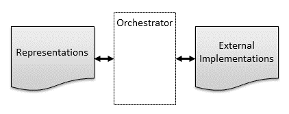
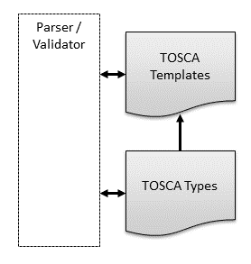
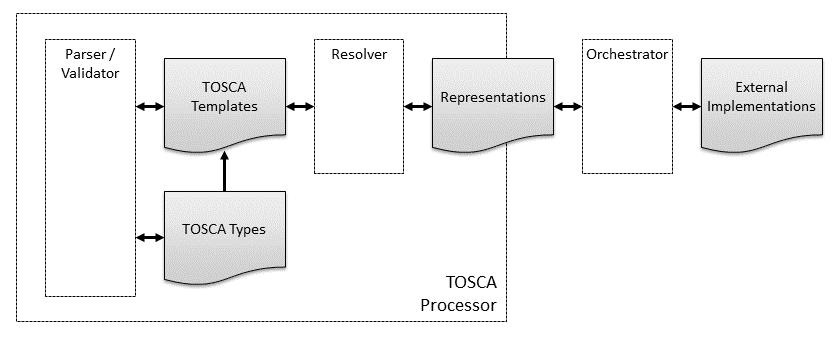

-------

# TOSCA Version 2.0

## Committee Specification Draft 07

## 18 September 2024

&nbsp;

#### This stage:

https://docs.oasis-open.org/tosca/TOSCA/v2.0/csd06/TOSCA-v2.0-csd06.md (Authoritative) \
https://docs.oasis-open.org/tosca/TOSCA/v2.0/csd06/TOSCA-v2.0-csd06.html \
https://docs.oasis-open.org/tosca/TOSCA/v2.0/csd06/TOSCA-v2.0-csd06.pdf

#### Previous stage:

https://docs.oasis-open.org/tosca/TOSCA/v2.0/csd05/TOSCA-v2.0-csd05.docx (Authoritative) \
https://docs.oasis-open.org/tosca/TOSCA/v2.0/csd05/TOSCA-v2.0-csd05.html \
https://docs.oasis-open.org/tosca/TOSCA/v2.0/csd05/TOSCA-v2.0-csd05.pdf

#### Latest stage:

https://docs.oasis-open.org/tosca/TOSCA/v2.0/TOSCA-v2.0.md (Authoritative) \
https://docs.oasis-open.org/tosca/TOSCA/v2.0/TOSCA-v2.0.html \
https://docs.oasis-open.org/tosca/TOSCA/v2.0/TOSCA-v2.0.pdf

#### Technical Committee:

[OASIS Topology and Orchestration Specification for Cloud Applications (TOSCA) TC](https://groups.oasis-open.org/communities/tc-community-home2?CommunityKey=f9412cf3-297d-4642-8598-018dc7d3f409)

#### Chair:

Chris Lauwers (lauwers@ubicity.com), Individual Member

#### Editors:

Chris Lauwers (lauwers@ubicity.com), Individual Member \
Calin Curescu (calin.curescu@ericsson.com), [Ericsson](http://ericsson.com/)

#### Related work:

This specification replaces or supersedes:
* _Topology and Orchestration Specification for Cloud Applications Version 1.0._ Edited by Derek Palma and Thomas Spatzier. OASIS Standard. Latest version: http://docs.oasis-open.org/tosca/TOSCA/v1.0/TOSCA-v1.0.html.
* _TOSCA Simple Profile in YAML Version 1.3._ Edited by Matt Rutkowski, Chris Lauwers, Claude Noshpitz, and Calin Curescu. Latest stage: https://docs.oasis-open.org/tosca/TOSCA-Simple-Profile-YAML/v1.3/TOSCA-Simple-Profile-YAML-v1.3.html.

This specification is related to:
* _Introduction to TOSCA Version 2.0._ Edited by Chris Lauwers and Calin Curescu. Work in progress.

#### Abstract:

The Topology and Orchestration Specification for Cloud Applications (TOSCA) provides a language for describing application components and their relationships by means of a service topology, and for specifying the lifecycle management procedures for creation or modification of services using orchestration processes. The combination of topology and orchestration enables not only the automation of deployment but also the automation of the complete service lifecycle management. The TOSCA specification promotes a model-driven approach, whereby information embedded in the model structure (the dependencies, connections, compositions) drives the automated processes.

#### Status:

This document was last revised or approved by the OASIS Topology and Orchestration Specification for Cloud Applications (TOSCA) TC on the above date. The level of approval is also listed above. Check the "Latest stage" location noted above for possible later revisions of this document. Any other numbered Versions and other technical work produced by the Technical Committee (TC) are listed at https://groups.oasis-open.org/communities/tc-community-home2?CommunityKey=f9412cf3-297d-4642-8598-018dc7d3f409#technical.

TC members should send comments on this specification to the TC's email list. Any individual may submit comments to the TC by sending email to Technical-Committee-Comments@oasis-open.org. Please use a Subject line like "Comment on TOSCA".

This specification is provided under the [RF on Limited Terms](https://www.oasis-open.org/policies-guidelines/ipr/#RF-on-Limited-Mode) of the [OASIS IPR Policy](https://www.oasis-open.org/policies-guidelines/ipr/), the mode chosen when the Technical Committee was established. For information on whether any patents have been disclosed that may be essential to implementing this specification, and any offers of patent licensing terms, please refer to the Intellectual Property Rights section of the TC's web page (https://www.oasis-open.org/committees/tosca/ipr.php).

Note that any machine-readable content ([Computer Language Definitions](https://www.oasis-open.org/policies-guidelines/tc-process-2017-05-26/#wpComponentsCompLang)) declared Normative for this Work Product is provided in separate plain text files. In the event of a discrepancy between any such plain text file and display content in the Work Product's prose narrative document(s), the content in the separate plain text file prevails.

#### Key words:

The key words "MUST", "MUST NOT", "REQUIRED", "SHALL", "SHALL NOT", "SHOULD", "SHOULD NOT", "RECOMMENDED", "NOT RECOMMENDED", "MAY", and "OPTIONAL" in this document are to be interpreted as described in BCP 14 [[RFC2119](#rfc2119)] and [[RFC8174](#rfc8174)] when, and only when, they appear in all capitals, as shown here.

#### Citation format:

When referencing this specification the following citation format should be used:

**[TOSCA-v2.0]**

_TOSCA Version 2.0_.
Edited by Chris Lauwers and Calin Curescu.
20 June 2024.
OASIS Committee Specification Draft 06.
https://docs.oasis-open.org/tosca/TOSCA/v2.0/csd06/TOSCA-v2.0-csd06.html.
Latest stage: https://docs.oasis-open.org/tosca/TOSCA/v2.0/TOSCA-v2.0.html.

#### Notices

Copyright &copy; OASIS Open 2024. All Rights Reserved.

Distributed under the terms of the OASIS [IPR Policy](https://www.oasis-open.org/policies-guidelines/ipr/).

The name "OASIS" is a trademark of [OASIS](https://www.oasis-open.org/), the owner and developer of this specification, and should be used only to refer to the organization and its official outputs.

For complete copyright information please see the full Notices section in [Appendix E](#appendix-e-notices) .

-------

# Table of Contents

> Provide later
[[TOC will be inserted here]]

-------

# 1 Introduction <a name=introduction></a>
The Topology and Orchestration Specification for Cloud Applications
(TOSCA) provides a language for describing components and
their relationships by means of a service topology, and for specifying
the lifecycle management procedures for creation or modification of
services using orchestration processes. The combination of topology
and orchestration enables not only the automation of deployment but
also the automation of the complete service lifecycle management. The
TOSCA specification promotes a model-driven approach, whereby
information embedded in the model structure (the dependencies,
connections, compositions) drives the automated processes.

The content in this section is non-normative.

## 1.1 Changes from Earlier Versions <a name=changes-from-earlier-versions></a>

This version of the specification includes significant changes from
TOSCA 1.3. In particular:

1. TOSCA v2.0 removes the *Simple Profile* type definitions from the
   standard. These type definitions are now managed as an open source
   project in the
   [tosca-community-contributions](https://github.com/oasis-open/tosca-community-contributions)
   github repository.
2. Rather than bundling Profiles with the TOSCA standard, TOSCA v2.0
   provides support for user-defined domain-specific profiles as follows:
   - It allows collections of type definitions to be bundled together
     into named profiles.
   - It supports importing profiles using their profile name.
3. TOSCA v2.0 formalizes support for in-life operation of a running
   service.
   - It formalizes the role of a representation model and clarifies
     how to create representation models from service templates.
   - It documents how to create multiple node representations from the
     same node template and multiple relationships from the same
     requirement assignment.
   - It defines an operational model that provides guidance for
     updating and/or upgrading a running service and for responding to
     notifications about state changes or errors.
4. TOSCA v2.0 introduces a new TOSCA Path syntax that allows a defined
   traversal of an arbitrary graph of nodes and relationships to an
   attribute or property.
5. TOSCA v2.0 significantly enhances support for functions. It
   formalizes function syntax, it extends the set of built-in
   functions, and it introduces support for user-defined custom
   functions.
6. TOSCA v2.0 harmonizes constraint syntax, filter syntax, and
   condition syntax using boolean functions. 
7. TOSCA v2.0 addresses shortcomings of the v1.3 substitution mapping
   grammar.
8. TOSCA v2.0 simplifies and extends the CSAR file format.
9. TOSCA v2.0 includes a broad set of syntax clarifications,
   including but not limited to:
   - The service template is renamed TOSCA file and service template
     is redefined.
   - Grammar for relationship types, requirement definitions, and
     requirement assignments has been extended and clarified.
   - Short notation for entry_schema and key_schema has been
     documented

## 1.2 Document Conventions <a name=document-conventions></a>

### 1.2.1 Specification Conventions

#### 1.2.1.1 Code Snippets

Within this document we use monospace font to denote code snippets, primarily
for TOSCA (YAML), but also for other textual file formats (e.g. CSAR meta
files). For example:

```yaml
MyMap:
  property1: value
  property2: [ value1, value2 ]
```

#### 1.2.1.2 Placeholders

Within this document we use angle brackets (`<...>`) with snake case names to
denote placeholders: values that must be provided by service template and
profile authors. These are used both in the explanatory language of the specification
as well as in the TOSCA (YAML) examples in monospace font. We use snake case in
order to avoid spaces that could introduce rendering problems due to malformed code
(e.g. YAML) parsing.

The names in the angular brackets are a brief description of the value and
sometimes also hint at the type of value when appropriate and helpful. Examples:
`<relationship_template_name>`, `<node_filter_definition>`, `<directives_list>`.

Note that if you copy a TOSCA code snippet that includes this notation you must
replace the placeholders with your own content.

Also note that while some placeholders are for specific primitive types (e.g.
strings, numbers, booleans), some may allow for complex values (sequences and
maps), and indeed allow for nested complex values. Refer to the explanations
for details.

Variations:

* `<option_1> | <option_2>`: placeholder for one of several options.
  There can be multiple pipes `|` if more than two options are possible. Note
  that you should not use `|` in your value: pick just one option from those
  specified. Example:
  `<node_template_name> | <tuple_of_node_template_and_index> | <node_type_name>`.
* `[<snake_case>, ...]`: placeholder for a sequence (list) of placeholders
  of the same kind. Note that in some cases this may mean "one or more", but in
  some some cases an empty list is also possible. See the explanatory text for
  rules. Note that elements may have more than one option, noted with a `|`
  as above. Example: `[<option_1> | <option_2>, ...]`
* `<snake_case_1> ... <snake_case_n>`: alternate notation for sequences. <!-- TODO: remove these? -->
* `<snake_case_*>`: alternate notation for sequences, used for brevity.  <!-- TODO: remove these? -->

### 1.2.2 TOSCA Naming Conventions

In the TOSCA examples included in this specification we adhere to a few
conventions.

Note that TOSCA parser should not normally enforce these conventions and you are
generally free to use other conventions in your service templates and profiles.
However, we encourage authors to adopt our conventions if possible in order to
encourage consistent readability within the TOSCA ecosystem.

* *TOSCA keynames*: snake case. Future versions of TOSCA, as well as forked
  variants, will continue this convention when introducing new keynames.
  Examples: `service_template`, `node_filter`, `valid_relationship_types`.
* *TOSCA value names*: dash case (also called kebab case). This includes names of
  properties, attributes, inputs, operations, capabilities, relationships, etc.
  Dash case is preferred in order to differentiate these names from keynames.
  Examples: `max-bandwidth`, `repository-url`, `deployment-host`,
  `connection-pool-size`.                                                                 <!-- TODO: controversial, will require editing all our examples -->
* *TOSCA entity type names*: camel case. This includes all TOSCA entity types:
  nodes, relationships, capabilities, artifacts, data, etc. Examples: `Server`,
  `BlockStorage`, `OperatingSystem`, `VirtualLink`. *All* words in the name should
  be capitalized, *including prepositions*. Examples: `AddressAndPort`
  `NetworkOrFile`. Acronyms and abbreviations should be treated as words, *except*
  when the name is just a single acronym. Examples: `HttpEndpoint`, `TcpOrUdp`,
  `TCP`, `DBMS`.
* *TOSCA relationship type names*: prefer fragments that appear between nouns,
  which usually are verbs in present simple form and may include a preposition.
  Examples: `Includes`, `Rejects`, `DependsOn`, `LinksTo`, `RunAt`, `FromSource`.
* *TOSCA capability type names*: these are commonly -able adjectives or other
  typifying, characterizing, or modifying words. Examples: `Bindable`, `Linkable`,
  `Scalable`, `Host`, `DataSource`, 
* *TOSCA primitive type names*: we prefer single lower-case whole words: `string`,
  `integer`, `float`, `boolean`. Note that previous versions of TOSCA also had types
  with the `scalar-unit.` prefix, however we now prefer to to use single lower-case
  words for these. See [scalar-unit](#scalar-unit) for more examples.
* *TOSCA function names*: snake case. This includes the built-in functions as well
  as custom functions. Examples: `$greater_than`, `$has_any_key`,
  `$my_custom_function`.

## 1.3 Glossary <a name=glossary></a>

### 1.3.1 Definitions of Terms <a name=definitions-of-terms></a>
The following terms are used throughout this specification and have
the following definitions when used in context of this document.

|Term|Definition|
|---|---|
|External implementation|An external implementation is a *component* in the real world that can be used or managed by an Orchestrator. External implementations can consist of physical resources deployed in the real world as well as logical or virtual components provisioned or configured on those resources.|
|System|A *collection* of one or more external implementations that is designed to work together to deliver a specific mission.|
|Service|A system that can be deployed, provisioned, or configured *on-demand* by an Orchestrator.|
|Topology|A topology defines the *structure* of a system. Topologies define the external implementations that make up the system as well as the interactions or other dependencies between these components.|
|Representation|A representation is a *model* maintained by an Orchestrator that represents external implementations. Representations capture those aspects of external implementations that are relevant for management purposes.|
|Service representation|A model that represents a *system* of one or more external implementations. Service representations model the topology of systems as *directed graphs* that consist of node representations and relationship representations.|
|Node representation|Node representations are the *vertices* in a service representation graph. They represent external implementations.|
|Relationship representation|Relationship representations are the *edges* in a service representation graph. They represent the interactions or other dependencies between the external implementations in a system.|
|Template|Templates are *blueprints* that capture the design of external implementations. Representations are created from templates.|
|Service template|A template that captures the design of a entire system or service. Service templates consist of node templates from which node representations can be created. Node templates can include requirements (and associated relationship templates) from which relationship representations can be created. Service templates can also define the actions required to create or configure external implementations based on these node and relationship representations.|
|Node template|A template that captures the design of an individual component. Node templates define values for the configurable properties of components, specify observable runtime state, and define requirements and capabilities that specify how components interact. Node representations are created from node templates.|
|Relationship template|A template that captures the design of *interactions* between components. Relationship representations are created from relationship templates.|

### 1.3.2 Acronyms and Abbreviations <a name=acronyms-and-abbreviations></a>
Defined in this document
- TOSCA Topology and Orchestration Specification for Cloud Applications
- CSAR  Cloud Service Archive A file format defined by OASIS TOSCA to contain TOSCA files

Used by this specification
- YAML  Yet Another Markup Language The Language TOSCA uses for files
- MACD  Moves, Adds, Changes, and Deletions
- DSL  Domain Specific Language

Used as examples
- DBMS  Database Management System
- EJB Enterprise Java Beans
- SD-WAN Software Defined Wide Area Network
- SQL Structured Query Language
- TAR Tape Archive A file format originally used in unix
- VPN Virtual Private Network
- USD United States Dollar
-------
# 2 TOSCA Overview <a name=tosca-overview></a>

The *Topology and Orchestration Specification for Cloud Applications*
(TOSCA) is a *domain-specific language* (DSL) for automating
*Lifecycle Management* of large complex systems.

The TOSCA language allows service designers to describe system
components and their relationships by means of a service topology, and
to specify the lifecycle management procedures for the creation and
modification of services using orchestration processes. The
combination of *topology* and *orchestration* enables not only the
automation of deployment but also the automation of the complete
service lifecycle management (including scaling, patching, upgrading,
monitoring, etc.).

The content in this section is non-normative.

## 2.1 Objectives <a name=objectives></a>

Large systems such a cloud applications, telecommunications networks,
and software services are becoming increasingly more difficult to
manage. This challenge is the result of a recent technology trends
such as the adoption of cloud-native architectures that build systems
as collections of microservices, the disaggregation of large hardware
appliances, the decoupling of hardware and software, and the adoption
of edge deployments that move application functionality closer to the
end-user.

As a result of the above technology trends, large systems typically
involve a wide variety of technologies and include components from
multiple vendors. This results in management systems based on
vendor-specific tools, dedicated component management systems, and
special-purpose controllers, each of which manages only a small subset
of the system. To make matters worse, these tools often use
incompatible interfaces or data schemas, resulting in integration
nightmares. As the number of components grows—because the scale of the
system increases and disaggregation becomes the norm—so will the
number of required management tools.

Management of such systems can be greatly simplified if the creation
and lifecycle management of application, infrastructure, and network
services can be fully automated and supported across a variety of
deployment environments. TOSCA was expressly designed to address the
complexity associated with managing large systems by providing a
language for specifying an information model and automating the
lifecycle management of large complex systems. The goal of TOSCA is
to define a language that is agnostic to specific technological and
commercial ecosystems and that supports the design and operation of
large systems without being tied to specific technologies or specific
vendors. This enables a uniform management approach that can be used
for all parts of the system and can integrate components across all
layers of the technology stack.

The capabilities offered by TOSCA will facilitate higher service
continuity, reduce service disruption and manual mitigation, increase
interoperability, avoid lock-in, and achieve the intended
orchestration. Ultimately, this will benefit the consumers,
developers, and providers of more and more complex and heterogeneous
networks, systems, and cloud-native applications.

## 2.2 TOSCA Features and Benefits <a name=tosca-features-and-benefits></a>

### 2.2.1 TOSCA is Model-Driven <a name=tosca-is-model-driven></a>

The TOSCA specification promotes a *model-driven management* approach,
whereby TOSCA processors maintain service models (*digital twins*) for
all system components under management. In a model-driven approach,
all management actions are performed on service models first and then
propagated to the external real-world entities by the management
system. Similarly, changes to external resources are reflected into
models first and then handled by management system.

TOSCA's model-driven management approach is what enables its use for
all Lifecycle Management Phases: information embedded in the model
structure (the dependencies, connections, compositions) drives the
automated processes. Specifically, it allows service models to be used:

- As desired state for Moves, Adds, Changes, and Deletions (MACDs)
- As context for handling faults and events using Closed Loop
  Automation

In addition, changing or augmenting the model also 
automatically adapts the LCM / orchestration behavior.
Without the context provided by service models, lifecycle management
cannot be fully automated.

### 2.2.2 TOSCA Models are Graphs <a name=tosca-models-are-graphs></a>

TOSCA models systems as graphs, where the vertices represent the
components of the system and the edges represents relationships,
dependencies, and other interactions between these components.

The use of graphs enables *declarative* orchestration, where system
designers can simply create descriptions ("models") of their systems,
and delegate to the orchestrator the task of translating these
descriptions into the commands required to realize the systems being
described. The use of graphs enables this as follows:

- Relationships in a TOSCA graph encode dependencies that allow an
  orchestrator to automatically determine the *sequencing* between the
  management operations on invoked on various components in the system,
  thereby avoiding the need for human-defined workflows. Implementing
  lifecycle or other management operations on the service can be
  achieved by traversing the graph.
- Relationships in a TOSCA graph allow an orchestrator to
  automatically determine which system components may be affected by a
  component failure or by a change to an external resource. The
  orchestrator can then determine corrective actions that restore the
  system as a whole to its nominal state, rather than just fixing
  individual components.

Declarative management is often also referred to as *desired state* or
*intent-based* orchestration.

### 2.2.3 TOSCA Promotes Reuse and Modularity <a name=tosca-promotes-reuse-and-modularity></a>

TOSCA models are based on *service templates* that are created by
service designers. Service templates consist of node templates and
relationship templates that have associated node types and relationship
types. Types in TOSCA represent reusable components that can be used as
building blocks from which services are constructed, thereby
promoting modularity and reuse.

In addition, TOSCA allows modular designs whereby service templates
describe only parts of a system rather than a complete end-to-end
system definition. Composition of partial system descriptions into
complete system models can be done by an orchestrator at deployment
time. This enables automation of placement decisions, resource
allocation, and system integration.

TOSCA's modularity features allow some service design decisions to be
made by an orchestrator at deployment time rather than by a service
designer at service design time.
TOSCA also allows for the definition of abstract components that hide
technology and vendor-specific implementation details, via mechanisms 
such as derivation of types and substitution of nodes. The choice of
how to *implement* abstract components can be left to the orchestrator
at deployment time. This further increases the value of TOSCA as a
technology and vendor-neutral technology language orchestration. TOSCA supports the use of *policies*
to guide the service design decisions made by orchestrators at deployment time.

### 2.2.4 TOSCA is Domain-Independent <a name=tosca-is-domain-independent></a>

Since the fundamental abstraction defined by the TOSCA language is a
*graph*, TOSCA is not tied to any specific application domain. For example, 
TOSCA can be used to specify automated lifecycle management of the following:

- Infrastructure-as-a-Service Clouds: automate the deployment and
  management of workloads in IaaS clouds such as OpenStack, Amazon Web
  Services, Microsoft Azure, Google Cloud, and others.
- Cloud-Native Applications: deploy containerized applications,
  micro-services, and service meshes, for example by interfacing to
  orchestration platforms such as Kubernetes.
- Network Function Virtualization: define the management of Virtual
  Network Functions and their composition into complex network services.
- Software Defined Networking: support on-demand creation of network
  services (for example SD-WAN).
- Functions-as-a-Service: define software applications without
  any deployment or operational considerations.
- IoT and Edge computing: deploy many very similar copies of a service at the network edge.
- Process Automation: support open and interoperable process control
  architectures.

This list is by no means intended to be exhaustive and only serves to
demonstrate the breadth of application domains that can benefit from
TOSCA’s automated lifecycle management capabilities.

## 2.3 TOSCA Core Concepts <a name=tosca-core-concepts></a>

As stated above, the TOSCA language assumes a *model-driven*
management paradigm. Using model-driven management, a model
representing the managed external components is maintained and all
management operations are performed on this model first and any
resulting changes to the model are then propagated to the external
components. Similarly, any status changes or errors experienced by the
external components are reflected in the model first before they are
handled by the management system. The model maintained by the
management system must capture all aspects of the external components
that are relevant for the purpose of managing those components.

External components under management can consist of physical resources
deployed in the real world as well as logical or virtual components
provisioned or configured on those resources. In the context of TOSCA,
we will refer to the physical or virtual components under management
as **external implementations**, and we will refer to the models as
**representations**. Note that the TOSCA language does not standardize
any object models or schemas for representations. It presumes the
existence of such models, but the model details are implementation
specific.

A model-driven management system must include a component that is
responsible for keeping the *representations* and the *external
implementations* synchronized. In the context of this specification, we
will refer to this component as the **orchestrator**. An orchestrator
may perform this synchronization task based on workflows, policies, or
other mechanisms that are defined using statements expressed in the
TOSCA language, in which case we will refer to the component as a
**TOSCA orchestrator**. Alternatively, an orchestrator may also
perform this task based on domain-specific knowledge that is built-in
to the orchestrator rather than being defined using TOSCA. This
specification allows for either approach.

The following diagram shows how external implementations are modeled
using representations, and how the Orchestrator synchronizes the two.

**Figure 1: Representations and Implementations**



TOSCA representations don't just track individual components and their
management aspects; they also capture how the various components
interact, with the goal of providing complete system
functionality. TOSCA accomplishes this by modeling the *topology* of
systems as *graphs* where nodes in the graph represent the components
under management and vertices in the graph represent containment,
dependencies, interactions, or other relationships between these
components. In this specification, we use the term **service
representation** to refer to a graph that models the topology of an
entire system or subsystem, and we use the terms **node
representation** and **relationship representation** respectively to
model the nodes and vertices in a service representation graph.

Information about how node and relationship representations are
organized in service representation graphs is captured in designs (a.k.a
blueprints) that are created by service designers and expressed in the
TOSCA language. In this specification, we refer to those designs as
**service templates** and we use the term **resolver** to refer to the
management component that *instantiates* service representations based
on *service templates*. TOSCA *service templates* define service
elements and their relationships which results in the *service
representations* to be created as graphs. Service templates consist of
**node templates** from which node representations are created, and
**relationship templates** from which relationship representations are
created. Note that while TOSCA does not standardize representations,
it does standardize the grammar for defining templates.

The use of templates supports reuse of service designs while at the
same time allowing for service-specific variability. Specifically,
node templates and relationship templates can use **TOSCA functions**
to specify that configuration values need to be provided as **template inputs** 
to each deployment, or that configuration values need to be retrieved at
deployment time from other node or relationship representations in the
service representation graph. At deployment time, TOSCA resolvers
evaluate these functions to generate the values to be used when
creating new service representations. TOSCA also includes grammar for
creating multiple node representations from the same node template and
for creating multiple relationship representations from the same
relationship template. TOSCA supports modular designs where different
deployments can combine sub-system representations created from
different service templates into deployment-specific system
representations.

The following diagram shows how representations are created
from templates by a resolver:

**Figure 2: TOSCA Templates and Representations**


To allow for *design-time validation* of service templates, all TOSCA
templates defined by those service templates have associated **TOSCA
types**. TOSCA types define *schemas* and *constraints* with which
TOSCA templates have to comply. For example, a *TOSCA node type*
defines configurable properties that must be provided for the
associated component, it defines the runtime attributes that are
expected to be available for the component, and it specifies allowed
and required interactions with other components. A TOSCA-based
management system must include a **TOSCA parser/validator** that checks if
the templates used in a TOSCA file are valid for the types
with which they are associated. This allows many kinds of errors to
be flagged at service *design time* rather than at service *deployment
time*.  The following diagram shows how templates are created from and
validated against TOSCA type definitions:

**Figure 3: TOSCA Types and TOSCA Templates**



The use of types in TOSCA also provides the additional benefits of
abstraction, information hiding, and reuse. TOSCA types can be
organized in a *type hierarchy* where one or more type definitions 
can inherit from another type, each derived type may then be refined. 
This promotes reuse. The base type may be more generic and the derived types 
may be more concrete which promotes abstraction. **TOSCA node types**
and **TOSCA relationship types** define an externally visible
*management façade* for entities of that type while hiding internal
implementation details. This management façade defines interfaces that
can be used by an orchestrator to interact with the external
implementations represented by the entity. When node types and
relationship types are packaged together with internal implementation
artifacts for their interfaces, they become *reusable building blocks*
that can greatly facilitate the creation of end-to-end services. TOSCA
types that define such reusable building blocks are typically
organized in domain-specific **TOSCA profiles**.

The following figure summarizes the various concepts introduced in
this section. When a TOSCA implementation implements multiple TOSCA
processing modules such as parsing, validating, and resolving, such an
implementation is commonly referred to as a **TOSCA processor**.

**Figure 4: Summary of Core TOSCA Concepts**



Note that this diagram is only intended to highlight concepts used in
this specification, not to suggest software architectures or
implementations. Nor is this diagram intended to be comprehensive or
exclusive. Other kinds of processors and modules may qualify as
implementations of TOSCA, for example:

- TOSCA translator: A tool that translates TOSCA files into documents
  that use another language, such as Kubernetes Helm charts or Amazon
  CloudFormation templates.
- TOSCA template generator: A tool that generates a TOSCA file. An
  example of generator is a modeling tool capable of generating or
  editing a system design expressed using TOSCA.

## 2.4 Using TOSCA <a name=using-tosca></a>

### 2.4.1 TOSCA Files <a name=tosca-files></a>
TOSCA files are files describing TOSCA service templates, TOSCA types,
or a combination thereof.

### 2.4.2 Archive Format for Cloud Applications <a name=archive-format-for-cloud-applications></a>

In order to support in a certain environment the execution and
management of the lifecycle of a cloud application, all corresponding
artifacts have to be available in that environment. This means that
beside the TOSCA file of the cloud application, the deployment
artifacts and implementation artifacts have to be available in that
environment. To ease the task of ensuring the availability of all of
these, this specification defines a corresponding archive format called
CSAR (Cloud Service ARchive).

A CSAR is a container file, i.e. it contains multiple files of possibly
different file types. These files are typically organized in several
subdirectories, each of which contains related files (and possibly other
subdirectories etc.). The organization into subdirectories and their
content is specific for a particular cloud application. CSARs are zip or tar
files, typically compressed. A CSAR may contain a file called TOSCA.meta
that describes the organization of the CSAR.

-------
# 3 TOSCA Language Abstractions <a name=tosca-language-abstractions></a>

The TOSCA language introduces a YAML-based grammar for automating the
lifecycle management of application, infrastructure, and network
services. The language defines a *metamodel* for specifying both the
structure of a service as well as its management aspects. Using TOSCA
statements expressed in a TOSCA file, service designers create a
*service template* that defines the *structure* of a
service. *Interfaces, operations, and workflows* define how service
elements can be created and terminated as well as how they can be
managed during their whole lifetimes. Policies specify operational
behavior of the service such as quality-of-service objectives,
performance objectives, and security constraints, and allow for
closed-loop automation.

The content in this section is non-normative.

## 3.1 Service Templates, Node Templates, and Relationship Templates <a name=service-templates,-node-templates,-and-relationship-templates></a>

Within a TOSCA file, a **service template** defines the topology model
of a service as a directed graph. Each node in this graph is
represented by a **node template**. A node template specifies the
presence of an entity of a specific **node type** as a component of a
service. A node type defines the semantics of such a component,
including the configurable properties of the component (via **property
definitions**), its runtime state (via **attribute definitions**) and
the operations (via **interface definitions**) available to manipulate
the component. In a service template, a node template assigns values to
the properties defined in the corresponding node type. An orchestrator updates
attribute values as a result of performing lifecycle management
operations or in response to notifications about changes in component state.

For example, consider a service that consists of an some computing application, a database and some computing resource to run them on. A service template
defining that service would include one node template of the node type for the particular software application, another node template of node type *database management system* or a more specific derivative (MariaDB,perhaps), and a third node template of node type *compute* or more likely a more specific derivative. The
DBMS node type defines properties like the IP address of
an instance of this type, an operation for installing the database application with the corresponding IP address, and an operation for
shutting down an instance of this DBMS. A constraint in
the node template can specify a range of IP addresses available when
making a concrete application server available.

Node templates may include one or more **relationship templates** to
other node templates in the service template. These relationship
templates represent the edges in the service topology graph and model
dependencies and other interactions between components. Note that in this specification, relationship templates are more
frequently referred to as **requirements** for reasons that will be
explained below. Relationship
templates in TOSCA are unidirectional: the node template that includes
the relationship template is implicitly defined as the **source node**
of that relationship template and the relationship template explicitly
specifies its **target node**.  Each relationship template refers to a
**relationship type** that defines the semantics of the
relationship. Just like node types, relationship types define
properties, attributes, and interfaces. Node types and relationship
types are typically defined separately for reuse purposes and
organized into profiles.

In the example above, a relationship can be established from the application
server node template to the database node template with the
meaning *depends on*, and from both the application and DBMS node templates to the
compute node template with meaning *deployed on*.

## 3.2 Requirements and Capabilities <a name=requirements-and-capabilities></a>

We discussed earlier how relationship templates are used to link node
templates together into a service topology graph. However, it may not
always be possible to define all node templates for a given service
topology within a single service template. For example, modular design
practices may dictate that different service sub-components be modelled
using separate service templates. This may result in relationships
across multiple service
templates. Additionally, relationships may need to target components
that already exist and do not need to be instantiated by an
orchestrator. For example, relationships may reference physical
resources that are managed in a resource inventory. Service templates
may not include node templates for these resources.

TOSCA accommodates both service template internal and external relationships using **requirements** and
**capabilities** of node templates. 
Requirements express that a component 
depends on a feature provided by another component, or that the
component has certain requirements against the hosting environment
such as for the allocation of certain resources or the enablement of a
specific mode of operation. Capabilities represent features exposed by
components that can be targeted by requirements of other
components. A requirement defined in one node
template is fulfilled by establishing a relationship to a corresponding capability defined in a second node template.
If a requirement explicitly specifies a target node
template defined in the same service template, it acts as a
[relationship template](#relationship-template). A
requirement that does not explicitly specify a target node template is referred
to as a **dangling requirement**. For simplicity, this specification
uses the term *requirement* for both relationship templates
and dangling requirements.

All mandatory dangling requirements must be fulfilled by the TOSCA processor at
service deployment time. While dangling requirements are defined in
the context of *node templates*, fulfilling dangling requirements is
done in the context of *node representations*. This means that when
finding candidates for fulfilling a dangling requirement, the TOSCA
processor must consider node representations rather than the templates
from which these representations were created. When fulfilling requirements, 
template directives to the TOSCA processor can be used to specify if 
the target candidates are template-internal node representations, or
external representations created from multiple service templates, or
representations for external resources managed in an inventory. Thus, 
requirement fulfillment may result in relationships that are
established across service template boundaries.

Requirements and capabilities are modelled by annotating node types
with **requirement definitions** and **capability definitions**
respectively. Capability definitions themselves have associated
**capability types** that are defined as reusable entities so that
those definitions can be used in the context of several node
types. Just like node types and relationship types, capability types
can define properties and attributes. Requirement definitions are
effectively *relationship definitions* that specify the relationship
type that will be used when creating the relationship that fulfils
the requirement.

The following figure summarizes the various TOSCA abstractions used
for defining requirements and capabilities:

**Figure 5: Requirements and Capabilities**


## 3.3 Decomposition of Node Representations <a name=decomposition-of-node-representations></a>

TOSCA provides support for decomposing service components using its
**substitution mapping** feature. This feature allows for the
definition of *abstract* service designs that consist of generic components
that are largely independent of specific technologies or vendor
implementations. Technology or vendor-specific implementation details
can be defined for each generic component using *substituting*
service templates that describe the internals of that component. 

For example, a service template for a business application that is
hosted on an application server tier might focus on defining the
structure and manageability behavior of the business application
itself. The internals of the application server tier hosting the
application can be provided in a separate service template built by
another vendor specialized in deploying and managing application
servers. This approach enables separation of concerns as well as re-use of
common infrastructure templates.

**Figure 6: Node Decomposition**


From the point of view of a service template (e.g. the business
application service template from the example above) that uses another
service template, the other service template (e.g. the application
server tier) *looks* just like a node template. During deployment,
however, the node representation created from this node template can be *substituted* by a service created from the second service
template if it exposes the same external *façade* (i.e. properties,
capabilities, requirements, etc.) as the node for which it is
a substitution. Thus, a substitution by any service template that
has the same *facade* as the substituted node becomes possible, allowing for a hierarchical decomposition of
service representations. This concept also allows for providing
alternative substitutions that can be selected by a TOSCA processor
at service deployment time. For example there might exist two service templates, one for a
single node application server tier and another for a
clustered application server tier, and the appropriate
option can be selected on a deployment-by-deployment basis.

## 3.4 Interfaces, Operations, and Artifacts <a name=interfaces,-operations,-and-artifacts></a>

Both node types and relationship types may define lifecycle **operations**
that define the actions an orchestration engine can invoke when
instantiating a service from a service template or when managing a
deployed service. For example, a node type for some software product
might provide a `create` operation to handle the creation of an
instance of a component at runtime, or a `start` or `stop` operation
to allow an orchestration engine to start or stop the software component.

Operations that are related to the same management mission (e.g.
lifecycle management) are grouped together in **interface
definitions** in node and relationship types. Just like other TOSCA
entities, interfaces have a corresponding **interface type**
that defines the group of operations that are part of the
interface, the input parameters that are required by those operations,
and any output parameters returned by the operations. Interface types can also define **notifications** that
represent external events that are generated by the external
implementations and received by the orchestrator.

The implementations of interface operations can be provided as TOSCA
**artifacts**. An artifact represents the content needed to provide an
implementation for an interface operation. A TOSCA artifact could be
an executable (e.g. a script, an executable program, an image), a
configuration file or data file, or something that might be needed so
that another executable can run (e.g. a library). Artifacts can be of
different types, for example Ansible playbooks or python scripts. The
content of an artifact depends on its **artifact type**. Typically,
descriptive metadata (such as properties) will also be provided along
with the artifact. This metadata might be needed by an orchestrator to
properly process the artifact, for example by describing the
appropriate execution environment.

## 3.5 Workflows <a name=workflows></a>

A deployed service is an instance of a service template. More
precisely, a service is deployed by first creating a *service
representation* based on the *service template* describing the service
and then *orchestrating* the *external implementations* modelled by
those representations. If TOSCA orchestration is used, the external
implementations are created by running workflows that invoke interface
operations defined in the types of the nodes and relationships in the
representation graph. TOSCA workflows can often be generated
automatically by the orchestrator by using the relationships in the
service representation graph to determine the order in which external
implementations must be created. For example, during the instantiation
of a two-tier application that includes a web application that depends
on a database, an orchestration engine would first invoke the `create`
operation on the database component to install and configure the
database, and it would then invoke the `create` operation of the web
application to install and configure the application (which includes
configuration of the database connection).

Interface operations invoked by workflows must use actual values for
the various properties in the node templates and relationship
templates in the service template. These values are tracked in the
node representations and relationship representations in the service
representation graph. They can be provided as inputs passed in by
users as triggered by human interactions with the TOSCA
processor. Alternatively, the templates can specify default values for
some properties, or use TOSCA functions to retrieve those values from
other entities in the service representation graph.

For example, the application server node template will be instantiated
by installing an actual application server at a concrete IP address
considering the specified range of IP addresses. Next, the process
engine node template will be instantiated by installing a concrete
process engine on that application server (as indicated by the *hosted
on* relationship template). Finally, the process model node template
will be instantiated by deploying the process model on that process
engine (as indicated by the *deployed on* relationship template).

## 3.6 Policies <a name=policies></a>

Non-functional behavior or quality-of-services are defined in TOSCA by
means of **policies**. A policy can express such diverse things like
monitoring behavior, payment conditions, scalability, or continuous
availability, for example.

A node template can be associated with a set of policies collectively
expressing the non-functional behavior or quality-of-services that each
instance of the node template will expose. Each policy specifies the
actual properties of the non-functional behavior, like the concrete
payment information (payment period, currency, amount etc.) about the
individual instances of the node template.

These properties are defined by a **policy type**. Policy types might
be defined in hierarchies to properly reflect the structure of
non-functional behavior or quality-of-services in particular domains.
Furthermore, a policy type might be associated with a set of node
types the non-functional behavior or quality-of-service it describes.

**Policy templates** provide actual values of properties of the types
defined by policy types. For example, a policy template for monthly
payments for customers located in the USA will set the “payment period” property to
“monthly” and the “currency” property to “USD”, leaving the “amount”
property open. The “amount” property will be set when the
corresponding policy template is used for a policy within a node
template. Thus, a policy template defines the invariant properties of
a policy, while the policy sets the variant properties resulting from
the actual usage of a policy template in a node template.

-------
# 4 TOSCA Operational Model <a name=tosca-operational-model></a>

The content in this section is normative unless otherwise labeled except for:
  - the examples
  - references (unless they are labelled as normative)

TOSCA is designed to support all three phases of the service
lifecycle:

1.  **Day 0—Service Design**: Service designers use TOSCA to model
    services as topology graphs that consist of nodes and relationships.
    Nodes model the components of which a service is composed, and
    relationships model dependencies between these service components.
2.  **Day 1—Service Deployment**: TOSCA can also be used to define
    mechanisms for deploying TOSCA service topologies on external
    platforms.
3.  **Day 2—Service Management**: TOSCA can enable run-time management
    of services by providing support for updating and/or upgrading
    deployed services and by providing service assurance functionality.

This section presents a TOSCA *functional architecture* and an
associated *operational model* that supports the three service
lifecycle phases outlined above. Note that this functional
architecture is not intended to prescribe how TOSCA must be
implemented. Instead, it aims to provide users of TOSCA with a mental
model of how TOSCA implementations are expected to process TOSCA
files.

Note that it is not mandatory for compliant TOSCA implementations to four kinds of TOSCA abstractions defined in Section 2.4
support all three service lifecycle phases. Some implementations may
use TOSCA only for service design and delegate orchestration and
ongoing lifecycle management functionality to external (non-TOSCA)
orchestrators. Other implementations may decide to use TOSCA for all
three phases of the service lifecycle. However, a complete
architecture must anticipate all three lifecycle phases and must clearly distinguish between the different types of TOSCA abstractions introduced in the section [TOSCA language abstractions](#tosca-language-abstractions).

## 4.1 TOSCA Functional Architecture <a name=tosca-functional-architecture></a>

The following Figure shows the TOSCA functional architecture defined
in this section. It illustrates how the various TOSCA entities are
used by the different functional blocks and how they are related.

**Figure 7: TOSCA Functional Architecture**


The functional architecture defines the following three blocks:

1.  **TOSCA Processor**: This functional block defines functionality
    that must be provided by all TOSCA implementations. TOSCA processors
    convert TOSCA-based service definitions into service
    representations that can be processed by an Orchestrator.
2.  **Orchestrator**: This functional block creates external
    implementations on various resource platforms based on the service
    representations created by a TOSCA processor. The orchestration
    functionality can itself be defined using TOSCA or can be provided
    by external (non-TOSCA) orchestration platforms.
3.  **Platform**: In the context of a TOSCA architecture, platforms
    represent external cloud, networking, or other infrastructure
    resources on top of which service entities can be created.

The remainder of this section describes each of these functional blocks
in more detail.

## 4.2 TOSCA Processor <a name=tosca-processor></a>

At the core of a compliant TOSCA implementation is a TOSCA Processor
that can create service representations from TOSCA service templates. A
TOSCA Processor contains the following functional blocks:

### 4.2.1 Parser <a name=parser></a>

A TOSCA parser performs the following functions:

- Accepts a single TOSCA file plus imported TOSCA files (files without a
  `service_template`)
- Can (optionally) import these files from one or more repositories,
  either individually or as complete profiles
- Outputs valid normalized node templates. Note that normalized node
  templates may include unresolved (*dangling*) requirements.

### 4.2.2 Resolver <a name=resolver></a>

A resolver creates service representations based on normalized service
templates. It performs the following functions:

1. Creating Node Representations based on Normalized Node Templates.

   - Either one-to-one or one-to-many if multiplicity is involved.
   - Node templates with a `select` directive create a node in the
     local representation graph that is a reference to the selected
     node (from the local or a remote representation graph).
   - Node templates with a `substitute` directive create a node in the
     local representation graph that is associated to a remote
     representation graph created from the substitution template.
   - The resolver assigns values to node properties and attributes in
     node representations based on values or functions defined in the
     corresponding node templates.
   - Some property and attribute values cannot be initialized since
     they either depend on other uninitialized properties or
     attributes or need to access other node representations via
     relationships that have not been yet initialized.

2. Creating Relationships that Connect Node Representations

   - Some relationships can be created directly based on target node
     templates specified in node template requirements.
   - Other relationships are created by fulfilling dangling requirements
     - If a requirement uses a node_filter that refers to uninitialized properties
       or attributes, then the fulfillment of this requirement is postponed until
       all referred properties or attributes are initialized.
     - A circular dependency signifies a erroneous template and shall report an error
     - After a relationship is created, properties and attributes that depend on it
       to be initialized will be initialized.
   - At the end of this process all mandatory requirements must be
     satisfied and all relationships are added to the representation
     graph. An unsatisfied non-optional requirement results in an
     error.

3. Substitution Mapping

   - When substitution is directed for a node, the resolver creates a
     new service representation based on the substituting template,
     basically creating a service that represents the internals of the
     substituted node.
   - The substituting service is initialized from the properties of the substituted node
     and the workflows of the substituting service act as operations for the substituted
     node (that is, the behavior of the node is substituted by the substituting service).
   - This is defined via substitution mapping rules.

## 4.3 Orchestrator <a name=orchestrator></a>

An orchestrator performs the following actions:

- (Continuously) turns node representations into one or more node
  implementations
- (Continuously) updates node representation attribute values (error if
  they do not adhere to TOSCA type validation clauses or property
  definition validation clauses)
- (Continuously) reactivates the resolver: outputs may change
  attribute values, which can require refulfillment of dangling
  requirements or resubsitution of substituted nodes.
- (Optionally) changes the node representations themselves for day 2
  transformations.

## 4.4 Changes in the Representation Graph <a name=changes-in-the-representation-graph></a>

During the lifetime of a service there can be several actions or events that 
change the representation graph of the running service.

We can identify the several situations that mandate the change of the 
representation graph, for example:
- Update:
    - The service input values have changed and need to be re-evaluated while
      the service is running.
- Upgrade:
    - The service template has changed and needs to be re-evaluated while the
      service is running.
- Runtime failures:
    - Nodes or relationships in the representation graph have failed and need
      to be recreated or healed while the service is running.
- Change in dependencies
    - External nodes or relationships to external nodes have failed and new
      relationships to external nodes need to be created (i.e. external
      requirements need to be fulfilled again) while the service is running.
      
For the service to reach the new desired runtime state, operations that are 
associated with the creation, deletion, and modification of
nodes and relationships in the representation graph need to be performed.

We can visualize (and the orchestrator can perform) these restorative actions
via graph traversals on the "old" and "new" representation graph.

First let's categorize the nodes and relationships in the "old" and "new"
representation graphs in the following four categories:
- Unchanged: These are nodes and relationships that appear in both the
  "old" and "new" representation graphs and have the same property values.
  Given that a template can be upgraded, we correlate the same nodes and
  relationships via their symbolic node names and requirement names.
- Modified: These are nodes and relationships that appear in both the
  "old" and "new" representation graphs and have different property values.
- Obsolete: These are nodes and relationships that appear in the "old"
  representation graph but not in the "new" representation graph.
- Novel: These are nodes and relationships that do not appear in the "old"
  representation graph but appear in the "new" representation graph.

We then perform deletions of the obsolete nodes by traversing the
representation graph in reverse dependency order as follows:

- We start in parallel with all nodes that have no incoming dependency
  relationship
- we perform operations associated with deleting on all adjacent relationships
  to this node that are in the "obsolete" category.
- we perform operations associated with deleting on the node itself if it is
  in the "obsolete" category.
- we move to nodes that have no incoming dependency relationship to nodes that
  have not been processed yet.

After we have processed the deletion of the obsolete elements we traverse the "new" 
representation graph in dependency order to perform the modifications and creations:
- we start in parallel with the nodes that have no outgoing dependency relationship
- we perform operations associated with creation resp. modification on the node itself
  if it is in the "novel" resp. "modified" category
- we perform operations associated with creation resp. modification on all adjacent
  relationships in the "novel" resp. "modified" category if the node on the other
  side of the relationship has been processed.
- we move to nodes that have no outgoing dependency relationship to nodes that
  have not been processed yet.

After this we can consider the service to be in the new desired runtime state, and the
"old" representation graph can be discarded and the "new" representation graph becomes
the current representation graph of the service.

Note that this graph traversal behavior should be associated with the relevant
interface types that are defined in a TOSCA profile, where it should be specified 
which relationship types form the dependency relationships, which operation(s)
are associated with the deletion, modification, and creation of the nodes and 
relationships when the representation graph changes.

-------
# 5 TOSCA Grammar Overview <a name=tosca-grammar-overview></a>
The content in this section is normative unless otherwise labeled except for:
  - the examples
  - references (unless they are labelled as normative)

## 5.1 TOSCA Modeling Concepts <a name=tosca-modeling-concepts></a>

This section defines concepts used in support of the modeling
functionality of the TOSCA Version 2.0 specification. Specifically, it
introduces grammar for defining TOSCA types and templates as defined
in [the Chapter TOSCA Core Concepts](#tosca-core-concepts), it introduces the concepts of
entity definitions and entity assignments, and presents rules for type
derivation and entity refinement.

### 5.1.1 Type Definitions and Entity Definitions <a name=type-definitions-and-entity-definitions></a>

TOSCA **templates** are defined in TOSCA files and expressed using statements in the TOSCA
language. All TOSCA templates are *typed* using TOSCA types that are also
defined in TOSCA files and expressed in the TOSCA language. Not only do types
promote reuse, they also simplify the design of TOSCA templates by allowing
relevant TOSCA entities to use and/or modify definitions already specified in
the types.

TOSCA **type definitions** consist of pairs of keynames and associated values
that specify information relevant to the type. While all TOSCA types
share a number of common keynames, each type definition has its own set of keynames
with their own syntax and semantics. TOSCA supports *node types*,
*relationship types*, *capability types*, *interface types*, *artifact
types*, *policy types*, *group types*, and *data types*.

Some keynames in TOSCA type definitions are used to specify TOSCA **entity
definitions** that *declare* the presence of those entities in the
context of the type being defined. For example, most TOSCA type definitions include
*property definitions* and *attribute definitions*. Node types and
relationship types also include *interface definitions*, and node
types have *requirement definitions* and *capability definitions*.
Interface types can include *parameter definitions* that specify
required inputs and expected outputs for interface operations and notifications.

Just like type definitions, entity definitions consist of pairs of
keynames and values. Each entity definition has it own syntax,
semantics and set of keynames, but all entity definitions share a
`type` keyname that references the TOSCA type of the entity being
defined. Other keynames in entity definitions are used to further
define or refine definitions already specified in the
corresponding entity type. TOSCA supports *capability definitions*,
*requirement definitions*, *interface definitions*, *policy
definitions*, *group definitions*, *property definitions*, *attribute
definitions*, and *parameter definitions*.

### 5.1.2 Templates and Entity Assignments <a name=templates-and-entity-assignments></a>

The service templates introduced in the [section on Reuse and Modularity](#tosca-promotes-reuse-and-modularity) are defined in TOSCA files and expressed using
statements in the TOSCA language. Service templates define directed graphs
that consist of *node templates* and *requirements*. Node
templates specify a node type used for the template and then add additional information using 
pairs of keynames and associated values. Service templates may include other
templates as well such as relationship templates, groups, policies
etc.

Node types specified in node templates will typically include definition of entities, many node templates will use keynames to specify additional
information for those entity definitions. Such information is referred to as an **entity assignment**.  In general for
each entity definition in the type of a template, the template can
include a corresponding entity assignment that provides
template-specific information about the entity. For example, node
templates can include property assignments that assign
template-specific values for the properties defined using *property
definitions* in the *node type*. Property assignments can be provided
as fixed values, but more often they will be specified using a TOSCA
function that retrieve input values or that retrieve
property or attribute values from other entities in a service
representation graph. Entity assignments make sure that the service
template can be used to generate a complete representation of the
system under management.

### 5.1.3 Type Derivation, Augmentation, and Refinement <a name=type-derivation,-augmentation,-and-refinement></a>

The TOSCA type system supports *inheritance* which means that types
can be derived from a parent type. A parent type can in turn be
derived from its own parent type. There is no limit to the depth of a
chain of derivations. Inheritance is a useful feature in support of
abstraction. For example, base node types can be used to define
generic components without specifying technology or vendor-specific
details about those components. Concrete derived node types can the be
used to define technology-specific or vendor-specific specializations
of the generic types.

The TOSCA specification includes *type derivation rules* that describe
which keyname definitions are inherited from the parent type and which
definitions are *intrinsic* to the type declaration and are not
inherited. An example of an intrinsic definition is version, all type definitions include a `version`
keyword the value of which is never inherited from a parent type.

Except for keynames that are explicitly flagged as *intrinsic* to each
type definition, derived types inherit all the definitions of their
parent type. Specifically, derived types inherit all *entity
definitions* from their parent. In addition, these entity definitions
can be expanded or modified.

- Expansion of entity definitions is done through **entity
  augmentation**. Derived types use entity augmentation to *add*
  entity definitions to those already defined in the parent
  type. Augmentation rules pertaining to an entity describe how
  derived types can add to the entity definitions in the inherited
  parent type.
- Modification of entity definitions is done through **entity
  refinement**. Derived types use entity refinement to further
  constrain or otherwise *specialize* entities already defined in the
  parent type.  Refinement rules pertaining to an entity describe how
  such entity definitions that are inherited from the parent type
  during a type derivation can be expanded or modified.

The main reason for augmentation and refinement rules is to create a
framework useful for a consistent TOSCA type profile creation. The
intuitive idea is that a derived type follows to a large extent the
structure and behavior of a parent type, otherwise it would be better to
define a new "not derived" type.

The guideline regarding the derivation rules is that a node of a derived
type should be usable instead of a node of the parent type during the
selection and substitution mechanisms. These two mechanisms are used by
TOSCA templates to connect to TOSCA nodes and services defined by other
TOSCA templates:

- The selection mechanism allows a node representation created
  a-priori from another service template to be selected for usage
  (i.e., building relationships) by node representations created from
  the current TOSCA template.
- The substitution mechanism allows a node representation to be
  decomposed by a service created simultaneously from a substituting
  template.

### 5.1.4 TOSCA File Reuse <a name=tosca-file-reuse></a>
A single TOSCA file may be reused by including it in one or more other TOSCA file. Each file may be separately maintained and use it's own naming scheme. The resolution of naming scheme conflicts is discussed later in this document.


## 5.2 Mandatory Keynames <a name=mandatory-keynames></a>

The TOSCA metamodel includes complex definitions used in types (e.g.,
node types, relationship types, capability types, data types, etc.),
definitions and refinements (e.g., requirement definitions, capability
definitions, property and parameter definitions, etc.) and templates
(e.g., service template, node template, etc.) all of which include their
own list of reserved keynames that are sometimes marked as
**mandatory**. If a keyname is marked as mandatory it **MUST** be
defined in that particular definition context. In some definitions,
certain keywords may be mandatory depending on the value of other
keywords in the definition. In that case, the keyword will be marked as
**conditional** and the condition will be explained in the description
column. Note that in the context of type definitions, types may be used
to derive other types, and keyname definitions **MAY** be inherited from
parent types (according to the derivation rules of that type entity). A derived type does not have to provide a keyname definition if this has already been defined in a parent type.

## 5.3 Common Keynames <a name=common-keynames></a>

Except where explicitly noted, all multi-line TOSCA grammar elements
support the following keynames:

|Keyname|Mandatory|Type|Description|
| :---- | :------ | :---- | :------ |
|metadata|no|[map](#map) of YAML values|Defines a section used to declare additional [metadata](#metadata) information about the element being defined.|
|description|no|[string](#string)|Declares a [description](#description) for the TOSCA element being defined.|

Grammar for these keynames is described here and may not be repeated
for each entity definition.

### 5.3.1 metadata <a name=metadata></a>
This optional keyname is used to associate domain-specific metadata
with a TOSCA element. The metadata keyname allows a declaration of a
map of keynames with values that can use all types supported by
the [YAML 1.2.2 recommended
schemas](https://yaml.org/spec/1.2.2/#chapter-10-recommended-schemas)
\[Yaml-1.2\] as follows:
```yaml
metadata: <map_of_yaml_values>
```
Specifically, the following YAML types can be used for metadata
values: map, seq, str, null, bool, int, float.

The following shows an example that uses metadata to track revision
status of a TOSCA file:
```yaml
metadata: 
  creation_date: 2024-04-14
  date_updated: 2024-05-01
  status: developmental  
```
Data provided within metadata, wherever it appears, MAY be ignored by
TOSCA Orchestrators and SHOULD NOT affect runtime behavior.

### 5.3.2 description <a name=description></a>

This optional keyname provides a means to include single or multiline
descriptions within a TOSCA element as a *YAML scalar string value* as
follows:
```yaml
description: <description_string>
```
Standard YAML block scalar and flow scalar formats are supported for
the description string. Simple descriptions are treated as a single
literal that includes the entire contents of the line that immediately
follows the description key:
```yaml
description: This is an example of a single line description (no folding). 
```
The following shows a multi-line flow scalar example:
```yaml
description: "A multiline description 
using a quoted string”
```
The YAML *folded* style may also be used for multi-line descriptions
which *folds* line breaks as space characters.
```yaml
description: >
  This is an example of a multi-line description using YAML. It permits for line        
  breaks for easier readability...

  if needed.  However, (multiple) line breaks are folded into a single space   
  character when processed into a single string value.
```

# 6 TOSCA File Definition <a name=tosca-file-definition></a>

The content in this section is normative unless otherwise labeled except:
  - the examples
  - references unless labelled as normative.

A TOSCA file can contain definitions of reusable building blocks for
use in cloud applications, complete models of cloud applications, or
both. This section describes the top-level TOSCA keynames—along with
their grammars—that are allowed to appear in a TOSCA file.

The major entities that can be defined in a TOSCA file are depicted in
Figure 8.

**Figure 8: Structural Elements of a TOSCA File**


## 6.1 Keynames <a name=keynames></a>

The following is the list of recognized keynames for a TOSCA file:

|Keyname|Mandatory|Type|Description|
| :---- | :------ | :---- | :------ |
|tosca-definitions-version|yes|[string](#string)|Defines the [tosca_definitions_version](#tosca-definitions-version) of the TOSCA specification used in this TOSCA file.|
|description|no|[string](#string)|Declares a [description](#description) for this TOSCA file and its contents.|
|metadata|no|[map](#map) of YAML values|Defines a section used to declare additional [metadata](#metadata) information. Domain-specific TOSCA profile specifications may define keynames that are mandatory for their implementations.|
|dsl_definitions|no|N/A|Defines [reusable YAML macros](#dsl-definitions) (i.e., YAML alias anchors) for use throughout this TOSCA file.|
|artifact_types|no|[map](#map) of [artifact types](#artifact-type)|Declares a map of artifact type definitions for use in this TOSCA file and/or external TOSCA files.|
|data_types|no|[map](#map) of [data types](#data_types)|Declares a map of TOSCA data type definitions for use in this TOSCA file and/or external TOSCA files.|
|capability_types|no|[map](#map) of [capability types](#capability-types)|Declares a map of capability type definitions for use in this TOSCA file and/or external TOSCA files.|
|interface_types|no|[map](#map) of [interface types](#interface-types)|Declares a map of interface type definitions for use in this TOSCA file and/or external TOSCA files.|
|relationship_types|no|[map](#map) of [relationship types](#relationship-type)|Declares a map of relationship type definitions for use in this TOSCA file and/or external TOSCA files.|
|node_types|no|[map](#map) of [node types](#node-type)|Declares a map of node type definitions for use in this TOSCA file and/or external TOSCA files.|
|group_types|no|[map](#map) of [group types](#group-types)|Declares a map of group type definitions for use in this TOSCA file and/or external TOSCA files.|
|policy_types|no|[map](#map) of [policy types](#policy-types)|Declares a map of policy type definitions for use in this TOSCA file and/or external TOSCA files.|
|repositories|no|[map](#map) of [repository definitions](#repository-definitions)|Declares a map of external repositories that contain artifacts that are referenced in this TOSCA file along with the addresses used to connect to them in order to retrieve the artifacts.|
|functions|no|[map](#map) of [function definitions](#function-definitions)|Declares a map of function definitions for use in this TOSCA file and/or external TOSCA files.|
|profile|no|[string](#string)|The [profile](#profiles) name that can be used by other TOSCA files to import the type definitions in this document.|
|imports|no|[list](#list) of [import definitions](#import-definitions)|Declares a list of import statements pointing to external TOSCA files or well-known profiles. For example, these may be file locations or URIs relative to the TOSCA file within the same TOSCA CSAR file.|
|service_template|no|[service template definition](#service-template-definition)|Defines a template from which to create a mode/representation of an application or service. Service templates consist of node templates that represent the application's or service's components, as well as relationship templates representing relations between these components.|

The following rules apply:

- The key `tosca_definitions_version` MUST be the first line of each
  TOSCA file.
- TOSCA files do not have to define a `service_template` and MAY
  contain simply type definitions, repository definitions, function
  definitions, or other import statements and be imported for use in
  other TOSCA files. However, a TOSCA file that defines a `profile`
  MUST NOT define a `service_template`.

The remainder of this chapter provides detailed descriptions of the
keynames and associated grammars used in a TOSCA file definition.

## 6.2 TOSCA Definitions Version <a name=tosca-definitions-version></a>
The mandatory `tosca_definitions_version` keyname provides a means to
specify the TOSCA version used within the TOSCA file as follows:
```yaml
tosca_definitions_version: <tosca_version> 
```
It is an indicator for the version of the TOSCA grammar that MUST be
used to parse the remainder of the TOSCA file. TOSCA uses the
following version strings for the various revisions of the TOSCA
specification:

| Version String        | TOSCA Specification                      |
|-----------------------|------------------------------------------|
| tosca_2_0             | TOSCA Version 2.0                        |
| tosca_simple_yaml_1_3 | TOSCA Simple Profile in YAML Version 1.3 |
| tosca_simple_yaml_1_2 | TOSCA Simple Profile in YAML Version 1.2 |
| tosca_simple_yaml_1_1 | TOSCA Simple Profile in YAML Version 1.1 |
| tosca_simple_yaml_1_0 | TOSCA Simple Profile in YAML Version 1.0 |

The version for this specification is `tosca_2_0`. The following
shows an example `tosca_definitions_version` in a TOSCA file created
using the TOSCA Version 2.0 specification:
```yaml
tosca_definitions_version: tosca_2_0
```
Note that it is not mandatory for TOSCA Version 2.0 implementations to
support older versions of the TOSCA specifications.

## 6.3 DSL Definitions <a name=dsl-definitions></a>

The optional `dsl_definitions` keyname provides a section where
template designers can define YAML-style macros for use elsewhere in
the TOSCA file. DSL definitions use the following grammar:

```yaml
dsl_definitions:
   <dsl_definition_1>
   ...
   <dsl_definition_n>
```
The grammar for each `<dsl_definition>` is as follows:
```yaml
<anchor_block>: &<anchor>
  <anchor_definitions>
```
where `<anchor_block>` defines a set of reusable YAML definitions (the
`<anchor_definitions>`) for which `<anchor>` can be used as an alias
elsewhere in the document.

An example of defining and using a DSL definition, a YAML anchor, is given in [scalar-unit](#scalar-unit).

## 6.4 Type Definitions <a name=type-definitions></a>

TOSCA provides a type system to describe reusable building blocks to
construct a service template (i.e. for the nodes, relationship, group
and policy templates, and the data, capabilities, interfaces, and
artifacts used in the node and relationship templates). TOSCA types are
reusable TOSCA entities and are defined in their specific sections in
the TOSCA file.

In this section, we present the definitions of common keynames that
are used by all TOSCA type definitions. Type-specific definitions for the
different TOSCA type entities are presented further in the document:

- [Node Types](#node-types)
- [Relationship Types](#relationship-types)
- [Interface Types](#interface-types)
- [Capability Types](#capability-types)
- [Data Types](#data-types)
- [Artifact Types](#artifact-types)
- [Group Types](#group-types)
- [Policy Types](#policy-types)

### 6.4.1 Common Keynames in Type Definitions <a name=common-keynames-in-type-definitions></a>

The following keynames are used by all TOSCA type entities in the same
way. This section serves to define them at once.
|Keyname|Mandatory|Type|Description|
| :---- | :------ | :---- | :------ |
|derived_from|no|[string](#string)|An optional parent type name from which this type derives.|
|version|no|[version](#version)|An optional version for the type definition.|
|metadata|no|[map](#map) of YAML values|Defines a section used to declare additional [metadata](#metadata) information.
|description|no|[string](#string)|An optional [description](#description) for the type.|

The common keynames in type definitions have the following grammar:
```yaml
<type_name>:
  derived_from: <parent_type_name>
  version: <version_number>
  metadata: 
    <metadata_map>
  description: <type_description>
```
In the above grammar, the pseudo values that appear in angle brackets
have the following meaning:

- parent_type_name: represents the optional parent type name.

- version_number: represents the optional TOSCA version number for the
  type.

- entity_description: represents the optional description string for the
  type.

- metadata_map: represents the optional metadata map of string.

### 6.4.2 Type Derivation <a name=type-derivation></a>

To simplify type creation and to promote type extensibility TOSCA
allows the definition of a new type (the derived type) based on
another type (the parent type). The derivation process can be applied
recursively, where a type may be derived from a long list of ancestor
types (the parent, the parent of the parent, etc).  Unless
specifically stated in the derivation rules, when deriving new types
from parent types the keyname definitions are inherited from the
parent type. Moreover, the inherited definitions may be refined
according to the derivation rules of that particular type entity.  For
definitions that are not inherited, a new definition **MUST** be
provided (if the keyname is mandatory) or **MAY** be provided (if the
keyname is not mandatory). If not provided, the keyname remains
undefined. For definitions that are inherited, a refinement of the
inherited definition is not mandatory even for mandatory keynames
(since it has been inherited). A definition refinement that is exactly
the same as the definition in the parent type does not change in any
way the inherited definition. While unnecessary, it is not wrong.

The following are some generic derivation rules used during type
derivation (the specific rules of each TOSCA type entity are presented
in their respective sections):

- If not refined, usually a keyname/entity definition, is inherited
  unchanged from the parent type, unless explicitly specified in the
  rules that it is “not inherited”.

- New entities (such as properties, attributes, capabilities,
  requirements, interfaces, operations, notification, parameters) may be
  added during derivation.

- Already defined entities that have a type may be redefined to have a
  type derived from the original type.

- New validation clause is added to already defined
  keynames/entities (i.e. the defined validation clause does not
  replace the validation clauses of the parent type but are
  added to them).

- Some definitions must be totally flexible, so they will overwrite
  the definition in the parent type.

- Some definitions must not be changed at all once defined (i.e. they
  represent some sort of “signature” fundamental to the type).

During type derivation the common keynames in type definitions use the
following rules:

- derived_from: obviously, the definition is not inherited from the
  parent type. If not defined, it remains undefined and this type does
  not derive from another type. If defined, then this type derives from
  another type, and all its keyname definitions must respect the
  derivation rules of the type entity.
- version: the definition is not inherited from the parent type. If
  undefined, it remains undefined.
- metadata: the definition is not inherited from the parent type. If
  undefined, it remains undefined.
- description: the definition is not inherited from the parent type. If
  undefined, it remains undefined.

### 6.4.3 Types of Types <a name=types-of-types></a>
TOSCA supports eight different *types of types*. These types can
be defined in a TOSCA file using the grammars described in this
section.

#### 6.4.3.1 Artifact Types <a name=artifact-types></a>
Artifact types can be defined in a TOSCA file using the optional
`artifact_types` keyword using the following grammar:
```yaml
artifact_types:
  <artifact_type_defn_1>
  ...
  <artifact type_defn_n>
```
The following code snippet shows an example artifact type definition:
```yaml
artifact_types:
  mycompany.artifacttypes.myFileType:
    derived_from: tosca.artifacts.File
```
A detailed description of the artifact type definition grammar is
provided in the [Artifacts chapter](#artifacts).

#### 6.4.3.2 Data Types <a name=data-types></a>
Data types can be defined in a TOSCA file using the optional
`data_types` keyword using the following grammar:
```yaml
data_types:
   <tosca_datatype_def_1>
   ...
   <tosca_datatype_def_n>
```
The following code snippet shows an example of data type definition:
```yaml
data_types:
  # A complex datatype definition
  simple_contact_info:
    properties:
      name:
        type: string
      email:
        type: string
      phone:
        type: string
  # datatype definition derived from an existing type
  full_contact_info:
    derived_from: simple_contact_info
    properties:
      street_address:
        type: string
      city: 
        type: string
      state:
        type: string
      postal_code:
        type: string
```
A detailed description of the data type definition grammar is
provided in the [Data Type section](#data-type).
#### 6.4.3.3 Capability Types <a name=capability-types></a>
Capability types can be defined in a TOSCA file using the optional
`capability_types` keyword using the following grammar:
```yaml
capability_types:
  <capability_type_defn_1>
  ...
  <capability type_defn_n>
```
The following code snippet shows example capability type definitions:
```yaml
capability_types:
  mycompany.mytypes.myGenericFeature:
    properties:
      # more details ...
  mycompany.mytypes.myfeatures.myFirstCustomFeature:
    derived_from: mycompany.mytypes.myfeatures.myGenericFeature
    properties:
      # more details ...
  mycompany.mytypes.myfeatures.transactSQL:
    derived_from: mycompany.mytypes.myfeatures.myGenericFeature
    properties:
      # more details ...
```
A detailed description of the capability type definition grammar is
provided in the [Capability Type section](#capability-type).
#### 6.4.3.4 Interface Types <a name=interface-types></a>
Interface types can be defined in a TOSCA file using the optional
`interface_types` keyword using the following grammar:
```yaml
interface_types:
  <interface_type_defn_1>
  ...
  <interface type_defn_n>
```
The following code snippet shows an example interface type definition:
```yaml
interface_types:
  mycompany.interfaces.service.Signal:
    operations:
      signal_begin_receive:
        description: Operation to signal start of some message processing.
      signal_end_receive:
        description: Operation to signal end of some message processed.
```
A detailed description of the interface type definition grammar is
provided in the [Interface Type section](#interface-type).
#### 6.4.3.5 Relationship Types <a name=relationship-types></a>
Relationship types can be defined in a TOSCA file using the optional
`relationship_types` keyword using the following grammar:
```yaml
relationship_types:
  <relationship_type_defn_1>
  ...
  <relationship type_defn_n>
```
The following code snippet shows example relationship type definitions:
```yaml
relationship_types:
  mycompany.mytypes.HostedOn:
    properties:
      # more details ...
  mycompany.mytypes.myCustomClientServerType:
    derived_from: mycompany.mytypes.HostedOn
    properties:
      # more details ...
  mycompany.mytypes.myCustomConnectionType:
    properties:
      # more details ...
```
A detailed description of the relationship type definition grammar is
provided in the [Interface Type section](#relationship-type).
#### 6.4.3.6 Node Types <a name=node-types></a>
Node types can be defined in a TOSCA file using the optional
`node_types` keyword using the following grammar:
```yaml
node_types:
  <node_type_defn_1>
  ...
  <node_type_defn_n>
```
The following code snippet shows example node type definitions:
```yaml
node_types:
  Database:
    description: "An generic node type for all databases"
  WebApplication:
    description: "An generic node type"
  my_webapp_node_type:
    derived_from: WebApplication
    properties:
      my_port:
        type: integer
  my_database_node_type:
    derived_from: Database
    capabilities:
      mycompany.mytypes.myfeatures.transactSQL
```
A detailed description of the node type definition grammar is
provided in the [Node Type section](#node-type).
#### 6.4.3.7 Group Types <a name=group-types></a>
Group types can be defined in a TOSCA file using the optional
`group_types` keyword using the following grammar:
```yaml
group_types:
  <group_type_defn_1>
  ...
  <group type_defn_n>

```
The following code snippet shows an example group type definition:
```yaml
group_types:
  mycompany.mytypes.myScalingGroup:
    derived_from: mycompany.mytypes.mygroups
```
A detailed description of the group type definition grammar is
provided in the [Group Type section](#group-type).
#### 6.4.3.8 Policy Types <a name=policy-types></a>
Policy types can be defined in a TOSCA file using the optional
`policy_types` keyword using the following grammar:
```yaml
policy_types:
  <policy_type_defn_1>
  ...
  <policy type_defn_n>
```
The following code snippet shows an example policy type definition:

```
policy_types:
  mycompany.mytypes.myScalingPolicy:
    derived_from: Scaling
```
A detailed description of the policy type definition grammar is
provided in the [Policy Type section](#policy-type).

## 6.5 Repository Definitions <a name=repository-definitions></a>

A repository definition defines an external *repository* that contains
TOSCA files and/or artifacts that are referenced or imported by this
TOSCA file. Repositories are defined using the optional `repositories`
keyname as follows:
```yaml
repositories:
   <repository_definition_1>
   ...
   <repository_definition_n>
```
The following is the list of recognized keynames for a TOSCA repository
definition:

|Keyname|Mandatory|Type|Description|
| :---- | :------ | :---- | :------ |
|description|no|[string](#string)|Declares a [description](#description) for the repository being defined.|
|metadata|no|[map](#map) of YAML values|Defines a section used to declare additional [metadata](#metadata) information.
|url|yes|[string](#string)|The URL or network address used to access the repository.|

These keynames can be used to define a repository using a
grammar as follows:
```yaml
<repository_name>:
  description: <repository_description>
  metadata:
    <metadata_definitions>
  url: <repository_address>
```
In the above grammar, the pseudo values that appear in angle brackets
have the following meaning:

- repository_name: represents the mandatory symbolic name of the
  repository as a string
- repository_description: contains an optional description of the
  repository.
- metadata_definitions: contains an optional map of metadata using
  YAML types
- repository_address: represents the mandatory URL to access the
  repository as a string.

If only the `url` needs to be specified, repository definitions can
also use a single-line grammar as follows:
```yaml
<repository_name>: <repository_address>
```
The following example show repository definitions using both
multi-line as well as single-line grammars.
```
repositories:
  my_code_repo:
    description: My project’s code repository in GitHub
    url: https://github.com/my-project/
  external_repo: https://foo.bar
```

## 6.6 Function Definitions <a name=function-definitions></a>
A function definition defines an custom *function* that can be used
within this TOSCA file. Function definitions may include one or more
*function signatures* as well as function implementations. Functions
are defined using the optional `functions` keyname as follows:

```
functions:
   <function_definition_1>
   ...
   <function_definition_n>
```

The following example shows the definition of a square root function:
```yaml
functions:
  sqrt:
    signatures:
      - arguments:
        - type: integer
          validation: { $greater_or_equal: [ $value, 0 ] }
        result:
          type: float
        implementation: scripts/sqrt.py
      - arguments:
        - type: float
          validation: { $greater_or_equal: [ $value, 0.0 ] }
        result:
          type: float
        implementation: scripts/sqrt.py
    description: >
      This is a square root function that defines two signatures:
      the argument is either integer or float and the function
      returns the square root as a float.
```
## 6.7 Profiles <a name=profiles></a>

A TOSCA profile is a named collection of TOSCA type definitions,
repository definitions, artifacts, and function definitions that
logically belong together. One can think of TOSCA profiles as platform
libraries exposed by the TOSCA processor and made available to all
services that use that processor. Profiles in TOSCA are similar to
libraries in traditional computer programming languages. They are
intended to define collections of domain-specific components that can
be used by service designers to compose complex service
templates. Entities defined in TOSCA profiles are used as follows:

- Types defined in a TOSCA profile provide reusable building blocks
  on which services can be composed.
- Artifacts defined in a TOSCA profile can provide
  implementations for the TOSCA types defined in the profile.

TOSCA implementations can organize supported profiles in a catalog to
allow other service templates to import those profiles by profile name.
This avoids the need for every service that uses those profiles to
include the profile type definitions in their service definition
packages.

TOSCA files that define profiles can be bundled together with other
TOSCA files in the same CSAR package. For example, a TOSCA profile
that defines more abstract node types can be packaged together with TOSCA
files that define substituting service templates for those types.

### 6.7.1 Grammar <a name=grammar></a>
A TOSCA file defines a TOSCA Profile using the `profile` keyword as
follows:
```yaml
profile: <profile_name> 
```

Using this grammar, the `profile` keyword assigns a *profile name* to
the collection of types, repositories, and functions defined in this
TOSCA file. The specified `profile_name` can be an arbitrary string
value that defines the name by which other TOSCA files can import this
profile. TOSCA does not place any restrictions on the value of the
profile name string. However, we encourage a Java-style reverse-domain
notation with version as a best-practice convention.  For example, the
following profile statement is used to define Version 2.0 of a set of 
definitions suitable for describing cloud computing in an example company:
```yaml
profile: com.example.tosca_profiles.cloud_computing:2.0 
```
The following defines a domain-specific profile for Kubernetes:
```yaml
profile: io.kubernetes:1.30
```
TOSCA parsers MUST process profile definitions according to the
following rules:

- TOSCA files that define a profile (i.e., that contain a `profile`
  keyname) MUST NOT also define a service template.
- If the parser encounters the `profile` keyname in a TOSCA file, then the
  corresponding profile name will be applied to all types defined in
  that file as well as to types defined in any imported TOSCA files.
- If one of those imported files itself contains also defines the `profile` keyname—and
  that profile name is different from the name of the importing
  profile, then that profile name overrides the profile name value from
  that point in the import tree onward, recursively.

### 6.7.2 TOSCA Simple Profile <a name=tosca-simple-profile></a>

Version 1.x of the TOSCA specification included a collection of
normative type definitions for building cloud applications. This
collection of type definitions was defined as the **TOSCA Simple
Profile**. Implementations of TOSCA Version 1.x were expected to include
implementations for the types defined in the TOSCA Simple Profile, and
service templates defined using TOSCA Version 1.x implicitly imported
the corresponding TOSCA Simple Profile version.

Starting with TOSCA Version 2.0, the TOSCA Simple Profile type
definitions are no longer part of the TOSCA standard and support for the
TOSCA Simple Profile is no longer mandatory. Instead, the definition of
the TOSCA Simple Profile has been moved to an OASIS Open Github
repository with the goal of being maintained by the TOSCA community and
governed as an open-source project. In addition, TOSCA Version 2.0
removes the implicit import of the TOSCA Simple Profile. Service
templates that want to continue to use the TOSCA Simple Profile type
definitions must explicitly import that profile.

Eliminating mandatory support for the TOSCA Simple Profile makes it
easier for TOSCA to be used for additional application domains. For
example, the European Telecommunications Standards Institute (ETSI) has
introduced a TOSCA profile for **Network Functions Virtualization**
defines Virtualized Network Function Descriptors (VNFDs), Network
Service Descriptors (NSDs) and a Physical Network Function Descriptors
(PNFDs).

### 6.7.3 Profile Versions <a name=profile-versions></a>

TOSCA Profiles are likely to evolve over time and profile designers will
release different versions of their profiles. For example, the TOSCA
Simple Profile has gone through minor revisions with each release of the
TOSCA Version 1 standard. It is expected that profile designers will use
a version qualifier to distinguish between different versions of their
profiles, and service template designers must use the proper string name
to make sure they import the desired versions of these profiles.

When multiple versions of the same profile exist, it is possibly that
service templates could mix and match different versions of a profile in
the same service definition. The following code snippets illustrate this
scenario:

Assume a profile designer creates version 1 of a base profile that
defines (among other things) a **Host** capability type and a
corresponding **HostedOn** relationship type as follows:
```yaml
tosca_definitions_version: tosca_2_0
profile: org.base:v1
capability_types:
  Host:
    description: Hosting capability
relationship_types:
  HostedOn:
    valid_capability_types: [ Host ]
```
Now let’s assume a different profile designer creates a
platform-specific profile that defines (among other things) a
**Platform** node type. The Platform node type defines a capability of
type **Host**. Since the **Host** capability is defined in the
**org.base:v1** profile, that profile must be imported as shown in the
snippet below:
```yaml
tosca_definitions_version: tosca_2_0
profile: org.platform
imports:
  - profile: org.base:v1
    namespace: p1
node_types:
  Platform:
    capabilities:
      host:
        type: p1:Host
```
At some later point of time, the original profile designer updates the
**org.base** profile to Version 2. The updated version of this profile
just adds a **Credential** data type (in addition to defining the
**Host** capability type and the **HostedOn** relationship type), as
follows:
```yaml
tosca_definitions_version: tosca_2_0
profile: org.base:v2
capability_types:
  Host:
    description: Hosting capability
relationship_types:
  HostedOn:
    valid_capability_types: [ Host ]
data_types:
  Credential:
    properties:
      key:
        type: string
```
Finally, let’s assume a service designer creates a template for a
service that is to be hosted on the platform defined in the
**org.platform** profile. The template introduces a **Service** node
type that has a requirement for the platform’s **Host** capability. It
also has a credential property of type **Credential** as defined in
**org.base:v2**:
```
tosca_definitions_version: tosca_2_0
imports:
  - profile: org.base:v2
    namespace: p2
  - profile: org.platform
    namespace: pl
node_types:
  Service:
    properties:
      credential:
        type: p2:Credential
    requirements:
      - host:
          capability: p2:Host
          relationship: p2:HostedOn
service_template:
  node_templates:
    service:
      type: Service
      properties:
        credential:
          key: password
      requirements:
        - host: platform
    platform:
      type: pl:Platform
```
This service template is invalid, since the **platform** node template
does not define a capability of a type that is compatible with the
**valid_capability_types** specified by the **host** requirement in the
**service** node template. TOSCA grammar extensions are needed to
specify that the **Host** capability type defined in **org.base:v2** is
the same as the **Host** capability type defined in **org.base:v1**

The example in this section illustrates a general version compatibility
issue that exists when different versions of the same profile are used
in a TOSCA service.

## 6.8 Imports and Namespaces <a name=imports-and-namespaces></a>

Modern software projects typically use *modular designs* that divide
large systems into smaller subsystems (*modules*) that together
achieve complete system functionality. TOSCA includes a number of
features in support of functionality, including the ability for a
TOSCA file to *import* TOSCA definitions from another TOSCA file. For
example, a first TOSCA file could contain reusable TOSCA type
definitions (e.g., node types, relationship types, artifact types,
etc.), function definitions, or repository definitions created by a
domain expert. A system integrator could create a second TOSCA file
that defines a *service template* comprised of node templates and
relationship templates that use those types. TOSCA supports this
scenario by allowing the second TOSCA file to *import* the first TOSCA
file, thereby making the definitions in the first file available to
the second file. This mechanism provides an effective way for
companies and organizations to define domain-specific types and/or
describe their software applications for reuse in other TOSCA files.

### 6.8.1 Import Definitions <a name=import-definitions></a>

*Import definitions* are used within a TOSCA file to uniquely identify
and locate other TOSCA files that have type, repository, and function
definitions to be imported (included) into this TOSCA file. Import
definitions are defined in a TOSCA file using the optional `imports`
keyname as follows:
```yaml
imports:
   - <import_definition_1>
   - ...
   - <import_definition_n>
```
The value of the `imports` keyname consists of a list of import
definitions that identify the TOSCA files to be imported.  The
following is the list of recognized keynames for a TOSCA import
definition:

|Keyname|Mandatory|Type|Description|
| :---- | :------ | :---- | :------ |
|url|conditional|[string](#string)|The [url](#importing-tosca-file) that references a TOSCA file to be imported. An import statement must include either a url or a profile, but not both.|
|profile|conditional|[string](#string)|The [profile](#profiles) name that references a named type profile to be imported. An import statement must include either a url or a profile, but not both.|
|repository|conditional|[string](#string)|The optional symbolic name of the [repository definition](#repository-definitions) where the imported file can be found as a string. The repository name can only be used when a url is specified.|
|namespace|no|[string](#string)|The optional name of the [namespace](#namespaces) into which to import the type definitions from the imported template or profile.|
|description|no|[string](#string)|Declares a [description](#description) for the import definition.|
|metadata|no|[map](#map) of YAML values|Defines a section used to declare additional [metadata](#metadata) information about the import definition.|

These keynames can be used to import individual TOSCA files using the
following grammar:
```yaml
imports:  
  - url: <file_uri>
    repository: <repository_name>
    namespace: <namespace_name>
```
The following grammar can be used for importing TOSCA
profiles:
```yaml
imports:  
  - profile: <profile_name>   
    namespace: <namespace_name>
```
In the above grammars, the pseudo values that appear in angle brackets
have the following meaning:

- file_uri: contains the URL that references the service template file
  to be imported as a string.
- repository_name: represents the optional symbolic name of the
  repository definition where the imported file can be found as a
  string
- profile_name: the name of the well-known profile to be imported.
- namespace_name: represents the optional name of the namespace into
  which type definitions will be imported. The namespace name can be
  used to form a namespace-qualified name that uniquely references type
  definitions from the imported file or profile. If no namespace name is
  specified, type definitions will be imported into the root namespace.

If only the <file_uri> needs to be specified, import definitions can
also use a single-line grammar as follows:
```yaml
imports:
  - <file_uri_1>
  - <file_uri_2>
```
### 6.8.2 Import Processing Rules <a name=import-processing-rules></a>

TOSCA processors and tooling MUST handle import statements as follows:

#### 6.8.2.1 Importing Profiles <a name=importing-profiles></a>

If the `profile` keyname is used in the import definition, then the
TOSCA processor SHOULD attempt to import the profile by name:

- If <profile_name> represents the name of a profile that is known to
  the TOSCA processor, then it SHOULD cause that profile's type
  definitions to be imported.
- If <profile_name> is not known, the import SHOULD be considered a
  failure.

#### 6.8.2.2 Importing TOSCA File <a name=importing-tosca-file></a>

If the `url` keyname is used, the TOSCA processor SHOULD attempt to
import the file referenced by <file_uri> as follows:

- If the \<file_uri\> includes a URL scheme (e.g. file: or https:)
  then\<file_uri\> is considered to be a network accessible
  resource. If the resource identified by \<file_URL\> represents a
  valid TOSCA file, then it SHOULD cause that TOSCA file to be
  imported.

  - Note that if in addition to a URL with a URL scheme, the import
    definition also specifies a \<repository_name\> (using the repository
    key), then that import definition SHOULD be considered invalid.

- If the \<file_uri\> does not include a URL scheme, it is considered
  a relative path URL. The TOSCA processor SHOULD handle such a
  \<file_uri\> as follows:

  - If the import definition also specifies a \<repository_name\> (using
    the repository keyname), then \<file_uri\> refers to the path name of
    a file relative to the root of the named repository

  - If the import definition does not specify a \<profile_name\> then
    \<file_uri\> refers to a TOSCA file located in the repository that
    contains the TOSCA file that includes the import definition. If
    the importing TOSCA file is located in a CSAR file, then that CSAR
    file should be treated as the repository in which to locate the
    TOSCA file that must be imported.

    - If \<file_uri\> starts with a leading slash (‘/’) then \<file_uri\>
     specifies a path name starting at the root of the repository.

    - If \<file_uri\> does not start with a leading slash, then \<file_uri\>
     specifies a path that is relative to the importing document’s location
     within the repository. Double dot notation (‘../’) can be used to
     refer to parent directories in a file path name.

- If \<file_uri\> does not reference a valid TOSCA file file, then the
  import SHOULD be considered a failure.

### 6.8.3 Examples <a name=examples></a>

The first example shows how to use an import definition import a
well-known profile by name:
```yaml
# Importing a profile
imports:
- profile: org.oasis-open.tosca.simple:2.0
```
The next example shows an import definition used to import a
network-accessible resource using the https protocol:
```yaml
# Absolute URL with scheme
imports:
- url: https://myorg.org/tosca/types/mytypes.yaml
```
The following shows an import definition used to import a TOSCA file
located in the same repository as the importing file. The file to be
imported is referenced using a path name that is relative to the
location of the importing file. This example shows the short notation:

```
# Short notation supported
imports:
- ../types/mytypes.yaml 
```
The following shows the same example but using the long notation:
```yaml
# Long notation
imports:
- url: ../types/mytypes.yaml
```
The following example mixes short-notation and
long-notation import definitions:
```yaml
# Short notation and long notation supported
imports:
  - relative_path/my_defns/my_typesdefs_1.yaml
  - url: my_defns/my_typesdefs_n.yaml    
    repository: my_company_repo
    namespace: mycompany
```
The following example shows how to import TOSCA files using absolute
path names (i.e. path names that start at the root of the repository):

```
# Root file
imports:
- url: /base.yaml
```
And finally, the following shows how to import TOSCA files from a
repository that is different than the repository that contains the
importing TOSCA file:
```yaml
# External repository
imports:
- url: types/mytypes.yaml
  repository: my_repository
```
### 6.8.4 Namespaces <a name=namespaces></a>

When importing TOSCA files or TOSCA profiles, there exists a
possibility for name collision. For example, an imported file may
define a node type with the same name as a node type defined in the
importing file.

For example, let say we have two TOSCA files, A and B, both of which
contain a node type definition for *MyNode*:

**TOSCA File B**
```
tosca_definitions_version: tosca_2_0
description: TOSCA File B
  
node_types:
  MyNode:
    derived_from: SoftwareComponent
    properties:
      # omitted here for brevity 
    capabilities:
      # omitted here for brevity
```
**TOSCA File A**
```
tosca_definitions_version: tosca_2_0
description: TOSCA File A
imports:
  - url: /templates/TOSCAFileB.yaml
node_types:
  MyNode:
    properties:
      # omitted here for brevity 
    capabilities:
      # omitted here for brevity
service_template:
  node_templates:
    my_node:
      type: MyNode
```
As you can see, TOSCA file A imports TOSCA file B which results in
duplicate definitions of the MyNode node type. In this example, it is
not clear which type is intended to be used for the my_node node
template.

To address this issue, TOSCA uses the concept of namespaces:

- Each TOSCA file defines a root namespace for all type definitions
  defined in that file. Root namespaces are unnamed.

- When a TOSCA file imports other TOSCA files, it has two options:

  - It can import any type definitions from the imported TOSCA files
    into its root namespace.

  - Or it can import type definitions from the imported TOSCA files
    into a separate named namespace. This is done using the
    `namespace` keyname in the associated import definition. When
    using types imported into a named namespace, those type names must
    be qualified by using the namespace name as a prefix.

The following snippets update the previous example using namespaces to
disambiguate between the two MyNode type definitions. This first snippet
shows the scenario where the MyNode definition from TOSCA file B is
intended to be used:
```yaml
tosca_definitions_version: tosca_2_0
description: TOSCA file A
imports:
  - url: /templates/TOSCAFileB.yaml
    namespace: fileB
node_types:
  MyNode:
    properties:
      # omitted here for brevity 
    capabilities:
      # omitted here for brevity
service_template:
  node_templates:
    my_node:
      type: fileB:MyNode
```
The second snippet shows the scenario where the MyNode definition from
TOSCA file A is intended to be used:
```yaml
tosca_definitions_version: tosca_2_0
description: TOSCA file A
imports:
  - url: /templates/TOSCAFileB.yaml
    namespace: fileB
node_types:
  MyNode:
    properties:
      # omitted here for brevity 
    capabilities:
      # omitted here for brevity
service_template:
  node_templates:
    my_node:
      type: MyNode
```
In many scenarios, imported TOSCA files may in turn import their own
TOSCA files, and introduce their own namespaces to avoid name
collisions. In those scenarios, nested namespace names are used to
uniquely identify type definitions in the import tree.

The following example shows a mytypes.yaml TOSCA file that imports a
Kubernetes profile into the k8s namespace. It defines a SuperPod node
type that derives from the Pod node type defined in that Kubernetes
profile:
```yaml
tosca_definitions_version: tosca_2_0
description: mytypes.yaml
imports:
- profile: io.kubernetes:1.30
  namespace: k8s
node_types:
  MyNode: {}
  SuperPod:
    derived_from: k8s:Pod
```
The mytypes.yaml file is then imported into the main.yaml TOSCA
file, which defines both a node template of type SuperPod as well as a
node template of type Pod. Nested namespace names are used to identify
the Pod node type from the Kubernetes profile:
```yaml
tosca_definitions_version: tosca_2_0
description: main.yaml
imports:
- url: mytypes.yaml
  namespace: my
service_template:
  node_templates:
    mynode:
      type: my:MyType
    pod:
      type: my:k8s:Pod
```

Within each namespace (including the unnamed root namespace), names
must be unique. This means that duplicate local names (i.e., within
the same TOSCA file SHALL be considered an error. These include, but
are not limited to duplicate names found for the following
definitions:

  - Repositories (`repositories`)
  - Data Types (`data_types`)
  - Node Types (`node_types`)
  - Relationship Types (`relationship_types`)
  - Capability Types (`capability_types`)
  - Artifact Types (`artifact_types`)
  - Interface Types (`interface_types`)
  - Policy Types (`policy_types`)
  - Group Types (`group_types`)
  - Function definitions (`functions`)

## 6.9 Service Template Definition <a name=service-template-definition></a>

This section defines the service template of a TOSCA file. The main
ingredients of the service template are node templates representing
components of the application and relationship templates representing
links between the components. These elements are defined in the nested
`node_templates` section and the nested `relationship_templates`
sections, respectively. Furthermore, a service template allows for
defining input parameters, output parameters, workflows as well as
grouping of node templates and associated policies.

### 6.9.1 Service Template Grammar <a name=service-template-grammar></a>

The following is the list of recognized keynames for a TOSCA service
template:

|Keyname|Mandatory|Type|Description|
| :---- | :------ | :---- | :------ |
|description|no|[string](#string)|The optional [description](#description) for the service template.|
|metadata|no|[map](#map) of YAML values|Defines a section used to declare additional [metadata](#metadata) information about this service template.|
|inputs|no|[map](#map) of [parameter definitions](#input-parameters)|An optional map of input parameters (i.e., as parameter definitions) for the service template.|
|node_templates|yes|[map](#map) of [node templates](#node-template)|A mandatory map of node template definitions for the service template.|
|relationship_templates|no|[map](#map) of [relationship templates](#relationship-template)|An optional map of relationship templates for the service template.|
|groups|no|[map](#map) of [group definitions](#group-definitions)|An optional map of Group definitions whose members are node templates defined within this same service template.|
|workflows|no|[map](#map) of [workflow definitions](#workflow-definitions)|An optional map of workflow definitions for the service template.|
|policies|no|[list](#list) of [policy definitions](#policy-definitions)|An optional list of policy definitions for the service template.|
|outputs|no|[map](#map) of [parameter definitions](#output-parameters)|An optional map of output parameters (i.e., as parameter definitions) for the service template.|
|substitution_mappings|no|[substitution_mapping](#substitution-mapping)|An optional declaration that exports the service template as an implementation of a Node type. This also includes the mappings between the external node type's capabilities and requirements to existing implementations of those capabilities and requirements on node templates declared within the service template.|

The overall grammar of the service_template section is shown
below. Detailed grammar definitions are provided in subsequent
subsections.
```
service_template:
  description: <template_description>
  metadata: <metadata definition>
  inputs: <input_parameters>
  outputs: <output_parameters>
  node_templates: <node_templates>
  relationship_templates: <relationship_templates>
  workflows : <workflow_definitions>
  groups: <group_definitions>
  policies: 
    - <policy_definition_list>
  substitution_mappings:
    <substitution_mappings>
```
In the above grammar, the pseudo values that appear in angle brackets
have the following meaning:

- input_parameters: represents the optional map of input parameter
  definitions for the service template.

- output_parameters: represents the optional map of output parameter
  definitions for the service template.

- group_definitions: represents the optional map of group definitions
  whose members are node templates that also are defined within this
  service template.

- policy_definition_list: represents the optional ordered list of
  policy definitions for the service template.

- workflow_definitions: represents the optional map of imperative
  workflow definitions for the service template.

- node_templates: represents the mandatory map of node template
  definitions for the service template.

- relationship_templates: represents the optional map of relationship
  templates for the service template.

- substitution_mappings: defines how services created from this
  template can substitute other nodes.

Note that duplicate template names within a service template SHALL be
considered an error. These include, but are not limited to duplicate
names found for the following template types:

- Node Templates (node_templates)
- Relationship Templates (relationship_templates)
- Inputs (inputs)
- Outputs (outputs)
- Workflows (workflows)
- Policies (policies)
- Groups (groups)

More detailed explanations for each of the service template grammar’s
keynames appears in the sections below.

### 6.9.2 Input Parameters <a name=input-parameters></a>

The `inputs` section of a service template provides a means to define
parameters using TOSCA parameter definitions, their allowed values via
validation clauses and default values. Input parameters defined in the inputs section of a service
template can be mapped to properties of node templates or relationship
templates within the same service template and can thus be used for
parameterizing the instantiation of the service template.

When deploying a service from the service template, values must be
provided for all mandatory input parameters that have no default value
defined. If no input is provided, then the default value is used.

The grammar of the inputs section is as follows:
```yaml
inputs:
  <parameter_definitions>
```
The following code snippet shows a simple inputs example without any
validation clause:
```yaml
inputs:
  fooName:
    type: string
    description: Simple string parameter without a validation clause.
    default: bar
```
The following is an example of input parameter definitions with a
validation clause:
```yaml
inputs:
  SiteName:
    type: string
    description: String parameter with validation clause.
    default: My Site
    validation: { $greater_or_equal: [ $value, 9 ] }
```
### 6.9.3 Node Templates <a name=node-templates></a>

The `node_templates` section of a service template lists the node
templates that describe the components that are used to compose
applications.

The grammar of the node_templates section is a follows:
```yaml
node_templates:
  <node_template_defn_1>
  ...
  <node_template_defn_n>
```
The following code snippet shows an example of a node_templates section:
```yaml
node_templates:
  my_webapp_node_template:
    type: WebApplication

  my_database_node_template:
    type: Database
```
### 6.9.4 Relationship Templates <a name=relationship-templates></a>

The `relationship_templates` section of a service template lists the
relationship templates that describe the relations between components
that are used to compose cloud applications.  Note that the explicit
definition of relationship templates is optional, since relationships
between nodes get implicitly defined by referencing other node
templates in the `requirements` sections of node templates.

The grammar of the relationship_templates section is as follows:
```yaml
relationship_templates:
  <relationship_template_defn_1>
  ...
  <relationship_template_defn_n>
```
The following code snippet shows an example of a relationship_templates section:
```yaml
relationship_templates:
  my_connects_to_relationship:
    type: ConnectsTo
    interfaces:
      Configure:
        inputs:
          speed: { $get_attribute: [ SELF, SOURCE, connect_speed ] }      
```
### 6.9.5 Output Parameters <a name=output-parameters></a>

The `outputs` section of a service template provides a means to define
the output parameters that are available from a deployed TOSCA
service. It allows for exposing attributes defined in node templates
or relationship templates within the containing service_template to
users of a service.

The grammar of the outputs section is as follows:
```yaml
outputs:
  <parameter_definitions>
```
The following code snippet shows an example of the outputs section:
```yaml
outputs:
  server_address:
    description: The first private IP address for the provisioned server.
    value: { $get_attribute: [ node5, networks, private, addresses, 0 ] }
```
### 6.9.6 Workflow Definitions <a name=workflow-definitions></a>

The `workflows` section of a service template allows for declaring
imperative workflows that can operate on entities in the service
template.

The grammar of the workflows section is as follows:
```yaml
workflows:
  <workflow_defn_1>
  ...
  <workflow_defn_n>
```
The following example shows the definition of a workflow
```
workflows:
  scaling_workflow:
    steps:
      TO BE PROVIDED
```
### 6.9.7 Group Definitions <a name=group-definitions></a>

The `groups` section of a service template allows for grouping node
representations created from one or more node templates within a TOSCA
service template. This grouping can then be used to apply policies to
the group.

The grammar of the groups section is as follows:
```yaml
groups:
  <group_defn_1>
  ...
  <group_defn_n>
```
The following example shows the definition of three Compute nodes in the
node_templates section of a service_template as well as the grouping of
two of the Compute nodes in a group server_group_1.
```
node_templates:
  server1:
    type: Compute
    # more details ...
  server2:
    type: Compute
    # more details ...
  server3:
    type: Compute
    # more details ...
groups:
  # server2 and server3 are part of the same group
  server_group_1:
    type: mycompany.mytypes.myScalingGroup
    members: [ server2, server3 ]
```
### 6.9.8 Policy Definitions <a name=policy-definitions></a>

The `policies` section of a service template allows for declaring
policies that can be applied to entities in the service template.

The grammar of the policies section is as follows:
```yaml
policies:
  - <policy_defn_1>
  - ...
  - <policy_defn_n>
```
The following example shows the definition of a placement policy.
```
policies:
  - my_placement_policy:
      type: mycompany.placement
```
### 6.9.10 Substitution Mappings <a name=substitution-mappings></a>

The `substitution_mappings`section of a service template declares this
service template as a candidate for substituting nodes marked with the
`substitute` directive in other service templates.

The grammar of a substitution_mapping is as follows:
```yaml
<substitution_mappings>:
  <substitution_mapping>
```
The following code snippet shows an example substitution mapping.
```
service_template:
  inputs:
   cpus: 
     type: integer
     validation: { $less_than: [ $value, 5 ] }
  substitution_mappings:
    node_type: MyService
    properties:  
      num_cpus: cpus
    capabilities:
      bar: [ some_service, bar ]
    requirements:
      foo: [ some_service, foo ]
  node_templates:
    some_service:
      type: MyService
      properties: 
        rate: 100
      capabilities:
        bar:
          ...
      requirements:
        - foo: 
            ...
```
# 7 Nodes and Relationships <a name=nodes-and-relationships></a>
The content in this section is normative unless otherwise labeled except:
  - the examples
  - references unless labelled as normative.
## 7.1 Node Type <a name=node-type></a>

A *node type* is a reusable entity that defines the structure of
observable properties and attributes of a node, the capabilities and
requirements of that node, as well as its supported interfaces and the
artifacts it uses.

A node type definition is a type of TOSCA type definition and as a
result supports the common keynames listed in [the section Common Keynames in Type Definitions
](#common-keynames-in-type-definitions). In addition, the
node type definition has the following recognized keynames:

|Keyname|Mandatory|Type|Description|
| :---- | :------ | :---- | :------ |
|properties|no|[map](#map) of [property definitions](#property-definition)|An optional map of property definitions for the node type.|
|attributes|no|[map](#map) of [attribute definitions](#attribute-definition)|An optional map of attribute definitions for the node type.|
|capabilities|no|[map](#map) of [capability definitions](#capability-definition)|An optional map of capability definitions for the node type.|
|requirements|no|[list](#list) of [requirement definitions](#requirement-definition)|An optional list of requirement definitions for the node type.|
|interfaces|no|[map](#map) of [interface definitions](#interface-definition)|An optional map of interface definitions supported by the node type.|
|artifacts|no|[map](#map) of [artifact definitions](#artifact-definition)|An optional map of artifact definitions for the node type.|

These keynames can be used according to the following grammar:
```yaml
<node_type_name>:  
  derived_from: <parent_node_type_name> 
  version: <version_number>
  metadata: 
    <map of string>
  description: <node_type_description>
  properties:
    <property_definitions>
  attributes:
    <attribute_definitions>
  capabilities:
    <capability_definitions>
  requirements: 
    <requirement_definitions>
  interfaces: 
    <interface_definitions> 
  artifacts:
    <artifact_definitions>
```
In the above grammar, the pseudo values that appear in angle brackets
have the following meaning:

- node_type_name: represents the mandatory symbolic name of the node
  type being declared.

- parent_node_type_name: represents the name (string) of the node type
  from which this node type definition derives (i.e. its parent
  type). Parent node types names can be qualified using a namespace
  prefix.

- property_definitions: represents the optional map of property
  definitions for the node type.

- attribute_definitions: represents the optional map of attribute
  definitions for the node type.

- capability_definitions: represents the optional map of capability
  definitions for the node type.

- requirement_definitions: represents the optional list of requirement
  definitions for the node type. Note that requirements are
  intentionally expressed as a list of TOSCA Requirement definitions
  that **SHOULD** be resolved (processed) in sequence by TOSCA
  processors. Requirement names must be unique within the context of a
  node type definition.

- interface_definitions: represents the optional map of interface
  definitions supported by the node type.

- artifact_definitions: represents the optional map of artifact
  definitions for the node type

During node type derivation, the keynames follow these rules:

- properties: existing property definitions may be refined; new property
  definitions may be added.

- attributes: existing attribute definitions may be refined; new
  attribute definitions may be added.

- capabilities: existing capability definitions may be refined; new
  capability definitions may be added.

- requirements: existing requirement definitions may be refined; new
  requirement definitions may be added.

- interfaces: existing interface definitions may be refined; new
  interface definitions may be added.

- artifacts: existing artifact definitions (identified by their symbolic
  name) may be redefined; new artifact definitions may be added.

  - note that an artifact is created for a specific purpose and
    corresponds to a specific file (with e.g. a path name and checksum);
    if it cannot meet its purpose in a derived type then a new artifact
    should be defined and used.

  - thus, if an artifact defined in a parent node type does not correspond
    anymore with the needs in the child node type, its definition may be
    completely redefined; thus, an existing artifact definition is not
    refined, but completely overwritten.

The following code snippet shows an example node type definition:
```yaml
my_app_node_type:
  derived_from: SoftwareComponent
  description: My company’s custom application
  properties:
    my_app_password:
      type: string
      description: application password
      validation:
        $and: 
          - { $greater_or_equal: [ $value, 6 ] }
          - { $less_or_equal: [ $value, 10 ] }
  attributes:
    my_app_port:
      type: integer
      description: application port number
  requirements:
    - some_database:
        capability: EndPoint.Database
        node: Database    
        relationship: ConnectsTo
```
## 7.2 Node Template <a name=node-template></a>

A *node template* specifies the occurrence of one or more instances of
a component of a given type in an application or service. A node
template defines application-specific values for the properties,
relationships, or interfaces defined by its node type.

The following is the list of recognized keynames for a TOSCA node
template definition:

|Keyname|Mandatory|Type|Description|
| :---- | :------ | :---- | :------ |
|type|yes|[string](#string)|The mandatory name of the [node type](#node-types) on which the node template is based.|
|description|no|[string](#string)|An optional [description](#description) for the node template.|
|metadata|no|[map](#map) of string|Defines a section used to declare additional [metadata](#metadata) information. |
|directives|no|[list](#list) of [string](#string)|An optional list of [directive](#node-template-directives) values to provide processing instructions to orchestrators and tooling.|
|properties|no|[map](#map) of [property assignments](#property-assignment)|An optional map of property value assignments for the node template.|
|attributes|no|[map](#map) of [attribute assignments](#attribute-assignment)|An optional map of attribute value assignments for the node template.|
|requirements|no|[list](#list) of [requirement assignments](#requirement-assignment)|An optional list of requirement assignments for the node template.|
|capabilities|no|[map](#map) of [capability assignments](#capabilities-assignment)|An optional map of capability assignments for the node template.|
|interfaces|no|[map](#map) of [interface assignments](#interface-assignment)|An optional map of interface assignments for the node template.|
|artifacts|no|[map](#map) of [artifact definitions](#artifact-definition)|An optional map of artifact definitions for the node template.|
|count|no|non-negative integer|An optional keyname that specifies how many [node representations](#specifying-number-of-node-representations) must be created from this node template. If not defined, the assumed count value is 1.|
|node_filter|no|[node filter](#node-filter-definition)|The optional filter definition that TOSCA orchestrators will use to select an already existing node if this node template is marked with the `select` directive.|
|copy|no|[string](#string)|The optional (symbolic) name of another node template from which to copy all keynames and values into this node template.|

These keynames can be used according to the following grammar:
```yaml
<node_template_name>: 
  type: <node_type_name>
  description: <node_template_description>
  directives: [<directives>]
  metadata: 
    <map of string>
  properties:
    <property_assignments>
  attributes:
    <attribute_assignments>
  requirements: 
    - <requirement_assignments>
  capabilities:
    <capability_assignments>
  interfaces:
    <interface_assignments>
  artifacts:
    <artifact_definitions>
  copy: <node_count_value>
  node_filter:
    <node_filter_definition>
  copy: <source_node_template_name>
```
In the above grammar, the pseudo values that appear in angle brackets
have the following meaning:

- node_template_name: represents the mandatory symbolic name of the node
  template being defined.

- node_type_name: represents the name of the node type on which the
  node template is based.

- directives: represents the optional list of processing instruction
  keywords (as strings) for use by tooling and orchestrators. Valid
  directives supported by this version of the standard are `create`,
  `select`, and `substitute`. If no directives are specified, `create`
  is used as the default value.

- property_assignments: represents the optional map of property
  assignments for the node template that provide values for properties
  defined in its declared node type.

- attribute_assignments: represents the optional map of attribute
  assignments for the node template that provide values for attributes
  defined in its declared node type.

- requirement_assignments: represents the optional list of requirement
  assignments for the node template for requirement definitions provided
  in its declared node type.

- capability_assignments: represents the optional map of capability
  assignments for the node template for capability definitions provided
  in its declared node type.

- interface_assignments: represents the optional map of interface
  assignments for the node template interface definitions provided in
  its declared node type.

- artifact_definitions: represents the optional map of artifact
  definitions for the node template that augment or replace those
  provided by its declared node type.

- node_count_value: represents the number of node representations that
  must be created from this node template. If not specified, a default
  value of 1 is used.
- node_filter_definition: represents the optional node filter TOSCA
  orchestrators will use for selecting a matching node template.

- source_node_template_name: represents the optional (symbolic) name
  of another node template from which to copy all keynames and values
  into this node template. Note that he source node template provided
  as a value on the copy keyname **MUST NOT** itself use the copy
  keyname (i.e., it must itself be a complete node template
  description and not copied from another node template).

The following code snippet shows an example node template definition:
```yaml
node_templates:
  mysql:
    type: DBMS.MySQL
    properties:
      root_password: { $get_input: my_mysql_rootpw }
      port: { $get_input: my_mysql_port }
    requirements:
      - host: db_server
    interfaces:
      Standard:
        operations:
          configure: scripts/my_own_configure.sh
```
### 7.2.1 Node template directives<a name=node-template-directives</a>


As described in the section above, a node template supports the following 3 directives 
used by the TOSCA resolver to populate nodes in the representation graph.
- `create` is the default directive, assumed if no directives are defined.
  The resolver is creating the node based on the node template with the specified
  properties, attributes, and interface implementations.
- `select` is the directive that specifies that a node from a representation graph
  external to this service should be selected and added into this service representation
  graph. The node is not duplicated and its properties, attributes, interfaces and outgoing
  relationships cannot be changed. Nevertheless, this node can become the target of incoming
  relationships within this representation graph. The symbolic name of the node is an alias
  by which this node is accessible in this representation graph.
  - The only keyname that is relevant for the resolver if the `select` directive is used is the
    `node_filter`, which is used to select a suitable node. All the others (e.g. property assignments,
    interface implementations, requirements, etc.) are ignored.
  - As the `node_filter` is only relevant for the `select` directive, it should not be present
    if the `select` directive is not present. Note that if the `node_filter` is missing then
    the selection will be based solely on the node type.
  - A detailed description of the `node_filter` is given in the [Node Filter Definition Section](#node-filter-definition).
- `substitute` is the directive that specifies that this node's realization and behavior
  should be realized by an internal service created from a substitution template.
  - A node representation for the substituted node will be created and added to the representation
    graph of the top-level service, and can be accessed in the top-level service via its symbolic name
    as any other node representation. Within the the top-level service scope none of the substitution
    service details are visible.
    - The substituted node properties are defined from the property assignments, its relationships are established from
      requirements, and the node can be target of other relationships.
  - A service is created from the substitution template having its own representation graph and associated to the
    substituted node in the top-level service.
     - The properties of the substituted node may become inputs to the substitution service if such a
       substitution mapping is defined.
     - The attributes of the substituted node will receive the output values of the substitution service
       if such substitution mapping is defined. Otherwise their value will remain undefined.
  - As the behavior of the substituted node is deferred to the substitution service, any implementation
    of the interfaces in the node template are ignored. To connect a behavior to the interface operations
    and notifications they or must be mapped to workflows in the substitution service (which then provide the "implementation").
  - A detailed description of the substitution mechanism is given in the [Substitution Section](#substitution).

Note that several directives can be specified in a list. The TOSCA resolver will attempt to use them in 
the right sequence. If not possible to fulfill the first in the list, it will try with the second, and so on.
For example `directives: select, substitute, create` means that first the resolver will try to find a node that
matches the `node_filter` within its available scope. If not found, it will try to find a suitable substitution
template that matches this node. If not found, it will finally try to create a new node from the node template 
definition.

## 7.3 Relationship Type <a name=relationship-type></a>

A *relationship type* is a reusable entity that defines the structure
of observable properties and attributes of a relationship as well as
its supported interfaces.

A relationship type definition is a type of TOSCA type definition and
as a result supports the common keynames listed in [the section Common Keynames in Type Definitions
](#common-keynames-in-type-definitions). In addition, the
relationship type definition has the following recognized keynames:

|Keyname|Mandatory|Definition/Type|Description|
| :---- | :------ | :---- | :------ |
|properties|no|[map](#map) of [property definition](#property-definition)|An optional map of property definitions for the relationship type.|
|attributes|no|[map](#map) of [attribute definitions](#attribute-definition)|An optional map of attribute definitions for the relationship type.|
|interfaces|no|[map](#map) of [interface definitions](#interface-definition)|An optional map of interface definitions supported by the relationship type.|
|valid_capability_types|no|[list](#list) of [string](#string)|An optional list of one or more names of [capability types](#capability-types) that are valid targets for this relationship. If undefined, all capability types are valid.|
|valid_target_node_types|no|[list](#list) of [string](#string)|An optional list of one or more names of [node types](#node_types) that are valid targets for this relationship. If undefined, all node types are valid targets.|
|valid_source_node_types|no|[list](#list) of [string](#string)|An optional list of one or more names of [node types](#node_types) that are valid sources for this relationship. If undefined, all node types are valid sources.|

These keynames can be used according to the following grammar:
```yaml
<relationship_type_name>:
  derived_from: <parent_relationship_type_name>
  version: <version_number>
  metadata: 
    <map of string>
  description: <relationship_description>
  properties: 
    <property_definitions>
  attributes:
    <attribute_definitions>
  interfaces: 
    <interface_definitions>
  valid_capability_types: [ <capability_type_names> ]
  valid_target_node_types: [ <target_node_type_names> ]
  valid_source_node_types: [ <source_node_type_names> ]
```
In the above grammar, the pseudo values that appear in angle brackets
have the following meaning:

- relationship_type_name: represents the mandatory symbolic name of the
  relationship type being declared as a string.

- parent_relationship_type_name: represents the name (string) of the
  relationship type from which this relationship type definition
  derives (i.e., its “parent” type). Parent node type names can be
  qualified using a namespace prefix.

- property_definitions: represents the optional map of property
  definitions for the relationship type.

- attribute_definitions: represents the optional map of attribute
  definitions for the relationship type.

- interface_definitions: represents the optional map of interface
  definitions supported by the relationship type.

- capability_type_names: represents the optional list of valid target
  capability types for the relationship. Target capability type names
  can be qualified using a namespace prefix. If undefined, the valid
  target types are not restricted at all (i.e., all capability types
  are valid).

- target_node_type_names: represents the optional list of valid target
  node types for the relationship. Target node type names can be
  qualified using a namespace prefix. If undefined, the valid types
  are not restricted at all (i.e., all node types are valid).

- source_node_type_names: represents the optional list of valid source
  node types for the relationship. Source node type names can be
  qualified using a namespace prefix. If undefined, the valid types
  are not restricted at all (i.e., all node types are valid).

During relationship type derivation the keyname definitions follow these
rules:

- properties: existing property definitions may be refined; new property
  definitions may be added.

- attributes: existing attribute definitions may be refined; new
  attribute definitions may be added.

- interfaces: existing interface definitions may be refined; new
  interface definitions may be added.

- valid_capability_types: A derived type is only allowed to further
  restrict the list of valid capability types, not to expand it. This
  means that if valid_capability_types is defined in the parent type,
  each element in the derived type's list of valid capability types
  must either be in the parent type list or derived from an element in
  the parent type list; if valid_target_types is not defined in the
  parent type then no derivation restrictions need to be applied.

- valid_target_node_types: same derivation rules as for
  valid_capability_types

- valid_source_node_types: same derivation rules as for
  valid_capability_types

The following code snippet shows an example relationship type definition:
```yaml
mycompanytypes.myrelationships.AppDependency:
  derived_from: tosca.relationships.DependsOn
  valid_capability_types: [ mycompanytypes.mycapabilities.SomeAppCapability ]
```
## 7.4 Relationship Template <a name=relationship-template></a>

A *relationship template* specifies the occurrence of a relationship
of a given type between nodes in an application or service.  A
relationship template defines application-specific values for the
properties, relationships, or interfaces defined by its relationship
type.

TOSCA allows relationships between nodes to be defined *inline* using
requirement assignments within node templates or *out-of-band* using
relationship templates as defined in this section. While the use of
requirement assignments is more common, the use of relationship
templates decouples relationship definitions from specific node
templates, allowing reuse of these relationship templates by multiple
node templates. Relationship templates are local within a service
template and so have a limited scope.

Note that relationship template grammar is underspecified currently
and needs further work.

The following is the list of recognized keynames for a TOSCA
relationship template definition:

|Keyname|Mandatory|Type|Description|
| :---- | :------ | :---- | :------ |
|type|yes|[string](#string)|The mandatory name of the [relationship type](#relationship-types) on which the relationship template is based.|
|description|no|[string](#string)|An optional [description](#description) for the relationship template.|
|metadata|no|[map](#map) of [string](#string)|Defines a section used to declare additional [metadata](#metadata) information. |
|properties|no|[map](#map) of [property assignments](#property-definition)|An optional map of property assignments for the relationship template.|
|attributes|no|[map](#map) of [attribute assignments](#attribute-definition)|An optional map of attribute assignments for the relationship template.|
|interfaces|no|[map](#map) of [interface assignments](#interface-assignment)|An optional map of interface assignments for the relationship template.|
|copy|no|[string](#string)|The optional (symbolic) name of another relationship template from which to copy all keynames and values into this relationship template.|

These keynames can be used according to the following grammar:
```yaml
<relationship_template_name>: 
  type: <relationship_type_name>
  description: <relationship_type_description>
  metadata: 
    <map of string>
  properties:
    <property_assignments>
  attributes:
    <attribute_assignments>
  interfaces:
    <interface_assignments>
  copy:
    <source_relationship_template_name>
```
In the above grammar, the pseudo values that appear in angle brackets
have the following meaning:

- relationship_template_name: represents the mandatory symbolic name of
  the relationship template being declared.

- relationship_type_name: represents the name of the relationship type
  the relationship template is based upon.

- relationship_template_description: represents the optional description
  string for the relationship template.

- property_assignments: represents the optional map of property
  assignments for the relationship template that provide values for
  properties defined in its declared relationship type.

- attribute_assignments: represents the optional map of attribute
  assignments for the relationship template that provide values for
  attributes defined in its declared relationship type.

- interface_assignments: represents the optional map of interface
  assignments for the relationship template for interface definitions
  provided by its declared relationship type.

- source_relationship_template_name: represents the optional (symbolic)
  name of another relationship template to copy into (all keynames and
  values) and use as a basis for this relationship template.

- source_relationship_template_name: represents the optional
  (symbolic) name of another relationship template from which to copy
  all keynames and values into this relationship template. Note that
  he source relationship template provided as a value on the copy
  keyname **MUST NOT** itself use the copy keyname (i.e., it must
  itself be a complete relationship template description and not
  copied from another relationship template).

The following code snippet shows an example relationship template definition.
```
relationship_templates:
  storage_attachment:
    type: AttachesTo
    properties:
      location: /my_mount_point
```
# 8 Capabilities and Requirements <a name=capabilities-and-requirements></a>
The content in this section is normative unless otherwise labeled except:
  - the examples
  - references unless labelled as normative.
## 8.1 Capability Type <a name=capability-type></a>

A *capability type* is a reusable entity that describes the properties
and attributes of a capability that a node type can declare to
expose. Requirements that are declared as part of one node can be
fulfilled by the capabilities declared by another node.

A capability type definition is a type of TOSCA type definition and as
a result supports the common keynames listed in [the section Common Keynames in Type Definitions
](#common-keynames-in-type-definitions). In addition, the
capability type definition has the following recognized keynames:

|Keyname|Mandatory|Type|Description|
| :---- | :------ | :---- | :------ |
|properties|no|[map](#map) of [property definitions](#property-definition)|An optional map of property definitions for the capability type.|
|attributes|no|[map](#map) of [attribute definitions](#attribute-definition)|An optional map of attribute definitions for the capability type.|
|valid_source_node_types|no|[list](#list) of [string](#string)|An optional list of one or more valid names of node types that are supported as valid sources of any relationship established to the declared capability type. If undefined, all node types are valid sources.|
|valid_relationship_types|no|[list](#list) of [string](#string)|An optional list of one or more valid names of relationship types that are supported as valid types of any relationship established to the declared capability type. If undefined, all relationship types are valid.|

These keynames can be used according to the following grammar:
```yaml
<capability_type_name>:
  derived_from: <parent_capability_type_name>
  version: <version_number>
  metadata: 
    <map of string>
  description: <capability_description>
  properties:
    <property_definitions>
  attributes:
    <attribute_definitions>
  valid_source_node_types: [ <node_type_names> ]
  valid_relationship_types: [ <relationship_type_names> ]
```
In the above grammar, the pseudo values that appear in angle brackets
have the following meaning:

- capability_type_name: represents the mandatory name of the capability
  type being declared as a string.

- parent_capability_type_name: represents the name of the capability
  type from which this capability type derives (i.e., its parent
  type). Parent capability type names can be qualified using a
  namespace prefix.

- property_definitions: represents the optional map of property
  definitions for the capability type.

- attribute_definitions: represents the optional map of attribute
  definitions for the capability type.

- node_type_names: represents the optional list of one or more type
  names for nodes that are allowed to establish a relationship to a
  capability of this capability type; if undefined, the valid source
  types are not restricted at all (i.e. all node types are valid).

- relationship_type_names: represents the optional list of one or more
  type names for relationship that are allowed to be established to a
  capability of this capability type; if undefined, the valid types
  are not restricted at all (i.e. all relationship types are valid).

During capability type derivation the keyname definitions follow these
rules:

- properties: existing property definitions may be refined; new property
  definitions may be added.

- attributes: existing attribute definitions may be refined; new
  attribute definitions may be added.

- valid_source_node_types: A derived type is only allowed to further
  restrict the list of valid source node types, not to expand it. This
  means that if valid_source_node_types is defined in the parent type,
  each element in the derived type's list of valid source node types
  must either be in the parent type list or derived from an element in
  the parent type list; if valid_source_node_types is not defined in
  the parent type then no derivation restrictions need to be applied.

- valid_relationship_types: same derivations rules as for
  valid_source_node_types.

The following code snippet shows an example capability type
definition:
```yaml
MyFeature:
  description: a custom feature of my company’s application
  properties:
    my_feature_setting:
      type: string
    my_feature_value:
      type: integer
  valid_source_node_types:
    - MyCompanyNodes
```
## 8.2 Capability Definition <a name=capability-definition></a>

A *capability definition* defines a typed set of data that a node can
expose and that is used to describe a relevant feature of the
component described by the node that can be used to *fulfill* a
requirement exposed by another node. A capability is defined as part
of a node type definition and may be refined during node type
derivation.

The following is the list of recognized keynames for a TOSCA capability
definition:

|Keyname|Mandatory|Type|Description|
| :---- | :------ | :---- | :------ |
|type|yes|[string](#string)|The mandatory name of the [capability type](#capability-type) on which this capability definition is based.|
|description|no|[string](#string)|The optional [description](#description) of the Capability definition.|
|metadata|no|[map](#map) of string|Defines a section used to declare additional [metadata](#metadata) information. |
|properties|no|[map](#map) of [property refinements](#property-definition)|An optional map of property refinements for the capability definition. The referred properties must have been defined in the capability type definition referred by the type keyword. New properties may not be added.|
|attributes|no|[map](#map) of [attribute refinements](#attribute-definition)|An optional map of attribute refinements for the capability definition. The referred attributes must have been defined in the capability type definition referred by the type keyword. New attributes may not be added.|
|valid_source_node_types|no|[list](#list) of [string](#string)|An optional list of one or more valid names of node types that are supported as valid sources of any relationship established to the declared capability type. If undefined, all node types are valid sources. If valid_source_node_types is defined in the capability type, each element in this list must either be or derived from an element in the list defined in the type.|
|valid_relationship_types|no|[list](#list) of [string](#string)|An optional list of one or more valid names of relationship types that are supported as valid types of any relationship established to the declared capability type. If undefined, all relationship types are valid. If valid_relationship_types is defined in the capability type, each element in this list must either be or derived from an element in the list defined in the type.|

Note that the `occurrences` keyname is deprecated in TOSCA 2.0. By
default, the number of occurrences is UNBOUNDED, i.e. any number of
relationships can be created with a certain capability as a target. To
constrain the creation of a relationship to a target capability, the
new `allocation` keyname is used within a requirement assignment.

These keynames can be used according to the following grammar:
```yaml
<capability_definition_name>:
  type: <capability_type>
  description: <capability_description>
  properties:
    <property_refinements>
  attributes:
    <attribute_refinements>
  valid_source_node_types: [ <node_type_names> ]
  valid_relationship_types: [ <relationship_type_names> ]
```
In the above grammar, the pseudo values that appear in angle brackets
have the following meaning:

- capability_definition_name: represents the symbolic name of the
  capability as a string. Capability symbolic names SHALL be unique;
  it is an error if a capability name is found to occur more than
  once.

- capability_type: represents the mandatory name of a capability type
  on which the capability definition is based.

- property_refinements: represents the optional map of property
  refinements for properties already defined in the capability type;
  new properties may not be added.

- attribute_refinements: represents the optional map of attribute
  refinements for attributes already defined in the capability type;
  new attributes may not be added.

- node_type_names: represents the optional list of one or more node
  type names for nodes that are allowed to establish a relationship to
  this capability.

  - if valid_source_node_types is defined in the capability type, each
    element in this list MUST either be in that list or derived from an
    element in that list; if valid_source_node_types is not defined in the
    capability type then no restrictions are applied.

- relationship_type_names: represents the optional list of one or more
  relationship type names for relationships that are allowed to be
  established to this capability

  - if valid_relationship_types is defined in the capability type, each
    element in this list MUST either be in that list or derived from an
    element in that list; if valid_relationship_types is not defined in the
    capability type then no restrictions are applied.

The following single-line grammar may be used when only the capability
type needs to be declared, without further refinement of the definitions
in the capability type:
```yaml
<capability_definition_name>: <capability_type> 
```
The following code snippet shows an example capability definition:
```yaml
some_capability: 
  type: MyCapabilityTypeName
  properties:
    limit: 
      default: 100
```
The following shows a capability definition using single-line grammar:
```yaml
some_capability: MyCapabilityTypeName
```

## 8.2.1 Capability Refinement <a name=capability-refinement></a>

If a node type defines a capability with the same name as a capability
that is already defined in one of its parent node types, then that
capability definition is considered a *capability refinement* rather
than a capability definition. Capability refinements adhere to the
following refinement rules for the supported keynames:

- type: in a capability refinement, the type keyname is no longer
  mandatory. If the type is omitted, the type of the refined
  capability definition will be used. If the type is specified, it
  must be derived from (or the same as) the type in the capability
  definition in the parent node type definition.

- description: a new definition is unrestricted and will overwrite the
  one inherited from the capability definition in the parent node type
  definition.

- properties: not applicable to the definitions in the parent node type
  but to the definitions in the capability type referred by the type
  keyname (see grammar above for the rules).

- attributes: not applicable to the definitions in the parent node type
  but to the definitions in the capability type referred by the type
  keyname (see grammar above for the rules).

- valid_source_node_types: not applicable to the definitions in the
  parent node type but to the definitions in the capability type
  referred by the type keyname (see grammar above for the rules).

- valid_relationship_types: not applicable to the definitions in the
  parent node type but to the definitions in the capability type
  referred by the type keyname (see grammar above for the rules).

## 8.3 Capability Assignment <a name=capability-assignment></a>

A capability assignment allows node template authors to assign values to
properties and attributes for a capability definition that is part of
the node template’s type definition.

The following is the list of recognized keynames for a TOSCA capability
assignment:

|Keyname|Mandatory|Type|Description|
| :---- | :------ | :---- | :------ |
|properties|no|[map](#map) of  [property assignments](#property-definition)|An optional map of property assignments for the capability definition.|
|attributes|no|[map](#map) of [attribute assignments](#attribute-definition)|An optional map of attribute assignments for the capability definition.|
|directives|no|An optional list of directive values to provide processing instructions to orchestrators and tooling.|


Note that the occurrences keyname is deprecated in TOSCA 2.0. By
default, the number of “occurrences” is UNBOUNDED, i.e. any number of
relationships can be created with a certain capability as a target. To
constrain the creation of a relationship to a target capability, the
new `allocation` keyname is used within a requirement assignment.

These capability definition keynames can be used according to the
following grammar:
```yaml
<capability_definition_name>:
  properties:
    <property_assignments>
  attributes:
    <attribute_assignments>
  directives: <directives_list>
```
In the above grammars, the pseudo values that appear in angle brackets
have the following meaning:

- capability_definition_name: represents the symbolic name of the
  capability as a string.

- property_assignments: represents the optional map of property
  assignments that provide values for properties defined in the
  Capability definition.

- attribute_assignments: represents the optional map of attribute
  assignments that provide values for attributes defined in the
  Capability definition.

- directives_list: represents the optional list of strings that
  defines if this capability allows relationships from source nodes
  created within this service template (*internal*) or from source
  nodes created outside this service template as available to the
  TOSCA environment (*external*) or if it should use a combination of
  the above. Valid values for the strings are as follows:

  - `internal`: relationships to this capability can be created from
    source nodes created within this template.

  - `external`: relationships to this capability can be created from
    source nodes created outside this template as available to the
    TOSCA environment.

  The order of the strings in the list defines which scope should be
  attempted first when fulfilling the assignment.

  If no directives are defined, the default value is left to the
  particular implementation.

The following code snippet shows an example capability assignment:
```yaml
node_templates:
  some_node_template:
    capabilities:
      some_capability: 
        properties:
          limit: 100
```
## 8.4 Requirement Definition <a name=requirement-definition></a>

The *requirement definition* describes a requirement of a TOSCA node
that needs to be fulfilled by a matching capability declared by
another TOSCA node. A requirement is defined as part of a node type
definition and may be refined during node type derivation.

The following is the list of recognized keynames for a TOSCA
requirement definition:

|Keyname|Mandatory|Type|Description|
| :---- | :------ | :---- | :------ |
|description|no|[string](#string)|The optional [description](#description) of the requirement definition.|
|metadata|no|[map](#map) of string|Defines a section used to declare additional [metadata](#metadata) information. |
|relationship|yes|relationship definition|The mandatory keyname used to define the relationship created as a result of fulfilling the requirement.|
|node|no|[string](#string)|The optional keyname used to provide the name of a valid node type that contains the capability definition that can be used to fulfill the requirement.|
|capability|yes|[string](#string)|The mandatory keyname used to specify the capability type for capabilities that can be used to fulfill this requirement. If the requirement definition defines a target node type, the capability keyname can also be used instead to specify the symbolic name of a capability defined by that target node type.|
|node_filter|no|[node filter](#node-filter-definition)|The optional filter definition that TOSCA orchestrators will use to select a type-compatible target node that can fulfill this requirement at runtime.|
|count_range|no|range of integer|The optional minimum required and maximum allowed number of relationships created by the requirement. If this key is not specified, the implied default of [0, UNBOUNDED] will be used. Note: the keyword UNBOUNDED is also supported to represent any positive integer.|

The `relationship` keyname in a requirement definition specifies a
*relationship definition* that provides information needed by TOSCA
Orchestrators to construct a relationship to the TOSCA node that
contains the matching target capability. Relationship definitions
support the following keynames:

|Keyname|Mandatory|Type|Description|
| :---- | :------ | :---- | :------ |
|type|yes|[string](#string)|The mandatory keyname used to provide the name of the [relationship type](#relationship-types) used for the relationship.|
|description|no|[string](#string)|The optional [description](#description) of the relationship definition.|
|metadata|no|[map](#map) of string|Defines a section used to declare additional [metadata](#metadata) information. |
|properties|no|[map](#map) of [property refinements](#property-definition)|An optional map of property refinements for the relationship definition. The referred properties must have been defined in the relationship type definition referred by the type keyword. New properties may not be added.|
|attributes|no|[map](#map) of [attribute refinements](#attribute-definition)|An optional map of attribute refinements for the relationship definition. The referred attributes must have been defined in the relationship type definition referred by the type keyword. New attributes may not be added.|
|interfaces|no|[map](#map) of [interface refinements](#interface-definition)|The optional keyname used to define interface refinements for interfaces defined by the relationship type.|

The keynames supported by requirement definitions and relationship
definitions can be used according to the following grammar:
```yaml
<requirement_definition_name>: 
  description: <requirement_description>
  capability: <capability_type_name> | <capability_symbolic_name>
  node: <node_type_name>
  relationship: 
    type: <relationship_type_name>
    properties: <property_refinements>
    attributes: <attribute_refinements>
    interfaces: <interface_refinements>
  node_filter: <node_filter_definition>
  count_range: [ <min_count>, <max_count> ]
```

If the relationship definition only needs to specify the relationship
type without refining properties, attributes, or interfaces then as a
convenience the following short-hand grammar can also be used:
```yaml
<requirement_definition_name>: 
  description: <requirement_description>
  capability: <capability_symbolic_name> | <capability_type_name>
  node: <node_type_name>
  relationship: <relationship_type_name>
  node_filter: <node_filter_definition>
  count_range: [ <min_count>, <max_count> ]
```
In the above grammars, the pseudo values that appear in angle brackets
have the following meaning:

- requirement_definition_name: represents the mandatory symbolic name
  of the requirement definition as a string. Requirement definition
  names SHALL be unique within a node type definition; it is an error
  if the same requirement name occurs more than once.

- capability_type_name: represents the mandatory name of a capability
  type that can be used to fulfill the requirement.

- capability_symbolic_name: represents the mandatory symbolic name of
  the capability definition within the target node type; a
  capability_symbolic_name is only allowed if a node_type_name is
  provided.

- node_type_name: represents the optional name of a node type that contains
  either a capability of type <capability_type_name> or a capability
  named <capability_symbolic_name> that can be used to fulfill the
  requirement.

- relationship_type_name: represents the mandatory name of a
  relationship type to be used to construct a relationship from this
  requirement definition (i.e. in the source node) to a matching
  capability definition (in a target node).

- interface_refinements: represents refinements for one or more already
  declared interface definitions in the relationship type (as declared
  on the type keyname)

  - allowing for the declaration of new parameter definitions for these
    interfaces or for specific operation or notification definitions of
    these interfaces or for the change of the description or
    implementation definitions.

- property_refinements: represents the optional map of property
  refinements for properties already defined in the relationship type;
  new properties may not be added.

- attribute_refinements: represents the optional map of attribute
  refinements for attributes already defined in the relationship type;
  new attributes may not be added.

- node_filter_definition: represents the optional node filter TOSCA
  orchestrators will use to fulfill the requirement when selecting a
  target node, or to verify that the specified node template fulfills
  the requirement (if a node template was specified during requirement
  assignment).

- min_count, max_count: represents the optional range between a minimum
  required and maximum allowed count of the requirement

  - this range constrains how many relationships from this requirement
    towards target capabilities (in target nodes) are created, and that
    number MUST be within the range specified here.

  - If the count_range keyname is not present, then a default declaration
    will be assumed as follows:
```yaml
count_range: [0, UNBOUNDED]
```

## 8.4.1 Requirement Refinement <a name=requirement-refinement></a>

If a node type defines a requirement with the same name as a requirement
that is already defined in one of its parent node types, then that
requirement definition is considered a *requirement refinement* rather
than a requirement definition. Requirement refinements adhere to the
following refinement rules for the supported keynames:

- description: a new definition is unrestricted and will overwrite the
  one inherited from the requirement definition in the parent node type
  definition.

- capability: the type of the capability must be derived from (or the
  same as) the capability type in the requirement definition in the
  parent node type definition.

  - if the capability was specified using the symbolic name of a
    capability definition in the target node type, then the capability
    keyname definition MUST remain unchanged in any subsequent
    refinements or during assignment.

- node: must be derived from (or the same as) the node type in the
  requirement definition in the parent node type definition; if node is
  not defined in the parent type then no restrictions are applied;

  - the node type specified by the node keyname must also contain a
    capability definition that fulfills the requirement set via the
    capability keyname above.

- relationship: must be derived from (or the same as) the relationship
  type in the requirement definition in the parent node type definition.

- node_filter: a new definition is unrestricted and will be considered
  in addition (i.e. logical and) to the node_filter definition in the
  parent node type definition; further refinements may add further node
  filters.

- count_range: the new range MUST be within the range defined in the
  requirement definition in the parent node type definition.

## 8.5 Requirement Assignment <a name=requirement-assignment></a>

A *requirement assignment* is used by node template authors to provide
assignments for the corresponding requirement definition in the node
template's node type. This includes specifying target nodes, either by
providing symbolic names of target nodes or by providing selection
criteria for TOSCA orchestrators to find candidate nodes that can be
used to fulfill the requirement. In addition, requirement assignments
must uniquely identify the specific target capability in the target
node for the requirement. Requirement assignments must also assign
values to properties and attributes defined in the relationship
definition that is part of the requirement definition, and provide
values for the input parameters defined by the relationship
definition's interfaces.

Note that several requirement assignments in a node template can have
the same symbolic name, each referring to different counts of the
corresponding requirement definition. The number of instances a
particular assignment allows is set via the `count`
keyname. Nevertheless, the sum of the count values for all of the
requirement assignments with the same symbolic name MUST be within the
range of count_range specified by the corresponding requirement
definition.

### 8.5.1 Supported Keynames <a name=supported-keynames></a>

The following is the list of recognized keynames for a TOSCA requirement
assignment:

|Keyname|Mandatory|Type|Description|
| :---- | :------ | :---- | :------ |
|node|no|string or 2-entry list|The optional keyname used to identify the target node of the requirement: <br> - This can either be the symbolic name of a node template, where the TOSCA processor will select a node representation created from that template. If the count of the node template is 1 then the potential target is unique, otherwise the processor can select from several node representations. <br> - It can also be a 2-entry list, where the first entry is a string denoting the symbolic name of a node template, while the second entry is an index, thus uniquely identifying the node representation when multiple representations are created from the same node template. The index is a non-negative integer, with 0 being the first index. Note that functions like *$node_index* or *$relationship_index* may be used to match the target index withe the source/relationship index. More information on multiplicity and node and relationship indexes can be found in [Chapter 14](#14-creating-multiple-representations-from-templates). <br> - Finally, it can also be the name of a node type that the TOSCA processor will use to select a type-compatible target node to fulfill the requirement.|
|capability|no|[string](#string)|The optional keyname used to identify the target capability of the requirement. This can either be the name of a capability defined within a target node or the name of a target capability type that the TOSCA orchestrator will use to select a type-compatible target node to fulfill the requirement at runtime. |
|relationship|conditional|relationship assignment or string|The conditional keyname used to provide values for the relationship definition in the corresponding requirement definition. This keyname can also be overloaded to define a symbolic name that references a relationship template defined elsewhere in the service template.|
|allocation|no|allocation block|The optional keyname that allows the inclusion of an allocation block. The allocation block contains a map of property assignments that semantically represent *allocations* from the property with the same name in the target capability. The allocation acts as a *capacity filter* for the target capability in the target node. When the requirement is resolved, a capability in a node is a valid target for the requirement relationship if for each property of the target capability, the sum of all existing allocations plus the current allocation is less_or_equal to the property value.|
|count|no|non-negative integer|An optional keyname that sets the [cardinality of the requirement assignment](#cardinality-of-relationships), that is how many relationships must be established from this requirement assignment. If not defined, the default count for an assignment is 1. Note that there can be multiple requirement assignments for a requirement with a specific symbolic name. The sum of all count values of assignments for a requirement with a specific symbolic name must be within the count_range defined in the requirement definition. Moreover, the sum of all count values of non-optional assignments for a requirement with a specific symbolic name must also be within the count_range defined in the requirement definition.|
|node_filter|no|[node filter](#node-filter-definition)|The optional filter definition that TOSCA orchestrators will use to select a type-compatible target node that can fulfill the requirement at runtime.|
|directives|no|[list](#list) of [string](#string)|An optional list of directive values to provide processing instructions to orchestrators and tooling.|
|optional|no|[boolean](#boolean)|Describes if the fulfillment of this requirement assignment is optional (true) or not (false).  If not specified, the requirement assignment must be fulfilled, i.e. the default value is false.  Note also, that non-optional requirements have precedence, thus during a service deployment, the optional requirements for all nodes should be resolved only after the non-optional requirements for all nodes have been resolved.|

The `relationship` keyname in a requirement assignment typically
specifies a *relationship assignment* that provides information needed
by TOSCA Orchestrators to construct a relationship to the TOSCA node
that is the target of the requirement. Relationship assignments
support the following keynames:

|Keyname|Mandatory|Type|Description|
| :---- | :------ | :---- | :------ |
|type|no|[string](#string)|The optional keyname used to provide the name of the [relationship type](#relationship-types) for the requirement assignment’s relationship.|
|properties|no|[map](#map) of [property assignments](#property-definition)|An optional map of property assignments for the relationship.|
|attributes|no|[map](#map) of [attribute assignments](#attribute-assignment)|An optional map of attribute assignments for the relationship.|
|interfaces|no|[map](#map) of [interface assignments](#interface-assignment)|An optional map of interface assignments for the corresponding interface definitions in the relationship type.|

### 8.5.2 Requirement Assignment Grammar <a name=requirement-assignment-grammar></a>

The keynames supported by requirement assignments and relationship
assignments can be used according to the following grammar:
```yaml
<requirement_name>:
  capability: <capability_symbolic_name> | <capability_type_name>
  node: <node_template_name> | <tuple_of_node_template_and_index> | <node_type_name>
  relationship:
    type: <relationship_type_name>
    properties: <property_assignments>
    attributes: <attribute_assignments>
    interfaces: <interface_assignments>
  node_filter: <node_filter_definition>
  count: <count_value>
  directives: <directives_list>
  optional: <is_optional>
  allocation: <allocation_property_assignments>
```
In some cases, the `relationship` keyname in a requirement assignment
is only used to refine the type of the relationship and does not
assign properties, attributes, or interfaces. In that case, a
single-line *relationship assignment* grammar can be used where the
string value of the `relationship` keyname refers to the symbolic name
of the type of the relationship. This single-line `relationship`
assignment grammar is shown here:
```yaml
<requirement_name>:
  capability: <capability_symbolic_name> | <capability_type_name>
  node: <node_template_name> | <tuple_of_node_template_and_index> | <node_type_name>
  relationship: <relationship_type_name>
  node_filter: <node_filter_definition>
  count: <count_value>
  directives: <directives_list>
  optional: <is_optional>
  allocation: <allocation_property_assignments>
```
As stated in the description of the supported keynames for requirement
assignments, the `relationship` keyname in a requirement assignment
can also be overloaded to specify the symbolic name of a relationship
template to use for creating the relationship to the target node when
fulfilling the requirement. In that case, the following single-line
grammar is used for the `relationship` keyname:
```yaml
<requirement_name>:
  capability: <capability_symbolic_name> | <capability_type_name>
  node: <node_template_name> | <tuple_of_node_template_and_index> | <node_type_name>
  relationship: <relationship_template_name>
  node_filter: <node_filter_definition>
  count: <count_value>
  directives: <directives_list>
  optional: <is_optional>
  allocation: <allocation_property_assignments>
```
When single-line grammar is used for the `relationship` keyname in a
requirement assignment, TOSCA Processors MUST first try to resolve
the value of the `relationship` keyname as the symbolic name of a
relationship type. If no relationship type with that name is found,
the Processor MUST then try to find a relationship template with that
name. If no such relationship template is found, the grammar must be
determined to be in error.

And finally, to simplify requirement assignment grammar, the following
single-line grammar may be used if only a concrete node template for
the target node needs to be assigned:
```yaml
<requirement_name>: <node_template_name>
```
In the above grammars, the pseudo values that appear in angle brackets
have the following meaning:

- requirement_name: represents the symbolic name of a requirement
  assignment as a string.

- capability_symbolic_name: represents the optional name of the
  capability definition within the target node type or node template;

  - if the capability in the requirement definition was specified
    using the symbolic name of a capability definition in a target
    node type, then the capability keyname definition MUST remain
    unchanged in any subsequent refinements or during assignment.

  - if the capability in the requirement definition was specified
    using the name of a capability type, then the capability
    definition referred here by the capability_symbolic_name must be
    of a type that is the same as or derived from the said capability
    type in the requirement definition.

- capability_type_name: represents the optional name of a capability
  type definition within the target node type or node template this
  requirement needs to form a relationship with;

  - may not be used if the capability in the requirement definition was
    specified using the symbolic name of a capability definition in a
    target node type.

  - otherwise the capability_type_name must be of a type that is the same
    as or derived from the type defined by the capability keyname in the
    requirement definition.

- node_template_name: represents the optional name of a node template
  that contains the capability that fulfills this requirement;

  - in addition, the node type of the node template must be of a type that
    is the same as or derived from the type defined by the node keyname
    (if the node keyname is defined) in the requirement definition,

  - note that if the template has count > 1 there are several target node
    representation candidates,

  - in addition, the node representation created from the template
    must fulfill the node filter
    requirements of the node_filter (if a node_filter is defined) in the
    Requirement definition.
    
- tuple_of_node_template_and_index: represents an optional 2-entry list, where
  the first entry is the name of a node template, and the second entry is an index;
  
   - the node template is subject to the same conditions as presented above,
 
   - the index is a non-negative integer,
     
   - for indexes outside the count range of the template, no valid target node
     representation candidate will exist.
  
- node_type_name: represents the optional name of a node type that
  contains the capability that fulfills this requirement;

  - in addition, the node_type_name must be of a type that is the same as
    or derived from the type defined by the node keyname (if the node
    keyname is defined) in the requirement definition.

- relationship_template_name: represents the optional name of a
  relationship template to be used when relating the requirement to the
  capability in the target node.

  - in addition, the relationship type of the relationship template must
    be of a type that is the same as or derived from the type defined by
    the relationship keyname (if the relationship keyname is defined) in
    the requirement definition.

- relationship_type_name: represents the optional name of a relationship
  type that is compatible with the capability type in the target node;

  - in addition, the relationship_type_name must be of a type that is
    the same as or derived from the type defined by the relationship
    keyname in the requirement definition.

- property_assignments: within the relationship declaration, it
  represents the optional map of property assignments for the declared
  relationship.

- attribute_assignments: within the relationship declaration, it
  represents the optional map of attribute assignments for the declared
  relationship.

- interface_assignments: represents the optional map of interface
  assignments for the declared relationship used to provide parameter
  assignments on inputs and outputs of interfaces, operations and
  notifications or changing the implementation definition.

- allocation_property_assignments: within the allocation declaration, it
  represents the optional map of property assignments that semantically
  represent *allocations* from the property with the same name in the
  target capability. Syntactically their form is the same as for a
  normal property assignments.

- node_filter_definition: represents the optional node filter TOSCA
  orchestrators will use to fulfill the requirement for selecting a
  target node; if a node template was specified during requirement
  assignment, the TOSCA orchestrator verifies that the specified node
  template fulfills the node filter.

  - this node_filter does not replace the node_filter definition in the
    requirement definition, it is applied in addition to that.

- count_value: represents the optional cardinality of this requirement
  assignment, that is how many relationships are to be established from
  this requirement assignment specification.

  - If count is not defined, the default count_value for an assignment is
    1.

- directives_list: represents the optional list of strings that
  defines if this requirement needs to be fulfilled using target nodes
  created within this service template only, target nodes created
  outside this service template only, or both. Valid values for the
  strings are as follows:

  - `internal`: this requirement is fulfilled using target nodes
    created within this template.

  - `external`: this requirement is fulfilled using target nodes
     created outside this template as available to the TOSCA
     environment.

  The order of the strings in the list defines which directive should
  be attempted first when fulfilling the assignment.

  If no directives are defined, the default value is left to the
  particular implementation.

- is_optional: represents the optional boolean value specifying if this
  requirement assignment is optional or not.

  - If is_optional is false, the assignment MUST be fulfilled.

  - If is_optional is true, the assignment SHOULD be fulfilled, but if not
    possible the service deployment is still considered valid.

  - The default value for is_optional is false.

  Non-optional requirements have precedence, thus during a service
  deployment, the optional requirements for all nodes should be
  fulfilled only after the non-optional requirements for all nodes
  have been fulfilled.

The following code snippet shows an example requirement assignment. It
defines a web application node template named
‘my_application_node_template’ of type `WebApplication` that declares
a requirement named `host` that needs to be fulfilled by any node that
derives from the node type `WebServer`:

```yaml
service_template:
  node_templates:
    my_application_node_template:
      type: WebApplication
      requirements:
        - host: 
            node: WebServer
```
In this case, the `WebApplication` type defines a `host` requirement
that uses relationship type `HostedOn` relate to the target node. The
`host` requirement also specifies a capability type of `Container` to
be the specific target of the requirement in the target node.

The following example targets a WebServer created from the tomcat_server
template that has the same multiplicity index as the actual my_application node.

```yaml
service_template:
  node_templates:
    my_application:
      type: WebApplication
      count: 3
      requirements:
        - host: 
            node: [ tomcat_server, $node_index ]
```

The following example shows a requirement named `database` that
describes a requirement for a connection to a capability of type
`Endpoint.Database` in a node template called `my_database`. However,
the connection requires a custom relationship type
(my.types.CustomDbConnection’) declared on the keyname ‘relationship’.
```yaml
service_template:
  node_templates:
    my_application_node_template:
      requirements:
        - database: 
            node: my_database
            capability: Endpoint.Database
            relationship: my.types.CustomDbConnection
```

### 8.5.4 Requirement Count <a name=requirement-count></a>

A node template may include multiple requirement assignments with the
same symbolic requirement name. In addition, each of these requirement
assignments may define their own count value, and some requirement
assignments may be marked as optional. This section specifies rules
for handling requirement counts:

- The sum of all count values for requirement assignments with a
  specific symbolic name MUST be within the count_range defined in the
  corresponding requirement definition.

- Moreover, the sum of all count values for non-optional requirement
  assignments with a specific symbolic name MUST also be within the
  count_range defined in the requirement definition.

- If a node template does not define an explicit requirement
  assignment for a requirement defined in its corresponding node type,
  an *implicit* requirement assignment will be created automatically
  if the lower bound of the count_range in the requirement definition
  is greater than zero

  - The automatically created requirement assignments use the same
    values for the capability, node, relationship, and node_filter
    keynames as defined in the corresponding requirement definition.
  - Additionally, the count_value is assumed to be equal to the min_count
    value of the requirement definition in the corresponding node type.

The following example illustrates requirement assignment count
rules. It uses the types defined in the following code snippet:
```yaml
tosca_definitions_version: tosca_2_0
capability_types:
  Service:
    description: >-
      Ability to provide service.
relationship_types:
  ServedBy:
    description: >-
      Connection to a service.
node_types:
  Client:
    requirements:
      - service:
          capability: Service
          relationship: ServedBy
          node: Server
          count_range: [ 1, 4 ]
  Server:
    capabilities:
      service:
        type: Service
```
In this example, the `Client` node type defines a `service`
requirement with a `count_range` of `[1, 4]`. This means that a client
can have up to four `service` connections to `Server` nodes, but only
one of those is mandatory.

Any service template that uses the `Client` node type must specify the
correct number of requirement assignments, i.e, the number of
mandatory requirements must be greater than or equal to the lower
bound of the `count_range` and he total number of requirement
assignments (optional as well as mandatory) must be less than or equal
to the upper bound of the count range.

The following shows a valid service template that uses `Client` and
`Server` nodes.
```yaml
tosca_definitions_version: tosca_2_0
imports:
  - types.yaml
service_template:
  node_templates:
    server1:
      type: Server
    server2:
      type: Server
    server3:
      type: Server
    client:
      type: Client
      directives: [ substitute ]
      requirements:
        - service: server1
        - service: server2
        - service: server3
```
In this example, the requirement assignments specify the target nodes
directly, but it is also valid to leave requirements dangling as in
the following example:
```yaml
tosca_definitions_version: tosca_2_0
imports:
  - types.yaml
service_template:
  node_templates:
    server1:
      type: Server
    server2:
      type: Server
    server3:
      type: Server
    client:
      type: Client
      directives: [ substitute ]
      requirements:
        - service: server1
        - service:
            optional: true
        - service:
            optional: true
```
In this example, only the first `service` assignment is mandatory. The
next two are optional. However, after the orchestrator *fulfills* the
dangling (optional) requirements, the resulting service topology for
this second example will likely be identical to the service topology
in the first example, since the orchestrator is able to fulfill both
of the optional requirements using `server` nodes in this topology.

Note that after requirements have been fulfilled, it no longer matters
whether the requirement were mandatory or optional. All that matters
is that if the service topology is valid, the number of established
relationships is guaranteed to fall within the `count_range` specified
in the corresponding requirement definition.

### 8.5.5 Capability Allocation <a name=capability-allocation></a>

The value of the `allocation` keyname in a requirement assignment acts
as a *capacity filter* for the target capability in the target
node. When the requirement is fulfilled, a capability in a node is a
valid target for the requirement if, for each property of the target
capability, the sum of all existing allocations plus the current
allocation is less than or equal to the property value.

The following allocation rules apply:

- The sum of allocations from all the incoming relationships for a
  certain capability property cannot exceed the value of the property.

- If the allocation refers (via its name) to a property that does not
  exist in a capability, then the allocation statement is invalid.

Of course, allocations can be defined only for integer, float, or
scalar property types.

The following example shows a *capacity allocation* on the properties
of a target capability of type `Compute`. When this requirement is
fulfilled, a node is a valid target and a relationship is created only
if both the capacity allocations for num_cpu and mem_size are
fulfilled, that is if the sum of the capacity allocations from all
established relationships + current allocation is less or equal to the
value of each respective property in the target capability.

So assuming that num_cpu property in the target capability of a
candidate node has value 4 and the sum of capacity allocations of the
other fulfilled requirements to that capability for num_cpu is 1 then
then there is enough *remaining capacity* (4 – 1 = 3) to fulfill the
current allocation (2), and a relationship to that node is established.
Another node with num_cpu with value 2 could not be a valid target since
1 (existing) + 2 (current) = 3, and that is larger than the property
value which is 2. Of course, similar calculations must be done for the
mem_size allocation.
```yaml
service_template:
  node_templates:
    my_critical_application_node_template:
      requirements:
        - host:
            node: Compute
            allocation:
              num_cpu: 2
              mem_size: 128 MB
```

## 8.6 Node Filter Definition <a name=node-filter-definition></a>

A node filter definition may be provided in the following two situations:
- Within a node template definition where the `select` directive is defined.
  The `node_filter` is used to select an already existing node from
  another service representation graph.
- Within requirement definitions or assignments to constrain the allowed set
  of potential target nodes based upon their properties and their
  capabilities’ properties. This allows TOSCA orchestrators to help find
  the *best fit* when selecting among multiple potential target nodes
  for the expressed requirements. Also, if a node template was specified
  during requirement assignment it allows TOSCA orchestrators to verify
  that the specified node template fulfills the requirement.

Node filters are defined using condition clauses as shown in the
following grammar:
```yaml
node_filter: <condition_clause> 
```
In the above grammar, the condition_clause represents a Boolean
expression that will be used to select (filter) TOSCA nodes that are
valid candidates. TOSCA orchestrators use node filters are follows:
- Within a node template definition using the `select` directive:
  - Orchestrators select a external node of the same type as specified in the
    node template that also fulfills the condition_clause of the node_filter.
  - Note that the context within which the node filter is evaluated is the
    potential target node to be selected. Specifically, this means that the SELF
    keyword in any TOSCA Path expressions refers to the node.
- Within requirement definitions or assignments:
  - Orchestrators select an initial set of target node candidates based on
    the target capability type and/or the target node type specified in
    the requirement definition.
  - A node in this initial set is a valid target node candidate if, when
    that node is used as the target node for the requirement, the node
    filter condition clause evaluates to True.
  - Note that the context within which the node filter is evaluated
    is the relationship that is established to the target node as a result
    of fulfilling the requirement. Specifically, this means that the SELF
    keyword in any TOSCA Path expressions refers to the relationship.

The following example shows a node filter that will be used to select
a Compute node based upon the values of its defined
capabilities. Specifically, this filter will select Compute nodes that
support a specific range of CPUs (i.e., num_cpus value between 1 and
4) and memory size (i.e., mem_size of 2 or greater) from its declared
`host` capability. 
```yaml
service_template:
  node_templates:
    my_node_template:
      # other details omitted for brevity
      requirements:
        - host:
            node_filter:
              $and:
                - $in_range:
                  - $get_property: [ SELF, CAPABILITY, num_cpus ]
                  - [ 1, 4 ]
                - $greater_or_equal:
                  - $get_property: [ SELF, CAPABILITY, mem_size ]
                  - 512 MB 
```
# 9 Properties, Attributes, and Parameters <a name=properties,-attributes,-and-parameters></a>

This section presents how data are handled in TOSCA via properties,
attributes, and parameters. As with other entities in TOSCA, all data
are *typed*. TOSCA data types can be divided into built-in data types
and user-defined types. Built-in types comprise primitive types,
special types, and collection types. Custom (*user-defined*) types can
be user-defined refinements of the built-in types as well as complex
data types.

The content in this section is normative unless otherwise labeled except:
  - the examples
  - references unless labelled as normative.

## 9.1 TOSCA Built-In Types <a name=tosca-built-in-types></a>

The following table summarizes the TOSCA built-in data types. All of
these type names are reserved and cannot be used for custom data
types. Note, however, that it is possible to derive a custom data type
from a primitive type, for example to add a validation clause or to
specify a default value.

|Primitive Types|Special Types|Collection Types|
|:---|:---|:---|
|[string](#string)|[timestamp](#timestamp)|[list](#list)|
|[integer](#integer)|[scalar-unit](#scalar-unit)|[map](#map)|
|[float](#float)|[scalar-unit.time](#scalar-unit.time)||
|[boolean](#boolean)|[version](#version)||
|[bytes](#bytes)|||
|[nil](#nil)||

### 9.1.1 Primitive Types <a name=primitive-types></a>

The TOSCA primitive types have been specified to allow for the
broadest possible support for implementations. TOSCA types use the
following guiding principles:

1.  Because TOSCA files are written in YAML they must support all the
    literal primitives in YAML. However, it is important to also allow
    for consistency of representation of external data, e.g. service
    template inputs and outputs, property and attribute values stored in
    a database, etc.

2.  Adherence to 64-bit precision to ensure portability of numeric data.

3.  TOSCA parsers *shall not* automatically convert between primitive
    types. Thus, care should be taken to use the correct YAML notation
    for that type. Details will be provided below.

#### 9.1.1.1 string <a name=string></a>

A TOSCA *string* is an array of Unicode runes. (For storing an
arbitrary array of bytes see the *[bytes](#bytes)* type, below.)

Because TOSCA adheres to 64-bit precision, the minimum length of
strings is 0 and the maximum length of strings is 4,294,967,295.

TOSCA *does not* specify a character encoding. For example, a string
could be encoded as UTF-8 or UTF-16. The exact encoding used depends
on the implementation.

Be aware that YAML parsers will attempt to parse unquoted character
sequences as other types (booleans, integers, floats, etc.) *before*
falling back to the !!string type. For example, the unquoted sequence
`0.1` would be interpreted as a YAML !!float. Likewise, the unquoted
sequence `nan` would become the !!float value of
not-a-number. However, in TOSCA a string value *must* be specified in
YAML as a !!string.

A TOSCA parser *shall not* attempt to convert other primitive types to
strings if a string type is required. This requirement is necessary for
ensuring portability, because there is no single, standard
representation for the other types, e.g. scientific notations for
decimals, the words `true` vs. `True` for booleans, etc. In YAML users
should thus add quotation marks around literal strings that YAML would
otherwise interpret as other types.

This following example would be invalid if there were no quotation marks
around `0.1`:
```yaml
node_types:
  Node:
    properties:
      name:
        type: string

service_template:
  node_templates:
    node:
      type: Node
      properties:
        name: "0.1"
```
Please note:
1.  There are various ways to specify literal !!string data in YAML for
    handling indentation, newlines, as well as convenient support for
    line folding for multiline strings. All may be used in TOSCA. A
    TOSCA parser shall not modify the YAML string in any way, e.g. no
    trimming of whitespace or newlines. [\[YAML 1.2 chapter
    6\]](https://yaml.org/spec/1.2/spec.html#Basic)

2.  The TOSCA functions *concat*, *join*, *token*, *length*, 
    and *matches* are all Unicode-aware.
    Specifically, the length of a string is a count of its runes, not
    the length of the byte array, which may differ according to the
    encoding. \[See [String, List, and Map Functions](#string-list-and-map-functions)\]

3.  The TOSCA functions that check for equality, *equal* and
    *valid_values*, should work regardless of the Unicode encoding. For
    example, comparing two strings that are `!`, one of which is in
    UTF-8 and is encoded as `0x21`, the other which is in UTF-16 and is
    encoded as `0x0021`, would result in equality. For simplicity,
    implementations may standardize on a single encoding, e.g., UTF-8,
    and convert all other encodings to it. \[See [Comparison Functions](#comparison-functions)\]

4.  Relatedly, although in YAML 1.2 a !!string is already defined as a
    Unicode sequence [\[YAML 1.2 section
    10.1.1.3\]](https://yaml.org/spec/1.2/spec.html#id2802842), this
    sequence can be variously encoded according to the character set and
    encoding of the YAML stream [\[YAML 1.2 chapter
    5\]](https://yaml.org/spec/1.2/spec.html#Characters). The
    consequence is that a TOSCA string specified in literal YAML may
    inherit the encoding of the YAML document. Again, implementations
    may prefer to convert all strings to a single encoding.

5.  TOSCA strings *cannot* be the null value but *can* be empty strings
    (a string with length zero). \[See *[nil](#nil)*, below\]

6.  YAML is a streaming format, but TOSCA strings are explicitly *not*
    streams and thus do have a size limit. Thus, TOSCA implementations
    should check against the size limit.

#### 9.1.1.2 integer <a name=integer></a>

A TOSCA *integer* is a 64-bit signed integer.

For simplicity, TOSCA does not have integers of other bit widths, nor
does it have an unsigned integer type. However, it is possible to
enforce most of these variations using data type [validation clauses](#validation-clause).

For example, this would be a custom data type for unsigned 16-bit
integers:
```yaml
data_types:
  UInt16:
    derived_from: integer
    validation: { $in_range: [ $value, [ 0, 0xFFFF ] ] }
```

YAML allows for the standard decimal notation as well as hexadecimal and
octal notations \[[YAML 1.2 example
2.19](https://yaml.org/spec/1.2/spec.html#id2761509)\]. In the above
example we indeed used the hexadecimal notation.

Please note:

1. The JSON schema for YAML 1.2 [\[YAML 1.2 chapter
   10.2\]](https://yaml.org/spec/1.2/spec.html#id2803231) allows for
   compatibility with JSON, such that YAML would be a superset of JSON.
   However, note that the JSON format does not distinguish between
   integers and floats, and thus many JSON implementations use floats
   instead of integers.

2. TOSCA does not specify the endianness of integers and indeed makes
   no requirements for data representation.

#### 9.1.1.3 float <a name=float></a>

A TOSCA *float* is a 64-bit (double-precision) floating-point number
\[IEEE 754\], including the standard values for negative infinity,
positive infinity, and not-a-number.

Be aware that YAML parsers will parse numbers with a decimal point as
!!float even if they *could* be represented as !!int, and likewise
numbers without a decimal point would *always* be parsed as !!int.

A TOSCA parser *shall not* attempt to convert a YAML !!int to a float except where the int is supplied as the value of a TOSCA property of type float.
Type conversion in this exceptional case is to prevent the need for users to add a “.0” suffix to literal integers
that must be floats. 

Thus following example MUST NOT result in an error:
```yaml
node_types:
  Node:
    properties:
      speed:
        type: float

service_template:
  node_templates:
    node:
      type: Node
      properties:
          speed: 10
```
Please note:

1.  In addition to decimal, YAML also allows for specifying floats using
    scientific notation as well as special unquoted words for negative
    infinity, positive infinity, and not-a-number [\[YAML 1.2 example
    2.20\]](https://yaml.org/spec/1.2/spec.html#id2761530).

2.  TOSCA does not specify how to convert to other precisions nor to
    other formats, e.g. Bfloat16 and TensorFloat-32.

3.  TOSCA does not specify the endianness of floats and indeed makes no requirements for data representation.

#### 9.1.1.4 boolean <a name=boolean></a>

A TOSCA *boolean* is a single bit.

Note that in YAML literal booleans can be *only* either the unquoted
all-lowercase words “true” or “false”.

A TOSCA parser *shall not* attempt to convert these values, nor
variations such as “yes” or “True”, as quoted strings to booleans, nor
shall it attempt to convert integer values (such as 1 and 0) to
booleans. This requirement is necessary for ensuring portability as well
as clarity.

#### 9.1.1.5 bytes <a name=bytes></a>

TOSCA *bytes* are an array of arbitrary bytes. Because we adhere to
64-bit precision, the minimum length of bytes is 0 and the maximum
length of bytes is 4,294,967,295.

To specify literal bytes in YAML you *must* use a Base64-encoded
!!string \[RFC 2045 section 6.8\]. There exist many free tools to help
you convert arbitrary data to Base64.

Example:
```yaml
ode_types:
  Node:
    properties:
      preamble:
        type: bytes

service_template:
  node_templates:
    node:
      type: Node
        properties:
          preamble: "\
R0lGODlhDAAMAIQAAP//9/X17unp5WZmZgAAAOfn515eXvPz7Y6OjuDg4J+fn5\
OTk6enp56enmlpaWNjY6Ojo4SEhP/++f/++f/++f/++f/++f/++f/++f/++f/+\
+f/++f/++f/++f/++f/++SH+Dk1hZGUgd2l0aCBHSU1QACwAAAAADAAMAAAFLC\
AgjoEwnuNAFOhpEMTRiggcz4BNJHrv/zCFcLiwMWYNG84BwwEeECcgggoBADs="
```
Please note:

1.  There is no standard way to represent literal bytes in YAML 1.2.
    Though some YAML implementations may support the [!!binary type
    working draft](https://yaml.org/type/binary.html), to ensure
    portability TOSCA implementations *shall not* accept this YAML type.

2.  The TOSCA function “length” works
    differently for the bytes type vs. the string type. For the latter
    the length is the count of Unicode runes, not the count of bytes.

3.  TOSCA bytes values *cannot* be the null value but *can* be empty
    arrays (a bytes value with length zero). \[See “nil”, below\]

#### 9.1.1.6 nil <a name=nil></a>

The TOSCA *nil* type always has the same singleton value. No other type can have
this value.

This value is provided literally in YAML via the unquoted all-lowercase
word “null”.

Example:
```yaml
node_types:
  Node:
    properties:
      nothing:
        type: nil
        required: true

service_template:
  node_templates:
    node:
      type: Node
      properties:
        nothing: null
```
Note that a nil-typed value is *distinct* from an unassigned value. For
consistency TOSCA *requires* you to assign nil values even though their
value is obvious. Thus, the above example would be invalid if we did not
specify the null value for the property at the node template.

Following is a valid example of *not* assigning a value:
```yaml
node_types:
  Node:
    properties:
      nothing:
        type: nil
        required: false

service_template:
  node_templates:
    node:
      type: Node
```
### 9.1.2 Special Types <a name=special-types></a>

#### 9.1.2.1 timestamp <a name=timestamp></a>

The TOSCA *timestamp* type represents a local instant in time
containing two elements: the local notation plus the time zone offset.

TOSCA timestamps are represented as strings following \[[RFC
3339](https://tools.ietf.org/html/rfc3339)\], which in turn uses a
simplified profile of \[[ISO
8601](https://www.iso.org/iso-8601-date-and-time-format.html)\]. TOSCA
adds an exception to RFC 3339: though RFC 3339 supports timestamps with
[unknown local
offsets](https://tools.ietf.org/html/rfc3339#section-4.3), represented
as the "-0" timezone, TOSCA *does not* support this feature and will
treat the unknown time zone as UTC. There are two reasons for this
exception: the first is that many systems do not support this
distinction and TOSCA aims for interoperability, and the second is that
timestamps with unknown time zones cannot be converted to UTC, making it
impossible to apply comparison functions. If this feature is required,
it can be supported via a [custom data type](#data-type).

Please note:

- It is strongly recommended that all literal YAML timestamps be
  enclosed in quotation marks to ensure that they are parsed as strings.
  Otherwise, some YAML parsers might interpret them as the YAML
  !!timestamp type, which is rejected by TOSCA (see below).

- The TOSCA functions "equal", "greater_than", "greater_or_equal",
  "less_than", and "less_or_equal" all use the *universal* instant, i.e.
  as the local instant is converted to UTC by applying the timezone
  offset.

- Some YAML implementations may support the [!!timestamp type working
  draft](https://yaml.org/type/timestamp.html), but to ensure
  portability TOSCA implementations *shall not* accept this YAML type.
  Also note that the YAML !!timestamp supports a relaxed notation with
  whitespace, which *does not* conform to RFC 3339.

- RFC 3339 is based on the Gregorian calendar, including leap years and
  leap seconds, and is thus explicitly culturally biased. It cannot be
  used for non-Gregorian locales. Other calendar representations can be
  supported via [custom data types](#data-type).

- Time zone information is expressed and stored numerically as an offset
  from UTC, thus daylight savings and other local changes are not
  included.

- TOSCA does not specify a canonical representation for timestamps. The
  only requirement is that representations adhere to RFC 3339.

#### 9.1.2.2 scalar-unit <a name=scalar-unit></a>

The TOSCA *scalar-unit* types can be used to define scalar values
along with an associated unit.

TOSCA scalar-unit typed values have the following grammar:
```yaml
<scalar> <unit_symbol_name>
```
In the above grammar, the pseudo values that appear in angle brackets
have the following meaning:

- scalar: is a mandatory scalar value

- unit_symbol_name: is a mandatory name string. 

The following additional requirements apply:

- Any number of spaces (including zero or none) SHALL be allowed
  between the scalar value and the unit symbol.

- The unit symbol MUST be defined in a concrete scalar type definition.

- It SHALL be considered an error if either the scalar or unit symbol portion is missing on a property or attribute declaration derived from any scalar-unit type.

The scalar-unit type is abstract and cannot be used 'as is' in a valid TOSCA document, rather it must be refined into a concrete scalar type by means of a type definition. Scalar type definitions use the common key names.

A concrete scalar type is defined using the following grammar:
```yaml
<scalar_unit_name>:
    derived_from: <scalar-unit_type_name>
    data_value_type: <data_type_name>
    unit_suffix: <suffix>
    unit_symbol_map:
      <unit_symbol_1>: <unit_symbol_multiplier_1>
      ...
      <unit_symbol_n>: <unit_symbol_multiplier_n>
```
In the above grammar, the pseudo values that appear in angle brackets have the following meaning:

`<scalar-unit_type_name>`: represents the mandatory name of the parent type which must be either scalar-unit or a data type derived from scalar-unit.

`<data_type_name>`: The TOSCA data type of the scalar. MUST be either TOSCA float, TOSCA integer or derived from them.

`<suffix>`: An optional string. If not present then `unit_symbol_name` is equal to `unit_symbol`. If present then `unit_symbol_name` is equal to `unit_symbol&&unit_suffix`. It is provided as a convenience so that metric units can use YAML anchor and alias to avoid repeating the table of SI prefixes. The multiplier for `unit_symbol_name` has an implict value of 1.0

`<unit_symbol>`: A name string, with no white space, used to identify the unit.

`<unit_symbol_multiplier>`: A value of type TOSCA float which MUST be used by a TOSCA parser to convert values with the symbol into values in the base unit.

Note that `unit_symbol_name`, `unit_symbol` and `unit_suffix` are all case sensitive.

The following gives an example of the use of scalar_units:
```yaml
dsl_definitions:
  # Defined a reusable list of prefixes taken from ISO80000
   ISO_prefixes: &ISO80000
         # symbols for smaller multipliers ommitted for brevity
      μ: 0.0001
      m: 0.001
      c: 0.01
      d: 0.1
      da: 10 # symbols may be muliple characters
      h: 100 # integer auto converted to float
      k: 1000
      M: 1000000
      # symbols for larger multipliers omiited

data_types:
  non_negative_number:
    derived_from: float
    validation: { $greater_or_equal: [ $value,  0 ] }

  bitrate:
    version: '2.0'
    description: bitrate allowing multiples of 1024 as well as 1000 but not including prefixes above 10^12
    derived_from: scalar-unit
    data_value_type: non_negative_number
    unit_symbol_map:
      B: 1 # No unit_suffix defined so base unit must be included in the list
      kB: 1000 # No unit_suffix defined so unit_symbol includes the B character as well as the k
      KiB: 1024
      MB: 1000000
      MiB: 1048576
      GB:  1000000000
      GiB: 1073741824
      TB:  1000000000000
      TiB: 1099511627776

  length:
    derived_from: scalar-unit
    unit_symbol_map: *ISO80000 # First use of the YAML anchor and alias
    unit_suffix: m  # Note suffix is defined so will be appended to entries in the unit_symbol_map

  mass:
    derived_from: scalar-unit
    unit_symbol_map: *ISO80000 # Note map is used by both length and mass by means of YAML anchor and alias
    unit_suffix: g

node_types:
  box:
    properties:
      weight:
        type: mass
      height:
        type: length
      width:
        type: length
        validation: { $less_than: [ 15 cm ] } # Validation is in centimeters
      throughput:
        type: bitrate
service_template:
  node_templates:
    node:
      type: box
      properties:
        weight: 10.0kg # No space
        height: 0.1 m
        width: 125.3 mm # Defintion is in millimeters, conversion of units within a scalar is performed by the parser
        throughput: 10 KiB # Integer auto converted to float
```
Derivation of scalar-types uses the following rules:

    - `derived_from`, `data_value_type` and `unit_suffix` may not be changed
    - Additonal entries may be added to the `unit_symbol_map`

##### 9.1.2.2.2 scalar-unit.time <a name=scalar-unit.time></a>

TOSCA no longer has an in-built date type for time but one can be defined using the scalar-unit abstract class as shown in the following example:
```yaml
data_types:
  scalar-unit.time:
    version: '2.0'
    description: Time including non-SI units accepted for use with the SI units
    derived_from: scalar-unit
    data_value_type: float
    unit_symbol_map:
      # symbols for smaller multipliers ommitted for brevity
      μs: 0.0001
      ms: 0.001
      cs: 0.01
      ds: 0.1
      das: 10
      hs: 100
      ks: 1000
      Ms: 1000000
      min: 60 
      h: 3600 # hour
      d: 86400 # day
      # symbols for larger multipliers omiited
```

#### 9.1.2.3 version <a name=version></a>

The TOSCA *version* type represents a version string.

TOSCA versions provide a normative means to represent a version string
which enables the comparison and management of version information
over time.

TOSCA version strings have the following grammar:
```yaml
<major_version>.<minor_version>[.<fix_version>[.<qualifier>[-<build_version>] ] ] 
```
In the above grammar, the pseudo values that appear in angle brackets
have the following meaning:

- major_version: is a mandatory integer value greater than or equal to 0
  (zero)

- minor_version: is a mandatory integer value greater than or equal to 0
  (zero).

- fix_version: is an optional integer value greater than or equal to 0
  (zero).

- qualifier: is an optional string that indicates a named, pre-release
  version of the associated code that has been derived from the version
  of the code identified by the combination major_version, minor_version
  and fix_version numbers.

- build_version: is an optional integer value greater than or equal to 0
  (zero) that can be used to further qualify different build versions of
  the code that has the same qualifer_string.

A version value of zero (i.e., ‘0.0’, or ‘0.0.0’) SHALL indicate there
no version provided.

When specifying a version string that contains just a major and a
minor version number, the version string must be enclosed in quotes to
prevent the YAML parser from treating the version as a floating point
value.

The TOSCA version type is compatible with the Apache Maven versioning
policy \[[Maven-Version](#CIT_MAVEN_VERSION)\]. It supports version
comparison as follows:

- When comparing TOSCA versions, all component versions (i.e., *major*,
  *minor* and *fix*) are compared in sequence from left to right.

- TOSCA versions that include the optional qualifier are considered
  older than those without a qualifier.

- TOSCA versions with the same major, minor, and fix versions and have
  the same qualifier string, but with different build versions can be
  compared based upon the build version.

- Qualifier strings are considered domain-specific. Therefore, this
  specification makes no recommendation on how to compare TOSCA versions
  with the same major, minor and fix versions, but with different
  qualifiers strings and simply considers them different branches
  derived from the same code.

The following are examples of valid TOSCA version strings:
```yaml
# basic version strings
‘6.1’
2.0.1

# version string with optional qualifier
3.1.0.beta

# version string with optional qualifier and build version
1.0.0.alpha-10
```
### 9.1.3 Collection Types <a name=collection-types></a>

#### 9.1.3.1 list <a name=list></a>

The TOSCA *list* type allows for specifying multiple values for a a
parameter or property. For example, if an application allows for being
configured to listen on multiple ports, a list of ports could be
configured using the list data type.

Note that all entries in a list must be of the same type. The type
(for simple entries) or schema (for complex entries) is defined by the
mandatory entry_schema attribute of the respective [property
definition](#_Schema_Definition), [attribute
definitions](#to-implement-this-throughout-the-specification.-default-can-have-also-value_expression-i-think-we-might-need-also-an-attribute-value_expresssion-keyname-that-allows-to-define-an-attribute-as-a-function-of-a-different-attribute-of-the-same-entity-that-we-can-define-when-creating-noderelationship-types-even-before-template-design-time.attribute-definition),
or input or output [parameter definitions](#parameter-definition).
Schema definitions can be arbitrarily complex (they may themselves
define a list).

TOSCA list values are essentially normal YAML lists. They support the
square bracket notation as follows:
```yaml
[ <list_entry_1>, <list_entry_2>, ... ] 
```
TOSCA list values also support bulleted list notation as follows:
```yaml
- <list_entry_1>
- ...
- <list_entry_n>
```
In the above grammars, the pseudo values that appear in angle brackets
have the following meaning:

- <list_entry_*>: represents one entry of the list.

The following example shows a list assignment using the square bracket
notation:
```yaml
  listen_ports: [ 80, 8080 ]
```
The following example shows the same list assignment using the
bulleted list notation:

```
listen_ports:
  - 80
  - 8080
```
The following example shows a list declaration with an entry schema
based upon a simple integer type (which has an additional validation
clause):
```yaml
<some_entity>:
  ...
  properties:  
    listen_ports:
      type: list
      entry_schema:
        description: listen port entry (simple integer type)
        type: integer
        validation: { $less_or_equal: [ $value, 128 ] }
```
The following example shows a list declaration with an entry schema
based upon a complex type:
```yaml
<some_entity>:
  ...
  properties:  
    products:
      type: list
      entry_schema:
        description: Product information entry (complex type) defined elsewhere
        type: ProductInfo
```

#### 9.1.3.2 map <a name=map></a>

The TOSCA *map* type allows for specifying multiple values for a parameter of
property as a map. In contrast to the list type, where each entry can
only be addressed by its index in the list, entries in a map are named
elements that can be addressed by their keys.

Note that entries in a map for one property or parameter must be of
the same type. The type (for simple entries) or schema (for complex
entries) is defined by the entry_schema attribute of the respective
[property definition](#_Schema_Definition), [attribute
definition](#to-implement-this-throughout-the-specification.-default-can-have-also-value_expression-i-think-we-might-need-also-an-attribute-value_expresssion-keyname-that-allows-to-define-an-attribute-as-a-function-of-a-different-attribute-of-the-same-entity-that-we-can-define-when-creating-noderelationship-types-even-before-template-design-time.attribute-definition),
or input or output [parameter definition](#parameter-definition). In
addition, the keys that identify entries in a map must be of the same
type as well. The type of these keys is defined by the key_schema
attribute of the respective property_definition, attribute_definition,
or input or output parameter_definition. If the key_schema is not
specified, keys are assumed to be of type string.

TOSCA maps are normal YAML dictionaries. They support the following
single-line grammar:
```yaml
{ <entry_key_1>: <entry_value_1>, ..., <entry_key_n>: <entry_value_n> }
```

In addition, TOSCA maps also support the following multi-line grammar:
```yaml
<entry_key_1>: <entry_value_1>
...
<entry_key_n>: <entry_value_n>
```
In the above grammars, the pseudo values that appear in angle brackets
have the following meaning:

- entry_key_*: the mandatory key for an entry in the map. While YAML
  allows arbitrary data to be used as dictionary keys, TOSCA map keys
  must be strings.

- entry_value_*: is the value of the respective entry in the map

The following example shows the single-line option which is useful
for only short maps with simple entries:
```yaml
# notation option for shorter maps
user_name_to_id_map: { user1: 1001, user2: 1002 }
```
The next example shows the multi-line option where each map entry is
on a separate line; this option is typically useful or more readable
if there is a large number of entries, or if the entries are complex.
```
# notation for longer maps
user_name_to_id_map:
  user1: 1001
  user2: 1002
```
The following example shows a declaration of a property of type map
with an entry schema definition based upon the built-in string type
(which has an additional validation clause):

```
<some_entity>:
  ...
  properties:  
    emails:
      type: map
      entry_schema:
        description: basic email address
        type: string
        validation: { $less_or_equal: [ $value, 128 ] }
```

The next example shows a map with an entry schema definition for
contact information:
```yaml
<some_entity>:
  ...
  properties:  
    contacts:
      type: map
      entry_schema:
        description: simple contact information
        type: ContactInfo
```

## 9.2 Data Type <a name=data-type></a>

A *data type* defines the schema for user-defined data types in
TOSCA. User-defined data types comprise *derived types* that derive
from from the TOSCA built-in types and *complex types* that define
collections of properties that each have their own data types.

A data type definition is a type of TOSCA type definition and as a
result supports the common keynames listed in [the section Common Keynames in Type Definitions
](#common-keynames-in-type-definitions). In addition, the
data type definition has the following recognized keynames:

|Keyname|Mandatory|Type|Description|
| :---- | :------ | :---- | :------ |
|validation|no|[validation clause](#validation-clause)|The optional validation clause that must evaluate to True for values of this data type to be valid.|
|properties|no|[map](#map) of (property definitions)(#property-definition)|The optional map property definitions that comprise the schema for a complex data type in TOSCA. |
|key_schema|conditional|schema definition|For data types that derive from the TOSCA map data type, the optional schema definition for the keys used to identify entries in properties of this data type. If not specified, the key_schema defaults to string. If present, the key_schema must derive from string. For data types that do not derive from the TOSCA map data type, the key_schema is not allowed.|
|entry_schema|conditional|schema definition|For data types that derive from the TOSCA map or list data types, the mandatory schema definition for the entries in properties of this data type. For data types that do not derive from the TOSCA list or map data type, the entry_schema is not allowed.|

These keynames can be used according to the following grammar:
```yaml
<data_type_name>: 
  derived_from: <existing_type_name>
  version: <version_number>
  metadata: <map of yaml_values>
  description: <datatype_description>
  validation: <validation_clause>
  properties: <property_definitions>
  key_schema: <key_schema_definition>
  entry_schema: <entry_schema_definition>
```
In the above grammar, the pseudo values that appear in angle brackets
have the following meaning:

- data_type_name: represents the mandatory symbolic name of the data
  type as a string.

- existing_type_name: represents the optional name of a valid TOSCA
  built-in type or data type from which this new data type derives.

- validation_clause: represents the optional validation clause that must
  evaluate to True for values of this data type to be valid.

- property_definitions: represents the optional map of one or more
  property definitions that provide the schema for the data type

  - property_definitions are only allowed for complex type definitions
    and MAY NOT be added to custom data types derived_from TOSCA
    built-in types.

- key_schema_definition: if the data type derives from the TOSCA map
  type (i.e existing_type_name is a map or derives from a map), it
  represents the optional schema definition for the keys used to
  identify entry properties of this type.

- entry_schema_definition: if the data type derives from the TOSCA map
  or list types (i.e. existing_type name is a map or list or derives
  from a map or list), it represents the mandatory schema definition for
  the entries in properties of this type.

The following requirements apply:

- A valid datatype definition **MUST** have either a valid
  derived_from declaration or at least one valid property definition.

- A validation clause **SHALL** be type-compatible with the type
  declared by the derived_from keyname.

- If a properties keyname is provided, it **SHALL** contain one or more
  valid property definitions.

During data type derivation the keyname definitions follow these rules:

- validation: a new validation clause may be defined; this validation
  clause does not replace the validation clause defined in the parent
  type but is considered in addition to it.

- properties: existing property definitions may be refined; new property
  definitions may be added.

- key_schema: the key_schema definition may be refined according to
  schema refinement rules.

- entry_schema: the entry_schema definition may be refined according to
  schema refinement rules.

The following code snippet shows an example data type definition that
derives from the built-in string type:
```yaml
ShortString:
  derived_from: string
  validation: { $less_or_equal: [ $value, 16 ] }
```
The next example defines a complex data type that represents a phone number:
```yaml
PhoneNumber:
  properties:
    countrycode:
      type: integer
    areacode:
      type: integer
    number:
      type: integer
```
The following example shows a complex data type that derives from and
extends a previously defined complex data type:
```yaml
ExtendPhoneNumber:
  derived_from: PhoneNumber
  properties:
    phone_description:
      type: string
      validation: { $less_or_equal: [ $value, 128 ] }
```
## 9.3 Schema Definition <a name=schema-definition></a>

All entries in a map or list for one property or parameter must be of
the same type. Similarly, all keys for map entries for one property or
parameter must be of the same type as well. A TOSCA schema definition
must be used to specify the type (for simple entries) or schema (for
complex entries) for keys and entries in TOSCA set types such as the
TOSCA list or map.

If the schema definition specifies a map key, the type of the key schema
must be derived originally from the string type (which basically ensures
that the schema type is a string with additional validation clause). As
there is little need for complex keys this caters to more
straight-forward and clear specifications. If the key schema is not
defined it is assumed to be string by default.

Schema definitions appear in data type definitions when derived_from a
map or list type or in parameter, property, or attribute definitions of
a map or list type.

The following is the list of recognized keynames for a TOSCA schema
definition:

|Keyname|Mandatory|Type|Description|
| ----- | ------- | ----- | ------- |
|type|yes|[string](#string)|The mandatory [data type](#data-types) for the key or entry. If this schema definition is for a map key, then the referred type must be derived originally from string.|
|description|no|[string](#string)|The optional [description](#description) for the schema.|
|validation|no|[validation clause](#validation-clause)|The optional validation clause that must evaluate to True for the property.|
|key_schema|no|schema definition|When the schema itself is of type map, the optional schema definition that is used to specify the type of the keys of that map’s entries (if key_schema is not defined it is assumed to be “string” by default). For other schema types, the key_schema must not be defined.|
|entry_schema|conditional|schema definition|When the schema itself is of type map or list, the schema definition is mandatory and is used to specify the type of the entries in that map or list. For other schema types, the entry_schema must not be defined.|

These keynames can be used according to the following grammar:
```yaml
<schema_definition>:
  type: <schema_type> 
  description: <schema_description>
  metadata: <map_of_yaml_values>
  validation: <schema_validation_clause>
  key_schema: <key_schema_definition>
  entry_schema: <entry_schema_definition>
```
The following single-line grammar may be used when only the schema type
needs to be declared:
```yaml
<schema_definition>: <schema_type>
```
In the above grammars, the pseudo values that appear in angle brackets
have the following meaning:

- schema_type: represents the mandatory type name for entries of the
  specified schema

  - if this schema definition is for a map key, then the schema_type must
    be derived originally from string.

- schema_validation_clause: represents the optional validation clause
  for entries of the specified schema.

- key_schema_definition: if the schema_type is map, it represents the
  optional schema definition for the keys of that map’s entries.

- entry_schema_definition: if the schema_type is map or list, it
  represents the mandatory schema definition for the entries in that map
  or list.

A schema definition uses the following definition refinement rules when
the containing entity type is derived:

- type: must be derived from (or the same as) the type in the schema
  definition in the parent entity type definition.

- description: a new definition is unrestricted and will overwrite the
  one inherited from the schema definition in the parent entity type
  definition.

- validation: a new definition is unrestricted; this validation clause
  does not replace the validation clause defined in the schema
  definition in the parent entity type but is considered in addition to
  it.

- key_schema: may be refined (recursively) according to schema
  refinement rules.

- entry_schema: may be refined (recursively) according to schema
  refinement rules.

## 9.3 Property Definition <a name=property-definition></a>

A property definition defines a named, typed value and related data
that can be associated with an entity defined in this specification
(e.g., node types, relationship types, capability types,
etc.). Properties are used by template authors to provide
configuration values to TOSCA entities that indicate their *desired
state* when they are instantiated. The value of a property can be
retrieved using the `$get_property` function within TOSCA service
templates.

The following is the list of recognized keynames for a TOSCA property
definition:

|Keyname|Mandatory|Type|Description|
| ----- | ------- | ----- | ------- |
|type|yes|[string](#string)|The mandatory [data type](#data-type) for the property.|
|description|no|[string](#string)|The optional [description](#description) for the property.|
|metadata|no|[map](#map) of yaml values|Defines a section used to declare additional [metadata](#metadata) information. |
|required|no|[boolean](#boolean)|An optional key that declares a property as required (true) or not (false). Defaults to true.|
|default|no|\<must match property type\>|An optional key that may provide a value to be used as a default if not provided by another means.  The default keyname SHALL NOT be defined when property is not required (i.e. the value of the required keyname is false).|
|value|no|\<see below\>|An optional key that may provide a fixed value to be used. A property that has a fixed value provided (as part of a definition or refinement) cannot be subject to a further refinement or assignment. That is, a fixed value cannot be changed.|
|validation|no|[validation clause](#validation-clause)|The optional validation clause for the property.|
|key_schema|conditional|schema definition|The schema definition for the keys used to identify entries in properties of type TOSCA map (or types that derive from map). If not specified, the key_schema defaults to string. For properties of type other than map, the key_schema is not allowed. |
|entry_schema|conditional|schema definition|The schema definition for the entries in properties of TOSCA collection types such as list, map, or types that derive from list or map) If the property type is a collection type, the entry schema is mandatory. For other types, the entry_schema is not allowed.|

Property definitions have the following grammar:
```yaml
<property_name>:
  type: <property_type> 
  description: <property_description>
  required: <property_required>
  default: <default_value>
  value: <property_value> | <property_value_expression>
  status: <status_value>
  validation: <validation_clause>
  key_schema: <key_schema_definition>
  entry_schema: <entry_schema_definition>
  metadata:
    <metadata_map>
```
The following single-line grammar is supported when only a fixed value
or fixed value expression needs to be provided to a property:
```yaml
<property_name>: <property_value> | <property_value_expression>
```
This single-line grammar is equivalent to the following:
```yaml
<property_name>:
    value: <property_value> | <property_value_expression>
```
Note that the short form can be used only during a refinement (i.e. the
property has been previously defined).

In the above grammar, the pseudo values that appear in angle brackets
have the following meaning:

- property_name: represents the mandatory symbolic name of the property
  as a string.

- property_type: represents the mandatory data type of the property.

- property_required: represents an optional boolean value (true or
  false) indicating whether or not the property is required. If this
  keyname is not present on a property definition, then the property
  SHALL be considered required (i.e., true) by default.

- default_value: contains a type-compatible value that is used as a
  default value if a value is not provided by another means (via the
  fixed_value definition or via property assignment);

  - the default_value shall not be defined for properties that are not
    required (i.e. property_required is “false”) as they will stay
    undefined.

- <property_value> or <property_value_expression>: contains a
  type-compatible value or value expression that may be defined during
  property definition or refinement to set and fix the value
  definition of the property.

  - note that a value definition cannot be changed; once defined, the
    property cannot be further refined or assigned. Thus, value
    definitions should be avoided in data_type definitions.

- validation_clause: represents the optional Boolean expression that
  must evaluate to true for a value of this property to be valid.

- key_schema_definition: if the property_type is map or derives from
  map, represents the optional schema definition for the keys used to
  identify entries in that map.

- entry_schema_definition: if the property_type is map or list, or
  derives from map or list, represents the mandatory schema definition
  for the entries in that map or list.

A property definition within data, capability, node, relationship,
group, policy, and artifact types (including capability definitions in
node types) matching the name of a property in the derived entity type
uses the following refinement rules to combine the two property
definitions together:

- type: must be derived from (or the same as) the type in the property
  definition in the parent entity type definition.

- description: a new definition is unrestricted and will overwrite the
  one inherited from the property definition in the parent entity type
  definition.

- required: if defined to “false” in the property definition parent
  entity type it may be redefined to “true”; note that if undefined it
  is automatically considered as being defined to “true”.

- default: a new definition is unrestricted and will overwrite the one
  inherited from the property definition in the parent entity type
  definition (note that the definition of a default value is only
  allowed if the required keyname is (re)defined as “true”).

- value: if undefined in the property definition in the parent entity
  type, it may be defined to any type-compatible value; once defined,
  the property cannot be further refined or assigned.

- validation: a new definition is unrestricted; this validation clause
  does not replace the validation clause defined in the property
  definition in the parent entity type but is considered in addition to
  it.

- key_schema: if defined in the property definition in the parent entity
  type it may be refined according to schema refinement rules.

- entry_schema: if defined in the property definition in the parent
  entity type it may be refined according to schema refinement rules.

The following code snippet shows an example property definition with a
validation clause:
```yaml
properties:
  num_cpus:
    type: integer
    description: Number of CPUs requested for a software node instance.
    default: 1
    required: true
    validation: { $valid_values: [ $value, [ 1, 2, 4, 8 ] ] }
```
The following shows an example of a property refinement. Consider the
definition of an Endpoint capability type:
```yaml
Endpoint:
  properties:
    protocol:
      type: string
      required: true
      default: tcp
    port:
      type: PortDef
      required: false
    secure:
      type: boolean
      required: false
      default: false
```
The Endpoint.Admin capability type refines the secure property of the
Endpoint capability type from which it derives by forcing its value to
always be true:
```yaml
Endpoint.Admin:
  derived_from: Endpoint
  # Change Endpoint secure indicator to true from its default of false
  properties:
    secure: true
```

## 9.4 Property Assignment <a name=property-assignment></a>

A property assignment is used to assign a value to a property within a
TOSCA template. A TOSCA property assignment has no keynames. Property
assignments have the following grammar:

```
<property_name>: <property_value> | <property_value_expression>
```
In the above grammar, the pseudo values that appear in angle brackets
have the following meaning:

- property_name: represents the name of a property that will be used to
  select a property definition with the same name within on a TOSCA
  entity (e.g., node template, relationship template, etc.) which is
  declared in its declared type (e.g., a node type, node template,
  capability type, etc.).

- property_value, property_value_expression: represent the
  type-compatible value to assign to the property. Property values may
  be provided as the result of the evaluation of
  an expression or a
  function.

The following requirements apply:

- Properties that have a (fixed) value defined during their definition
  or during a subsequent refinement may not be assigned (as their value
  is already set).

- If a required property has no value defined or assigned, its default
  value is assigned

- A non-required property that is not assigned stays undefined, thus
  the default keyname is irrelevant for a non-required property.

## 9.5 Attribute Definition <a name=attribute-definition></a>

An attribute definition defines a named, typed value that can be
associated with an entity defined in this specification (e.g., a node,
relationship or capability type). Specifically, it is used to expose
the *actual state* of some a TOSCA entity after it has been deployed
and instantiated (as set by the TOSCA orchestrator).

Attribute definitions are very similar to property definitions;
however, properties of entities reflect a configuration value that
carries the template author’s requested or desired value (i.e.,
desired state) which the orchestrator (attempts to) use when
instantiating the entity. Attributes on the other hand reflect the
actual value (i.e., actual state) that provides the actual
instantiated value. For example, a property can be used to request the
IP address of a node using a property (setting); however, the actual
IP address after the node is instantiated may by different and made
available by an attribute. To allow both the desired state and the
actual state to be tracked, TOSCA orchestrators **MUST** automatically
create an attribute for every declared property (with the same
symbolic name) to allow introspection of both the desired state
(property) and actual state (attribute). If an attribute is reflected
from a property, its initial value is the value of the reflected
property.

Attribute values can be retrieved via the `$get_attribute` function
from the representation model and used as values to other entities
within TOSCA service templates. Attribute values an also be set by
output mappings defined in interface operations.

The following is the list of recognized keynames for a TOSCA attribute
definition:

|Keyname|Mandatory|Type|Description|
| ----- | ------- | ----- | ------- |
|type|yes|[string](#string)|The mandatory [data type](#data-type) for the attribute.|
|description|no|[string](#string)|The optional [description](#description) for the attribute.|
|metadata|no|[map](#map) of yaml data|Defines a section used to declare additional [metadata](#metadata) information. |
|default|no|\<must match attribute type\>|An optional key that may provide a value to be used as a default if not provided by another means. This value SHALL be type compatible with the type declared by the attribute definition’s type keyname.|
|validation|no|[validation clause](#validation-clause)|The optional validation clause for the attribute.|
|key_schema|conditional|schema definition|The schema definition for the keys used to identify entries in attributes of type TOSCA map (or types that derive from map). If not specified, the key_schema defaults to string. For attributes of type other than map, the key_schema is not allowed. |
|entry_schema|conditional|schema definition|The schema definition for the entries in attributes of TOSCA collection types such as list, map, or types that derive from list or map) If the attribute type is a collection type, the entry schema is mandatory. For other types, the entry_schema is not allowed.|

Attribute definitions have the following grammar:
```yaml
attributes:
  <attribute_name>:
    type: <attribute_type>
    description: <attribute_description>
    metadata: <metadata_map>
    default: <default_value> 
    validation: <attribute_validation_clause>
    key_schema: <key_schema_definition>
    entry_schema: <entry_schema_definition>
```
In the above grammar, the pseudo values that appear in angle brackets
have the following meaning:

- attribute_name: represents the mandatory symbolic name of the
  attribute as a string.

- attribute_type: represents the mandatory data type of the attribute.

- default_value: contains a type-compatible value that may be used as
  a default if not provided by another means. Values for the default
  keyname **MUST** be derived or calculated from other attribute or
  operation output values (that reflect the actual state of the
  instance of the corresponding resource) and not hard-coded or
  derived from a property settings or inputs (i.e., desired state).

- attribute_validation_clause: represents the optional validation
  clause that must evaluate to True for values for the defined
  attribute to be valid.

- key_schema_definition: if the attribute_type is map, represents the
  optional schema definition for the keys used to identify entries in
  that map.

- entry_schema_definition: if the attribute_type is map or list,
  represents the mandatory schema definition for the entries in that map
  or list.

An attribute definition within data, capability, node, relationship, and
group types (including capability definitions in node types) uses the
following refinement rules when the containing entity type is derived:

- type: must be derived from (or the same as) the type in the attribute
  definition in the parent entity type definition.

- description: a new definition is unrestricted and will overwrite the
  one inherited from the attribute definition in the parent entity type
  definition.

- default: a new definition is unrestricted and will overwrite the one
  inherited from the attribute definition in the parent entity type
  definition.

- validation: a new definition is unrestricted; this validation clause
  does not replace the validation clause defined in the attribute
  definition in the parent entity type but is considered in addition to
  it.

- key_schema: if defined in the attribute definition in the parent
  entity type it may be refined according to schema refinement rules.

- entry_schema: if defined in the attribute definition in the parent
  entity type it may be refined according to schema refinement rules.

The following represents a mandatory attribute definition:
```yaml
actual_cpus:
  type: integer
  description: Actual number of CPUs allocated to the node instance.
```
## 9.6 Attribute Assignment <a name=attribute-assignment></a>

An attribute assignment is used to assign a value to an attribute
within a TOSCA template.  A TOSCA attribute assignment has no
keynames.  Attribute assignments have the following grammar:

```
<attribute_name>: <attribute_value> |  <attribute_value_expression> 
```
In the above grammar, the pseudo values that appear in angle brackets
have the following meaning:

- attribute_name: represents the name of an attribute that will be used
  to select an attribute definition with the same name within on a TOSCA
  entity (e.g., node template, relationship template, etc.) which is
  declared (or reflected from a Property definition) in its declared
  type (e.g., a node type, node template, capability type, etc.).

- attribute_value, attribute_value_expresssion: represent the
  type-compatible value to assign to the attribute. Attribute values may
  be provided as the result from the evaluation of an expression or a
  function.

Note that attributes that are the target of a parameter mapping
assignment cannot also be assigned a value using an attribute
assignment.

## 9.7 Parameter Definition <a name=parameter-definition></a>

A parameter definition defines a named, typed value and related data that
may be used to exchange values between the TOSCA orchestrator and the
external world. Such values may be

- inputs and outputs of interface operations and notifications

- inputs and outputs of workflows

- inputs and outputs of service templates

From the perspective of the TOSCA orchestrator such parameters are
either *incoming* (i.e. transferring a value from the external world
to the orchestrator) or *outgoing* (transferring a value from the
orchestrator to the external world). Thus:

- outgoing parameters are:

  - template outputs

  - internal workflow outputs

  - external workflow inputs

  - operation inputs

- incoming parameters are:

  - template inputs

  - internal workflow inputs

  - external workflow outputs

  - operation outputs

  - notification outputs

An *outgoing* parameter definition is essentially the same as a TOSCA
property definition, however it may optionally inherit the data type of
the value assigned to it rather than have an explicit data type defined.

An “*incoming* parameter definition may define an attribute mapping of
the parameter value to an attribute of a node. Optionally, it may
inherit the data type of the attribute it is mapped to, rather than have
an explicit data type defined for it.

The TOSCA parameter definition has all the keynames of a TOSCA property
definition with the following additional or changed keynames:

|Keyname|Mandatory|Type|Description|
| ----- | ------- | ----- | ------- |
|type|no|[string](#string)|The [data type](#data-type) of the parameter. While this keyname is mandatory for a TOSCA Property definition, it is not mandatory for a TOSCA parameter definition.|
|value|no|\<must match parameter type\>|The type-compatible value to assign to the parameter.  Parameter values may be provided as the result from the evaluation of an expression or a function. May only be defined for outgoing parameters. Mutually exclusive with the *mapping* keyname.|
|mapping|no|attribute selection format|A mapping that specifies the node or relationship attribute into which the returned output value must be stored. May only be defined for incoming parameters. Mutually exclusive with the *value* keyname.|

Parameter definitions have the following grammar:
```yaml
<parameter_name>:
  type: <parameter_type> 
  description: <parameter_description>
  metadata: <metadata_map>
  value: <parameter_value> | <parameter_value_expression> 
  mapping: <attribute_selection_form>
  required: <parameter_required>
  default: <parameter_default_value>
  validation: <parameter_validation_clause>
  key_schema: <key_schema_definition>
  entry_schema: <entry_schema_definition>
```

The following single-line grammar is supported for *outgoing*
parameter definitions when only a fixed value needs to be provided:
```yaml
<parameter_name>: <parameter_value> |  <parameter_value_expression> 
```
This single-line grammar is equivalent to the following:
```yaml
<parameter_name>:
    value: <parameter_value> |  <parameter_value_expression> 
```

The following single-line grammar is supported for *incoming*
parameter definitions when only a parameter to attribute mapping needs
to be provided:
```yaml
<parameter_name>: <attribute_selection_form>
```
This single-line grammar is equivalent to the following:
```yaml
<parameter_name>:
    mapping: <attribute_selection_form>
```
Note that the context of the parameter definition unambiguously
determines if the parameter is an incoming or an outgoing parameter.

In the above grammar, the pseudo values that appear in angle brackets
have the following meaning:

- parameter_name: represents the mandatory symbolic name of the
  parameter as a string.

- parameter_type: represents the optional data type of the parameter.
  Note, this keyname is mandatory for a TOSCA Property definition, but
  is not for a TOSCA Parameter definition.

- parameter_value, parameter_value_expresssion: represent the
  type-compatible value to assign to the parameter. Parameter values may
  be provided as the result from the evaluation of an expression or a
  function.

  - once the value keyname is defined, the parameter cannot be further
    refined or assigned.

  - the value keyname is relevant only for *outgoing* parameter
    definitions and SHOULD NOT be defined in *incoming* parameter
    definitions.

- parameter_required: represents an optional boolean value (true or
  false) indicating whether or not the parameter is required. If this
  keyname is not present on a parameter definition, then the parameter
  SHALL be considered required (i.e., true) by default.

- default_value: contains a type-compatible value that may be used as a
  default if not provided by other means.

  - the default keyname SHALL NOT be defined for parameters that are not
    required (i.e. parameter_required is “false”) as they will stay
    undefined.

- parameter_validation_clause: represents the optional validation
  clause on the parameter definition.

- key_schema_definition: if the parameter_type is map, represents the
  optional schema definition for the keys used to identify entries in
  that map. Note that if the key_schema is not defined, the key_schema
  defaults to string.

- entry_schema_definition: if the parameter_type is map or list,
  represents the mandatory schema definition for the entries in that map
  or list.

- attribute_selection_form: a list that corresponds to a valid
  attribute_selection_format; the parameter is mapped onto an attribute
  of the containing entity

  - the mapping keyname is relevant only for *incoming* parameter
    definitions and SHOULD NOT be defined in *outgoing* parameter
    definitions.

A parameter definition within interface types, interface definitions in
node and relationship types, uses the following refinement rules when
the containing entity type is derived:

- type: must be derived from (or the same as) the type in the parameter
  definition in the parent entity type definition.

- description: a new definition is unrestricted and will overwrite the
  one inherited from the parameter definition in the parent entity type
  definition.

- required: if defined to “false” in the parameter definition parent
  entity type it may be redefined to “true”; note that if undefined it
  is automatically considered as being defined to “true”.

- default: a new definition is unrestricted and will overwrite the one
  inherited from the parameter definition in the parent entity type
  definition (note that the definition of a default value is only
  allowed if the required keyname is (re)defined as “true”).

- value: if undefined in the parameter definition in the parent entity
  type, it may be defined to any type-compatible value; once defined,
  the parameter cannot be further refined or assigned

  - the value keyname should be defined only for “outgoing” parameters.

- mapping: if undefined in the parameter definition in the parent entity
  type, it may be defined to any type-compatible attribute mapping; once
  defined, the parameter cannot be further refined or mapped

  - the mapping keyname should be defined only for “incoming” parameters.

  - status: a new definition is unrestricted and will overwrite the one
    inherited from the parameter definition in the parent entity type
    definition.

- validation: a new definition is unrestricted; this validation clause
  does not replace the validation clause defined in the parameter
  definition in the parent entity type but is considered in addition to
  it.

- key_schema: if defined in the parameter definition in the parent
  entity type it may be refined according to schema refinement rules.

- entry_schema: if defined in the parameter definition in the parent
  entity type it may be refined according to schema refinement rules.

- metadata: a new definition is unrestricted and will overwrite the one
  inherited from the parameter definition in the parent entity type
  definition.

The following represents an example of an input parameter definition
with a validation clause:
```yaml
inputs:
  cpus:
    type: integer
    description: Number of CPUs for the server.
    validation: { $valid_values: [ $value, [ 1, 2, 4, 8 ] ] }
```
The following represents an example of an (untyped) output parameter
definition:
```yaml
outputs:
  server_ip:
    description: The private IP address of the provisioned server.
    value: { $get_attribute: [ my_server, private_address ] }
```

## 9.8 Parameter Value Assignment <a name=parameter-value-assignment></a>

A parameter value assignment is used to assing a value to an
*outgoing* parameter within a TOSCA template.  A TOSCA parameter value
assignment has no keynames.  Parameter value assignments have the
following grammar:

```
<parameter_name>: <parameter_value> | <parameter_value_expression> 
```
In the above grammar, the pseudo values that appear in angle brackets
have the following meaning:

- parameter_name: represents the symbolic name of the parameter to
  assign; note that in some cases, even parameters that do not have a
  corresponding definition in the entity type of the entity containing
  them may be assigned (see e.g. inputs and outputs in [interfaces](#interface-definition)).

- parameter_value, parameter_value_expression: represent the
  type-compatible value to assign to the parameter. Parameter values may
  be provided as the result from the evaluation of an expression or a
  function.

The following requirements apply:

- Parameters that have a (fixed) value defined during their definition
  or during a subsequent refinement may not be assigned (as their value
  is already set).

- If a required parameter has no value defined or assigned, its default
  value is assigned.

- A non-required parameter that has no value assigned it stays
  undefined, thus the default keyname is irrelevant for a non-required
  parameter.

## 9.9 Parameter Mapping Assignment <a name=parameter-mapping-assignment></a>

A parameter mapping assignment is used to define the mapping of an
*incoming* parameter value (e.g. an output value that is expected to
be returned by an operation implementation) to an attribute into which
the returned *incoming* parameter value must be stored.  A TOSCA
parameter value assignment has no keynames.  Parameter value
assignments use the following grammar:

```
<parameter_name>: <tosca_path, <attribute_name>, <nested_attribute_name_or_index_or_key_1>, ..., <nested_attribute_name_or_index_or_key_n>
```
In the above grammars, the pseudo values that appear in angle brackets
have the following meaning:

- parameter_name: represents the symbolic name of the parameter to assign
  assign; note that in some cases, even parameters that do not have a
  corresponding definition in the entity type of the entity containing
  them may be assigned (see e.g. inputs and outputs in [interfaces](#interface-definition)).

- tosca_path using the \<tosca_path> a TOSCA
  processor can traverse the representation graph to reach the
  attribute into which to store the output value. Note that while the
  <tosca_path is very powerful, its usage should be
  restricted to only reach attributes in the local node or local
  relationship or in a local capability.

- attribute_name: represents the name of the attribute in the local
  node or relationship context (i.e.,`SELF`) into which to map the
  value of the incoming parameter referred to by parameter_name.

- nested_attribute_name_or_index_or_key_*: Some TOSCA attributes are
  complex (i.e. composed as nested structures). These parameters are
  used to dereference into the names of these nested structures when
  needed. Som attributes are lists or maps. In these cases, an index
  or key may be provided to reference a specific entry in the list or
  map (identified by the previous parameter).

Note that it is possible for multiple operations to define outputs that
map onto the same attribute value. For example, a *create* operation
could include an output value that sets an attribute to an initial
value, and the subsequence *configure* operation could then update that
same attribute to a new value.

It is also possible that a node template assigns a value to an attribute
that has an operation output mapped to it (including a value that is the
result of calling an intrinsic function). Orchestrators could use the
assigned value for the attribute as its initial value. After the
operation runs that maps an output value onto that attribute, the
orchestrator must then use the updated value, and the value specified in
the node template will no longer be used.

Note that parameters that have a mapping defined during their
definition or during a subsequent refinement may not be assigned (as
their mapping is already set).

## 9.10 Validation Clause <a name=validation-clause></a>

A validation clause is a Boolean expression that must evaluate to True
if the value for the entity it references is considered valid.
Validation clauses have the following grammar:
```yaml
validation: < validation_clause>
```
In the above grammar, the pseudo values that appear in angle brackets
have the following meaning:

- validation_clause: represents a Boolean expression that must evaluate
  to True in order for values to be valid. Any Boolean expression can be
  used with any function with any degree of nesting.

The Boolean expression used as a validation clause must have a
mechanism for referencing the value to which the expression applies. A
special-purpose function is introduced for this purpose. This function
is named `$value` and refers to the value used for the data type or
the parameter definition that contains the validation clause.

The following shows an example of validation clauses used in data type
definitions. They also illustrate the various alternatives for the
`$value` function syntax:
```yaml
data_types:
  # Full function syntax for the $value function
  Count1:
    derived_from: integer
    validation: { $greater_or_equal: [ { $value: [] }, 0 ] }
  # Simple function syntax for the $value function
  Count2:
    derived_from: integer
    validation: { $greater_or_equal: [ $value, 0 ] }
  # Full function syntax with arguments
  FrequencyRange:
    properties:
      low:
        type: scalar-unit.frequency
      high:
        type: scalar-unit.frequency
    validation:
      $greater_or_equal: [ { $value: [ high ] }, { $value: [ low ] } ]
```
The following shows an example of validation clauses used in property
definitions:
```yaml
node_types:
  Scalable:
    properties:
      minimum_instances:
        type: integer
        validation: { $greater_or_equal: [ $value,  0 ] } 
      maximum_instances:
        type: integer
        validation: 
          $greater_or_equal:
            - $value
            - $get_property: [ SELF, minimum_instances ]
      default_instances:
        type: integer
        validation:
          $and:
            - $greater_or_equal: 
              - $value
              - $get_property: [ SELF, minimum_instances ]
            - $less_or_equal: 
              - $value
              - $get_property: [ SELF, maximum_instances ]
        required: false
```

# 10 TOSCA Functions <a name=tosca-functions></a>
The content in this section is normative unless otherwise labeled except:
  - the examples
  - references unless labelled as normative.
## 10.1 Function Syntax <a name=function-syntax></a>

TOSCA supports the use of functions for providing dynamic service data
values at runtime. The syntax of a function has two representations:

- Any function can be represented by a YAML map with a single key,
  where the key is a string starting with a `$` (dollar sign)
  character and where the remainder of the string represents the
  function name. If present, the value in the key-value pair
  represents the function arguments.

- A function without arguments can alternatively be represented by a
  YAML string value, where the string starts with a `$` (dollar sign)
  character and where the remainder of the string represents the
  function name. This representation cannot be used in map keys.

- Function names may not contain the `$` character as it will
  conflict with the escape mechanisms described below.

Therefore, any string starting with a `$` (dollar sign) character
will be interpreted as a function call. To allow for strings starting
with `\$` character to be specified, the `$` character at the start of
the string needs to be escaped by using `$$`(two dollar signs)
characters instead.  For example:

- `$$name` will represent the literal string `$name`

- `$$$item` will represent the literal string `$$item`, as only
  the first `$` character is escaped.

As we could have function calls that return values to be used as keys in
a map, hypothetically it is possible that we use the same function call
as a YAML key more than once. Because YAML does not allow for duplicate
map keys, in such cases we must allow for key variation. This is
achieved by adding suffixes after the function name starting with a
second \$ character. For example, the following is a valid map where the
function “keygen” is called three times and the returned values are used
as keys in the hint map:
```yaml
hint:
  { $keygen: [ UUID ] }: 34
  { $keygen$1: [ UUID ] }: 56
  { $keygen$2: [ UUID ] }: 78
```
TOSCA functions may be used wherever a value is expected, such as:

- a value for a TOSCA keyname

- a value for a parameter or property or attribute, including a value
  within a complex datatype

- a value for the arguments of another function

- other places such as in validation clauses, conditions, etc.

TOSCA parsers are expected to evaluate function values at runtime based
on the provided function arguments.

The following snippet shows an example of a node template that uses a
function to retrieve a security context at runtime:
```yaml
properties:
  context: { $get_security_context: { env: staging, role: admin } }
```
Nested functions are supported, that is, functions can be used in the
arguments of another function. The result of the internal function will
be passed as an argument to the outer function:
```yaml
properties:
  nested: {$outer_func: [{$inner_func: [iarg1, iarg2]}, oarg2]}
```
The following snippet shows escaped strings in a map that
do not represent function calls:
```yaml
properties:
  prop1:
   $$myid1: myval1
   myid2: $$myval2
   $$myid3: $$myval3
```
The arguments to the functions can be arbitrary TOSCA data, although
TOSCA defines a number of built-in functions that define
function-specific syntax for providing arguments. In addition, service
designers can optionally define custom function signatures definitions
for function arguments and function return values as specified in
[the section Function Definitions](#function-definitions).

When parsing TOSCA files, TOSCA parsers MUST identify functions wherever
values are specified using the following algorithm:

- Does the YAML string start with `$`?

  - If yes, is the second character `$`?

    - If yes, discard the first `$` and stop here (escape).

    - If no, is this a key in a YAML map?

      - If yes, is this the only key in a YAML map?

        - If yes, this is a function call.

        - If no, emit a parsing syntax error ("malformed function").

      - If no, this is a function call without arguments.

## 10.2 TOSCA Built-In Functions <a name=tosca-built-in-functions></a>

### 10.2.1  Representation Graph Query Functions <a name=representation-graph-query-functions></a>

#### 10.2.1.1 get_input <a name=get_input></a>

The *$get_input* function is used to retrieve the values of parameters
declared within the inputs section of a TOSCA service template. It uses the following grammars

```
$get_input: <input_parameter_name>
```
or
```
$get_input: [ <input_parameter_name>, <nested_input_parameter_name_or_index_1>, ..., <nested_input_parameter_name_or_index_n> ]
```

Note that the signature shown in the first grammar does not conform to
the custom function definition, but it does not have to as it is a
TOSCA built-in function.

The *$get_input* function takes the arguments shown in the following
table:

|Argument|Mandatory|Type|Description|
| ----- | ------- | ----- | ------- |
|input_parameter_name|yes|[string](#string)|The name of the parameter as defined in the inputs section of the service template.|
|nested_input_parameter_name_or_index_*|no|[string](#string) \| [integer](#integer)|Some TOSCA input parameters are complex (i.e., composed as nested structures).  These parameters are used to dereference into the names of these nested structures when needed.  Some parameters represent list types. In these cases, an index may be provided to reference a specific entry in the list (as identified by the previous parameter) to return. The index is a non-negative integer. If `$get_input`is used within a node template definition the function `$node_index` can retrieve the index of the current node representation among the nodes created from the same template, and/or if `$get_input`is used within a requirement definition the function `$relationship_index` can retrieve the index of the actual relationship among the relationships created from the same requirement. More information on multiplicity and node and relationship indexes can be found in [the chapter Creating Multiple Representations From Templates](#creating-multiple-representations-from-templates).|

The following snippet shows an example of the simple get_input grammar:
```yaml
inputs:
  cpus:
    type: integer
node_templates:
  my_server:
    type: tosca.nodes.Compute
    capabilities:
      host:
        properties:
          num_cpus: { $get_input: cpus }
```
The following template shows an example of the nested get_input grammar.
The template expects two input values, each of which has a complex data
type. The get_input function is used to retrieve individual fields from
the complex input data.
```yaml
data_types:
  NetworkInfo:
    properties:
      name:
        type: string
      gateway:
        type: string
  RouterInfo:
    properties:
      ip:
        type: string
      external:
        type: string
service_template:
  inputs:
    management_network:
      type: NetworkInfo
    router:
      type: RouterInfo
  node_templates:
    Bono_Main:
      type: vRouter.Cisco
      directives: [ substitutable ]
      properties:
        mgmt_net_name: { $get_input: [management_network, name]}
        mgmt_cp_v4_fixed_ip: { $get_input: [router, ip]}
        mgmt_cp_gateway_ip: { $get_input: [management_network, gateway]}
        mgmt_cp_external_ip: { $get_input: [router, external]}
      requirements:
        - lan_port: 
            node: host_with_net
            capability: virtualBind
        - mgmt_net: mgmt_net
```
#### 10.2.1.2 get_property <a name=get_property></a>

The *$get_property* function is used to retrieve property values of
modelable entities in the representation graph. Note that the
get_property function may only retrieve the static values of parameter
or property definitions of a TOSCA application as defined in the TOSCA
service template. The *$get_attribute* function should be used to
retrieve values for attribute definitions (or property definitions
reflected as attribute definitions) from the representation graph of
the TOSCA application (as realized by the TOSCA orchestrator).

The get_property function uses the following grammar:
```yaml
$get_property: [ <tosca_path>, <property_name>, <nested_property_name_or_index_1>, ..., <nested_property_name_or_index_n> ]
```

The *$get_property* function takes the arguments shown in the
following table:

|Argument|Mandatory|Type|Description|
| ----- | ------- | ----- | ----- | 
|tosca_path|yes|a comma separated sequence of [string](#string) and non-negative [integer](#integer) as defined in [tosca_path](#tosca-path)|Using the \<tosca_path\> we can traverse the representation graph to extract information from a certain node or relationship. We start from a specific node or relationship identified by its symbolic name (or by the SELF keyword representing the node or relationship containing the definition) and then we may further traverse the relationships and nodes of the representation graph (using a variable number of steps) until reaching the desired node or relationship. The syntax is described in [the section TOSCA Path](#tosca-path). |
|property_name|yes|[string](#string)|The name of the property definition from which the function will return the value.|
|nested_property_name_or_index_*|no|[list](#list) of [string](#string) or [integer](#integer)|Some TOSCA properties are complex (i.e., composed as nested structures).  These parameters are used to dereference into the names of these nested structures when needed.  Some properties represent list types. In these cases, an index may be provided to reference a specific entry in the list (as identified by the previous parameter) to return. |

The following example shows how to use the get_property function with an
actual node template name:
```yaml
node_templates:
  mysql_database:
    type: Database
    properties:
      name: sql_database1
  wordpress:
    type: WordPress
    ...
    interfaces:
      Standard:
        configure: 
          inputs:
            wp_db_name: { $get_property: [ mysql_database, name ] }
```
The following example shows how to use the get_property function
traversing from the relationship to its target node:
```yaml
relationship_templates:
    my_connection:
      type: ConnectsTo
      interfaces:
        Configure:
          inputs: 
            targets_value: { $get_property: [ SELF, TARGET, value ] }
```
The following example shows how to use the get_property function using
the SELF keyword, and traversing from a wordpress node (via the first
relationship of the database_endpoint requirement to the target
capability in the target node) and accessing the port property of that
capability:
```yaml
node_templates:  
  mysql_database:
    type: Database
    ...
    capabilities:
      database_endpoint:
        properties:
          port: 3306
  wordpress:
    type: WordPress
    requirements:
      ...
      - database_endpoint: mysql_database
    interfaces:
      Standard:
        create: wordpress_install.sh
        configure: 
          implementation: wordpress_configure.sh            
          inputs:
            ...
            wp_db_port:
              $get_property:
               - SELF
               - RELATIONSHIP
               - database_endpoint
               - 0
               - CAPABILITY
               - port
```
The following example shows how to use the get_property function to
traverse over two requirement relationships, from the wordpress node to
its database node and further to its DBMS host to get its
admin_credential property:
```yaml
node_templates:  
  mysql_database:
    type: Database
    ...
    capabilities:
      database_endpoint:
        properties:
          port: 3306
  wordpress:
    type: WordPress
    requirements:
      ...
      - database_endpoint: mysql_database
    interfaces:
      Standard:
        create: wordpress_install.sh
        configure: 
          implementation: wordpress_configure.sh            
          inputs:
            ...
            host_dbms_admin_credential:
              $get_property:
               - SELF
               - RELATIONSHIP
               - database_endpoint
               - TARGET
               - RELATIONSHIP
               - host
               - TARGET
               - admin_credential
```

#### 10.2.1.3 get_attribute <a name=get_attribute></a>

The *$get_attribute* function is used within a representation graph to
obtain attribute values from nodes and relationships that have been
created from an application model described in a service template. The
nodes or relationships can be referenced by their name as assigned in
the service template or relative to the context where they are being
invoked.

The get_attribute function uses the following grammar:
```yaml
$get_attribute: [<tosca_path, <attribute_name>, <nested_attribute_name_or_index_1>, ..., <nested_attribute_name_or_index_n> ]
```
The *$get_attribute* function takes the arguments shown in the
following table:

|Argument|Mandatory|Type|Description|
| ----- | ------- | ----- | ----- | 
|tosca_path|yes|a comma separated sequence of [string](#string) and non-negative [integer](#integer) as defined in [tosca_path](#tosca-path)|Using the \<tosca_path> we can traverse the representation graph to extract information from a certain node or relationship. The syntax is described in [the section TOSCA Path](#tosca-path).|
|attribute_name|yes|The name of the attribute definition the function will return the value from.|
|nested_attribute_name_or_index_*|no|[list](#list) of [string](#string) or [integer](#integer)|Some TOSCA attributes are complex (i.e., composed as nested structures).  These parameters are used to dereference into the names of these nested structures when needed.    Some attributes represent list types. In these cases, an index may be provided to reference a specific entry in the list (as identified by the previous parameter) to return. |

The $get_attribute function is used in the same way as the equivalent
$get_property functions described above. Please see their examples and
replace *$get_property* with the *$get_attribute* function name.

#### 10.2.1.4 get_artifact <a name=get_artifact></a>

The *$get_artifact* function is used to retrieve the location of
artifacts defined by modelable entities in a service template. It uses
the following grammar:

```
$get_artifact: [ <tosca_path, <artifact_name> ]
```
The *$get_artifact* function takes the arguments shown in the
following table:

|Argument|Mandatory|Type|Description|
| ----- | ------- | ----- | ----- |
|tosca_path|yes|a comma separated sequence of [string](#string) and non-negative [integer](#integer) as defined in [tosca_path](#tosca-path)|Using the <tosca_path a TOSCA processor can traverse the representation graph to the node that contains the artifact. The syntax is described in [the section TOSCA Path](#tosca-path).|
|artifact_name|yes|[string](#string)|The name of the artifact definition for which the function will return the location.|

The following example uses a snippet of a WordPress
\[[WordPress](#CIT_WORDPRESS)\] web application to show how to use the
get_artifact function with an actual node template name:

```yaml
node_templates:
  wordpress:
    type: WordPress
    ...
    interfaces:
      Standard:
        configure: 
          create:
            implementation: wordpress_install.sh
            inputs
              wp_zip: { $get_artifact: [ SELF, zip ] }
    artifacts:
      zip: /data/wordpress.zip
```
In such implementation the TOSCA orchestrator may provide the
wordpress.zip archive as

- a local URL (example:
  [file://home/user/wordpress.zip](file:///\\home\user\wordpress.zip))
  or

- a remote one (example: <http://cloudrepo:80/files/wordpress.zip>)
  where some orchestrator may indeed provide some global artifact
  repository management features.

#### 10.2.1.5 value <a name=value></a>

This function is used as an argument inside validation functions. It
returns the value of the property, attribute, or parameter for which the
validation clause is defined. The *$value* function uses the following grammar:
```yaml
$value: [<nested_value_name_or_index>, ... ]
```
It takes the arguments shown in the following table:

|Argument|Mandatory|Type|Description|
| ----- | ------- | ----- | ----- | 
|nested_value_name_or_index|no|[list](#list) of [string](#string) or [integer](#integer)|Some TOSCA data are complex (i.e., composed as nested structures).  These parameters are used to dereference into the names of these nested structures when needed.    Some data represent lists. In these cases, an index may be provided to reference a specific entry in the list (as identified by the previous parameter) to return. |

#### 10.2.1.6 node_index <a name=node_index></a>

This function is used to return the runtime index of the current node 
representation in the list of node representations created from the same 
node template. The first index is 0, which is also what *$* 
will return when a single node representation is created from a node 
template (i.e. where the default count is 1). The function should not
be used outside a valid node context. The *$* function 
uses the following grammar:
```yaml
$node_index
```

#### 10.2.1.7 relationship_index <a name=relationship_index></a>

This function is used to return the runtime index of the current relationship 
in the list of relationships created from the same requirement. The first 
index is 0. The function should not be used outside a valid relationship 
context (i.e. a relationship type definitiom, or a requirement definition 
or assignment). The *$relationship_index* function uses the following grammar:
```yaml
$relationship_index
```

#### 10.2.1.8 available_allocation <a name=available_allocation></a>

The *$available_allocation* function is used to retrieve the available
allocation for capablity properties that can be target to an allocation
semantic when a relationship is established to the capability.
The main intended usage is to use this function within the conditon clause
in a *node_filter* of a node with a *select* directive; this allows to 
accept only nodes that have a certain available capacity that for 
example can accomodate the expected allocations when used as a target
for a relationship. The *$available_allocation* function uses the following 
grammar:
```yaml
$available_allocation: [ <tosca_path>, <property_name> ]
```
The *$available_allocation* function takes the arguments shown in the
following table:

|Argument|Mandatory|Type|Description|
| ----- | ------- | ----- | ----- | 
|tosca_path|yes|a comma separated sequence of [string](#string) and non-negative [integer](#integer) as defined in [tosca_path](#tosca-path)|Using the \<tosca_path\> we can traverse the representation graph to extract information from a certain node or relationship. In this case the \<tosca_path\> must lead to a capability context. |
|property_name|yes|[string](#string)|The name of the capability property definition from which the function will return the value. In this case it must be a allocatable property (i.e. of integer, float, or scalar property types).|

Usage example:
```yaml
service_template:
  node_templates:
    my_node_template:
      directive: [select]
      node_filter:
        $and:
          - $greater_or_equal:
            - $available_allocation: [ SELF, CAPABILITY, host, num_cpus ]
            - 3
          - $greater_or_equal:
            - $available_allocation: [ SELF, CAPABILITY, host, mem_size ]
            - 256 MB
```
                  
### 10.2.2 Boolean Functions <a name=boolean-functions></a>

TOSCA includes a number of functions that return Boolean values. These
functions are used in validation expressions and in condition clauses in
workflow definitions and policy definitions. They are also used as node
filters in requirement definitions and requirement templates and as
substitution filters in substitution mappings.

#### 10.2.2.1 Boolean Logic Functions <a name=boolean-logic-functions></a>

##### 10.2.2.1.1 and <a name=and></a>

The *$and* function takes two or more Boolean arguments. It evaluates to
true if all its arguments evaluate to true. It evaluates to false in all
other cases. The $and function uses the following grammar:
```yaml
$and: [ <boolean_arg1>, <boolean_arg2>, ... <boolean_argn>]
```
Note that the evaluation of the arguments in the $and function may stop
as soon as a false argument is encountered, and the function may return
immediately without evaluating the rest of the arguments.

##### 10.2.2.1.2 or <a name=or></a>

The *$or* function takes two or more Boolean arguments. It evaluates to
false if all of its arguments evaluate to false. It evaluates to true in
all other cases. The $or function uses the following grammar:
```yaml
$or: [ <boolean_arg1>, <boolean_arg2>, ... <boolean_argn>]
```

Note that the evaluation of the arguments in the $or function may stop
as soon as a true argument is encountered, and the function may return
immediately without evaluating the rest of the arguments.

##### 10.2.2.1.3 not <a name=not></a>

The *$not* function takes one Boolean argument. It evaluates to true if
its argument evaluates to false and evaluates to false if its argument
evaluates to true. The $not function uses the following grammar:
```yaml
$not: [ <boolean_arg> ]
```
##### 10.2.2.1.4 xor <a name=xor></a>

The *$xor* function takes two Boolean arguments. It evaluates to false
if both arguments either evaluate to true or both arguments evaluate
to false, and evaluates to true otherwise. The $xor function uses the
following grammar:
```yaml
$xor: [ <boolean_arg1>, <boolean_arg2> ]
```
#### 10.2.2.2 Comparison Functions <a name=comparison-functions></a>

This section documents the list of built-in comparison functions.

- Note that some implementations may fail the evaluation if the
  arguments are not of the same type.

- Also note that Unicode string comparisons are implementation specific.

##### 10.2.2.2.1 equal <a name=equal></a>

The *$equal* function takes two arguments that have the same type. It
evaluates to true if the arguments are equal. An $equal function that
uses arguments of different types SHOULD be flagged as an error. The
$equal function uses the following grammar:
```yaml
$equal: [ <any_type_arg1>, <any_type_arg2> ]
```

##### 10.2.2.2.2 greater_than <a name=greater_than></a>

The *$greater_than* function takes two arguments of integer, float,
string, timestamp, version, any scalar type, or their derivations. It
evaluates to true if both arguments are of the same type, and if the
first argument is greater than the second argument and evaluates to
false otherwise. The $greater_than function uses the following
grammar:
```yaml
$greater_than: [ <comparable_type_arg1>, <comparable_type_arg2> ]
```
##### 10.2.2.2.3  greater_or_equal <a name=greater_or_equal></a>

The *$greater_or_equal* function takes two arguments of integer,
float, string, timestamp, version, any scalar type, or their
derivations. It evaluates to true if both arguments are of the same
type, and if the first argument is greater than or equal to the second
argument and evaluates to false otherwise. The $greater_or_equal
function uses the following grammar:
```yaml
$greater_or_equal: [ <comparable_type_arg1>, <comparable_type_arg2> ]
```
##### 10.2.2.2.4 less_than <a name=less_than></a>

The *$less_than* function takes two arguments of integer, float,
string, timestamp, version, any scalar type, or their derivations. It
evaluates to true if both arguments are of the same type, and if the
first argument is less than the second argument and evaluates to false
otherwise. The $less_than function uses the following grammar:
```yaml
$less_than: [ <comparable_type_arg1>, <comparable_type_arg2> ]
```
##### 10.2.2.2.5 less_or_equal <a name=less_or_equal></a>

The *$less_or_equal* function takes two arguments of integer, float,
string, timestamp, version, any scalar type, or their derivations. It
evaluates to true if both arguments are of the same type, and if the
first argument is less than or equal to the second argument and
evaluates to false otherwise. The $less_or_equal function uses the
following grammar:
```yaml
$less_or_equal: [ <comparable_type_arg1>, <comparable_type_arg2> ]
```
##### 10.2.2.2.6 valid_values <a name=valid_values></a>

The *$valid_values* function takes two arguments. The first argument
is of any type and the second argument is a list with any number of
values of the same type as the first argument. It evaluates to true if
the first argument is equal to a value in the second argument list and
false otherwise. The $valid_values function uses the following
grammar:
```yaml
$valid_values: [ <any_type_arg1>, <any_type_list_arg2> ]
```

Note that the $valid_values function is equivalent to the $has_entry
function, except with reversed arguments.

##### 10.2.2.2.7 matches <a name=matches></a>

The *$matches* function takes two arguments. The first argument is a
general string, and the second argument is a string that encodes a
regular expression pattern. It evaluates to true if the first argument
matches the regular expression pattern represented by the second
argument and false otherwise. The $matches function uses the following
grammar:
```yaml
$matches: [ <string_type_arg1>, <regex_pattern_arg2> ]
```
Future drafts of this specification will detail the use of regular
expressions and reference an appropriate standardized grammar.

Note also that if ones means that the whole string is to be matched, the
regular expression must start with a caret ^ and end with a \$.

#### 10.2.2.3 Boolean List, Map and String Functions <a name=boolean-list,-map-and-string-functions></a>

##### 10.2.2.3.1 has_suffix <a name=has_suffix></a>

The *$has_suffix* function takes two arguments. Both arguments are
either of type string or of type list. It evaluates to true if the
second argument is a suffix of the first argument. For lists this
means that the values of the second list are the last values of the
first list in the same order. The $has_suffix function uses the
following grammar:
```yaml
$has_suffix: [ <string_or_list_type_arg1>, <string_or_list_type_arg2> ]
```
##### 10.2.2.3.2 has_prefix <a name=has_prefix></a>

The *$has_prefix* function takes two arguments. Both arguments are
either of type string or of tpe list. It evaluates to true if the
second argument is a prefix of the first argument. For lists this
means that the values of the second list are the first values of the
first list in the same order. The $has_prefix function uses the
following grammar:
```yaml
$has_prefix: [ <string_or_list_type_arg1>, <string_or_list_type_arg2> ]
```

##### 10.2.2.3.3 contains <a name=contains></a>

The *$contains* function takes two arguments. Both arguments are
either of type string or of type list. It evaluates to true if the
second argument is contained in the first argument. For strings that
means that the second argument is a substring of the first
argument. For lists this means that the values of the second list are
contained in the first list in an uninterrupted sequence and in the
same order. The $contains function uses the following grammar:
```yaml
$contains: [ <string_or_list_type_arg1>, <string_or_list_type_arg2> ]
```
##### 10.2.2.3.4 has_entry <a name=has_entry></a>

The *$has_entry* function takes two arguments. The first argument is a
list or a map.  The second argument is of the type matching the
entry_schema of the first argument. It evaluates to true if the second
argument is an entry in the first argument. For lists this means that
the second argument is a value in the first argument list. For maps
this means that the second argument is a value in any of the key-value
pairs in the first argument map. The $has_entry function uses the
following grammar:
```yaml
$has_entry: [ <list_or_map_type_arg1>, <any_type_arg2> ]
```
##### 10.2.2.3.5 has_key <a name=has_key></a>

The *$has_key* function takes two arguments. The first argument is a
map. The second argument is of the type matching the key_schema of the
first argument. It evaluates to true if the second argument is a key
in any of the key-value pairs in the first argument map. The $has_key
function uses the following grammar:
```yaml
$has_key: [ <map_type_arg1>, <any_type_arg2> ]
```
##### 10.2.2.3.6 has_all_entries <a name=has_all_entries></a>

The *$has_all_entries* function takes two arguments. The first
argument is a list or a map.  The second argument is a list with the
entry_schema matching the entry_schema of the first argument. It
evaluates to true if for all entries in the second argument there is
an equal value entry in the first argument. The $has_all_entries
function uses the following grammar:
```yaml
$has_all_entries: [ <list_or_map_type_arg1>, <list_type_arg2> ]
```
##### 10.2.2.3.7 has_all_keys <a name=has_all_keys></a>

The *$has_all_keys* function takes two arguments. The first argument
is a map. The second argument is a list with the entry_schema matching
the key_schema of the first argument. It evaluates to true if for all
entries in the second argument there is an equal value key in the
first argument. The $has_all_keys function uses the following grammar:
```yaml
$has_all_keys: [ <map_type_arg1>, <list_type_arg2> ]
```
##### 10.2.2.3.8 has_any_entry <a name=has_any_entry></a>

The *$has_any_entry* function takes two arguments. The first argument
is a list or a map.  The second argument is a list with the
entry_schema matching the entry_schema of the first argument. It
evaluates to true if there is an entry in the second argument that is
equal to an entry in the first argument. The $has_any_entry function
uses the following grammar:
```yaml
$has_any_entry: [ <list_or_map_type_arg1>, <list_type_arg2> ]
```
##### 10.2.2.3.9 has_any_key <a name=has_any_key></a>

The *$has_any_key* function takes two arguments. The first argument is
a map. The second argument is a list with the entry_schema matching
the key_schema of the first argument. It evaluates to true if there is
an entry in the second argument which is equal to a key in the first
argument. The $has_any_key function uses the following grammar:
```yaml
$has_any_key: [ <map_type_arg1>, <list_type_arg2> ]
```
### 10.2.3 String, List, and Map Functions <a name=string-list-and-map-functions></a>

#### 10.2.3.1 length <a name=length></a>

The *$length* function takes an argument of type string, list, or
map. It returns the number of nicode characters in the string, or the
numbers of values in the list, or the number of key-values pairs in
the map. The $length function uses the following grammar:
```yaml
$length: [ <string_list_or_map_type_arg> ]
```
#### 10.2.3.2 concat <a name=concat></a>

The *$concat* function takes one or more arguments of either the type
string or the type list with the same type of their entry_schema. In
the case of strings, it returns a string which is the concatenation of
the argument strings. In the case of lists, it returns a list that
contains all the entries of all the argument lists. Order is preserved
both for strings and lists. This function does not recurse into the
entries of the lists. The $concat function uses the following grammar:
```yaml
$concat: [<string_or_list_type_arg1>, … ]
```
The following code snippet shows an example of a $concat function:
```
outputs:
  description: Concatenate the URL for a server from other template values
  server_url:
  value: { $concat: [ 'http://', 
                     $get_attribute: [ server, public_address ],
                     ':', 
                     $get_attribute: [ server, port ] ] }
```
#### 10.2.3.3 join <a name=join></a>

The *$join* function takes either one or two arguments where the first
one is of type list of strings and the second (optional) argument is
of type string. It returns a string that is the joining of the entries
in the first argument while adding an optional delimiter between the
strings. The $join function uses the following grammar:
```yaml
$join: [<list_of_strings> ]
$join: [<list of strings>, <delimiter> ]
```
It takes the arguments shown in the following table:

Argument|Mandatory|Type|Description
| ----- | ------- | ----- | ----- |
|list of strings|yes|[list](#list) of [string](#string) or string value expressions|A list of one or more strings (or expressions that result in a list of string values) which can be joined together into a single string.|
|delimiter|no|[string](#string)|An optional delimiter used to join the string in the provided list.|

The following code snippet shows example $join functions:
```yaml
outputs:
   example1:
       # Result: prefix_1111_suffix
       value: { $join: [ ["prefix", 1111, "suffix" ], "_" ] }
   example2:
       # Result: 9.12.1.10,9.12.1.20
       value: { $join: [ { $get_input: my_IPs }, “,” ] } 
```

#### 10.2.3.4 token <a name=token></a>

The *$token* function is used within a TOSCA service template on a
string to parse out (tokenize) substrings separated by one or more
token characters within a larger string. The $token function uses the
following grammar:
```yaml
$token: [ <string_with_tokens>, <string_of_token_chars>, <substring_index> ]
```
It takes the arguments shown in the following table:

Argument|Mandatory|Type|Description
| ----- | ------- | ----- | ----- |
|string_with_tokens|yes|[string](#string)|The composite string that contains one or more substrings separated by token characters.|
|string_of_token_chars|yes|[string](#string)|The string that contains one or more token characters that separate substrings within the composite string.|
|substring_index|yes|[integer](#integer)| The integer indicates the index of the substring to return from the composite string. Note that the first substring is denoted by using the ‘0’ (zero) integer value.|

The following code snippet shows an example use of the $token function:
```yaml
outputs:
   webserver_port:
     description: the port provided at the end of my server’s endpoint’s IP address
     value: { token: [ $get_attribute: [ my_server, data_endpoint, ip_address ], 
                       ‘:’,
                       1 ] }
```
### 10.2.4 Set Functions <a name=set-functions></a>

#### 10.2.4.1 union <a name=union></a>

The *$union* function takes one or more list arguments, all having the
entry schema of the same type. The result is a list that contains all
non-duplicate entries from all the argument lists. By non-duplicate is
meant that no two entries in the result list are equal. The $union
function uses the following grammar:
```yaml
$union: [ <list_arg1>, … ]
```

The $union function applied to only one list will return a result
where all the duplicate entries of the argument list are
eliminated. Note also that the order of the elements in the result
list is not specified.

#### 10.2.4.2 intersection <a name=intersection></a>

The *$intersection* function takes one or more list arguments, all
having the entry schema of the same type. The result is a list that
contains all entries that can be found in each of the argument
lists. The $intersection function uses the following grammar:

```
$intersection: [ <list_arg1>, … ]
```
The $intersection function applied to only one list will return a
result where all the duplicate entries of the argument list are
eliminated. Note also that the order of the elements in the result
list is not specified.

### 10.2.5 Arithmetic Functions <a name=arithmetic-functions></a>

#### 10.2.5.1 sum <a name=sum></a>

The *$sum* function takes one or more arguments of either integer,
float, or scalar type. The result is of the same type as the arguments
and its value is the arithmetic sum of the arguments’ values. The $sum
function uses the following grammar:

```
$sum: [ <int_float_or_scalar_type_arg1>, < int_float_or_scalar_type_arg2>, … ]
```

#### 10.2.5.2 difference <a name=difference></a>

The *$difference* function takes two arguments of either integer,
float, or scalar type. The result is of the same type as the arguments
and its value is the arithmetic subtraction of the second argument
value from the first argument value. The $difference function uses the
following grammar:

```
$difference: [ <int_float_scalar_type_arg1>, < int_float_scalar_type_arg2> ]
```

#### 10.2.5.3 product <a name=product></a>

The *$product* function takes either:

- Two arguments where the first argument is of a scalar type and the
  second argument is of an integer or float type. The result is of the
  same type as the first argument and its value is the arithmetic
  product of the first argument value and the second argument value.

- Any number of arguments of type integer or float. If all inputs are of
  type integer, then the result is of type integer, otherwise it is of
  type float. The result value is the arithmetic product of all the
  arguments values.

The $product function uses the following grammars:
```yaml
$product: [ <scalar_type_arg1>, <int_or_float_type_arg2> ]
$product: [ <int_or_float_type_arg1>, <int_or_float_type_arg2>, … ]
```
#### 10.2.5.4 quotient <a name=quotient></a>

The *$quotient* function takes two arguments where the first argument
is of an integer, float, or scalar type and the second argument is of
an integer or float type. The result is of

- A scalar type if the first argument is a scalar, and its value is the
  arithmetic division of the first argument value by the second argument
  value. If necessary, the result might be truncated, as decided by the
  implementation.

- A float if the first argument is an integer or a float. Note that to
  transform the float to an integer a round or ceil or floor function
  must be used.

The $quotient function uses the following grammar:
```yaml
$quotient: [ <int_float_or_scalar_type_arg1>, <int_or_float_type_arg2> ]
```

#### 10.2.5.5 remainder <a name=remainder></a>

The *$remainder* function takes two arguments where the first argument
is of an integer, or scalar type and the second argument is of an
integer. The result is of the same type as the first argument and its
value is the remainder of the division to the second argument. The
$remainder function uses the following grammar:

```yaml
$remainder: [ <int_or_scalar_type_arg1>, < int_type_arg2> ]
```
#### 10.2.5.6 round <a name=round></a>

The *$round* function takes a float argument. The result is an integer
with the closest value to the float argument. Equal value distance is
rounded down (e.g. 3.5 is rounded down to 3, while 3.53 is rounded up
to 4). The $round function uses the following grammar:
```yaml
$round: [ <float_type_arg> ]
```
#### 10.2.5.7 floor <a name=floor></a>

The *$floor* function takes a float argument. The result is an integer
with the closest value that is less or equal to the value of the float
argument. The $floor function uses the following grammar:

```yaml
$floor: [ <float_type_arg> ]
```
#### 10.2.5.8 ceil <a name=ceil></a>

The *$ceil* function takes a float argument. The result is an integer
with the closest value that is greater or equal to the value of the
float argument. The $ceil function uses the following grammar:
```yaml
$ceil: [ <float_type_arg> ]
```
## 10.3 TOSCA Path <a name=tosca-path></a>
The following shows the TOSCA Path syntax in BNF format:
```bnf
<tosca_path> ::=         <node_symbolic_name>, <idx>, <node_context> |
                         SELF, <node_context> |
                         <relationship_symbolic_name>, <rel_context> |
                         SELF, <rel_context>
<node_context> ::=       RELATIONSHIP, <requirement_name>, <idx>, <rel_context> |
                         CAPABILITY, <capability_name>, RELATIONSHIP, <idx>, <rel_context> |
                         CAPABILITY, <capability_name> |
                         <empty>
<rel_context> ::=        SOURCE, <node_context> | 
                         TARGET, <node_context> |
                         CAPABILITY, RELATIONSHIP <idx>, <rel_context> | 
                         CAPABILITY |
                         <empty>
<idx> ::=                <integer_index> | 
                         ALL | 
                         <empty>
```
The initial context can refer to either a node or a relationship context:
- Since several node representations can be created from the same node template, the *\<idx>* after the initial *\<node_symbolic_name>* selects one (or all) of them.
- If *SELF* is used, and if the tosca_path is used within a requirement definition, *SELF* refers to the current relationship context, otherwise it refers to the current node context. 
- A *\<node_context>* can further resolve to a *\<rel_context>* and so on, adding more traversal steps. In the end we reach a final node, relationship, or capability context.

A *\<node_context>* can further:
- lead to the outgoing relationship with index *\<idx>* out of the relationship defined by the requirement with symbolic name *\<requirement_name>* of the current node
- lead to the relationship with index *\<idx>* out of the incoming relationships that target the capability with symbolic name *\<capability_name>* of the current node
- end within the capability with symbolic name *\<capability_name>* in the current node 
- end within the current node via the *\<empty>* resolution

A *\<rel_context>* can further:
- lead to the *SOURCE* node of the current relationship
- lead to the *TARGET* node of the current relationship
- lead to a relationship with index *\<idx>* out of the relationships defined by the same requirement as the current relationship
- end within the target capability of the current relationship
- end within the current relationship via the *\<empty>* resolution

Note that the *\<idx>* can either be a non-negative integer, thekeyword ALL, or missing:
- If it is a non-negative integer, 0 represents the first index and so on incrementally.
- If the index is missing, the semantic meaning is that the first index (index with value 0) is used.
- If it is the keyword ALL, then we return the result for all possible indices (further resolved separately) as a list. If the there are multiple ALL keywords in the definition, then all the results shall be merged into a single list.

We further list the changes from the get_property and get_attribute
expression from v1.3 to v2.0:

- Added multi-step traversal of the representation graph
- Added the backward traversal from capabilities to incoming
  relationships
- Added the target capability of a relationship as a possible traversal
- Added the specification of indexes and allowing traversal of
  multi-count requirements
- Changed the following syntax to work better in multi-step traversal:
  - The initial SOURCE, … becomes SELF, SOURCE, …
  - The initial TARGET, … becomes SELF, TARGET, …

## 10.4 Function Definitions <a name=function-definitions></a>

TOSCA allows for the use of *custom functions* that extend the set of
built-in functions documented in the previous section. TOSCA
Processors use standard function parsing rules to detect the presence
of a custom function.

In addition, TOSCA also includes grammar for defining function
signatures and associated implementation artifacts in TOSCA profiles
or in TOSCA service templates. This allows for validation of function
return values and function arguments at design time, and the
possibility to provide function implementation artifacts within
CSARs. Note that the use of custom function definitions is entirely
optional. Service designers can use custom functions without defining
associated function signatures and instead rely on support for those
functions directly in the TOSCA orchestrator that will be used to
process the TOSCA files. Of course, TOSCA processors may support
custom functions that are not user-defined.

The following is the list of recognized keynames for a TOSCA function
definition:

|Keyname|Mandatory|Type|Description|
|:---- | :------ | :---- | :------ |
|signatures|yes|[map](#map) of [signature definitions](#function-definitions)|The map of signature definitions.|
|description|no|[string](#string)| The [description](#description) of the function.|
|metadata|no|[map](#map) of metadata|Defines additional [metadata](#metadata) information.|

The following is the list of recognized keynames for a TOSCA function
signature definition:

|Keyname|Mandatory|Type|Description|
|:---- | :------ | :---- | :------ |
|arguments|no|[list](#list) of schema definitions|All defined arguments must be used in the function invocation (and in the order defined here). If no arguments are defined, the signature either accepts no arguments or any arguments of any form (depending on if the variadic keyname is false or true).|
|optional_arguments|no|[list](#list) of schema definitions|Optional arguments may be used in the function invocation after the regular arguments. Still the order defined here must be respected.|
|variadic|no|[boolean](#boolean)|Specifies if the last defined argument (or optional_argument if defined) may be repeated any number of times in the function invocation. If this keyword is not specified, a default of False is assumed.|
|result|no|schema definition|Defines the type of the function result. If no result keyname is defined, then the function may return any result|
|implementation|no|implementation definition|Defines the implementation (e.g., artifact) for the function. The same definition as for operation/notification implementation is used.|

Function signatures can be defined in TOSCA profiles or TOSCA service
templates using a YAML map under the functions keyname using the
grammar specified below. Note that this grammar allows the definition
of functions that have arguments expressed within a YAML seq, however
intrinsic functions may accept other argument definition syntaxes.
```yaml
functions:
  <function_def>
  <function_def>
  ...
  <function_def>
```
Each \<function_def\> defines the name of a function with an associated
list of signature definitions as follows:
```yaml
  <function_name>:
    signatures:
      - <signature_def>
      - <signature_def>
      - <signature_def>
      ...
      - <signature_def>
    description: <string>
    metadata: <map_of_metadata>
```
Only the signatures keyname is mandatory and must provide at least one
signature definition. Note that the signatures are tested in the order
of their definition. The first matching implementation is used.

Each \<signature_def\> uses the following grammar:
```yaml
arguments:
  - <schema_def>
  - <schema_def>
  ...
  - <schema_def>
optional_arguments:
  - <schema_def>
  - <schema_def>
  ...
  - <schema_def>
variadic: <boolean>
result: <schema_def>
implementation: <implementation_def>
```
None of the keynames in the signature definition are mandatory.

The keynames have the following meaning:

- The arguments keyname defines the type and the position of the
  function arguments. All defined arguments must be used in the function
  invocation (and in the order defined here).

  - The full flexibility of the schema definition for types can be used.

- The optional_arguments keyname defines the type and the position of
  the function arguments. Optional arguments may be used in the function
  invocation after the regular arguments. Still the order defined here
  must be respected (that is, if m out of n of the optional arguments
  are used, they will correspond to the first m \<schema_def\>).

  - The full flexibility of the schema definition for types can be used.

- The result keyname defines the type of the function result.

  - Again, the full flexibility of the schema definition for types can
    be used.

  - If no result keyname is defined, then the function may return any
    result.

- The variadic keyname defines if the last defined argument may be
  repeated any number of times in the function invocation.

  - If variadic is true, the last defined argument may be repeated any
    number of times in the function invocation (on the last positions).

    - If optional_arguments is defined, then the last defined argument
      is the last defined optional_argument. Note that in this case we
      have a 0+ usage of the last argument.

    - If optional_arguments is not defined, then the last defined
      argument is the last defined regular argument. Note that in this
      case we have a 1+ usage of the last argument.

  - If variadic is false, the last argument definition has no special
    semantics.

  - If the arguments list is empty or not defined:

    - If variadic is false, the function is not accepting any arguments.

    - If variadic is true, the function is considered to accept any
      numbers of arguments of any type or form.

  - Default value of variadic is false.

- The implementation keyname defines the implementation (e.g., artifact)
  for the function.

  - The same definition as for operation/notification implementation is
    used.

  - If no implementation is specified, then it's assumed that the TOSCA
    processor is preconfigured to handle the function call.

  - Note that several signatures of a function (or even of several
    functions) may refer to the same implementation in the
    implementation definition.

The functions section can be defined both outside and/or inside a
service_template section:

- Function definitions outside a service_template can be within a
  profile TOSCA file or imported TOSCA file

  - Namespacing works as for types. Overlapping definitions under the
    same \<function_name\> are not allowed.

  - Note that in that case the \$ (dollar sign) character will be put in
    front of the namespace name. For example:
```yaml
properties:
  rnd_nr: { $namespace1:random_generator: [ seed ] }
```
- Function definitions inside a service_template that have the
  same \<function_name\> are considered a refinement of the homonymous
  definition outside the service_template, see refinement rules below.

- For example, this would allow for two separated design moments in
  function design:

  - At profile design time (outside the service_template), when e.g. the
    arguments and the result is defined and thus the function can be
    correctly used in the node type definitions.

  - At service template design time (inside the service_template), when
    function implementation references within a current CSAR can be
    decided, and thus the implementation or the description may be added
    or changed.

  - Note also that we could have the whole definition in the service
    template or outside the service template, in the latter case
    defining a global implementation.

Function definitions inside a service_template that have the
same \<function_name\> are considered a refinement of the homonymous
definition outside the service_template. They use the following
refinement rules:

- signatures: as a general function refinement rule, for an already
  defined signature only the implementation may be changed.

  - New function signatures may be added to the signatures list, but
    only after the refinements of the existing signatures.

  - If an existing signature is not refined, an empty element must be
    used at the relevant location in the list.

- description: a new definition is unrestricted and will overwrite the
  one inherited from the function definition outside the
  service_template.

- metadata: a new definition is unrestricted and will overwrite the one
  inherited from the function definition outside the service_template.

The following example shows the definition of a square root function:
```yaml
functions:
  sqrt:
    signatures:
      - arguments:
        - type: integer
          validation: { $greater_or_equal: [ $value, 0 ] }
        result:
          type: float
        implementation: scripts/sqrt.py
      - arguments:
        - type: float
          validation: { $greater_or_equal: [ $value, 0.0 ] }
        result:
          type: float
        implementation: scripts/sqrt.py
    description: >
      This is a square root function that defines two signatures:
      the argument is either integer or float and the function
      returns the square root as a float.
```
The next sqrt is similar to above, but uses a simplified type notation
(in this short form no validation clause can be expressed):
```yaml
functions:
  sqrt:
    signatures:
      - arguments: [ integer ]
        result: float
        implementation: scripts/sqrt.py
      - arguments: [ float ]
        result: float
        implementation: scripts/sqrt.py
    description: >
      This is a square root function that defines two signatures:
      the argument is either integer or float and the function
      returns the suare root as a float
```
The following example shows a function that takes a list of arguments
with different types:
```yaml
  my_func_with_different_argument_types:
    signatures:
      - arguments:
        - type: MyType1
          description: "this is the first argument ..."
        - type: string
          description: "this is the second argument ..."
        - type: string
          description: "this is the third argument ..."
        - type: MyType2
          description: "this is the argument that can be repeated ..."
        variadic: true
        result: 
          type: MyTypeRez
        implementation: scripts/my.py
```
The following snippet defines the same function as the example above,
but in compact notation:
```yaml
functions:
  my_func_with_different_argument_types:
    signatures:
      - arguments: [MyType1, string, string, MyType2]
        variadic: true
        result: MyTypeRez
      implementation: scripts/my.py
```
The arguments list can be empty or completely missing. In such a case,
when using the function the arguments will be an empty list:
```yaml
  get_random_nr:
    signatures:
      - result: float
        implementation: scripts/myrnd.py
```
The following shows function signatures with polymorphic arguments and
result lists:

```yaml
functions:
  union:
    signatures:
      - arguments:
        - type: list
          entry_schema: integer
        variadic: true
        result:
          type: list
          entry_schema: integer
        implementation: scripts/libpi.py
      - arguments:
        - type: list
          entry_schema: float
        variadic: true
        result:
          type: list
          entry_schema: float
        implementation: scripts/libpi.py
```
The following shows the use of an argument that is a map of lists of
MyType:
```yaml
functions:
  complex_arg_function:
    signatures:
      - arguments: 
        - type: map
          key_schema: string
          entry_schema:
            type: list
            entry_schema: MyType
        result: string
        implementation: scripts/complex.py
```
The following shows more examples of function usage. Note that in the
usage of the polymorphic union function, the TOSCA parser knows to
identify the right signature via the types of the function arguments.
Also note the usage of a user-defined function with no parameters; an
empty list is used for the arguments.
```yaml
properties:
  integer_union: {$union: [[1, 7], [3, 4, 9], [15, 16]]}
  float_union: {$union: [[3.5, 8.8], [1.3]]}
  rnd: {$get_random_nr: []}
```

# 11 Interfaces, Operations, and Notifications <a name=interfaces-operations-and-notifications></a>
The content in this section is normative unless otherwise labeled except:
  - the examples
  - references unless labelled as normative.
## 11.1 Interface Type <a name=interface-type></a>

An *interface type* is a reusable entity that describes a set of
operations and notifications that can be used to interact with or to
manage a node or relationship in a TOSCA topology as well as the input
and output parameters used by those operations and notifications.

An interface type definition is a type of TOSCA type definition and as
a result supports the common keynames listed in [the section Common Keynames in Type Definitions
](#common-keynames-in-type-definitions). In addition, the
interface type definition has the following recognized keynames:

|Keyname|Mandatory|Type|Description|
| :---- | :------ | :---- | :------ |
|inputs|no|[map](#map) of [parameter definitions](#input-parameters)|The optional map of input parameter definitions available to all operations defined for this interface.|
|operations|no|[map](#map) of [operation definitions](#operation-definition)|The optional map of operations defined for this interface.|
|notifications|no|[map](#map) of [notification definitions](#notification-definition)|The optional map of notifications defined for this interface.|

These keynames can be used according to the following grammar:
```yaml
<interface_type_name>:
  derived_from: <parent_interface_type_name>
  version: <version_number>
  metadata: <map of yaml values>
  description: <interface_description>
  inputs: <parameter_definitions>
  operations: <operation_definitions>
  notifications: <notification definition>
```
In the above grammar, the pseudo values that appear in angle brackets
have the following meaning:

- interface_type_name: represents the mandatory name of the interface as
  a string.

- parent_interface_type_name: represents the name of the interface
  type from which this interface type definition derives (i.e. its
  “parent” type).

- parameter_definitions: represents the optional map of parameter
  definitions which the TOSCA orchestrator will make available (i.e., or
  pass) to all implementation artifacts for operations declared on the
  interface during their execution.

- operation_definitions: represents the optional map of one or more
  operation definitions.

- notification_definitions: represents the optional map of one or more
  notification definitions.

During interface type derivation the keyname definitions follow these
rules:

- inputs: existing parameter definitions may be refined; new parameter
  definitions may be added.

- operations: existing operation definitions may be refined; new
  operation definitions may be added.

- notifications: existing notification definitions may be refined; new
  notification definitions may be added.

Note that interface types definitions **MUST NOT** include any
implementations for defined operations or notifications; that is, the
implementation keyname is invalid in this context.

The following example shows a custom interface used to define multiple
configure operations.
```yaml
MyConfigure:
  description: My custom configure interface type
  inputs:
    mode:
      type: string
  operations:
    pre_configure_service:
      description: pre-configure operation for my service
    post_configure_service:
      description: post-configure operation for my service
```
## 11.2 Interface Definition <a name=interface-definition></a>

An interface definition defines an interface (containing operations
and notifications definitions) that can be associated with
(i.e. defined within) a node or relationship type definition. An
interface definition may be refined in subsequent node or relationship
type derivations.

The following is the list of recognized keynames for a TOSCA interface
definition:

|Keyname|Mandatory|Type|Description|
| :---- | :------ | :---- | :------ |
|type|yes|[string](#string)|The mandatory name of the [interface type](#interface-types) on which this interface definition is based.|
|description|no|[string](#string)|The optional [description](#description) for this interface definition.|
|metadata|no|[map](#map) of metadata|Defines additional [metadata](#metadata) information.|
|inputs|no|[map](#map) of [parameter definitions and refinements](#input-parameters)|The optional map of input parameter refinements and new input parameter definitions available to all operations defined for this interface (the input parameters to be refined have been defined in the interface type definition).|
|operations|no|[map](#map) of [operation refinements](#operation-definition)|The optional map of operations refinements for this interface. The referred operations must have been defined in the interface type definition.|
|notifications|no|[map](#map) of [notification refinements](#notification-definition)|The optional map of notifications refinements for this interface. The referred operations must have been defined in the interface type definition.|

Interface definitions in node or relationship type definitions have the
following grammar:
```yaml
<interface_definition_name>:
  type: <interface_type_name>
  description: <interface_description>
  metadata: <map of yaml values>
  inputs: <parameter_definitions_and_refinements>
  operations: <operation_refinements>
  notifications: <notification definition>
```
In the above grammar, the pseudo values that appear in angle brackets
have the following meaning:

- interface_definition_name: represents the mandatory symbolic name of
  the interface as a string.

- interface_type_name: represents the mandatory name of the interface
  type for the interface definition.

- parameter_definitions_and_refinements: represents the optional map of
  input parameters which the TOSCA orchestrator will make available
  (i.e. pass) to all defined operations. This means these parameters and
  their values will be accessible to the implementation artifacts (e.g.,
  scripts) associated to each operation during their execution

  - the map represents a mix of parameter refinements (for parameters
    already defined in the interface type) and new parameter
    definitions.

  - with the new parameter definitions, we can flexibly add new parameters
    when changing the implementation of operations and notifications
    during refinements or assignments.

- operation_refinements: represents the optional map of operation
  definition refinements for this interface; the referred operations
  must have been previously defined in the interface type.

- notification_refinements: represents the optional map of notification
  definition refinements for this interface; the referred notifications
  must have been previously defined in the interface type.

An interface definition within a node or relationship type (including
interface definitions in requirements definitions) uses the following
definition refinement rules when the containing entity type is derived:

- type: must be derived from (or the same as) the type in the interface
  definition in the parent entity type definition.

- description: a new definition is unrestricted and will overwrite the
  one inherited from the interface definition in the parent entity type
  definition.

- inputs: not applicable to the definitions in the parent entity type
  but to the definitions in the interface type referred by the type
  keyname (see grammar above for the rules).

- operations: not applicable to the definitions in the parent entity
  type but to the definitions in the interface type referred by the type
  keyname (see grammar above for the rules).

- notifications: not applicable to the definitions in the parent entity
  type but to the definitions in the interface type referred by the type
  keyname (see grammar above for the rules).

## 11.3 Interface Assignment <a name=interface-assignment></a>

An interface assignment is used to specify assignments for the inputs,
operations and notifications defined in the interface. Interface
assignments may be used within a node or relationship template
definition (including when interface assignments are referenced as part
of a requirement assignment in a node template).

The following is the list of recognized keynames for a TOSCA interface
assignment:

|Keyname|Mandatory|Type|Description|
| :---- | :------ | :---- | :------ |
|inputs|no|[map](#map) of [parameter value assignments](#input-parameters)|The optional map of input parameter assignments. Template authors MAY provide parameter assignments for interface inputs that are not defined in their corresponding interface type.|
|operations|no|[map](#map) of [operation assignments](#operation-definition)|The optional map of operations assignments specified for this interface.|
|notifications|no|[map](#map) of [notification assignments](#notification-definition)|The optional map of notifications assignments specified for this interface.|

Interface assignments have the following grammar:
```yaml
<interface_definition_name>:
  inputs: <parameter_value_assignments>
  operations:  <operation_assignments>
  notifications: <notification_assignments>
```
In the above grammar, the pseudo values that appear in angle brackets
have the following meaning:

- interface_definition_name: represents the mandatory symbolic name of
  the interface as a string.

- parameter_value_assignments: represents the optional map of parameter
  value assignments for passing input parameter values to all interface
  operations

  - template authors MAY provide new parameter assignments for interface
    inputs that are not defined in the interface definition.

- operation_assignments: represents the optional map of operation
  assignments for operations defined in the interface definition.

- notification_assignments: represents the optional map of notification
  assignments for notifications defined in the interface definition.

## 11.4 Operation Definition <a name=operation-definition></a>

An operation definition defines a function or procedure to which an
operation implementation can be bound.

A new operation definition may be declared only inside interface type
definitions (this is the only place where new operations can be
defined). In interface type, node type, or relationship type definitions
(including operation definitions as part of a requirement definition) we
may further refine operations already defined in an interface type.

An operation definition or refinement inside an interface type
definition may not contain an operation implementation definition and it
may not contain an attribute mapping as part of its output definition
(as both these keynames are node/relationship specific).

The following is the list of recognized keynames for a TOSCA operation
definition (including definition refinement)

|Keyname|Mandatory|Type|Description|
| :---- | :------ | :---- | :------ |
|description|no|[string](#string)|The optional [description](#description) string for the associated operation.|
|implementation|no|operation implementation definition|The optional definition of the operation implementation. May not be used in an interface type definition (i.e. where an operation is initially defined), but only during refinements. |
|inputs|no|[map](#map) of [parameter definitions](#input-parameters)|The optional map of parameter definitions for operation input values.|
|outputs|no|[map](#map) of [parameter definitions](#output-parameters)|The optional map of parameter definitions for operation output values. Only as part of node and relationship type definitions, the output definitions may include mappings onto attributes of the node or relationship type that contains the definition.|

Operation definitions have the following grammar:
```yaml
<operation_name>:
   description: <operation_description>
   implementation: <operation_implementation_definition>
   inputs: <parameter_definitions>
   outputs: <parameter_definitions>
```

The following single-line grammar may be used when the operation’s
implementation definition is the only keyname that is needed, and when
the operation implementation definition itself can be specified using a
single line grammar:
```yaml
<operation_name>: <operation_implementation_definition>
```
In the above grammars, the pseudo values that appear in angle brackets
have the following meaning:

- operation_name: represents the mandatory symbolic name of the operation as a string.

- operation_description: represents the optional description string for the operation.

- operation_implementation_definition: represents the optional specification of the operation’s implementation.

- parameter_definitions: represents the optional map of parameter
  definitions which the TOSCA orchestrator will make available as inputs to or receive as outputs from the corresponding implementation artifact during its execution.

An operation definition within an interface, node, or relationship type
(including interface definitions in requirements definitions) uses the
following refinement rules when the containing entity type is derived:

- description: a new definition is unrestricted and will overwrite the one inherited from the operation definition in the parent entity type definition.

- implementation: a new definition is unrestricted and will overwrite
the one inherited from the operation definition in the parent entity
type definition.

- inputs: parameter definitions inherited from the parent entity type
 may be refined; new parameter definitions may be added.

- outputs: parameter definitions inherited from the parent entity type
 may be refined; new parameter definitions may be added.

The following additional requirements apply:

- The definition of implementation is not allowed in interface type
 definitions (as a node or node type context is missing at that point).
 Thus, it can be part only of an operation refinement and not of the
 original operation definition.

- The default refinement behavior for implementations SHALL be
 overwrite. That is, implementation definitions in a derived type
overwrite any defined in its parent type.

- Defining a fixed value for an input parameter (as part of its
 definition) may only use a parameter_value_expression that is
  meaningful in the scope of the context. For example, within the
  context of an interface type definition functions such as get_propery
  or get_attribute cannot be used. Within the context of Node or
  relationship type definitions, these functions may only reference
  properties and attributes accessible starting from SELF (i.e.
  accessing a node by symbolic name is not meaningful).

- Defining attribute mapping as part of the output parameter definition
  is not allowed in interface type definitions (i.e. as part of
  operation definitions). It is allowed only in node and relationship
  type definitions (as part of operation refinements) and has to be
  meaningful in the scope of the context (e.g. SELF).

- Implementation artifact file names (e.g., script filenames) may
  include file directory path names that are relative to the TOSCA file
  file itself when packaged within a TOSCA Cloud Service Archive (CSAR)
  file.

The following code snippet shows an example operation definition:
```yaml
interfaces:
  Configure:
    pre_configure_source:
      implementation: 
        primary: 
          file: scripts/pre_configure_source.sh
          type: Bash
          repository: my_service_catalog
        dependencies:
           - file : scripts/setup.sh
             type : Bash
             repository : my_service_catalog
```
The next example shows single-line grammar for the operation implementation:
```yaml
interfaces:
  Configure:
    pre_configure_source:
      implementation: 
        primary: scripts/pre_configure_source.sh
        dependencies: 
          - scripts/setup.sh
          - binaries/library.rpm
          - scripts/register.py
```
The following code snippet shows an example of the single-line grammar
for the entire operation definitions:
```yaml
interfaces:
  Standard:
    start: scripts/start_server.sh
```
## 11.5 Operation Assignment <a name=operation-assignment></a>

An operation assignment may be used to assign values for input
parameters, specify attribute mappings for output parameters, and
define/redefine the implementation definition of an already defined
operation in the interface definition. An operation assignment may be
used inside interface assignments inside node template or relationship
template definitions (this includes when operation assignments are part
of a requirement assignment in a node template).

An operation assignment may add or change the implementation and
description definition of the operation. Assigning a value to an input
parameter that had a fixed value specified during operation definition
or refinement is not allowed. Providing an attribute mapping for an
output parameter that was mapped during an operation refinement is also
not allowed.

Note also that in the operation assignment we can use inputs and outputs
that have not been previously defined in the operation definition. This
is equivalent to an ad-hoc definition of a parameter, where the type is
inferred from the assigned value (for input parameters) or from the
attribute to map to (for output parameters).

The following is the list of recognized keynames for an operation
assignment:

|Keyname|Mandatory|Type|Description|
| :---- | :------ | :---- | :------ |
implementation|no|operation implementation definition|The optional definition of the operation implementation. Overrides implementation provided at operation definition.|
|inputs|no|[map](#map) of [parameter value assignments](#input-parameters)|The optional map of parameter value assignments for assigning values to operation inputs. |
|outputs|no|[map](#map) of [parameter mapping assignments](#output-parameters)|The optional map of parameter mapping assignments that specify how operation outputs are mapped onto attributes of the node or relationship that contains the operation definition. |

Operation assignments have the following grammar:

```yaml
<operation_name>:
   implementation: <operation_implementation_definition>
   inputs: <parameter_value_assignments>
   outputs: <parameter_mapping_assignments>
```
The following single-line grammar may be used when the operation’s
implementation definition is the only keyname that is needed, and when
the operation implementation definition itself can be specified using a
single line grammar:
```yaml
<operation_name>: <operation_implementation_definition>
```
In the above grammars, the pseudo values that appear in angle brackets
have the following meaning:

- operation_name: represents the mandatory symbolic name of the
  operation as a string.

- operation_implementation_definition: represents the optional
  specification of the operation’s implementation

  - the implementation declared here overrides the implementation provided
    at operation definition.

- parameter_value_assignments: represents the optional map of parameter
  value assignments for passing input parameter values to operations.

  - assignments for operation inputs that are not defined in the operation
    definition may be provided

- parameter_mapping_assignments: represents the optional map of
  parameter mapping assignments that consists of named output values
  returned by operation implementations (i.e. artifacts) and associated
  attributes into which this output value must be stored

  - assignments for operation outputs that are not defined in the
    operation definition may be provided.

The following additional requirements apply:

- The behavior for implementation of operations SHALL be override. That
  is, implementation definitions assigned in an operation assignment
  override any defined in the operation definition.

- Template authors MAY provide parameter assignments for operation
  inputs that are not defined in the operation definition.

- Template authors MAY provide attribute mappings for operation outputs
  that are not defined in the operation definition.

- Implementation artifact file names (e.g., script filenames) may
  include file directory path names that are relative to the TOSCA file
  file itself when packaged within a TOSCA Cloud Service Archive (CSAR)
  file.

## 11.6 Notification Definition <a name=notification-definition></a>

A notification definition defines an asynchronous notification or
incoming message that can be associated with an interface. The
notification is a way for events generated by external
implementations to be transmitted to the TOSCA orchestrator. Values
can be sent with a notification as notification outputs and can be
mapped to node/relationship attributes similarly to the way operation
outputs are mapped to attributes. The artifact that the orchestrator
is registering with in order to receive the notification is specified
using the implementation keyname in a similar way to
operations. Artifacts registered to recieve events may be configured by means of parameters provided under the inputs keyword of the notification definition. 

When the notification is received an event is generated within the
orchestrator that can be associated to triggers in policies to call
other internal operations and workflows. The notification name (using
the \<interface_name\>.\<notification_name\> notation) itself identifies
the event type that is generated and can be textually used when defining
the associated triggers.

A notification definition may be used only inside interface type
definitions (this is the only place where new notifications can be
defined). Inside interface type, node type, or relationship type
definitions (including notifications definitions as part of a
requirement definition) we may further refine a notification already
defined in the interface type.

A notification definition or refinement inside an interface type
definition may not contain a notification implementation definition and
it may not contain an attribute mapping as part of its output definition
(as both these keynames are node/relationship specific).

The following is the list of recognized keynames for a TOSCA
notification definition:

|Keyname|Mandatory|Type|Description|
| :---- | :------ | :---- | :------ |
|description|no|[string](#string)|The optional [description](#description) string for the associated notification.|
|implementation|no|notification implementation definition|The optional definition of the notification implementation.|
|inputs|no|[map](#map) of [parameter definitions](#input-parameters)|The optional map of parameter definitions for notification input values.|
|outputs|no|[map](#map) of [parameter definitions](#output-parameters)|The optional map of parameter definitions that specify notification output values.  Only as part of node and relationship type definitions, the output definitions may include their mappings onto attributes of the node type or relationship type that contains the definition. |

Notification definitions have the following grammar:

```yaml
<notification_name>:
  description: <notification_description>
  implementation: <notification_implementation_definition>
  inputs: <parameter_definitions>
  outputs: <parameter_definitions>
```

The following single-line grammar may be used when the notification’s
implementation definition is the only keyname that is needed and when
the notification implementation definition itself can be specified using
a single line grammar:
```yaml
<notification_name>: <notification_implementation_definition> 
```
In the above grammars, the pseudo values that appear in angle brackets
have the following meaning:

- notification_name: represents the mandatory symbolic name of the
  notification as a string.

- notification_description: represents the optional description string
  for the notification.

- notification_implementation_definition: represents the optional
  specification of the notification implementation (i.e. the external
  artifact that may send notifications)

- parameter_definitions: represents the optional map of parameter
  definitions for parameters that the orchestrator will make available
  as inputs or receive as outputs from the corresponding
  implementation artifact during its execution.

A notification definition within an interface, node, or relationship
type (including interface definitions in requirements definitions) uses
the following refinement rules when the containing entity type is
derived:

- description: a new definition is unrestricted and will overwrite the
  one inherited from the notification definition in the parent entity
  type definition.

- implementation: a new definition is unrestricted and will overwrite
  the one inherited from the notification definition in the parent
  entity type definition.

- inputs: parameter definitions inherited from the parent entity type
  may be refined; new parameter definitions may be added.

- outputs: parameter definitions inherited from the parent entity type
  may be refined; new parameter definitions may be added.

The following additional requirements apply:

- The definition of implementation is not allowed in interface type
  definitions (as a node or node type context is missing at that point).
  Thus, it can be part only of a notification refinement and not of the
  original notification definition.

- The default sub-classing (i.e. refinement) behavior for
  implementations of notifications SHALL be overwrite. That is,
  implementation artifacts definitions in a derived type overwrite any
  defined in its parent type.

- Defining attribute mapping as part of the output parameter definition
  is not allowed in interface type definitions (i.e. as part of
  operation definitions). It is allowed only in node and relationship
  type definitions (as part of operation refinements).

- Defining a mapping in an output parameter definition may use an
  attribute target that is meaningful in the scope of the context.
  Within the context of Node or relationship type definitions these
  functions may only reference attributes starting from the same node
  (i.e. SELF).

- Implementation artifact file names (e.g., script filenames) may
  include file directory path names that are relative to the TOSCA file
  file itself when packaged within a TOSCA Cloud Service Archive (CSAR)
  file.

## 11.7 Notification Assignment <a name=notification-assignment></a>

A notification assignment may be used to specify attribute mappings for
output parameters and to define/redefine the implementation definition
and description definition of an already defined notification in the
interface definition. A notification assignment may be used inside
interface assignments which are themselves inside node or relationship template definitions
(this includes when notification assignments are part of a requirement
assignment in a node template).

Providing an attribute mapping for an output parameter that was mapped
during a previous refinement is not allowed. Note also that in the
notification assignment we can use outputs that have not been previously
defined in the operation definition. This is equivalent to an ad-hoc
definition of an output parameter, where the type is inferred from the
attribute to map to.

The following is the list of recognized keynames for a TOSCA
notification assignment:

|Keyname|Mandatory|Type|Description|
| :---- | :------ | :---- | :------ |
|implementation|no|notification implementation definition|The optional definition of the notification implementation. Overrides implementation provided at notification definition.|
|inputs|no|[map](#map) of [parameter value assignments](#input-parameters)|The optional map of parameter value assignments for assigning values to notification inputs. |
|outputs|no|[map](#map) of [parameter mapping assignments](#output-parameters)|The optional map of parameter mapping assignments that specify how notification outputs values are mapped onto attributes of the node or relationship type that contains the notification definition.|

Notification assignments have the following grammar:
```yaml
<notification_name>:
  implementation: <notification_implementation_definition>
  inputs: <parameter_value_assignments>
  outputs: <parameter_mapping_assignments>
```
The following single-line grammar may be used when the notification’s
implementation definition is the only keyname that is needed, and when
the notification implementation definition itself can be specified using
a single line grammar:
```yaml
<notification_name>: <notification_implementation_definition> 
```
In the above grammars, the pseudo values that appear in angle brackets
have the following meaning:

- notification_name: represents the mandatory symbolic name of the
  notification as a string.

- notification_implementation_definition: represents the optional
  specification of the notification implementation (i.e. the external
  artifact that is may send notifications)

  - the implementation declared here overrides the implementation provided
    at notification definition.

- parameter_value_assignments: represents the optional map of parameter
  value assignments for passing input parameter values to notifications.

  - assignments for notification inputs that are not defined in the notification
    definition may be provided

- parameter_mapping_assignments: represents the optional map of
  parameter_mapping_assignments that consists of named output values
  returned by notification implementations (i.e. artifacts) and associated
  attributes into which this output value must be stored

  - assignments for notification outputs that are not defined in the
    notification definition may be provided.

The following additional requirements apply:

- The behavior for implementation of notifications SHALL be override.
  That is, implementation definitions assigned in a notification
  assignment override any defined in the notification definition.

- Template authors MAY provide attribute mappings for notification
  outputs that are not defined in the corresponding notification
  definition.

- Implementation artifact file names (e.g., script filenames) may
  include file directory path names that are relative to the TOSCA file
  file itself when packaged within a TOSCA Cloud Service Archive (CSAR)
  file.

## 11.8 Operation and Notification Implementations <a name=operation-and-notification-implementations></a>

An operation implementation definition specifies one or more artifacts
(e.g. scripts) to be used as the implementation for an operation in an
interface.

A notification implementation definition specifies one or more artifacts
to be used by the orchestrator to subscribe and receive a particular
notification (i.e. the artifact implements the notification).

The operation implementation definition and the notification
implementation definition share the same keynames and grammar, with the
exception of the timeout keyname that has no meaning in the context of a
notification implementation definition and should not be used in such.

The following is the list of recognized keynames for an operation
implementation definition or a notification implementation definition:

|Keyname|Mandatory|Type|Description|
| :---- | :------ | :---- | :------ |
|primary|no|artifact definition|The optional implementation artifact (i.e., the primary script file within a TOSCA CSAR file).  |
|dependencies|no|[list](#list) of artifact definitions|The optional list of one or more dependent or secondary implementation artifacts which are referenced by the primary implementation artifact (e.g., a library the script installs or a secondary script).|

Operation implementation definitions and notification implementation
definitions have the following grammar:
```yaml
implementation: 
  primary: <primary_artifact_definition> | <primary_artifact_name>
  dependencies: <list_of_dependent_artifacts>
```
The following single-line grammar may be used when only a primary
implementation artifact name is needed:
```yaml
implementation: <primary_artifact_name> 
```
This notation can be used when the primary artifact name uniquely
identifies the artifact because it refers to an artifact
specified in the artifacts section of a type or template.

In the above grammars, the pseudo values that appear in angle brackets
have the following meaning:

- primary_artifact_definition: represents a full inline definition of
  an artifact that can be used as an implementation of an operation or
  notification.

- primary_artifact_name: represents the symbolic name of an artifact
  defined in the node type or node template that contains the
  interface operation or notification for which the implementation is
  defined.

- list_of_dependent_artifacts: represents the optional ordered list of
  one or more dependent or secondary implementation artifacts. Each of
  these artifacts can be defined using an inline artifact definition
  or using a symbolic name of an artifact that is defined in the node
  type or node template that contains the interface operation or
  notification for which the implementation is defined.

# 12 Artifacts <a name=artifacts></a>
The content in this section is normative unless otherwise labeled except:
  - the examples
  - references unless labelled as normative.
## 12.1 Artifact Type <a name=artifact-type></a>

An *artifact type* is a reusable entity that defines the type of one or
more files that are used to define implementation or deployment
artifacts that are referenced by nodes or relationships.

An artifact type definition is a type of TOSCA type definition and as
a result supports the common keynames listed in [the section Common Keynames in Type Definitions
](#common-keynames-in-type-definitions). In addition, the
artifact type definition has the following recognized keynames:

|Keyname|Mandatory|Type|Description|
| :---- | :------ | :---- | :------ |
|mime_type|no|[string](#string)|The optional mime type property for the artifact type.|
|file_ext|no|[list](#list) of [string](#string)|The optional file extension property for the artifact type.|
|properties|no|[map](#map) of (property definitions)(#property-definition)|An optional map of property definitions for the artifact type.|

```yaml
<artifact_type_name>:
  derived_from: <parent_artifact_type_name>
  version: <version_number>
  metadata:  <map of string>
  description: <artifact_description>
  mime_type: <mime_type_string>
  file_ext: [ <file_extensions> ]
  properties: <property_definitions>
```
In the above grammar, the pseudo values that appear in angle brackets
have the following meaning:

- artifact_type_name: represents the name of the artifact type being
  declared as a string.

- parent_artifact_type_name: represents the name of the artifact type
  this artifact type definition derives from (i.e., its “parent” type).

- mime_type_string: represents the optional Multipurpose Internet Mail
  Extensions (MIME) standard string value that describes the file
  contents for this type of artifact type as a string.  The mime_type
  keyname is meant to have values that are Apache mime types such as
  those defined here:
  <http://svn.apache.org/repos/asf/httpd/httpd/trunk/docs/conf/mime.types>

- file_extensions: represents the optional list of one or more
  recognized file extensions for this type of artifact type as strings.

- property_definitions: represents the optional map of property
  definitions for the artifact type.

During artifact type derivation the keyname definitions follow these
rules:

- mime_type: a new definition is unrestricted and will overwrite the one
  inherited from the parent type.

- file_ext: a new definition is unrestricted and will overwrite the one
  inherited from the parent type.

- properties: existing property definitions may be refined; new property
  definitions may be added.

The following shows an example artifact type definition:
```yaml
my_artifact_type:
  description: Java Archive artifact type
  mime_type: application/java-archive
  file_ext: [ jar ]
  properties:
    id: 
      description: Identifier of the jar
      type: string
      required: true
    creator:
      description: Vendor of the java implementation on which the jar is based
      type: string
      required: false
```

Information about artifacts can be broadly classified in two categories
that serve different purposes:

- Selection of artifact processor. This category includes informational
  elements such as artifact version, checksum, checksum algorithm etc.
  and is used by TOSCA Orchestrator to select the correct artifact
  processor for the artifact. These informational elements are captured
  in TOSCA as keywords for the artifact.

- Properties processed by artifact processor. Some properties are not
  processed by the Orchestrator but passed on to the artifact processor
  to assist with proper processing of the artifact. These informational
  elements are described through artifact properties.

## 12.2 Artifact definition <a name=artifact-definition></a>

An artifact definition defines a named, typed file that can be
associated with a node type or node template and used by a TOSCA
Orchestrator to facilitate deployment and implementation of interface
operations.

The following is the list of recognized keynames for a TOSCA artifact
definition:

|Keyname|Mandatory|Type|Description|
| :---- | :------ | :---- | :------ |
|type|yes|[string](#string)|The mandatory [artifact type](#artifact-type) for the artifact definition.|
|file|yes|[string](#string)|The mandatory URI string (relative or absolute) that can be used to locate the artifact’s file.|
|repository|no|[string](#string)|The optional name of the [repository definition](#repository-definitions) that contains the location of the external repository that contains the artifact. The artifact is expected to be referenceable by its file URI within the repository.|
|description|no|[string](#string)|The optional [description](#description) for the artifact definition.|
|metadata|no|[map](#map) of metadata|Defines additional [metadata](#metadata) information.|
|artifact_version|no|[string](#string)|The version of this artifact. One use of this artifact_version is to declare the particular version of this artifact type, in addition to its mime_type (that is declared in the artifact type definition). Together with the mime_type it may be used to select a particular artifact processor for this artifact. For example, a python interpreter that can interpret python version 2.7.0.|
|checksum|no|[string](#string)|The checksum used to validate the integrity of the artifact.|
|checksum_algorithm|no|[string](#string)|Algorithm used to calculate the artifact checksum (e.g. MD5, SHA [Ref]). Shall be specified if checksum is specified for an artifact.|
|properties|no|[map](#map) of [property assignments](#property-definition)|The optional map of property assignments associated with the artifact.|

Artifact definitions have the following grammar:

```yaml
<artifact_name>: 
  description: <artifact_description>
  metadata: <map_of_metadata>
  type: <artifact_type_name>
  file: <artifact_file_uri>
  repository: <artifact_repository_name>
  version: <artifact _version>
  checksum: <artifact_checksum>
  checksum_algorithm: <artifact_checksum_algorithm>
  properties: <property assignments>
```

In the above grammar, the pseudo values that appear in angle brackets
have the following meaning:

- artifact_name: represents the mandatory symbolic name of the artifact
  as a string.

- artifact_type_name: represents the mandatory artifact type the
  artifact definition is based upon.

- artifact_file_uri: represents the mandatory URI string (relative or
  absolute) which can be used to locate the artifact’s file.

- artifact_repository_name: represents the optional name of the
  repository definition to use to retrieve the associated artifact
  (file) from.

- artifact_version: represents the version of artifact

- artifact_checksum: represents the checksum of the Artifact

- artifact_checksum_algorithm:represents the algorithm for verifying the
  checksum. Shall be specified if checksum is specified

- properties: represents an optional map of property assignments
  associated with the artifact

Artifact definitions represent specific external entities. If a certain
artifact definition cannot be reused as is, then it may be completely
redefined.

- If an artifact is redefined, the symbolic name from the definition in
  the parent node type is reused, but no keyname definitions are
  inherited from the definition in the parent node type, and the new
  definition completely overwrites the definition in the parent.

- If the artifact is not redefined the complete definition is inherited
  from the parent node type.

The following example represents an artifact definition with property
assignments:
```yaml
artifacts:
  sw_image:
    description: Image for virtual machine
    type: tosca.artifacts.Deployment.Image.VM
    file: http://10.10.86.141/images/Juniper_vSRX_15.1x49_D80_preconfigured.qcow2
    checksum: ba411cafee2f0f702572369da0b765e2
    version: '3.2'
    checksum_algorithm: MD5
    properties:
      name: vSRX
      container_format: BARE
      disk_format: QCOW2
      min_disk: 1 GB
      size: 649 MB
```
# 13 Workflows <a name=workflows></a>
The content in this section is normative unless otherwise labeled except:
  - the examples
  - references unless labelled as normative.
## 13.1 Declarative Workflows <a name=declarative-workflows></a>

## 13.2 Imperative Workflows <a name=imperative-workflows></a>

A workflow definition defines an imperative workflow that is associated
with a TOSCA service. A workflow definition can either include the steps
that make up the workflow, or it can refer to an artifact that expresses
the workflow using an external workflow language.

The following is the list of recognized keynames for a TOSCA workflow
definition:

|Keyname|Mandatory|Type|Description|
| ----- | ------- | ----- | ------- |
|description|no|[string](#string)|The optional [description](#description) for the workflow definition.|
|metadata|no|[map](#map) of string|Defines a section used to declare additional [metadata](#metadata) information. |
|inputs|no|[map](#map) of [parameter definitions](#input-parameters)|The optional map of input parameter definitions.|
|precondition|no|condition clause|Condition clause that must evaluate to true before the workflow can be processed.|
|steps|no|[map](#map) of step definitions|An optional map of valid imperative workflow step definitions.|
|implementation|no|operation implementation definition|The optional definition of an external workflow definition. This keyname is mutually exclusive with the steps keyname above.|
|outputs|no|[map](#map) of [attribute mappings](#output-parameters)|The optional map of attribute mappings that specify workflow  output values and their mappings onto attributes of a node or relationship defined in the service.|

Imperative workflow definitions have the following grammar:
```yaml
<workflow_name>:
  description: <workflow_description>
  metadata: <map of YAML values>
  inputs: <parameter_definitions>
  precondition: <condition_clause>
  steps: <workflow_steps>
  implementation: <operation_implementation_definitions>
  outputs: <attribute_mappings>
```
In the above grammar, the pseudo values that appear in angle brackets
have the following meaning:

- workflow_name:

- workflow_description:

- parameter_definitions:

- condition_clause:

- workflow_steps:

- operation_implementation_definition: represents a full inline
  definition of an implementation artifact

- attribute_mappings: represents the optional map of attribute_mappings
  that consists of named output values returned by operation
  implementations (i.e. artifacts) and associated mappings that specify
  the attribute into which this output value must be stored.

### 13.2.1 Workflow Precondition Definition <a name=workflow-precondition-definition></a>

A workflow precondition defines a condition clause that checks if a
workflow can be processed or not based on the state of the instances of
a TOSCA service deployment. If the condition is not met, the workflow
will not be triggered.

### 13.2.2 Workflow Step Definition <a name=workflow-step-definition></a>

A workflow step allows to define one or multiple sequenced activities in
a workflow and how they are connected to other steps in the workflow.
They are the building blocks of a declarative workflow.

The following is the list of recognized keynames for a TOSCA workflow
step definition:

|Keyname|Mandatory|Type|Description|
| ----- | ------- | ----- | ------- |
|target|yes|[string](#string)|The target of the step (this can be a node template name, a group name)|
|target_relationship|no|[string](#string)|The optional name of a requirement of the target in case the step refers to a relationship rather than a node or group. Note that this is applicable only if the target is a node.|
|filter|no|[list](#list) of validation clauses|Filter is a list of validation clauses that allows to provide a filtering logic.|
|activities|yes|[list](#list) of activity definition|The list of sequential activities to be performed in this step.|
|on_success|no|[list](#list) of [string](#string)|The optional list of step names to be performed after this one has been completed with success (all activities has been correctly processed).|
|on_failure|no|[list](#list) of [string](#string)|The optional list of step names to be called after this one in case one of the step activity failed.|

Workflow step definitions have the following grammars:
```yaml
steps:
  <step_name>
    target: <target_name>
    target_relationship: <target_requirement_name>
    filter: <list_of_condition_clause_definition>
    activities: <list_of_activity_definition>
    on_success: <target_step_name>
    on_failure: <target_step_name>
```
In the above grammar, the pseudo values that appear in angle brackets
have the following meaning:

- target_name: represents the name of a node template or group in the
  service.

- target_requirement_name: represents the name of a requirement of the
  node template (in case target_name refers to a node template.

- list_of_condition_clause_definition: represents a list of
  condition clause definitions.

- list_of_activity_definition: represents a list of activity
  definitions.

- target_step_name: represents the name of another step of the
  workflow.

### 13.2.3 Activity Definition <a name=activity-definition></a>

An activity defines an operation to be performed in a TOSCA workflow
step or in an action body of a policy trigger. Activity definitions can
be of the following types:

- Delegate workflow activity definition:

  - Defines the name of the delegate workflow and optional input
    assignments. This activity requires the target to be provided by the
    orchestrator (no-op node or relationship).

- Set state activity definition:

  - Sets the state of a node.

- Call operation activity definition:

  - Calls an operation defined on a TOSCA interface of a node,
    relationship or group. The operation name uses the
    \<interface_name\>.\<operation_name\> notation. Optionally,
    assignments for the operation inputs can also be provided. If
    provided, they will override for this operation call the operation
    inputs assignment in the node template.

- Inline workflow activity definition:

  - Inlines another workflow defined in the service (allowing
    reusability). The definition includes the name of a workflow to be
    inlined and optional workflow input assignments.

#### 13.2.3.1 Delegate Workflow Activity Definition <a name=delegate-workflow-activity-definition></a>

The following is a list of recognized keynames for a delegate activity
definition.

|Keyname|Mandatory|Type|Description|
| ----- | ------- | ----- | ------- |
|delegate|yes|string or empty  (see grammar below)|Defines the name of the delegate workflow and optional input assignments. This activity requires the target to be provided by the orchestrator (no-op node or relationship).|
|workflow|no|[string](#string)|The name of the delegate workflow. Mandatory in the extended notation.|
|inputs|no|[map](#map) of [parameter assignments](#input-parameters)|The optional map of input parameter assignments for the delegate workflow.|

A delegate activity definition has the following grammar.

```yaml
- delegate: 
   workflow: <delegate_workflow_name>
   inputs: <parameter_assignments>
```

As an optimizaton, the following short notation can be used if no
input assignments are provided.
```yaml
- delegate: <delegate_workflow_name>
```
In the above grammar, the pseudo values that appear in angle brackets
have the following meaning:

- delegate_workflow_name: represents the name of the workflow of the
  node provided by the TOSCA orchestrator.

- parameter_assignments: represents the optional map of parameter
  assignments for passing parameters as inputs to this workflow
  delegation.

#### 13.2.3.2 Set State Activity Definition <a name=set-state-activity-definition></a>

This activity sets the state of the target node.

The following is a list of recognized keynames for a set state activity
definition.

|Keyname|Mandatory|Type|Description|
| ----- | ------- | ----- | ------- |
|set_state|yes|[string](#string)|Value of the node state.|

A set state activity definition has the following grammar.
```yaml
- set_state: <new_node_state>
```
In the above grammar, the pseudo values that appear in angle brackets
have the following meaning:

- new_node_state: represents the state that will be affected to the node
  once the activity is performed.

#### 13.2.3.3 Call Operation Activity Definition <a name=call-operation-activity-definition></a>

This activity is used to call an operation on the target node. Operation
input assignments can be optionally provided.

The following is a list of recognized keynames for a call operation
activity definition.

|Keyname|Mandatory|Type|Description|
| ----- | ------- | ----- | ------- |
|call_operation|yes|string or empty (see grammar below)|Defines the opration call. The operation name uses the \<interface_name\>.\<operation_name\> notation. Optionally, assignments for the operation inputs can also be provided. If provided, they will override for this operation call the operation inputs assignment in the node template.|
|operation|no|[string](#string)|The name of the operation to call, using the \<interface_name\>.\<operation_name\> notation.  Mandatory in the extended notation.|
|inputs|no|[map](#map) of [parameter assignments](#input-parameters)|The optional map of input parameter assignments for the called operation. Any provided input assignments will override the operation input assignment in the target node template for this operation call.|

A call operation activity definition has the following grammar.
```yaml
- call_operation: 
   operation: <operation_name>
   inputs: <parameter_assignments>
```

As an optimization, the following short notation can be used if no
input assignments are provided:
```yaml
- call_operation: <operation_name>
```
In the above grammar, the pseudo values that appear in angle brackets
have the following meaning:

- operation_name: represents the name of the operation that will be
  called during the workflow execution. The notation used is
  \<interface_sub_name\>.\<operation_sub_name\>, where
  interface_sub_name is the interface name and the operation_sub_name is
  the name of the operation within this interface.

- parameter_assignments: represents the optional map of parameter
  assignments for passing parameters as inputs to this workflow
  delegation.

#### 13.2.3.4 Inline Workflow Activity Definition <a name=inline-workflow-activity-definition></a>

This activity is used to inline a workflow in the activities sequence.
The definition includes the name of the inlined workflow and optional
input assignments.

The following is a list of recognized keynames for an inline workflow
activity definition.

|Keyname|Mandatory|Type|Description|
| ----- | ------- | ----- | ------- |
|inline|yes|string or empty (see grammar below)|The definition includes the name of a workflow to be inlined and optional workflow input assignments.|
|workflow|no|[string](#string)|The name of the inlined workflow. Mandatory in the extended notation.|
|inputs|no|[map](#map) of [parameter assignments](#input-parameters)|The optional map of input parameter assignments for the inlined workflow.|

An inline workflow activity definition has the following grammar.
```yaml
- inline: 
   workflow: <inlined_workflow_name>
   inputs:
     <parameter_assignments>
```

As an optimization, the following short notation can be used if no
input assignments are provided.
```yaml
- inline: <inlined_workflow_name>
```

In the above grammar, the pseudo values that appear in angle brackets
have the following meaning:

- inlined_workflow_name: represents the name of the workflow to inline.

- parameter_assignments: represents the optional map of parameter
  assignments for passing parameters as inputs to this workflow
  delegation.

The following represents a list of activity definitions (using the short
notation):
```yaml
 - delegate: deploy
 - set_state: started
 - call_operation: Standard.start
 - inline: my_workflow
```
# 14 Creating Multiple Representations from Templates <a name=creating-multiple-representations-from-templates></a>
The content in this section is normative unless otherwise labeled except:
  - the examples
  - references unless labelled as normative.

TOSCA service templates specify a set of nodes that need to be
*instantiated* at service deployment time. As discussed in [the chapter
Tosca Operational Model](#tosca-operational-model) this occurs in two separate steps:

1. A TOSCA Processor first creates a *service representation* based on
   a service template. This representation is a graph that contains
   node representations and relationship representations.

2. An Orchestrator then creates *external implementations* based on
   the information stored in the representation graph (e.g., by
   running workflows that call interface operations on each of the
   nodes and relationships in the graph).

[The chapter
Tosca Operational Model](#tosca-operational-model) discusses how node and
relationship representations are created by matching a service
template with deployment-specific input values. This chapter discusses
issues of *cardinality* that determine how many node representations
are created from each node template and how relationships are
established between these multiple node represenations.

## 14.1 Specifying Number of Node Representations <a name=specifying-number-of-node-representations></a>

Some service templates may include multiple nodes that perform the
same role. For example, a template that models an SD-WAN service might
contain multiple VPN Site nodes, one for each location that connects
to the SD-WAN. Rather than having to create a separate service
template for each possible number of VPN sites, it is preferable to
create a single service template that allows the number of VPN sites
to be specified at deployment time as an input to the template. This
section documents TOSCA language support for this functionality.

The discussion in this section uses an example SD-WAN with three sites
as shown in the following figure:

**Figure 9: SD-WAN Example**

The following code snippet shows a possible TOSCA service template from which
this service could be deployed:

```yaml
tosca_definitions_version: tosca_2_0
description: Template for deploying SD-WAN with three sites.
service_template:
  inputs:
    location1:
      type: Location
    location2:
      type: Location
    location3:
      type: Location
  node_templates:
    sdwan:
      type: VPN
    site1:
      type: VPNSite
      properties:
        location: { $get_input: location1 }
      requirements:
        - vpn: sdwan
    site2:
      type: VPNSite
      properties:
        location: { $get_input: location2 }
      requirements:
        - vpn: sdwan
    site3:
      type: VPNSite
      properties:
        location: { $get_input: location3 }
      requirements:
        - vpn: sdwan
```

As defined here, this template can only be used to deploy an SD-WAN
with three sites. To deploy a different number of sites, additional
service templates must be created, one for each possible number of
SD-WAN sites. This leads to undesirable template proliferation. The
next section presents an alternative.

To avoid the need for multiple service templates, TOSCA allows all VPN
Site nodes to be created from the same Site node template in the
service template. The TOSCA node template definition grammar uses a
`count` keyword that specifies the requested number of runtime
representations for this node template. This `count` keyword is
similar to the `count` keyword in requirement definitions.

The grammar for the `count` keyword is as follows:

|Keyname|Mandatory|Type|Description|
| :---- | :------ | :---- | :------ |
|count|no|[integer](#integer)|The optional [number of nodes](#specifying-number-of-node-representations) in the representation graph that will be created from this node template. If not specified,  one single node is created.|

It is expected that the value of the `count` is provided as an input
to the service template. This enables the creation of a simplified
SD-WAN service template that contains only one single VPN Site node as
shown in the following figure:

**Figure 10: TOSCA Service Template with Single VPN Site Node**


An implementation of such a service template is shown in the following
code snippet:

```yaml
tosca_definitions_version: tosca_2_0
description: Template for deploying SD-WAN with a variable number of sites.
service_template:
  inputs:
    number_of_sites:
      type: integer
  node_templates:
    sdwan:
      type: VPN
    site:
      type: VPNSite
      count: { $get_input: number_of_sites }
      requirements:
        - vpn: sdwan
```

## 14.2 Node-Specific Input Values <a name=node-specific-input-values></a>

The service template in the previous section conveniently ignores the
location property of the Site node. As shown earlier, the location
property is expected to be provided as an input value. If Site node
templates can be instantiated multiple times, then it follows that
multiple input values are required to initialize the location property
for each of the Site node representations.

To allow specific input values to be matched with specific node
representations, each node representation is assigned a unique index
to differentiate it from other nodes representations created from the
same node template. This index is accessed using the `$node_index`
function that retrieves the index of the node in the context
of which `$node_index` is used. This can then
be used to index the list of input values.

The node index for a node representation is immutable: it never
changes during the lifetime of that node representation, even if node
representations are added or deleted after the service has been
deployed.

The following service template shows how the `$node_index` function is
used to retrieve specific values from a list of input values in a
service template:

```yaml
tosca_definitions_version: tosca_2_0
description: Template for deploying SD-WAN with a variable number of sites.
service_template:
  inputs:
    number_of_sites:
      type: integer
    location:
      type: list
      entry_schema: Location
  node_templates:
    sdwan:
      type: VPN
    site:
      type: VPNSite
      count: { $get_input: number_of_sites }
      properties:
        location: { $get_input: [ location, $node_index ] }
      requirements:
        - vpn: sdwan
```

## 14.3 Cardinality of Relationships <a name=cardinality-of-relationships></a>

We may also need to accommodate scenarios where a node template with
multiple representations defines a requirement to another node
template that also has multiple representations. This section
introduces grammar for specifying the cardinality of such
requirements. Specific mechanisms depend on the type of the
relationships to be established.

### 14.3.1 Many-to-One Relationships <a name=many-to-one-relationships></a>

In the SD-WAN service template above, each of the site node
representations has a relationship to a VPN node that can only be
instantiated once.  This is an example of a *many-to-one* relationship
which is shown in the following figure:

**Figure 11: SD-WAN Service Template with Many-to-One Relationship**


This scenario is supported using existing relationship syntax as
shown in the following code snippet:
```yaml
service_template:
  inputs:
    number_of_left:
      type: integer
  node_templates:
    right:
      type: Right
    left:
      type: Left
      count: {$get_input: number_of_left}
      requirements:
        - uses: right
```
This template specifies that all four node representations created
from the `left` node template must use the one node representation
created from the`right` node template as their target node.

### 14.3.2 One-to-Many Relationships <a name=one-to-many-relationships></a>

An example of a *one-to-many* relationship is shown in the following
figure:

**Figure 12: Service Template with One-to-Many Relationship**


*One-to-many* relationships are less common, but they can just as
easily be accommodated using existing TOSCA grammar, as long as the
requirement in the single node specifies the appropriate `count`
value. This is shown in the following code snippet:
```yaml
service_template:
  inputs:
    number_of_right:
      type: integer
  node_templates:
    right:
      type: Right
      count: {$get_input: number_of_right}
    left:
      type: Left
      requirements:
        - uses:
            node: right
            count: {$get_input: number_of_right}
```
In this example, a total number of `count` relationships will be
created from the single `left` node to the group of `right` nodes. The
orchestrator must select a different `right` node for each
relationship.  If the `count` value is not specified in the `uses`
requirement, it defaults to 1 and the orchestrator will only establish
one single relationship to one of the `right` nodes. The choice of which one of the several
`right` nodes is selected is implementation-specific.

### 14.3.3 Full Mesh <a name=full-mesh></a>

In a *full mesh* scenario, all nodes on the left establish
relationships to all of the nodes on the right as shown in the
following figure:

**Figure 13: Service Template with Full Mesh Relationships**

Note that the many-to-one and one to-many pattern are just special
cases of a full-mesh when either the number of nodes on the left or
the number of nodes on the right side is 1.

As before, the full mesh scenario can easily be defined using existing
requirement syntax as shown in the following code snippet:

```yaml
service_template:
  inputs:
    number_of_left:
      type: integer
    number_of_right:
      type: integer
  node_templates:
    right:
      type: Right
      count: {$get_input: number_of_right}
    left:
      type: Left
      count: {$get_input: number_of_left}
      requirements:
        - uses:
            node: right
            count: {$get_input: number_of_right}
```

### 14.3.4 Matched Pairs <a name=matched-pairs></a>

For some services, representations created from different node
templates must remain matched up in pairs. For example, let’s extend
the SD-WAN service above with a third node template that represents a
virtual PE router that must be used at each site. Let’s assume that Site nodes establish a
HostedOn relationship to the vPE nodes. The extended service topology
is shown in the following figure:

**Figure 14: SD-WAN Service Template showing Matched Pairs**

In this example, the intent is for each site node to remain paired
with its own vPE node for that site. A generic illustration of the
*matched pairs* scenario is shown in the following figure:

**Figure 15: Generic Matched Pairs Example**


To create matched pairs, the service template designer must first make
sure that the number of nodes on the left matches the number of nodes
on the right by using the same input value for the `count` keynames in
both the `left` and `right` node templates. In addition, each
requirement must correctly match source nodes and target nodes are
matched correctly, which can be accomplished by making sure that a
target node of each relationship has the same node index value as
its source node. This following code snippet shows requirement
definition grammar that uses the `$node_index` function to uniquely 
identify target nodes:

```yaml
service_template:
  inputs:
    number_of_nodes:
      type: integer
  node_templates:
    right:
      type: Right
      count: {$get_input: number_of_nodes}
    left:
      type: Left
      count: {$get_input: number_of_nodes}
      requirements:
        - uses: [right, $node_index]
```

### 14.3.5 Random Pairs <a name=random-pairs></a>

Some scenarios require nodes to be organized in pairs, but the
ordering of the nodes is not important. The following figure shows and
such a *random pairs* example:

**Figure 16: Service Template Showing Random Pairs**


In this scenario, it is not important how target nodes are paired with
source nodes, as long as each target node is only used once. To make
sure each target node is only used once, the `allocations` keyword in
the requirement can be used as shown in the following code snippet:

```yaml
service_template:
  inputs:
    number_of_nodes:
      type: integer
  node_templates:
    right:
      type: Right
      count: {$get_input: number_of_nodes}
      capabilities:
        feature:
          properties:
            target_count: 1
    left:
      type: Left
      count: {$get_input: number_of_nodes}
      requirements:
        - uses:
            node: right
            allocations:
              target_count: 1
```
This scenario works as follows:

- The target capability in each target node defines a property that is
  intended to restrict how many times that capability can be
  targeted. In the example above, the `right` nodes are the target
  nodes. These nodes define a `feature` capability that in turn
  defines a `target_count` property. The value of this property is set
  to 1 to only allow one single incoming relationship.
- The requirement in each source node includes an `allocations`
  section that allocates a single unit from the target capability. In
  the example above, the `left` nodes define a `uses` requirement that
  allocates a single unit from the `target_count` property in the
  target capability.
- When a relationship is established to a target node, that target
  node's `target_count` property is exhausted and no additional
  incoming relationships will be established. This ensures that each
  target node is only allocated once.

### 14.3.6 Many-to-Many Relationships <a name=many-to-many-relationships></a>

The mechanisms introduced above can also be used to define more
complex *many-to-many* scenarios. For example, a 1:2 pattern is shown
in the following figure:

**Figure 17: Service Template Showing 1:2 Relationship Pattern**

This pattern can be accomplished using the following code snippet:
```yaml
service_template:
  node_templates:
    right:
      type: Right
      count: 6
      capabilities:
        feature:
          properties:
            target_count: 1
    left:
      type: Left
      count: 6
      requirements:
        - uses:
            node: right
            count: 2
            allocations:
              target_count: 1
```
The following figure shows a 3:2 pattern:

**Figure 18: Service Template Showing 3:2 Relationship Pattern**

This pattern can be implemented using the following code snippet:
```yaml
service_template:
  node_templates:
    right:
      type: Right
      count: 6
      capabilities:
        feature:
          properties:
            target_count: 3
    left:
      type: Left
      count: 6
      requirements:
        - uses:
            node: right
            count: 2
            allocations:
              target_count: 1
```

Finally, there may be scenarios where the multiplicity of the left
nodes and the multiplicity of the right nodes do not allow clean
pairing scenarios. In that case, more complicated expressions might be
needed to specify target node indices or to restrict capacity.  For
example, if nodes are expected to be paired but there are more nodes
on the left than on the right. The following code snippet
shows a *mismatched pairs* example where the orchestrator may have to
cycle through the target nodes multiple times:

```yaml
service_template:
  inputs:
    number_of_right:
      type: integer
    number_of_left:
      type: integer
  node_templates:
    right:
      type: Right
      count: {$get_input: number_of_right}
    left:
      type: Left
      count: {$get_input: number_of_left}
      requirements:
        - uses: [right, {$remainder: [$node_index, {$get_input: number_of_right}]}]
```

To allow specific input values to be matched with specific
relationship representations, each relationship representation is
assigned a unique index to differentiate it from other relationship
representations created from the same requirement definition. 
This index is accessed using the `$relationship_index` function that 
references the index of the relationship in the context of its requirement. 
This can then can be used to index the list of input values.

# 15 Substitution <a name=substitution></a>

The TOSCA *substitution* feature allows nodes in a service topology to
be *decomposed* using *substituting services* that describe the
internals of those nodes. Substitution provides a *declarative*
mechanism for implementing TOSCA nodes that can be used as an
alternative to *implementation artifacts*. Substitution allows for
simplified representations of complex systems that *abstract away*
technology or vendor-specific implementation details. More generic nodes
that expect to be *substituted* are based on node templates that are
annotated with the `substitute` directive. Service templates advertize
their ability to provide substituting implementations using the
`substitution_mapping` section in the service template definition. 
Substitution mapping can also be used to provide alternative implementation(s)
(on a more detailed level) to those already defined in the node type or node template.

The content in this section is normative unless otherwise labeled except:
  - the examples
  - references unless labelled as normative.

## 15.1 Substitution Mapping <a name=substitution-mapping></a>

The `substitution_mapping` section in a service template serves four
purposes:
1. It identifies the nodes for which the service template is a
   substitution candidate by specifying a node type and an associated
   substitution filter.
2. It defines how configuration and state values flow between the
   substituted node and the substituting template: property mappings
   specify how configuration values are propagated from the
   substituted node to the substituting service, and attribute
   mappings specify how runtime values are propagated back from the
   substituting service to the substituted node.
3. It dictates how the topology graph of the substituting service is
   *stitched in* to the top-level topology graph that contains the
   substituted node (using requirement and capability mappings).
4. It specifies how interface operations called on the substituted
   node are implemented using workflows on the substituting service,
   and how events generated in the substituting service are escalated
   to notifications on the substituted node.

Note that while capabilities and relationships may define properties
and attributes, capability mappings and requirement mappings do not
propagate these values. Capability and requirement mappings are used
exclusively to control service topology. If capability or relationship
values must be passed between the substituted node and its substituting
service, property and attribute mappings must be used to define how
these values are mapped.

|Keyname|Mandatory|Type|Description|
|---|---|---|---|
|node_type|yes|[string](#string)|The name of the node type of the nodes for which the service template can provide an implementation.|
|substitution_filter|no|condition clause|The filter that further constrains the nodes for which this service template can provide an implementation. For a node that needs to be substituted, the condition clause specified by the substitution filter must evaluate to `True` for this template to be a valid substitution candidate.|
|properties|no|[map](#map) of [property mappings](#property-mapping)|The map of property mappings that map properties of the substituted node to inputs of the service template.|
|attributes|no|[map](#map) of [attribute mappings](#attribute-mapping)|The map of attribute mappings that map outputs from the service template to attributes of the substituted node.|
|capabilities|no|[map](#map) of [capability mappings](#capability-mapping)|The map of capability mappings.|
|requirements|no|[list](#list) of [requirement mappings](#requirement-mapping)|The list of requirement mappings.|
|interfaces|no|[map](#map) of [interfaces mappings](#interface-mapping)|The map of interface mappings that map interface operations called on the substituted node to implementations workflows on the substituting service.|

The grammar of the substitution_mapping section is as follows:
```yaml
node_type: <node_type_name>
substitution_filter : <substitution_filter>
properties: <property_mappings>
attributes: <attribute_mappings>
capabilities: <capability_mappings>
requirements: <requirement_mappings>
interfaces: <interface_mappings>
```
In the above grammar, the pseudo values that appear in angle brackets
have the following meaning:
- node_type_name: represents the node type name for which the
  service template can offer an implementation.
- substitution_filter: represents a filter that reduces the set of
  nodes for which this service template is an implementation
  by only substituting for those nodes whose properties and
  capabilities satisfy the condition clause specified in the filter.
- property_mappings: represents the map of *property to input* mappings.
- attribute_mappings: represents the map of *output to attribute*
  mappings.
- capability_mappings: represents the map of capability mappings.
- requirement_mappings: represents the list of requirement
  mappings.
- interface_mappings: represents the map of interface mappings.

Please note:
  
- A substituting service template MUST be a valid TOSCA template in
  its own right (i.e., when not used as a substituting
  implementation). Specifically, all the required properties of all
  its node templates must have valid property assignments.

## 15.2 Property Mapping <a name=property-mapping></a>
A property mapping allows a property value of a substituted node to be
mapped to an input value of the substituting service template.

The grammar of a property_mapping is as follows:
```yaml
<property_name>: <input_name> 
[ CAPABILITY, <capability_name>, <property_name> ]: <input_name>
[ RELATIONSHIP, <requirement_name>, <idx>, <property_name> ]: <input_name>
```
In the above grammar, the pseudo values that appear in angle brackets
have the following meaning:
- input_name: represents the name of an input defined for the
  substituting service template.
- property_name: represents the name of a property of the
  substituted node (defined using a corresponding property definition
  in the specified node type), or a property of a capability, or a
  property of a relationship created by a requirement of the
  substituted node.
- capability_name: represents the name of the capability as it appears
  in the node type definition for the substituted node
- requirement_name: represents the name of the requirement as it appears
  in the node type definition for the substituted node
- idx: index of the relationship defined from that requirement (0 is the
  first index); if the index is missing, index 0 is assumed;
  if the keyword ALL is used by as index, the corresponding
  input will be assigned a list of all values of properties with
  <property_name> from all relationships created from the requirement
  with <requirement_name>.

The following additional requirements apply:
- Mappings must be type-compatible (i.e., properties mapped to input
  must have the type specified in the corresponding input definition).
- Property mappings must be defined for all *mandatory* service
  template inputs that do not define a `default` value.

## 15.3 Attribute Mapping <a name=attribute-mapping></a>
An attribute mapping allows an output value of the substituting
service template to be mapped to an attribute of the substituted node.

The grammar of an attribute_mapping is as follows:
```yaml
<attribute_name>: <output_name> 
[ CAPABILITY, <capability_name>, <attribute_name> ]: <output_name>
[ RELATIONSHIP, <requirement_name>, <idx>, <attribute_name> ]: <output_name>
```
In the above grammar, the pseudo values that appear in angle brackets
have the following meaning:
- output_name: represents the name of an output defined in the
  substituting service template.
- attribute_name: represents the name of an attribute of the
  substituted node (defined using a corresponding attribute definition
  in the specified node type) or an attribute of a capability, or an
  attribute of a relationship created by a requirement of the
  substituted node.
- capability_name: represents the name of the capability as it appears
  in the node type definition for the substituted node
- requirement_name: represents the name of the requirement as it appears
  in the node type definition for the substituted node
- idx: index of the relationship defined from that requirement (0 is the
  first index); if the index is missing, index 0 is assumed;
  if the keyword ALL is used by as index, all attributes
  with <attribute_name> from all relationships created from the requirement
  with <requirement_name> will be assigned a coresponding value from the
  output which is of a list type.

The following additional requirements apply:
- Mappings must be type-compatible (i.e., outputs mapped to attributes
  must have the type specified in the corresponding attribute
  definition).

## 15.4 Capability Mapping <a name=capability-mapping></a>
A capability mapping allows a capability of one of the nodes in the
substituting service template to be mapped to a capability of the
substituted node.

The grammar of a capability_mapping is as follows:
```yaml
<capability_name>: [ <node_template_name>, <node_template_capability_name> ]
```
In the above grammar, the pseudo values that appear in angle brackets
have the following meaning:
- capability_name: represents the name of the capability as it appears
  in the node type definition for the substituted node.
- node_template_name: represents a valid name of a node template
  definition within the substituting service template.
- node_template_capability_name: represents a valid name of a
  capability definition within the
  \<node_template_name\> declared in this mapping.

## 15.5 Requirement Mapping <a name=requirement-mapping></a>

A requirement mapping defines how requirements of the substituted node
are mapped to one or more requirements of nodes in the substituting
service. The term *requirement mapping* is somewhat of a misnomer,
since mapping a requirement results in the target node of that
requirement also being used as the target node for the *mapped*
requirement. As a result, requirement mappings are a mechanism for
passing nodes between templates.

The grammar for requirement mapping differs slightly from other
substitution mapping grammars for the following two reasons:
1. It is possible for a substituted node to have multiple requirement
   assignments (up to the upper bound of the `count_range`),
   each of which may need to be mapped separately.
3. It is possible for the same requirement in a substituted node to be
   mapped multiple times.

To accommodate these use cases, requirement mappings are defined using
YAML *lists* rather than *maps*. In addition, each of the mappings in
the list may in turn identify a *list* of requirements.

The grammar for requirement mappings is as follows:
```yaml
<requirement_name>:
  - [ <node_template_name_1>, <node_template_requirement_name_1> ]
  - ...
  - [ <node_template_name_n>, <node_template_requirement_name_n> ]
```
If the substituting template uses *selectable* nodes to define
requirements, then the following alternative syntax can be used:
```yaml
<requirement_name>:
  - <selectable_node_template_name_1>
  - ...
  - <selectable_node_template_name_n>
```
The TOSCA grammar allows mixing and matching these two alternative
syntaxes within the same requirement mappings list.

As an optimization, if the requirement mapping defines a *one-to-one*
mapping (i.e., a mapping of a requirement onto a single requirement of
a single node in the substituting template or a mapping to a single
selectable node), the following single-line grammar may be used:
```yaml
<requirement_name>: [ <node_template_name>, <node_template_requirement_name> ]
```
or
```yaml
<requirement_name>: <selectable_node_template_name>
```
If we have several requirement mappings with the same requirement name (i.e. 
as the key of the requirement mapping) that means that each requirement 
assignment is mapped separately (in the order they appear in the list).
If there is only one requirement mapping with a certain requirement name
(i.e. as the key of the requirement mapping) then it means that all 
requirements assignments of that requirement are mapped to the same 
target requirement(s).

In the above grammars, the pseudo values that appear in angle brackets
have the following meaning:

- requirement_name: represents the name of the requirement as it
  appears in the type definition for the node type name that is
  declared as the value for on the substitution_mappings’ `node_type`
  key.
- node_template_name: represents a valid name of a node template
  definition within the same substituting service template
- selectable_node_template_name: represents a valid name of a
  selectable node template definition within the same substituting
  service template
- node_template_requirement_name: represents a valid name of a
  requirement definition within the \<node_template_name\> declared in
  this mapping.
- count: is the number of assignments of a requirement mapped to the
  same target requirement(s). It can be either a non-negetive integer or
  the keyword `UNBOUNDED`, which represents all the remaining assignments.
  Note that mappings with count can interspread mappings without count
  for the same requirement_name, however no other assignment for the
  same requirement_name should not be used after one containing an
  `UNBOUNDED` count.

The following subsections illustrate this grammar in the context of
various use cases.

### 15.5.1 Mapping Multiple Requirements with the Same Name <a name=mapping-multiple-requirements-with-the-same-name></a>
The following example shows a `Client` node type that defines a
`service` requirement with a `count_range` of `[2, 2]`, which means
that nodes of type `Client` need exactly two `service` relationships
to nodes of type `Server`.

```yaml
tosca_definitions_version: tosca_2_0
capability_types:
  Service:
    description: >-
      Ability to provide service.
relationship_types:
  ServedBy:
    description: >-
      Connection to a service.
node_types:
  Client:
    requirements:
      - service:
          capability: Service
          relationship: ServedBy
          node: Server
          count_range: [ 2, 2]
  Server:
    capabilities:
      service:
        type: Service
```
This following figure shows a service that consists of one such client
node connected to two server nodes.

**Figure 19: Single Client Connected to Two Servers**

This service can be implemented using the following TOSCA service
template:
```yaml
tosca_definitions_version: tosca_2_0
imports:
  - types.yaml
service_template:
  node_templates:
    server1:
      type: Server
    server2:
      type: Server
    client:
      type: Client
      directives: [ substitute ]
      requirements:
        - service: server1
        - service: server2
```
In this template, the `client` node is annotated with the
`substitute` directive, which means that a substituting template must
be found to instantiate this node. The following figure shows one
possible substitution.

**Figure 20: Example Substitution for Client Connected to Two Servers**

This substitution decomposes the `client` node into two different
`software` nodes, each with exactly one `service` requirement. The
requirement mapping syntax must *distribute* the two `service`
requirements from the substituted `client` node between the `service`
requirements of the two software nodes in the substituting
template. The substitution mapping code in the following substituting
service template shows how this is accomplished:
```yaml
tosca_definitions_version: tosca_2_0
imports:
  - types.yaml
capability_types:
  Host:
    description: >-
      Ability to host software.
relationship_types:
  HostedOn:
    description: >-
      Relationship to a host.
node_types:
  ClientSoftware:
    requirements:
      - host:
          capability: Host
          relationship: HostedOn
      - service:
          capability: Service
          relationship: ServedBy
          count_range: [ 1, 1 ]
  Compute:
    capabilities:
      host:
        type: Host
service_template:
  substitution_mappings:
    node_type: Client
    requirements:
      - service: [ software1, service ]
      - service: [ software2, service ]
  node_templates:
    software1:
      type: ClientSoftware
      requirements:
        - host: compute1
    software2:
      type: ClientSoftware
      requirements:
        - host: compute2
    compute1:
      type: Compute
    compute2:
      type: Compute
```
The following figure shows an alternative substitution where both
`service` requirements of the substituted `client` node are mapped to
corresponding requirements of a single `software` node in the
substituting topology:

**Figure 21: Alternative Substitution for Client Connected to Two Servers**

The requirement mapping syntax for this template distributes the two
`service` requirements from the substituted `client` node to *the
same* software node in the substituting template using two identical
mappings for the two `service` requirements as follows:
```yaml
tosca_definitions_version: tosca_2_0
imports:
  - types.yaml
capability_types:
  Host:
    description: >-
      Ability to host software.
relationship_types:
  HostedOn:
    description: >-
      Relationship to a host.
node_types:
  ClientSoftware:
    requirements:
      - host:
          capability: Host
          relationship: HostedOn
      - service:
          capability: Service
          relationship: ServedBy
          count_range: [ 2, 2 ]
  Compute:
    capabilities:
      host:
        type: Host
service_template:
  substitution_mappings:
    node_type: Client
    requirements:
      - service: [ software, service ]
      - service: [ software, service ]
  node_templates:
    software:
      type: ClientSoftware
      requirements:
        - host: compute
    compute:
      type: Compute
```
As a convenience feature, it is possible to *group* identical mapping
statements using the syntax in the following example. This syntax
states that two `service` requirements of the substituted node are
mapped to two corresponding `service` requirements of the `software`
node in the substituting template.
```yaml
tosca_definitions_version: tosca_2_0
imports:
  - types.yaml
capability_types:
  Host:
    description: >-
      Ability to host software.
relationship_types:
  HostedOn:
    description: >-
      Relationship to a host.
node_types:
  ClientSoftware:
    requirements:
      - host:
          capability: Host
          relationship: HostedOn
      - service:
          capability: Service
          relationship: ServedBy
          count_range: [ 2, 2 ]
  Compute:
    capabilities:
      host:
        type: Host
service_template:
  substitution_mappings:
    node_type: Client
    requirements:
      - [service, 2 ]: [ software, service ]
  node_templates:
    software:
      type: ClientSoftware
      requirements:
        - host: compute
    compute:
      type: Compute
```
As a further convenience feature, if all of the requirement assignments
are mapped to the same target requirement(s) is possible to drop the 
grammar using the count. This syntax states that all `service` requirements
of the substituted node are mapped to the corresponding `service` 
requirements of the `software` node in the substituting template.
```yaml
tosca_definitions_version: tosca_2_0
imports:
  - types.yaml
capability_types:
  Host:
    description: >-
      Ability to host software.
relationship_types:
  HostedOn:
    description: >-
      Relationship to a host.
node_types:
  ClientSoftware:
    requirements:
      - host:
          capability: Host
          relationship: HostedOn
      - service:
          capability: Service
          relationship: ServedBy
          count_range: [ 2, 2 ]
  Compute:
    capabilities:
      host:
        type: Host
service_template:
  substitution_mappings:
    node_type: Client
    requirements:
      - service: [ software, service ]
  node_templates:
    software:
      type: ClientSoftware
      requirements:
        - host: compute
    compute:
      type: Compute
```
### 15.5.2 Mapping a Requirement Multiple Times <a name=mapping-a-requirement-multiple-times></a>
Imagine a scenario where nodes of type `Client` need to be hosted on
nodes of type `Compute` as shown by the following type definitions:
```yaml
tosca_definitions_version: tosca_2_0
capability_types:
  Host:
    description: >-
      Ability to host software.
relationship_types:
  HostedOn:
    description: >-
      Relationship to a host.
node_types:
  Client:
    requirements:
      - host:
          capability: Host
          relationship: HostedOn
          node: Compute
          count_range: [1, 1]
  Compute:
    capabilities:
      host:
        type: Host
```
The following figure shows a service that contains one node of type
`Client`, one node of type `Compute`, and the `host` relationship
between them:

**Figure 22: Client Deployed on Single Host**

This example can be implemented using the following service template:
```yaml
tosca_definitions_version: tosca_2_0
imports:
  - types.yaml
service_template:
  node_templates:
    compute:
      type: Compute
    client:
      type: Client
      directives: [ substitute ]
      requirements:
        - host: compute
```
The following figure shows a substituting topology that *decomposes*
the node of type `Client` into two software components, each of which
needs to be hosted on the same `compute` node defined in the top-level
template that defines the `client` node.

**Figure 23: Example Substitution for Client Deployed on Single Host**

The requirement mapping syntax must *replicate* the single `host`
requirements from the substituted `client` node to the two software
nodes in the subsituting template. The substitution mapping code in
the following substituting service template shows how this is
accomplished by mapping the `host` requirement of the `client` node
twice, once to the `host` requirement of the `software1` node and once
to the `host` requirement of the `software2` node.
```yaml
tosca_definitions_version: tosca_2_0
imports:
  - types.yaml
node_types:
  ClientSoftware:
    requirements:
      - host:
          capability: Host
          relationship: HostedOn
          count_range: [ 1, 1 ]
service_template:
  substitution_mappings:
    node_type: Client
    requirements:
      - host:
          - [ software1, host ]
          - [ software2, host ]
  node_templates:
    software1:
      type: ClientSoftware
    software2:
      type: ClientSoftware
```
Using this syntax, the target of the requirement mapping is a *list*
of target requirements rather than a single requirement.

### 15.5.3 Requirement Mapping and Selectable Nodes <a name=requirement-mapping-and-selectable-nodes></a>

The previous section shows a use case where the target node of a
requirement of the substituted node is to be used multiple times as
the target node of *multiple different requirements* in a subsituting
template. The need for multiple requirements to be fulfilled by the
same target node is quite common and usually exists independently of
whether the service template is used as a substitution or as a
stand-alone service. In fact, the TOSCA *selectable node* feature was
introduced specifically for scenarios where requirements of different
nodes need to be fulfilled by the same target node.

The requirement mapping examples presented so far only show how to map
requirements of a substituted node onto *dangling* requirements of
nodes in the substituting template. This section shows how requirement
mappings can also be used in conjunction with selectable nodes in
substituting templates.

Let's again consider the scenario from the previous section where a
node of type `Client` is hosted on a node of type `Compute:

**Figure 24: Client Deployed on Single Host**

The following service template shows an implementation of this example:
```yaml
tosca_definitions_version: tosca_2_0
imports:
  - types.yaml
service_template:
  node_templates:
    compute:
      type: Compute
    client:
      type: Client
      directives: [ substitute ]
      requirements:
        - host: compute
```

The following figure shows a substituting topology that *decomposes*
the node of type `Client` into two software components, each of which
needs to be hosted on the same `compute` node. Unlike in the example
in the previous section, a *selectable* node is used to express the
need for both software components to be hosted on the same `compute`
node:

**Figure 25: Substituting Template using Selectable Node**


The requirement mappings defined in the corresponding service template
must express that the target node of the `host` requirement of the
substituted node is to be *selected* as the node represented by the
*selectable* `compute` node in the subsituting template, as shown in
the following Figure:

**Figure 26: Substitution with Requirement Mapping to Selectable Node**


This can trivially be done using the syntax shown in the following
code snippet:

```yaml
tosca_definitions_version: tosca_2_0
imports:
  - types.yaml
node_types:
  ClientSoftware:
    requirements:
      - host:
          capability: Host
          relationship: HostedOn
          count_range: [ 1, 1 ]
service_template:
  substitution_mappings:
    node_type: Client
    requirements:
      - host: compute
  node_templates:
    software1:
      type: ClientSoftware
    software2:
      type: ClientSoftware
    compute:
      type: Compute
      directives: [select]
```

The substitution mapping code in this service template provides an
elegant mechanism for expressing that the target node of the `host`
requirement of the `client` node is to be mapped directly to the
*selectable* `compute` node in the substituting template.

### 15.5.4 Requirement Mapping Rules <a name=requirement-mapping-rules></a>
This section documents the rules for requirement mapping.

1. Requirements from a *substituted* node can only be mapped onto
   *dangling* requirements in the substituting template.
2. The total number of requirements mapped onto *mandatory*
   requirements in the substituting template must not exceed the lower
   bound of the `count_range` in the corresponding requirement
   definition in the substituted node's type.
3. The total number of requirement mappings must not exceed the upper
   bound of the `count_range` in the corresponding requirement
   definition in the substituted node's type. Note that this is a
   convenience rule only, since according to rule 2, any *excess*
   mappings would have to map onto optional requirements, and as a
   result can safely be ignored.

Note that there are no constraints on the minimum number of
requirement mappings. More specifically, the total number of
requirement mappings is allowed to be smaller than the lower bound of
the `count_range` in the corresponding requirement definition.

The types defined in the following code snippet are used to illustrate
these rules:
```yaml
tosca_definitions_version: tosca_2_0
capability_types:
  Service:
    description: >-
      Ability to provide service.
relationship_types:
  ServedBy:
    description: >-
      Connection to a service.
node_types:
  Client:
    requirements:
      - service:
          capability: Service
          relationship: ServedBy
          node: Server
          count_range: [ 1, 4 ]
  Server:
    capabilities:
      service:
        type: Service
```
In this example, the `Client` node type defines a `service`
requirement with a `count_range` of `[1, 4]`. This means that a client
can have up to four `service` connections to a `Server` node, but only
one of those is mandatory.

The following code snippet shows a valid substituting template for the
`client` node in the template shown above:
```yaml
tosca_definitions_version: tosca_2_0
imports:
  - types.yaml
capability_types:
  Host:
    description: >-
      Ability to host software.
relationship_types:
  HostedOn:
    description: >-
      Relationship to a host.
node_types:
  ClientSoftware:
    requirements:
      - host:
          capability: Host
          relationship: HostedOn
      - service:
          capability: Service
          relationship: ServedBy
          count_range: [ 1, 1 ]
  Compute:
    capabilities:
      host:
        type: Host
service_template:
  substitution_mappings:
    node_type: Client
    requirements:
      - service: [ software, service ]
  node_templates:
    software:
      type: ClientSoftware
      requirements:
        - host: compute
    compute:
      type: Compute
```
While the substituted `client` node in the template above has three
requirement assigments with target nodes, only one of those
requirements is mapped to a requirement in the substituting template.

The next code snippet shows a slightly different substituting template
for the `client` node in the template shown above. This template
*decomposes* the `client` node into three different software nodes,
each with a single `service` requirement to its own server. The
substitution mapping defines three requirement mappings for the
`service` requirement of the `client` node, one to each of the
`service` requirements of the `software` nodes in the substituting
template.
```yaml
tosca_definitions_version: tosca_2_0
imports:
  - types.yaml
capability_types:
  Host:
    description: >-
      Ability to host software.
relationship_types:
  HostedOn:
    description: >-
      Relationship to a host.
node_types:
  ClientSoftware:
    requirements:
      - host:
          capability: Host
          relationship: HostedOn
      - service:
          capability: Service
          relationship: ServedBy
          count_range: [ 1, 1 ]
  Compute:
    capabilities:
      host:
        type: Host
service_template:
  substitution_mappings:
    node_type: Client
    requirements:
      - service: [ software1, service ]
      - service: [ software2, service ]
      - service: [ software3, service ]
  node_templates:
    software1:
      type: ClientSoftware
      requirements:
        - host: compute1
    software2:
      type: ClientSoftware
      requirements:
        - host: compute2
    software3:
      type: ClientSoftware
      requirements:
        - host: compute3
    compute1:
      type: Compute
    compute2:
      type: Compute
    compute3:
      type: Compute
```
Unfortunately, this substituting template is invalid. Since the
`service` requirement of each `software` node is mandatory, this
template needs three different `service` requirements in any node of
type `Client` for which it is a substitution. This cannot be
guaranteed, since the `service` requirement definition in the `Client`
node type specifies a `count_range` with a lower bound of one, which
means that only such requirement is guaranteed to exist.

The following shows a corrected version of this substituting template:
```yaml
tosca_definitions_version: tosca_2_0
imports:
  - types.yaml
capability_types:
  Host:
    description: >-
      Ability to host software.
relationship_types:
  HostedOn:
    description: >-
      Relationship to a host.
node_types:
  ClientSoftware:
    requirements:
      - host:
          capability: Host
          relationship: HostedOn
      - service:
          capability: Service
          relationship: ServedBy
          count_range: [ 0, 1 ]
  Compute:
    capabilities:
      host:
        type: Host
service_template:
  substitution_mappings:
    node_type: Client
    requirements:
      - service: [ software1, service ]
      - service: [ software2, service ]
      - service: [ software3, service ]
  node_templates:
    software1:
      type: ClientSoftware
      requirements:
        - host: compute1
        - service:
            optional: False
    software2:
      type: ClientSoftware
      requirements:
        - host: compute2
    software3:
      type: ClientSoftware
      requirements:
        - host: compute3
    compute1:
      type: Compute
    compute2:
      type: Compute
    compute3:
      type: Compute
```
In this template, the `service` requirement of the `ClientSoftware`
node type is defined with a `count_range` of `[0, 1]`, which means the
requirement is no longer mandatory. Only the `software1` node template
annotates its `service` requirement as mandatory (using the `optional:
False` statement). The other two software nodes leave their `service`
requirement optional. As a result, this is now a valid substituting
template for nodes of type `Client` that define a `service`
requirement with `count_range` equal to `[1, 4]`.

Requirement mapping must take one more rule into account: if the
number of requirement mappings is greater than the lower bound of the
`count_range`, the orchestrator must first perform those mappings that
map requirements onto **mandatory** requirements in the substituting
template, and then it will perform the remaining mappings (which
presumably will map onto optional requirements in the substituting
template). This is done independent of the order in which the
requirement mappings are specified.

### 15.5.5 Handling `UNBOUNDED` Requirement Count Ranges <a name=handling-`unbounded`-requirement-count-ranges></a>
In the case of `UNBOUNDED` count ranges, we must use unbounded grammar
forms.

In the following case all `service` requirements of the substituted node
are mapped to the corresponding `service` requirements of the `software1` 
node in the substituting template. This allows for the follwing compact
syntax:
```yaml
tosca_definitions_version: tosca_2_0
imports:
  - types.yaml
node_types:
  Client:
    requirements:
      - service:
          capability: Service
          relationship: ServedBy
          node: Server
          count_range: [ 3, UNBOUNDED]
  ClientSoftware:
    requirements:
      - host:
          capability: Host
          relationship: HostedOn
      - service:
          capability: Service
          relationship: ServedBy
          count_range: [ 0, UNBOUNDED ]
  Compute:
    capabilities:
      host:
        type: Host
service_template:
  substitution_mappings:
    node_type: Client
    requirements:
      - service: [ software1, service ]
  node_templates:
    software1:
      type: ClientSoftware
      requirements:
        - host: compute
    software2:
      type: ClientSoftware
      requirements:
        - host: compute
    compute:
      type: Compute
```

In the next case the `service` requirements of the substituted node
are mapped to the corresponding `service` requirements of both the
`software1` and `software2` nodes in the substituting template 
as follows: the first requirement assignment is mapped to the 
`service` requirement of the `software1` node, the second requirement 
assignment is mapped to the `service` requirement of the `software2` 
node, then the rest of the `service` requirements of the substituted
node are mapped again to the `service` requirement of the `software1` 
node:
```yaml
tosca_definitions_version: tosca_2_0
imports:
  - types.yaml
node_types:
  Client:
    requirements:
      - service:
          capability: Service
          relationship: ServedBy
          node: Server
          count_range: [ 3, UNBOUNDED]
  ClientSoftware:
    requirements:
      - host:
          capability: Host
          relationship: HostedOn
      - service:
          capability: Service
          relationship: ServedBy
          count_range: [ 0, UNBOUNDED ]
  Compute:
    capabilities:
      host:
        type: Host
service_template:
  substitution_mappings:
    node_type: Client
    requirements:
      - service: [ software1, service ]
      - service: [ software2, service ]
      - [ service, UNBOUNDED ]: [ software1, service ]
  node_templates:
    software1:
      type: ClientSoftware
      requirements:
        - host: compute
    software2:
      type: ClientSoftware
      requirements:
        - host: compute
    compute:
      type: Compute
```

## 15.6 Interface Mapping <a name=interface-mapping></a>
An interface mapping allows an interface operation on the substituted
node to be mapped to workflow in the substituting service template.

The grammar of an interface_mapping is as follows:
```yaml
<interface_name>:
  <operation_name>: <workflow_name>
```
In the above grammar, the pseudo values that appear in angle brackets
have the following meaning:
- interface_name: represents the name of the interface as it appears
  in the node type definition for the node type (name) that is declared
  as the value for on the substitution_mappings’ `node_type` key.
- operation_name: represents the name of the operation as it appears
  in the interface type definition for <interface_name>.
- workflow_name: represents the name of a workflow defined in the
  substituting service template to which to map the specified
  interface operation.

# 16 Groups and Policies <a name=groups-and-policies></a>

A *TOSCA group* is a logical grouping of nodes for purposes of uniform
application of *policies* to collections of nodes. Conceptually, group
definitions allow the creation of logical *membership* relationships
to nodes in a service template that are not a part of the
application's explicit requirement dependencies in the topology
template (i.e. those required to actually get the application deployed
and running). 

The content in this section is normative unless otherwise labeled except:
  - the examples
  - references unless labelled as normative.
## 16.1 Group Type <a name=group-type></a>

As with most TOSCA entities, groups are typed. A group type definition
is a type of TOSCA type definition and as a result supports the common
keynames listed in [the section Common Keynames in Type Definitions
](#common-keynames-in-type-definitions). In addition, the
group type definition has the following recognized keynames:

|Keyname|Mandatory|Type|Description|
| ----- | ------- | ----- | ------- |
|properties|no|[map](#map) of (property definitions)(#property-definition)|An optional map of property definitions for the group type.|
|attributes|no|[map](#map) of [attribute definitions](#attribute-definition)|An optional map of attribute definitions for the group type.|
|members|no|[list](#list) of [string](#string)|An optional list of one or more names of node types that are valid (allowed) as members of the group type.|

Group types have the following grammar:
```yaml
<group_type_name>:
  derived_from: <parent_group_type_name>
  version: <version_number>
  metadata: <map of YAML data>
  description: <group_description>
  properties: <property_definitions>
  attributes: <attribute_definitions>
  members:  <list_of_valid_member_types> 
```
In the above grammar, the pseudo values that appear in angle brackets
have the following meaning:

- group_type_name: represents the mandatory symbolic name of the Group
  Type being declared as a string.

- parent_group_type_name: represents the name (string) of the group type
  this group type definition derives from (i.e. its “parent” type).

- attribute_definitions: represents the optional map of attribute
  definitions for the group type.

- property_definitions: represents the optional map of property
  definitions for the group type.

- list_of_valid_member_types: represents the optional list of TOSCA Node
  Types that are valid member types for being added to (i.e. members of)
  the group type; if the members keyname is not defined then there are
  no restrictions to the member types;

  - note that the members of a group ultimately resolve to nodes, the
    types here just restrict which nodes can be defined as members in a
    group definition.

  - A node type is matched if it is the specified type or is derived from
    the node type

During group type derivation the keyname definitions follow these rules:

- properties: existing property definitions may be refined; new property
  definitions may be added.

- attributes: existing attribute definitions may be refined; new
  attribute definitions may be added.

- members: if the members keyname is defined in the parent type, each
  element in this list must either be in the parent type list or derived
  from an element in the parent type list; if the members keyname is not
  defined in the parent type then no restrictions are applied to the
  definition.

The following represents an example group type definition:
```yaml
group_types:
  mycompany.placement:
    description: My company’s group type for placing nodes of type Software
    members: [ Software ]
```
## 16.2 Group Definition <a name=group-definition></a>

Collections of nodes in a service template may be grouped together
using a *group definition* in that same service template. A group
definition defines a logical grouping of node templates for purposes
of uniform application of policies.

The following is the list of recognized keynames for a
TOSCA group definition:

|Keyname|Mandatory|Type|Description|
| ----- | ------- | ----- | ------- |
|type|yes|[string](#string)|The mandatory name of the [group type](#group-types) the group definition is based upon.|
|description|no|[string](#string)|The optional [description](#description) for the group definition.|
|metadata|no|[map](#map) of YAML data|Defines a section used to declare additional [metadata](#metadata) information. |
|properties|no|[map](#map) of [property assignments](#property-definition)|An optional map of property value assignments for the group definition.|
|attributes|no|[map](#map) of [attribute assignments](#attribute-definition)|An optional map of attribute value assignments for the group definition.|
|members|no|[list](#list) of [string](#string)|The optional list of one or more node template names that are members of this group definition.|

Group definitions have one the following grammars:
```yaml
<group_name>:
  type: <group_type_name>
  description: <group_description>
  metadata: <map of YAML data>
  properties: <property_assignments>
  attributes: <attribute_assignments>
  members:  <list_of_node_templates> 
```
In the above grammar, the pseudo values that appear in angle brackets
have the following meaning:

- group_name: represents the mandatory symbolic name of the group as a
  string.

- group_type_name: represents the name of the group type the definition
  is based upon.

- property_assignments: represents the optional map of property
  assignments for the group definition that provide values for
  properties defined in its declared group type.

- attribute_assigments: represents the optional map of attribute
  assignments for the group definition that provide values for
  attributes defined in its declared group type.

- list_of_node_templates: contains the mandatory list of one or more
  node template names or group symbolic names (within the same service
  template) that are members of this logical group

  - if the members keyname was defined (by specifying a
    list_of_valid_member_types) in the group type of this group then the
    nodes listed here must be compatible (i.e. be of that type or of type
    that is derived from) with the node types in the
    list_of_valid_member_types

The following represents a group definition:
```yaml
groups:
  my_app_placement_group:
    type: PlacementGroup
    description: My application’s logical component grouping for placement
    members: [ my_web_server, my_sql_database ]
```
## 16.3 Policy Type <a name=policy-type></a>

A *policy type* defines a type of a policy that affects or governs an
application or service’s topology at some stage of its lifecycle but
is not explicitly part of the topology itself (i.e., it does not
prevent the application or service from being deployed or run if it
did not exist).

A policy type definition is a type of TOSCA type definition and as a
result supports the common keynames listed in [the section Common Keynames in Type Definitions
](#common-keynames-in-type-definitions). In addition, the
policy type definition has the following recognized keynames:

|Keyname|Mandatory|Type|Description|
| ----- | ------- | ----- | ------- |
|properties|no|[map](#map) of (property definitions)(#property-definition)|An optional map of property definitions for the policy type.|
|targets|no|[list](#list) of [string](#string)|An optional list of valid node types or group types the policy type can be applied to.|
|triggers|no|[map](#map) of [trigger definitions](#trigger-definition) |An optional map of policy triggers for the policy type.|

Policy types have the following grammar:
```yaml
<policy_type_name>:
  derived_from: <parent_policy_type_name>
  version: <version_number>
  metadata: <map of YAML data>
  description: <policy_description>
  properties: <property_definitions> 
  targets:  <list_of_valid_target_types> 
  triggers: <trigger_definitions>
```
In the above grammar, the pseudo values that appear in angle brackets
have the following meaning:

- policy_type_name: represents the mandatory symbolic name of the policy
  type being declared as a string.

- parent_policy_type_name: represents the name (string) of the policy
  type this policy type definition derives from (i.e., its “parent”
  type).

- property_definitions: represents the optional map of property
  definitions for the policy type.

- list_of_valid_target_types: represents the optional list of TOSCA
  types (i.e. group or node types) that are valid targets for this
  policy type; if the targets keyname is not defined then there are no
  restrictions to the targets’ types.

- trigger_definitions: represents the optional map of trigger
  definitions for the policy.

During policy type derivation the keyname definitions follow these
rules:

- properties: existing property definitions may be refined; new property
  definitions may be added.

- targets: if the targets keyname is defined in the parent type, each
  element in this list must either be in the parent type list or derived
  from an element in the parent type list; if the targets keyname is not
  defined in the parent type then no restrictions are applied to this
  definition.

- triggers: existing trigger definitions may not be changed; new trigger
  definitions may be added.

The following represents a policy type definition:
```yaml
policy_types:
  placement.Container.Linux:
    description: My company’s placement policy for linux 
```
## 16.4 Policy Definition <a name=policy-definition></a>

A policy definition defines a policy that can be associated with a TOSCA
service or top-level entity definition (e.g., group definition, node
template, etc.).

The following is the list of recognized keynames for a TOSCA policy
definition:

|Keyname|Mandatory|Type|Description|
| ----- | ------- | ----- | ------- |
|type|yes|[string](#string)|The mandatory name of the [policy type](#policy-type) the policy definition is based upon.|
|description|no|[string](#string)|The optional [description](#description) for the policy definition.|
|metadata|no|[map](#map) of string|Defines a section used to declare additional [metadata](#metadata) information. |
|properties|no|[map](#map) of [property assignments](#property-definition)|An optional map of property value assignments for the policy definition.|
|targets|no|[list](#list) of [string](#string)|An optional list of valid node templates or Groups the Policy can be applied to.|
|triggers|no|[map](#map) of [trigger definitions](#trigger-definition)|An optional map of trigger definitions to invoke when the policy is applied by an orchestrator against the associated TOSCA entity. These triggers apply in addition to the triggers defined in the policy type.|

Policy definitions have the following grammar:
```yaml
<policy_name>:
  type: <policy_type_name>
  description: <policy_description>
  metadata: <map of YAML data>
  properties: <property_assignments>
  targets: <list_of_policy_targets>
  triggers: <trigger_definitions>
```
In the above grammar, the pseudo values that appear in angle brackets
have the following meaning:

- policy_name: represents the mandatory symbolic name of the policy as a
  string.

- policy_type_name: represents the name of the policy the definition is
  based upon.

- property_assignments: represents the optional map of property
  assignments for the policy definition that provide values for
  properties defined in its declared policy type.

- list_of_policy_targets: represents the optional list of names of node
  templates or groups that the policy is to applied to.

  - if the targets keyname was defined (by specifying a
    list_of_valid_target_types) in the policy type of this policy then the
    targets listed here must be compatible (i.e. be of that type or of
    type that is derived from) with the types (of nodes or groups) in the
    list_of_valid_target_types.

- trigger_definitions: represents the optional map of trigger
  definitions) for the policy; these triggers apply in addition to the
  triggers defined in the policy type.

The following represents a policy definition:
```yaml
  - my_compute_placement_policy:
      type: placement
      description: Apply my placement policy to my application’s servers
      targets: [ my_server_1, my_server_2 ]
      # remainder of policy definition omitted for brevity
```
## 16.5 Trigger Definition <a name=trigger-definition></a>

A trigger definition defines an *event, condition, action* tuple
associated with a policy.

The following is the list of recognized keynames for a TOSCA trigger
definition:

|Keyname|Mandatory|Type|Description|
|---|---|---|---|
|description|no|[string](#string)|The optional [description](#description) string for the trigger.|
|event|yes|[string](#string)|The mandatory name of the event that activates the trigger’s action.|
|condition|no|condition clause|The optional condition that must evaluate to true in order for the trigger’s action to be performed. Note: this is optional since sometimes the event occurrence itself is enough to trigger the action.|
|action|yes|[list](#list) of activity definition|The list of sequential activities to be performed when the event is triggered, and the condition is met (i.e., evaluates to true).|

Trigger definitions have the following grammars:
```yaml
<trigger_name>:
  description: <trigger_description>
  event: <event_name>
  condition: <condition_clause>
  action: <list_of_activity_definition>
```
In the above grammar, the pseudo values that appear in angle brackets
have the following meaning:

- trigger_name: represents the mandatory symbolic name of the trigger as
  a string.

- event_name: represents the mandatory name of an event associated with
  an interface notification on the identified resource (node).

- condition_clause: an optional Boolean expression that can be evaluated
  within the context of the service with which the policy is associated
  and that must evaluate to true in order for the trigger’s action to be
  performed. Note that the arguments to the condition clause function
  can in turn be other TOSCA functions. If no condition clause is
  specified, the trigger event will always result in the trigger’s
  action being taken.

- list_of_activity_definition: represents the list of activities that
  are performed in response to the event if the (optional) condition is
  met.

# 17 Cloud Service Archive (CSAR) Format <a name=cloud-service-archive-csar-format></a>

This section defines the metadata of a cloud service archive as well as
its overall structure.

The content in this section is normative unless otherwise labeled except:
  - the examples
  - references unless labelled as normative.

## 17.1 Overall Structure of a CSAR <a name=overall-structure-of-a-csar></a>

A CSAR is a package of files containing at least TOSCA definitions as
well as accompanying artifacts (e.g. scripts, binaries, configuration files)
that can be delivered together as a single unit.

CSARs can be used to package service templates and/or profiles.

The service template or profile root TOSCA YAML file can be specified
in one of two ways:

- If a `TOSCA.meta` file is present (see below) it may specify the root
  TOSCA YAML file. The `TOSCA.meta` file may be located either at the
  root of the archive or inside a `TOSCA-Metadata` directory. The CSAR
  may contain only one `TOSCA.meta` file.

- Otherwise, if a single valid TOSCA YAML file (named with a `.yaml` or
  `.yml` extension) is located at the root of the archive, it will be used
  as the root TOSCA YAML file.

The CSAR file may contain other directories and files with arbitrary
names and content.

### 17.1.1 CSAR Archiving Formats <a name=csar-archiving-formats></a>

While any archiving method that maintains a file and directory structure
can be used, two formats are specifically supported, tarballs and Zip files.

#### 17.1.1.1 Tarballs <a name=tarballs></a>

These are optionally compressed streams generated by the `tar` (tape archive)
command available on most operating systems. TOSCA at minimum supports
uncompressed tarballs (named with a `.tar` extension) as well tarballs
compressed with Gzip (named with a `.tar.gz` or `.tgz` extension). Other
compression algorithms may also be optional supported.

Because tarballs are organized sequentially, their contents can be efficiently
streamed from a filesystem or a network server with minimal buffering and no
need to store data local storage. For example, if only a single file in the
tarball is needed, a client can skip other entries and read only that file.

The supported tar format is UStar, as specified in
[POSIX IEEE P1003.1](https://archive.org/details/mac_Internet_File_Formats_1995/page/n201/mode/2up).
Gzip 4.3 is specified in [IETF RFC-1952](https://datatracker.ietf.org/doc/html/rfc1952).

#### 17.1.1.2 Zip Files <a name=zip-files></a>

These are optionally compressed files relying on random access to entries.
Files should be named with a `.zip` or a `.csar` extension.

Note that the `.csar` extension has been used in previous versions of
TOSCA to refer *exclusively* to Zip files. It is recommended to use the
`.zip` extension instead in order to clarify and differentiate the archiving
formats.

Because Zip files require random access, the archive must be accessible in
its entirety by clients, usually in a local file system. If it necessary to
support clients with no access to local storage, tarballs may be preferred
instead.

The Zip format supported by TOSCA is specified in
[ISO/IEC 21320-1 "Document Container File — Part 1: Core"](https://www.iso.org/standard/60101.html). 

## 17.2 TOSCA Meta File <a name=tosca-meta-file></a>

A TOSCA meta file consists of name/value pairs. The name-part of a
name/value pair is followed by a colon, followed by a blank, followed by
the value-part of the name/value pair. The name MUST NOT contain a
colon. Values that represent binary data MUST be base64 encoded. Values
that extend beyond one line can be spread over multiple lines if each
subsequent line starts with at least one space. Such spaces are then
collapsed when the value string is read.

```
<name>: <value>
```

Each name/value pair is in a separate line. A list of related name/value
pairs, i.e. a list of consecutive name/value pairs is called a block.
Blocks are separated by an empty line. The first block, called block_0,
contains metadata about the CSAR itself and is further defined below.
Other blocks may be used to represent custom generic metadata or
metadata pertaining to files in the CSAR. A `TOSCA.meta` file is only
required to include block_0.

### 17.2.1 Block 0 Keynames in the TOSCA.meta File <a name=block-0-keynames-in-the-tosca.meta-file></a>

The structure of block_0 in the `TOSCA.meta` file is as follows:

```
CSAR-Version: digit.digit
Created-By: string
Entry-Definitions: string
Other-Definitions: string
```

The name/value pairs are as follows:

- **CSAR-Version**: This is the version number of the CSAR
  specification. It defines the structure of the CSAR and the format of
  the `TOSCA.meta` file. The value MUST be "2.0" for this version of
  the CSAR specification.

- **Created-By**: The person or organization that created the CSAR.

- **Entry-Definitions**: This references the TOSCA definitions file that
  SHOULD be used as entry point for processing the contents of the CSAR
  (e.g. the main TOSCA service template).

- **Other-Definitions**: This references an unambiguous set of files
  containing substitution templates that can be used to implement nodes
  defined in the main template (i.e. the file declared in
  **Entry-Definitions**). Thus, all the service templates defined in
  files listed under the **Other-Definitions** key are to be used only
  as substitution templates, and not as standalone services. If such a
  service template cannot act as a substitution template, it will be
  ignored by the orchestrator. The value of the **Other-Definitions**
  key is a string containing a list of filenames (relative to the root
  of the CSAR archive) delimited by a blank space. If the filenames
  contain blank spaces, the filename should be enclosed by double
  quotation marks (").

Note that any further TOSCA definitions files required by the
definitions specified by **Entry-Definitions** or **Other-Definitions**
can be found by a TOSCA orchestrator by processing respective
**imports** statements. Note also that artifact files (e.g. scripts,
binaries, configuration files) used by the TOSCA definitions and
included in the CSAR are fully described and referred via relative path
names in artifact definitions in the respective TOSCA definitions files
contained in the CSAR.

The following listing represents a valid `TOSCA.meta` file according
to this TOSCA specification.

```
CSAR-Version: 2.0
Created-By: OASIS TOSCA TC
Entry-Definitions: tosca_elk.yaml 
Other-Definitions: definitions/tosca_moose.yaml definitions/tosca_deer.yaml
```

This `TOSCA.meta` file indicates its structure (as well as the overall
CSAR structure) by means of the **CSAR-Version** keyname with value
**2.0**. The **Entry-Definitions** keyname points to a TOSCA definitions
YAML file with the name `tosca_elk.yaml` which is contained in the
root of the CSAR file. Additionally, it specifies that substitution
templates can be found in the files `tosca_moose.yaml` and
`tosca_deer.yaml` found in the directory called **definitions** in the
root of the CSAR file.

### 17.2.2 Custom Keynames in the TOSCA.meta File <a name=custom-keynames-in-the-tosca.meta-file></a>

Users can populate other blocks than block_0 in the TOSCA.meta file with
custom name/value pairs that follow the entry syntax defined above and
have names that are different from the normative keynames (e.g.
CSAR-Version, Created-By, Entry-Definitions, Other-Definitions). These
custom name/value pairs are outside the scope of the TOSCA
specification.Nevertheless, future versions of the TOSCA specification
may add definitions of new keynames to be used in the `TOSCA.meta`
file. In case of a keyname collision (with a custom keyname) the TOSCA
specification definitions take precedence.

To minimize such keyname collisions the specification reserves the use
of keynames starting with TOSCA and tosca. It is recommended as a good
practice to use a specific prefix (e.g. identifying the organization,
scope, etc.) when using custom keynames.

## 17.3 CSAR Without TOSCA.meta <a name=csar-without-tosca.meta></a>

In case the archive doesn't contains a `TOSCA.meta` file the archive
is required to contains a single YAML file at the root of the archive
(other templates may exist in sub-directories).

TOSCA processors should recognize this file as being the CSAR
Entry-Definitions file. The CSAR-Version is inferred from the
tosca_definitions_version keyname in the Entry-Definitions file. For
tosca_definitions_version: tosca_2_0 and onwards, the corresponding
CSAR-version is 2.0 unless further defined.

Note that in a CSAR without TOSCA-metadata it is not possible to
unambiguously include definitions for substitution templates as we can
have only one service template defined in a YAML file.

The following represents a valid TOSCA template file acting as the CSAR
Entry-Definitions file in an archive without `TOSCA-Metadata` directory.

```yaml
tosca_definitions_version: tosca_2_0

metadata:
  template_name: my_template
  template_author: OASIS TOSCA TC
  template_version: '1.0'
```

-------
# 18 Conformance <a name=conformance></a>

The content in this section is normative unless otherwise labeled except:
  - the examples
  - references unless labelled as normative.

## 18.1 Conformance Targets <a name=conformance-targets></a>

The implementations subject to conformance are listed here:

- [TOSCA file](#conformance-clause-1-tosca-file)

- [TOSCA processor](#conformance-clause-2-tosca-processor)

- [TOSCA orchestrator](#conformance-clause-3-tosca-orchestrator)

- [TOSCA generator](#conformance-clause-4-tosca-generator)

- [TOSCA archive](#conformance-clause-5-tosca-archive)

## 18.2 Conformance Clause 1: TOSCA File <a name=conformance-clause-1-tosca-file></a>

A document conforms to this specification as a TOSCA file
if it satisfies all the statements below:

1.  It is valid according to the grammar, rules and requirements defined
    in [TOSCA File Definition](#tosca-file-definition).

2.  When using functions defined in [TOSCA Functions](#tosca-functions), it is
    valid according to the grammar specified for these functions.

3.  When defining entities that use data types, artifact types,
    capability types, interface types, node types, relationship types,
    group types, or policy types, these entity definitions are valid
    according to the definitions given in:

    - [Node Type](#node-type)
    - [Relationship Type](#relationship-type)
    - [Capability Type](#capability-type)
    - [Data Type](#data-type)
    - [Interface Type](#interface-type)
    - [Artifact Type](#artifact-type)
    - [Group Type](#group-type)
    - [Policy Type](#policy-type)

## 18.3 Conformance Clause 2: TOSCA Processor <a name=conformance-clause-2-tosca-processor></a>

A processor or program conforms to this specification as TOSCA processor
if it satisfies all the statements below:

1.  It can parse and recognize the elements of any conforming TOSCA file
    and generates errors for those documents that fail
    to conform as a TOSCA file while clearly intending
    to.

2.  It implements the requirements and semantics associated with the
    definitions and grammar in Sections 5 through 16, 
    including those listed in the *additional requirements* paragraphs.

3.  It resolves the imports as described
    in [Import Definitions](#import-definitions)

4.  It generates errors as required in error cases described in 
    [Namespaces](#namespaces), [TOSCA Built-In Types](#tosca-built-in-types)
    and the type specific definitions in
    - [Node Type](#node-type)
    - [Relationship Type](#relationship-type)
    - [Capability Type](#capability-type)
    - [Data Type](#data-type)
    - [Interface Type](#interface-type)
    - [Artifact Type](#artifact-type)
    - [Group Type](#group-type)
    - [Policy Type](#policy-type)

## 18.4 Conformance Clause 3: TOSCA Orchestrator <a name=conformance-clause-3-tosca-orchestrator></a>

A processor or program conforms to this specification as a TOSCA
orchestrator if it satisfies all the statements below:

1.  It can process TOSCA archives as intended in [Cloud
    Service Archive (CSAR) Format](#cloud-service-archive-csar-format)
    and other related normative sections.

2.  It is conforming as a TOSCA Processor as defined in [Conformance
    Clause 2: TOSCA Processor](#conformance-clause-2-tosca-processor).

3.  It can understand and process the functions defined in
    [TOSCA Functions](#tosca-functions) according to their rules and
    semantics.

4.  It can fulfill dangling requirements as defined in
    [Requirement Assignment](#requirement-assignment), including
    requirement assignments created automatically for mandatory
    requirements. It can properly apply node filters as defined in
    [Node Filter Definition](#node-filter-definition) to
    select appropriate target node candidates for fulfulling
    requirements.

5.  It can generate substituting services for substitutable nodes as
    defined in [Substitution](#substitution). It can
    properly apply substitution filters as defined in
    [Substitution Mapping](#substitution-mapping) to select valid
    substituting service template candidates based on which to create
    the substituting service.

6.  It can process artifacts used as operation implementations as
    described in [Operation
    Assignment](#operation-assignment). Orchestrators are expected to
    process implementing artifacts based on their type as defined in
    [Artifact Type](#artifact-type).

## 18.5 Conformance Clause 4: TOSCA Generator <a name=conformance-clause-4-tosca-generator></a>

A processor or program conforms to this specification as a TOSCA generator
if it satisfies at least one of the statements below:

1.  When requested to generate a TOSCA file, it always
    produces a conforming TOSCA file as defined in
    [Conformance Clause 1: TOSCA File](#conformance-clause-1-tosca-file).

2.  When requested to generate a TOSCA archive, it always produces a
    conforming TOSCA archive as defined in
    [Conformance Clause 5: TOSCA Archive](#conformance-clause-5-tosca-archive)

## 18.6 Conformance Clause 5: TOSCA Archive <a name=conformance-clause-5-tosca-archive></a>

A package artifact conforms to this specification as TOSCA archive if it
satisfies all the statements below:

1.  It is valid according to the structure and rules defined in
    [Cloud Service Archive (CSAR) Format](#cloud-service-archive-csar-format).

# Appendix A. References

This appendix contains the normative and informative references that are used in this document.

While any hyperlinks included in this appendix were valid at the time of publication, OASIS cannot guarantee their long-term validity.

## A.1 Normative References

The following documents are referenced in such a way that some or all of their content constitutes requirements of this document.

###### [RFC2119]
Bradner, S., "Key words for use in RFCs to Indicate Requirement Levels", BCP 14, RFC 2119, DOI 10.17487/RFC2119, March 1997, http://www.rfc-editor.org/info/rfc2119.
###### [RFC8174]
Leiba, B., "Ambiguity of Uppercase vs Lowercase in RFC 2119 Key Words", BCP 14, RFC 8174, DOI 10.17487/RFC8174, May 2017, http://www.rfc-editor.org/info/rfc8174.
###### [YAML-1.2]
YAML, Version 1.2, 3rd Edition, Patched at 2009-10-01, Oren
Ben-Kiki, Clark Evans, Ingy döt Net

## A.2 Informative References

###### [Maven-Version]
Apache Maven version policy draft:
https://cwiki.apache.org/confluence/display/MAVEN/Version+number+policy
###### [RFC3552]
Rescorla, E. and B. Korver, "Guidelines for Writing RFC Text on Security Considerations", BCP 72, RFC 3552, DOI 10.17487/RFC3552, July 2003, https://www.rfc-editor.org/info/rfc3552.

###### [File extensions for media types]
File extensions for media types some registered as described in RFC 4288 <http://svn.apache.org/repos/asf/httpd/httpd/trunk/docs/conf/mime.types>

###### [TOSCA discussion]
tosca-community-contributions github repository. https://github.com/oasis-open/tosca-community-contributions

###### [RFC3339]
G. Klyne and C, Newman "Date and Time on the Internet: Timestamps" July 2002, https://tools.ietf.org/html/rfc3339

###### [SI Units]
“*SI Brochure: The International System of Units (SI) \[8th
edition, 2006; updated in 2014\]*”,
<http://www.bipm.org/en/publications/si-brochure/>

# Appendix B. Safety, Security and Privacy Considerations

This document defines a *language* for automating lifecycle management
of systems and services. The language itself has no security
impact. However, *implementations* that use the TOSCA language may
need to address a number of security considerations:

- Service designers that publish TOSCA files or CSAR archives may need
  to guarantee the authenticity of their archives, files, and/or
  artifacts by digitally signing them.

- TOSCA Orchestrators may need credentials to authenticate with and
  gain access to external implementations used by the services being
  orchestrated. Such credentials must not be stored in TOSCA service
  templates. Instead, Orchestrator implementations must provide
  mechanisms to store such credentials securely and keep them private.

Solutions for addressing these security considerations are
implementation-specific and beyond the scope of this specification.

-------

# Appendix C. Acknowledgments

## C.1 Special Thanks

The editors would like to gratefully acknowledge the work of Paul
Lipton, Chair-Emeritus of the OASIS TOSCA TC, who recognized the need
for extending the scope of the TOSCA language and initiated the work
on TOSCA Version 2.0.

## C.2 Participants

The following individuals have participated in the creation of this
specification and are gratefully acknowledged:

| First Name | Last Name | Company |
| :--- | :--- | :--- |
Calin | Curescu | Ericsson
Chris | Lauwers | Individual Member
Oliver | Kopp | Individual Member
Paul | Jordan | Individual Member
Peter | Bruun | Hewlett Packard Enterprise
Tal | Liron | Google

The following individuals have contributed to previous versions of the
TOSCA specification or have otherwise provided expertise or
assistance:

- Adam Souzis 
- Alex Vul 
- Anatoly Katzman 
- Arturo Martin De Nicolas 
- Avi Vachnis 
- Claude Noshpitz 
- Derek Palma 
- Dmytro Gassanov 
- Frank Leymann 
- Gábor Marton 
- Gerd Breiter 
- Hemal Surti 
- Ifat Afek 
- Idan Moyal 
- Jacques Durand 
- Jin Qin 
- Jeremy Hess 
- John Crandall
- Juergen Meynert 
- Kapil Thangavelu 
- Karsten Beins 
- Kevin Wilson 
- Krishna Raman 
- Luc Boutier 
- Luca Gioppo 
- Matej Artač 
- Matt Rutkowski 
- Moshe Elisha 
- Nate Finch 
- Nikunj Nemani 
- Philippe Merle 
- Priya TG 
- Richard Probst 
- Sahdev Zala 
- Shitao Li 
- Simeon Monov 
- Sivan Barzily 
- Sridhar Ramaswamy 
- Stephane Maes 
- Steve Baillargeon 
- Thinh Nguyenphu 
- Thomas Spatzier 
- Ton Ngo 
- Travis Tripp 
- Vahid Hashemian 
- Wayne Witzel 
- Yaron Parasol 

-------

# Appendix D. Revision History

| Revision | Date | Editor | Changes Made |
| :--- | :--- | :--- | :--- |
|TOSCA-v2.0-csd01|23 April 2020|Chris Lauwers and Calin Curescu|Remove Simple Profile type definitions from the TOSCA specification.|
|TOSCA-v2.0-csd02|25 June 2020|Chris Lauwers and Calin Curescu|Introduce refinement and augmentation rules.|
|TOSCA-v2.0-csd03|28 October 2020|Chris Lauwers and Calin Curescu|Introduce support for user-defined profiles. Formalize support for TOSCA namespaces.|
|TOSCA-v2.0-csd04|16 June 2022|Chris Lauwers and Calin Curescu|Introduce *TOSCA Operational Model*. Formalize TOSCA Path syntax.|
|TOSCA-v2.0-csd05|19 January 2023|Chris Lauwers and Calin Curescu|Formalize function syntax and introduce support for user-defined functions. Harmonize constraint syntax, filter syntax, and condition syntax using boolean functions.|
|TOSCA-v2.0-csd06|12 July 2024|Chris Lauwers and Calin Curescu|Extend operational model with support for updating and upgrading running services. Enhance and formalize *Substitution Mapping* syntax.|

-------

# Appendix E. Notices <a name=appendix-e-notices></a>

<!-- Required section. Do not modify. -->

Copyright &copy; OASIS Open 2024. All Rights Reserved.

All capitalized terms in the following text have the meanings assigned to them in the OASIS Intellectual Property Rights Policy (the "OASIS IPR Policy"). The full [Policy](https://www.oasis-open.org/policies-guidelines/ipr/) may be found at the OASIS website.

This document and translations of it may be copied and furnished to others, and derivative works that comment on or otherwise explain it or assist in its implementation may be prepared, copied, published, and distributed, in whole or in part, without restriction of any kind, provided that the above copyright notice and this section are included on all such copies and derivative works. However, this document itself may not be modified in any way, including by removing the copyright notice or references to OASIS, except as needed for the purpose of developing any document or deliverable produced by an OASIS Technical Committee (in which case the rules applicable to copyrights, as set forth in the OASIS IPR Policy, must be followed) or as required to translate it into languages other than English.

The limited permissions granted above are perpetual and will not be revoked by OASIS or its successors or assigns.

This document and the information contained herein is provided on an "AS IS" basis and OASIS DISCLAIMS ALL WARRANTIES, EXPRESS OR IMPLIED, INCLUDING BUT NOT LIMITED TO ANY WARRANTY THAT THE USE OF THE INFORMATION HEREIN WILL NOT INFRINGE ANY OWNERSHIP RIGHTS OR ANY IMPLIED WARRANTIES OF MERCHANTABILITY OR FITNESS FOR A PARTICULAR PURPOSE.

As stated in the OASIS IPR Policy, the following three paragraphs in brackets apply to OASIS Standards Final Deliverable documents (Committee Specification, Candidate OASIS Standard, OASIS Standard, or Approved Errata).

[OASIS requests that any OASIS Party or any other party that believes it has patent claims that would necessarily be infringed by implementations of this OASIS Standards Final Deliverable, to notify OASIS TC Administrator and provide an indication of its willingness to grant patent licenses to such patent claims in a manner consistent with the IPR Mode of the OASIS Technical Committee that produced this deliverable.]

[OASIS invites any party to contact the OASIS TC Administrator if it is aware of a claim of ownership of any patent claims that would necessarily be infringed by implementations of this OASIS Standards Final Deliverable by a patent holder that is not willing to provide a license to such patent claims in a manner consistent with the IPR Mode of the OASIS Technical Committee that produced this OASIS Standards Final Deliverable. OASIS may include such claims on its website, but disclaims any obligation to do so.]

[OASIS takes no position regarding the validity or scope of any intellectual property or other rights that might be claimed to pertain to the implementation or use of the technology described in this OASIS Standards Final Deliverable or the extent to which any license under such rights might or might not be available; neither does it represent that it has made any effort to identify any such rights. Information on OASIS' procedures with respect to rights in any document or deliverable produced by an OASIS Technical Committee can be found on the OASIS website. Copies of claims of rights made available for publication and any assurances of licenses to be made available, or the result of an attempt made to obtain a general license or permission for the use of such proprietary rights by implementers or users of this OASIS Standards Final Deliverable, can be obtained from the OASIS TC Administrator. OASIS makes no representation that any information or list of intellectual property rights will at any time be complete, or that any claims in such list are, in fact, Essential Claims.]

The name "OASIS" is a trademark of [OASIS](https://www.oasis-open.org/), the owner and developer of this specification, and should be used only to refer to the organization and its official outputs. OASIS welcomes reference to, and implementation and use of, specifications, while reserving the right to enforce its marks against misleading uses. Please see https://www.oasis-open.org/policies-guidelines/trademark/ for above guidance.
