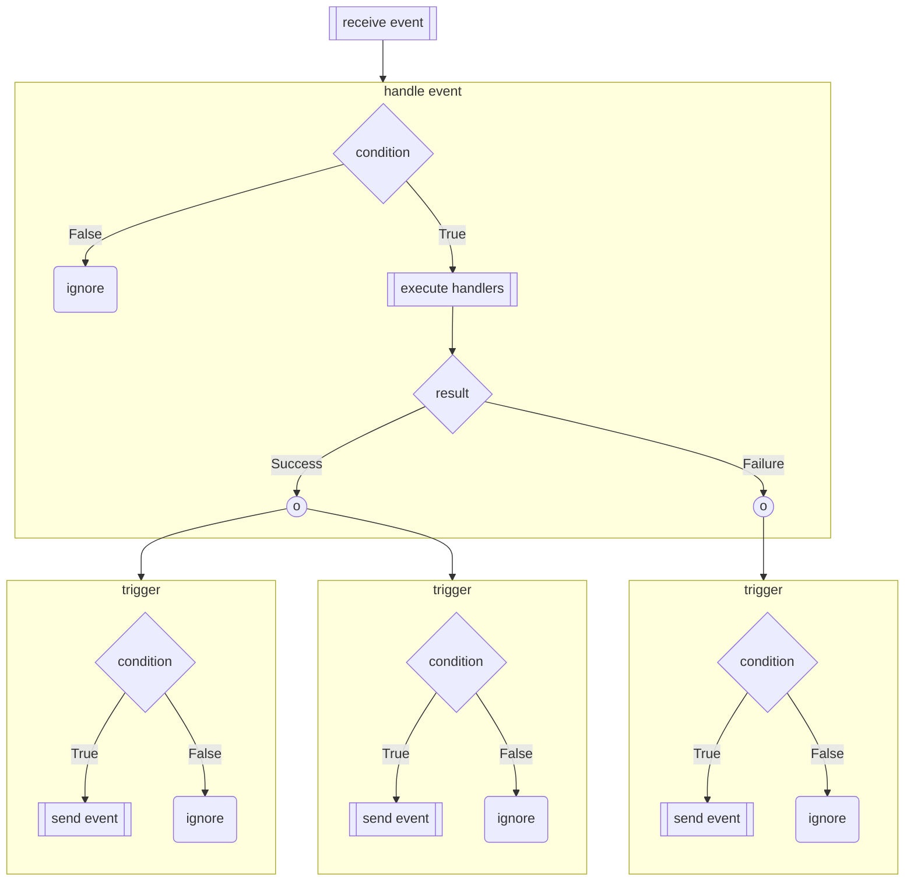
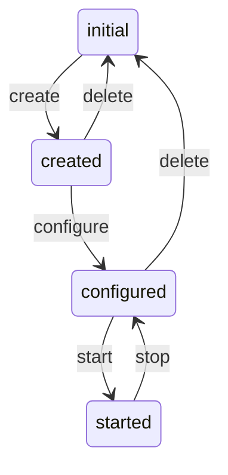
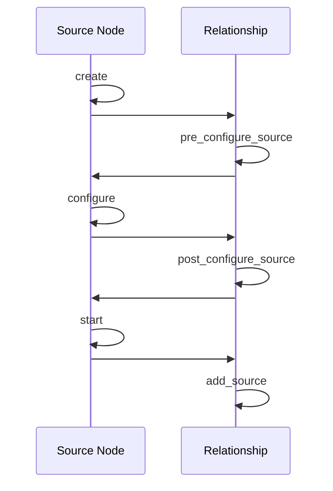
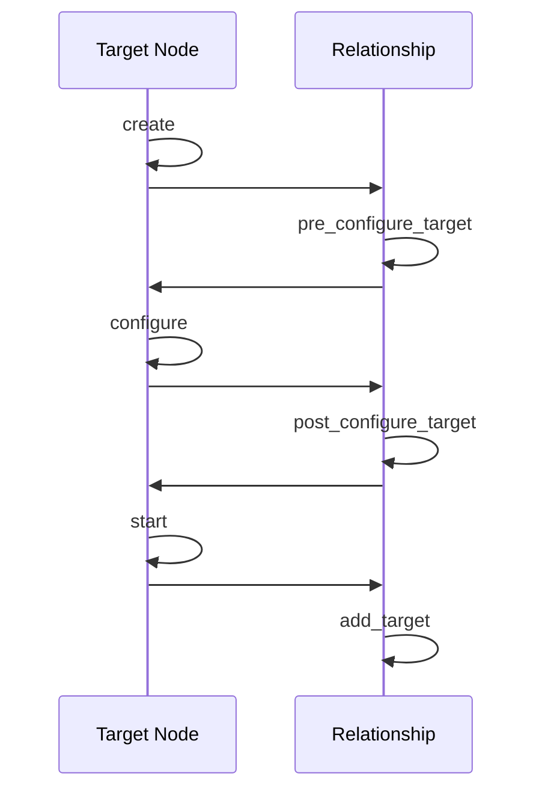

# Unified Event Handling

One of TOSCA's differentiating features is its support for declarative
service lifecycle management based on graph-based service
models. Declarative automation is supported through *declarative
workflows* that are created automatically by the orchestrator based on
dependencies encoded in the service topology graph combined with the
semantics of the standard interface types defined in the Simple
Profile. In addition, TOSCA also supports *imperative workflows* for
defining lifecycle management actions. And finally, TOSCA supports
*policy triggers* intended to support closed-loop automation. Each of
these pieces of functionality uses different grammar elements that are
somewhat overlapping. TOSCA v2.0 introduces a unified framework that
harmonizes these various pieces of TOSCA functionality and broadens
the scope of supported lifecycle management actions in the process.

## Motivation
The lifecycle management framework introduced in TOSCA v2.0 is
motivated by a number of obervations. 

- TOSCA Simple Profile in YAML v1.x supports automatically-generated
  *declarative workflows* based on operation sequencing and
  interleaving rules associated with the *normative interface types*
  defined in the standard. TOSCA v2.0 no longer includes these
  normative types definitions. This has a number of implications:
  - The Orchestrator no longer has built-in knowledge of the state
    machines associated with interfaces defined in
    TOSCA. Specifically, it does not know how operations in an
    interface must be sequenced to achieve a desired ("intended")
    outcome. New grammar is required to allow profile designers to
    define state machines associated with their interface types.
  - The Orchestrator no longer has built-in knowledge of how to
    interleave operations on one node with operations on relationships
    in and out of that node, or with operations of other nodes with
    which that node has relationships. New grammar is requied to allow
    component designers to specify these local sequencing behaviors
    based on intented outcomes.

  When service designers combine nodes and relationships into a
  service topology graph, end-to-end service lifecycle management
  behavior *emerges* by combining the various localized behaviors
  defined in node and relationship types.
- Lifecycle management in TOSCA v1.x focuses almost exclusively on Day
  0 service design and Day 1 service orchestration. The TOSCA 1.x
  standard makes an implicit assumption that service templates are
  designed primarily for the purpose of deploying (and potentially
  undeploying) services as follows:
  - *Deploying* a service involves instantiating a *service
    representation* from a service template, fulfilling requirements
    if necessary, performing substitutions if necessary, and then
    running the `deploy` workflow (which ideally should be created
    automatically).
  - *Removing* a service involves running the `undeploy` workflow
    (which ideally should be created automatically). The Version 1.3
    spec doesn't state whether substituting services should be
    removed, or whether requirements fulfilled by the orchestrator
    should be *undone*.

  This list is insufficient for full lifecycle management. For example:
  - In practice, operators may want to perform *dry-runs* before
    deploying services. This means that the orchestrator may want to
    separate out a *provisioning* phase from an *activation* phase or
    perform *activation* phases using `noop` operations. How are these
    two different phases invoked and/or executed?
  - There is no discussion about updating or upgrading a running
    service.
  - Version 1.3 includes a `Scalable` capability type but provides no
    mechanism to invoke scaling of components.
  - There is no accommodation for administratively taking components
    out of service.
  
  TOSCA does not provide a formal way for service designers to define
  which other *lifecycle management actions* can be performed on an
  entire service. While some management actions can be provided by
  defining imperative workflows, these workflows provide only limited
  functionality, since they are not able to manipulate the topology
  representation graph. In addition, imperative workflows are defined
  in the context of service templates and thus cannot be packaged as
  reusable components.

  TOSCA v2.0 explicitly broadens its scope to include Day 2 service
  management actions such as modifying, updating, ugrading, moving,
  and scaling of services. This requires mechanisms that allow service
  designers to specify the set of supported service lifecycle
  management actions and for defining the associated implementations.
- While TOSCA v1.x supports *policy triggers*, this functionality
  provides only limited usefulness since the main objective of these
  triggers is to provide closed-loop automation to make sure deployed
  services satisfy desired service objectives. Service assurance is by
  definition a Day 2 service management task, but as explained in the
  previous bullet item, TOSCA v1.x provides little or no grammar for
  defining Day 2 service lifecycle management operations. This
  severely limits the usefulness of closed loop automation.

## Unified Event Handling Framework

The new Service Lifecycle Management framework introduced in TOSCA
v2.0 is based on a *unified event handling* approach that harmonizes
syntax for interface and interface type definitions, for workflow
definitions, and for policy definitions. This syntax uses a basic
pattern as shown in the following figure:

This pattern is used as follows:
- Entities in a TOSCA service topology advertize the ability to
  receive `events`. Events can reflect a requested management
  operation on the associated entity or signal a change in the state
  of entity. Events replace and generalize *interface operations* and
  *interface notifications* supported in the TOSCA v1.x
  standard. Events can be defined on nodes, on relationships, and on
  service templates.
- Each event can optionally define an associated `precondition` that
  is evaluated when the event is received. Preconditions are evaluated
  within the context of the entity that defines the event. The
  precondition must evaluate to `true` for the event to be handled. If
  it evaluates to `false`, the event is ignored. TOSCA does not
  *defer* events for handling at a later point in time. Event
  preconditions generalize the `preconditions` concept associated with
  TOSCA v1.x workflow definitions.
- Receiving an event can result in updating attribute values that are
  accessible in the context within which the event is defined. For
  example, if events are defined within an interface, setting
  interface attributes allows events to drive a state machine
  associated with that interface.
- Each event can also define zero or more more event `handlers` that
  are executed in response to the event if the preconditions evaluates
  to true. Handlers can run scripts or other artifacts. Event handlers
  are a generalization of the `implementation artifacts` supported in
  TOSCA v1.x. Whereas TOSCA v1.x defines `primary` and `dependent`
  implementation artifacts, TOSCA v2.0 defines a single list of
  handles. TOSCA v2.0 also supports per-handler input and output
  definitions.
- If all event handlers executed succesfully, a list of `triggers` are
  run. Triggers conditionally send new events along the service
  topology graph. A list of triggers is defined using the `on_success`
  keyword associated with the event definition. This keyword is a
  generalization of the `on_success` keyword in the TOSCA v1.x
  workflow step grammar. Similarly, an `on_failure` keyword is used to
  define a list of `triggers` that are run if one or more of the event
  handlers fail.
- Trigger events are sent conditionally based on the value of a
  `condition` clause associated with the trigger. If the `condition`
  clause evaluates to `true`, the event is sent. If it evaluates to
  `false`, the trigger is ignored.

Using this model, events are the common construct for delegating control
between entities, similar to how objects in an object-oriented system
interact. Events provide a shared *mechanism* that can be used to
harmonize different pieces of TOSCA functionality. The *event
mechanism* can be used at a *high level* as well as a *low level*, and
it can be used for defining *global* behavior as well as for *local*
behavior.
- The event mechanism can be used to describe interface state machines
  (i.e., the various interface states, the `events` that cause
  transitions between these events, and the `conditions` that must be
  satisfied before events can be handled or before events can be
  propagated across the service topology graph.
- Events enable the creation of reusable components, where the logic
  for managing the lifecycle of a component can largely be defined
  locally within that component based on knowledge (defined in the
  node type) about possible incoming and outgoing relationships of
  that component.
- The *high-level* event handling statements can dictate how these
  low-level mechanisms are used to accomplish *intended* behavior
  (i.e., **intent statements**).
- Global service management behavior emerges as a result of combining
  localized event handling defined in reusable components (i.e. node
  types and relationship types) and as directed by the intent
  statements into complete service topology graphs. In addition,
  triggers can be used as *hooks* for defining additional end-to-end
  logic at the service template level if necessary.

The distributed event handling concept is a generalization of
declarative workflows that provides superior functionality.  The
following sections illustrate in more detail how this is done.

## Defining Interface State Machines

The *unified event handling* mechanism can be used to define the state
machines associated with arbitrary interface types, and to define how
events result in interface state transitions. Interface definitions
define a state machine by defining the following:
- The set of `events` supported by the interface.
- One or more `attributes` that track the current state of the
  interface (as opposed to the state of a node or relationship with
  which the interface is associated).
- For each event, the interface type defines `preconditions` that
  check whether the interface is in a state in which the event can be
  processed. The `precondition` statement must evaluate to `true` in
  order for the event to be handled.
- For each event, the state machine defines the attribute values that
  need to be set to track the state into which the interface
  transitions after receiving the event.
- Interfaces also support the ability to express *intent* using
  additional interface attributes that track the `desired_state` into
  which the interface needs to be transitioned.
- Interface types define triggers that post subsequent events to the
  interface that force it to transition through its state machine
  towards the desired state. The `state` and `desired_state`
  attributes are used in the *trigger conditions* to select the
  necessary events to drive the interface towards its intended state.
  State transitions are triggered whenever the `desired_state`
  attribute value changes or whenever the `state` attribute value
  changes.

The following example shows how the `Standard` interface in the Simple
Profile could be described. The state machine implemented by the
`Standard` interface is shown in the following figure:

The interface definition and the associated state machine can be
expressed using the following grammar:
```yaml
data_types:
  State:
    derived_from: string
    validation:
      $valid_values:
        - $value: []
        - - initial
          - created
          - configured
          - started
          - error
    
interface_types:
  Standard:
    attributes:
      state:
        type: State
      desired_state:
        type: State
    operations:
      create:
        preconditions:
          $equal: [{$get_attribute: [ INTERFACE, state ]}, initial]
        on_success:
          set_state: [ INTERFACE, state, created ]
        on_failure:
          set_state: [ INTERFACE, state, error ]
        triggers:
          - condition: 
              $has_entry: [[ configured, started ], {$get_attribute: [ INTERFACE, desired_state ]}]
            target: INTERFACE
            event: configure
          - condition: 
              $equal: [{$get_attribute: [ INTERFACE, desired_state ]}, initial]
            target: INTERFACE
            event: delete
      configure:
        preconditions:
          $equal: [{$get_attribute: [ INTERFACE, state ]}, created]
        on_success:
          set_attribute: [ INTERFACE, state, configured ]
        on_failure:
          set_state: [ INTERFACE, state, error ]
        triggers:
          - condition: 
              $equal: [{$get_attribute: [ INTERFACE, desired_state ]}, started]
            target: INTERFACE
            event: start
          - condition: 
              $equal: [{$get_attribute: [ INTERFACE, desired_state ]}, initial]
            target: INTERFACE
            event: delete
      start:
        preconditions:
          $equal: [{$get_attribute: [ INTERFACE, state ]}, configured]
        on_success:
          set_attribute: [ INTERFACE, state, started ]
        on_failure:
          set_state: [ INTERFACE, state, error ]
        triggers:
          - condition: 
              $equal: [{$get_attribute: [ INTERFACE, desired_state ]}, configured]
            target: INTERFACE
            event: stop
          - condition: 
              $equal: [{$get_attribute: [ INTERFACE, desired_state ]}, initial]
            target: INTERFACE
            event: delete
      stop:
        preconditions:
          $equal: [{$get_attribute: [ INTERFACE, state ]}, started]
        on_success:
          set_attribute: [ INTERFACE, state, configured]
        on_failure:
          set_state: [ INTERFACE, state, error ]
        triggers:
          - condition: 
              $equal: [{$get_attribute: [ INTERFACE, desired_state ]}, started]
            target: INTERFACE
            event: start
          - condition: 
              $equal: [{$get_attribute: [ INTERFACE, desired_state ]}, initial]
            target: INTERFACE
            event: delete
      delete:
        preconditions:
          $has_entry: [[ created, configured, error ], {$get_attribute: [ INTERFACE, state ]} ]
        on_success:
          set_state: [ INTERFACE, state, initial ]
        on_failure:
          set_state: [ INTERFACE, state, error ]
        triggers:
          - condition: 
              $has_entry: [[ created, configured, started ], {$get_attribute: [ INTERFACE, desired_state ]}]
            target: INTERFACE
            event: create
```
Similarly, the `Configure` interface defined in the Simple Profile
can be defined using this grammar as well. Note that we don't define
`triggers` in the interface type definition, since the interface
operations of the `Configure` interface are intended to be
*interleaved* with interface operations defined in the Standard
interface on node types. This interleaving behavior will be defined in
the node type and relationship type definitions.
```yaml
interface_types:
  Configure:
    attributes:
      source_state:
        type: string
        constraints:
          $valid_values:
            - $value: []
            - - initial
              - configured
              - established
              - added
              - removed
              - error
      target_state:
        type: string
        constraints:
          $valid_values:
            - $value: []
            - - initial
              - configured
              - established
              - added
              - removed
              - error
    operations:
      pre_configure_source:
        preconditions:
          $equal: [{$get_attribute: [ INTERFACE, source_state ]}, initial]
        on_success:
          set_state: [ INTERFACE, source_state, configured ]
        on_failure:
          set_state: [ INTERFACE, source_state, error ]
      pre_configure_target:
        preconditions:
          $equal: [{$get_attribute: [ INTERFACE, target_state ]}, initial]
        on_success:
          set_state: [ INTERFACE, target_state, configured ]
        on_failure:
          set_state: [ INTERFACE, target_state, error ]
      post_configure_source:
        preconditions:
          $equal: [{$get_attribute: [ INTERFACE, source_state ]}, configured]
        on_success:
          set_state: [ INTERFACE, source_state, established ]
        on_failure:
          set_state: [ INTERFACE, source_state, error ]
      post_configure_target:
        preconditions:
          $equal: [{$get_attribute: [ INTERFACE, target_state ]}, configured]
        on_success:
          set_state: [ INTERFACE, target_state, established ]
        on_failure:
          set_state: [ INTERFACE, target_state, error ]
      add_target:
        preconditions:
          $equal: [{$get_attribute: [ INTERFACE, target_state ]}, established]
        on_success:
          set_state: [ INTERFACE, target_state, added ]
        on_failure:
          set_state: [ INTERFACE, target_state, error ]
      add_source:
        preconditions:
          $equal: [{$get_attribute: [ INTERFACE, source_state ]}, established]
        on_success:
          set_state: [ INTERFACE, source_state, added ]
        on_failure:
          set_state: [ INTERFACE, source_state, error ]
      remove_target:
        preconditions:
          $equal: [{$get_attribute: [ INTERFACE, target_state ]}, added]
        on_success:
          set_state: [ INTERFACE, target_state, removed ]
        on_failure:
          set_state: [ INTERFACE, target_state, error ]
```
## Defining Reusable Localized Component Behavior

Interface types define state machines for individual interfaces. However:

- Node and relationship types can define multiple interfaces. The
  state machines of these interfaces need to be coordinated.
- The state machines of interfaces of a node need to be coordinated
  with the state machines of the incoming and outgoing relationships
  of that node.
- State machines of interfaces of a node may need to be coordinated
  with that state machines of other nodes with which the node has
  relationships.

The interface definitions in node types and relationship types are
responsible for this coordination by *refining* the preconditions
associated with interface events and by adding additional event
triggers. As a result, interface definitions create *localized*
component behaviors that are effectively *fine grained*
workflows. These mini-workflows specify local behaviors for
interleaving operations defined in node types with with interface
operations defined in the relationship types.  Unlike the *imperative
workflows* in Version 1.x, the localized *mini workflows* specified in
interface definitions have the following characteristics:
- They apply to all nodes of a specific type, rather that to specific
  nodes in a service template.
- Events can be propagated based on the types used in requirement
  definitions and capability definitions without needing to identify
  specific target nodes by name.

When nodes and relationships are organized in a service topology
graph, these fine grained workflows propagate events across tge graph
which causes end-to-end behavior to emerge. This *emergent behavior*
is a generalization of the automatically created declarative workflows
of TOSCA v1.x.

The remainder of this section illustrates how operations of interfaces
defined in relationship types could be interleaved with interface
operations defined on source and target nodes of this relationship. We
use the `Standard` and `Configure` interface types defined in the
Simple Profiles as example.

The desired interleaving between interface operations on a
relationship and interface operations on the source node of that
relationships is shown in the following figure:

Similarly, the interleaving between interface operations on a
relationship and interface operations on the target node of that
relationship is shown in the following figure:

To correctly define this desired interleaving, the interface
definitions in the `Root` relationship type and the `Root` node type
must add additional `preconditions` as well as additional
`triggers`. The following shows the definition of the `Configure`
interface in the `Root` relationship type:
```yaml
relationship_types:
  Root:
    valid_source_node_types: [ Root ]
    valid_target_node_types: [ Root ]
    interfaces:
      configure:
        type: Configure
        operations:
          pre_configure_source:
            triggers:
                target: [SELF, SOURCE, INTERFACE,  standard]
                event: configure
          pre_configure_target:
            triggers:
                target: [SELF, TARGET, INTERFACE,  standard]
                event: configure
          post_configure_source:
            triggers:
                target: [SELF, SOURCE, INTERFACE,  standard]
                event: start
          post_configure_target:
            triggers:
                target: [SELF, TARGET, INTERFACE,  standard]
                event: start
```
Note that in this grammar, the `valid_source_node_types` and
`valid_target_node_types` keywords are used to make the orchestrator
aware of the possible types of the nodes at the source and the target
of the `Root` relationship. This allows for validation of the triggers
at design time.

The following shows alternative syntax for sending events. In this
syntax, the `target` and the 'event` are combined into a single `TOSCA
Path` expression. This syntax has the advantage that it can identify
*groups of nodes* or *groups of relationships* to which to send
events.

```yaml
#for each nodes of types [tosca.nodes.nfv.VNF]
  #for each entry in node_activities
    #for each event/operation add this to the event definition:
      instantiate:
        precondition:
          $and:
            - $equal: [{$get_attribute: [ INTERFACE, vnf_lcm, state ]}, initial]
            - $not: {$has_entry: [{get_attribute: [SELF, RELATIONSHIP, dependsOn, ALL, TARGET, INTERFACE, vnf_lcm, state]}, "initial"]}     
        on_entry:
          - set_attribute: [[SELF, INTERFACE, interface_name, state], instantiating]
        on_success:
          - set_attribute: [[SELF, INTERFACE, interface_name, state], instantiated]
          - trigger:
            - condition: true
              event: [SELF, CAPABILITY, Dependency, RELATIONSHIP, ALL, SOURCE, INTERFACE, vnf_lcm, OPERATION, instantiate]
        on_failure:
          #here comes the content of on_failure
```
An alternative grammar use a `set` keyword instead of `set_attribute`:
```yaml
#for each nodes of types [tosca.nodes.nfv.VNF]
  #for each entry in node_activities
    #for each event/operation add this to the event definition:
      instantiate:
        precondition:
          $and:
            - $equal: [{$get_state: state}, initial]
            - $not: {$has_entry: [{get_attribute: [SELF, RELATIONSHIP, dependsOn, ALL, TARGET, INTERFACE, vnf_lcm, state]}, "initial"]}     
        on_entry:
          - set: [state1, instantiating]
        on_success:
          - set: [state2, instantiated]
          - trigger:
            - condition: true
              event: [SELF, CAPABILITY, Dependency, RELATIONSHIP, ALL, SOURCE, INTERFACE, vnf_lcm, OPERATION, instantiate]
        on_failure:
          #here comes the content of on_failure
```
The interface definitions in *node types* can be slightly more
complicated than the interface definitions in *relationship types*
since:
- Nodes can define multiple requirements, each of which can result in
  multiple relationships of various types.
- Nodes can define multiple capabilities, each of which can be
  targeted by multiple relationships of various types.

An example is shown in the following figure:

This has the following implications:
- `triggers` may need to send events to multiple relationships where
  the exact number of those relationships cannot be determined from
  the requirement definitions and capability definitions in the node
  type.
- `preconditions` may need to check state variables of multiple
  relationships where the exact number of those relationships cannot
  be determined from the the requirement definitions and capability
  definitions in the node type.

To accommodate these scnearios, we introduce the following new
function:

- `$for_each`: iterate over a list

This function allow us to define the `Standard` interface on the
`Root` node type as follows
```yaml
node_types:
  Root:
    interfaces:
      standard:
        type: Standard
        operations:
          create:
            triggers:
              - target: [SELF, CAPABILITY, ALL, SOURCE] # List of targets
                event: pre_configure_target
          configure:
            preconditions:
              $for_each:
                - @rel_out                              # variable name
                - [SELF, RELATIONSHIP, ALL]]            # list over which to iterate
                - $equal: [{$get_attribute: [ @rel_out, target_state ]}, configured ]
            triggers:
              - target: [SELF, CAPABILITY, ALL, SOURCE]
                event: post_configure_target
```
## Defining Service Lifecycle Management Actions

Events definitions are supported not just in interfaces but also at
the service template level. Service template events provide the
mechanism for service designer to express which lifecycle management
actions can be performed by external management systems or external
operators. Events defined at the service template level provide the
*intent* paradigm in TOSCA: they allow external systems to signal
changes in intended behavior to the Orchestrator.  The event/trigger
pattern is then used to translate *global* service-level intent into
*local* component-level operations by triggering lower-level events on
the nodes and relationships in the service topology.

Service level events formalize a number of implicit assumptions in the
TOSCA v1.x specification. For example:

- The Version 1.3 spec suggests that an operation to *deploy* a
  service returns a set of values as defined in the `outputs` section
  of a service template. This should be formally specified by
  triggering *output* events.
- It should be possible for orchestrators to *asynchronously* generate
  service-related events to external systems. This could support
  *escalation* scenarios where policies defined for a service first
  attempt to recover from failures automatically but escalate to an
  external system (or operator) if the recovery process is
  unsuccesful.
- How should partial failure scnenarios be handled? Retry? Rollback?
  Since there is likely no single approach that works best for all
  application domains, TOSCA should support defining the selected
  approach.

# Event Handling Grammar

## Event Definition
The grammar for defining events is shown in the following table:
|Keyname|Mandatory|Type|Description|
|---|---|---|---|
|precondition|no|boolean |A boolean function that must evaluate to `true` for the event to be handled. If the precondition is `false` the event is ignored.|
|set_state|no|map of values|Interface attribute values to set when the event is received. Keys in the map identify interface attribute values. Values in the map are assigned to the attributes.|
|handlers|no|list of Event Handler Definitions|A list of handlers that are conditionally executed when the event is received.|
|on_success|no|list of Event Trigger Definitions|A list of triggers that can send new events after this event has been handled successfully.|
|on_failure|no|list of Event Trigger Definitions|A list of triggers that can send new events if handling this event has resulted in a failure.|

## Event Handler Definition
The grammar for defining event handlers in event definitions is shown
in the following table:

|Keyname|Mandatory|Type|Description|
| ----- | ------- | ----- | ------- |
|execute|yes|Artifact definition or string|Defines the `artifact` to be executed. The artifact can either be specified using an inline artifact definition or it can be referenced using a string name that references an artifact definition in the node type or node template that includes the Event Handler definition|
|inputs|no|map of parameter assignments|The map of input parameter assignments for the event handler.|
|outputs|no|map of output mappings|The map of output value mappings for the event. Ouput values returned by the event handler are mapped to attributes that are accessible in the context within which the event is defined.|

## Event Trigger Definition

> To be provided

## Comparison with Version 1.x

The following table compares TOSCA v2.0 *unified event handling*
grammar with what's currently in Version 1.3.

|Version 1.x|Version 2.0|Discussion|
|---|---|---|
||interface properties and attributes|Version 1.x interfaces define `operations` and `notifications` only. V2.0 adds support for `properties` and `attributes` in interfaces to allow for interface-specific state variables.|
||INTERFACE|Interface properties or artifacts are identified using the `INTERFACE` keyword in ToscaPath expressions.|
|operations and notifications|events|Operations were intended to be API calls, whereas notifications were intended to be callbacks. Events do away with this distinction since it was never clearly specified how these were intended to be implemented. **TODO**: decide whether to adopt the `events` keyword, revert back to supporting `operations` only, or pick something else entirely such as `actions`|
|operation implementations|handlers|In Version 1.x, implementations of operations and notifications are specified using `artifacts` (that are expected to be processed by a corresponding *artifact processor*). Version 2.0 `handlers` allow implementations to be defined using artifacts, and also using other mechanisms (e.g. by setting attribute values)|
|primary and dependent implementations||v1.3 supports a single `primary` implementation artifact and an ordered list of `dependent` artifacts. Version 2.0 eliminates this distinction and defines a single list of handlers.|
|artifact type|event handler type|Event handler types are a generalization of artifact types. In v1.3, artifact types uniquely identify the artifact processor used to *execute* the artifact. How does an orchestrator know how to *execute* a handler based on handler type?|
|on_success and on_failure|triggers|Version 2.0 `triggers` generalize the `on_success` and `on_failure` keywords of the V1.x policy grammar. They define the events that must (conditionally) be sent after an event has been *handled*. Triggers can be specified in interface types or in interface definitions.|
|actions|handlers and triggers|V1.x workflows and policies can define `actions` that need to be taken after an operation has been executed. Version 2.x splits separates actions into `handlers` that are part of operation implementations (such as setting attribute values) and `triggers` that define how events can be propagated to other nodes in the topology.|
|preconditions|trigger conditions|Version 1.x `preconditions` are evaluated in the context of executing workflow steps. It is unclear what should happen if the precondition evaluates to False. Version 2.0 associates `conditions` with triggers only. Conditions are evaluated after an event has been handled rather than before, and they specify whether execution of an event should result in other events being triggered.|
||service-level events and triggers|Version 2.0 allows events and triggers to be defined at the service (template) level. This addresses a gap in the v1.x specification where no mechanism exists to specify the types of actions that can be taken on a service as a whole.|
 
