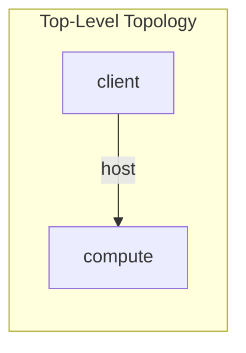
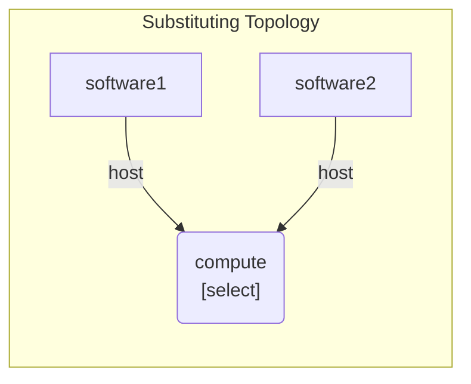
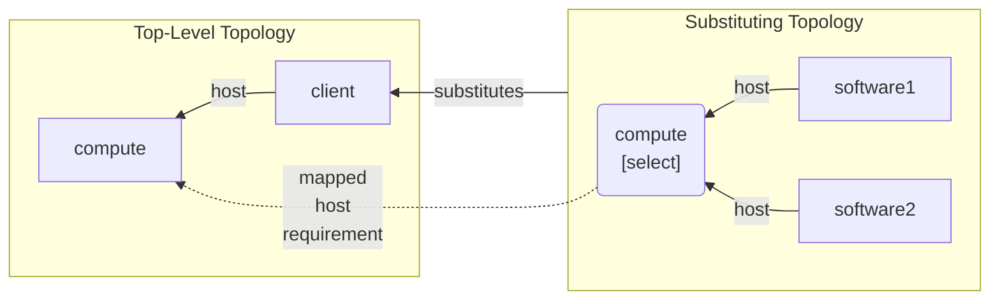

### 15.5.3 Requirement Mapping and Selectable Nodes

The previous section shows a use case where the target node of a
requirement of the substituted node is to be used multiple times as
the target node of multiple different requirements in a subsituting
template. The need for multiple requirements to be fulfilled by the
same target node is quite common and usually exists independently of
whether the service template is used as a substitution or as a
stand-alone service. In fact, the TOSCA *selectable node* feature was
introduced specifically for scenarios where requirements of different
nodes need to be fulfilled using the same target node.

The requirement mapping examples presented so far only show how to map
requirements of a substituted node onto *dangling* requirements of
nodes in the substituting template. This section shows how requirement
mapping can also be used in conjunction with selectable nodes in
substituting templates.

Let's again consider the scenario from the previous section where a
node of type `Client` is hosted on a node of type `Compute:

The following service template shows an implementation of this example:
```yaml
tosca_definitions_version: tosca_2_0
imports:
  - types.yaml
service_template:
  node_templates:
    compute:
      type: Compute
    client:
      type: Client
      directives: [ substitute ]
      requirements:
        - host: compute
```

The following figure shows a substituting topology that *decomposes*
the node of type `Client` into two software components, each of which
needs to be hosted on the same `compute` node. Unlike in the example
in the previous section, a *selectable* node is used to express the
need for both software components to be hosted on the same `compute`
node:



The requirement mappings defined in the corresponding service template
must express that the target node of the `host` requirement of the
substituted node is to be *selected* as the node represented by the
*selectable* `compute` node in the subsituting template, as shown in
the following Figure:



This can trivially be done using the syntax shown in the following
code snippet:

```yaml
tosca_definitions_version: tosca_2_0
imports:
  - types.yaml
node_types:
  ClientSoftware:
    requirements:
      - host:
          capability: Host
          relationship: HostedOn
          count_range: [ 1, 1 ]
service_template:
  substitution_mappings:
    node_type: Client
    requirements:
      - host: compute
  node_templates:
    software1:
      type: ClientSoftware
    software2:
      type: ClientSoftware
    compute:
      type: Compute
      directives: [select]
```

The substitution mapping code in this service template provides an
elegant mechanism to express that the target node of the `host`
requirement of the `client` node is mapped directly to the
*selectable* `compute` node in the substituting template.
