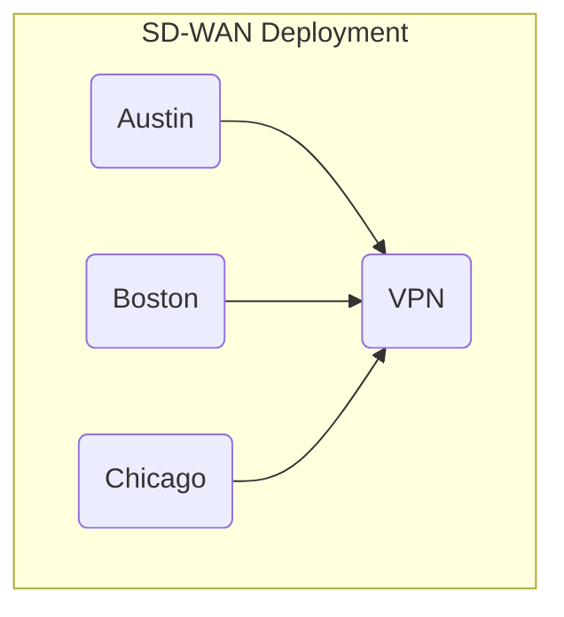
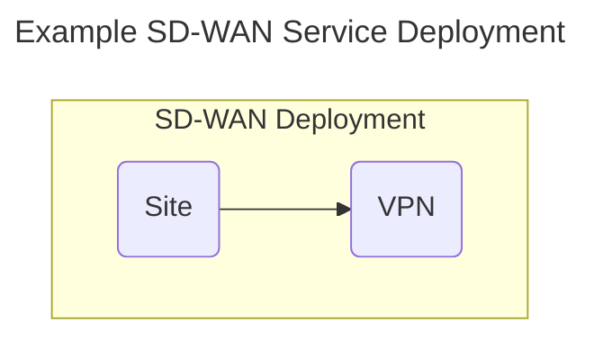
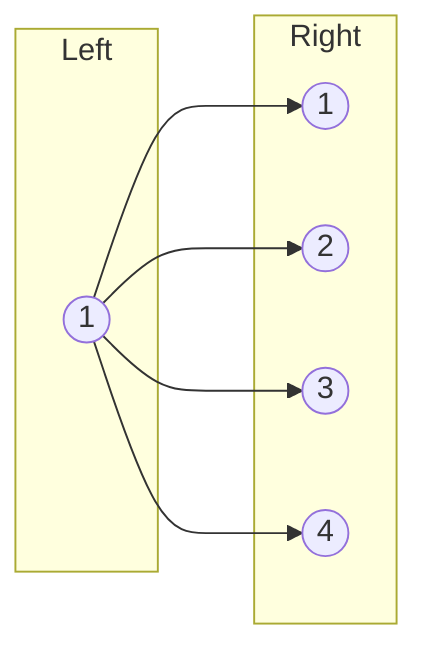
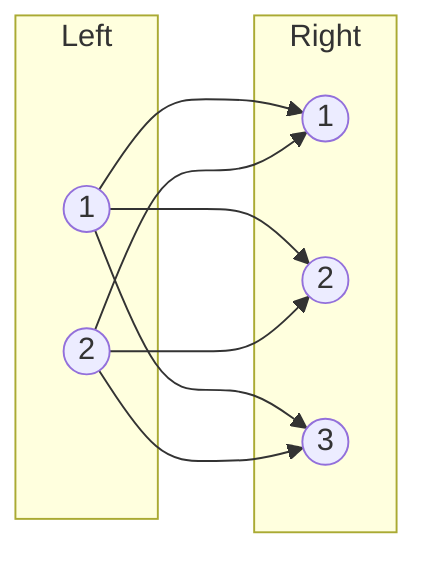
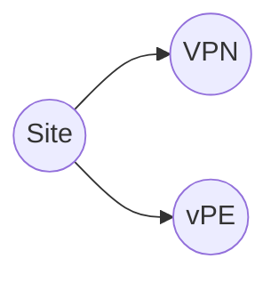
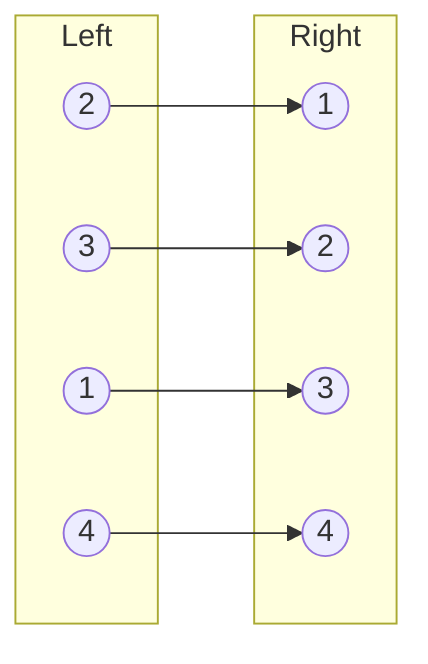
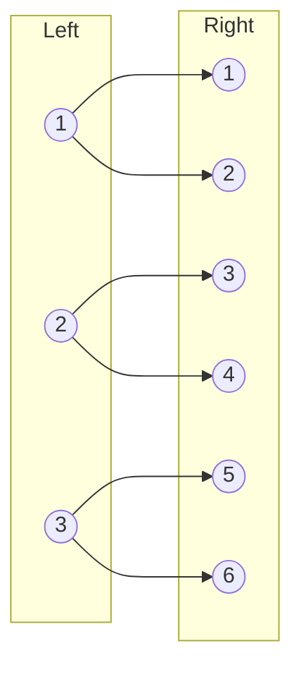
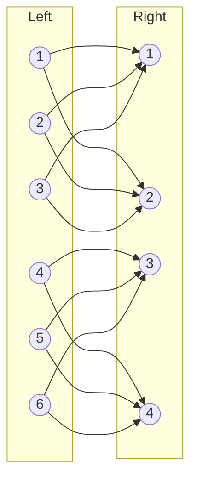

### Creating Multiple Node Representations from the Same Node Template

TOSCA service templates specify a set of nodes that need to be
*instantiated* at service deployment time. Some service templates may
include multiple nodes that perform the same role. For example, a
template that models an SD-WAN service might contain multiple VPN Site
nodes, one for each location that connects to the SD-WAN. Rather than
having to create a separate service template for each possible number
of VPN sites, it is preferable to create a single service template
that allows the number of VPN sites to be specified at deployment time
as an input to the template. This section documents TOSCA language
support for this functionality.

The discussion in this section uses an example SD-WAN with three sites
as shown in the following figure:


The following code snippet shows a TOSCA service template from which
this service can be deployed:

```yaml
tosca_definitions_version: tosca_2_0

description: Template for deploying SD-WAN with three sites.

service_template:
  inputs:
    location1:
      type: Location
    location2:
      type: Location
    location3:
      type: Location
  node_templates:
    sdwan:
      type: VPN
    site1:
      type: VPNSite
      properties:
        location: { $get_input: location1 }
      requirements:
        - vpn: sdwan
    site2:
      type: VPNSite
      properties:
        location: { $get_input: location2 }
      requirements:
        - vpn: sdwan
    site3:
      type: VPNSite
      properties:
        location: { $get_input: location3 }
      requirements:
        - vpn: sdwan
```

As defined here, this template can only be used to deploy an SD-WAN
with three sites. To deploy a different number of sites, additional
service templates must be created, one for each possible number of
SD-WAN sites. This leads to undesirable template proliferation. The
next section presents an alternative.

#### Specifying Number of Node Representations

To avoid the need for multiple service templates, TOSCA allows all VPN
Site nodes to be created from the same Site node template in the
service template. The TOSCA node template definition grammar uses a
`count` keyword that specifies the requested number of runtime
representations for this node template. This `count` keyword is
similar to the `count` keyword in requirement definitions.

The grammar for the `count` keyword is as follows:

| Keyname     | Required | Type    | Constraints                       | Description                                                                                                                           |
|-------------|----------|---------|-----------------------------------|---------------------------------------------------------------------------------------------------------------------------------------|
| count       | no       | integer | when not specified, defaults to 1 | The optional number of nodes in the representation graph that will be created from this node template. If not specified,  one single node is created. |

It is expected that the value of the `count` is provided as an input
to the service template. This enables the creation of a simplified
SD-WAN service template that contains only one single VPN Site node as
shown in the following figure:



An implementation of such a service template is shown in the following
code snippet:

```yaml
tosca_definitions_version: tosca_2_0

description: Template for deploying SD-WAN with a variable number of sites.

service_template:
  inputs:
    number_of_sites:
      type: integer
  
  node_templates:
    sdwan:
      type: VPN
    site:
      type: VPNSite
      count: { $get_input: number_of_sites }
      requirements:
        - vpn: sdwan
```

#### Node-Specific Input Values

The service template in the previous section conveniently ignores the
location property of the Site node. As shown earlier, the location
property is expected to be provided as an input value. If Site node
templates can be instantiated multiple times, then it follows that
multiple input values are required to initialize the location property
for each of the Site node representations.

To allow specific input values to be matched with specific node
template representations, each node is assigned a unique index to
differentiate it from other nodes created from the same node
template. This index is accessed using the `NODE_INDEX` reserved
keyword that references the index of the node in the context of which
the `NODE_INDEX` keyword is used. This keyword can then can be used to
index the list of input values. The grammar for the `NODE_INDEX`
keyword is as follows:

| Keyword     | Valid Contexts | Description                                                                                                                                |
|-------------|----------------|--------------------------------------------------------------------------------------------------------------------------------------------|
| NODE_INDEX | Node Representation | A TOSCA orchestrator will interpret this keyword as the runtime index in the list of node representations created from a single Node Template. |

The `NODE_INDEX` for a node representation is immutable: it never
changes during the lifetime of that node representation, even if node
representations are added or deleted after the service has been
deployed.

The following service template shows how the NODE_INDEX keyword is
used to retrieve specific values from a list of input values in a
service template:

```yaml
tosca_definitions_version: tosca_2_0

description: Template for deploying SD-WAN with a variable number of sites.

service_template:
  inputs:
    number_of_sites:
      type: integer
    location:
      type: list
      entry_schema: Location
  
  node_templates:
    sdwan:
      type: VPN
    site:
      type: VPNSite
      count: { $get_input: number_of_sites }
      properties:
        location: { $get_input: [ location, NODE_INDEX ] }
      requirements:
        - vpn: sdwan
```

> This approach requires that inputs are provided as lists, even if
> only one representation will be created. Should we allow a single value as
> well as a list of values?

> \[Calin\] This is as we see fit, not a problem. If a node is
> supposed to have one “occurrence” in a topology template (which for
> the majority will do), then we use the single value input. If the
> occurrences are more, then we use lists.

#### Cardinality of Relationships

We may also need to accommodate scenarios where a node template with
multiple representations defines a requirement to another node
template that also has multiple representations. This section
introduces grammar for specifying the cardinality of such
requirements. Specific mechanisms depend on the type of the
relationships to be established.

##### Many-to-One Relationships

In the SD-WAN service template above, each of the site node
representations has a relationship to a VPN node that can only be
instantiated once.  This is an example of a *many-to-one* relationship
which is shown in the following figure:

This scenario is supported using existing relationship syntax as
shown in the following code snippet:
```yaml
service_template:
  inputs:
    number_of_left:
      type: integer
  node_templates:
    right:
      type: Right
    left:
      type: Left
      count: {$get_input: number_of_left}
      requirements:
        - uses: right
```
This template specifies that all four node representations created
from the `left` node template must use the one node representation
created from the`right` node template as their target node.

##### One-to-Many Relationships

An example of a *one-to-many* relationship is shown in the following
figure:



*One-to-many* relationships are less common, but they can just as
easily be accommodated using existing TOSCA grammar, as long as the
requirement in the single node specifies the appropriate `count`
value. This is shown in the following code snippet:
```yaml
service_template:
  inputs:
    number_of_right:
      type: integer
  node_templates:
    right:
      type: Right
      count: {$get_input: number_of_right}
    left:
      type: Left
      requirements:
        - uses:
            node: right
            count: {$get_input: number_of_right}
```
In this example, a total number of `count` relationships will be
created from the single `left` node to the group of `right` nodes. The
orchestrator must select a different `right` node for each
relationship.  If the `count` value is not be specified in the `uses`
requirement, it defaults to 1 and the orchestrator will only establish
one single relationship to one of the `right` nodes. Which one of the
`right` nodes is selected is implementation-specific.

##### Full mesh

In a *full mesh* scenario, all nodes on the left establish
relationships to all of the nodes on the right as shown in the
following figure:


Note that the many-to-one and one to-many pattern are just special
cases of a full-mesh when either the number of nodes on the left or
the number of nodes on the right side is 1.

As before, the full mesh scenario can easily be defined using existing
requirement syntax as shown in the following code snippet:

```yaml
service_template:
  inputs:
    number_of_left:
      type: integer
    number_of_right:
      type: integer
  node_templates:
    right:
      type: Right
      count: {$get_input: number_of_right}
    left:
      type: Left
      count: {$get_input: number_of_left}
      requirements:
        - uses:
            node: right
            count: {$get_input: number_of_right}
```

##### Matched Pairs

For some services, representations created from different node
templates must remain matched up in pairs. For example, let’s extend
the SD-WAN service above with a third node template that represents a
virtual PE router that must be used at each site to establish VPN
connections over an underlay. Let’s assume that Site nodes establish a
HostedOn relationship to the vPE nodes. The extended service topology
is shown in the following figure:

In this example, the intent is for each site node to remain paired
with its own vPE node for that site. A generic illustration of the
*matched pairs* scenario is shown in the following figure:


To create matched pairs, the service template designer must first make
sure that the number of nodes on the left matches the number of nodes
on the right by using the same input value for the `count` keynames in
both the `left` and `right` node templates. In addition, each
requirement must correctly match source nodes and target nodes are
matched correctly, which can be accomplished by making sure that a
target node of each relationship has the same `NODE_INDEX` value as
its source node. This following code snippet shows requirement
definition grammar that uses `NODE_INDEX` values to uniquely identify
target nodes:

```yaml
service_template:
  inputs:
    number_of_nodes:
      type: integer
  node_templates:
    right:
      type: Right
      count: {$get_input: number_of_nodes}
    left:
      type: Left
      count: {$get_input: number_of_nodes}
      requirements:
        - uses: [right, NODE_INDEX]
```

##### Random Pairs

Some scenarios require nodes to be organized in pairs, but the
ordering of the nodes is not important. The following figure shows and
such a *random pairs* example:



In this scenario, it is not important how target nodes are paired with
source nodes, as long as each target node is only used once. To make
sure each target node is only used once, the `allocations` keyword in
the requirement can be used as shown in the following code snippet:

```yaml
service_template:
  inputs:
    number_of_nodes:
      type: integer
  node_templates:
    right:
      type: Right
      count: {$get_input: number_of_nodes}
      capabilities:
        feature:
          properties:
            target_count: 1
    left:
      type: Left
      count: {$get_input: number_of_nodes}
      requirements:
        - uses:
            node: right
            allocations:
              target_count: 1
```
This scenario works as follows:

- The target capability in each target node defines a property that is
  intended to restrict how many times that capability can be
  targeted. In the example above, the `right` nodes are the target
  nodes. These nodes define a `feature` capability that in turn
  defines a `target_count` property. The value of this property is set
  to 1 to only allow one single incoming relationship.
- The requirement in each source node includes an `allocations`
  section that allocates a single unit from the target capability. In
  the example above, the `left` nodes define a `uses` requirement that
  allocates a single unit from the `target_count` property in the
  target capability.
- When a relationship is established to a target node, that target
  node's `target_count` property is exhausted and no additional
  incoming relationships will be established. This ensures that each
  target node is only allocated once.

##### Many-to-Many Relationships

The mechanisms introduced above can also be used to define more
complex *many-to-many* scenarios. For example, a 1:2 pattern is shown
in the following figure:


This pattern can be accomplished using the following code snippet:
```yaml
service_template:
  node_templates:
    right:
      type: Right
      count: 6
      capabilities:
        feature:
          properties:
            target_count: 1
    left:
      type: Left
      count: 6
      requirements:
        - uses:
            node: right
            count: 2
            allocations:
              target_count: 1
```
The following figure shows a 3:2 pattern:

This pattern can be implemented using the following code snippet:
```yaml
service_template:
  node_templates:
    right:
      type: Right
      count: 6
      capabilities:
        feature:
          properties:
            target_count: 3
    left:
      type: Left
      count: 6
      requirements:
        - uses:
            node: right
            count: 2
            allocations:
              target_count: 1
```

Finally, there may be scenarios where the multiplicity of the left
nodes and the multiplicity of the right nodes do not allow clean
pairing scenarios. In that case, more complicated expressions might be
needed to specify target node indices or to restrict capacity.  For
example, if nodes are expected to be paired but there are more nodes
on the left that on the right, some nodes The following code snippet
shows a *mismatched pairs* example where the orchestrator may have to
cycle through the target nodes multiple times:

```yaml
service_template:
  inputs:
    number_of_right:
      type: integer
    number_of_left:
      type: integer
  node_templates:
    right:
      type: Right
      count: {$get_input: number_of_right}
    left:
      type: Left
      count: {$get_input: number_of_left}
      requirements:
        - uses: [right, {$remainder: [NODE_INDEX, {$get_input: number_of_right}]
```
