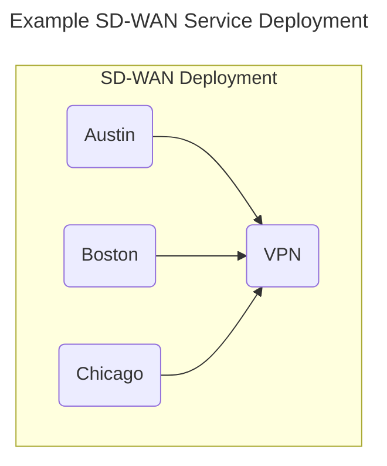
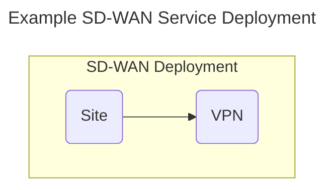
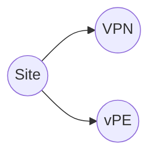
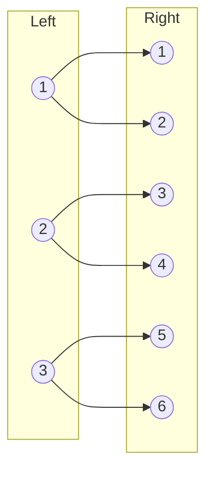
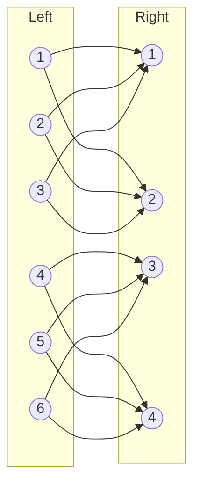
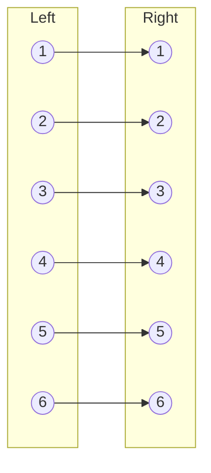

# Creating Multiple Node Instances from the Same Node Template

TOSCA service templates specify a set of nodes that need to be
instantiated at service deployment time. Some service templates may
include multiple nodes that perform the same role. For example, a
template that models an SD-WAN service might contain multiple VPN Site
nodes, one for each location that accesses the SD-WAN. Rather than
having to create a separate service template for each possible number
of VPN sites, it is preferable to create a single service template
that allows the number of VPN sites to be specified as an input to the
template at deployment time. This section documents TOSCA language
support for this functionality.

The discussion in this section uses an example SD-WAN deployment to
three sites as shown in the following figure:



The following code snippet shows a TOSCA service template from which
this service could have been deployed:

```yaml
tosca_definitions_version: tosca_2_0

description: Template for deploying SD-WAN with three sites.

service_template:
  inputs:
    location1:
      type: Location
    location2:
      type: Location
    location3:
      type: Location
  node_templates:
    sdwan:
      type: VPN
    site1:
      type: VPNSite
      properties:
        location: { get_input: location1 }
      requirements:
        - vpn: sdwan
    site2:
      type: VPNSite
      properties:
        location: { get_input: location2 }
      requirements:
        - vpn: sdwan
    site3:
      type: VPNSite
      properties:
        location: { get_input: location3 }
      requirements:
        - vpn: sdwan
```

As defined here, this template can only be used to deploy an SD-WAN
with three sites. To deploy a different number of sites, additional
service templates must be created, one for each number of possible
SD-WAN sites. This leads to template proliferation, which is
undesirable. The next section presents an alternative.

## Specifying Number of Node Instances

To avoid the need for multiple service templates, TOSCA allows all VPN
Site nodes to be created from the same Site node template in the
service template. The TOSCA node template definition grammar uses a
`count` keyword that specifies the requested number of runtime
instances for this node template. The grammar for the `count` keyword
is as follows:

| Keyname     | Required | Type    | Constraints                       | Description                                                                                                                           |
|-------------|----------|---------|-----------------------------------|---------------------------------------------------------------------------------------------------------------------------------------|
| count       | no       | integer | when not specified, defaults to 1 | The optional number of instances that will be created from this node template. If not specified, only one single instance is created. |

It is expected that the value of the `count` is provided as an input
to the service template. This enables the creation of a simplified
SD-WAN service template that contains only one single VPN Site node as
shown in the following figure:



An implementation of such a service template is shown in the following
code snippet:

```yaml
tosca_definitions_version: tosca_2_0

description: Template for deploying SD-WAN with a variable number of sites.

service_template:
  inputs:
    numberOfSites:
      type: integer
  
  node_templates:
    sdwan:
      type: VPN
    site:
      type: VPNSite
      count: { $get_input: numberOfSites }
      requirements:
        - vpn: sdwan
```

## Node-Specific Input Values

The service template in the previous section conveniently ignores the
location property of the Site node. As shown earlier, the location
property is expected to be provided as an input value. If Site node
templates can be instantiated multiple times, then it follows that
multiple input values are required to initialize the location property
for each of the Site node instances.

To allow specific input values to be matched with specific node
template instances, each node is assigned a unique index to
differentiate it from other nodes created from the same node
template. This index is accessed using the `NODE_INDEX` reserved
keyword that references the index of the node in the context of which
the `NODE_INDEX` keyword is used. This keyword can then can be used to
index the list of input values. The grammar for the `NODE_INDEX`
keyword is as follows:


| Keyword     | Valid Contexts | Description                                                                                                                                |
|-------------|----------------|--------------------------------------------------------------------------------------------------------------------------------------------|
| NODE_INDEX | Node Template  | A TOSCA orchestrator will interpret this keyword as the runtime index in the list of node occurrences created from a single Node Template. |

The following service template shows how the NODE_INDEX keyword is
used to retrieve specific values from a list of input values in a
service template:

```yaml
tosca_definitions_version: tosca_2_0

description: Template for deploying SD-WAN with a variable number of sites.

service_template:
  inputs:
    numberOfSites:
      type: integer
    locations:
      type: list
      entry_schema: Location
  
  node_templates:
    sdwan:
      type: VPN
    site:
      type: VPNSite
      count: { $get_input: numberOfSites }
      properties:
        location: { $get_input: [ locations, NODE_INDEX ] }
      requirements:
        - vpn: sdwan
```

> This approach requires that inputs are provided as lists, even if
> only one instance will be created. Should we allow a single value as
> well as a list of values?

> \[Calin\] This is as we see fit, not a problem. If a node is
> supposed to have one “occurrence” in a topology template (which for
> the majority will do), then we use the single value input. If the
> occurrences are more, then we use lists.

> Do nodes keep the same index for their entire lifecycle? What if one
> instance is deleted at runtime. Do all other nodes keep their index?
> What if a new node instance is created at runtime? Does it get the
> next available index at the end of the list, or does it try to fill
> any holes in the list?

> \[Calin\] Yes, the nodes keep the same OCCUR_INDEX their whole
> lifetine. I mean they represent a fixed unmutable multiplicity
> (different sites, different HW blades, different Windows
> installations with licenses, etc.). The instace in the instance
> model will never be deleted, the real-world instance mey be
> terminated, re-started, etc, but the instance in the instance model
> will stay. Now in the case of an update/upgrade this may change, but
> it’s no different from the nodes with a single occurrence.

> \[Calin\] Note also that there is no reason to constrain the
> occurences keyword. I mean in the usual topology templates we can
> create as many nodes from a type as we want, the type creator cannot
> constrain that. If we want to constrain the occurences that we can
> create, then let’s put constraints on the input that will be
> assigned to the occurences keyword.

## Cardinality of Relationships

We may also need to accommodate scenarios where a node template that
can have multiple instances has a relationship to another node
template that can also have multiple instances, but the number of
instances for each node differs.

This section introduces mechanisms for specifying the cardinality of
the relationship when multiple source node instances establish
relationships to multiple target node instances.

When multiple node instances can be created from the same node template,
the service template designer must also have control over the
cardinality of relationships established to and from those nodes.
Specific mechanisms depend on the type of the relationship.

### Many-to-One Relationships

In the SD-WAN service template above, each of the site node instances
has a relationship to a VPN node that can only be instantiated once.
This is an example of a *many-to-one* relationship, which can be readily
supported using existing relationship syntax. Of course, care must be
taken to ensure that the capability in the single node that terminates
the relationships allows multiple occurrences.

### One-to-Many Relationships

*One-to-many* relationships are less common, but they can just as easily
be accommodated using existing TOSCA grammar, as long as the requirement
in the single node accommodates multiple occurrences.

### Matched Pairs

For some services, instances of different node templates that have a
relationship between them must remain matched up in pairs. For example,
let’s extend the SD-WAN service above with a third node template that
represents a virtual PE router that must be used at each site to
establish VPN connections over an underlay. Let’s assume that Site nodes
establish a HostedOn relationship to the vPE nodes. The extended service
topology is shown in the following figure:



In this example, the intent is for each site node to remain paired with
its own vPE node for that site. To accomplish this, the service template
designer must first make sure that the number of vPE instances is the
same as the number of Site instance by using the same input value for
the **count** keynames in both the **vpe** and **site** node templates.

### Full mesh

In the end there are only two types of relationship pattersn: pairs
and full-mesh (the many-to-one and one to-many pattern are just the
full-mesh when the left side or the right side is 1). The full mesh
can be defined as below:

```yaml
#defining a full mesh:
left_nodes:
  …
  requirements:
    - multi_rel:
        node: right_nodes
        count: { get_input: nr_on_right }
```

### Many-to-Many Relationships

We can use TOSCA_PATH when defining the requirements. Let’s take the
following overall example:

```yaml
topology_template:
  inputs:
    nr_on_left:
      type: integer
    nr_on_right:
      type: integer
  
  node_templates:
    right_nodes:
      type:RightType
      count: { get_input: nr_on_right }
    left_nodes:
      type:LeftType
      count: { get_input: nr_on_left }
      requirements:
        …
```

### Pairs

For pairs we can have an x-to-y pairing (the most used will be the
1-to-1 pairing, but we might have also 2-to-1, or 1-to-2, or 3-to-5). So
a 1:2 and a 3:2 pattern will look like:



```yaml
#defining a 1:2 pattern
left_nodes:
  …
  requirements:
    - multi_rel:
        node: right_nodes
        count: 2
        allocation:
          properties:
            pattern: 1
            #note that the initial pattern property capacity is 1
```


```yaml
#defining a 3:2 pattern
left_nodes:
  …
  requirements:
    - multi_rel:
        node: right_nodes
        count: 2
        allocation:
          properties:
            pattern: 1
            #note that the initial pattern property capacity is 3

```

A second relevant choice is if the relationips are established in a
ordered way (e.g. I pair the New York rack with a new York power source,
and the LA rack with the LA power source) or random (i.e. pair a scale
instance of the transcoder to a scale instance of the stream analytics
engine). For example an ordered \[1, 1\] pair vs a random \[1, 1\] pair:


```yaml
#defining a 1:1 ordered pattern
left_nodes:
  …
  requirements:
    - multi_rel:
        node: [right_nodes, {$remainder: [INDEX, {get_input: nr_on_right}]
        count: 1
        allocation:
          properties:
            pattern: 1
            #note that the initial pattern property capacity is 1

```

```yaml
#defining a 1:1 random pattern
left_nodes:
  …
  requirements:
    - multi_rel:
        node: right_nodes
        count: 1
        allocation:
          properties:
            pattern: 1
            #note that the initial pattern property capacity is 1

```

Finally, what do we do if the multiplicity on the left or the right
side does not fit the pairing pattern?

If there are more nodes on the right side than needed then some of
their potential relationships will remain not established. This should
be ok if we specify just optional assignments.

If there are more nodes on the left side, then we need to increase the
allocation capacity on the right side. In the random case some nodes
on the right side might not get a relationship while some can get
more. In the ordered case as shown above all will get first a
relationship before the second is filled.
